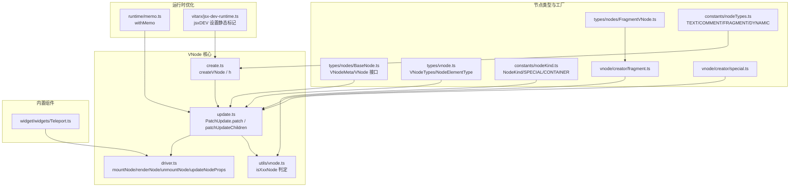
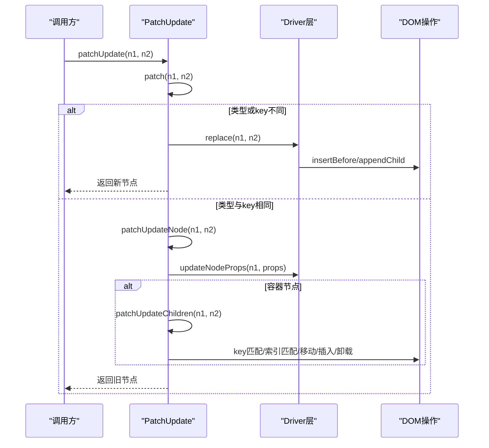
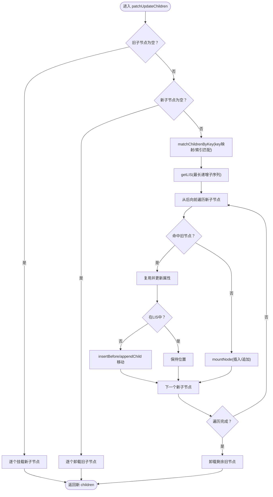
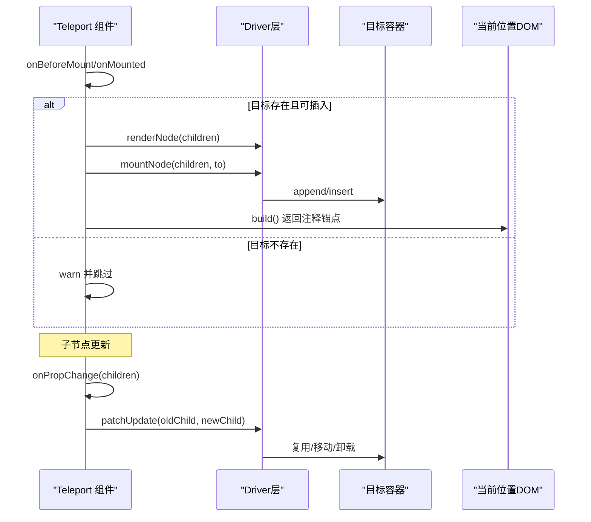
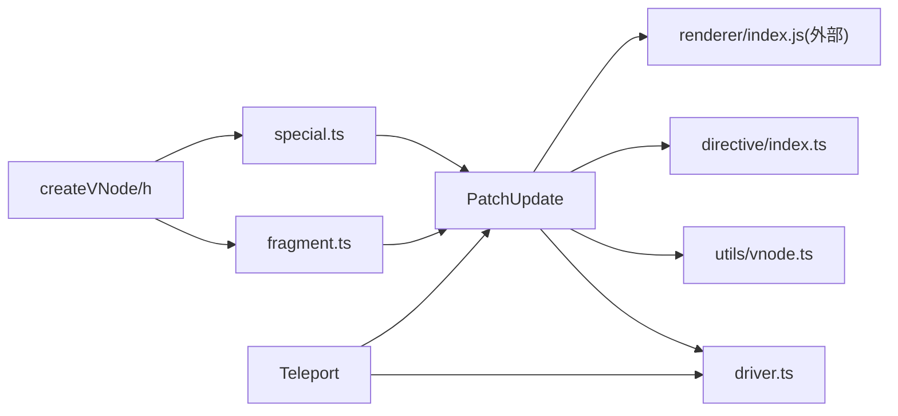

# Diff 算法与更新策略

<cite>
**本文引用的文件**
- [packages/runtime-core/src/vnode/core/update.ts](file://packages/runtime-core/src/vnode/core/update.ts)
- [packages/runtime-core/src/vnode/core/create.ts](file://packages/runtime-core/src/vnode/core/create.ts)
- [packages/runtime-core/src/vnode/core/driver.ts](file://packages/runtime-core/src/vnode/core/driver.ts)
- [packages/runtime-core/src/vnode/core/utils.ts](file://packages/runtime-core/src/vnode/core/utils.ts)
- [packages/runtime-core/src/vnode/creator/fragment.ts](file://packages/runtime-core/src/vnode/creator/fragment.ts)
- [packages/runtime-core/src/vnode/creator/special.ts](file://packages/runtime-core/src/vnode/creator/special.ts)
- [packages/runtime-core/src/widget/widgets/Teleport.ts](file://packages/runtime-core/src/widget/widgets/Teleport.ts)
- [packages/runtime-core/src/types/nodes/BaseNode.ts](file://packages/runtime-core/src/types/nodes/BaseNode.ts)
- [packages/runtime-core/src/types/nodes/FragmentVNode.ts](file://packages/runtime-core/src/types/nodes/FragmentVNode.ts)
- [packages/runtime-core/src/types/vnode.ts](file://packages/runtime-core/src/types/vnode.ts)
- [packages/runtime-core/src/utils/vnode.ts](file://packages/runtime-core/src/utils/vnode.ts)
- [packages/runtime-core/src/constants/nodeKind.ts](file://packages/runtime-core/src/constants/nodeKind.ts)
- [packages/runtime-core/src/constants/nodeState.ts](file://packages/runtime-core/src/constants/nodeState.ts)
- [packages/runtime-core/src/constants/nodeTypes.ts](file://packages/runtime-core/src/constants/nodeTypes.ts)
- [packages/runtime-core/src/directive/index.ts](file://packages/runtime-core/src/directive/index.ts)
- [packages/runtime-core/src/runtime/memo.ts](file://packages/runtime-core/src/runtime/memo.ts)
- [packages/vitarx/src/jsx-dev-runtime.ts](file://packages/vitarx/src/jsx-dev-runtime.ts)
</cite>

## 目录
1. [简介](#简介)
2. [项目结构](#项目结构)
3. [核心组件](#核心组件)
4. [架构总览](#架构总览)
5. [详细组件分析](#详细组件分析)
6. [依赖分析](#依赖分析)
7. [性能考量](#性能考量)
8. [故障排查指南](#故障排查指南)
9. [结论](#结论)
10. [附录](#附录)

## 简介
本技术文档围绕 Vitarx 的 Diff 算法与更新策略展开，系统阐述 update 函数如何比较新旧 VNode 树，重点覆盖：
- key 匹配机制与双端比较算法的应用场景及性能优势
- 不同节点类型（元素、文本、组件、片段、注释）的更新策略差异
- Fragment 节点的“无容器”更新逻辑
- Teleport（Portal）节点如何跨层级移动 DOM 而不影响组件树结构
- 静态节点提升、v-memo 记忆化等编译期优化如何减少运行时 Diff 开销

## 项目结构
Vitarx 的 Diff 与更新逻辑主要集中在 runtime-core 的 vnode 与 widget 子系统中，配合渲染驱动层与类型系统，形成从 VNode 创建、属性更新、子节点 Diff 到 DOM 操作的完整链路。

图表来源
- [packages/runtime-core/src/vnode/core/update.ts](file://packages/runtime-core/src/vnode/core/update.ts#L1-L391)
- [packages/runtime-core/src/vnode/core/create.ts](file://packages/runtime-core/src/vnode/core/create.ts#L1-L159)
- [packages/runtime-core/src/vnode/core/driver.ts](file://packages/runtime-core/src/vnode/core/driver.ts#L1-L143)
- [packages/runtime-core/src/utils/vnode.ts](file://packages/runtime-core/src/utils/vnode.ts#L1-L142)
- [packages/runtime-core/src/types/nodes/BaseNode.ts](file://packages/runtime-core/src/types/nodes/BaseNode.ts#L1-L223)
- [packages/runtime-core/src/types/nodes/FragmentVNode.ts](file://packages/runtime-core/src/types/nodes/FragmentVNode.ts#L1-L17)
- [packages/runtime-core/src/types/vnode.ts](file://packages/runtime-core/src/types/vnode.ts#L1-L195)
- [packages/runtime-core/src/constants/nodeKind.ts](file://packages/runtime-core/src/constants/nodeKind.ts#L1-L26)
- [packages/runtime-core/src/constants/nodeTypes.ts](file://packages/runtime-core/src/constants/nodeTypes.ts#L1-L32)
- [packages/runtime-core/src/vnode/creator/fragment.ts](file://packages/runtime-core/src/vnode/creator/fragment.ts#L1-L24)
- [packages/runtime-core/src/vnode/creator/special.ts](file://packages/runtime-core/src/vnode/creator/special.ts#L1-L36)
- [packages/runtime-core/src/widget/widgets/Teleport.ts](file://packages/runtime-core/src/widget/widgets/Teleport.ts#L1-L165)
- [packages/runtime-core/src/runtime/memo.ts](file://packages/runtime-core/src/runtime/memo.ts#L1-L120)
- [packages/vitarx/src/jsx-dev-runtime.ts](file://packages/vitarx/src/jsx-dev-runtime.ts#L1-L44)

章节来源
- [packages/runtime-core/src/vnode/core/update.ts](file://packages/runtime-core/src/vnode/core/update.ts#L1-L391)
- [packages/runtime-core/src/vnode/core/create.ts](file://packages/runtime-core/src/vnode/core/create.ts#L1-L159)

## 核心组件
- PatchUpdate：Diff 与更新的核心类，负责节点替换、属性更新、子节点 Diff 与 LIS 优化。
- createVNode/h：VNode 创建入口，支持字符串元素、组件、Fragment、Text、Comment、Dynamic 等类型。
- Driver 层：统一的节点驱动注册与调用，封装 mount/render/unmount/updateProps 等操作。
- 节点判定工具：isXxxNode/isContainerNode 等，用于分支更新策略。
- Fragment/特殊节点工厂：FragmentVNode、TextVNode、CommentVNode 的创建与初始化。
- Teleport：跨层级 DOM 移动的内置组件，保持组件树结构不变。
- 运行时优化：withMemo 记忆化、jsxDEV 静态标记，减少不必要的 Diff。

章节来源
- [packages/runtime-core/src/vnode/core/update.ts](file://packages/runtime-core/src/vnode/core/update.ts#L1-L391)
- [packages/runtime-core/src/vnode/core/create.ts](file://packages/runtime-core/src/vnode/core/create.ts#L1-L159)
- [packages/runtime-core/src/vnode/core/driver.ts](file://packages/runtime-core/src/vnode/core/driver.ts#L1-L143)
- [packages/runtime-core/src/utils/vnode.ts](file://packages/runtime-core/src/utils/vnode.ts#L1-L142)
- [packages/runtime-core/src/vnode/creator/fragment.ts](file://packages/runtime-core/src/vnode/creator/fragment.ts#L1-L24)
- [packages/runtime-core/src/vnode/creator/special.ts](file://packages/runtime-core/src/vnode/creator/special.ts#L1-L36)
- [packages/runtime-core/src/widget/widgets/Teleport.ts](file://packages/runtime-core/src/widget/widgets/Teleport.ts#L1-L165)
- [packages/runtime-core/src/runtime/memo.ts](file://packages/runtime-core/src/runtime/memo.ts#L1-L120)
- [packages/vitarx/src/jsx-dev-runtime.ts](file://packages/vitarx/src/jsx-dev-runtime.ts#L1-L44)

## 架构总览
Diff 流程自上而下分为三层：
- 顶层比较：PatchUpdate.patch 对比 type/key，决定更新或替换。
- 属性与子节点更新：patchUpdateProps 与 patchUpdateChildren，后者实现双端匹配与 LIS 优化。
- 驱动层操作：mountNode/renderNode/unmountNode/updateNodeProps 将 VNode 映射到真实 DOM。

图表来源
- [packages/runtime-core/src/vnode/core/update.ts](file://packages/runtime-core/src/vnode/core/update.ts#L53-L152)
- [packages/runtime-core/src/vnode/core/update.ts](file://packages/runtime-core/src/vnode/core/update.ts#L171-L249)
- [packages/runtime-core/src/vnode/core/driver.ts](file://packages/runtime-core/src/vnode/core/driver.ts#L60-L143)

## 详细组件分析

### Diff 核心：PatchUpdate 与双端比较
- 类型与 key 决策：若 type 或 key 不同，直接替换节点；否则进入更新流程。
- 属性更新：统一通过 updateNodeProps 调用对应驱动的 updateProps。
- 容器节点子节点 Diff：
  - 边界处理：空新/旧子节点快速路径。
  - key 匹配：建立新子节点 key 映射，遍历旧子节点匹配；无 key 时按索引匹配。
  - LIS 优化：计算最长递增子序列，仅移动不在 LIS 上的节点，减少 DOM 操作。
  - 从后向前遍历新子节点，复用、移动或挂载；最后卸载不再需要的旧节点。

图表来源
- [packages/runtime-core/src/vnode/core/update.ts](file://packages/runtime-core/src/vnode/core/update.ts#L171-L249)
- [packages/runtime-core/src/vnode/core/update.ts](file://packages/runtime-core/src/vnode/core/update.ts#L268-L315)
- [packages/runtime-core/src/vnode/core/update.ts](file://packages/runtime-core/src/vnode/core/update.ts#L317-L378)

章节来源
- [packages/runtime-core/src/vnode/core/update.ts](file://packages/runtime-core/src/vnode/core/update.ts#L53-L152)
- [packages/runtime-core/src/vnode/core/update.ts](file://packages/runtime-core/src/vnode/core/update.ts#L171-L249)
- [packages/runtime-core/src/vnode/core/update.ts](file://packages/runtime-core/src/vnode/core/update.ts#L268-L378)

### 节点类型与更新策略差异
- 元素节点（Regular/Void Element）：更新 DOM 属性，支持指令 diff。
- 文本节点（Text）：更新值，不包含子节点。
- 注释节点（Comment）：用于调试与占位，不渲染真实元素。
- 组件节点（Widget）：更新组件属性与运行时实例，必要时触发指令 diff。
- 片段节点（Fragment）：容器节点，自身不渲染为 DOM，子节点直接插入父节点；更新时走容器节点的子节点 Diff。
- 动态渲染（Dynamic）：根据 is 动态切换渲染类型，创建对应 VNode。

章节来源
- [packages/runtime-core/src/vnode/core/update.ts](file://packages/runtime-core/src/vnode/core/update.ts#L87-L121)
- [packages/runtime-core/src/vnode/core/create.ts](file://packages/runtime-core/src/vnode/core/create.ts#L29-L136)
- [packages/runtime-core/src/vnode/creator/fragment.ts](file://packages/runtime-core/src/vnode/creator/fragment.ts#L1-L24)
- [packages/runtime-core/src/vnode/creator/special.ts](file://packages/runtime-core/src/vnode/creator/special.ts#L1-L36)
- [packages/runtime-core/src/types/nodes/FragmentVNode.ts](file://packages/runtime-core/src/types/nodes/FragmentVNode.ts#L1-L17)
- [packages/runtime-core/src/constants/nodeTypes.ts](file://packages/runtime-core/src/constants/nodeTypes.ts#L1-L32)

### Fragment 节点的“无容器”更新逻辑
- Fragment 本身不渲染为 DOM 元素，其子节点直接插入父节点。
- 更新时，Fragment 作为容器节点参与子节点 Diff；锚点注释用于标记片段边界，便于 DOM 操作。
- Fragment 的 children 初始化由工厂函数完成，保证子节点规范化。

章节来源
- [packages/runtime-core/src/vnode/creator/fragment.ts](file://packages/runtime-core/src/vnode/creator/fragment.ts#L1-L24)
- [packages/runtime-core/src/types/nodes/FragmentVNode.ts](file://packages/runtime-core/src/types/nodes/FragmentVNode.ts#L1-L17)
- [packages/runtime-core/src/types/nodes/BaseNode.ts](file://packages/runtime-core/src/types/nodes/BaseNode.ts#L120-L148)

### Teleport（Portal）跨层级移动 DOM
- Teleport 将子节点渲染到目标容器（可为选择器或 DOM 元素），但组件树结构仍保留在当前位置。
- 生命周期：
  - onBeforeMount/onMounted：在合适时机挂载到目标容器（支持 defer 延迟）。
  - onDestroy：卸载时从目标容器移除。
  - build：禁用时直接渲染子节点；启用时返回注释锚点标记位置。
- 子节点更新：当 children 发生变化时，若已传送，直接对新旧子节点执行 patchUpdate。

图表来源
- [packages/runtime-core/src/widget/widgets/Teleport.ts](file://packages/runtime-core/src/widget/widgets/Teleport.ts#L83-L165)
- [packages/runtime-core/src/vnode/core/driver.ts](file://packages/runtime-core/src/vnode/core/driver.ts#L60-L143)

章节来源
- [packages/runtime-core/src/widget/widgets/Teleport.ts](file://packages/runtime-core/src/widget/widgets/Teleport.ts#L83-L165)

### 静态节点提升与编译期优化
- 静态标记：VNodeMeta 中的 static 字段用于标记静态节点，更新时可直接跳过 diff。
- jsxDEV：开发模式下通过 jsxDEV 为节点设置静态标记与源码信息，便于调试与优化。
- v-memo：withMemo 提供记忆化能力，缓存构建结果，直到依赖数组变化才重建。

章节来源
- [packages/runtime-core/src/types/nodes/BaseNode.ts](file://packages/runtime-core/src/types/nodes/BaseNode.ts#L30-L66)
- [packages/vitarx/src/jsx-dev-runtime.ts](file://packages/vitarx/src/jsx-dev-runtime.ts#L1-L44)
- [packages/runtime-core/src/runtime/memo.ts](file://packages/runtime-core/src/runtime/memo.ts#L1-L120)

## 依赖分析
- PatchUpdate 依赖：
  - 驱动层：mountNode/renderNode/unmountNode/updateNodeProps
  - 节点判定：isContainerNode/isWidgetNode/isElementNode/isTextNode/isCommentNode/isFragmentNode
  - 渲染器：getNodeDomOpsTarget/getRenderer
  - 指令：diffDirectives
- 节点工厂与类型：
  - createVNode/h：根据 type 分派到不同工厂
  - Fragment/Text/Comment 工厂：创建对应 VNode
  - 类型系统：VNodeTypes/NodeKind/NodeElementType
- 内置组件：
  - Teleport：依赖渲染器与 VNode 驱动，实现跨层级 DOM 移动

图表来源
- [packages/runtime-core/src/vnode/core/update.ts](file://packages/runtime-core/src/vnode/core/update.ts#L1-L391)
- [packages/runtime-core/src/vnode/core/driver.ts](file://packages/runtime-core/src/vnode/core/driver.ts#L1-L143)
- [packages/runtime-core/src/utils/vnode.ts](file://packages/runtime-core/src/utils/vnode.ts#L1-L142)
- [packages/runtime-core/src/vnode/core/create.ts](file://packages/runtime-core/src/vnode/core/create.ts#L1-L159)
- [packages/runtime-core/src/vnode/creator/fragment.ts](file://packages/runtime-core/src/vnode/creator/fragment.ts#L1-L24)
- [packages/runtime-core/src/vnode/creator/special.ts](file://packages/runtime-core/src/vnode/creator/special.ts#L1-L36)
- [packages/runtime-core/src/widget/widgets/Teleport.ts](file://packages/runtime-core/src/widget/widgets/Teleport.ts#L1-L165)

章节来源
- [packages/runtime-core/src/vnode/core/update.ts](file://packages/runtime-core/src/vnode/core/update.ts#L1-L391)
- [packages/runtime-core/src/vnode/core/driver.ts](file://packages/runtime-core/src/vnode/core/driver.ts#L1-L143)
- [packages/runtime-core/src/utils/vnode.ts](file://packages/runtime-core/src/utils/vnode.ts#L1-L142)

## 性能考量
- 双端比较与 LIS 优化：通过 key 匹配与最长递增子序列，显著减少 DOM 移动次数，适合频繁重排的列表场景。
- 静态节点跳过：static 标记可完全跳过 diff，降低运行时开销。
- 记忆化 withMemo：缓存复杂子树，仅在依赖变化时重建，减少昂贵的子树 diff。
- 指令 diff：针对组件/元素节点的指令更新，避免全量属性重算。
- 驱动层统一：通过 getNodeDriver 统一调度，减少分支判断成本。

[本节为通用性能建议，不直接分析具体文件]

## 故障排查指南
- 节点替换失败：当旧节点未挂载且无法替换时会抛出错误。请确认旧节点已渲染或父元素存在。
- Fragment 锚点丢失：Fragment 依赖注释锚点定位，若 DOM 结构被破坏可能导致插入位置异常。
- Teleport 目标无效：目标元素必须可插入且为容器元素；若选择器无效或目标不可用，将发出警告并跳过传送。
- 子节点 key 缺失：无 key 的相邻节点仅按索引匹配，频繁插入/删除会导致大量移动；建议为列表项提供稳定 key。
- 静态节点误判：若静态标记与实际不符，可能导致更新不生效；请在开发模式下使用 jsxDEV 的静态标记辅助定位。

章节来源
- [packages/runtime-core/src/vnode/core/update.ts](file://packages/runtime-core/src/vnode/core/update.ts#L134-L152)
- [packages/runtime-core/src/widget/widgets/Teleport.ts](file://packages/runtime-core/src/widget/widgets/Teleport.ts#L146-L165)
- [packages/vitarx/src/jsx-dev-runtime.ts](file://packages/vitarx/src/jsx-dev-runtime.ts#L1-L44)

## 结论
Vitarx 的 Diff 算法以 PatchUpdate 为核心，结合 key 匹配、双端比较与 LIS 优化，实现了高效稳定的子树更新；通过 Fragment 的“无容器”更新与 Teleport 的跨层级移动，既保持组件树结构清晰，又满足复杂布局需求。配合静态节点提升与 v-memo 记忆化等编译期优化，可在保证开发体验的同时显著降低运行时开销。

[本节为总结性内容，不直接分析具体文件]

## 附录
- 关键 API 路径参考
  - PatchUpdate.patch / patchUpdateChildren：[packages/runtime-core/src/vnode/core/update.ts](file://packages/runtime-core/src/vnode/core/update.ts#L53-L249)
  - createVNode / h：[packages/runtime-core/src/vnode/core/create.ts](file://packages/runtime-core/src/vnode/core/create.ts#L87-L159)
  - mountNode/renderNode/unmountNode/updateNodeProps：[packages/runtime-core/src/vnode/core/driver.ts](file://packages/runtime-core/src/vnode/core/driver.ts#L60-L143)
  - Fragment/Text/Comment 工厂：[packages/runtime-core/src/vnode/creator/fragment.ts](file://packages/runtime-core/src/vnode/creator/fragment.ts#L1-L24)、[packages/runtime-core/src/vnode/creator/special.ts](file://packages/runtime-core/src/vnode/creator/special.ts#L1-L36)
  - Teleport：[packages/runtime-core/src/widget/widgets/Teleport.ts](file://packages/runtime-core/src/widget/widgets/Teleport.ts#L83-L165)
  - 静态标记与 jsxDEV：[packages/runtime-core/src/types/nodes/BaseNode.ts](file://packages/runtime-core/src/types/nodes/BaseNode.ts#L30-L66)、[packages/vitarx/src/jsx-dev-runtime.ts](file://packages/vitarx/src/jsx-dev-runtime.ts#L1-L44)
  - v-memo：[packages/runtime-core/src/runtime/memo.ts](file://packages/runtime-core/src/runtime/memo.ts#L1-L120)