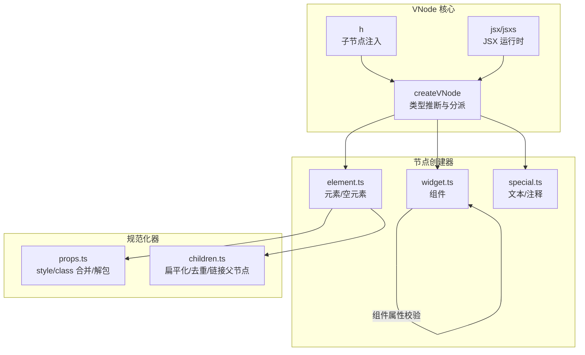
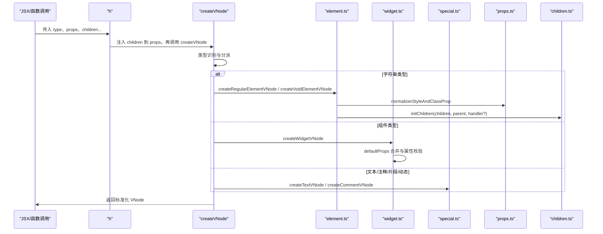
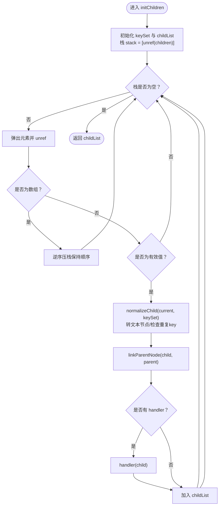
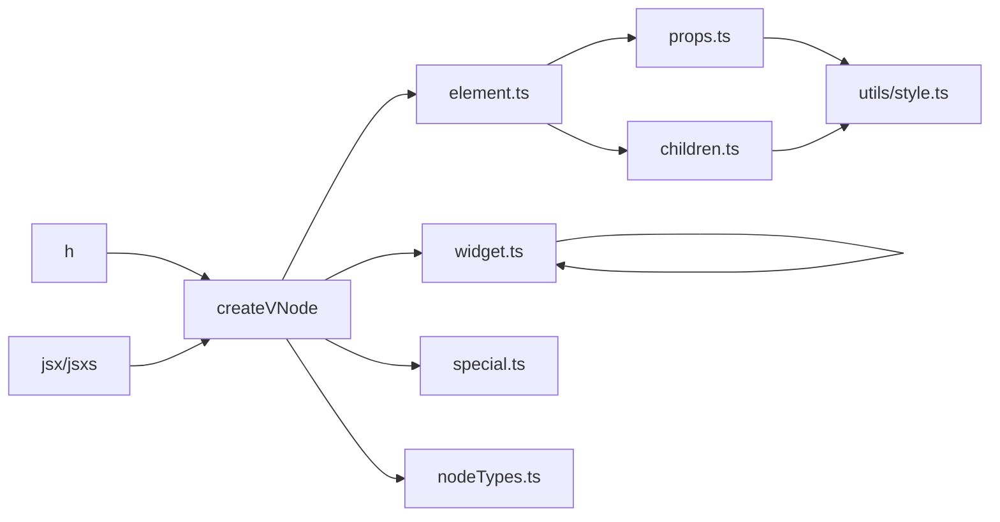

# VNode 创建机制

<cite>
**本文引用的文件**
- [packages/runtime-core/src/vnode/core/create.ts](file://packages/runtime-core/src/vnode/core/create.ts)
- [packages/runtime-core/src/vnode/creator/base.ts](file://packages/runtime-core/src/vnode/creator/base.ts)
- [packages/runtime-core/src/vnode/creator/element.ts](file://packages/runtime-core/src/vnode/creator/element.ts)
- [packages/runtime-core/src/vnode/creator/widget.ts](file://packages/runtime-core/src/vnode/creator/widget.ts)
- [packages/runtime-core/src/vnode/creator/special.ts](file://packages/runtime-core/src/vnode/creator/special.ts)
- [packages/runtime-core/src/vnode/normalizer/children.ts](file://packages/runtime-core/src/vnode/normalizer/children.ts)
- [packages/runtime-core/src/vnode/normalizer/props.ts](file://packages/runtime-core/src/vnode/normalizer/props.ts)
- [packages/runtime-core/src/utils/style.ts](file://packages/runtime-core/src/utils/style.ts)
- [packages/runtime-core/src/types/vnode.ts](file://packages/runtime-core/src/types/vnode.ts)
- [packages/runtime-core/src/types/nodes/BaseNode.ts](file://packages/runtime-core/src/types/nodes/BaseNode.ts)
- [packages/runtime-core/src/types/nodes/RegularElementVNode.ts](file://packages/runtime-core/src/types/nodes/RegularElementVNode.ts)
- [packages/runtime-core/src/types/nodes/StatelessWidgetVNode.ts](file://packages/runtime-core/src/types/nodes/StatelessWidgetVNode.ts)
- [packages/runtime-core/src/constants/nodeTypes.ts](file://packages/runtime-core/src/constants/nodeTypes.ts)
- [packages/vitarx/src/jsx-runtime.ts](file://packages/vitarx/src/jsx-runtime.ts)
</cite>

## 目录
1. [引言](#引言)
2. [项目结构](#项目结构)
3. [核心组件](#核心组件)
4. [架构总览](#架构总览)
5. [详细组件分析](#详细组件分析)
6. [依赖分析](#依赖分析)
7. [性能考量](#性能考量)
8. [故障排查指南](#故障排查指南)
9. [结论](#结论)

## 引言
本文围绕 VNode 的创建流程展开，系统梳理 createVNode 函数的实现逻辑、参数处理、节点初始化与类型推断，并深入解析 props 与 children 的规范化过程（normalization）。我们将结合 h 函数与 JSX 编译产物，说明从 JSX/函数调用到标准化 VNode 的完整转换路径，并解释该过程对后续 Diff 算法效率的影响。

## 项目结构
VNode 创建相关代码主要集中在 runtime-core 的 vnode 子模块，按职责分为三层：
- 核心入口与类型推断：createVNode、h、JSX 运行时
- 节点创建器：element、widget、special、fragment（通过 index 导出）
- 规范化器：props、children

图表来源
- [packages/runtime-core/src/vnode/core/create.ts](file://packages/runtime-core/src/vnode/core/create.ts#L87-L159)
- [packages/runtime-core/src/vnode/creator/element.ts](file://packages/runtime-core/src/vnode/creator/element.ts#L1-L69)
- [packages/runtime-core/src/vnode/creator/widget.ts](file://packages/runtime-core/src/vnode/creator/widget.ts#L1-L174)
- [packages/runtime-core/src/vnode/creator/special.ts](file://packages/runtime-core/src/vnode/creator/special.ts#L1-L36)
- [packages/runtime-core/src/vnode/normalizer/props.ts](file://packages/runtime-core/src/vnode/normalizer/props.ts#L1-L146)
- [packages/runtime-core/src/vnode/normalizer/children.ts](file://packages/runtime-core/src/vnode/normalizer/children.ts#L1-L149)
- [packages/vitarx/src/jsx-runtime.ts](file://packages/vitarx/src/jsx-runtime.ts#L1-L31)

章节来源
- [packages/runtime-core/src/vnode/index.ts](file://packages/runtime-core/src/vnode/index.ts#L1-L9)

## 核心组件
- createVNode：统一入口，负责类型识别、动态组件、特殊节点、元素/空元素、组件节点的创建与分派。
- h：便捷 API，将剩余参数 children 注入 props.children 后委托给 createVNode。
- JSX 运行时：jsx/jsxs 将 JSX 编译为对 createVNode 的调用。
- 规范化器：
  - props.ts：style/class 合并、v-bind 合并、解包 ref/reactive 值、指令解析。
  - children.ts：扁平化 children、去重 key 校验、建立父子关系、SVG 命名空间传播。

章节来源
- [packages/runtime-core/src/vnode/core/create.ts](file://packages/runtime-core/src/vnode/core/create.ts#L87-L159)
- [packages/vitarx/src/jsx-runtime.ts](file://packages/vitarx/src/jsx-runtime.ts#L1-L31)
- [packages/runtime-core/src/vnode/normalizer/props.ts](file://packages/runtime-core/src/vnode/normalizer/props.ts#L1-L146)
- [packages/runtime-core/src/vnode/normalizer/children.ts](file://packages/runtime-core/src/vnode/normalizer/children.ts#L1-L149)

## 架构总览
下面的序列图展示了从 JSX/函数调用到标准化 VNode 的完整链路，以及关键规范化步骤。

图表来源
- [packages/vitarx/src/jsx-runtime.ts](file://packages/vitarx/src/jsx-runtime.ts#L1-L31)
- [packages/runtime-core/src/vnode/core/create.ts](file://packages/runtime-core/src/vnode/core/create.ts#L87-L159)
- [packages/runtime-core/src/vnode/creator/element.ts](file://packages/runtime-core/src/vnode/creator/element.ts#L1-L69)
- [packages/runtime-core/src/vnode/creator/widget.ts](file://packages/runtime-core/src/vnode/creator/widget.ts#L1-L174)
- [packages/runtime-core/src/vnode/creator/special.ts](file://packages/runtime-core/src/vnode/creator/special.ts#L1-L36)
- [packages/runtime-core/src/vnode/normalizer/props.ts](file://packages/runtime-core/src/vnode/normalizer/props.ts#L1-L146)
- [packages/runtime-core/src/vnode/normalizer/children.ts](file://packages/runtime-core/src/vnode/normalizer/children.ts#L1-L149)

## 详细组件分析

### createVNode 实现与类型推断
- 参数处理
  - props 默认值处理：若未传入 props，初始化为空对象，避免后续分支判断。
  - 节点构建器（VNodeBuilder）识别：若 type 为节点构建器，直接调用其返回 VNode。
  - 字符串类型节点：
    - 特殊节点：text、comment、fragment、dynamic 分支创建对应 VNode。
    - 自闭合元素：通过 isVoidTag 判断，走 createVoidElementVNode。
    - 常规元素：走 createRegularElementVNode。
  - 组件类型：通过 isWidget 判断组件类型，走 createWidgetVNode。
  - 报错：非法类型抛出异常。
- 开发期校验：对不支持 children 的节点（如 void 标签、text/comment）若传入 children，发出警告。
- 返回类型：基于 AllowCreatedNodeType 与 VNodeInstanceType 的类型映射，实现精确的类型推断。

章节来源
- [packages/runtime-core/src/vnode/core/create.ts](file://packages/runtime-core/src/vnode/core/create.ts#L87-L159)
- [packages/runtime-core/src/types/vnode.ts](file://packages/runtime-core/src/types/vnode.ts#L132-L168)
- [packages/runtime-core/src/constants/nodeTypes.ts](file://packages/runtime-core/src/constants/nodeTypes.ts#L1-L32)

### h 函数与 JSX 编译
- h 的作用：将剩余参数 children 聚合成 props.children，然后委托给 createVNode。
- JSX 运行时：jsx/jsxs 将 JSX 编译为对 createVNode 的调用，支持 key 注入。
- 二者共同保证了 children 的标准化入口，避免 createVNode 直接从多参数接收子节点，简化类型推断与规范化流程。

章节来源
- [packages/runtime-core/src/vnode/core/create.ts](file://packages/runtime-core/src/vnode/core/create.ts#L146-L159)
- [packages/vitarx/src/jsx-runtime.ts](file://packages/vitarx/src/jsx-runtime.ts#L1-L31)

### 元素节点创建（element.ts）
- 常规元素：创建基础节点后，先进行 style/class 规范化，再从 props 中取出 children，交由 initChildren 扁平化与标准化。
- 空元素：同样先进行 style/class 规范化，但不包含 children。
- SVG 命名空间：在常规元素中，initChildren 可传入 propagateSVGNamespace，递归标记子树为 SVG 元素，确保后续渲染正确。

章节来源
- [packages/runtime-core/src/vnode/creator/element.ts](file://packages/runtime-core/src/vnode/creator/element.ts#L1-L69)
- [packages/runtime-core/src/vnode/normalizer/children.ts](file://packages/runtime-core/src/vnode/normalizer/children.ts#L1-L149)
- [packages/runtime-core/src/vnode/normalizer/props.ts](file://packages/runtime-core/src/vnode/normalizer/props.ts#L1-L146)

### 组件节点创建（widget.ts）
- 默认属性合并：若组件存在 defaultProps，先浅合并到 props。
- 基础节点创建：调用 createBaseVNode，设置 kind 为无状态或有状态组件。
- 开发期属性校验：若组件提供 validateProps，开发模式下执行校验并输出 warn/error。
- 应用上下文：设置 appContext。

章节来源
- [packages/runtime-core/src/vnode/creator/widget.ts](file://packages/runtime-core/src/vnode/creator/widget.ts#L1-L174)

### 文本/注释节点创建（special.ts）
- 文本节点：type 为内置文本标识，直接创建基础节点。
- 注释节点：type 为内置注释标识，直接创建基础节点。

章节来源
- [packages/runtime-core/src/vnode/creator/special.ts](file://packages/runtime-core/src/vnode/creator/special.ts#L1-L36)
- [packages/runtime-core/src/constants/nodeTypes.ts](file://packages/runtime-core/src/constants/nodeTypes.ts#L1-L32)

### props 规范化（props.ts）
- v-bind 合并：
  - 支持对象与数组两种形式：[sourceObj, excludeKeys]。
  - 跳过无效值、框架固有属性、显式排除项。
  - 对于 style/class/className 等特殊属性采用合并策略，避免覆盖。
  - 普通属性遵循就近原则：已有值不覆盖。
- style/class 规范化：
  - style：统一转换为对象格式，便于后续渲染与 diff。
  - class/className：统一为数组并去重，className 合并后删除，确保最终使用 class。
- 指令解析与 v-model：
  - 以 v- 前缀的属性解析为指令，v-model 特殊处理为 modelValue 与 onUpdate:modelValue。
- 解包 ref/reactive 值：对 props 中的值进行 unref，保证属性值稳定。

章节来源
- [packages/runtime-core/src/vnode/normalizer/props.ts](file://packages/runtime-core/src/vnode/normalizer/props.ts#L1-L146)
- [packages/runtime-core/src/utils/style.ts](file://packages/runtime-core/src/utils/style.ts#L1-L173)

### children 规范化（children.ts）
- 扁平化与类型转换：
  - 使用栈迭代处理嵌套数组，避免递归导致的栈溢出。
  - 非 VNode 值统一转为文本节点，保证 children 的一致性。
  - 过滤 null/boolean/undefined 等无效值。
- 去重与校验：
  - 维护 keySet，检测重复 key 并在开发模式下警告。
- 关联与传播：
  - 建立子节点与父节点的父子关系 linkParentNode。
  - 可选 handler（如 propagateSVGNamespace）对子树进行 SVG 命名空间标记。

图表来源
- [packages/runtime-core/src/vnode/normalizer/children.ts](file://packages/runtime-core/src/vnode/normalizer/children.ts#L87-L149)

章节来源
- [packages/runtime-core/src/vnode/normalizer/children.ts](file://packages/runtime-core/src/vnode/normalizer/children.ts#L1-L149)

### 基础节点创建（base.ts）
- 基础节点结构：设置 NON_SIGNAL_SYMBOL、VIRTUAL_NODE_SYMBOL、NodeState.Created、type/kind/appContext 等。
- 特殊属性处理：
  - ref/key/v-static：从 props 中提取并校验有效性。
  - 特殊节点类型：对 props 值进行 unref。
  - 普通节点：执行 v-bind 合并、指令解析、v-model 特殊处理。
- 指令系统：以 v- 前缀解析指令，支持参数（冒号分隔），并将指令映射保存到节点。

章节来源
- [packages/runtime-core/src/vnode/creator/base.ts](file://packages/runtime-core/src/vnode/creator/base.ts#L1-L118)

### 类型系统与节点模型
- VNode 类型体系：
  - VNodeMeta：key、ref、static、memo、directives 等元信息。
  - VNode：type/kind/state/props/el/anchor/appContext/devInfo 等。
  - HostVNode/NonElementVNode/ContainerVNode/ElementVNode/WidgetVNode：按角色细分。
  - RegularElementVNode/StatelessWidgetVNode：具体节点类型接口。
- 类型推断：
  - AllowCreatedNodeType：JSX/函数可用的节点类型集合。
  - VNodeInstanceType：根据类型映射到具体 VNode 实例类型，确保 createVNode/h 的返回类型精确。

章节来源
- [packages/runtime-core/src/types/vnode.ts](file://packages/runtime-core/src/types/vnode.ts#L1-L195)
- [packages/runtime-core/src/types/nodes/BaseNode.ts](file://packages/runtime-core/src/types/nodes/BaseNode.ts#L1-L223)
- [packages/runtime-core/src/types/nodes/RegularElementVNode.ts](file://packages/runtime-core/src/types/nodes/RegularElementVNode.ts#L1-L19)
- [packages/runtime-core/src/types/nodes/StatelessWidgetVNode.ts](file://packages/runtime-core/src/types/nodes/StatelessWidgetVNode.ts#L1-L19)

## 依赖分析
- createVNode 依赖：
  - element.ts/widget.ts/special.ts：按类型创建具体节点。
  - props.ts：对 props 进行解包与合并。
  - children.ts：对 children 进行扁平化与标准化。
  - constants/nodeTypes.ts：识别 text/comment/fragment/dynamic 等特殊节点。
- h 与 JSX 运行时：
  - h 通过 children 聚合后统一走 createVNode。
  - jsx/jsxs 直接调用 createVNode，支持 key 注入。
- 组件校验：
  - widget.ts 依赖 __DEV__ 与 logger 输出校验信息。
- style 工具：
  - props.ts 与 children.ts 依赖 utils/style.ts 的合并与转换能力。

图表来源
- [packages/runtime-core/src/vnode/core/create.ts](file://packages/runtime-core/src/vnode/core/create.ts#L87-L159)
- [packages/runtime-core/src/vnode/creator/element.ts](file://packages/runtime-core/src/vnode/creator/element.ts#L1-L69)
- [packages/runtime-core/src/vnode/creator/widget.ts](file://packages/runtime-core/src/vnode/creator/widget.ts#L1-L174)
- [packages/runtime-core/src/vnode/creator/special.ts](file://packages/runtime-core/src/vnode/creator/special.ts#L1-L36)
- [packages/runtime-core/src/vnode/normalizer/props.ts](file://packages/runtime-core/src/vnode/normalizer/props.ts#L1-L146)
- [packages/runtime-core/src/vnode/normalizer/children.ts](file://packages/runtime-core/src/vnode/normalizer/children.ts#L1-L149)
- [packages/runtime-core/src/constants/nodeTypes.ts](file://packages/runtime-core/src/constants/nodeTypes.ts#L1-L32)
- [packages/vitarx/src/jsx-runtime.ts](file://packages/vitarx/src/jsx-runtime.ts#L1-L31)
- [packages/runtime-core/src/utils/style.ts](file://packages/runtime-core/src/utils/style.ts#L1-L173)

## 性能考量
- props 合并与解包：
  - v-bind 合并避免重复属性设置，减少后续渲染与 diff 的工作量。
  - style/class 合并与标准化，统一对象/字符串/数组格式，降低 diff 比较复杂度。
- children 扁平化与去重：
  - 迭代式扁平化避免深递归栈溢出风险，提升大规模列表渲染稳定性。
  - key 去重校验在开发期暴露潜在问题，避免运行期因重复 key 导致的性能与正确性问题。
- 指令与 ref 解包：
  - 在创建阶段完成解包与指令解析，避免渲染阶段重复计算。
- SVG 命名空间传播：
  - 通过 propagateSVGNamespace 递归标记，减少渲染阶段的额外判断。

[本节为通用性能讨论，无需列出具体文件来源]

## 故障排查指南
- createVNode 报错“invalid node type”
  - 可能原因：传入的 type 不在 AllowCreatedNodeType 范围内。
  - 排查建议：确认组件是否正确导出、JSX 标签名是否拼写正确。
- children 无效或被忽略
  - void 标签不支持 children：开发期会发出警告。
  - 排查建议：将 children 移至容器元素或使用 Fragment 包裹。
- style/class 合并异常
  - 可能原因：传入了 undefined/null 或框架固有属性被误传。
  - 排查建议：检查 v-bind/exclude 列表与属性命名（className/classname）。
- 重复 key 警告
  - 可能原因：同一层级出现相同 key。
  - 排查建议：为列表项提供稳定且唯一的 key。
- v-model 无效
  - 可能原因：v-model 传入的值不是 Ref 类型。
  - 排查建议：确保传入的是 Ref 类型值，以便自动更新。

章节来源
- [packages/runtime-core/src/vnode/core/create.ts](file://packages/runtime-core/src/vnode/core/create.ts#L96-L101)
- [packages/runtime-core/src/vnode/normalizer/props.ts](file://packages/runtime-core/src/vnode/normalizer/props.ts#L37-L84)
- [packages/runtime-core/src/vnode/normalizer/children.ts](file://packages/runtime-core/src/vnode/normalizer/children.ts#L36-L60)
- [packages/runtime-core/src/vnode/creator/base.ts](file://packages/runtime-core/src/vnode/creator/base.ts#L80-L114)

## 结论
VNode 创建流程通过 createVNode 的类型推断与分派，配合 element/widget/special 的专用创建器，以及 props/children 的严格规范化，实现了从 JSX/函数调用到标准化 VNode 的高效转换。props 的解包与合并、children 的扁平化与去重、SVG 命名空间传播等步骤，显著降低了后续 Diff 算法的比较成本，提升了渲染性能与稳定性。开发期的属性校验与重复 key 警告进一步增强了调试体验与运行可靠性。