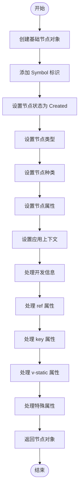
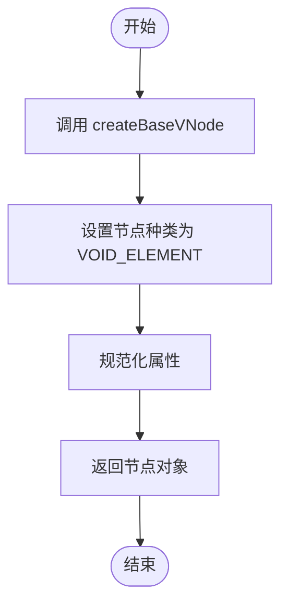
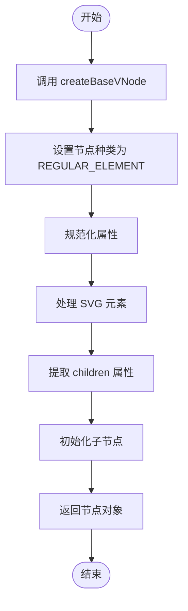
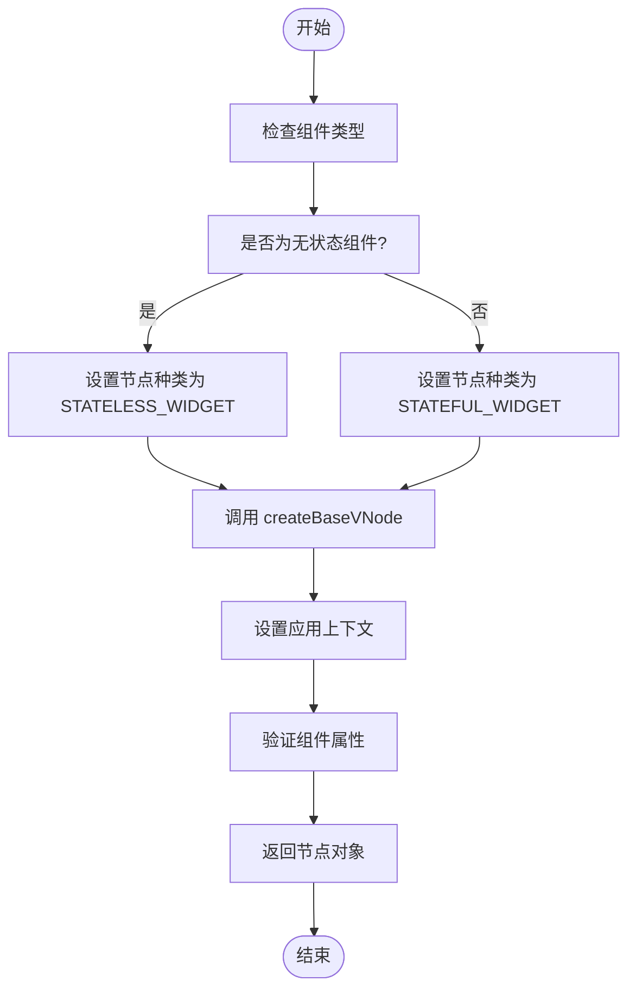
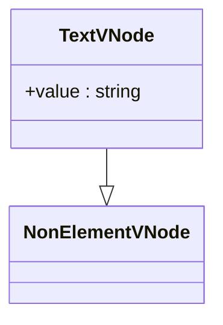
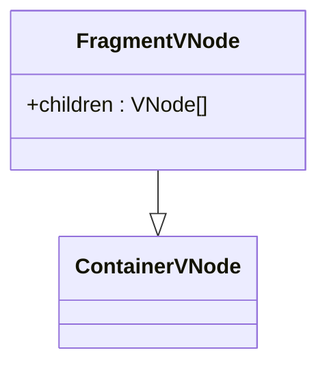
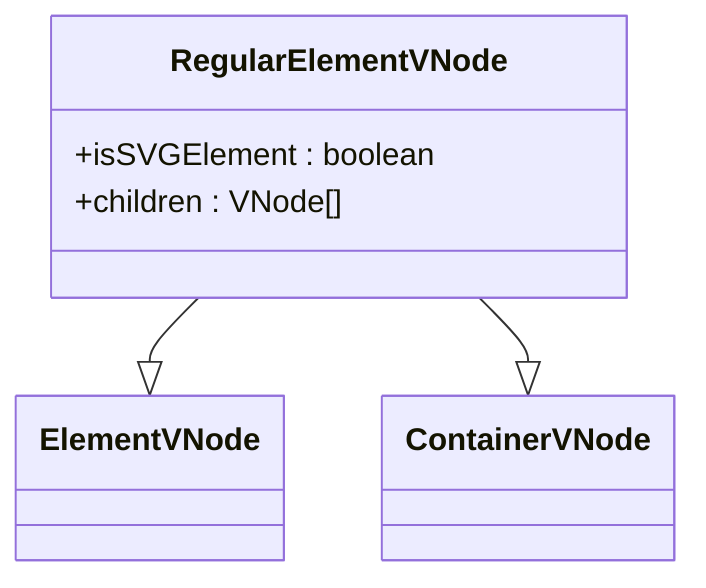
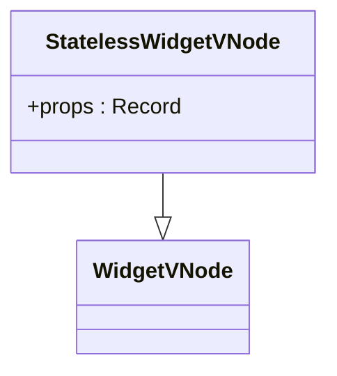
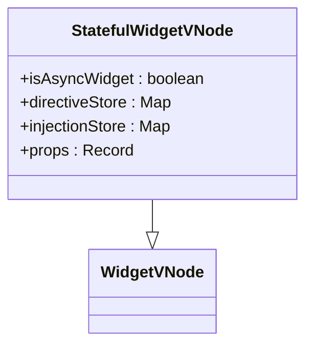

# VNode 数据结构

<cite>
**本文档中引用的文件**  
- [BaseNode.ts](file://packages/runtime-core/src/types/nodes/BaseNode.ts)
- [nodeKind.ts](file://packages/runtime-core/src/constants/nodeKind.ts)
- [nodeTypes.ts](file://packages/runtime-core/src/constants/nodeTypes.ts)
- [symbol.ts](file://packages/runtime-core/src/constants/symbol.ts)
- [TextVNode.ts](file://packages/runtime-core/src/types/nodes/TextVNode.ts)
- [FragmentVNode.ts](file://packages/runtime-core/src/types/nodes/FragmentVNode.ts)
- [RegularElementVNode.ts](file://packages/runtime-core/src/types/nodes/RegularElementVNode.ts)
- [StatelessWidgetVNode.ts](file://packages/runtime-core/src/types/nodes/StatelessWidgetVNode.ts)
- [StatefulWidgetVNode.ts](file://packages/runtime-core/src/types/nodes/StatefulWidgetVNode.ts)
- [vnode.ts](file://packages/runtime-core/src/types/vnode.ts)
- [constants.ts](file://packages/responsive/src/signal/constants.ts)
- [base.ts](file://packages/runtime-core/src/vnode/creator/base.ts)
- [element.ts](file://packages/runtime-core/src/vnode/creator/element.ts)
- [widget.ts](file://packages/runtime-core/src/vnode/creator/widget.ts)
</cite>

## 目录
1. [引言](#引言)
2. [核心数据结构：BaseNode 接口](#核心数据结构basenode-接口)
3. [Symbol 标识的作用](#symbol-标识的作用)
4. [节点分类体系](#节点分类体系)
5. [VNode 创建流程](#vnode-创建流程)
6. [不同类型节点的结构与处理](#不同类型节点的结构与处理)
7. [总结](#总结)

## 引言
Vitarx 框架中的 VNode（虚拟节点）是其核心数据结构之一，用于描述 UI 的抽象表示。VNode 作为真实 DOM 的轻量级替代品，在渲染过程中起着至关重要的作用。本文将深入分析 VNode 的数据结构设计，包括 BaseNode 接口的定义、Symbol 标识的作用、节点分类体系以及不同类型节点的结构和处理方式。

## 核心数据结构：BaseNode 接口

VNode 的核心是 `BaseNode` 接口，它定义了所有虚拟节点类型的基础属性和行为。该接口继承自 `VNodeMeta`，包含了用于 diff 优化和渲染控制的元数据属性。

### VNodeMeta 接口
`VNodeMeta` 接口定义了虚拟节点的元数据属性，这些属性不直接影响渲染结果，但可以优化渲染性能和控制渲染行为。

- **key**: 用于标识节点的唯一性，特别是在列表渲染中。框架通过 key 值判断节点是否是同一个节点，从而优化 diff 算法。
- **ref**: 用于直接访问节点对应的真实 DOM 元素或组件实例。在服务端渲染 (SSR) 时通常为空，因为服务端没有真实 DOM。
- **static**: 静态节点优化标记。标记为静态的节点在后续更新中会跳过 diff 过程，通常用于静态内容，如固定文本、静态图片等。
- **memo**: 记忆比较依赖，用于记忆化优化，只有当依赖数组中的值发生变化时才重新渲染节点。
- **directives**: 指令列表，包含节点上的各种指令及其值和参数。

### BaseNode 接口
`BaseNode` 接口扩展了 `VNodeMeta`，定义了虚拟节点的核心属性。

- **[NON_SIGNAL_SYMBOL]**: 只读属性，用于响应式系统优化，标记该对象不会被响应式系统追踪。这可以提高性能，因为虚拟节点本身不需要响应式追踪，只有节点中的特定值（如 props 中的某些属性）需要响应式处理。
- **[VIRTUAL_NODE_SYMBOL]**: 只读属性，用于类型检查和识别，确保对象是虚拟节点而非普通对象。这个符号属性使得框架能够区分虚拟节点和其他对象，即使它们有相似的结构。
- **type**: 节点类型，表示节点的具体类型，如文本节点、元素节点、组件节点等。这个属性决定了节点如何被渲染和处理。
- **kind**: 节点种类，表示节点的分类，如元素、文本、注释、片段等。与 type 不同，kind 是更宽泛的分类，用于快速判断节点的基本类型。
- **state**: 节点状态，表示节点的当前状态，如挂载、更新、卸载等。这个属性用于框架内部管理节点的生命周期和状态。
- **props**: 节点属性，包含节点的所有属性，如 class、style、事件处理器等。这些属性决定了节点的外观和行为。
- **el**: 节点对应的真实 DOM 元素，在渲染过程中，虚拟节点会被转换为真实的 DOM 元素。这个属性引用了对应的真实 DOM 元素，用于直接操作 DOM。在服务端渲染 (SSR) 时，此属性通常为空。
- **anchor**: 锚点元素，用于片段节点 (Fragment) 的渲染。片段节点本身不对应任何真实 DOM 元素，但需要标记其在 DOM 中的位置。锚点元素是一个注释节点，用于标识片段的开始和结束位置，便于后续的 DOM 操作。
- **appContext**: 应用上下文，包含应用级别的配置和状态。
- **devInfo**: 开发模式调试信息，包含用于调试的元数据，如节点在源码中的位置、创建堆栈等。这些信息仅在开发环境 (__DEV__) 下可用，用于错误报告和调试工具。

**Section sources**
- [BaseNode.ts](file://packages/runtime-core/src/types/nodes/BaseNode.ts#L24-L223)

## Symbol 标识的作用

Vitarx 框架使用 Symbol 标识来增强类型安全和运行时识别的一致性。这些 Symbol 标识在类型识别和响应式系统优化中起着关键作用。

### VIRTUAL_NODE_SYMBOL
`VIRTUAL_NODE_SYMBOL` 是一个唯一的 Symbol，用于识别虚拟节点。每个虚拟节点都会包含这个 Symbol 作为其只读属性，可以通过检查该属性的存在来验证对象是否为虚拟节点。这确保了类型安全和运行时识别的一致性。

### NON_SIGNAL_SYMBOL
`NON_SIGNAL_SYMBOL` 是另一个重要的 Symbol，用于响应式系统优化。它标记该对象不会被响应式系统追踪。这可以提高性能，因为虚拟节点本身不需要响应式追踪，只有节点中的特定值（如 props 中的某些属性）需要响应式处理。

### 其他 Symbol 标识
除了上述两个主要的 Symbol 标识外，Vitarx 还定义了其他一些 Symbol 标识，用于不同的目的：
- **VNODE_PROPS_DEV_INFO_SYMBOL**: 用于存放 devInfo 的属性名。
- **VNODE_CONTEXT_SYMBOL**: 用于虚拟节点的 context 属性。
- **CLASS_WIDGET_BASE_SYMBOL**: 用于类小部件的标识符。
- **STATELESS_F_WIDGET_SYMBOL**: 用于无状态函数组件的标识符。
- **VNODE_BUILDER_SYMBOL**: 用于节点构建器的标识符。
- **APP_CONTEXT_SYMBOL**: 用于应用上下文的 Symbol。
- **SUSPENSE_COUNTER_SYMBOL**: 用于 `Suspense` 计数器的标识符，跟踪当前组件的挂起状态。

这些 Symbol 标识共同构成了 Vitarx 框架的类型识别和响应式系统优化的基础。

**Section sources**
- [symbol.ts](file://packages/runtime-core/src/constants/symbol.ts#L1-L39)
- [constants.ts](file://packages/responsive/src/signal/constants.ts#L1-L25)

## 节点分类体系

Vitarx 框架通过 `NodeKind` 和 `NodeTypes` 枚举来定义节点的分类体系。这种分类体系有助于快速判断节点的基本类型，并决定节点如何被渲染和处理。

### NodeKind 枚举
`NodeKind` 枚举定义了虚拟 DOM 中不同类型的节点种类，用于快速判断节点的基本类型。

- **REGULAR_ELEMENT**: 常规元素，如 `
`、`` 等。
- **VOID_ELEMENT**: 自闭合元素，如 ``、`<input>`、` ` 等。
- **FRAGMENT**: 片段节点，用于包装多个子节点而不创建额外的 DOM 元素。
- **TEXT**: 文本节点。
- **COMMENT**: 注释节点。
- **STATELESS_WIDGET**: 无状态组件节点。
- **STATEFUL_WIDGET**: 有状态组件节点。

此外，还定义了一些集合常量，用于快速判断节点的类别：
- **SPECIAL_NODE_KINDS**: 包含 `TEXT`、`COMMENT` 和 `FRAGMENT` 节点种类。
- **CONTAINER_NODE_KINDS**: 包含 `REGULAR_ELEMENT` 和 `FRAGMENT` 节点种类。
- **ELEMENT_NODE_KINDS**: 包含 `REGULAR_ELEMENT` 和 `VOID_ELEMENT` 节点种类。
- **WIDGET_NODE_KINDS**: 包含 `STATELESS_WIDGET` 和 `STATEFUL_WIDGET` 节点种类。
- **NON_ELEMENT_NODE_KINDS**: 包含 `TEXT` 和 `COMMENT` 节点种类。

### NodeTypes 枚举
`NodeTypes` 枚举定义了虚拟节点的具体类型，用于决定节点如何被渲染和处理。

- **FRAGMENT_NODE_TYPE**: 片段节点标签常量，定义了片段节点的标识符。
- **TEXT_NODE_TYPE**: 纯文本节点标签常量，定义了纯文本节点的标识符。
- **COMMENT_NODE_TYPE**: 注释节点标签常量，定义了注释节点的标识符。
- **DYNAMIC_RENDER_TYPE**: 动态渲染标签常量，定义了动态渲染节点的标识符。

这些枚举和常量共同构成了 Vitarx 框架的节点分类体系，使得框架能够高效地管理和渲染不同类型的节点。

**Section sources**
- [nodeKind.ts](file://packages/runtime-core/src/constants/nodeKind.ts#L1-L26)
- [nodeTypes.ts](file://packages/runtime-core/src/constants/nodeTypes.ts#L1-L32)

## VNode 创建流程

Vitarx 框架通过一系列创建函数来生成不同类型的 VNode。这些函数遵循一个通用的创建流程，确保生成的 VNode 符合预期的结构和行为。

### createBaseVNode 函数
`createBaseVNode` 函数是创建基础虚拟节点的核心函数。它接收 `type`、`kind` 和 `props` 参数，并返回一个符合 `VNode` 接口的对象。

**Diagram sources**
- [base.ts](file://packages/runtime-core/src/vnode/creator/base.ts#L22-L117)

### createVoidElementVNode 函数
`createVoidElementVNode` 函数用于创建空元素节点（自闭合元素），如 ``、`<input>`、` ` 等。这些元素在 HTML 中不能有子元素，语法上是自闭合的。

**Diagram sources**
- [element.ts](file://packages/runtime-core/src/vnode/creator/element.ts#L26-L34)

### createRegularElementVNode 函数
`createRegularElementVNode` 函数用于创建常规元素节点，如 `
`、``、`
` 等。这些元素可以包含子节点，有开始标签和结束标签。

**Diagram sources**
- [element.ts](file://packages/runtime-core/src/vnode/creator/element.ts#L47-L68)

### createWidgetVNode 函数
`createWidgetVNode` 函数用于创建组件节点。根据组件类型的不同，它可以创建无状态组件节点或有状态组件节点。

**Diagram sources**
- [widget.ts](file://packages/runtime-core/src/vnode/creator/widget.ts#L154-L173)

## 不同类型节点的结构与处理

Vitarx 框架支持多种类型的 VNode，每种类型都有其特定的结构和处理方式。以下是一些主要的 VNode 类型及其特点。

### 文本节点 (TextVNode)
文本节点表示 DOM 中的文本内容节点，用于显示纯文本。文本节点是 DOM 树中的叶子节点，不能包含子节点，只能包含文本内容。文本节点的内容存储在 `value` 属性中，可以是任何可转换为字符串的值。

**Diagram sources**
- [TextVNode.ts](file://packages/runtime-core/src/types/nodes/TextVNode.ts#L1-L17)

### 片段节点 (FragmentVNode)
片段节点表示一个可以包含多个子节点的容器，但自身不渲染为任何 DOM 元素。片段节点允许组件返回多个根节点，而不需要额外的包装元素。在渲染时，片段节点的所有子节点会被直接插入到父节点中，而片段节点本身不会产生任何 DOM 元素。

**Diagram sources**
- [FragmentVNode.ts](file://packages/runtime-core/src/types/nodes/FragmentVNode.ts#L1-L17)

### 常规元素节点 (RegularElementVNode)
常规元素节点表示标准的 HTML 元素，如 `
`、``、`
` 等，这些元素可以包含子节点。常规元素节点有开始标签和结束标签，可以包含属性和子节点。该接口同时继承自 `ElementVNode` 和 `ContainerVNode`，提供了元素节点的基本属性和包含子节点的能力。

**Diagram sources**
- [RegularElementVNode.ts](file://packages/runtime-core/src/types/nodes/RegularElementVNode.ts#L1-L19)

### 无状态组件节点 (StatelessWidgetVNode)
无状态组件节点表示没有内部状态的自定义组件节点。无状态组件的输出完全由其输入属性决定，相同的输入总是产生相同的输出。这些组件通常用于展示性内容，如按钮、标签、卡片等。与 `StatefulWidgetVNode` 不同，`StatelessWidgetVNode` 不维护组件实例，每次渲染都会重新创建组件实例，因此更加轻量级。

**Diagram sources**
- [StatelessWidgetVNode.ts](file://packages/runtime-core/src/types/nodes/StatelessWidgetVNode.ts#L1-L19)

### 有状态组件节点 (StatefulWidgetVNode)
有状态组件节点表示具有内部状态的自定义组件节点。有状态组件可以维护自己的状态，并在状态变化时重新渲染。这些组件通常包含用户交互、数据获取等功能。与 `StatefulWidgetVNode` 不同，`StatefulWidgetVNode` 会维护一个组件实例 (instance)，该实例在组件生命周期内保持不变，用于存储组件的状态和生命周期方法。

**Diagram sources**
- [StatefulWidgetVNode.ts](file://packages/runtime-core/src/types/nodes/StatefulWidgetVNode.ts#L1-L34)

## 总结
Vitarx 框架中的 VNode 数据结构设计精巧，通过 `BaseNode` 接口定义了虚拟节点的核心属性和行为。`VIRTUAL_NODE_SYMBOL` 和 `NON_SIGNAL_SYMBOL` 等 Symbol 标识在类型识别和响应式系统优化中起着关键作用。`NodeKind` 和 `NodeTypes` 枚举定义了节点的分类体系，使得框架能够高效地管理和渲染不同类型的节点。通过 `createBaseVNode`、`createVoidElementVNode`、`createRegularElementVNode` 和 `createWidgetVNode` 等创建函数，Vitarx 框架能够生成符合预期结构和行为的 VNode。不同类型的 VNode（如文本节点、片段节点、常规元素节点、无状态组件节点和有状态组件节点）各有其特定的结构和处理方式，共同构成了 Vitarx 框架的渲染基础。