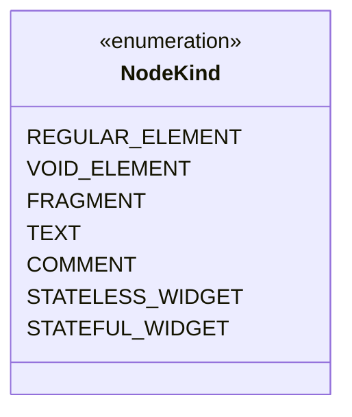
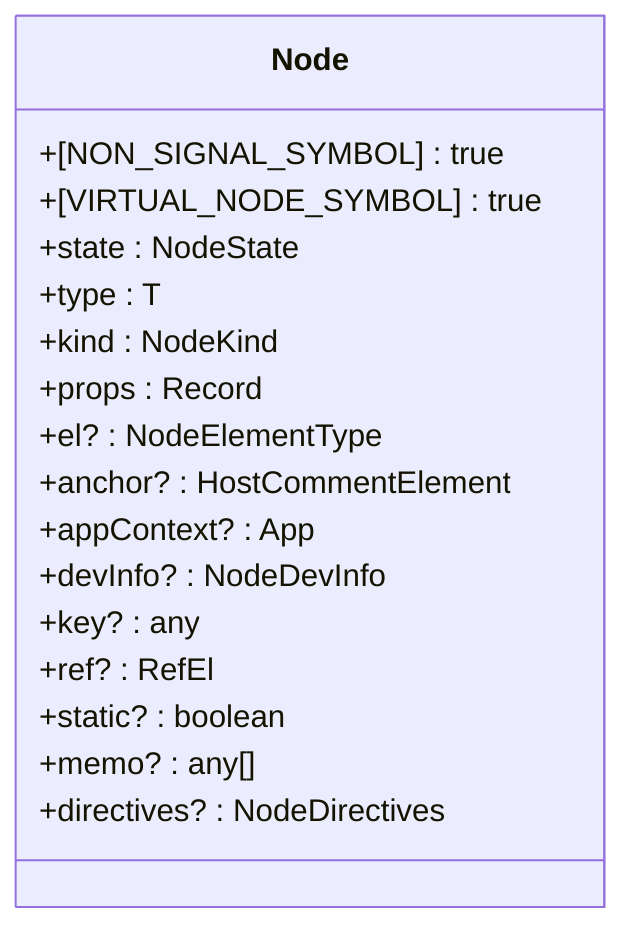
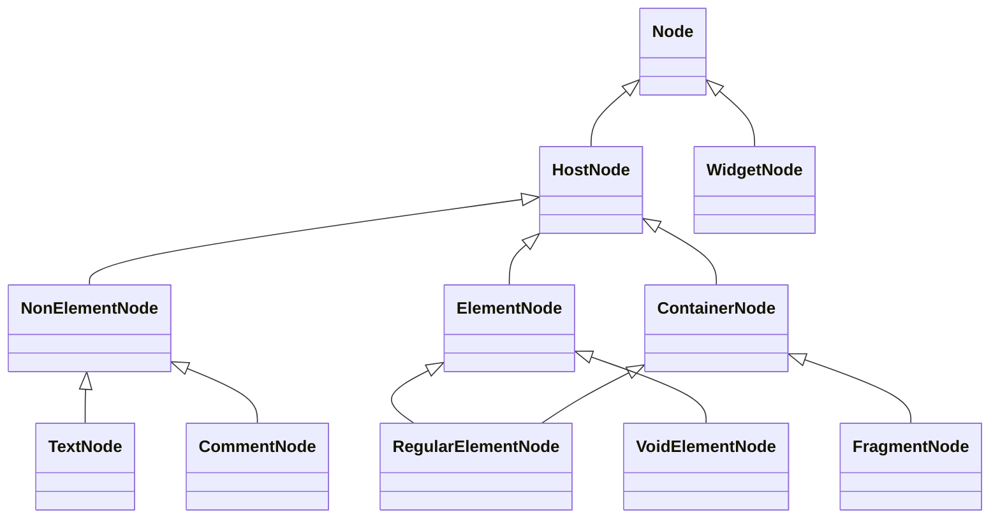
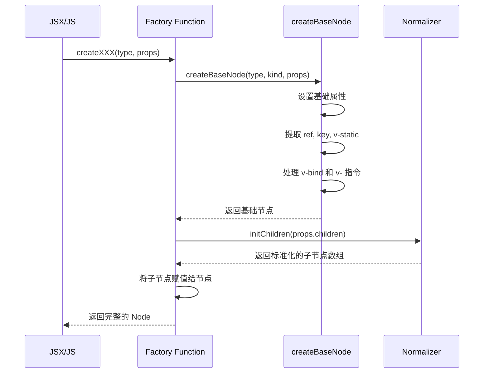
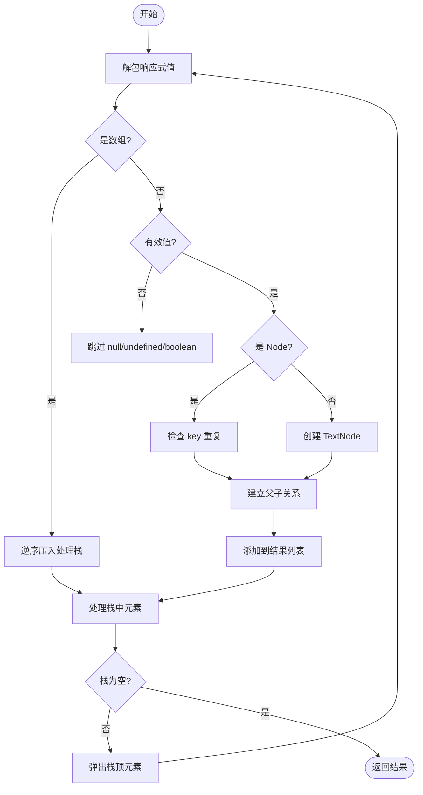

# 虚拟 DOM

<cite>
**本文档中引用的文件**   
- [VNode.ts](file://packages/runtime-core/src/types/nodes/VNode.ts)
- [RegularElementNode.ts](file://packages/runtime-core/src/types/nodes/RegularElementNode.ts)
- [FragmentNode.ts](file://packages/runtime-core/src/types/nodes/FragmentNode.ts)
- [TextNode.ts](file://packages/runtime-core/src/types/nodes/TextNode.ts)
- [nodeKind.ts](file://packages/runtime-core/src/constants/nodeKind.ts)
- [create.ts](file://packages/runtime-core/src/vnode/core/create.ts)
- [vnode.ts](file://packages/runtime-core/src/types/vnode.ts)
- [base.ts](file://packages/runtime-core/src/vnode/creator/base.ts)
- [element.ts](file://packages/runtime-core/src/vnode/creator/element.ts)
- [widget.ts](file://packages/runtime-core/src/vnode/creator/widget.ts)
- [children.ts](file://packages/runtime-core/src/vnode/normalizer/children.ts)
- [update.ts](file://packages/runtime-core/src/vnode/core/update.ts)
</cite>

## 更新摘要
**已做更改**   
- 将所有文档中的 `VNode` 类型引用更新为 `Node` 类型，以反映代码库中的重命名变更
- 更新了所有受影响的接口、实现文件和相关函数的引用路径
- 修正了类图和序列图中涉及的类型名称
- 更新了所有代码示例和类型定义中的命名约定

## 目录
1. [引言](#引言)
2. [Node 数据结构设计](#node-数据结构设计)
3. [Node 创建过程](#node-创建过程)
4. [Children 与 Props 规范化处理](#children-与-props-规范化处理)
5. [Diff 算法核心策略](#diff-算法核心策略)
6. [特殊节点类型处理](#特殊节点类型处理)
7. [性能优化机制](#性能优化机制)
8. [总结](#总结)

## 引言

Vitarx 框架通过虚拟 DOM（Virtual DOM）机制实现高效的 UI 更新。虚拟 DOM 是真实 DOM 的轻量级抽象表示，通过在内存中构建和比较虚拟节点树，最小化实际 DOM 操作，从而提升渲染性能。本文档深入解析 Vitarx 虚拟 DOM 的核心实现，包括 Node 的数据结构、创建流程、规范化处理、Diff 算法以及特殊节点和性能优化策略。

## Node 数据结构设计

Node（虚拟节点）是虚拟 DOM 的基本单元，其设计旨在精确描述 UI 的结构和状态。Vitarx 的 Node 采用基于接口的类型系统，通过继承和组合实现高度的灵活性和可扩展性。

### 节点类型与标识 (nodeKind)

Node 的核心分类通过 `NodeKind` 枚举实现，它定义了框架中所有可能的节点种类。这种设计将节点的“类型”（`type`）与其“种类”（`kind`）分离，使得框架可以基于 `kind` 进行快速的类型判断和逻辑分支。

**Diagram sources**
- [nodeKind.ts](file://packages/runtime-core/src/constants/nodeKind.ts#L4-L19)

**Section sources**
- [nodeKind.ts](file://packages/runtime-core/src/constants/nodeKind.ts#L1-L26)
- [VNode.ts](file://packages/runtime-core/src/types/nodes/VNode.ts#L76-L84)

### Node 核心接口

所有 Node 类型都继承自一个基础接口 `Node`，该接口定义了所有节点共有的属性和行为。

**Diagram sources**
- [VNode.ts](file://packages/runtime-core/src/types/nodes/VNode.ts#L76-L148)

**Section sources**
- [VNode.ts](file://packages/runtime-core/src/types/nodes/VNode.ts#L1-L221)

#### 核心属性说明

- **`[NON_SIGNAL_SYMBOL]` 和 `[VIRTUAL_NODE_SYMBOL]`**: 两个特殊的符号属性，用于在响应式系统和类型检查中快速识别 Node 对象，避免被错误地追踪或混淆。
- **`state`**: 节点的生命周期状态（如已创建、已挂载等），用于框架内部的状态管理。
- **`type`**: 节点的具体类型，对于元素节点是标签名（如 "div"），对于组件节点是组件类或函数。
- **`kind`**: 节点的宽泛分类，通过 `NodeKind` 枚举定义，是框架进行逻辑分发的关键。
- **`props`**: 包含节点所有属性的键值对，如 HTML 属性、事件处理器、自定义 props 等。
- **`el`**: 在客户端渲染时，指向该 Node 对应的真实 DOM 元素的引用。
- **`anchor`**: 用于 `Fragment` 等无真实 DOM 的节点，通过一个注释节点（comment node）在 DOM 中标记其位置，便于后续的插入和删除操作。
- **`devInfo`**: 仅在开发模式下存在的调试信息，包含源码位置，用于错误追踪。

### 节点类型继承体系

Vitarx 通过接口继承构建了一个清晰的 Node 类型体系，不同的节点类型通过组合不同的基础接口来获得其特性。

**Diagram sources**
- [VNode.ts](file://packages/runtime-core/src/types/nodes/VNode.ts#L153-L221)
- [RegularElementNode.ts](file://packages/runtime-core/src/types/nodes/RegularElementNode.ts#L16-L19)
- [TextNode.ts](file://packages/runtime-core/src/types/nodes/TextNode.ts#L16-L17)
- [FragmentNode.ts](file://packages/runtime-core/src/types/nodes/FragmentNode.ts#L16-L17)

**Section sources**
- [VNode.ts](file://packages/runtime-core/src/types/nodes/VNode.ts#L1-L221)
- [RegularElementNode.ts](file://packages/runtime-core/src/types/nodes/RegularElementNode.ts#L1-L19)
- [TextNode.ts](file://packages/runtime-core/src/types/nodes/TextNode.ts#L1-L17)
- [FragmentNode.ts](file://packages/runtime-core/src/types/nodes/FragmentNode.ts#L1-L17)

#### 关键子类型

- **`HostNode`**: 代表所有非组件节点，即直接映射到宿主环境（如浏览器 DOM）的节点。
- **`WidgetNode`**: 代表组件节点，可以是无状态或有状态组件。
- **`NonElementNode`**: 不能包含子节点的节点，如 `TextNode` 和 `CommentNode`。
- **`ContainerNode`**: 可以包含子节点的容器节点，如 `RegularElementNode` 和 `FragmentNode`。
- **`ElementNode`**: 表示 HTML 元素的节点，包含 `isSVGElement` 标志以处理 SVG 上下文。

## Node 创建过程

Node 的创建是通过一系列工厂函数完成的，这些函数最终都调用一个核心的 `createBaseNode` 函数。在 JSX 环境下，这些调用由编译器自动生成。

### 核心创建流程

1.  **调用特定工厂函数**: 根据要创建的节点类型，调用相应的函数，如 `createRegularElementNode`、`createWidgetNode` 等。
2.  **创建基础节点**: 所有工厂函数最终都会调用 `createBaseNode`，传入 `type`、`kind` 和 `props`。
3.  **初始化元数据**: `createBaseNode` 会设置节点的符号属性、状态、类型、种类和应用上下文。
4.  **处理特殊属性**: 从 `props` 中提取并处理 `ref`、`key`、`v-static` 等特殊属性。
5.  **处理指令和属性**: 解析 `v-` 开头的指令（如 `v-model`），并执行 `v-bind` 的属性合并。
6.  **返回节点**: 返回一个部分初始化的 Node。
7.  **子节点处理**: 特定的工厂函数会进一步处理子节点（`children`），并将其赋值给 Node。

**Diagram sources**
- [base.ts](file://packages/runtime-core/src/vnode/creator/base.ts#L22-L117)
- [element.ts](file://packages/runtime-core/src/vnode/creator/element.ts#L26-L68)
- [children.ts](file://packages/runtime-core/src/vnode/normalizer/children.ts#L105-L148)

**Section sources**
- [base.ts](file://packages/runtime-core/src/vnode/creator/base.ts#L1-L118)
- [element.ts](file://packages/runtime-core/src/vnode/creator/element.ts#L1-L69)
- [widget.ts](file://packages/runtime-core/src/vnode/creator/widget.ts#L90-L174)
- [fragment.ts](file://packages/runtime-core/src/vnode/creator/fragment.ts#L15-L24)
- [special.ts](file://packages/runtime-core/src/vnode/creator/special.ts#L19-L35)

### 创建函数示例

- **`createRegularElementNode`**: 用于创建常规 HTML 元素（如 `
`、`
`）。它会调用 `createBaseNode` 创建基础节点，然后处理 `style` 和 `class` 属性，并调用 `initChildren` 处理子节点。
- **`createWidgetNode`**: 用于创建组件节点。它会根据组件是无状态还是有状态来设置 `kind`，并调用 `createBaseNode`。在开发模式下，还会执行 `validateProps` 进行属性校验。
- **`createFragmentNode`**: 用于创建 `Fragment` 节点。它会创建一个 `kind` 为 `FRAGMENT` 的基础节点，并调用 `initChildren` 处理其子节点。

## Children 与 Props 规范化处理

在创建 Node 的过程中，`props` 和 `children` 需要经过一系列的规范化处理，以确保数据的一致性和正确性。

### Children 规范化

`children` 的规范化由 `initChildren` 函数完成，其主要任务是将任意嵌套的值（包括响应式引用）扁平化并转换为标准的 `Node[]` 数组。

**Diagram sources**
- [children.ts](file://packages/runtime-core/src/vnode/normalizer/children.ts#L105-L148)

**Section sources**
- [children.ts](file://packages/runtime-core/src/vnode/normalizer/children.ts#L1-L149)

#### 关键步骤

1.  **解包响应式值**: 使用 `unref` 函数解包 `RefSignal` 或其他响应式对象，获取其原始值。
2.  **扁平化数组**: 使用栈（stack）结构迭代处理嵌套数组，避免递归导致的栈溢出。数组元素被逆序压入栈中，以保证最终结果的顺序。
3.  **过滤无效值**: 过滤掉 `null`、`undefined` 和 `boolean` 值。
4.  **转换为 Node**: 如果值不是 `Node`，则调用 `createTextNode` 将其转换为文本节点。
5.  **检查 key 重复**: 在开发模式下，检查子节点中是否存在重复的 `key`，并发出警告。
6.  **建立父子关系**: 调用 `linkParentNode` 建立子节点与父节点的引用关系。

### Props 规范化

`props` 的规范化主要在 `createBaseNode` 和 `normalizerStyleAndClassProp` 函数中完成。

#### 关键处理

- **`v-bind` 合并**: `bindProps` 函数处理 `v-bind` 指令。它支持对象形式（`v-bind="obj"`）和数组形式（`v-bind="[obj, ['excludeKey']]"`）。合并时会跳过固有属性（如 `key`, `ref`），并使用特殊合并器处理 `style` 和 `class` 属性。
- **`style` 和 `class` 标准化**: `normalizerStyleAndClassProp` 函数确保 `style` 属性为对象格式，`class` 属性为数组格式。它会合并 `class` 和 `className` 属性，并删除 `className` 以避免重复。
- **指令处理**: 在 `createBaseNode` 中，遍历 `props`，识别 `v-` 开头的属性。例如，`v-model` 会被转换为 `modelValue` prop 和 `onUpdate:modelValue` 事件处理器。

**Section sources**
- [props.ts](file://packages/runtime-core/src/vnode/normalizer/props.ts#L37-L146)
- [base.ts](file://packages/runtime-core/src/vnode/creator/base.ts#L72-L114)

## Diff 算法核心策略

虽然具体的 Diff 算法实现在渲染器中，但 Node 的设计为高效的 Diff 提供了基础。

### Key 的作用

`key` 是 Diff 算法的核心。它是一个用于标识节点唯一性的属性。当列表发生变化时，框架会根据 `key` 来判断哪些节点是新的、哪些是被移动的、哪些是被删除的。

- **无 key**: 框架只能基于节点的索引进行比较，当列表项顺序改变时，会导致不必要的 DOM 重新创建。
- **有 key**: 框架可以精确地追踪每个节点的身份。即使节点在列表中的位置发生变化，只要 `key` 不变，框架就会尝试复用该节点，只更新其内容，从而大幅提升性能。

**Section sources**
- [VNode.ts](file://packages/runtime-core/src/types/nodes/VNode.ts#L38-L44)

### 双端比较算法

Vitarx 很可能采用或借鉴了双端比较（Dual Pointer）算法来优化列表 Diff。该算法通过维护新旧列表的头尾指针，尽可能地复用列表两端未发生变化的节点，从而减少中间节点的比较次数。

## 特殊节点类型处理

### Fragment

`Fragment` 节点（`kind: NodeKind.FRAGMENT`）允许组件返回多个根节点，而无需引入额外的包装 DOM 元素。在渲染时，`Fragment` 的所有子节点会被直接插入到其父节点中。`anchor` 属性用于在 DOM 中标记 `Fragment` 的起始和结束位置。

**Section sources**
- [fragment.ts](file://packages/runtime-core/src/vnode/creator/fragment.ts#L15-L24)
- [FragmentNode.ts](file://packages/runtime-core/src/types/nodes/FragmentNode.ts#L16-L17)

### Portal (Teleport)

虽然在当前分析的文件中没有直接看到 `Teleport` 的 Node 实现，但 `Teleport` 组件会创建一种特殊的 Node，其 `props` 中包含目标容器（`to`）。在渲染时，该 Node 的子节点会被“传送”到指定的目标容器中，而不是其逻辑父节点。

## 性能优化机制

### 静态节点提升

通过 `v-static` 指令，开发者可以标记一个节点为静态。框架会为该节点设置 `static: true`。在后续的更新中，Diff 算法可以跳过对该节点及其整个子树的比较，直接复用，从而显著提升性能。

**Section sources**
- [base.ts](file://packages/runtime-core/src/vnode/creator/base.ts#L62-L63)

### Tree-shaking

Vitarx 的模块化设计（如将 `createNode`、`h` 函数等分散在不同文件中）有利于 Tree-shaking。如果应用没有使用某些功能（如 `Teleport` 或 `Suspense`），打包工具可以将这些未使用的代码从最终的 bundle 中移除，减小包体积。

## 总结

Vitarx 的虚拟 DOM 实现是一个精心设计的系统，通过清晰的类型划分、高效的创建流程、严格的规范化处理和强大的性能优化机制，为构建高性能的 Web 应用提供了坚实的基础。其核心在于 `NodeKind` 的分类、`Node` 接口的继承体系以及 `createBaseNode` 的统一创建入口。理解这些机制有助于开发者更高效地使用框架，并编写出性能更优的代码。