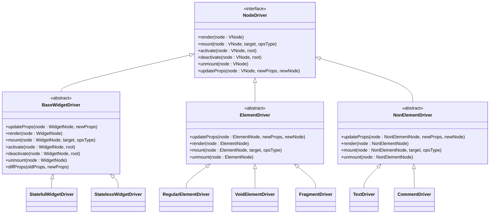

# 默认驱动机制

<cite>
**本文档引用的文件**  
- [BaseWidgetDriver.ts](file://packages/runtime-drivers/src/drivers/BaseWidgetDriver.ts)
- [RegularElementDriver.ts](file://packages/runtime-drivers/src/drivers/RegularElementDriver.ts)
- [TextDriver.ts](file://packages/runtime-drivers/src/drivers/TextDriver.ts)
- [CommentDriver.ts](file://packages/runtime-drivers/src/drivers/CommentDriver.ts)
- [FragmentDriver.ts](file://packages/runtime-drivers/src/drivers/FragmentDriver.ts)
- [StatefulWidgetDriver.ts](file://packages/runtime-drivers/src/drivers/StatefulWidgetDriver.ts)
- [StatelessWidgetDriver.ts](file://packages/runtime-drivers/src/drivers/StatelessWidgetDriver.ts)
- [VoidElementDriver.ts](file://packages/runtime-drivers/src/drivers/VoidElementDriver.ts)
- [factory.ts](file://packages/runtime-drivers/src/factory.ts)
- [driver.ts](file://packages/runtime-core/src/vnode/core/driver.ts)
- [nodeKind.ts](file://packages/runtime-core/src/constants/nodeKind.ts)
- [NodeDriver.ts](file://packages/runtime-core/src/types/driver.ts)
- [VNode.ts](file://packages/runtime-core/src/types/nodes/VNode.ts)
- [schema.ts](file://packages/runtime-core/src/renderer/schema.ts)
</cite>

## 目录
1. [简介](#简介)
2. [驱动机制架构](#驱动机制架构)
3. [核心驱动类型](#核心驱动类型)
4. [驱动注册与管理](#驱动注册与管理)
5. [节点生命周期管理](#节点生命周期管理)
6. [默认驱动初始化流程](#默认驱动初始化流程)
7. [驱动接口设计](#驱动接口设计)
8. [特殊节点处理](#特殊节点处理)
9. [容器与元素驱动](#容器与元素驱动)
10. [组件驱动机制](#组件驱动机制)
11. [状态管理与转换](#状态管理与转换)
12. [属性更新与差异比较](#属性更新与差异比较)

## 简介
默认驱动机制是Vitarx框架的核心渲染基础，负责管理虚拟节点到真实DOM元素的转换过程。该机制通过一系列专门化的驱动器类来处理不同类型的虚拟节点，确保框架能够高效、准确地渲染和更新UI。驱动机制采用抽象化设计，将节点的创建、挂载、更新和销毁等操作封装在独立的驱动类中，实现了关注点分离和可扩展性。

**Section sources**
- [NodeDriver.ts](file://packages/runtime-core/src/types/driver.ts#L1-L51)
- [nodeKind.ts](file://packages/runtime-core/src/constants/nodeKind.ts#L1-L26)

## 驱动机制架构


**Diagram sources**
- [nodeKind.ts](file://packages/runtime-core/src/constants/nodeKind.ts#L4-L18)
- [driver.ts](file://packages/runtime-core/src/vnode/core/driver.ts#L17-L20)

## 核心驱动类型
Vitarx框架定义了多种核心驱动类型，每种类型负责处理特定的虚拟节点。这些驱动器通过继承基类并实现特定功能来完成节点的渲染和管理任务。驱动类型与节点类型一一对应，确保每种节点都能得到适当的处理。



**Diagram sources**
- [NodeDriver.ts](file://packages/runtime-core/src/types/driver.ts#L7-L51)
- [BaseWidgetDriver.ts](file://packages/runtime-drivers/src/drivers/BaseWidgetDriver.ts#L52-L128)

## 驱动注册与管理


**Diagram sources**
- [factory.ts](file://packages/runtime-drivers/src/factory.ts#L23-L38)
- [driver.ts](file://packages/runtime-core/src/vnode/core/driver.ts#L28-L33)

**Section sources**
- [factory.ts](file://packages/runtime-drivers/src/factory.ts#L1-L39)
- [driver.ts](file://packages/runtime-core/src/vnode/core/driver.ts#L17-L64)

## 节点生命周期管理


**Diagram sources**
- [nodeState.ts](file://packages/runtime-core/src/constants/nodeState.ts#L12-L18)
- [driver.ts](file://packages/runtime-core/src/vnode/core/driver.ts#L71-L78)

## 默认驱动初始化流程


**Diagram sources**
- [factory.ts](file://packages/runtime-drivers/src/factory.ts#L23-L38)
- [runtime-dom/factory.ts](file://packages/runtime-dom/src/factory.ts#L13)

## 驱动接口设计
驱动接口定义了所有驱动器必须实现的核心方法，确保了驱动器的一致性和可预测性。接口设计遵循单一职责原则，每个方法都有明确的用途和行为规范。

```mermaid
classDiagram
class NodeDriver {
<<interface>>
+render(node : VNode) : ElementOf~T~
+mount(node : VNode, target : HostNodeElements | HostParentElement, opsType : OpsType) : void
+activate(node : VNode, root : boolean) : void
+deactivate(node : VNode, root : boolean) : void
+unmount(node : VNode) : void
+updateProps(node : VNode, newProps : AnyProps, newNode : VNode) : void
}
note left of NodeDriver : : render
创建元素，这是挂载之前的步骤
end note
note left of NodeDriver : : mount
将节点挂载到目标容器中
默认操作是追加子节点
end note
note left of NodeDriver : : activate
激活已停用的节点
重新连接到DOM树
end note
note left of NodeDriver : : deactivate
停用节点
从DOM中移除但保留状态
end note
note left of NodeDriver : : unmount
完全卸载节点
移除节点及其子节点
清理相关资源
end note
note left of NodeDriver : : updateProps
更新节点属性
处理新旧属性的差异
end note
```

**Diagram sources**
- [driver.ts](file://packages/runtime-core/src/types/driver.ts#L7-L51)
- [VNode.ts](file://packages/runtime-core/src/types/nodes/VNode.ts#L76-L221)

## 特殊节点处理
特殊节点如文本、注释和片段节点有专门的驱动器处理，这些驱动器继承自NonElementDriver基类，针对特殊节点的特性进行了优化。

```mermaid
classDiagram
class NonElementDriver {
<<abstract>>
+createElement(node : VNode) : HostNodeElements
+updateProps(node : VNode, newProps, newNode)
+render(node : VNode)
+mount(node : VNode, target, opsType)
+unmount(node : VNode)
}
class TextDriver {
+createElement(node : TextNode) : HostTextElement
}
class CommentDriver {
+createElement(node : CommentNode) : HostCommentElement
}
class FragmentDriver {
+mount(node : FragmentNode, target, opsType)
+unmount(node : FragmentNode)
}
NonElementDriver <|-- TextDriver
NonElementDriver <|-- CommentDriver
NonElementDriver <|-- FragmentDriver
note right of TextDriver
处理纯文本节点
创建文本DOM元素
end note
note right of CommentDriver
处理HTML注释节点
创建注释DOM元素
end note
note right of FragmentDriver
处理片段节点
不创建实际DOM元素
通过锚点管理子节点
end note
```

**Diagram sources**
- [TextDriver.ts](file://packages/runtime-drivers/src/drivers/TextDriver.ts#L1-L31)
- [CommentDriver.ts](file://packages/runtime-drivers/src/drivers/CommentDriver.ts#L1-L30)
- [FragmentDriver.ts](file://packages/runtime-drivers/src/drivers/FragmentDriver.ts#L1-L45)

## 容器与元素驱动
容器和元素驱动负责处理可以包含子节点的DOM元素，它们实现了容器相关的操作方法，如子节点的添加、插入和替换。

```mermaid
classDiagram
class ElementDriver {
<<abstract>>
+appendChild(parent : HostParentElement, child : HostNodeElements) : void
+insertBefore(parent : HostParentElement, child : HostNodeElements, ref : HostNodeElements) : void
+replace(parent : HostParentElement, newChild : HostNodeElements, oldChild : HostNodeElements) : void
+updateProps(node : ElementNode, newProps, newNode)
+render(node : ElementNode)
+mount(node : ElementNode, target, opsType)
+unmount(node : ElementNode)
}
class RegularElementDriver {
+createElement(node : RegularElementNode) : HostRegularElement
}
class VoidElementDriver {
+createElement(node : VoidElementNode) : HostVoidElement
}
ElementDriver <|-- RegularElementDriver
ElementDriver <|-- VoidElementDriver
note right of ElementDriver
提供容器操作方法
管理子节点的DOM操作
end note
note right of RegularElementDriver
处理常规HTML元素
如 div, span, p 等
end note
note right of VoidElementDriver
处理自闭合标签元素
如 img, input, br 等
end note
```

**Diagram sources**
- [ElementDriver.ts](file://packages/runtime-drivers/src/drivers/ElementDriver.ts#L1-L35)
- [RegularElementDriver.ts](file://packages/runtime-drivers/src/drivers/RegularElementDriver.ts#L1-L33)
- [VoidElementDriver.ts](file://packages/runtime-drivers/src/drivers/VoidElementDriver.ts#L1-L30)

## 组件驱动机制
组件驱动机制通过BaseWidgetDriver基类实现，为无状态和有状态组件提供统一的生命周期管理。驱动器负责组件的实例化、渲染和状态管理。

```mermaid
classDiagram
class BaseWidgetDriver {
<<abstract>>
+createWidgetRuntime(node : WidgetNode) : WidgetRuntime
+render(node : WidgetNode) : ElementOf~T~
+mount(node : WidgetNode, target, opsType)
+activate(node : WidgetNode, root)
+deactivate(node : WidgetNode, root)
+unmount(node : WidgetNode)
+diffProps(oldProps, newProps)
}
class StatefulWidgetDriver {
+updateProps(node : StatefulWidgetNode, newProps)
}
class StatelessWidgetDriver {
+updateProps(node : StatelessWidgetNode, newProps)
}
BaseWidgetDriver <|-- StatefulWidgetDriver
BaseWidgetDriver <|-- StatelessWidgetDriver
note right of BaseWidgetDriver
组件驱动基类
管理组件生命周期
处理指令钩子调用
end note
note right of StatefulWidgetDriver
处理有状态组件
管理组件状态变化
end note
note right of StatelessWidgetDriver
处理无状态组件
实现函数式组件逻辑
end note
```

**Diagram sources**
- [BaseWidgetDriver.ts](file://packages/runtime-drivers/src/drivers/BaseWidgetDriver.ts#L52-L128)
- [StatefulWidgetDriver.ts](file://packages/runtime-drivers/src/drivers/StatefulWidgetDriver.ts#L1-L40)
- [StatelessWidgetDriver.ts](file://packages/runtime-drivers/src/drivers/StatelessWidgetDriver.ts#L1-L40)

## 状态管理与转换


**Diagram sources**
- [driver.ts](file://packages/runtime-core/src/vnode/core/driver.ts#L71-L139)
- [nodeState.ts](file://packages/runtime-core/src/constants/nodeState.ts#L12-L18)

## 属性更新与差异比较


**Diagram sources**
- [BaseWidgetDriver.ts](file://packages/runtime-drivers/src/drivers/BaseWidgetDriver.ts#L105-L126)
- [driver.ts](file://packages/runtime-core/src/vnode/core/driver.ts#L148-L153)