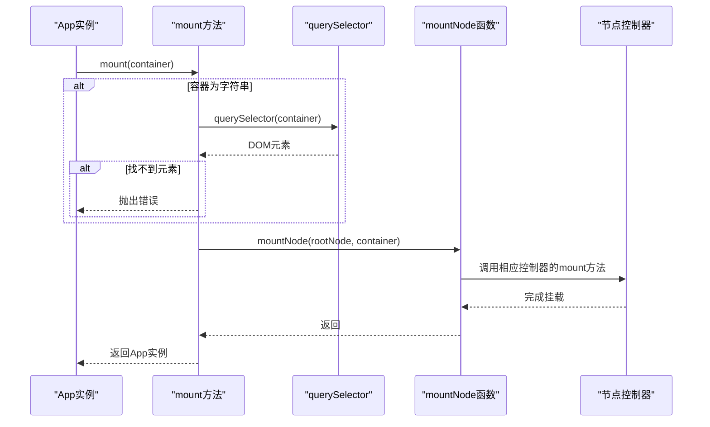
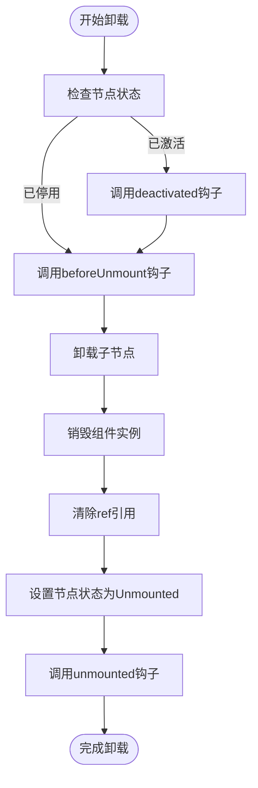
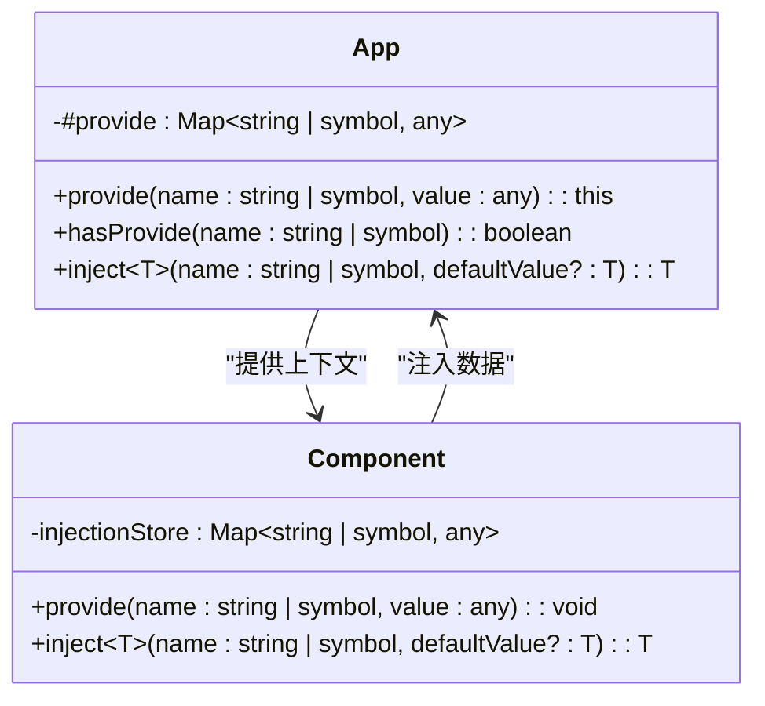
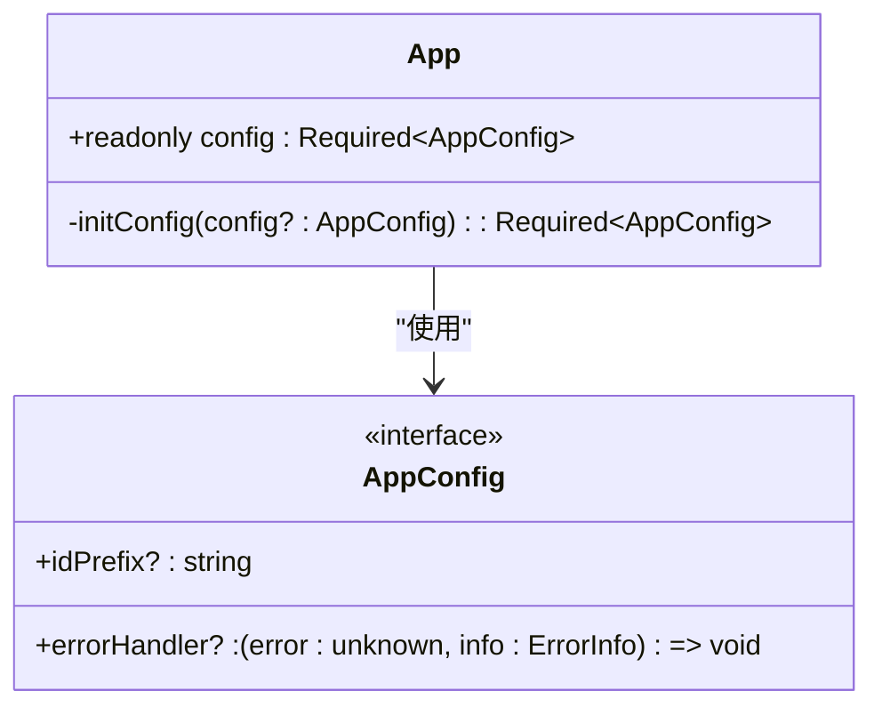

# 应用实例管理

<cite>
**本文档引用的文件**
- [App.ts](file://packages/runtime-core/src/app/App.ts#L1-L394)
- [factory.ts](file://packages/runtime-dom/src/client/factory.ts#L1-L38)
- [DomRenderer.ts](file://packages/runtime-dom/src/client/DomRenderer.ts#L1-L573)
- [api.ts](file://packages/runtime-core/src/renderer/api.ts#L1-L28)
- [provide.ts](file://packages/runtime-core/src/runtime/provide.ts#L1-L131)
- [driver.ts](file://packages/runtime-core/src/vnode/core/driver.ts#L81-L123)
</cite>

## 目录
1. [应用实例创建](#应用实例创建)
2. [挂载流程解析](#挂载流程解析)
3. [卸载与资源清理](#卸载与资源清理)
4. [应用级别状态共享](#应用级别状态共享)
5. [插件系统实现](#插件系统实现)
6. [配置扩展与自定义](#配置扩展与自定义)

## 应用实例创建

应用实例的创建通过`createApp`工厂函数完成，该函数位于`runtime-dom`包中，负责初始化应用实例并注入DOM渲染器。`createApp`函数接受根组件或根虚拟节点以及可选的配置对象作为参数，返回一个`App`实例。

`createApp`函数的实现首先通过`setRenderer`设置全局渲染器为`DomRenderer`实例，然后注册各种节点控制器，最后调用`App`类的构造函数创建应用实例。在`App`类的构造函数中，会根据传入的根组件类型创建相应的虚拟节点，并初始化应用配置。

```mermaid
classDiagram
class App {
+readonly config : Required~AppConfig~
+readonly rootNode : VNode
+readonly version : string
-#provide : Map~string | symbol, any~
-#directives : Map~string, Directive~
+constructor(root : VNode | WidgetTypes, config? : AppConfig)
+mount(container : HostParentElement | string) : this
+unmount() : void
+directive(name : string) : Directive | undefined
+directive(name : string, directive : DirectiveOptions | DirectiveOptions['mounted'] | DirectiveOptions['updated']) : this
+provide(name : string | symbol, value : any) : this
+hasProvide(name : string | symbol) : boolean
+inject~T~(name : string | symbol, defaultValue? : T) : T
+use(plugin : AppPlugin~T~, options? : T) : this
}
class DomRenderer {
+createElement~T~(vnode : ElementVNode~T~) : HostElements~T~
+isContainer(el : HostNodeElements) : boolean
+createFragment(vnode : FragmentVNode) : HostFragmentElement
+createText(text : string) : HostTextElement
+createComment(text : string) : HostCommentElement
+isVoidElement(tag : string) : tag is HostVoidElementNames
+isElement(el : HostNodeElements) : el is HostElements
+isFragment(el : HostNodeElements) : el is HostFragmentElement
+remove(el : HostNodeElements) : void
+insertBefore(child : HostNodeElements, anchor : HostNodeElements) : void
+replace(newChild : HostNodeElements, oldChild : HostNodeElements) : void
+appendChild(el : HostNodeElements, parent : HostParentElement | HostRegularElements | HostFragmentElement) : void
+addStyle(el : HostElements, key : string, value : string) : void
+removeStyle(el : HostElements, key : string) : void
+getBoundingClientRect(el : HostElements) : DOMRect
+setClass(el : HostElements, classValue : string[]) : void
+addClass(el : HostElements, className : string) : void
+removeClass(el : HostElements, className : string) : void
+requestAnimationFrame(fn : () => void) : number
+cancelAnimationFrame(id : number) : void
+setStyle(el : HostElements, style : StyleProperties) : void
+getStyle(el : HostElements, key : string) : string | null
+setAttribute(el : HostElements, name : string, nextValue : any, prevValue? : any) : void
+removeAttribute(el : HostElements, key : string, prevValue? : any) : void
+setText(el : HostTextElement | HostCommentElement, value : string) : void
+querySelector(selector : string, container? : HostParentElement) : HostElements | null
+querySelectorAll(selector : string, container? : HostParentElement) : Iterable~HostElements~
+getParentElement(el : HostNodeElements) : HostParentElement | null
+getAnimationDuration(el : HostElements) : number
+getTransitionDuration(el : HostElements) : number
}
class HostRenderer {
<<interface>>
+createElement~T~(vnode : ElementVNode~T~) : HostElements~T~
+isContainer(el : HostNodeElements) : boolean
+createFragment(vnode : FragmentVNode) : HostFragmentElement
+createText(text : string) : HostTextElement
+createComment(text : string) : HostCommentElement
+isVoidElement(tag : string) : tag is HostVoidElementNames
+isElement(el : HostNodeElements) : el is HostElements
+isFragment(el : HostNodeElements) : el is HostFragmentElement
+remove(el : HostNodeElements) : void
+insertBefore(child : HostNodeElements, anchor : HostNodeElements) : void
+replace(newChild : HostNodeElements, oldChild : HostNodeElements) : void
+appendChild(el : HostNodeElements, parent : HostParentElement | HostRegularElements | HostFragmentElement) : void
+addStyle(el : HostElements, key : string, value : string) : void
+removeStyle(el : HostElements, key : string) : void
+getBoundingClientRect(el : HostElements) : DOMRect
+setClass(el : HostElements, classValue : string[]) : void
+addClass(el : HostElements, className : string) : void
+removeClass(el : HostElements, className : string) : void
+requestAnimationFrame(fn : () => void) : number
+cancelAnimationFrame(id : number) : void
+setStyle(el : HostElements, style : StyleProperties) : void
+getStyle(el : HostElements, key : string) : string | null
+setAttribute(el : HostElements, name : string, nextValue : any, prevValue? : any) : void
+removeAttribute(el : HostElements, key : string, prevValue? : any) : void
+setText(el : HostTextElement | HostCommentElement, value : string) : void
+querySelector(selector : string, container? : HostParentElement) : HostElements | null
+querySelectorAll(selector : string, container? : HostParentElement) : Iterable~HostElements~
+getParentElement(el : HostNodeElements) : HostParentElement | null
+getAnimationDuration(el : HostElements) : number
+getTransitionDuration(el : HostElements) : number
}
App --> DomRenderer : "使用"
DomRenderer ..|> HostRenderer : "实现"
```



**图示来源**
- [App.ts](file://packages/runtime-core/src/app/App.ts#L107-L394)
- [DomRenderer.ts](file://packages/runtime-dom/src/client/DomRenderer.ts#L62-L573)
- [api.ts](file://packages/runtime-core/src/renderer/api.ts#L1-L28)

**本节来源**
- [App.ts](file://packages/runtime-core/src/app/App.ts#L107-L394)
- [factory.ts](file://packages/runtime-dom/src/client/factory.ts#L1-L38)

## 挂载流程解析

应用实例的挂载流程通过`mount`方法实现，该方法接受一个容器元素或选择器字符串作为参数。当传入选择器字符串时，会通过`querySelector`方法查找对应的DOM元素。如果找不到对应的元素，则会抛出错误。

挂载流程的核心是`mountNode`函数，它负责将虚拟节点树挂载到指定的容器中。在挂载过程中，会递归遍历虚拟节点树，为每个节点创建相应的DOM元素，并将其插入到容器中。同时，会为每个节点设置应用上下文，以便在后续的渲染和更新过程中使用。



**图示来源**
- [App.ts](file://packages/runtime-core/src/app/App.ts#L187-L202)
- [DomRenderer.ts](file://packages/runtime-dom/src/client/DomRenderer.ts#L358-L361)
- [driver.ts](file://packages/runtime-core/src/vnode/core/driver.ts#L81-L123)

**本节来源**
- [App.ts](file://packages/runtime-core/src/app/App.ts#L187-L202)
- [DomRenderer.ts](file://packages/runtime-dom/src/client/DomRenderer.ts#L358-L361)

## 卸载与资源清理

应用实例的卸载通过`unmount`方法实现，该方法会调用`unmountNode`函数来清理资源。在卸载过程中，会递归遍历虚拟节点树，调用每个节点的`unmount`方法来清理相关资源。

对于有状态组件，会先调用`deactivated`生命周期钩子，然后调用`beforeUnmount`钩子，最后调用`unmounted`钩子。同时，会清除节点的`el`引用和`ref`引用，将节点状态设置为`Unmounted`。



**图示来源**
- [App.ts](file://packages/runtime-core/src/app/App.ts#L207-L209)
- [driver.ts](file://packages/runtime-core/src/vnode/core/driver.ts#L100-L109)
- [BaseWidgetController.ts](file://packages/runtime-core/src/controllers/BaseWidgetController.ts#L105-L114)
- [StatefulWidgetController.ts](file://packages/runtime-core/src/controllers/StatefulWidgetController.ts#L101-L113)

**本节来源**
- [App.ts](file://packages/runtime-core/src/app/App.ts#L207-L209)
- [driver.ts](file://packages/runtime-core/src/vnode/core/driver.ts#L100-L109)

## 应用级别状态共享

应用实例通过`provide`和`inject`方法实现应用级别的状态共享。`provide`方法用于在应用实例中提供数据，而`inject`方法用于在组件中注入数据。

`provide`方法将数据存储在`App`实例的`#provide`映射中，而`inject`方法则会先在当前组件的祖先节点中查找提供的数据，如果找不到，则会从应用实例的`#provide`映射中获取数据。这种机制允许在应用级别共享状态，而不需要通过props层层传递。



**图示来源**
- [App.ts](file://packages/runtime-core/src/app/App.ts#L313-L336)
- [provide.ts](file://packages/runtime-core/src/runtime/provide.ts#L1-L131)

**本节来源**
- [App.ts](file://packages/runtime-core/src/app/App.ts#L313-L336)
- [provide.ts](file://packages/runtime-core/src/runtime/provide.ts#L1-L131)

## 插件系统实现

应用实例的插件系统通过`use`方法实现，该方法接受一个插件函数或插件对象作为参数。插件可以是一个函数，也可以是一个包含`install`方法的对象。`use`方法会调用插件的`install`方法，并将应用实例和配置选项作为参数传递。

插件系统支持三种类型的插件：无配置选项的插件、有必填选项的插件和有可选选项的插件。这种设计使得插件可以灵活地接受配置选项，同时保持API的一致性。

```mermaid
classDiagram
class App {
+use(plugin : AppPlugin~T~, options? : T) : this
}
class AppPlugin~T~ {
<<interface>>
+install : AppPluginInstall~T~
}
class AppObjectPlugin~T~ {
+install : AppPluginInstall~T~
}
class AppPluginInstall~T~ {
<<interface>>
(app : App, options? : T) => void
}
App --> AppPlugin : "使用"
AppObjectPlugin --|> AppPlugin : "实现"
AppPluginInstall --|> AppPlugin : "实现"
```

**图示来源**
- [App.ts](file://packages/runtime-core/src/app/App.ts#L343-L392)

**本节来源**
- [App.ts](file://packages/runtime-core/src/app/App.ts#L343-L392)

## 配置扩展与自定义

应用实例的配置通过`AppConfig`接口定义，包含错误处理器和ID前缀等选项。在创建应用实例时，可以传入自定义的配置对象来覆盖默认配置。

`initConfig`方法负责初始化应用配置，它会将默认配置与传入的配置合并。默认配置包含一个默认的错误处理函数和一个默认的ID前缀。通过这种方式，应用实例可以灵活地扩展和自定义配置。



**图示来源**
- [App.ts](file://packages/runtime-core/src/app/App.ts#L19-L36)
- [App.ts](file://packages/runtime-core/src/app/App.ts#L216-L224)

**本节来源**
- [App.ts](file://packages/runtime-core/src/app/App.ts#L19-L36)
- [App.ts](file://packages/runtime-core/src/app/App.ts#L216-L224)