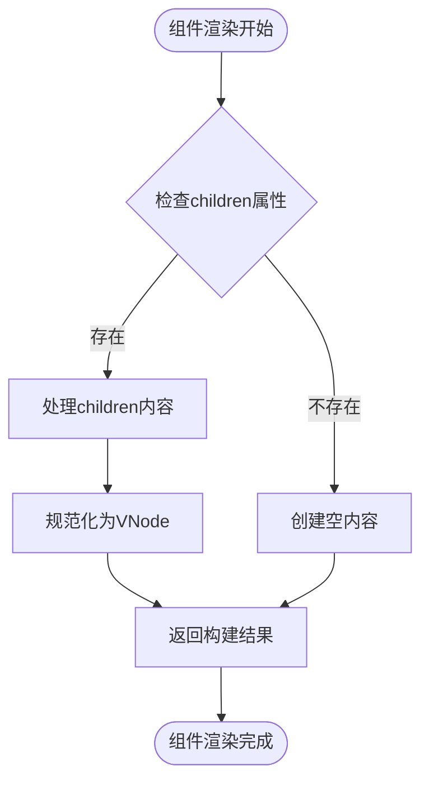
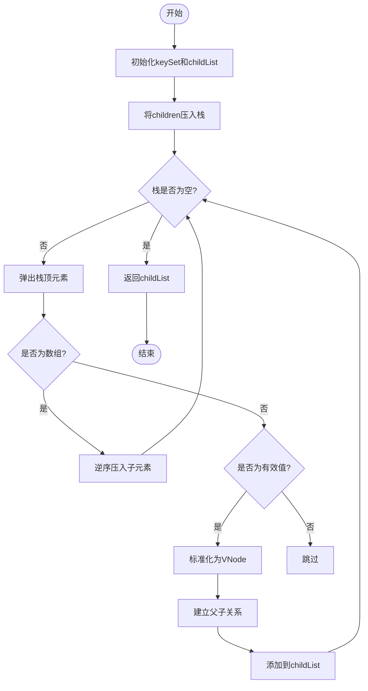
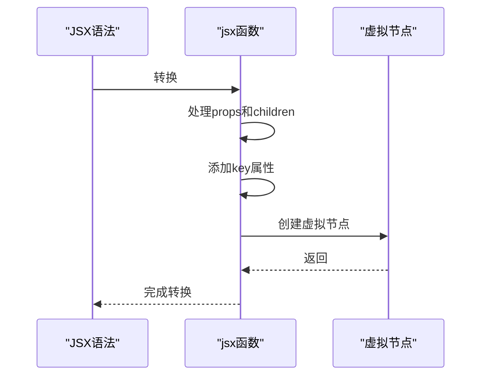
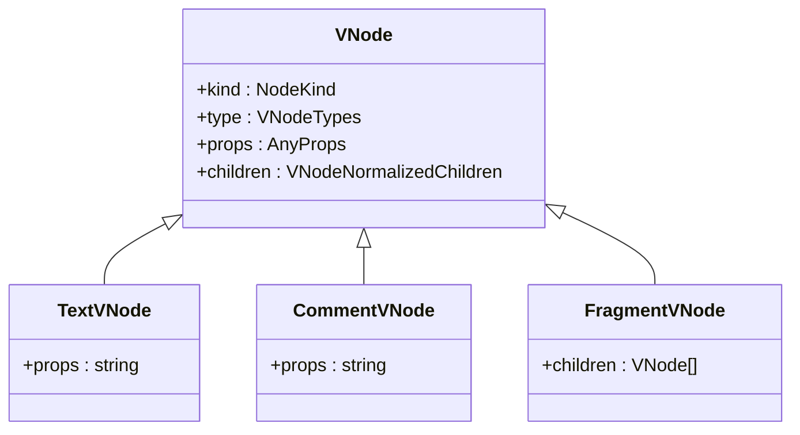
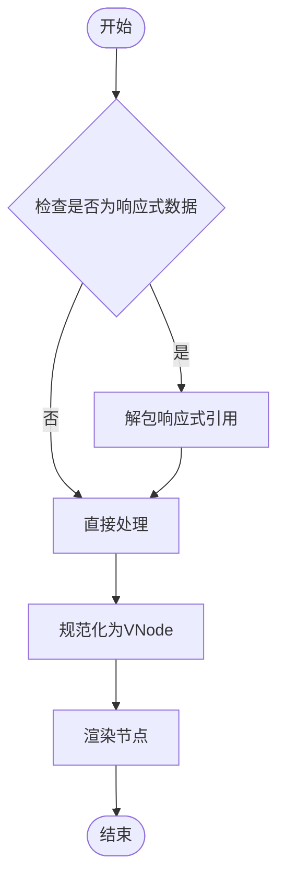

# 插槽（Slot）机制

<cite>
**本文档引用的文件**
- [children.ts](file://packages/runtime-core/src/vnode/normalizer/children.ts)
- [widget.ts](file://packages/runtime-core/src/types/widget.ts)
- [vnode.ts](file://packages/runtime-core/src/types/vnode.ts)
- [jsx-runtime.ts](file://packages/vitarx/src/jsx-runtime.ts)
- [Stateless.ts](file://packages/runtime-core/src/widget/runtime/Stateless.ts)
- [Stateful.ts](file://packages/runtime-core/src/widget/runtime/Stateful.ts)
- [FnWidget.ts](file://packages/runtime-core/src/widget/base/FnWidget.ts)
- [PropBind.ts](file://packages/runtime-core/src/widget/widgets/PropBind.ts)
</cite>

## 目录
1. [引言](#引言)
2. [插槽类型与使用方法](#插槽类型与使用方法)
3. [插槽内容的规范化处理](#插槽内容的规范化处理)
4. [编译时标记与运行时解析](#编译时标记与运行时解析)
5. [TSX中的插槽语法](#tsx中的插槽语法)
6. [响应式数据结合使用](#响应式数据结合使用)
7. [性能优化建议](#性能优化建议)
8. [结论](#结论)

## 引言

插槽（Slot）机制是vitarx框架中实现组件内容分发的核心功能。通过插槽，父组件可以向子组件传递任意的DOM结构或组件，实现灵活的UI组合。vitarx的插槽实现基于虚拟DOM的规范化处理和运行时解析，支持默认插槽、具名插槽和作用域插槽三种类型。本文档将深入解析vitarx插槽的实现原理，包括其在虚拟DOM创建阶段的处理流程、组件渲染时的动态分发机制，以及与响应式系统的集成方式。

## 插槽类型与使用方法

vitarx框架支持三种插槽类型：默认插槽、具名插槽和作用域插槽。这些插槽通过组件的`children`属性实现内容传递，其使用方法遵循JSX语法规范。

### 默认插槽

默认插槽是最基本的插槽类型，用于传递组件的主要内容。当组件的`children`属性包含VNode、字符串或数字时，这些内容将作为默认插槽被处理。在运行时，无状态组件会直接返回`children`作为构建结果，而有状态组件则通过`build`方法返回。



**Diagram sources**
- [Stateless.ts](file://packages/runtime-core/src/widget/runtime/Stateless.ts#L43-L65)
- [Stateful.ts](file://packages/runtime-core/src/widget/runtime/Stateful.ts#L280-L306)

### 具名插槽

具名插槽通过在`children`属性中使用对象结构来实现，允许为不同位置的内容指定名称。虽然框架核心代码中未直接体现具名插槽的处理逻辑，但可以通过`props`传递包含多个插槽内容的对象来实现类似功能。

### 作用域插槽

作用域插槽允许子组件向父组件暴露内部状态。在vitarx中，这通过函数类型的`children`实现。当`children`为函数时，子组件可以调用该函数并传入内部状态作为参数，从而实现数据的反向传递。

**Section sources**
- [vnode.ts](file://packages/runtime-core/src/types/vnode.ts#L124-L125)
- [widget.ts](file://packages/runtime-core/src/types/widget.ts#L116-L119)

## 插槽内容的规范化处理

插槽内容在虚拟DOM创建阶段会经过规范化处理，确保所有类型的内容都能被正确渲染。这一过程主要由`initChildren`函数完成，它负责将各种类型的输入转换为标准化的虚拟节点数组。

### 子节点规范化流程

`initChildren`函数采用迭代方式处理嵌套的子节点数组，避免了深度递归可能导致的栈溢出问题。处理流程包括：初始化key集合用于检测重复key、使用栈结构扁平化嵌套数组、将非VNode值转换为文本节点、建立子节点与父节点的关联。



**Diagram sources**
- [children.ts](file://packages/runtime-core/src/vnode/normalizer/children.ts#L105-L148)

### 文本节点转换

对于字符串和数字类型的插槽内容，框架会自动将其转换为文本节点。`normalizeChild`函数负责这一转换过程，它检查输入是否已经是虚拟节点，如果是则直接返回，否则创建新的文本节点。

**Section sources**
- [children.ts](file://packages/runtime-core/src/vnode/normalizer/children.ts#L72-L85)

## 编译时标记与运行时解析

vitarx的插槽机制结合了编译时标记和运行时解析，确保插槽内容能够高效地被处理和渲染。

### 编译时标记

在JSX编译阶段，插槽内容会被标记为`children`属性。`jsx`函数负责将JSX语法转换为虚拟节点，其中`children`作为`props`的一部分被传递。开发模式下，还会添加调试信息用于错误追踪。



**Diagram sources**
- [jsx-runtime.ts](file://packages/vitarx/src/jsx-runtime.ts#L15-L28)
- [jsx-dev-runtime.ts](file://packages/vitarx/src/jsx-dev-runtime.ts#L24-L44)

### 运行时解析

在组件渲染时，运行时系统会解析`children`属性并执行相应的构建逻辑。无状态组件直接调用其类型函数，而有状态组件则通过`build`方法生成虚拟节点。对于异步组件，框架提供了`initializeFnWidget`函数来处理异步初始化过程。

**Section sources**
- [Stateless.ts](file://packages/runtime-core/src/widget/runtime/Stateless.ts#L25-L65)
- [Stateful.ts](file://packages/runtime-core/src/widget/runtime/Stateful.ts#L249-L269)
- [FnWidget.ts](file://packages/runtime-core/src/widget/base/FnWidget.ts#L264-L281)

## TSX中的插槽语法

在TSX中，插槽的使用遵循标准的JSX语法。通过`children`属性传递内容，支持默认插槽、具名插槽和作用域插槽的使用。

### 基本语法

```tsx
// 默认插槽
<MyComponent>
  <div>插槽内容</div>
</MyComponent>

// 通过children属性传递
<MyComponent children={<div>插槽内容</div>} />

// 作用域插槽
<MyComponent>
  {(scopedData) => <div>{scopedData.value}</div>}
</MyComponent>
```

### 类型定义

vitarx提供了完善的类型定义支持，确保插槽使用的类型安全。`AnyChild`类型定义了所有可作为子节点的类型，包括`null`、`undefined`、`boolean`、`number`、`string`和`VNode`。



**Diagram sources**
- [vnode.ts](file://packages/runtime-core/src/types/vnode.ts#L114-L130)
- [children.ts](file://packages/runtime-core/src/vnode/normalizer/children.ts#L105-L148)

## 响应式数据结合使用

插槽与响应式数据的结合使用是vitarx框架的一大特色。通过将响应式数据作为插槽内容传递，可以实现动态的内容更新。

### 最佳实践

1. **避免在插槽中创建新的响应式引用**：直接使用父组件传递的响应式数据，避免不必要的性能开销。
2. **合理使用作用域插槽**：当需要子组件向父组件暴露内部状态时，使用函数类型的`children`。
3. **利用Fragment优化渲染**：对于多个插槽内容，使用`Fragment`避免创建不必要的DOM节点。



**Section sources**
- [children.ts](file://packages/runtime-core/src/vnode/normalizer/children.ts#L116)
- [FnWidget.ts](file://packages/runtime-core/src/widget/base/FnWidget.ts#L266)

## 性能优化建议

为了确保插槽机制的高性能，建议遵循以下优化策略：

### 减少不必要的重渲染

通过合理使用`key`属性和响应式系统的依赖追踪，避免插槽内容的不必要重渲染。对于静态内容，可以使用`isStatic`标记来优化更新过程。

### 批量更新

利用框架的调度系统，将多个更新操作合并为一次批量更新，减少DOM操作次数。`Scheduler.queueJob`函数提供了这一功能。

### 避免深层嵌套

尽量减少插槽内容的嵌套层级，避免`initChildren`函数处理过深的嵌套数组，从而提高性能。

**Section sources**
- [Stateful.ts](file://packages/runtime-core/src/widget/runtime/Stateful.ts#L194-L203)
- [children.ts](file://packages/runtime-core/src/vnode/normalizer/children.ts#L105-L148)

## 结论

vitarx的插槽机制通过虚拟DOM的规范化处理和运行时解析，实现了灵活高效的内容分发。从默认插槽到作用域插槽，框架提供了完整的解决方案，支持各种复杂的应用场景。通过与响应式系统的深度集成，插槽内容能够实现动态更新，同时保持良好的性能表现。开发者应遵循最佳实践，合理使用插槽功能，以构建高效、可维护的用户界面。