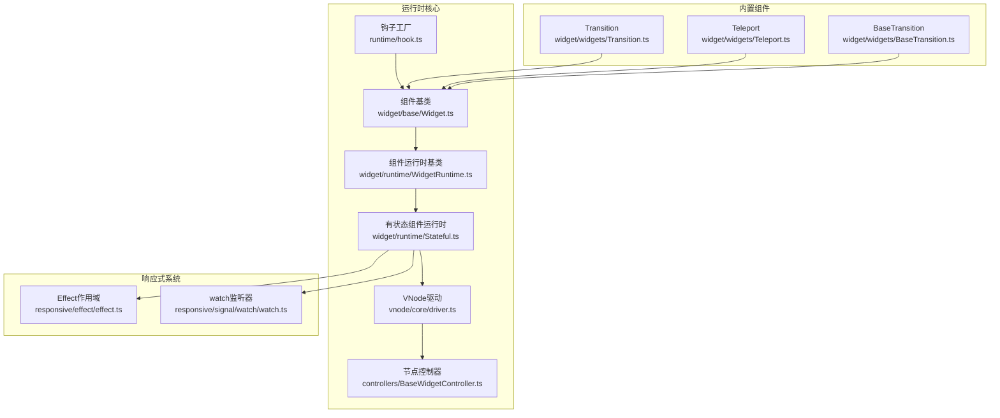
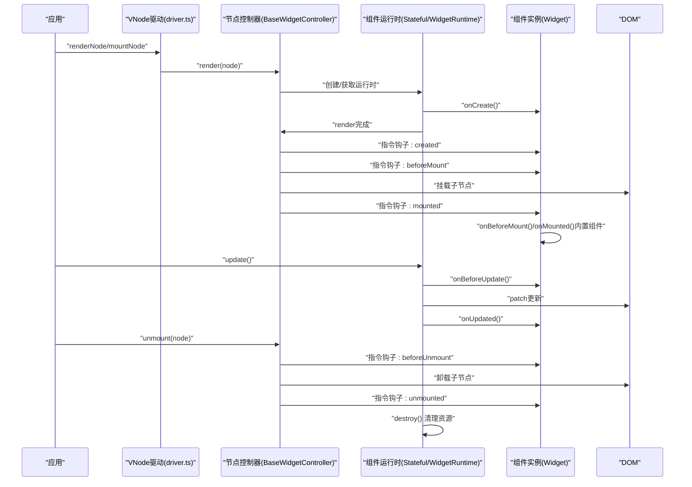
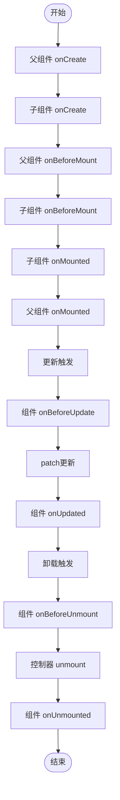
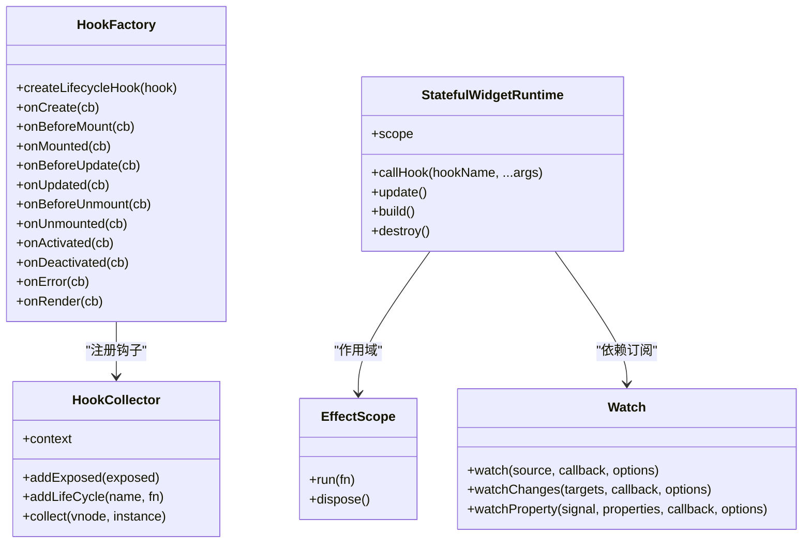
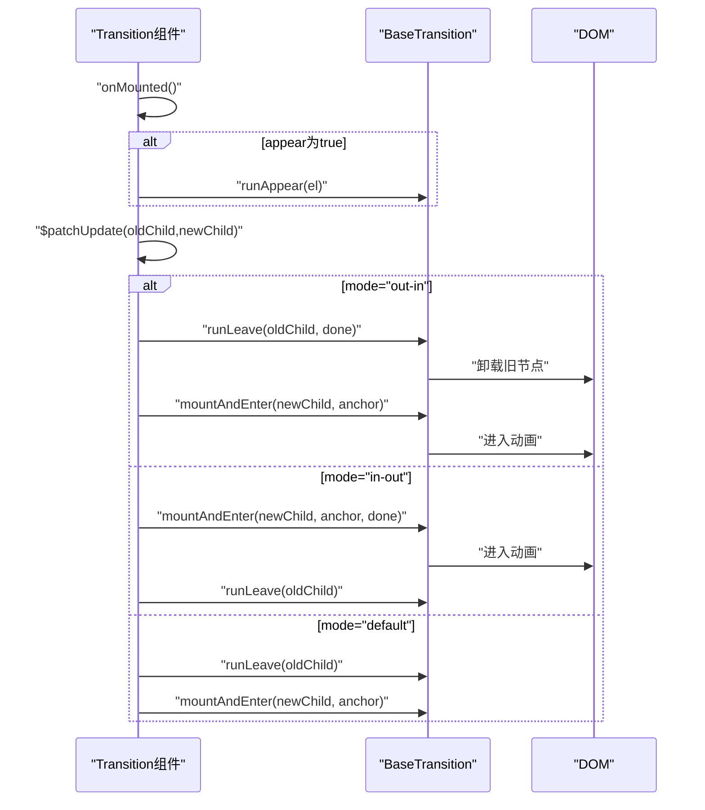
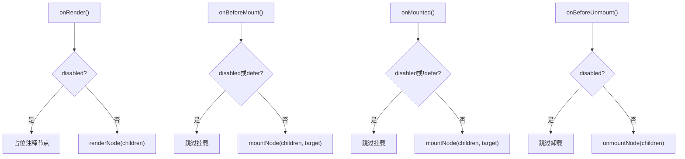
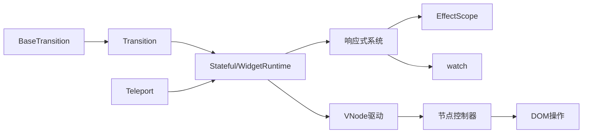

# 生命周期管理

<cite>
**本文引用的文件**
- [packages/runtime-core/src/constants/hook.ts](file://packages/runtime-core/src/constants/hook.ts)
- [packages/runtime-core/src/types/lifecycle.ts](file://packages/runtime-core/src/types/lifecycle.ts)
- [packages/runtime-core/src/runtime/hook.ts](file://packages/runtime-core/src/runtime/hook.ts)
- [packages/runtime-core/src/widget/base/Widget.ts](file://packages/runtime-core/src/widget/base/Widget.ts)
- [packages/runtime-core/src/widget/runtime/WidgetRuntime.ts](file://packages/runtime-core/src/widget/runtime/WidgetRuntime.ts)
- [packages/runtime-core/src/widget/runtime/Stateful.ts](file://packages/runtime-core/src/widget/runtime/Stateful.ts)
- [packages/runtime-core/src/widget/widgets/Transition.ts](file://packages/runtime-core/src/widget/widgets/Transition.ts)
- [packages/runtime-core/src/widget/widgets/Teleport.ts](file://packages/runtime-core/src/widget/widgets/Teleport.ts)
- [packages/runtime-core/src/widget/widgets/BaseTransition.ts](file://packages/runtime-core/src/widget/widgets/BaseTransition.ts)
- [packages/runtime-core/src/controllers/BaseWidgetController.ts](file://packages/runtime-core/src/controllers/BaseWidgetController.ts)
- [packages/runtime-core/src/vnode/core/driver.ts](file://packages/runtime-core/src/vnode/core/driver.ts)
- [packages/responsive/src/effect/effect.ts](file://packages/responsive/src/effect/effect.ts)
- [packages/responsive/src/signal/watch/watch.ts](file://packages/responsive/src/signal/watch/watch.ts)
- [packages/runtime-core/__tests__/runtime/hook.test.ts](file://packages/runtime-core/__tests__/runtime/hook.test.ts)
- [packages/runtime-core/__tests__/widget/base/Widget.test.ts](file://packages/runtime-core/__tests__/widget/base/Widget.test.ts)
</cite>

## 目录
1. [引言](#引言)
2. [项目结构](#项目结构)
3. [核心组件](#核心组件)
4. [架构总览](#架构总览)
5. [详细组件分析](#详细组件分析)
6. [依赖关系分析](#依赖关系分析)
7. [性能考量](#性能考量)
8. [故障排查指南](#故障排查指南)
9. [结论](#结论)
10. [附录](#附录)

## 引言
本文件围绕 vitarx 的组件生命周期进行全面解析，涵盖从组件创建、渲染、挂载到卸载的完整流程，重点阐述 onCreate、onBeforeMount、onMounted、onBeforeUnmount、onUnmounted 等生命周期钩子的触发时机与执行顺序，并结合 Transition、Teleport 等内置组件的 onMounted 实现，展示生命周期钩子在实际场景中的应用。文档同时说明副作用清理、DOM 操作时机、异步资源加载等关键实践，给出生命周期流程图与常见错误预防措施，并解释 hook 函数的内部实现机制及其与响应式系统的协同工作方式。

## 项目结构
vitarx 的生命周期管理分布在运行时核心包与响应式系统之间，形成“钩子注册—运行时调度—渲染驱动—内置组件”的分层架构。关键目录与职责如下：
- 运行时核心（runtime-core）：生命周期常量、类型定义、钩子工厂、组件运行时、控制器、VNode 驱动等
- 响应式系统（responsive）：EffectScope、watch、依赖订阅与调度等
- 内置组件（widgets）：Transition、Teleport 等，演示生命周期钩子的实际使用

图表来源
- [packages/runtime-core/src/runtime/hook.ts](file://packages/runtime-core/src/runtime/hook.ts#L1-L266)
- [packages/runtime-core/src/widget/base/Widget.ts](file://packages/runtime-core/src/widget/base/Widget.ts#L1-L371)
- [packages/runtime-core/src/widget/runtime/WidgetRuntime.ts](file://packages/runtime-core/src/widget/runtime/WidgetRuntime.ts#L1-L123)
- [packages/runtime-core/src/widget/runtime/Stateful.ts](file://packages/runtime-core/src/widget/runtime/Stateful.ts#L1-L361)
- [packages/runtime-core/src/controllers/BaseWidgetController.ts](file://packages/runtime-core/src/controllers/BaseWidgetController.ts#L1-L116)
- [packages/runtime-core/src/vnode/core/driver.ts](file://packages/runtime-core/src/vnode/core/driver.ts#L1-L124)
- [packages/responsive/src/effect/effect.ts](file://packages/responsive/src/effect/effect.ts#L1-L261)
- [packages/responsive/src/signal/watch/watch.ts](file://packages/responsive/src/signal/watch/watch.ts#L1-L432)
- [packages/runtime-core/src/widget/widgets/Transition.ts](file://packages/runtime-core/src/widget/widgets/Transition.ts#L1-L246)
- [packages/runtime-core/src/widget/widgets/Teleport.ts](file://packages/runtime-core/src/widget/widgets/Teleport.ts#L1-L165)
- [packages/runtime-core/src/widget/widgets/BaseTransition.ts](file://packages/runtime-core/src/widget/widgets/BaseTransition.ts#L1-L411)

章节来源
- [packages/runtime-core/src/runtime/hook.ts](file://packages/runtime-core/src/runtime/hook.ts#L1-L266)
- [packages/runtime-core/src/widget/base/Widget.ts](file://packages/runtime-core/src/widget/base/Widget.ts#L1-L371)
- [packages/runtime-core/src/widget/runtime/WidgetRuntime.ts](file://packages/runtime-core/src/widget/runtime/WidgetRuntime.ts#L1-L123)
- [packages/runtime-core/src/widget/runtime/Stateful.ts](file://packages/runtime-core/src/widget/runtime/Stateful.ts#L1-L361)
- [packages/runtime-core/src/controllers/BaseWidgetController.ts](file://packages/runtime-core/src/controllers/BaseWidgetController.ts#L1-L116)
- [packages/runtime-core/src/vnode/core/driver.ts](file://packages/runtime-core/src/vnode/core/driver.ts#L1-L124)

## 核心组件
- 生命周期常量与类型：定义生命周期钩子枚举、钩子名与返回值类型、错误来源与错误处理器类型，确保类型安全与统一的钩子语义。
- 钩子工厂与收集器：提供 createLifecycleHook 工厂与 HookCollector 收集器，负责钩子注册、上下文收集与暴露数据注入。
- 组件基类与运行时：Widget 提供生命周期钩子的约定与 $el/$vnode 等能力；WidgetRuntime 提供懒构建 child、上下文执行与销毁；StatefulWidgetRuntime 负责实例创建、依赖订阅、更新调度与错误上报。
- 节点控制器与 VNode 驱动：BaseWidgetController 在渲染、挂载、激活、停用、卸载各阶段调用指令钩子；driver.ts 统一调度渲染、挂载、激活、停用、卸载与属性更新。
- 内置组件：Transition 在首次挂载时触发 appear 动画；Teleport 在 beforeMount/onMounted 阶段将子节点挂载到目标容器；BaseTransition 提供 CSS/JS 钩子与过渡时序控制。

章节来源
- [packages/runtime-core/src/constants/hook.ts](file://packages/runtime-core/src/constants/hook.ts#L1-L15)
- [packages/runtime-core/src/types/lifecycle.ts](file://packages/runtime-core/src/types/lifecycle.ts#L1-L139)
- [packages/runtime-core/src/runtime/hook.ts](file://packages/runtime-core/src/runtime/hook.ts#L1-L266)
- [packages/runtime-core/src/widget/base/Widget.ts](file://packages/runtime-core/src/widget/base/Widget.ts#L1-L371)
- [packages/runtime-core/src/widget/runtime/WidgetRuntime.ts](file://packages/runtime-core/src/widget/runtime/WidgetRuntime.ts#L1-L123)
- [packages/runtime-core/src/widget/runtime/Stateful.ts](file://packages/runtime-core/src/widget/runtime/Stateful.ts#L1-L361)
- [packages/runtime-core/src/controllers/BaseWidgetController.ts](file://packages/runtime-core/src/controllers/BaseWidgetController.ts#L1-L116)
- [packages/runtime-core/src/vnode/core/driver.ts](file://packages/runtime-core/src/vnode/core/driver.ts#L1-L124)
- [packages/runtime-core/src/widget/widgets/Transition.ts](file://packages/runtime-core/src/widget/widgets/Transition.ts#L1-L246)
- [packages/runtime-core/src/widget/widgets/Teleport.ts](file://packages/runtime-core/src/widget/widgets/Teleport.ts#L1-L165)
- [packages/runtime-core/src/widget/widgets/BaseTransition.ts](file://packages/runtime-core/src/widget/widgets/BaseTransition.ts#L1-L411)

## 架构总览
生命周期管理的总体流程如下：
- 钩子注册：通过 createLifecycleHook 将钩子注册到 HookCollector 上下文，onCreate 立即执行，其余钩子在相应阶段触发。
- 组件实例化：StatefulWidgetRuntime 在创建阶段调用组件实例的 onCreate，并在渲染阶段调用 onBeforeMount/onMounted。
- 渲染与挂载：driver.ts 调用控制器 render/mount，控制器在元素节点上按顺序调用指令钩子 created/beforeMount/mounted。
- 更新与卸载：update 阶段调用 beforeUpdate/updated；卸载阶段调用 beforeUnmount/unmounted，并清理资源。
- 内置组件：Transition 在 onMounted 时根据 appear 触发动画；Teleport 在 beforeMount/onMounted 将子节点挂载到目标容器。

图表来源
- [packages/runtime-core/src/vnode/core/driver.ts](file://packages/runtime-core/src/vnode/core/driver.ts#L1-L124)
- [packages/runtime-core/src/controllers/BaseWidgetController.ts](file://packages/runtime-core/src/controllers/BaseWidgetController.ts#L1-L116)
- [packages/runtime-core/src/widget/runtime/WidgetRuntime.ts](file://packages/runtime-core/src/widget/runtime/WidgetRuntime.ts#L1-L123)
- [packages/runtime-core/src/widget/runtime/Stateful.ts](file://packages/runtime-core/src/widget/runtime/Stateful.ts#L1-L361)
- [packages/runtime-core/src/widget/base/Widget.ts](file://packages/runtime-core/src/widget/base/Widget.ts#L1-L371)

## 详细组件分析

### 生命周期钩子与执行顺序
- 钩子注册与收集：createLifecycleHook 将钩子注册到 HookCollector 上下文；defineExpose 将暴露数据注入上下文；onCreate 立即执行，其余钩子在相应阶段触发。
- 嵌套组件顺序：父组件 onCreate 先于子组件 onCreate；随后依次为父 onBeforeMount、子 onBeforeMount、子 onMounted、父 onMounted，与 Vue 一致。
- 更新顺序：beforeUpdate → 渲染 → updated；停用/激活：deactivated/activated 由 KeepAlive 触发。
- 卸载顺序：beforeUnmount → 卸载 → unmounted；destroy() 清理资源。

图表来源
- [packages/runtime-core/src/runtime/hook.ts](file://packages/runtime-core/src/runtime/hook.ts#L140-L211)
- [packages/runtime-core/src/widget/base/Widget.ts](file://packages/runtime-core/src/widget/base/Widget.ts#L116-L322)
- [packages/runtime-core/src/controllers/BaseWidgetController.ts](file://packages/runtime-core/src/controllers/BaseWidgetController.ts#L77-L115)
- [packages/runtime-core/__tests__/widget/base/Widget.test.ts](file://packages/runtime-core/__tests__/widget/base/Widget.test.ts#L241-L294)

章节来源
- [packages/runtime-core/src/runtime/hook.ts](file://packages/runtime-core/src/runtime/hook.ts#L140-L211)
- [packages/runtime-core/src/widget/base/Widget.ts](file://packages/runtime-core/src/widget/base/Widget.ts#L116-L322)
- [packages/runtime-core/src/controllers/BaseWidgetController.ts](file://packages/runtime-core/src/controllers/BaseWidgetController.ts#L77-L115)
- [packages/runtime-core/__tests__/widget/base/Widget.test.ts](file://packages/runtime-core/__tests__/widget/base/Widget.test.ts#L241-L294)

### Hook 函数的内部实现机制与响应式协同
- HookCollector：在函数式组件渲染期间，通过 runInContext 将钩子与暴露数据收集到上下文，onMounted/onBeforeMount 等钩子通过 createLifecycleHook 注册到上下文。
- defineExpose：过滤保留关键词，防止与 Widget 内部属性冲突，然后注入到上下文。
- 响应式协同：StatefulWidgetRuntime 在构建阶段使用 depSubscribe 订阅渲染依赖，enableScheduler 使用 Scheduler.queueJob 合并更新，update 阶段调用 beforeUpdate/updated；watch 提供清理函数 onCleanup，便于在钩子中注册副作用并在更新前清理。

图表来源
- [packages/runtime-core/src/runtime/hook.ts](file://packages/runtime-core/src/runtime/hook.ts#L1-L266)
- [packages/responsive/src/effect/effect.ts](file://packages/responsive/src/effect/effect.ts#L1-L261)
- [packages/responsive/src/signal/watch/watch.ts](file://packages/responsive/src/signal/watch/watch.ts#L1-L432)
- [packages/runtime-core/src/widget/runtime/Stateful.ts](file://packages/runtime-core/src/widget/runtime/Stateful.ts#L1-L361)

章节来源
- [packages/runtime-core/src/runtime/hook.ts](file://packages/runtime-core/src/runtime/hook.ts#L1-L266)
- [packages/responsive/src/effect/effect.ts](file://packages/responsive/src/effect/effect.ts#L1-L261)
- [packages/responsive/src/signal/watch/watch.ts](file://packages/responsive/src/signal/watch/watch.ts#L1-L432)
- [packages/runtime-core/src/widget/runtime/Stateful.ts](file://packages/runtime-core/src/widget/runtime/Stateful.ts#L1-L361)

### Transition 的 onMounted 实现与过渡时序
- Transition 在 onMounted 中根据 props.appear 决定是否触发首次出现动画；$patchUpdate 中根据 mode 执行 out-in/in-out/default 模式，分别在离开动画完成后挂载新节点或在进入动画完成后执行离开动画。
- BaseTransition 提供 runEnter/runLeave/runAppear 统一处理 CSS/JS 钩子，支持取消、持续时间计算与 after 钩子触发。

图表来源
- [packages/runtime-core/src/widget/widgets/Transition.ts](file://packages/runtime-core/src/widget/widgets/Transition.ts#L150-L246)
- [packages/runtime-core/src/widget/widgets/BaseTransition.ts](file://packages/runtime-core/src/widget/widgets/BaseTransition.ts#L210-L411)

章节来源
- [packages/runtime-core/src/widget/widgets/Transition.ts](file://packages/runtime-core/src/widget/widgets/Transition.ts#L150-L246)
- [packages/runtime-core/src/widget/widgets/BaseTransition.ts](file://packages/runtime-core/src/widget/widgets/BaseTransition.ts#L210-L411)

### Teleport 的挂载与卸载时机
- Teleport 在 onRender 阶段渲染占位注释节点；在 onBeforeMount（非 defer）或 onMounted（defer）阶段将子节点挂载到目标容器；onBeforeUnmount 阶段卸载。
- 目标容器验证与 isContainer 校验，开发模式下对无效目标发出警告。

图表来源
- [packages/runtime-core/src/widget/widgets/Teleport.ts](file://packages/runtime-core/src/widget/widgets/Teleport.ts#L83-L165)

章节来源
- [packages/runtime-core/src/widget/widgets/Teleport.ts](file://packages/runtime-core/src/widget/widgets/Teleport.ts#L83-L165)

### DOM 操作时机与副作用清理
- DOM 操作应在 onMounted 之后进行，避免在 onBeforeMount 访问 $el 导致无限循环。
- 副作用清理：在 onBeforeUnmount 中移除事件监听器、定时器、第三方库实例；watch 的 onCleanup 注册清理函数，确保在下次回调触发前或监听销毁时执行。
- 资源释放：destroy() 清空缓存、删除 el/anchor/runtimeInstance 引用，Effect.pause/dispose 管理可处置副作用。

章节来源
- [packages/runtime-core/src/widget/base/Widget.ts](file://packages/runtime-core/src/widget/base/Widget.ts#L97-L151)
- [packages/responsive/src/signal/watch/watch.ts](file://packages/responsive/src/signal/watch/watch.ts#L1-L432)
- [packages/responsive/src/effect/effect.ts](file://packages/responsive/src/effect/effect.ts#L1-L261)
- [packages/runtime-core/src/widget/runtime/WidgetRuntime.ts](file://packages/runtime-core/src/widget/runtime/WidgetRuntime.ts#L82-L123)

### 异步资源加载与 SSR 支持
- onRender 在客户端渲染时早于 onBeforeMount，返回 Promise 不阻塞渲染，依赖响应式更新机制自动触发视图更新；在 SSR 中可延迟占位节点替换为真实节点。
- onBeforeMount/onMounted 可用于异步数据获取与第三方库初始化，但需注意在卸载前清理资源。

章节来源
- [packages/runtime-core/src/types/lifecycle.ts](file://packages/runtime-core/src/types/lifecycle.ts#L1-L139)
- [packages/runtime-core/src/widget/base/Widget.ts](file://packages/runtime-core/src/widget/base/Widget.ts#L305-L322)

## 依赖关系分析
- 组件运行时依赖响应式系统：EffectScope 管理副作用，depSubscribe 订阅渲染依赖，Scheduler 合并更新。
- 控制器依赖 VNode 驱动：render/mount/activate/deactivate/unmount 统一调度节点生命周期。
- 内置组件依赖运行时与 DOM 操作：Transition/Teleport 通过 BaseTransition/挂载 API 实现动画与传送。

图表来源
- [packages/runtime-core/src/widget/runtime/Stateful.ts](file://packages/runtime-core/src/widget/runtime/Stateful.ts#L1-L361)
- [packages/responsive/src/effect/effect.ts](file://packages/responsive/src/effect/effect.ts#L1-L261)
- [packages/responsive/src/signal/watch/watch.ts](file://packages/responsive/src/signal/watch/watch.ts#L1-L432)
- [packages/runtime-core/src/vnode/core/driver.ts](file://packages/runtime-core/src/vnode/core/driver.ts#L1-L124)
- [packages/runtime-core/src/controllers/BaseWidgetController.ts](file://packages/runtime-core/src/controllers/BaseWidgetController.ts#L1-L116)
- [packages/runtime-core/src/widget/widgets/Transition.ts](file://packages/runtime-core/src/widget/widgets/Transition.ts#L1-L246)
- [packages/runtime-core/src/widget/widgets/Teleport.ts](file://packages/runtime-core/src/widget/widgets/Teleport.ts#L1-L165)
- [packages/runtime-core/src/widget/widgets/BaseTransition.ts](file://packages/runtime-core/src/widget/widgets/BaseTransition.ts#L1-L411)

章节来源
- [packages/runtime-core/src/widget/runtime/Stateful.ts](file://packages/runtime-core/src/widget/runtime/Stateful.ts#L1-L361)
- [packages/responsive/src/effect/effect.ts](file://packages/responsive/src/effect/effect.ts#L1-L261)
- [packages/responsive/src/signal/watch/watch.ts](file://packages/responsive/src/signal/watch/watch.ts#L1-L432)
- [packages/runtime-core/src/vnode/core/driver.ts](file://packages/runtime-core/src/vnode/core/driver.ts#L1-L124)
- [packages/runtime-core/src/controllers/BaseWidgetController.ts](file://packages/runtime-core/src/controllers/BaseWidgetController.ts#L1-L116)

## 性能考量
- 异步批量更新：update 使用 Scheduler.queueJob 合并多次更新，避免重复渲染。
- 依赖订阅：depSubscribe 在 enableAutoUpdate 下建立渲染依赖订阅，减少不必要的重渲染。
- DOM 操作最小化：在 onMounted 之后进行 DOM 操作，避免在渲染阶段产生副作用。
- 过渡动画：BaseTransition 使用 requestAnimationFrame 与定时器管理动画时序，避免阻塞主线程。

[本节为通用指导，无需列出具体文件来源]

## 故障排查指南
- 钩子类型错误：createLifecycleHook 对非函数参数抛出 TypeError，检查回调类型。
- defineExpose 保留关键词：对内部保留关键词发出警告并过滤，避免与 Widget 内部属性冲突。
- $el 访问时机：onBeforeMount 时 $el 尚未创建，访问会导致错误；应在 onMounted 后使用。
- Teleport 目标无效：开发模式下对无效目标容器发出警告；确认选择器或 DOM 元素有效且为容器元素。
- 卸载未清理：在 onBeforeUnmount 中清理事件监听器、定时器与第三方库实例；使用 watch 的 onCleanup 注册清理函数。
- 错误冒泡：StatefulWidgetRuntime 的 reportError 逐级向上冒泡至父组件或应用级错误处理器，确保错误得到统一处理。

章节来源
- [packages/runtime-core/src/runtime/hook.ts](file://packages/runtime-core/src/runtime/hook.ts#L136-L211)
- [packages/runtime-core/src/widget/base/Widget.ts](file://packages/runtime-core/src/widget/base/Widget.ts#L97-L151)
- [packages/runtime-core/src/widget/widgets/Teleport.ts](file://packages/runtime-core/src/widget/widgets/Teleport.ts#L150-L165)
- [packages/runtime-core/src/widget/runtime/Stateful.ts](file://packages/runtime-core/src/widget/runtime/Stateful.ts#L95-L153)
- [packages/runtime-core/__tests__/runtime/hook.test.ts](file://packages/runtime-core/__tests__/runtime/hook.test.ts#L1-L192)

## 结论
vitarx 的生命周期管理通过“钩子注册—运行时调度—渲染驱动—内置组件”的分层架构实现，既保证了生命周期钩子的类型安全与统一语义，又与响应式系统深度协同，支持异步资源加载与 SSR 场景。Transition、Teleport 等内置组件展示了 onMounted 等钩子在实际场景中的应用。遵循正确的 DOM 操作时机、副作用清理与错误处理策略，可有效避免内存泄漏与性能问题。

[本节为总结性内容，无需列出具体文件来源]

## 附录
- 常见错误与预防
  - 在 onBeforeMount 访问 $el：改为在 onMounted 后访问
  - 未清理事件监听器与定时器：在 onBeforeUnmount 中清理
  - Teleport 目标无效：确认选择器或 DOM 元素有效且为容器元素
  - 钩子类型错误：确保回调为函数类型
- 最佳实践
  - 使用 watch 的 onCleanup 注册副作用清理
  - 在 update 中避免副作用，仅做渲染相关逻辑
  - 合理使用 appear 与 mode 控制过渡时序
  - 在 SSR 中利用 onRender 的 Promise 机制延迟真实节点替换

[本节为通用指导，无需列出具体文件来源]