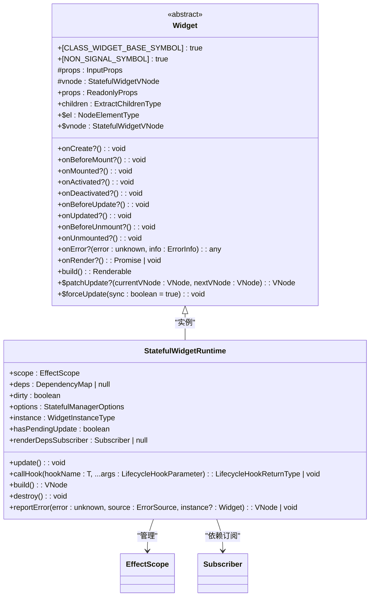
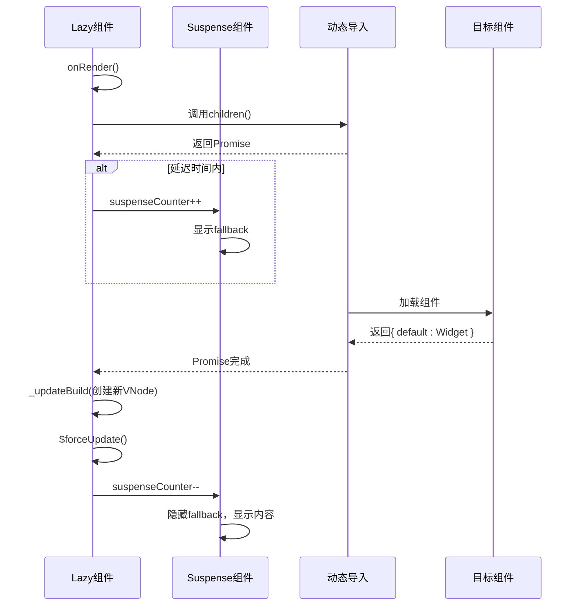

# 组件定义

<cite>
**本文档引用的文件**
- [FnWidget.ts](file://packages/runtime-core/src/widget/base/FnWidget.ts)
- [Widget.ts](file://packages/runtime-core/src/widget/base/Widget.ts)
- [Stateless.ts](file://packages/runtime-core/src/widget/runtime/Stateless.ts)
- [Stateful.ts](file://packages/runtime-core/src/widget/runtime/Stateful.ts)
- [Lazy.ts](file://packages/runtime-core/src/widget/widgets/Lazy.ts)
- [widget.ts](file://packages/runtime-core/src/types/widget.ts)
- [jsx-runtime.ts](file://packages/vitarx/src/jsx-runtime.ts)
- [jsx-dev-runtime.ts](file://packages/vitarx/src/jsx-dev-runtime.ts)
</cite>

## 目录
1. [引言](#引言)
2. [函数式组件](#函数式组件)
3. [类组件（Widget）](#类组件widget)
4. [组件类型定义与TSX支持](#组件类型定义与tsx支持)
5. [组件懒加载（Lazy）](#组件懒加载lazy)
6. [两种组件模式对比](#两种组件模式对比)
7. [总结](#总结)

## 引言

vitarx框架提供了两种主要的UI组件定义方式：函数式组件和类组件（Widget）。这两种模式分别适用于不同的场景，函数式组件作为纯函数接收props并返回JSX，适合构建简单、无状态的UI元素；而类组件通过继承Widget基类实现，能够管理复杂的状态和生命周期，适用于需要维护内部状态和响应用户交互的复杂组件。本文档将详细说明这两种组件的定义方式、核心机制、类型签名、TSX语法支持以及组件懒加载的集成方式。

**Section sources**
- [Widget.ts](file://packages/runtime-core/src/widget/base/Widget.ts#L1-L371)
- [widget.ts](file://packages/runtime-core/src/types/widget.ts#L1-L263)

## 函数式组件

函数式组件在vitarx中被定义为一个接收props并返回可渲染内容的纯函数。其核心特点是无状态和无生命周期管理，每次渲染都是基于输入props的纯计算。在vitarx中，函数式组件通过`FunctionWidget`类型定义，该类型是一个函数，接收一个props对象并返回`FWBuildType`类型的值，可以是`Renderable`（如VNode、字符串、数字）、`VNodeBuilder`（虚拟节点构建器）或`Promise`（用于异步组件）。

函数式组件的运行时由`StatelessWidgetRuntime`管理，该类负责调用组件函数并处理返回值。如果返回值是字符串或数字，则转换为文本节点；如果是VNode，则直接使用；如果返回函数类型，则会抛出错误，因为无状态组件不允许返回函数。这种设计确保了组件的纯函数性质，避免了副作用。

```mermaid
classDiagram
class FunctionWidget {
<<type>>
(props : P) : R
defaultProps? : Record<string, any>
validateProps? : (props : AnyProps) => string | false | unknown
displayName? : string
loading? : VNode
}
class StatelessWidgetRuntime {
+name : string
+props : Readonly<Record<string, any>>
+cachedChildVNode : VNode | null
+vnode : WidgetVNode<T>
+build() : VNode
+update() : void
+runInContext<R>(fn : () => R) : R
}
FunctionWidget --> StatelessWidgetRuntime : "由...管理"
```

**Diagram sources**
- [widget.ts](file://packages/runtime-core/src/types/widget.ts#L124-L134)
- [Stateless.ts](file://packages/runtime-core/src/widget/runtime/Stateless.ts#L24-L66)

**Section sources**
- [FnWidget.ts](file://packages/runtime-core/src/widget/base/FnWidget.ts#L44-L281)
- [Stateless.ts](file://packages/runtime-core/src/widget/runtime/Stateless.ts#L24-L66)
- [widget.ts](file://packages/runtime-core/src/types/widget.ts#L124-L134)

## 类组件（Widget）

类组件是vitarx中用于构建复杂、有状态UI组件的核心机制。所有类组件都必须继承自`Widget`基类。`Widget`类提供了完整的生命周期管理、状态管理和属性访问机制。组件通过重写`build`方法来定义其UI结构，该方法会被多次调用，因此不应包含任何副作用。

`Widget`基类定义了多个生命周期钩子，如`onCreate`、`onBeforeMount`、`onMounted`、`onBeforeUpdate`、`onUpdated`、`onBeforeUnmount`和`onUnmounted`，允许开发者在组件的不同阶段执行自定义逻辑。此外，还提供了`onError`钩子用于错误处理，以及`onRender`钩子用于在渲染前执行异步操作。

有状态组件的运行时由`StatefulWidgetRuntime`管理，该类负责创建组件实例、管理响应式依赖、调度更新和处理错误。`StatefulWidgetRuntime`使用`EffectScope`来管理所有副作用，并通过`depSubscribe`建立依赖追踪，当依赖变化时自动触发更新。



**Diagram sources**
- [Widget.ts](file://packages/runtime-core/src/widget/base/Widget.ts#L45-L371)
- [Stateful.ts](file://packages/runtime-core/src/widget/runtime/Stateful.ts#L61-L361)

**Section sources**
- [Widget.ts](file://packages/runtime-core/src/widget/base/Widget.ts#L45-L371)
- [Stateful.ts](file://packages/runtime-core/src/widget/runtime/Stateful.ts#L61-L361)

## 组件类型定义与TSX支持

vitarx框架通过TypeScript类型系统为组件提供了强大的类型支持。核心类型定义位于`widget.ts`文件中。`AnyProps`类型定义了任意组件属性，`VNodeBuilder`类型定义了视图构建器，即`Widget['build']`的类型。`WidgetOptions`接口定义了组件的可选配置项，包括`defaultProps`（默认属性）、`validateProps`（属性验证函数）、`displayName`（组件名称）和`loading`（加载状态节点）。

对于函数式组件，`FunctionWidget`类型是一个函数，接收props并返回`FWBuildType`，该类型联合了`Renderable`、`VNodeBuilder`和`Promise`等类型，支持同步和异步组件。对于类组件，`ClassWidget`类型是一个构造函数，接收props并返回组件实例。

vitarx通过`jsx-runtime.ts`文件提供TSX语法支持。`jsx`函数是JSX编译的目标，它调用`createVNode`创建虚拟节点。在开发模式下，`jsxDEV`函数还支持热模块替换（HMR）和源码位置信息注入，便于调试。

```mermaid
classDiagram
class WidgetOptions {
<<interface>>
defaultProps? : Record<string, any>
validateProps? : (props : AnyProps) => string | false | unknown
displayName? : string
loading? : VNode
}
class FunctionWidget {
<<type>>
(props : P) : R
+defaultProps? : Record<string, any>
+validateProps? : (props : AnyProps) => string | false | unknown
+displayName? : string
+loading? : VNode
}
class ClassWidget {
<<type>>
new (props : P) : I
+defaultProps? : Record<string, any>
+validateProps? : (props : AnyProps) => string | false | unknown
+displayName? : string
+loading? : VNode
}
class jsx {
+jsx<T>(type : T, props : VNodeInputProps<T> | null, key? : UniqueKey) : VNodeInstanceType<T>
+jsxs : jsx
+Fragment : symbol
}
WidgetOptions <|-- FunctionWidget
WidgetOptions <|-- ClassWidget
FunctionWidget --> jsx : "编译为"
ClassWidget --> jsx : "编译为"
```

**Diagram sources**
- [widget.ts](file://packages/runtime-core/src/types/widget.ts#L10-L263)
- [jsx-runtime.ts](file://packages/vitarx/src/jsx-runtime.ts#L1-L31)

**Section sources**
- [widget.ts](file://packages/runtime-core/src/types/widget.ts#L10-L263)
- [jsx-runtime.ts](file://packages/vitarx/src/jsx-runtime.ts#L1-L31)
- [jsx-dev-runtime.ts](file://packages/vitarx/src/jsx-dev-runtime.ts#L1-L45)

## 组件懒加载（Lazy）

vitarx框架通过`Lazy`组件实现了组件的懒加载功能，支持代码分块和异步加载。`Lazy`组件接收一个`LazyLoadWidget`类型的`children`属性，该属性是一个返回`Promise<{ default: WidgetTypes }>`的函数，通常通过`import()`动态导入组件。

`Lazy`组件的配置选项包括`delay`（展示加载组件前的延迟时间，默认200ms）、`timeout`（超时时间，默认不限制）、`loading`（加载成功前显示的元素）和`onError`（异常处理钩子）。当`Lazy`组件被渲染时，它会调用`onRender`生命周期钩子，启动异步加载任务。在延迟时间内，如果未加载完成，则显示`loading`节点或触发`Suspense`的`fallback`。加载成功后，`Lazy`组件会更新其`build`方法以返回加载的组件，并强制更新。

`Lazy`组件与`Suspense`组件紧密集成，通过`useSuspense`获取`suspenseCounter`，在加载开始时增加计数，在加载完成或失败时减少计数，从而控制`Suspense`的显示状态。



**Diagram sources**
- [Lazy.ts](file://packages/runtime-core/src/widget/widgets/Lazy.ts#L88-L186)
- [Stateful.ts](file://packages/runtime-core/src/widget/runtime/Stateful.ts#L334-L358)

**Section sources**
- [Lazy.ts](file://packages/runtime-core/src/widget/widgets/Lazy.ts#L88-L186)

## 两种组件模式对比

| 特性 | 函数式组件 | 类组件（Widget） |
| :--- | :--- | :--- |
| **定义方式** | 纯函数 | 继承`Widget`基类 |
| **状态管理** | 无内部状态，依赖外部传入 | 可以定义和管理内部状态（如`ref`） |
| **生命周期** | 无生命周期钩子 | 支持完整的生命周期钩子（`onMounted`、`onUpdated`等） |
| **性能** | 轻量，渲染开销小 | 相对较重，但通过依赖追踪优化更新 |
| **适用场景** | 简单UI、展示性组件、高阶组件 | 复杂交互、需要维护状态、需要生命周期管理的组件 |
| **可复用性** | 高，易于组合 | 高，支持继承和多态 |
| **学习曲线** | 简单，符合函数式编程思想 | 相对复杂，需要理解类和生命周期 |

在性能方面，函数式组件由于其无状态特性，每次更新都需要重新执行整个函数，但vitarx通过`StatelessWidgetRuntime`的`patchUpdate`机制，可以高效地比较和更新DOM。类组件通过`StatefulWidgetRuntime`的依赖追踪机制，只有当依赖的响应式数据发生变化时才会触发更新，避免了不必要的渲染，对于复杂组件具有更好的性能表现。

## 总结

vitarx框架通过函数式组件和类组件（Widget）两种模式，为开发者提供了灵活的UI构建方式。函数式组件以其简洁和无状态的特性，非常适合构建可复用的展示性组件。类组件则通过继承`Widget`基类，提供了强大的状态管理和生命周期控制能力，适用于构建复杂的交互式UI。通过`Lazy`组件，框架还支持了组件的懒加载，有助于优化应用的初始加载性能。开发者可以根据具体需求选择合适的组件模式，结合TSX语法和类型系统，构建高效、可维护的前端应用。