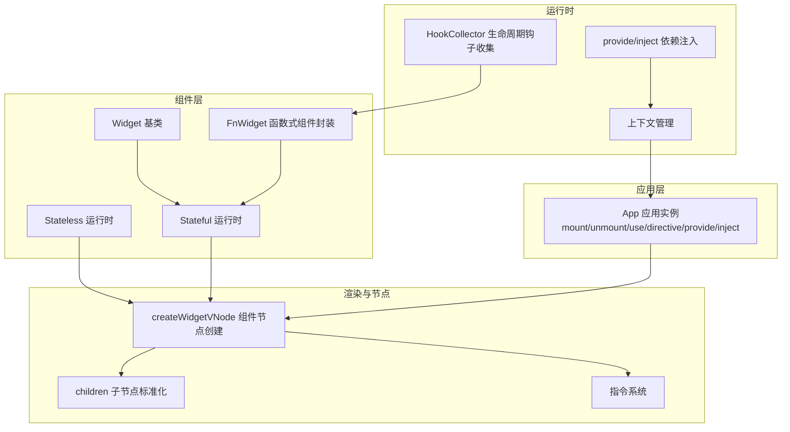
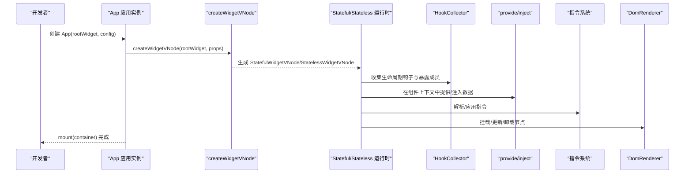
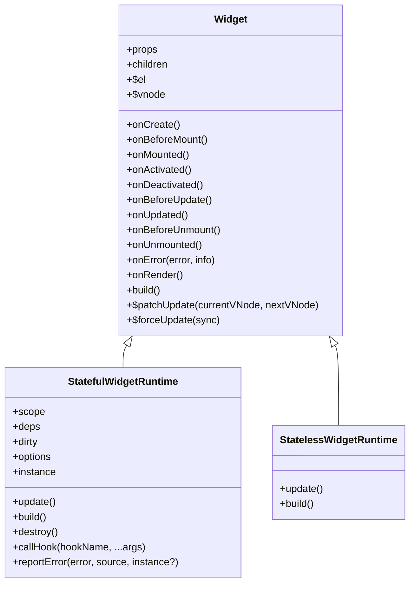
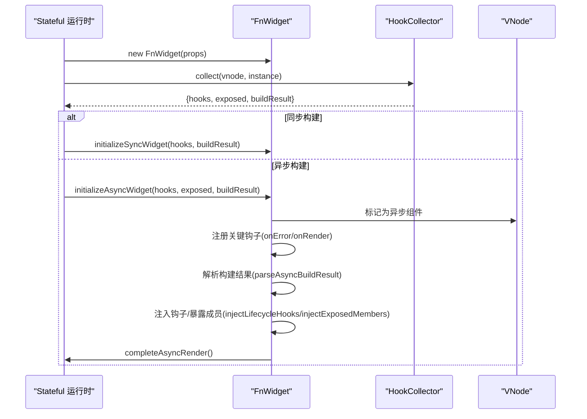
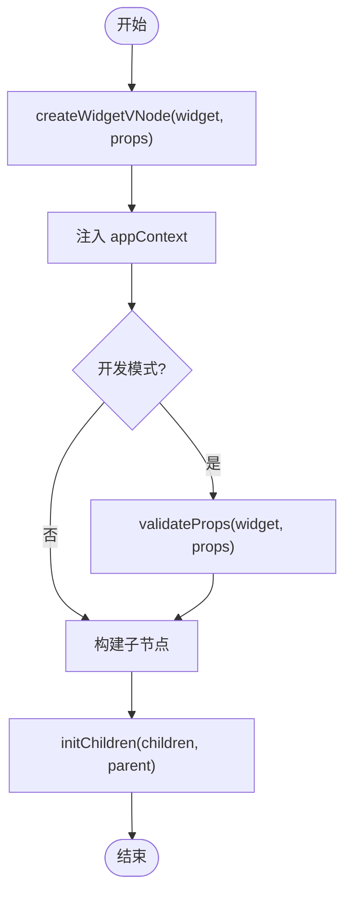
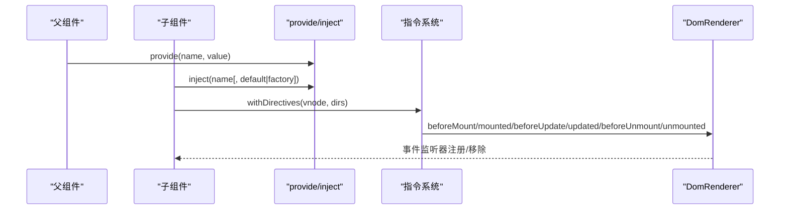
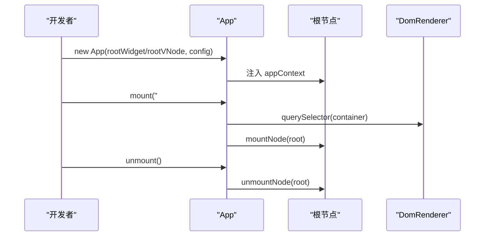
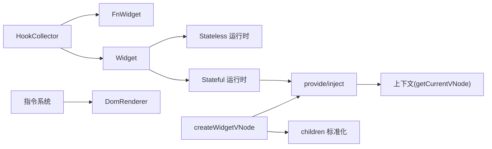

# 组件系统

<cite>
**本文引用的文件**
- [packages/runtime-core/src/widget/base/Widget.ts](file://packages/runtime-core/src/widget/base/Widget.ts)
- [packages/runtime-core/src/widget/base/FnWidget.ts](file://packages/runtime-core/src/widget/base/FnWidget.ts)
- [packages/runtime-core/src/widget/runtime/Stateful.ts](file://packages/runtime-core/src/widget/runtime/Stateful.ts)
- [packages/runtime-core/src/widget/runtime/Stateless.ts](file://packages/runtime-core/src/widget/runtime/Stateless.ts)
- [packages/runtime-core/src/constants/hook.ts](file://packages/runtime-core/src/constants/hook.ts)
- [packages/runtime-core/src/runtime/hook.ts](file://packages/runtime-core/src/runtime/hook.ts)
- [packages/runtime-core/src/runtime/provide.ts](file://packages/runtime-core/src/runtime/provide.ts)
- [packages/runtime-core/src/app/App.ts](file://packages/runtime-core/src/app/App.ts)
- [packages/runtime-core/src/vnode/creator/widget.ts](file://packages/runtime-core/src/vnode/creator/widget.ts)
- [packages/runtime-core/src/vnode/normalizer/children.ts](file://packages/runtime-core/src/vnode/normalizer/children.ts)
- [packages/runtime-core/src/utils/widget.ts](file://packages/runtime-core/src/utils/widget.ts)
- [packages/runtime-core/src/types/lifecycle.ts](file://packages/runtime-core/src/types/lifecycle.ts)
- [packages/runtime-core/src/types/props.ts](file://packages/runtime-core/src/types/props.ts)
- [packages/runtime-core/src/runtime/context.ts](file://packages/runtime-core/src/runtime/context.ts)
- [packages/runtime-core/src/directive/core.ts](file://packages/runtime-core/src/directive/core.ts)
- [packages/runtime-dom/src/client/DomRenderer.ts](file://packages/runtime-dom/src/client/DomRenderer.ts)
- [packages/runtime-dom/src/types/event.ts](file://packages/runtime-dom/src/types/event.ts)
</cite>

## 目录
1. [引言](#引言)
2. [项目结构](#项目结构)
3. [核心组件](#核心组件)
4. [架构总览](#架构总览)
5. [详细组件分析](#详细组件分析)
6. [依赖分析](#依赖分析)
7. [性能考虑](#性能考虑)
8. [故障排查指南](#故障排查指南)
9. [结论](#结论)
10. [附录](#附录)

## 引言
本文件系统性阐述 vitarx 的组件化开发模型，覆盖函数式组件与类组件（Widget）两种定义方式，详解生命周期钩子的触发时机与使用场景，props 的传递与类型定义、组件间通信机制（依赖注入 provide/inject、指令 directive、事件绑定）、插槽（children）的实现原理，以及 App 应用实例的创建、挂载（mount）、卸载（unmount）与依赖注入（provide/inject）等核心能力。通过类组件与函数式组件的对比示例路径，帮助开发者快速理解不同模式的适用场景与最佳实践。

## 项目结构
vitarx 的组件系统位于 runtime-core 包中，围绕“组件定义—运行时—渲染—上下文/指令/依赖注入—App 应用实例”的主线组织。核心目录与职责概览：
- widget/base：类组件基类与函数式组件封装
- widget/runtime：有状态/无状态组件运行时管理器
- runtime：生命周期钩子收集、依赖注入、上下文、错误传播
- vnode/creator：组件虚拟节点创建与属性规范化
- app：应用实例 App 的创建、挂载、卸载、插件与指令注册
- directive：指令定义、解析、差异更新
- types：生命周期钩子类型、props 类型、事件类型等
- utils：组件类型判定、构建器包装等工具

**图表来源**
- [packages/runtime-core/src/widget/base/Widget.ts](file://packages/runtime-core/src/widget/base/Widget.ts#L1-L371)
- [packages/runtime-core/src/widget/base/FnWidget.ts](file://packages/runtime-core/src/widget/base/FnWidget.ts#L1-L281)
- [packages/runtime-core/src/widget/runtime/Stateful.ts](file://packages/runtime-core/src/widget/runtime/Stateful.ts#L1-L361)
- [packages/runtime-core/src/widget/runtime/Stateless.ts](file://packages/runtime-core/src/widget/runtime/Stateless.ts#L1-L66)
- [packages/runtime-core/src/runtime/hook.ts](file://packages/runtime-core/src/runtime/hook.ts#L1-L266)
- [packages/runtime-core/src/runtime/provide.ts](file://packages/runtime-core/src/runtime/provide.ts#L1-L131)
- [packages/runtime-core/src/runtime/context.ts](file://packages/runtime-core/src/runtime/context.ts#L1-L52)
- [packages/runtime-core/src/vnode/creator/widget.ts](file://packages/runtime-core/src/vnode/creator/widget.ts#L1-L174)
- [packages/runtime-core/src/vnode/normalizer/children.ts](file://packages/runtime-core/src/vnode/normalizer/children.ts#L1-L149)
- [packages/runtime-core/src/directive/core.ts](file://packages/runtime-core/src/directive/core.ts#L1-L329)
- [packages/runtime-core/src/app/App.ts](file://packages/runtime-core/src/app/App.ts#L1-L394)

**章节来源**
- [packages/runtime-core/src/widget/base/Widget.ts](file://packages/runtime-core/src/widget/base/Widget.ts#L1-L371)
- [packages/runtime-core/src/widget/base/FnWidget.ts](file://packages/runtime-core/src/widget/base/FnWidget.ts#L1-L281)
- [packages/runtime-core/src/widget/runtime/Stateful.ts](file://packages/runtime-core/src/widget/runtime/Stateful.ts#L1-L361)
- [packages/runtime-core/src/widget/runtime/Stateless.ts](file://packages/runtime-core/src/widget/runtime/Stateless.ts#L1-L66)
- [packages/runtime-core/src/app/App.ts](file://packages/runtime-core/src/app/App.ts#L1-L394)

## 核心组件
- 类组件（Widget）：通过继承基类定义 build 与生命周期钩子，支持响应式依赖追踪、自动更新、错误处理与自定义 patch 更新。
- 函数式组件（FnWidget）：通过 HookCollector 收集生命周期钩子与暴露成员，支持同步/异步构建、错误回退、激活/停用替换等。
- 运行时（Stateful/Stateless）：分别管理有状态/无状态组件的构建、更新、依赖订阅、错误上报与销毁。
- App 应用实例：提供 mount/unmount、插件 use、指令 directive、应用级 provide/inject 等能力。
- 依赖注入（provide/inject）：在组件上下文中提供/注入数据，支持默认值与工厂函数。
- 指令系统（directive）：组件/应用/全局三级指令注册与差异更新。
- 虚拟节点与 props：createWidgetVNode 创建组件节点，children 标准化，props 类型推导与 v-model 绑定。

**章节来源**
- [packages/runtime-core/src/widget/base/Widget.ts](file://packages/runtime-core/src/widget/base/Widget.ts#L1-L371)
- [packages/runtime-core/src/widget/base/FnWidget.ts](file://packages/runtime-core/src/widget/base/FnWidget.ts#L1-L281)
- [packages/runtime-core/src/widget/runtime/Stateful.ts](file://packages/runtime-core/src/widget/runtime/Stateful.ts#L1-L361)
- [packages/runtime-core/src/widget/runtime/Stateless.ts](file://packages/runtime-core/src/widget/runtime/Stateless.ts#L1-L66)
- [packages/runtime-core/src/runtime/provide.ts](file://packages/runtime-core/src/runtime/provide.ts#L1-L131)
- [packages/runtime-core/src/directive/core.ts](file://packages/runtime-core/src/directive/core.ts#L1-L329)
- [packages/runtime-core/src/vnode/creator/widget.ts](file://packages/runtime-core/src/vnode/creator/widget.ts#L1-L174)
- [packages/runtime-core/src/vnode/normalizer/children.ts](file://packages/runtime-core/src/vnode/normalizer/children.ts#L1-L149)
- [packages/runtime-core/src/types/props.ts](file://packages/runtime-core/src/types/props.ts#L1-L386)

## 架构总览
组件系统围绕“组件定义—运行时—渲染—上下文/指令/依赖注入—应用实例”形成闭环。类组件与函数式组件共享同一套生命周期钩子与错误处理机制，运行时负责构建与更新，App 负责应用级配置与挂载。

**图表来源**
- [packages/runtime-core/src/app/App.ts](file://packages/runtime-core/src/app/App.ts#L1-L394)
- [packages/runtime-core/src/vnode/creator/widget.ts](file://packages/runtime-core/src/vnode/creator/widget.ts#L1-L174)
- [packages/runtime-core/src/widget/runtime/Stateful.ts](file://packages/runtime-core/src/widget/runtime/Stateful.ts#L1-L361)
- [packages/runtime-core/src/widget/runtime/Stateless.ts](file://packages/runtime-core/src/widget/runtime/Stateless.ts#L1-L66)
- [packages/runtime-core/src/runtime/hook.ts](file://packages/runtime-core/src/runtime/hook.ts#L1-L266)
- [packages/runtime-core/src/runtime/provide.ts](file://packages/runtime-core/src/runtime/provide.ts#L1-L131)
- [packages/runtime-core/src/directive/core.ts](file://packages/runtime-core/src/directive/core.ts#L1-L329)
- [packages/runtime-dom/src/client/DomRenderer.ts](file://packages/runtime-dom/src/client/DomRenderer.ts#L415-L488)

## 详细组件分析

### 类组件（Widget）生命周期与运行时
- 生命周期钩子：onCreate、onBeforeMount、onMounted、onActivated、onDeactivated、onBeforeUpdate、onUpdated、onBeforeUnmount、onUnmounted、onError、onRender。钩子枚举与类型定义见常量与类型文件。
- 运行时（Stateful）：负责实例创建、依赖订阅、自动更新、错误上报、patch 更新与销毁；支持 enableAutoUpdate/enableScheduler 选项；在构建子节点时进行类型校验与注释节点兜底。
- 运行时（Stateless）：无状态组件运行时，按 props 变化进行重建与 patch 更新，构建结果类型严格校验。

**图表来源**
- [packages/runtime-core/src/widget/base/Widget.ts](file://packages/runtime-core/src/widget/base/Widget.ts#L1-L371)
- [packages/runtime-core/src/widget/runtime/Stateful.ts](file://packages/runtime-core/src/widget/runtime/Stateful.ts#L1-L361)
- [packages/runtime-core/src/widget/runtime/Stateless.ts](file://packages/runtime-core/src/widget/runtime/Stateless.ts#L1-L66)

**章节来源**
- [packages/runtime-core/src/constants/hook.ts](file://packages/runtime-core/src/constants/hook.ts#L1-L15)
- [packages/runtime-core/src/types/lifecycle.ts](file://packages/runtime-core/src/types/lifecycle.ts#L1-L139)
- [packages/runtime-core/src/widget/runtime/Stateful.ts](file://packages/runtime-core/src/widget/runtime/Stateful.ts#L1-L361)
- [packages/runtime-core/src/widget/runtime/Stateless.ts](file://packages/runtime-core/src/widget/runtime/Stateless.ts#L1-L66)

### 函数式组件（FnWidget）与生命周期钩子收集
- HookCollector：在组件渲染上下文中收集生命周期钩子与暴露成员，支持同步/异步构建、错误回退、激活/停用替换。
- defineExpose：暴露函数式组件内部成员到实例，保留关键字过滤。
- initializeFnWidget：初始化函数组件，处理同步/异步构建、注入钩子与暴露成员、完成异步渲染。

**图表来源**
- [packages/runtime-core/src/widget/base/FnWidget.ts](file://packages/runtime-core/src/widget/base/FnWidget.ts#L1-L281)
- [packages/runtime-core/src/runtime/hook.ts](file://packages/runtime-core/src/runtime/hook.ts#L1-L266)

**章节来源**
- [packages/runtime-core/src/widget/base/FnWidget.ts](file://packages/runtime-core/src/widget/base/FnWidget.ts#L1-L281)
- [packages/runtime-core/src/runtime/hook.ts](file://packages/runtime-core/src/runtime/hook.ts#L1-L266)
- [packages/runtime-core/src/runtime/provide.ts](file://packages/runtime-core/src/runtime/provide.ts#L1-L131)

### props 传递与类型定义
- createWidgetVNode：根据组件类型创建有状态/无状态组件节点，注入 appContext，开发模式下执行属性校验。
- WithRefProps/UnwrapRefProps/MergeProps/ReadonlyProps：支持响应式属性、v-model 双向绑定、事件 onUpdate:*、透传属性等类型推导。
- children 标准化：initChildren 将任意子节点扁平化为 VNode 列表，建立父子关系，开发模式下检查重复 key。

**图表来源**
- [packages/runtime-core/src/vnode/creator/widget.ts](file://packages/runtime-core/src/vnode/creator/widget.ts#L1-L174)
- [packages/runtime-core/src/vnode/normalizer/children.ts](file://packages/runtime-core/src/vnode/normalizer/children.ts#L1-L149)
- [packages/runtime-core/src/types/props.ts](file://packages/runtime-core/src/types/props.ts#L1-L386)

**章节来源**
- [packages/runtime-core/src/vnode/creator/widget.ts](file://packages/runtime-core/src/vnode/creator/widget.ts#L1-L174)
- [packages/runtime-core/src/vnode/normalizer/children.ts](file://packages/runtime-core/src/vnode/normalizer/children.ts#L1-L149)
- [packages/runtime-core/src/types/props.ts](file://packages/runtime-core/src/types/props.ts#L1-L386)

### 组件间通信机制
- 依赖注入（provide/inject）：在组件上下文中提供数据，子树向上查找祖先节点或应用上下文获取；支持默认值与工厂函数。
- 指令（directive）：defineDirective/normalizeDirective/withDirectives/resolveDirective/diffDirectives，支持组件局部/应用级/全局三级指令，差异更新时调用 beforeMount/mounted/beforeUpdate/updated/beforeUnmount/unmounted。
- 事件绑定：JSX 属性 onXxx 与事件名映射，DomRenderer 负责事件监听器注册与移除，支持 capture/once/passive 等选项。

**图表来源**
- [packages/runtime-core/src/runtime/provide.ts](file://packages/runtime-core/src/runtime/provide.ts#L1-L131)
- [packages/runtime-core/src/directive/core.ts](file://packages/runtime-core/src/directive/core.ts#L1-L329)
- [packages/runtime-dom/src/client/DomRenderer.ts](file://packages/runtime-dom/src/client/DomRenderer.ts#L415-L488)
- [packages/runtime-dom/src/types/event.ts](file://packages/runtime-dom/src/types/event.ts#L38-L537)

**章节来源**
- [packages/runtime-core/src/runtime/provide.ts](file://packages/runtime-core/src/runtime/provide.ts#L1-L131)
- [packages/runtime-core/src/directive/core.ts](file://packages/runtime-core/src/directive/core.ts#L1-L329)
- [packages/runtime-dom/src/client/DomRenderer.ts](file://packages/runtime-dom/src/client/DomRenderer.ts#L415-L488)
- [packages/runtime-dom/src/types/event.ts](file://packages/runtime-dom/src/types/event.ts#L38-L537)

### 插槽（Slot）实现原理
- children 作为 props 的一部分，通过 initChildren 标准化为 VNode 列表，支持多层嵌套扁平化与 key 去重检查。
- 组件可通过 this.props.children 获取子节点，也可在 JSX 中直接透传 children 或使用具名插槽（通过命名 props 传递）。

**章节来源**
- [packages/runtime-core/src/vnode/normalizer/children.ts](file://packages/runtime-core/src/vnode/normalizer/children.ts#L1-L149)
- [packages/runtime-core/src/widget/base/Widget.ts](file://packages/runtime-core/src/widget/base/Widget.ts#L86-L114)

### App 应用实例：创建、挂载、卸载与依赖注入
- 创建：App(root, config)，支持根组件或根节点；注入 appContext 到整棵节点树。
- 挂载：mount(container) 支持选择器或 DOM 容器；内部调用 mountNode 完成挂载。
- 卸载：unmount() 调用 unmountNode 完成卸载。
- 插件：use 支持无配置/可选配置/必填配置三种插件安装形式。
- 指令：directive(name[, options]) 支持注册与获取；支持链式调用。
- 依赖注入：provide/inject 支持应用级提供与注入，hasProvide 检查存在性。

**图表来源**
- [packages/runtime-core/src/app/App.ts](file://packages/runtime-core/src/app/App.ts#L1-L394)
- [packages/runtime-dom/src/client/DomRenderer.ts](file://packages/runtime-dom/src/client/DomRenderer.ts#L415-L488)

**章节来源**
- [packages/runtime-core/src/app/App.ts](file://packages/runtime-core/src/app/App.ts#L1-L394)
- [packages/runtime-core/src/runtime/context.ts](file://packages/runtime-core/src/runtime/context.ts#L1-L52)

## 依赖分析
- 组件与运行时：类组件与函数式组件均通过运行时管理生命周期与更新；Stateful 运行时负责依赖订阅与自动更新，Stateless 运行时负责按需重建。
- 生命周期钩子：HookCollector 在渲染上下文中收集钩子，FnWidget 初始化时注入到实例；Stateful 运行时统一调用 callHook 并在错误时调用 reportError。
- 上下文与依赖注入：getCurrentVNode/getAppContext 提供上下文访问；provide/inject 在组件上下文中工作，支持应用级兜底。
- 指令：withDirectives/diffDirectives 在节点差异更新时调用指令生命周期钩子。
- 节点与 props：createWidgetVNode 负责节点创建与 appContext 注入；children 标准化确保子节点一致性；props 类型推导支持 v-model 与 onUpdate:* 事件。

**图表来源**
- [packages/runtime-core/src/runtime/hook.ts](file://packages/runtime-core/src/runtime/hook.ts#L1-L266)
- [packages/runtime-core/src/widget/base/FnWidget.ts](file://packages/runtime-core/src/widget/base/FnWidget.ts#L1-L281)
- [packages/runtime-core/src/widget/base/Widget.ts](file://packages/runtime-core/src/widget/base/Widget.ts#L1-L371)
- [packages/runtime-core/src/widget/runtime/Stateless.ts](file://packages/runtime-core/src/widget/runtime/Stateless.ts#L1-L66)
- [packages/runtime-core/src/widget/runtime/Stateful.ts](file://packages/runtime-core/src/widget/runtime/Stateful.ts#L1-L361)
- [packages/runtime-core/src/runtime/provide.ts](file://packages/runtime-core/src/runtime/provide.ts#L1-L131)
- [packages/runtime-core/src/runtime/context.ts](file://packages/runtime-core/src/runtime/context.ts#L1-L52)
- [packages/runtime-core/src/directive/core.ts](file://packages/runtime-core/src/directive/core.ts#L1-L329)
- [packages/runtime-core/src/vnode/creator/widget.ts](file://packages/runtime-core/src/vnode/creator/widget.ts#L1-L174)
- [packages/runtime-core/src/vnode/normalizer/children.ts](file://packages/runtime-core/src/vnode/normalizer/children.ts#L1-L149)

**章节来源**
- [packages/runtime-core/src/runtime/hook.ts](file://packages/runtime-core/src/runtime/hook.ts#L1-L266)
- [packages/runtime-core/src/runtime/provide.ts](file://packages/runtime-core/src/runtime/provide.ts#L1-L131)
- [packages/runtime-core/src/directive/core.ts](file://packages/runtime-core/src/directive/core.ts#L1-L329)
- [packages/runtime-core/src/vnode/creator/widget.ts](file://packages/runtime-core/src/vnode/creator/widget.ts#L1-L174)

## 性能考虑
- 自动更新与调度：Stateful 运行时默认启用自动更新与调度队列，避免重复渲染；可通过 options.disableAutoUpdate/disableScheduler 控制。
- 依赖订阅：depSubscribe 订阅渲染依赖，flush/scope 选项影响更新时机与作用域隔离。
- 子节点标准化：initChildren 使用栈迭代扁平化，避免深递归导致的栈溢出风险。
- 指令差异更新：diffDirectives 支持 only/skip 选项，减少不必要的指令更新。
- 异步组件：FnWidget 初始化异步构建时，使用 Suspense 计数器与占位节点，避免阻塞渲染。

[本节为通用指导，无需具体文件分析]

## 故障排查指南
- 错误处理：Stateful 运行时的 reportError 按“组件 onError → 父组件 onError → 应用 errorHandler → 控制台”顺序处理；onError 钩子可返回 VNode 或 false 以终止向上冒泡。
- 未处理异常：若 onError 未捕获，最终输出到控制台；无限循环检测会记录错误。
- 指令未找到：resolveDirective 未找到时发出警告；withDirectives 对无效指令进行告警。
- 子节点类型：Stateless 运行时禁止返回函数类型；非法类型将被转换为注释节点并在开发模式警告。
- props 校验：开发模式下 validateProps 失败会输出错误/警告日志。

**章节来源**
- [packages/runtime-core/src/widget/runtime/Stateful.ts](file://packages/runtime-core/src/widget/runtime/Stateful.ts#L95-L153)
- [packages/runtime-core/src/widget/runtime/Stateful.ts](file://packages/runtime-core/src/widget/runtime/Stateful.ts#L155-L204)
- [packages/runtime-core/src/directive/core.ts](file://packages/runtime-core/src/directive/core.ts#L174-L191)
- [packages/runtime-core/src/widget/runtime/Stateless.ts](file://packages/runtime-core/src/widget/runtime/Stateless.ts#L40-L66)
- [packages/runtime-core/src/vnode/creator/widget.ts](file://packages/runtime-core/src/vnode/creator/widget.ts#L45-L69)

## 结论
vitarx 的组件系统以 Widget 为核心，统一了类组件与函数式组件的生命周期与错误处理机制；通过运行时管理响应式依赖与更新，结合 App 应用实例的挂载/卸载与插件体系，实现了灵活而高性能的组件化开发模型。props 类型推导、children 标准化、provide/inject 与指令系统共同构成了组件间通信与扩展能力。开发者可根据场景选择类组件（强生命周期与响应式）或函数式组件（简洁与异步构建），并利用运行时选项与工具函数实现最佳实践。

[本节为总结，无需具体文件分析]

## 附录
- 类组件与函数式组件对比要点
  - 类组件：生命周期钩子丰富，支持响应式依赖与自动更新，适合复杂交互与状态管理。
  - 函数式组件：轻量、易测试，支持异步构建与错误回退，适合纯展示与动态加载。
- 常用 API 路径参考
  - 生命周期钩子定义与收集：[packages/runtime-core/src/constants/hook.ts](file://packages/runtime-core/src/constants/hook.ts#L1-L15)、[packages/runtime-core/src/runtime/hook.ts](file://packages/runtime-core/src/runtime/hook.ts#L1-L266)
  - 类组件基类与运行时：[packages/runtime-core/src/widget/base/Widget.ts](file://packages/runtime-core/src/widget/base/Widget.ts#L1-L371)、[packages/runtime-core/src/widget/runtime/Stateful.ts](file://packages/runtime-core/src/widget/runtime/Stateful.ts#L1-L361)、[packages/runtime-core/src/widget/runtime/Stateless.ts](file://packages/runtime-core/src/widget/runtime/Stateless.ts#L1-L66)
  - 函数式组件封装与初始化：[packages/runtime-core/src/widget/base/FnWidget.ts](file://packages/runtime-core/src/widget/base/FnWidget.ts#L1-L281)
  - 依赖注入：[packages/runtime-core/src/runtime/provide.ts](file://packages/runtime-core/src/runtime/provide.ts#L1-L131)
  - 指令系统：[packages/runtime-core/src/directive/core.ts](file://packages/runtime-core/src/directive/core.ts#L1-L329)
  - 节点与 props：[packages/runtime-core/src/vnode/creator/widget.ts](file://packages/runtime-core/src/vnode/creator/widget.ts#L1-L174)、[packages/runtime-core/src/vnode/normalizer/children.ts](file://packages/runtime-core/src/vnode/normalizer/children.ts#L1-L149)、[packages/runtime-core/src/types/props.ts](file://packages/runtime-core/src/types/props.ts#L1-L386)
  - App 应用实例：[packages/runtime-core/src/app/App.ts](file://packages/runtime-core/src/app/App.ts#L1-L394)

[本节为索引，无需具体文件分析]