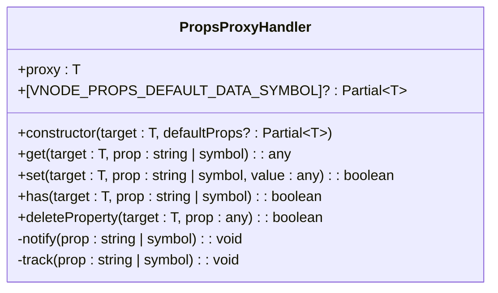
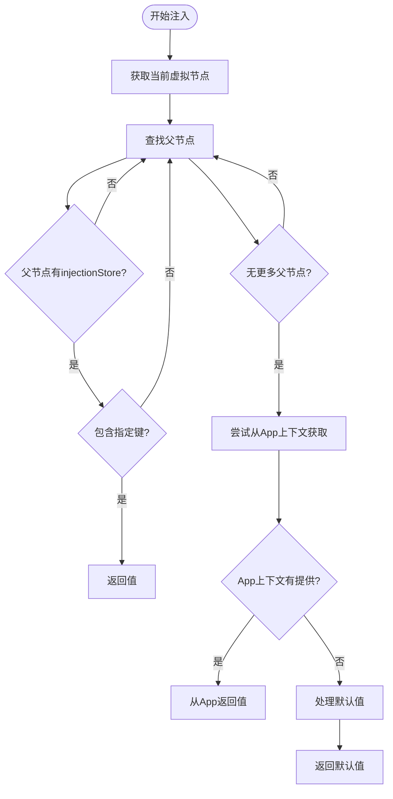
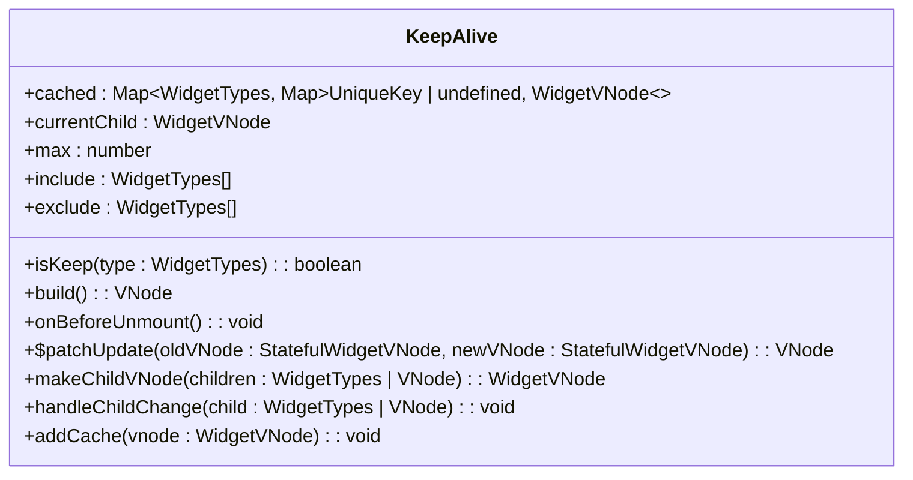

# 组件通信

<cite>
**本文档引用的文件**   
- [App.ts](file://packages/runtime-core/src/app/App.ts)
- [provide.ts](file://packages/runtime-core/src/runtime/provide.ts)
- [context.ts](file://packages/runtime-core/src/runtime/context.ts)
- [props.ts](file://packages/runtime-core/src/runtime/props.ts)
- [KeepAlive.ts](file://packages/runtime-core/src/widget/widgets/KeepAlive.ts)
- [Widget.ts](file://packages/runtime-core/src/widget/base/Widget.ts)
- [WidgetRuntime.ts](file://packages/runtime-core/src/widget/runtime/WidgetRuntime.ts)
- [props.ts](file://packages/runtime-core/src/types/props.ts)
- [symbol.ts](file://packages/runtime-core/src/constants/symbol.ts)
- [event.ts](file://packages/runtime-dom/src/types/event.ts)
</cite>

## 目录
1. [引言](#引言)
2. [Props传递机制](#props传递机制)
3. [事件发射与监听](#事件发射与监听)
4. [依赖注入（provide/inject）](#依赖注入provideinject)
5. [高级通信模式](#高级通信模式)
6. [性能影响与使用约束](#性能影响与使用约束)
7. [总结](#总结)

## 引言
vitarx框架提供了一套完整的组件通信解决方案，支持从简单到复杂的各种通信场景。本文档将详细介绍vitarx中组件间通信的多种机制，包括props传递、事件发射与监听、依赖注入（provide/inject）等模式。通过分析框架源码，我们将深入理解这些通信机制的实现原理和最佳实践。

**Section sources**
- [App.ts](file://packages/runtime-core/src/app/App.ts#L1-L394)
- [Widget.ts](file://packages/runtime-core/src/widget/base/Widget.ts#L1-L371)

## Props传递机制

### 类型安全定义
vitarx框架通过TypeScript的泛型系统实现了严格的类型安全。在`Widget`基类中，通过泛型参数`InputProps`和`DefaultProps`来定义组件的属性类型：

```typescript
export abstract class Widget<
  InputProps extends AnyProps = {},
  DefaultProps extends AnyProps | Partial<InputProps> = InputProps
>
```

这种设计允许开发者在定义组件时明确指定输入属性类型和默认属性类型，确保类型推导的准确性。

### 默认值设置
框架提供了`defineProps`函数来设置属性的默认值。该函数支持两种调用方式：仅传入默认值对象，或同时传入默认值对象和输入属性对象以优化类型推导：

```typescript
export function defineProps<D extends AnyProps>(defaultProps: D): ReadonlyProps<D>
export function defineProps<D extends AnyProps, I extends AnyProps>(
  defaultProps: D,
  inputProps: I
): ReadonlyProps<I, D>
```

当在函数式组件中使用时，建议传入第二个参数以获得更精确的类型推导。

### 验证机制
vitarx通过`ReadonlyProps`类型确保props的只读性，防止组件内部直接修改props。同时，框架使用`PropsProxyHandler`类来代理props对象，实现了属性访问的追踪和修改警告：



**Diagram sources**
- [props.ts](file://packages/runtime-core/src/runtime/props.ts#L39-L109)

**Section sources**
- [props.ts](file://packages/runtime-core/src/runtime/props.ts#L1-L274)
- [props.ts](file://packages/runtime-core/src/types/props.ts#L1-L386)

## 事件发射与监听

### 事件系统架构
vitarx的事件系统基于DOM原生事件机制构建，通过`event.ts`文件定义了完整的事件类型体系。框架支持标准的DOM事件处理，包括事件绑定、事件冒泡和事件捕获等特性。

### 事件处理实现
在vitarx中，事件处理主要通过属性绑定的方式实现。框架支持直接在JSX中绑定事件处理器，如`onClick`、`onChange`等。这些事件处理器会被正确地附加到对应的DOM元素上，并在事件触发时执行。

### 自定义事件
虽然vitarx主要依赖原生DOM事件，但开发者可以通过props传递回调函数的方式实现自定义事件通信。父组件可以将事件处理函数作为props传递给子组件，子组件在适当的时候调用这些函数来"发射"事件。

**Section sources**
- [event.ts](file://packages/runtime-dom/src/types/event.ts#L1-L100)

## 依赖注入（provide/inject）

### App级依赖注入
vitarx通过`App`类的`provide`和`inject`方法实现跨层级数据传递。`App`类内部使用`Map`数据结构存储提供的数据：

```typescript
readonly #provide: Map<string | symbol, any> = new Map()
```

这种基于Map的存储结构提供了O(1)的查找时间复杂度，确保了高效的运行时查找性能。

### 运行时查找逻辑
`provide`方法将数据存储在App实例的私有Map中，而`inject`方法则首先尝试从App上下文中获取数据：

```typescript
inject<T>(name: string | symbol, defaultValue?: T): T {
  // ...
  // 尝试从 appContext 中获取数据
  if (currentVNode.appContext?.hasProvide(name)) {
    return currentVNode.appContext.inject(name, defaultValue)
  }
  // ...
}
```

### 组件级依赖注入
除了App级的provide/inject，vitarx还支持组件级别的依赖注入。`provide`函数要求在有状态组件的初始化阶段调用，它将数据存储在当前虚拟节点的`injectionStore`中：

```typescript
export function provide(name: string | symbol, value: any): void {
  const currentVNode = getCurrentVNode()
  if (!isStatefulWidgetNode(currentVNode)) {
    throw new Error('provide must be called in stateful widget')
  }
  if (!currentVNode.injectionStore) {
    currentVNode.injectionStore = new Map([[name, value]])
  } else {
    currentVNode.injectionStore.set(name, value)
  }
}
```

`inject`函数则会向上遍历祖先节点，查找具有`injectionStore`的有状态组件节点：



**Diagram sources**
- [provide.ts](file://packages/runtime-core/src/runtime/provide.ts#L102-L130)

**Section sources**
- [App.ts](file://packages/runtime-core/src/app/App.ts#L313-L336)
- [provide.ts](file://packages/runtime-core/src/runtime/provide.ts#L31-L131)
- [context.ts](file://packages/runtime-core/src/runtime/context.ts#L48-L51)

## 高级通信模式

### Suspense组件
`Suspense`组件通过`provide/inject`机制实现异步依赖的协调。它使用`SUSPENSE_COUNTER_SYMBOL`作为注入键，向上级`Suspense`组件请求计数器：

```typescript
export function useSuspense(): Ref<number> | undefined {
  return inject<Ref<number> | undefined>(SUSPENSE_COUNTER_SYMBOL, undefined)
}
```

当子组件需要异步加载时，会增加计数器的值；当异步操作完成时，会减少计数器的值。`Suspense`组件根据计数器的值决定显示fallback内容还是实际内容。

### KeepAlive组件
`KeepAlive`组件实现了组件实例的缓存机制，通过`cached`属性存储已缓存的虚拟节点：

```typescript
public readonly cached: Map<WidgetTypes, Map<UniqueKey | undefined, WidgetVNode>> = new Map()
```

缓存策略基于组件类型和key，支持通过`include`和`exclude`属性配置缓存范围，通过`max`属性限制缓存数量。



**Diagram sources**
- [KeepAlive.ts](file://packages/runtime-core/src/widget/widgets/KeepAlive.ts#L119-L334)

**Section sources**
- [KeepAlive.ts](file://packages/runtime-core/src/widget/widgets/KeepAlive.ts#L1-L334)
- [Suspense.ts](file://packages/runtime-core/src/runtime/suspense.ts#L1-L13)

## 性能影响与使用约束

### 不同通信方式的性能对比
| 通信方式 | 时间复杂度 | 空间复杂度 | 适用场景 |
|---------|----------|----------|---------|
| Props传递 | O(1) | O(n) | 父子组件通信 |
| 事件发射 | O(1) | O(1) | 子父组件通信 |
| provide/inject | O(d) | O(k) | 跨层级通信 |
| 全局状态 | O(1) | O(1) | 全局共享状态 |

其中d为组件树深度，k为注入键的数量。

### 使用约束
1. **Props传递**：应保持单向数据流，避免直接修改props
2. **事件发射**：回调函数应作为props传递，避免创建闭包
3. **provide/inject**：仅在有状态组件中使用，避免在渲染函数中调用
4. **KeepAlive**：注意内存占用，合理设置max值
5. **Suspense**：避免过度嵌套，防止计数器混乱

**Section sources**
- [props.ts](file://packages/runtime-core/src/runtime/props.ts#L16-L17)
- [provide.ts](file://packages/runtime-core/src/runtime/provide.ts#L10-L11)
- [KeepAlive.ts](file://packages/runtime-core/src/widget/widgets/KeepAlive.ts#L72-L73)

## 总结
vitarx框架提供了丰富而灵活的组件通信机制，从基础的props传递到高级的依赖注入，满足了各种复杂场景的需求。通过TypeScript的类型系统，框架确保了通信的安全性和可维护性。开发者应根据具体场景选择合适的通信方式，平衡性能和功能需求。

**Section sources**
- [App.ts](file://packages/runtime-core/src/app/App.ts#L1-L394)
- [Widget.ts](file://packages/runtime-core/src/widget/base/Widget.ts#L1-L371)
- [props.ts](file://packages/runtime-core/src/runtime/props.ts#L1-L274)
- [provide.ts](file://packages/runtime-core/src/runtime/provide.ts#L1-L131)
- [KeepAlive.ts](file://packages/runtime-core/src/widget/widgets/KeepAlive.ts#L1-L334)