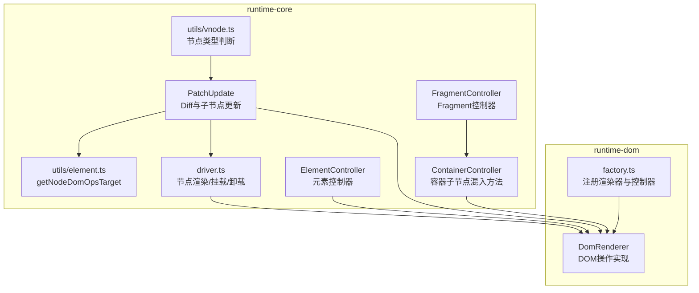
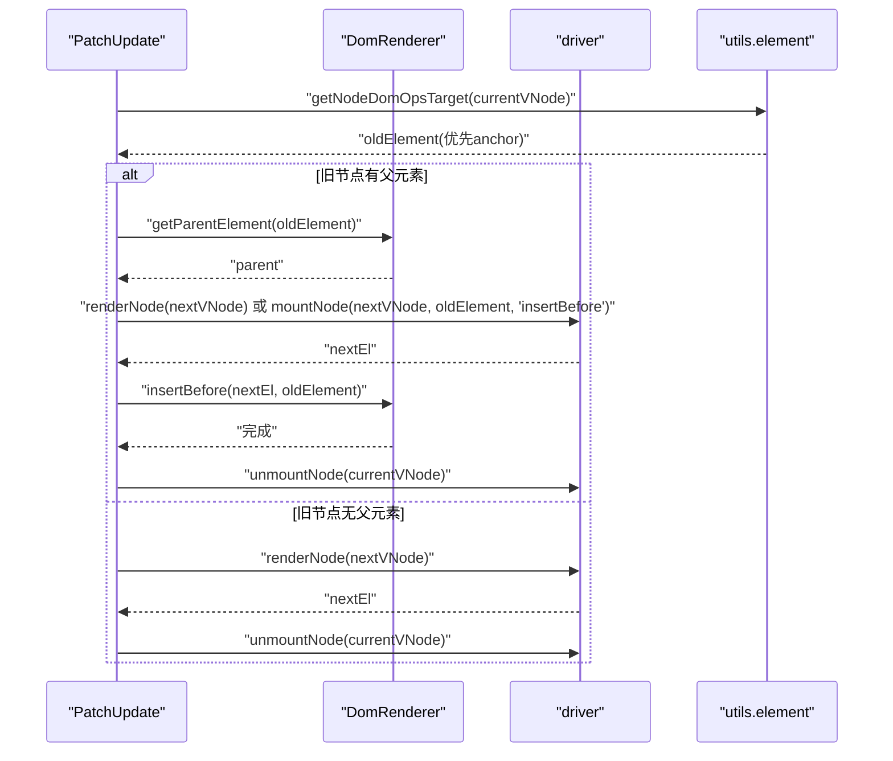
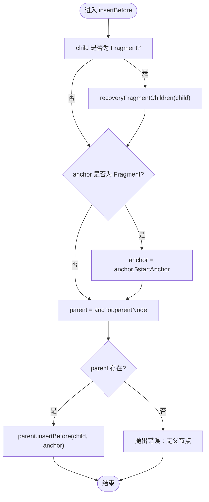
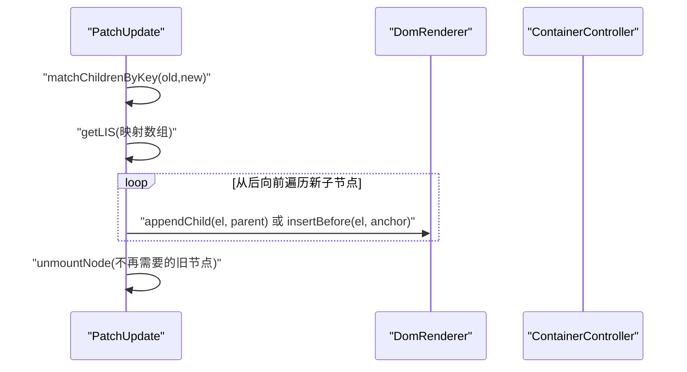
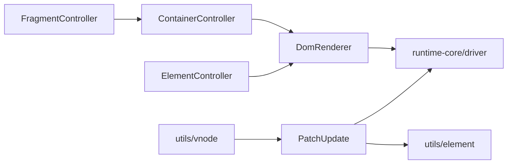

# DOM操作与节点控制

<cite>
**本文引用的文件**
- [DomRenderer.ts](file://packages/runtime-dom/src/client/DomRenderer.ts)
- [factory.ts](file://packages/runtime-dom/src/client/factory.ts)
- [update.ts](file://packages/runtime-core/src/vnode/core/update.ts)
- [driver.ts](file://packages/runtime-core/src/vnode/core/driver.ts)
- [ContainerController.ts](file://packages/runtime-core/src/controllers/ContainerController.ts)
- [FragmentController.ts](file://packages/runtime-core/src/controllers/FragmentController.ts)
- [ElementController.ts](file://packages/runtime-core/src/controllers/ElementController.ts)
- [element.ts](file://packages/runtime-core/src/utils/element.ts)
- [vnode.ts](file://packages/runtime-core/src/utils/vnode.ts)
- [DomRenderer.test.ts](file://packages/runtime-dom/__tests__/client/DomRenderer.test.ts)
</cite>

## 目录
1. [简介](#简介)
2. [项目结构](#项目结构)
3. [核心组件](#核心组件)
4. [架构总览](#架构总览)
5. [详细组件分析](#详细组件分析)
6. [依赖关系分析](#依赖关系分析)
7. [性能考量](#性能考量)
8. [故障排查指南](#故障排查指南)
9. [结论](#结论)
10. [附录](#附录)

## 简介
本文件围绕vitarx框架的DOM渲染器节点操作能力展开，系统阐述insertBefore、appendChild、removeChild、replaceChild等核心DOM操作方法的实现机制；解释这些方法如何与runtime-core中的更新算法协同工作，确保高效的虚拟DOM比对与真实DOM更新；描述节点移动、重排、批量更新等场景的优化策略；结合Diff算法说明节点复用与位置调整的实现逻辑；并提供常见操作的使用路径参考与边界情况处理、错误恢复机制说明。

## 项目结构
vitarx将DOM渲染能力集中在runtime-dom包中，通过工厂函数注册DomRenderer并注册各类节点控制器；runtime-core负责虚拟节点的生命周期、属性更新、子节点Diff与挂载/卸载等核心逻辑。两者通过useRenderer()与getNodeDomOpsTarget()等接口协作，形成“虚拟节点驱动真实DOM”的更新闭环。

图表来源
- [DomRenderer.ts](file://packages/runtime-dom/src/client/DomRenderer.ts#L1-L573)
- [factory.ts](file://packages/runtime-dom/src/client/factory.ts#L1-L39)
- [update.ts](file://packages/runtime-core/src/vnode/core/update.ts#L1-L389)
- [driver.ts](file://packages/runtime-core/src/vnode/core/driver.ts#L1-L124)
- [ContainerController.ts](file://packages/runtime-core/src/controllers/ContainerController.ts#L1-L59)
- [FragmentController.ts](file://packages/runtime-core/src/controllers/FragmentController.ts#L1-L42)
- [ElementController.ts](file://packages/runtime-core/src/controllers/ElementController.ts#L1-L104)
- [element.ts](file://packages/runtime-core/src/utils/element.ts#L1-L32)
- [vnode.ts](file://packages/runtime-core/src/utils/vnode.ts#L1-L142)

章节来源
- [DomRenderer.ts](file://packages/runtime-dom/src/client/DomRenderer.ts#L1-L573)
- [factory.ts](file://packages/runtime-dom/src/client/factory.ts#L1-L39)
- [update.ts](file://packages/runtime-core/src/vnode/core/update.ts#L1-L389)
- [driver.ts](file://packages/runtime-core/src/vnode/core/driver.ts#L1-L124)
- [ContainerController.ts](file://packages/runtime-core/src/controllers/ContainerController.ts#L1-L59)
- [FragmentController.ts](file://packages/runtime-core/src/controllers/FragmentController.ts#L1-L42)
- [ElementController.ts](file://packages/runtime-core/src/controllers/ElementController.ts#L1-L104)
- [element.ts](file://packages/runtime-core/src/utils/element.ts#L1-L32)
- [vnode.ts](file://packages/runtime-core/src/utils/vnode.ts#L1-L142)

## 核心组件
- DomRenderer：浏览器端DOM渲染器，实现createElement、createFragment、createText、createComment、appendChild、insertBefore、remove、replace、getParentElement、querySelector/querySelectorAll、属性/样式/事件等操作。
- PatchUpdate：虚拟DOM更新主流程，负责节点类型判定、属性更新、子节点Diff与替换策略。
- driver：统一的节点渲染、挂载、激活、停用、卸载入口。
- ContainerController：为容器节点混入渲染/挂载/激活/停用/卸载子节点的方法。
- FragmentController/ElementController：分别处理Fragment与Element节点的生命周期与属性更新。
- utils.element：提供getNodeDomOpsTarget，用于获取节点对应的真实DOM操作目标（优先anchor，否则el）。
- utils.vnode：提供isContainerNode/isElementNode等节点类型判断辅助。

章节来源
- [DomRenderer.ts](file://packages/runtime-dom/src/client/DomRenderer.ts#L1-L573)
- [update.ts](file://packages/runtime-core/src/vnode/core/update.ts#L1-L389)
- [driver.ts](file://packages/runtime-core/src/vnode/core/driver.ts#L1-L124)
- [ContainerController.ts](file://packages/runtime-core/src/controllers/ContainerController.ts#L1-L59)
- [FragmentController.ts](file://packages/runtime-core/src/controllers/FragmentController.ts#L1-L42)
- [ElementController.ts](file://packages/runtime-core/src/controllers/ElementController.ts#L1-L104)
- [element.ts](file://packages/runtime-core/src/utils/element.ts#L1-L32)
- [vnode.ts](file://packages/runtime-core/src/utils/vnode.ts#L1-L142)

## 架构总览
下面的序列图展示了“虚拟节点更新”到“真实DOM操作”的关键调用链路，包括节点替换、子节点Diff与DOM操作目标选择。

图表来源
- [update.ts](file://packages/runtime-core/src/vnode/core/update.ts#L122-L151)
- [element.ts](file://packages/runtime-core/src/utils/element.ts#L19-L32)
- [driver.ts](file://packages/runtime-core/src/vnode/core/driver.ts#L41-L65)
- [DomRenderer.ts](file://packages/runtime-dom/src/client/DomRenderer.ts#L367-L372)

章节来源
- [update.ts](file://packages/runtime-core/src/vnode/core/update.ts#L122-L151)
- [element.ts](file://packages/runtime-core/src/utils/element.ts#L19-L32)
- [driver.ts](file://packages/runtime-core/src/vnode/core/driver.ts#L41-L65)
- [DomRenderer.ts](file://packages/runtime-dom/src/client/DomRenderer.ts#L367-L372)

## 详细组件分析

### DomRenderer核心DOM操作方法
- insertBefore(child, anchor)
  - 兼容Fragment：若child为Fragment，先恢复其子节点到Fragment容器中，再进行插入。
  - 若anchor为Fragment，则使用其$endAnchor作为锚点，确保插入到Fragment内部。
  - 获取anchor.parentNode，若不存在则抛错，避免在无父节点情况下插入。
  - 调用parentNode.insertBefore完成插入。
- appendChild(el, parent)
  - 兼容Fragment：若el为Fragment，先恢复其子节点。
  - 若parent为Fragment且已挂载（$endAnchor.parentNode存在），则在$endAnchor前插入，保证Fragment内部顺序。
  - 否则直接调用parent.appendChild。
- remove(el)
  - 若el为Fragment，使用Range选择$endAnchor到$endAnchor之间的内容并删除，确保Fragment锚点范围内的所有子节点被清理。
  - 否则直接调用el.remove。
- replace(newChild, oldChild)
  - 兼容Fragment：newChild若为Fragment，先恢复其子节点。
  - 若oldChild为Fragment，使用oldChild.$startAnchor.parentNode作为父节点，确保替换发生在Fragment锚点范围内。
  - 若oldChild无父节点，抛错。
  - 若oldChild为Fragment，先在$endAnchor前插入newChild，再删除oldChild；否则使用parent.replaceChild。

图表来源
- [DomRenderer.ts](file://packages/runtime-dom/src/client/DomRenderer.ts#L132-L147)

章节来源
- [DomRenderer.ts](file://packages/runtime-dom/src/client/DomRenderer.ts#L132-L199)

### 与runtime-core更新算法的协同
- 节点替换策略
  - PatchUpdate.replace(currentVNode, nextVNode)：
    - 通过getNodeDomOpsTarget(currentVNode)获取真实DOM操作目标（优先anchor，否则el）。
    - 若oldElement存在父节点：先渲染/挂载nextVNode到oldElement位置，再卸载currentVNode。
    - 若oldElement无父节点但currentVNode已渲染：仅渲染nextVNode并卸载currentVNode。
    - 否则抛错，提示无法替换未挂载节点。
- 子节点Diff与移动优化
  - PatchUpdate.patchUpdateChildren(currentNode, nextVNode)：
    - 通过key匹配新旧子节点，建立映射与移除集合。
    - 计算最长递增子序列（LIS），确定无需移动的节点集合，减少DOM重排。
    - 从后向前遍历新子节点，执行复用、移动或创建，最后卸载不再需要的旧节点。
  - ContainerController混入的子节点处理方法在渲染/挂载阶段直接调用DomRenderer.appendChild，确保批量插入时保持顺序与性能。

图表来源
- [update.ts](file://packages/runtime-core/src/vnode/core/update.ts#L170-L249)
- [update.ts](file://packages/runtime-core/src/vnode/core/update.ts#L250-L378)
- [ContainerController.ts](file://packages/runtime-core/src/controllers/ContainerController.ts#L10-L21)

章节来源
- [update.ts](file://packages/runtime-core/src/vnode/core/update.ts#L122-L249)
- [update.ts](file://packages/runtime-core/src/vnode/core/update.ts#L250-L378)
- [ContainerController.ts](file://packages/runtime-core/src/controllers/ContainerController.ts#L10-L21)

### Fragment与容器节点的特殊处理
- FragmentController
  - 通过mixinContainerController混入渲染/挂载/卸载子节点方法，使Fragment具备容器能力。
  - createElement时委托DomRenderer.createFragment，生成带$endAnchor/$startAnchor的文档片段。
- DomRenderer.createFragment
  - 为Fragment设置$endAnchor/$startAnchor与$vnode引用，便于后续插入/删除/恢复。
- DomRenderer.recoveryFragmentChildren
  - 若Fragment为空或缺少锚点，将其$vnode.children恢复到Fragment中，保证Fragment内部子节点的正确性与可插入性。

章节来源
- [FragmentController.ts](file://packages/runtime-core/src/controllers/FragmentController.ts#L1-L42)
- [DomRenderer.ts](file://packages/runtime-dom/src/client/DomRenderer.ts#L88-L121)
- [DomRenderer.ts](file://packages/runtime-dom/src/client/DomRenderer.ts#L392-L416)

### 属性更新与事件绑定
- ElementController.updateProps
  - 遍历新旧属性差异，调用DomRenderer.removeAttribute或DomRenderer.setAttribute。
  - DomRenderer.setAttribute对事件、data-、xlink、style/class/autofocus等做特殊处理，并在异常时降级或回退。
- DomRenderer.removeEventListener/addEventListener
  - 解析事件名与修饰符（capture/once/passive），精确绑定/解绑事件。

章节来源
- [ElementController.ts](file://packages/runtime-core/src/controllers/ElementController.ts#L46-L71)
- [DomRenderer.ts](file://packages/runtime-dom/src/client/DomRenderer.ts#L257-L350)
- [DomRenderer.ts](file://packages/runtime-dom/src/client/DomRenderer.ts#L453-L501)

### 错误处理与边界情况
- insertBefore：当anchor无父节点时抛错，防止无效插入。
- replace：当oldChild无父节点时抛错，防止无效替换。
- setAttribute：对只读属性或不可直接设置的属性进行降级处理，捕获异常并输出错误日志。
- Fragment移除：使用Range删除锚点范围内的所有内容，避免残留节点。

章节来源
- [DomRenderer.test.ts](file://packages/runtime-dom/__tests__/client/DomRenderer.test.ts#L546-L563)
- [DomRenderer.ts](file://packages/runtime-dom/src/client/DomRenderer.ts#L140-L168)
- [DomRenderer.ts](file://packages/runtime-dom/src/client/DomRenderer.ts#L257-L350)

## 依赖关系分析
- DomRenderer依赖runtime-core的渲染器接口与工具函数（如getStyle、querySelector等），并通过useRenderer()在runtime-core中注入。
- PatchUpdate依赖getNodeDomOpsTarget获取真实DOM操作目标，并通过driver统一调度节点渲染/挂载/卸载。
- ContainerController与FragmentController依赖DomRenderer完成批量插入与容器行为。
- utils.vnode提供节点类型判断，辅助PatchUpdate决定更新策略。

图表来源
- [DomRenderer.ts](file://packages/runtime-dom/src/client/DomRenderer.ts#L1-L573)
- [update.ts](file://packages/runtime-core/src/vnode/core/update.ts#L1-L389)
- [driver.ts](file://packages/runtime-core/src/vnode/core/driver.ts#L1-L124)
- [ContainerController.ts](file://packages/runtime-core/src/controllers/ContainerController.ts#L1-L59)
- [FragmentController.ts](file://packages/runtime-core/src/controllers/FragmentController.ts#L1-L42)
- [ElementController.ts](file://packages/runtime-core/src/controllers/ElementController.ts#L1-L104)
- [element.ts](file://packages/runtime-core/src/utils/element.ts#L1-L32)
- [vnode.ts](file://packages/runtime-core/src/utils/vnode.ts#L1-L142)

章节来源
- [DomRenderer.ts](file://packages/runtime-dom/src/client/DomRenderer.ts#L1-L573)
- [update.ts](file://packages/runtime-core/src/vnode/core/update.ts#L1-L389)
- [driver.ts](file://packages/runtime-core/src/vnode/core/driver.ts#L1-L124)
- [ContainerController.ts](file://packages/runtime-core/src/controllers/ContainerController.ts#L1-L59)
- [FragmentController.ts](file://packages/runtime-core/src/controllers/FragmentController.ts#L1-L42)
- [ElementController.ts](file://packages/runtime-core/src/controllers/ElementController.ts#L1-L104)
- [element.ts](file://packages/runtime-core/src/utils/element.ts#L1-L32)
- [vnode.ts](file://packages/runtime-core/src/utils/vnode.ts#L1-L142)

## 性能考量
- 子节点Diff的LIS优化：通过计算最长递增子序列，减少不必要的DOM移动，降低重排成本。
- 批量插入：ContainerController在渲染/挂载阶段逐个appendChild，配合Fragment锚点插入策略，避免频繁重排。
- 事件绑定优化：DomRenderer解析事件修饰符，避免重复绑定与错误解绑，提升交互性能。
- Fragment恢复：recoveryFragmentChildren在插入前恢复Fragment内部子节点，避免多次重建DOM。

章节来源
- [update.ts](file://packages/runtime-core/src/vnode/core/update.ts#L316-L378)
- [ContainerController.ts](file://packages/runtime-core/src/controllers/ContainerController.ts#L10-L21)
- [DomRenderer.ts](file://packages/runtime-dom/src/client/DomRenderer.ts#L392-L416)

## 故障排查指南
- 插入失败（无父节点）
  - 现象：insertBefore抛错。
  - 排查：确认anchor已挂载到父节点；若为Fragment，使用其$endAnchor作为锚点。
  - 参考路径：[DomRenderer.ts](file://packages/runtime-dom/src/client/DomRenderer.ts#L132-L147)
- 替换失败（无父节点）
  - 现象：replace抛错。
  - 排查：确认oldChild已挂载；若为Fragment，确保其$endAnchor/$startAnchor已挂载。
  - 参考路径：[DomRenderer.ts](file://packages/runtime-dom/src/client/DomRenderer.ts#L149-L168)
- 属性设置异常
  - 现象：setAttribute捕获异常并输出错误日志。
  - 排查：检查属性是否只读或不可直接设置；必要时使用后备方案（如removeAttribute）。
  - 参考路径：[DomRenderer.ts](file://packages/runtime-dom/src/client/DomRenderer.ts#L257-L350)
- Fragment残留节点
  - 现象：removeFragment后仍有残留。
  - 排查：使用Range删除$endAnchor到$endAnchor之间的内容，确保Fragment锚点范围清理干净。
  - 参考路径：[DomRenderer.ts](file://packages/runtime-dom/src/client/DomRenderer.ts#L122-L131)

章节来源
- [DomRenderer.test.ts](file://packages/runtime-dom/__tests__/client/DomRenderer.test.ts#L546-L563)
- [DomRenderer.ts](file://packages/runtime-dom/src/client/DomRenderer.ts#L122-L168)
- [DomRenderer.ts](file://packages/runtime-dom/src/client/DomRenderer.ts#L257-L350)

## 结论
vitarx的DOM渲染器通过明确的节点操作语义与Fragment锚点机制，与runtime-core的Diff算法紧密协作，实现了高效、可预测的虚拟DOM到真实DOM的更新。insertBefore/appendChild/remove/replace等方法在Fragment兼容、父节点校验、Range清理等方面做了充分的边界处理；PatchUpdate的key匹配与LIS优化进一步降低了DOM重排成本。整体设计兼顾了易用性与性能，适合复杂UI场景下的高频更新需求。

## 附录
- 使用路径参考（不含具体代码内容，仅定位文件与行号）
  - insertBefore实现：[DomRenderer.ts](file://packages/runtime-dom/src/client/DomRenderer.ts#L132-L147)
  - appendChild实现：[DomRenderer.ts](file://packages/runtime-dom/src/client/DomRenderer.ts#L170-L182)
  - remove实现：[DomRenderer.ts](file://packages/runtime-dom/src/client/DomRenderer.ts#L122-L131)
  - replace实现：[DomRenderer.ts](file://packages/runtime-dom/src/client/DomRenderer.ts#L149-L168)
  - 节点替换策略（PatchUpdate.replace）：[update.ts](file://packages/runtime-core/src/vnode/core/update.ts#L133-L151)
  - 子节点Diff与LIS：[update.ts](file://packages/runtime-core/src/vnode/core/update.ts#L170-L249), [update.ts](file://packages/runtime-core/src/vnode/core/update.ts#L316-L378)
  - Fragment控制器与容器混入：[FragmentController.ts](file://packages/runtime-core/src/controllers/FragmentController.ts#L1-L42), [ContainerController.ts](file://packages/runtime-core/src/controllers/ContainerController.ts#L10-L21)
  - DOM操作目标选择：[element.ts](file://packages/runtime-core/src/utils/element.ts#L19-L32)
  - 节点类型判断辅助：[vnode.ts](file://packages/runtime-core/src/utils/vnode.ts#L113-L142)
  - 工厂函数注册渲染器与控制器：[factory.ts](file://packages/runtime-dom/src/client/factory.ts#L1-L39)
  - DOM操作单元测试（覆盖insertBefore/appendChild/remove/replace）：[DomRenderer.test.ts](file://packages/runtime-dom/__tests__/client/DomRenderer.test.ts#L136-L214)