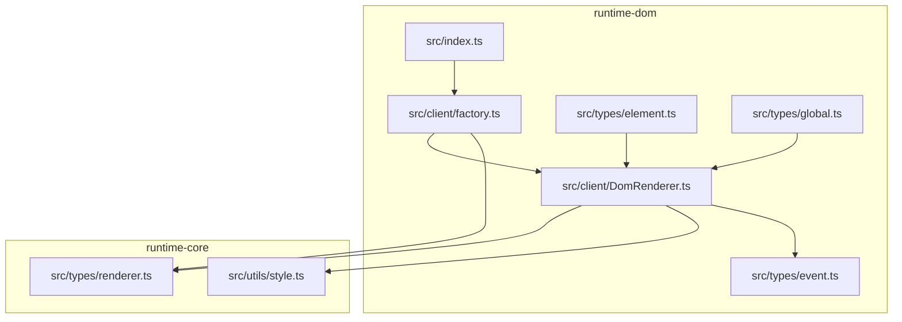
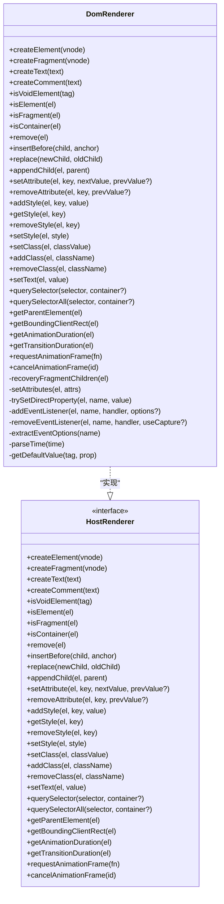
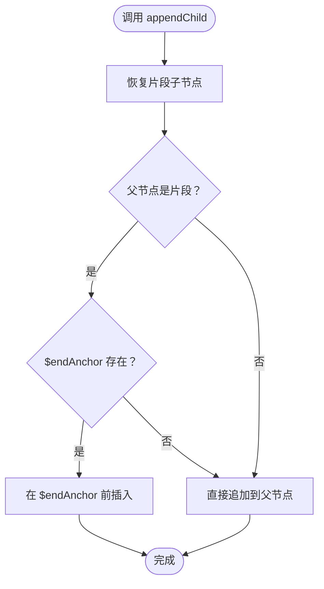
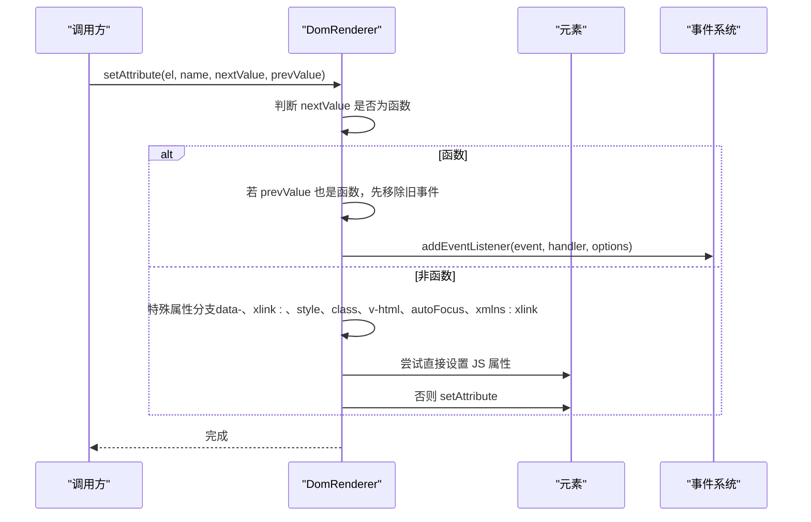
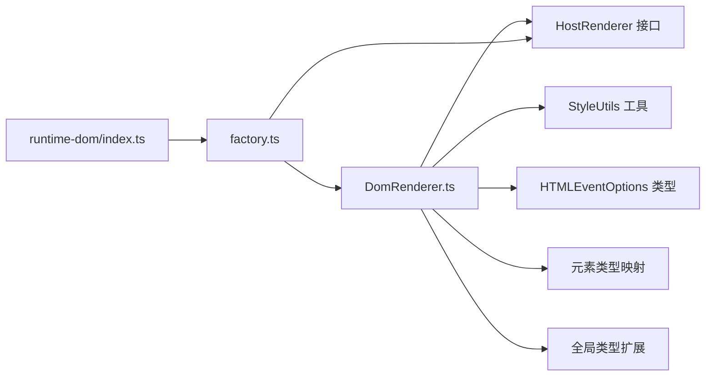
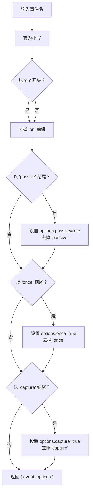
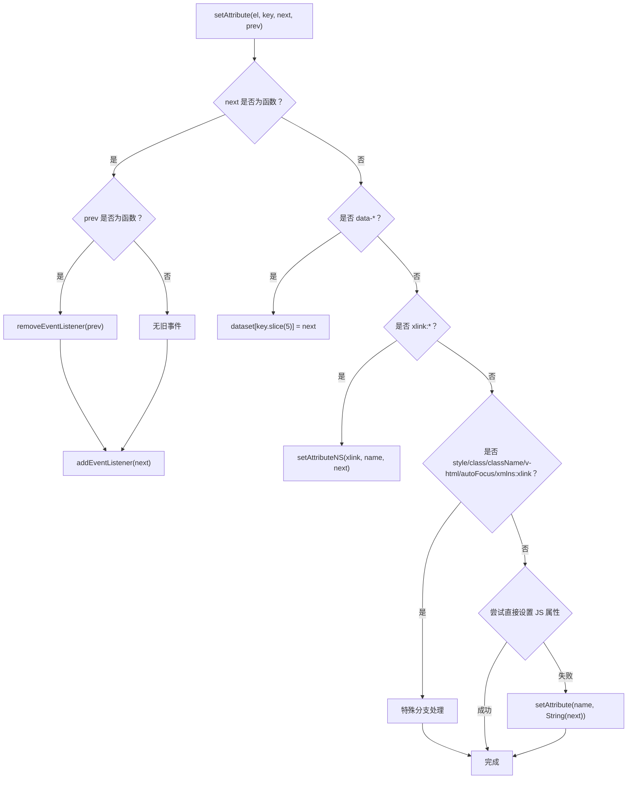

# DOM渲染器实现

<cite>
**本文引用的文件**
- [DomRenderer.ts](file://packages/runtime-dom/src/client/DomRenderer.ts)
- [factory.ts](file://packages/runtime-dom/src/client/factory.ts)
- [renderer.ts](file://packages/runtime-core/src/types/renderer.ts)
- [style.ts](file://packages/runtime-core/src/utils/style.ts)
- [event.ts](file://packages/runtime-dom/src/types/event.ts)
- [element.ts](file://packages/runtime-dom/src/types/element.ts)
- [global.ts](file://packages/runtime-dom/src/types/global.ts)
- [DomRenderer.test.ts](file://packages/runtime-dom/__tests__/client/DomRenderer.test.ts)
- [index.ts](file://packages/runtime-dom/src/index.ts)
</cite>

## 目录
1. [简介](#简介)
2. [项目结构](#项目结构)
3. [核心组件](#核心组件)
4. [架构总览](#架构总览)
5. [详细组件分析](#详细组件分析)
6. [依赖关系分析](#依赖关系分析)
7. [性能考量](#性能考量)
8. [故障排查指南](#故障排查指南)
9. [结论](#结论)
10. [附录](#附录)

## 简介
本文档系统化解析 vitarx 框架中的 DOM 渲染器（DomRenderer），说明其作为平台特定渲染器在浏览器环境下的职责与实现细节。DomRenderer 实现了运行时核心提供的 HostRenderer 接口，负责在浏览器 DOM 上执行元素创建、属性与事件管理、样式与类名操作、片段节点维护、查询与布局信息获取、动画帧调度等能力。文档同时阐述其对 SVG 元素、片段节点、自闭合元素等特殊场景的处理机制，并给出渲染器接口设计原理与扩展建议。

## 项目结构
DomRenderer 位于 runtime-dom 包的客户端目录中，配合工厂函数完成渲染器注册与控制器注册，形成完整的浏览器端渲染管线。

图表来源
- [DomRenderer.ts](file://packages/runtime-dom/src/client/DomRenderer.ts#L1-L60)
- [factory.ts](file://packages/runtime-dom/src/client/factory.ts#L1-L39)
- [renderer.ts](file://packages/runtime-core/src/types/renderer.ts#L80-L280)
- [style.ts](file://packages/runtime-core/src/utils/style.ts#L1-L173)
- [event.ts](file://packages/runtime-dom/src/types/event.ts#L520-L562)
- [element.ts](file://packages/runtime-dom/src/types/element.ts#L1-L52)
- [global.ts](file://packages/runtime-dom/src/types/global.ts#L1-L21)
- [index.ts](file://packages/runtime-dom/src/index.ts#L1-L3)

章节来源
- [DomRenderer.ts](file://packages/runtime-dom/src/client/DomRenderer.ts#L1-L60)
- [factory.ts](file://packages/runtime-dom/src/client/factory.ts#L1-L39)
- [index.ts](file://packages/runtime-dom/src/index.ts#L1-L3)

## 核心组件
- DomRenderer：实现 HostRenderer 接口，提供浏览器 DOM 操作能力。
- 工厂函数：注册 DomRenderer 并注册各类节点控制器，导出 createApp。
- HostRenderer 接口：定义渲染器必须实现的操作契约。
- StyleUtils：提供样式与类名的转换与合并工具。
- 事件类型与元素类型：定义事件修饰符、HTMLEventOptions、元素标签映射等。

章节来源
- [DomRenderer.ts](file://packages/runtime-dom/src/client/DomRenderer.ts#L62-L120)
- [renderer.ts](file://packages/runtime-core/src/types/renderer.ts#L80-L280)
- [style.ts](file://packages/runtime-core/src/utils/style.ts#L1-L173)
- [event.ts](file://packages/runtime-dom/src/types/event.ts#L520-L562)
- [element.ts](file://packages/runtime-dom/src/types/element.ts#L1-L52)
- [global.ts](file://packages/runtime-dom/src/types/global.ts#L1-L21)

## 架构总览
DomRenderer 作为 HostRenderer 的浏览器实现，承担以下职责：
- 元素与节点创建：HTML/SVG 元素、文本、注释、文档片段。
- DOM 操作：插入、替换、追加、移除、查询、父元素获取。
- 属性与事件：统一 setAttribute/removeAttribute；事件名解析与修饰符处理。
- 样式与类名：addStyle/setStyle/getStyle/removeClass/setClass/addClass。
- 片段节点维护：$startAnchor/$endAnchor 锚点与子节点恢复。
- 动画与布局：requestAnimationFrame/cancelAnimationFrame、getBoundingClientRect、动画/过渡时长计算。

图表来源
- [DomRenderer.ts](file://packages/runtime-dom/src/client/DomRenderer.ts#L62-L573)
- [renderer.ts](file://packages/runtime-core/src/types/renderer.ts#L80-L280)

## 详细组件分析

### DomRenderer 类实现概览
- 继承与契约：DomRenderer 实现 HostRenderer 接口，确保在浏览器环境下提供一致的 DOM 操作能力。
- 特殊元素支持：内置 void 元素集合，支持 SVG 命名空间创建，支持 xmlns:xlink 与 xlink:* 属性。
- 片段节点：文档片段包含 $startAnchor/$endAnchor 锚点与 $vnode 引用，便于恢复子节点与范围删除。
- 事件系统：统一通过 setAttribute 绑定事件，内部解析事件名与修饰符（capture/once/passive），并委托 addEventListener/removeEventListener。
- 样式系统：StyleUtils 提供类名与样式的多格式转换，DomRenderer 提供 addStyle/setStyle/getStyle/removeStyle/setClass/addClass/removeClass。
- 动画与布局：封装 requestAnimationFrame/cancelAnimationFrame；计算 getBoundingClientRect；解析动画/过渡时长。

章节来源
- [DomRenderer.ts](file://packages/runtime-dom/src/client/DomRenderer.ts#L21-L120)
- [DomRenderer.ts](file://packages/runtime-dom/src/client/DomRenderer.ts#L120-L251)
- [DomRenderer.ts](file://packages/runtime-dom/src/client/DomRenderer.ts#L252-L573)

### 核心方法详解

#### 元素创建与容器判断
- createElement：根据 vnode 的 type 与 isSVGElement 决定使用 document.createElement 或 document.createElementNS；随后批量设置属性。
- createFragment/createText/createComment：创建对应节点并为片段设置锚点与 vnode 引用。
- isVoidElement/isElement/isFragment/isContainer：判断元素类型与容器性，容器需非 void 且为元素或文档片段。

章节来源
- [DomRenderer.ts](file://packages/runtime-dom/src/client/DomRenderer.ts#L64-L120)

#### DOM 插入与替换
- insertBefore：兼容片段节点，若锚点为片段则使用其 $startAnchor；校验锚点父节点存在，否则抛错。
- replace：兼容片段节点，使用 $startAnchor 的父节点；若为片段则先插入再删除旧片段，否则直接 replaceChild。
- appendChild：兼容片段节点，若父节点为已挂载片段且存在 $endAnchor，则在锚点前插入；否则直接 append。

图表来源
- [DomRenderer.ts](file://packages/runtime-dom/src/client/DomRenderer.ts#L170-L182)

章节来源
- [DomRenderer.ts](file://packages/runtime-dom/src/client/DomRenderer.ts#L132-L182)

#### 属性与事件处理
- setAttribute：统一入口，处理 undefined/null 值、事件函数、data-* dataset、xlink:* 命名空间、style/class/className/v-html/autoFocus/xmlns:xlink 等特殊属性；尝试直接设置 JS 属性，否则回退到 setAttribute；异常时记录错误。
- removeAttribute：特殊处理 class/style；事件属性移除时调用 removeEventListener；对 JS 属性尝试还原默认值，否则 removeAttribute。
- 事件修饰符：extractEventOptions 解析 onXxxCapture/Once/Passive，生成事件名与 HTMLEventOptions；addEventListener/removeEventListener 委托至原生 API。

图表来源
- [DomRenderer.ts](file://packages/runtime-dom/src/client/DomRenderer.ts#L258-L350)
- [DomRenderer.ts](file://packages/runtime-dom/src/client/DomRenderer.ts#L453-L501)
- [DomRenderer.ts](file://packages/runtime-dom/src/client/DomRenderer.ts#L515-L543)
- [event.ts](file://packages/runtime-dom/src/types/event.ts#L520-L562)

章节来源
- [DomRenderer.ts](file://packages/runtime-dom/src/client/DomRenderer.ts#L258-L350)
- [DomRenderer.ts](file://packages/runtime-dom/src/client/DomRenderer.ts#L453-L543)
- [event.ts](file://packages/runtime-dom/src/types/event.ts#L520-L562)

#### 样式与类名管理
- addStyle/setStyle/getStyle/removeStyle：基于 el.style.setProperty/cssText/property 访问；removeStyle 在无样式时移除 style 属性。
- setClass/addClass/removeClass：通过 StyleUtils.cssClassValueToString/toArray 转换，使用 classList 管理；removeClass 在无类名时移除 class 属性。

章节来源
- [DomRenderer.ts](file://packages/runtime-dom/src/client/DomRenderer.ts#L184-L251)
- [style.ts](file://packages/runtime-core/src/utils/style.ts#L112-L173)

#### 片段节点维护
- recoveryFragmentChildren：当片段为空或仅含锚点时，依据 vnode.children 恢复子节点顺序；保证插入/替换/移除时片段内容一致性。

章节来源
- [DomRenderer.ts](file://packages/runtime-dom/src/client/DomRenderer.ts#L392-L416)

#### 动画与布局
- requestAnimationFrame/cancelAnimationFrame：封装浏览器 API。
- getBoundingClientRect：返回元素几何信息。
- getAnimationDuration/getTransitionDuration：解析 animation-delay/animation-duration 与 transition-delay/transition-duration，按逗号分隔取最大值。

章节来源
- [DomRenderer.ts](file://packages/runtime-dom/src/client/DomRenderer.ts#L233-L241)
- [DomRenderer.ts](file://packages/runtime-dom/src/client/DomRenderer.ts#L196-L208)
- [DomRenderer.ts](file://packages/runtime-dom/src/client/DomRenderer.ts#L374-L390)

### 渲染器接口设计原理与扩展
- 设计原则：HostRenderer 抽象 DOM 操作，使上层逻辑与平台解耦；DomRenderer 专注浏览器 DOM API 的安全封装与边界处理。
- 扩展方式：新增平台（如 SSR）时，实现 HostRenderer 即可无缝接入；在 DomRenderer 基础上可扩展更多属性/事件/样式策略，但需保持接口一致性。
- 控制器注册：factory.ts 中注册节点控制器（元素、片段、文本、注释、有状态/无状态小部件），形成渲染树到真实 DOM 的映射。

章节来源
- [renderer.ts](file://packages/runtime-core/src/types/renderer.ts#L80-L280)
- [factory.ts](file://packages/runtime-dom/src/client/factory.ts#L1-L39)

## 依赖关系分析

图表来源
- [DomRenderer.ts](file://packages/runtime-dom/src/client/DomRenderer.ts#L1-L60)
- [renderer.ts](file://packages/runtime-core/src/types/renderer.ts#L80-L280)
- [style.ts](file://packages/runtime-core/src/utils/style.ts#L1-L173)
- [event.ts](file://packages/runtime-dom/src/types/event.ts#L520-L562)
- [element.ts](file://packages/runtime-dom/src/types/element.ts#L1-L52)
- [global.ts](file://packages/runtime-dom/src/types/global.ts#L1-L21)
- [factory.ts](file://packages/runtime-dom/src/client/factory.ts#L1-L39)
- [index.ts](file://packages/runtime-dom/src/index.ts#L1-L3)

章节来源
- [DomRenderer.ts](file://packages/runtime-dom/src/client/DomRenderer.ts#L1-L60)
- [renderer.ts](file://packages/runtime-core/src/types/renderer.ts#L80-L280)
- [style.ts](file://packages/runtime-core/src/utils/style.ts#L1-L173)
- [event.ts](file://packages/runtime-dom/src/types/event.ts#L520-L562)
- [element.ts](file://packages/runtime-dom/src/types/element.ts#L1-L52)
- [global.ts](file://packages/runtime-dom/src/types/global.ts#L1-L21)
- [factory.ts](file://packages/runtime-dom/src/client/factory.ts#L1-L39)
- [index.ts](file://packages/runtime-dom/src/index.ts#L1-L3)

## 性能考量
- 片段节点：通过 createDocumentFragment 与锚点减少频繁 DOM 操作，append/insert/replace 时优先在片段内维护，最后一次性挂载到真实父节点，降低重排与重绘成本。
- 样式更新：setStyle 使用 cssText，避免逐条设置带来的多次样式计算；addStyle/removeStyle 使用 style.setProperty，适合细粒度更新。
- 事件绑定：统一通过 setAttribute 绑定事件，避免重复绑定与内存泄漏；once 修饰符自动移除，减少手动清理。
- 默认值缓存：getDefaultValue 对标签+属性组合做缓存，减少创建临时元素的成本。
- 动画帧：requestAnimationFrame/cancelAnimationFrame 与浏览器同步，避免阻塞主线程。

[本节为通用性能讨论，不直接分析具体文件]

## 故障排查指南
- 插入/替换无父节点：insertBefore/replace 在锚点或旧节点无父节点时抛错，需确保节点已挂载。
- 事件绑定与移除：确保事件名大小写与修饰符正确（onClickCapture/Once/Passive），移除时需传入 prevValue 以便正确解绑。
- 属性设置异常：部分只读属性（如 innerHTML）可能抛异常，DomRenderer 已捕获并降级处理，必要时改用 v-html 或其他方式。
- SVG 与命名空间：xlink:* 与 xmlns:xlink 需使用 setAttributeNS，确保命名空间正确。
- 片段节点：若出现子节点丢失，检查 recoveryFragmentChildren 是否被调用，或 $vnode.children 是否正确。

章节来源
- [DomRenderer.ts](file://packages/runtime-dom/src/client/DomRenderer.ts#L132-L168)
- [DomRenderer.ts](file://packages/runtime-dom/src/client/DomRenderer.ts#L258-L350)
- [DomRenderer.ts](file://packages/runtime-dom/src/client/DomRenderer.ts#L392-L416)
- [DomRenderer.test.ts](file://packages/runtime-dom/__tests__/client/DomRenderer.test.ts#L546-L563)

## 结论
DomRenderer 通过实现 HostRenderer 接口，提供了浏览器 DOM 的完整操作能力，涵盖元素创建、属性与事件、样式与类名、片段节点维护、查询与布局、动画帧调度等关键能力。其对 SVG、片段、自闭合元素等特殊场景进行了细致处理，并通过 StyleUtils 与事件修饰符增强开发体验。该设计既满足高性能渲染需求，又具备良好的扩展性与可维护性。

[本节为总结性内容，不直接分析具体文件]

## 附录

### 关键流程图：事件修饰符解析

图表来源
- [DomRenderer.ts](file://packages/runtime-dom/src/client/DomRenderer.ts#L515-L543)
- [event.ts](file://packages/runtime-dom/src/types/event.ts#L520-L562)

### 关键流程图：属性设置与事件绑定

图表来源
- [DomRenderer.ts](file://packages/runtime-dom/src/client/DomRenderer.ts#L258-L317)