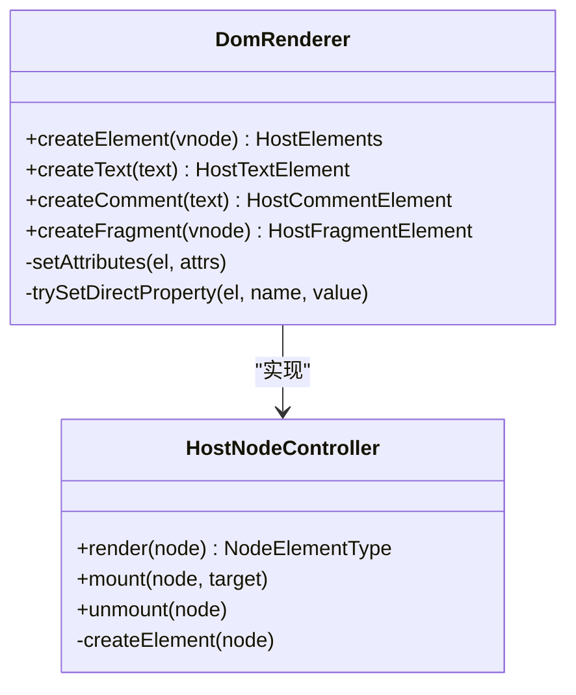
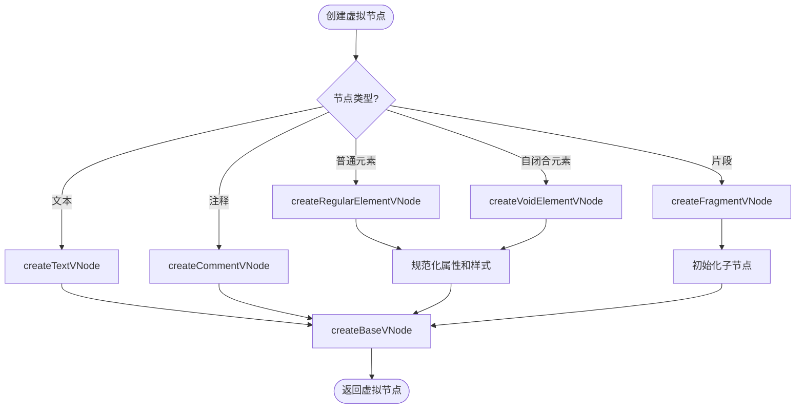
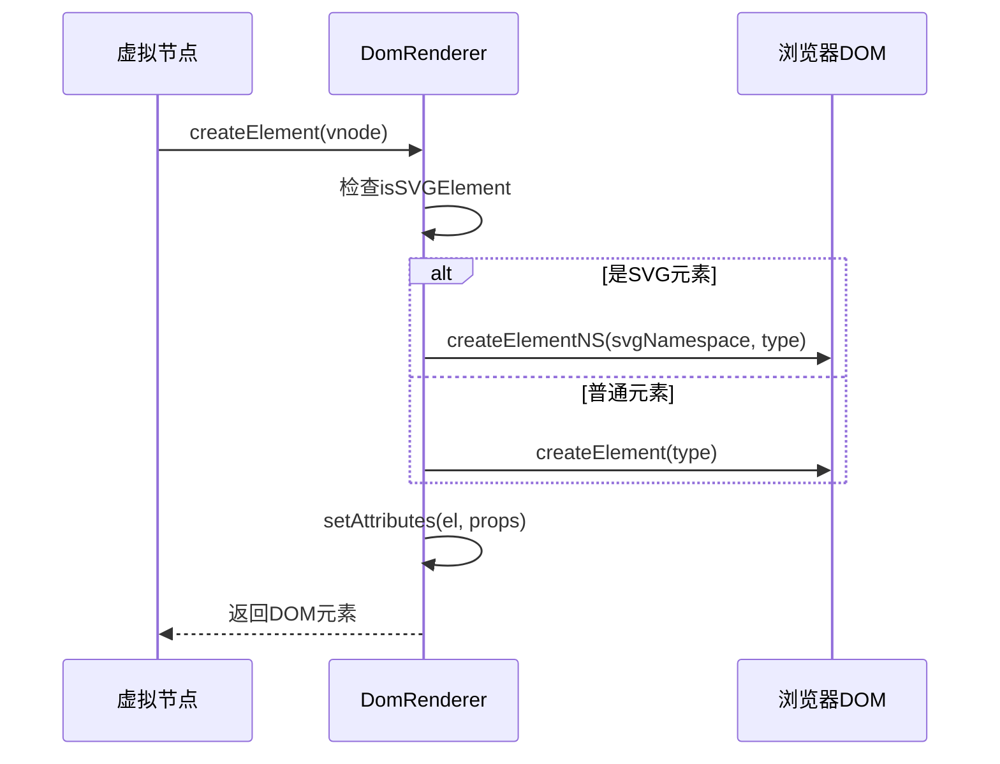
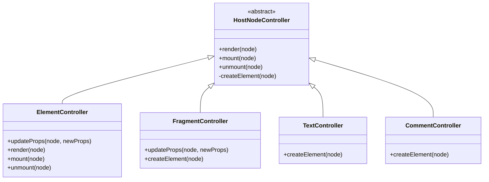
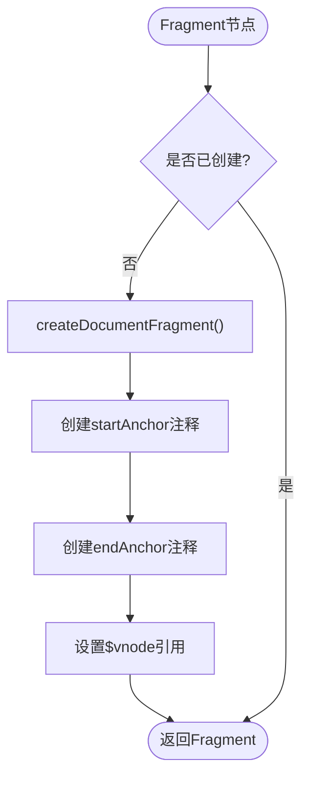
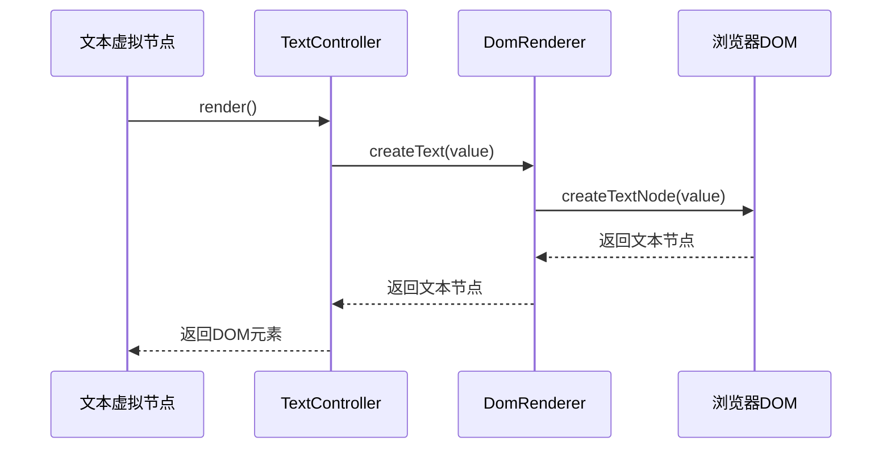
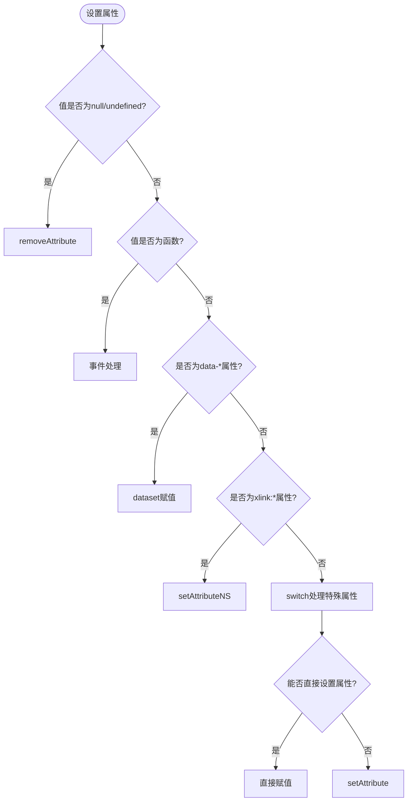
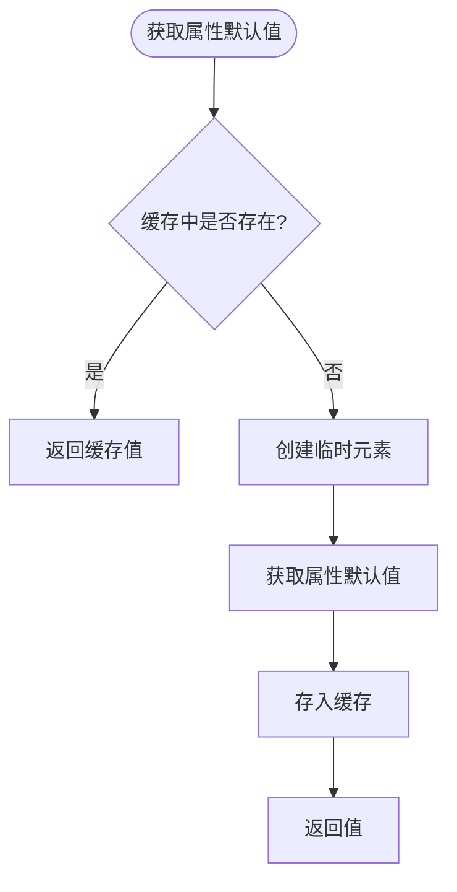
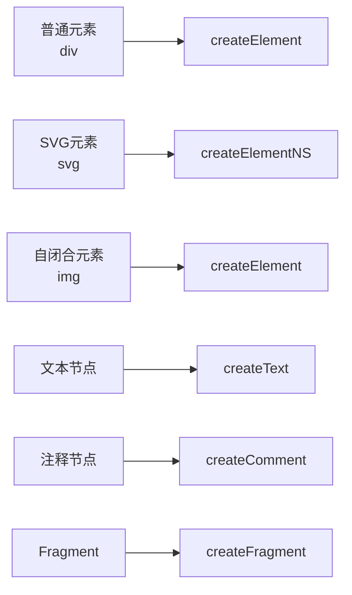

# 元素创建与管理

<cite>
**本文档引用的文件**   
- [DomRenderer.ts](file://packages/runtime-dom/src/client/DomRenderer.ts)
- [factory.ts](file://packages/runtime-dom/src/client/factory.ts)
- [ElementController.ts](file://packages/runtime-core/src/controllers/ElementController.ts)
- [FragmentController.ts](file://packages/runtime-core/src/controllers/FragmentController.ts)
- [TextController.ts](file://packages/runtime-core/src/controllers/TextController.ts)
- [CommentController.ts](file://packages/runtime-core/src/controllers/CommentController.ts)
- [HostNodeController.ts](file://packages/runtime-core/src/controllers/HostNodeController.ts)
- [element.ts](file://packages/runtime-core/src/vnode/creator/element.ts)
- [fragment.ts](file://packages/runtime-core/src/vnode/creator/fragment.ts)
- [special.ts](file://packages/runtime-core/src/vnode/creator/special.ts)
- [driver.ts](file://packages/runtime-core/src/vnode/core/driver.ts)
</cite>

## 目录
1. [简介](#简介)
2. [核心元素创建机制](#核心元素创建机制)
3. [虚拟节点创建流程](#虚拟节点创建流程)
4. [DOM渲染器实现原理](#dom渲染器实现原理)
5. [特殊节点类型处理](#特殊节点类型处理)
6. [性能优化策略](#性能优化策略)
7. [代码示例](#代码示例)

## 简介
vitarx框架的DOM渲染系统采用虚拟DOM技术，通过高效的元素创建和管理机制实现高性能的UI渲染。本文档深入解析框架中元素创建的核心机制，包括DomRenderer.createElement方法的实现原理、辅助方法的用途以及虚拟节点到真实DOM的映射过程。

**Section sources**
- [DomRenderer.ts](file://packages/runtime-dom/src/client/DomRenderer.ts#L45-L61)

## 核心元素创建机制

vitarx框架通过DomRenderer类实现DOM元素的创建和管理。createElement方法根据节点类型创建对应的DOM节点，支持普通元素、SVG元素和自闭合元素等不同类型的节点创建。

**Diagram sources**
- [DomRenderer.ts](file://packages/runtime-dom/src/client/DomRenderer.ts#L62-L74)
- [HostNodeController.ts](file://packages/runtime-core/src/controllers/HostNodeController.ts#L21-L127)

**Section sources**
- [DomRenderer.ts](file://packages/runtime-dom/src/client/DomRenderer.ts#L62-L74)

## 虚拟节点创建流程

虚拟节点的创建流程从vnode创建开始，经过类型判断和属性规范化，最终映射到真实的DOM节点。框架提供了多种创建函数来处理不同类型的虚拟节点。

**Diagram sources**
- [element.ts](file://packages/runtime-core/src/vnode/creator/element.ts#L26-L69)
- [fragment.ts](file://packages/runtime-core/src/vnode/creator/fragment.ts#L15-L24)
- [special.ts](file://packages/runtime-core/src/vnode/creator/special.ts#L19-L35)

**Section sources**
- [element.ts](file://packages/runtime-core/src/vnode/creator/element.ts#L1-L69)
- [fragment.ts](file://packages/runtime-core/src/vnode/creator/fragment.ts#L1-L24)
- [special.ts](file://packages/runtime-core/src/vnode/creator/special.ts#L1-L36)

## DOM渲染器实现原理

DomRenderer类实现了HostRenderer接口，负责在浏览器环境中进行DOM操作和渲染。其核心功能包括DOM元素的创建、管理、插入、删除、替换和属性操作。

### 元素创建实现
createElement方法根据节点的isSVGElement标志决定使用createElement还是createElementNS来创建元素。对于SVG元素，使用命名空间创建；对于普通元素，直接创建。

**Diagram sources**
- [DomRenderer.ts](file://packages/runtime-dom/src/client/DomRenderer.ts#L64-L74)

### 控制器体系
框架采用控制器模式管理不同类型的节点。每种节点类型都有对应的控制器，如ElementController、FragmentController等，通过多态方式处理不同节点的生命周期。

**Diagram sources**
- [ElementController.ts](file://packages/runtime-core/src/controllers/ElementController.ts#L46-L104)
- [FragmentController.ts](file://packages/runtime-core/src/controllers/FragmentController.ts#L28-L42)
- [TextController.ts](file://packages/runtime-core/src/controllers/TextController.ts#L26-L31)
- [CommentController.ts](file://packages/runtime-core/src/controllers/CommentController.ts#L15-L21)

**Section sources**
- [ElementController.ts](file://packages/runtime-core/src/controllers/ElementController.ts#L1-L104)
- [FragmentController.ts](file://packages/runtime-core/src/controllers/FragmentController.ts#L1-L42)
- [TextController.ts](file://packages/runtime-core/src/controllers/TextController.ts#L1-L31)
- [CommentController.ts](file://packages/runtime-core/src/controllers/CommentController.ts#L1-L21)

## 特殊节点类型处理

### Fragment节点处理
Fragment节点是一种特殊的虚拟节点，它本身不渲染为任何DOM元素，而是将其子节点直接渲染到父节点中。这允许组件返回多个根节点。

**Diagram sources**
- [DomRenderer.ts](file://packages/runtime-dom/src/client/DomRenderer.ts#L89-L95)
- [FragmentController.ts](file://packages/runtime-core/src/controllers/FragmentController.ts#L38-L40)

### 文本和注释节点
文本和注释节点通过专门的控制器进行管理，确保正确创建和更新。

**Diagram sources**
- [TextController.ts](file://packages/runtime-core/src/controllers/TextController.ts#L27-L29)
- [DomRenderer.ts](file://packages/runtime-dom/src/client/DomRenderer.ts#L98-L100)

**Section sources**
- [TextController.ts](file://packages/runtime-core/src/controllers/TextController.ts#L1-L31)
- [CommentController.ts](file://packages/runtime-core/src/controllers/CommentController.ts#L1-L21)

## 性能优化策略

### 属性设置优化
框架在设置属性时采用了多种优化策略，包括直接属性设置、事件处理优化和特殊属性处理。

**Diagram sources**
- [DomRenderer.ts](file://packages/runtime-dom/src/client/DomRenderer.ts#L258-L310)

### 缓存机制
框架使用缓存来提高性能，特别是对于属性默认值的获取。

**Diagram sources**
- [DomRenderer.ts](file://packages/runtime-dom/src/client/DomRenderer.ts#L547-L571)

**Section sources**
- [DomRenderer.ts](file://packages/runtime-dom/src/client/DomRenderer.ts#L258-L317)
- [DomRenderer.ts](file://packages/runtime-dom/src/client/DomRenderer.ts#L544-L571)

## 代码示例

### 创建不同类型的元素

**Section sources**
- [DomRenderer.ts](file://packages/runtime-dom/src/client/DomRenderer.ts#L64-L105)