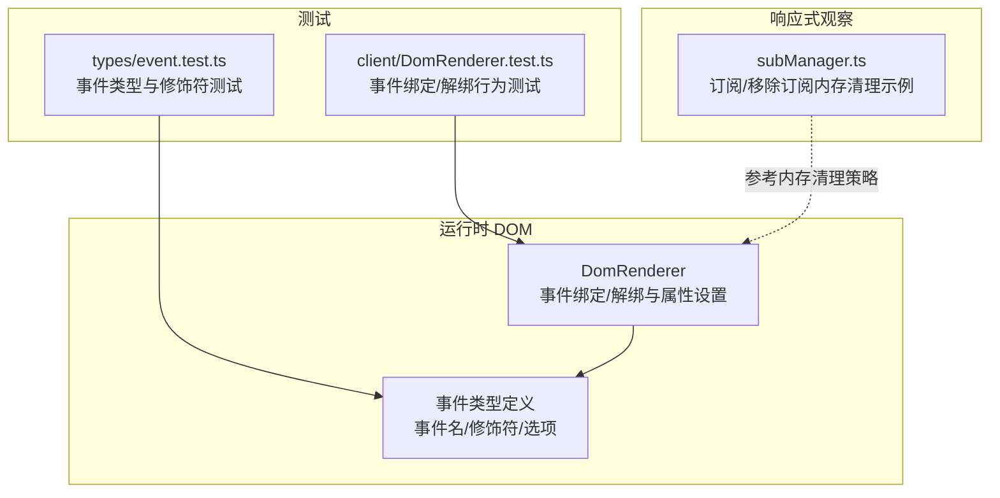
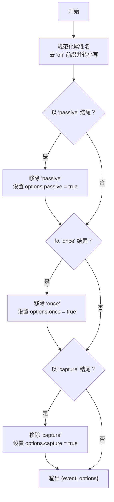
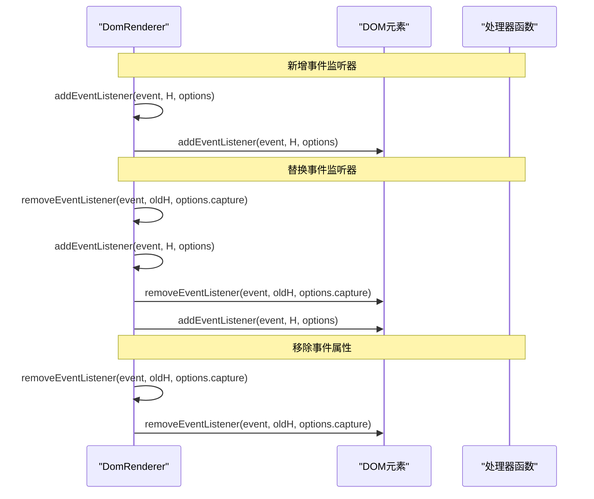
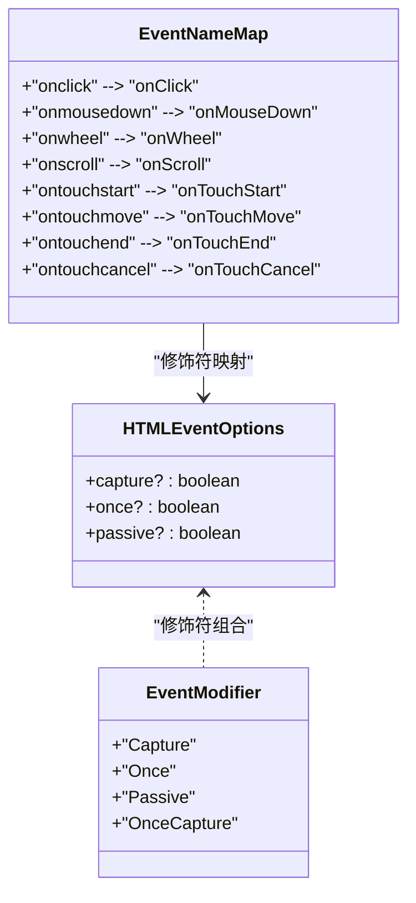
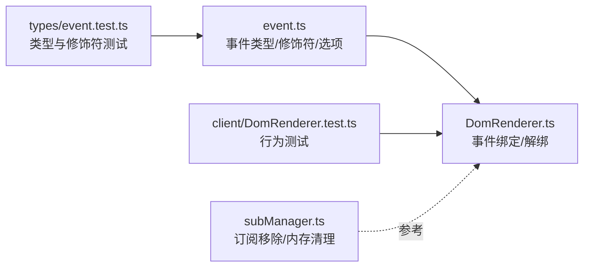

# 事件处理

<cite>
**本文引用的文件**
- [DomRenderer.ts](file://packages/runtime-dom/src/client/DomRenderer.ts)
- [event.ts](file://packages/runtime-dom/src/types/event.ts)
- [event.test.ts](file://packages/runtime-dom/__tests__/types/event.test.ts)
- [DomRenderer.test.ts](file://packages/runtime-dom/__tests__/client/DomRenderer.test.ts)
- [subManager.ts](file://packages/responsive/src/observer/subManager.ts)
</cite>

## 目录
1. [简介](#简介)
2. [项目结构](#项目结构)
3. [核心组件](#核心组件)
4. [架构总览](#架构总览)
5. [详细组件分析](#详细组件分析)
6. [依赖关系分析](#依赖关系分析)
7. [性能考量](#性能考量)
8. [故障排查指南](#故障排查指南)
9. [结论](#结论)
10. [附录](#附录)

## 简介
本技术文档围绕 vitarx 框架的事件处理系统，系统性阐述事件监听器的注册、更新与销毁机制；解析对 capture、once、passive 等事件选项的支持实现；说明事件代理机制的设计原理及其在性能优化中的作用；对比原生事件绑定与代理模式的适用场景；结合实际用例展示事件冒泡控制、事件委托和动态事件监听器管理的最佳实践，并讨论如何避免常见的内存泄漏问题，确保事件资源的正确释放。

## 项目结构
vitarx 的事件处理能力由运行时 DOM 包提供，核心位于 DomRenderer 类中，负责在浏览器环境中创建 DOM 元素、设置属性（包括事件属性）、添加/移除事件监听器，并通过类型系统定义事件名、修饰符与选项。



图表来源
- [DomRenderer.ts](file://packages/runtime-dom/src/client/DomRenderer.ts#L257-L571)
- [event.ts](file://packages/runtime-dom/src/types/event.ts#L1-L562)
- [event.test.ts](file://packages/runtime-dom/__tests__/types/event.test.ts#L1-L360)
- [DomRenderer.test.ts](file://packages/runtime-dom/__tests__/client/DomRenderer.test.ts#L400-L451)
- [subManager.ts](file://packages/responsive/src/observer/subManager.ts#L360-L394)

章节来源
- [DomRenderer.ts](file://packages/runtime-dom/src/client/DomRenderer.ts#L257-L571)
- [event.ts](file://packages/runtime-dom/src/types/event.ts#L1-L562)
- [event.test.ts](file://packages/runtime-dom/__tests__/types/event.test.ts#L1-L360)
- [DomRenderer.test.ts](file://packages/runtime-dom/__tests__/client/DomRenderer.test.ts#L400-L451)
- [subManager.ts](file://packages/responsive/src/observer/subManager.ts#L360-L394)

## 核心组件
- DomRenderer：负责 DOM 元素创建、属性设置（含事件属性）、事件监听器的添加与移除，以及事件选项的解析与传递。
- 事件类型系统：定义事件名映射、修饰符（Capture/Once/Passive/OnceCapture）与 HTMLEventOptions 接口，保证编译期类型安全。
- 测试用例：覆盖事件修饰符、选项组合、事件类型完整性与绑定/解绑行为。

章节来源
- [DomRenderer.ts](file://packages/runtime-dom/src/client/DomRenderer.ts#L257-L571)
- [event.ts](file://packages/runtime-dom/src/types/event.ts#L1-L562)
- [event.test.ts](file://packages/runtime-dom/__tests__/types/event.test.ts#L1-L360)
- [DomRenderer.test.ts](file://packages/runtime-dom/__tests__/client/DomRenderer.test.ts#L400-L451)

## 架构总览
vitarx 的事件处理采用“属性驱动”的方式：当设置属性时，若属性名为以 on 开头的事件名，且值为函数，则通过 DomRenderer 内部的 addEventListener/removeEventListener 完成事件监听器的注册与替换；同时，extractEventOptions 负责从属性名中解析出事件名与修饰符（capture/once/passive），并将这些选项合并到最终的 addEventListener 调用中。

```mermaid
sequenceDiagram
participant V as "虚拟节点(props)"
participant R as "DomRenderer"
participant EL as "DOM元素"
participant OPT as "事件选项解析"
V->>R : 设置属性 name/value
alt value 为函数且 name 以 on 开头
R->>OPT : 解析事件名与修饰符
OPT-->>R : {event, options}
R->>EL : addEventListener(event, handler, options)
else 非函数或非事件属性
R-->>V : 其他属性处理
end
note over R,EL : 后续更新时，若旧值为函数则先移除旧监听器，再绑定新监听器
```

图表来源
- [DomRenderer.ts](file://packages/runtime-dom/src/client/DomRenderer.ts#L257-L571)

章节来源
- [DomRenderer.ts](file://packages/runtime-dom/src/client/DomRenderer.ts#L257-L571)

## 详细组件分析

### 事件选项与修饰符解析
- 事件名解析：从属性名去除前缀“on”，统一转为小写，得到基础事件名。
- 修饰符识别：依次检查后缀“passive”、“once”、“capture”，分别移除对应后缀并设置对应选项。
- 最终传入 addEventListener 的 options 即为解析结果与外部传入 options 的合并。



图表来源
- [DomRenderer.ts](file://packages/runtime-dom/src/client/DomRenderer.ts#L515-L543)

章节来源
- [DomRenderer.ts](file://packages/runtime-dom/src/client/DomRenderer.ts#L515-L543)

### 事件监听器注册、更新与销毁
- 注册：当属性值为函数且属性名为事件名时，调用 addEventListener，将解析后的事件名与选项传入。
- 更新：若旧值也为函数，则先调用 removeEventListener 移除旧监听器，再绑定新监听器，从而实现“替换”语义。
- 销毁：在移除属性时，若属性为事件属性且旧值为函数，则调用 removeEventListener 移除对应监听器。



图表来源
- [DomRenderer.ts](file://packages/runtime-dom/src/client/DomRenderer.ts#L453-L501)

章节来源
- [DomRenderer.ts](file://packages/runtime-dom/src/client/DomRenderer.ts#L257-L571)

### 事件修饰符与选项的类型支持
- 修饰符类型：EventModifier 包含 'Capture' | 'Once' | 'Passive' | 'OnceCapture'，通过模板映射生成带修饰符的事件名。
- 选项接口：HTMLEventOptions 定义 capture/once/passive 三个布尔选项，均支持组合使用。
- 类型测试：覆盖事件名映射、修饰符支持、选项组合与事件类型完整性，确保编译期类型安全。



图表来源
- [event.ts](file://packages/runtime-dom/src/types/event.ts#L1-L562)
- [event.test.ts](file://packages/runtime-dom/__tests__/types/event.test.ts#L1-L360)

章节来源
- [event.ts](file://packages/runtime-dom/src/types/event.ts#L1-L562)
- [event.test.ts](file://packages/runtime-dom/__tests__/types/event.test.ts#L1-L360)

### 事件冒泡控制与一次性监听
- 一次性监听：once 修饰符通过 addEventListener 的 once 选项实现，事件触发后自动移除监听器，避免手动清理。
- 冒泡控制：capture 修饰符通过 addEventListener 的 capture 选项实现，使监听器在捕获阶段触发，从而影响事件传播路径。
- 测试验证：测试用例覆盖 onClickOnce 行为与 onScrollPassive 绑定，验证 once 与 passive 的行为。

章节来源
- [DomRenderer.ts](file://packages/runtime-dom/src/client/DomRenderer.ts#L453-L501)
- [DomRenderer.test.ts](file://packages/runtime-dom/__tests__/client/DomRenderer.test.ts#L400-L451)
- [event.ts](file://packages/runtime-dom/src/types/event.ts#L521-L561)

### 事件代理机制与性能优化
- 代理思想：vitarx 通过“属性驱动”的事件绑定方式，将事件处理集中在 DomRenderer 中，统一解析与派发，减少分散的原生 addEventListener/removeEventListener 调用。
- 性能优化点：
  - passive 选项：在滚动等高频事件中使用 passive，可提升滚动性能，避免主线程阻塞。
  - once 选项：一次性监听器在触发后自动移除，降低后续事件处理开销。
  - capture 选项：在捕获阶段处理事件，可提前拦截与短路，减少冒泡阶段的处理成本。
- 实践建议：
  - 对滚动、触摸等高频事件优先考虑 passive。
  - 对仅需触发一次的交互使用 once。
  - 对需要在冒泡前拦截的场景使用 capture。

章节来源
- [DomRenderer.ts](file://packages/runtime-dom/src/client/DomRenderer.ts#L453-L501)
- [event.ts](file://packages/runtime-dom/src/types/event.ts#L521-L561)
- [DomRenderer.test.ts](file://packages/runtime-dom/__tests__/client/DomRenderer.test.ts#L400-L451)

### 动态事件监听器管理与最佳实践
- 动态替换：当同一事件属性被赋予新的处理器函数时，先移除旧监听器再绑定新监听器，确保“替换”语义正确。
- 生命周期清理：在移除属性时，若旧值为函数且属性为事件属性，则移除对应的监听器，防止残留监听器导致内存泄漏。
- 内存清理参考：响应式模块的订阅移除逻辑展示了“移除订阅者并清理空集合/映射”的通用策略，可借鉴到事件监听器的生命周期管理中。

章节来源
- [DomRenderer.ts](file://packages/runtime-dom/src/client/DomRenderer.ts#L257-L571)
- [subManager.ts](file://packages/responsive/src/observer/subManager.ts#L360-L394)

## 依赖关系分析
- DomRenderer 依赖事件类型系统提供的事件名映射与选项接口，保证事件属性设置时的类型安全。
- 测试用例覆盖事件修饰符、选项组合与行为验证，保障实现正确性。
- 响应式模块的订阅管理为事件资源的生命周期清理提供了参考模式。



图表来源
- [DomRenderer.ts](file://packages/runtime-dom/src/client/DomRenderer.ts#L257-L571)
- [event.ts](file://packages/runtime-dom/src/types/event.ts#L1-L562)
- [event.test.ts](file://packages/runtime-dom/__tests__/types/event.test.ts#L1-L360)
- [DomRenderer.test.ts](file://packages/runtime-dom/__tests__/client/DomRenderer.test.ts#L400-L451)
- [subManager.ts](file://packages/responsive/src/observer/subManager.ts#L360-L394)

章节来源
- [DomRenderer.ts](file://packages/runtime-dom/src/client/DomRenderer.ts#L257-L571)
- [event.ts](file://packages/runtime-dom/src/types/event.ts#L1-L562)
- [event.test.ts](file://packages/runtime-dom/__tests__/types/event.test.ts#L1-L360)
- [DomRenderer.test.ts](file://packages/runtime-dom/__tests__/client/DomRenderer.test.ts#L400-L451)
- [subManager.ts](file://packages/responsive/src/observer/subManager.ts#L360-L394)

## 性能考量
- 使用 passive 修饰符优化滚动与触摸事件的性能，避免 preventDefault 导致的阻塞。
- 使用 once 修饰符减少重复事件处理与潜在的内存占用。
- 使用 capture 修饰符在捕获阶段处理事件，有助于提前短路与减少冒泡阶段的处理。
- 统一在 DomRenderer 中集中处理事件绑定与解绑，便于优化与统一策略落地。

[本节为通用性能指导，不直接分析具体文件]

## 故障排查指南
- once 修饰符未生效：确认事件属性名包含 Once 修饰符后缀，且处理器函数在触发后被移除。
- passive 修饰符无效：在某些环境下 preventDefault 的行为可能受限，但绑定本身应成功；可通过事件触发验证。
- 事件处理器未替换：检查属性更新流程，确保旧值为函数时先移除旧监听器再绑定新监听器。
- 内存泄漏风险：确保在移除属性或组件卸载时，事件监听器被正确移除；可参考响应式模块的订阅移除策略。

章节来源
- [DomRenderer.test.ts](file://packages/runtime-dom/__tests__/client/DomRenderer.test.ts#L400-L451)
- [DomRenderer.ts](file://packages/runtime-dom/src/client/DomRenderer.ts#L257-L571)
- [subManager.ts](file://packages/responsive/src/observer/subManager.ts#L360-L394)

## 结论
vitarx 的事件处理系统通过“属性驱动”的方式，将事件监听器的注册、更新与销毁集中在 DomRenderer 中，配合事件类型系统与修饰符解析，实现了对 capture、once、passive 等选项的完整支持。测试用例验证了类型安全与行为正确性。在性能方面，passive/once/capture 为高频事件与一次性交互提供了优化手段；在资源管理方面，统一的移除策略与参考的订阅移除模式有助于避免内存泄漏。

[本节为总结性内容，不直接分析具体文件]

## 附录
- 事件修饰符与选项的类型定义与测试覆盖范围详见事件类型文件与测试文件。
- 行为测试覆盖了 once 与 passive 的典型场景，可作为集成测试参考。

章节来源
- [event.ts](file://packages/runtime-dom/src/types/event.ts#L1-L562)
- [event.test.ts](file://packages/runtime-dom/__tests__/types/event.test.ts#L1-L360)
- [DomRenderer.test.ts](file://packages/runtime-dom/__tests__/client/DomRenderer.test.ts#L400-L451)