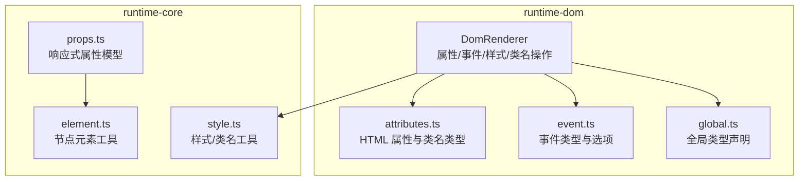
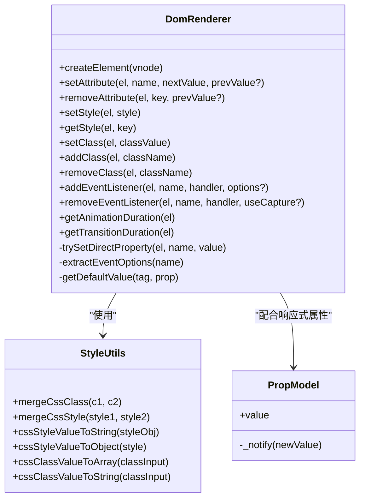
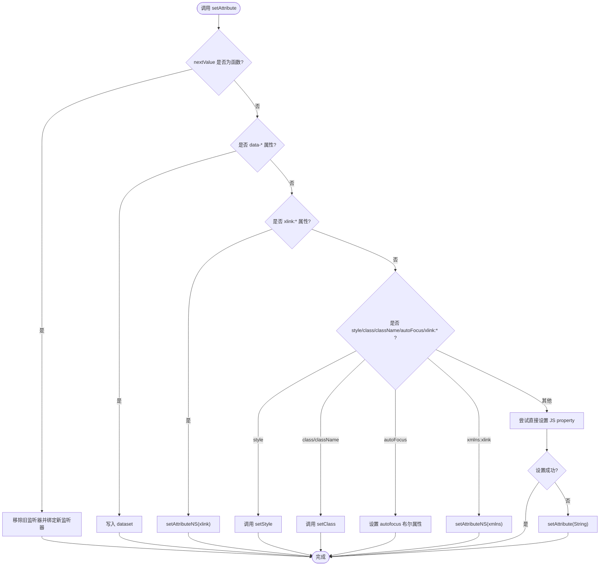
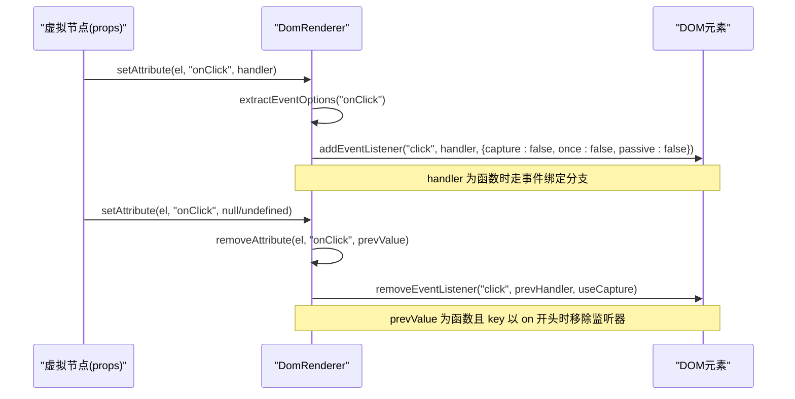
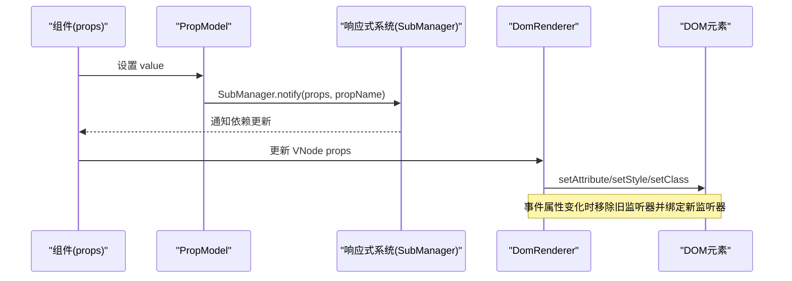
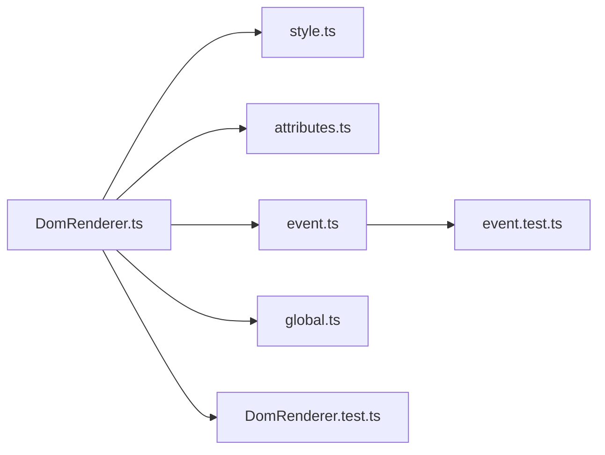

# 属性与事件处理

<cite>
**本文引用的文件**
- [DomRenderer.ts](file://packages/runtime-dom/src/client/DomRenderer.ts)
- [attributes.ts](file://packages/runtime-dom/src/types/attributes.ts)
- [event.ts](file://packages/runtime-dom/src/types/event.ts)
- [global.ts](file://packages/runtime-dom/src/types/global.ts)
- [style.ts](file://packages/runtime-core/src/utils/style.ts)
- [props.ts](file://packages/runtime-core/src/utils/props.ts)
- [element.ts](file://packages/runtime-core/src/utils/element.ts)
- [DomRenderer.test.ts](file://packages/runtime-dom/__tests__/client/DomRenderer.test.ts)
- [event.test.ts](file://packages/runtime-dom/__tests__/types/event.test.ts)
</cite>

## 目录
1. [简介](#简介)
2. [项目结构](#项目结构)
3. [核心组件](#核心组件)
4. [架构总览](#架构总览)
5. [详细组件分析](#详细组件分析)
6. [依赖分析](#依赖分析)
7. [性能考量](#性能考量)
8. [故障排查指南](#故障排查指南)
9. [结论](#结论)
10. [附录](#附录)

## 简介
本技术文档围绕 vitarx 框架的 DOM 渲染器属性与事件管理系统，系统性阐述以下主题：
- setAttr、removeAttr、setStyle、setClass 等属性操作方法的实现原理与差异
- 事件绑定机制，包括 capture、once、passive 等事件选项的解析与应用
- 事件代理与原生事件处理的差异与选择策略
- 对 HTML 标准属性、自定义属性、布尔属性的差异化处理
- 结合实际代码示例展示动态属性更新与事件监听器管理的最佳实践
- 内存泄漏防范措施与清理策略

## 项目结构
vitarx 的 DOM 属性与事件处理主要集中在 runtime-dom 的 DomRenderer 与类型系统中，同时配合 runtime-core 的样式与属性工具类，形成完整的属性/事件管线。

图表来源
- [DomRenderer.ts](file://packages/runtime-dom/src/client/DomRenderer.ts#L1-L120)
- [attributes.ts](file://packages/runtime-dom/src/types/attributes.ts#L1-L120)
- [event.ts](file://packages/runtime-dom/src/types/event.ts#L1-L120)
- [global.ts](file://packages/runtime-dom/src/types/global.ts#L1-L21)
- [style.ts](file://packages/runtime-core/src/utils/style.ts#L1-L60)
- [props.ts](file://packages/runtime-core/src/utils/props.ts#L1-L60)
- [element.ts](file://packages/runtime-core/src/utils/element.ts#L1-L33)

章节来源
- [DomRenderer.ts](file://packages/runtime-dom/src/client/DomRenderer.ts#L1-L120)
- [attributes.ts](file://packages/runtime-dom/src/types/attributes.ts#L1-L120)
- [event.ts](file://packages/runtime-dom/src/types/event.ts#L1-L120)
- [global.ts](file://packages/runtime-dom/src/types/global.ts#L1-L21)
- [style.ts](file://packages/runtime-core/src/utils/style.ts#L1-L60)
- [props.ts](file://packages/runtime-core/src/utils/props.ts#L1-L60)
- [element.ts](file://packages/runtime-core/src/utils/element.ts#L1-L33)

## 核心组件
- DomRenderer：浏览器端 DOM 渲染器，负责元素创建、属性设置、样式与类名管理、事件绑定与移除、动画/过渡时长计算等。
- StyleUtils：样式与类名的合并、转换与规范化工具，支撑 setStyle、setClass 等操作。
- 属性类型系统：attributes.ts 定义 HTML 标准属性、全局属性、自定义属性与事件类型，确保 JSX/TSX 层面的类型安全。
- 事件类型系统：event.ts 定义事件映射、修饰符（Capture/Once/Passive）与 HTMLEventOptions，保证事件选项的类型约束。
- 响应式属性模型：props.ts 提供 PropModel/usePropModel，实现组件 props 与响应式系统的双向绑定，便于动态属性更新。

章节来源
- [DomRenderer.ts](file://packages/runtime-dom/src/client/DomRenderer.ts#L180-L350)
- [style.ts](file://packages/runtime-core/src/utils/style.ts#L1-L173)
- [attributes.ts](file://packages/runtime-dom/src/types/attributes.ts#L380-L651)
- [event.ts](file://packages/runtime-dom/src/types/event.ts#L520-L562)
- [props.ts](file://packages/runtime-core/src/utils/props.ts#L76-L141)

## 架构总览
DomRenderer 作为 HostRenderer 的浏览器实现，承担以下职责：
- 元素创建与容器判定
- 属性设置与移除（含 data-*、xlink:*、style/class/className/autoFocus 等特例）
- 样式与类名的批量/增量更新
- 事件监听器的添加/移除与选项解析（capture/once/passive）
- 动画/过渡时长计算与帧调度

图表来源
- [DomRenderer.ts](file://packages/runtime-dom/src/client/DomRenderer.ts#L180-L573)
- [style.ts](file://packages/runtime-core/src/utils/style.ts#L1-L173)
- [props.ts](file://packages/runtime-core/src/utils/props.ts#L76-L141)

## 详细组件分析

### 属性操作：setAttr、removeAttr、setStyle、setClass
- setAttr/setAttribute
  - 支持普通属性、data-*、xlink:*、style/class/className/autoFocus 等特例
  - 优先尝试直接设置元素属性（JS property），失败回退到 setAttribute
  - 事件属性（onXxx）按函数值走事件绑定/移除分支
  - 移除属性时，class/style 特判移除，事件属性特判移除监听器，否则还原默认值或直接 removeAttribute
- setStyle
  - 使用 StyleUtils.cssStyleValueToString 合成 cssText，避免逐条 style.setProperty 带来的多次重排
  - 若无有效样式，移除 style 属性
- setClass/addClass/removeClass
  - 使用 StyleUtils.cssClassValueToString/ToArray 规范化 class 输入
  - setClass 会整体替换 class 属性，若为空则移除
  - addClass/removeClass 支持空格分隔或数组/对象形式，最终保持 classList 一致性

图表来源
- [DomRenderer.ts](file://packages/runtime-dom/src/client/DomRenderer.ts#L258-L317)
- [DomRenderer.ts](file://packages/runtime-dom/src/client/DomRenderer.ts#L418-L451)
- [style.ts](file://packages/runtime-core/src/utils/style.ts#L66-L110)

章节来源
- [DomRenderer.ts](file://packages/runtime-dom/src/client/DomRenderer.ts#L258-L350)
- [style.ts](file://packages/runtime-core/src/utils/style.ts#L66-L173)
- [DomRenderer.test.ts](file://packages/runtime-dom/__tests__/client/DomRenderer.test.ts#L216-L252)

### 事件绑定与选项：capture、once、passive
- 事件选项解析
  - extractEventOptions 从 onXxx 名称中解析 capture/once/passive 修饰符，剥离后得到事件名
  - addEventListener/removeEventListener 将解析出的选项与外部 options 合并，再调用 addEventListener/removeEventListener
- 事件绑定策略
  - 当属性值为函数时，视为事件处理器，先移除旧监听器，再绑定新监听器
  - 事件移除时，若 prevValue 为函数且 key 以 on 开头，走 removeEventListener 分支
- 选项语义
  - capture：在捕获阶段触发
  - once：仅触发一次后自动移除
  - passive：监听器不调用 preventDefault，有利于滚动性能

图表来源
- [DomRenderer.ts](file://packages/runtime-dom/src/client/DomRenderer.ts#L453-L501)
- [DomRenderer.ts](file://packages/runtime-dom/src/client/DomRenderer.ts#L319-L350)
- [event.test.ts](file://packages/runtime-dom/__tests__/types/event.test.ts#L196-L308)

章节来源
- [DomRenderer.ts](file://packages/runtime-dom/src/client/DomRenderer.ts#L453-L501)
- [event.ts](file://packages/runtime-dom/src/types/event.ts#L520-L562)
- [event.test.ts](file://packages/runtime-dom/__tests__/types/event.test.ts#L196-L308)

### 事件代理与原生事件处理
- 原生事件处理
  - DomRenderer 直接基于 addEventListener/removeEventListener 管理事件，适合细粒度、局部的交互
  - 优点：可控性强、开销低
  - 风险：大量节点时需注意监听器数量与内存占用
- 事件代理
  - 通过在父容器上统一监听事件，利用事件冒泡/捕获定位目标节点，减少监听器数量
  - 适用场景：列表渲染、动态增删节点、高频交互区域
  - 与 DomRenderer 的关系：DomRenderer 本身不强制代理，但可通过外层策略实现代理模式；事件选项（capture/once/passive）仍由 DomRenderer 解析并应用

最佳实践
- 高频交互采用事件代理，减少监听器数量
- 一次性事件使用 once，避免手动清理
- 滚动类事件优先 passive，提升滚动性能

[本节为概念性说明，不直接分析具体文件，故无章节来源]

### HTML 标准属性、自定义属性、布尔属性的差异化处理
- 标准属性
  - 优先尝试直接设置 JS property，失败回退 setAttribute
  - 通过 attributes.ts 的类型系统约束，确保 JSX/TSX 层面的合法性
- 自定义属性
  - data-*：写入 dataset
  - 自定义属性：setAttribute
- 布尔属性
  - 如 autofocus：设置为布尔值
  - 移除时还原默认值（通过 getDefaultValue 缓存）

章节来源
- [DomRenderer.ts](file://packages/runtime-dom/src/client/DomRenderer.ts#L258-L317)
- [DomRenderer.ts](file://packages/runtime-dom/src/client/DomRenderer.ts#L319-L350)
- [attributes.ts](file://packages/runtime-dom/src/types/attributes.ts#L1-L120)

### 动态属性更新与响应式联动
- 使用 PropModel/usePropModel
  - 将组件 props 与响应式系统绑定，属性变化时自动触发 SubManager.notify
  - setter 会同步更新原始 props，并触发 onUpdate:propName 事件回调
- 与 DomRenderer 的协作
  - 当 props 变化时，通过响应式系统触发视图更新，DomRenderer 重新 setAttribute/setStyle/setClass
  - 事件属性变化时，DomRenderer 自动移除旧监听器并绑定新监听器

图表来源
- [props.ts](file://packages/runtime-core/src/utils/props.ts#L76-L141)
- [DomRenderer.ts](file://packages/runtime-dom/src/client/DomRenderer.ts#L258-L317)

章节来源
- [props.ts](file://packages/runtime-core/src/utils/props.ts#L76-L141)
- [DomRenderer.ts](file://packages/runtime-dom/src/client/DomRenderer.ts#L258-L317)

### 内存泄漏防范
- 事件监听器清理
  - 移除属性时，若 prevValue 为函数且 key 以 on 开头，调用 removeEventListener 清理
  - 事件选项 capture 与 useCapture 保持一致，确保正确移除
- 属性默认值还原
  - 对于可直接设置 JS property 的属性，移除时尝试还原默认值，避免残留状态
- 空样式/空类名处理
  - setStyle/setClass 在无有效值时移除 style/class 属性，避免冗余 DOM 属性
- 响应式订阅清理
  - 响应式系统提供订阅者管理与清理，避免循环引用与悬挂回调

章节来源
- [DomRenderer.ts](file://packages/runtime-dom/src/client/DomRenderer.ts#L319-L350)
- [DomRenderer.ts](file://packages/runtime-dom/src/client/DomRenderer.ts#L453-L501)
- [style.ts](file://packages/runtime-core/src/utils/style.ts#L1-L60)

## 依赖分析
- DomRenderer 依赖
  - runtime-core 的 StyleUtils：样式/类名转换与合并
  - runtime-dom 的 attributes.ts/event.ts/global.ts：类型约束与事件选项
  - 测试用例验证属性设置、data-*、xlink:*、v-html 等行为

图表来源
- [DomRenderer.ts](file://packages/runtime-dom/src/client/DomRenderer.ts#L1-L120)
- [style.ts](file://packages/runtime-core/src/utils/style.ts#L1-L60)
- [attributes.ts](file://packages/runtime-dom/src/types/attributes.ts#L1-L120)
- [event.ts](file://packages/runtime-dom/src/types/event.ts#L1-L120)
- [global.ts](file://packages/runtime-dom/src/types/global.ts#L1-L21)
- [DomRenderer.test.ts](file://packages/runtime-dom/__tests__/client/DomRenderer.test.ts#L216-L252)
- [event.test.ts](file://packages/runtime-dom/__tests__/types/event.test.ts#L196-L308)

章节来源
- [DomRenderer.ts](file://packages/runtime-dom/src/client/DomRenderer.ts#L1-L120)
- [style.ts](file://packages/runtime-core/src/utils/style.ts#L1-L60)
- [attributes.ts](file://packages/runtime-dom/src/types/attributes.ts#L1-L120)
- [event.ts](file://packages/runtime-dom/src/types/event.ts#L1-L120)
- [global.ts](file://packages/runtime-dom/src/types/global.ts#L1-L21)
- [DomRenderer.test.ts](file://packages/runtime-dom/__tests__/client/DomRenderer.test.ts#L216-L252)
- [event.test.ts](file://packages/runtime-dom/__tests__/types/event.test.ts#L196-L308)

## 性能考量
- 样式与类名
  - 使用 cssStyleValueToString 合成 cssText，减少多次 setProperty 带来的重排
  - setStyle 在无有效样式时移除 style 属性，避免冗余 DOM 属性
- 事件选项
  - passive 选项避免 preventDefault，提升滚动性能
  - once 选项减少监听器数量与后续清理成本
- 属性设置
  - 优先直接设置 JS property，失败回退 setAttribute，减少 DOM API 调用
- 动画/过渡时长
  - getAnimationDuration/getTransitionDuration 通过计算样式计算总时长，避免额外状态管理

[本节提供一般性指导，不直接分析具体文件，故无章节来源]

## 故障排查指南
- 属性未生效
  - 检查是否为事件属性（onXxx），若是函数值才会绑定监听器
  - 检查是否 data-* 或 xlink:*，需走 dataset 或命名空间属性设置
  - 检查是否 style/class/className/autoFocus 等特例
- 事件未触发或重复触发
  - 确认事件选项（capture/once/passive）是否正确
  - 确认属性更新时是否正确移除旧监听器并绑定新监听器
- 样式/类名异常
  - 检查输入格式（字符串/数组/对象），确保经 StyleUtils 规范化
  - 确认无有效样式/类名时是否移除了 style/class 属性
- 内存泄漏
  - 确保移除属性时调用了 removeEventListener
  - 确保响应式订阅被正确清理

章节来源
- [DomRenderer.ts](file://packages/runtime-dom/src/client/DomRenderer.ts#L258-L350)
- [DomRenderer.ts](file://packages/runtime-dom/src/client/DomRenderer.ts#L453-L501)
- [style.ts](file://packages/runtime-core/src/utils/style.ts#L1-L173)

## 结论
vitarx 的 DOM 渲染器在属性与事件处理方面提供了高内聚、低耦合的能力：
- 通过特例化处理与类型系统保障属性设置的正确性与安全性
- 事件选项解析与原生 API 的结合，既满足性能需求又保持易用性
- 与响应式系统的协同，使得动态属性更新与事件监听器管理更加稳健
- 通过清理策略与默认值还原，有效降低内存泄漏风险

[本节为总结性内容，不直接分析具体文件，故无章节来源]

## 附录
- 最佳实践清单
  - 优先使用 once 处理一次性事件
  - 滚动类事件使用 passive
  - 列表/高频交互采用事件代理
  - 使用 StyleUtils 规范化样式/类名输入
  - 在移除属性时确保清理事件监听器与冗余 DOM 属性

[本节为概念性说明，不直接分析具体文件，故无章节来源]