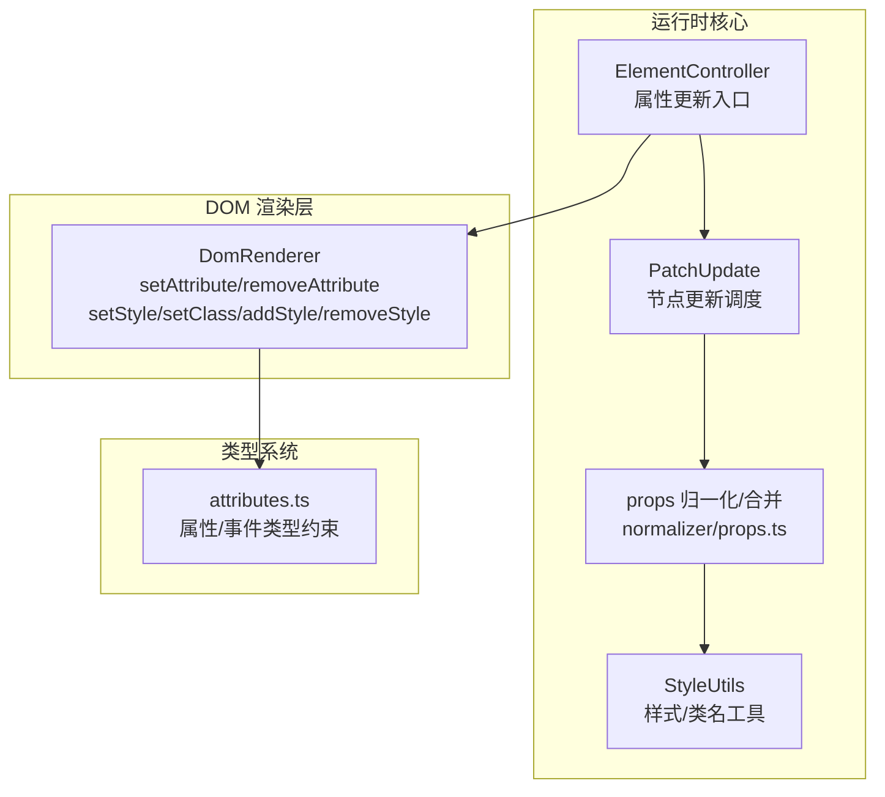
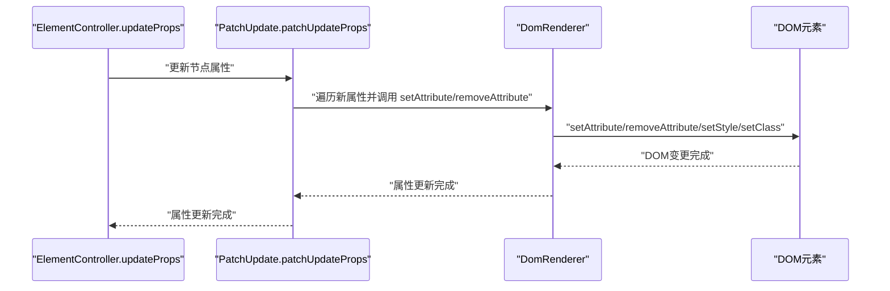
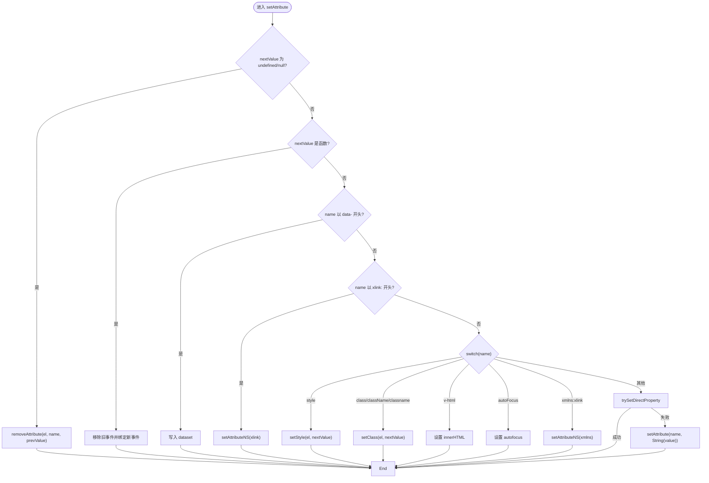
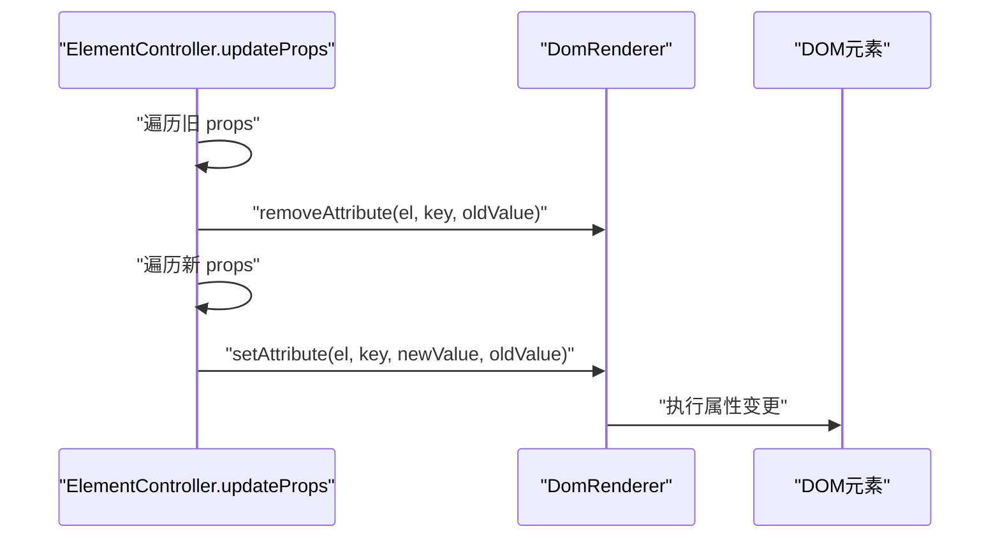
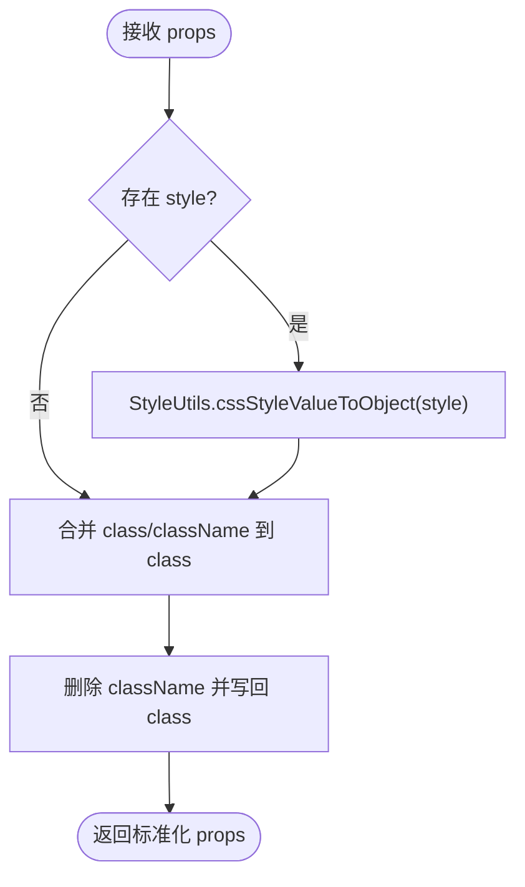
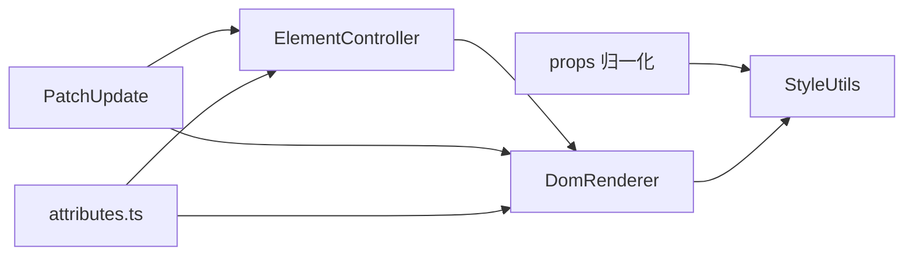

# 属性管理

<cite>
**本文引用的文件**
- [DomRenderer.ts](file://packages/runtime-dom/src/client/DomRenderer.ts)
- [attributes.ts](file://packages/runtime-dom/src/types/attributes.ts)
- [props.ts](file://packages/runtime-core/src/vnode/normalizer/props.ts)
- [style.ts](file://packages/runtime-core/src/utils/style.ts)
- [ElementController.ts](file://packages/runtime-core/src/controllers/ElementController.ts)
- [update.ts](file://packages/runtime-core/src/vnode/core/update.ts)
- [DomRenderer.test.ts](file://packages/runtime-dom/__tests__/client/DomRenderer.test.ts)
</cite>

## 目录
1. [简介](#简介)
2. [项目结构](#项目结构)
3. [核心组件](#核心组件)
4. [架构总览](#架构总览)
5. [详细组件分析](#详细组件分析)
6. [依赖分析](#依赖分析)
7. [性能考量](#性能考量)
8. [故障排查指南](#故障排查指南)
9. [结论](#结论)
10. [附录](#附录)

## 简介
本文件围绕 vitarx 框架的 DOM 渲染器属性管理系统，系统性梳理 setAttr、removeAttr、setStyle、setClass 等核心方法的实现机制、调用时机与性能优化策略。重点说明对 HTML 标准属性（如 id、class、style）、布尔属性（如 checked、disabled）、自定义 data 属性的差异化处理逻辑，并结合测试用例与类型定义，给出动态属性绑定、类名控制与内联样式更新的最佳实践，同时分析属性批量更新时的合并策略与异常处理机制。

## 项目结构
vitarx 的属性管理横跨运行时核心与 DOM 渲染层：
- DOM 渲染层负责具体 DOM 操作与差异处理（如 setAttribute/removeAttribute/setStyle/setClass/addStyle/removeStyle 等）
- 运行时核心负责属性标准化、合并策略与更新调度（如 props 归一化、class/style 合并、节点更新流程）
- 类型系统提供属性与事件的强类型约束，确保开发期与运行期一致性

图表来源
- [ElementController.ts](file://packages/runtime-core/src/controllers/ElementController.ts#L46-L104)
- [update.ts](file://packages/runtime-core/src/vnode/core/update.ts#L118-L120)
- [props.ts](file://packages/runtime-core/src/vnode/normalizer/props.ts#L1-L146)
- [style.ts](file://packages/runtime-core/src/utils/style.ts#L1-L173)
- [DomRenderer.ts](file://packages/runtime-dom/src/client/DomRenderer.ts#L257-L350)
- [attributes.ts](file://packages/runtime-dom/src/types/attributes.ts#L1-L651)

章节来源
- [ElementController.ts](file://packages/runtime-core/src/controllers/ElementController.ts#L46-L104)
- [update.ts](file://packages/runtime-core/src/vnode/core/update.ts#L118-L120)
- [props.ts](file://packages/runtime-core/src/vnode/normalizer/props.ts#L1-L146)
- [style.ts](file://packages/runtime-core/src/utils/style.ts#L1-L173)
- [DomRenderer.ts](file://packages/runtime-dom/src/client/DomRenderer.ts#L257-L350)
- [attributes.ts](file://packages/runtime-dom/src/types/attributes.ts#L1-L651)

## 核心组件
- DomRenderer：提供 setAttribute/removeAttribute、setStyle/setClass、addStyle/removeStyle 等 DOM 属性与样式的底层操作，并内置事件绑定/解绑、SVG 命名空间处理、data-* dataset 适配、布尔属性与特殊属性分支处理、默认值还原等能力。
- ElementController：在节点更新时，按新旧属性对比，逐个调用 DomRenderer 的 setAttribute/removeAttribute，实现增量更新。
- PatchUpdate：负责节点级别的 diff 与更新调度，最终调用 updateNodeProps，驱动 ElementController 的属性更新。
- StyleUtils：提供 class/style 的合并、转换（字符串↔对象）与归一化，支撑属性批量更新时的合并策略。
- 属性类型系统：attributes.ts 定义了大量标准属性、事件属性与自定义属性的类型约束，保证属性名与值的合法性。

章节来源
- [DomRenderer.ts](file://packages/runtime-dom/src/client/DomRenderer.ts#L257-L350)
- [ElementController.ts](file://packages/runtime-core/src/controllers/ElementController.ts#L46-L104)
- [update.ts](file://packages/runtime-core/src/vnode/core/update.ts#L118-L120)
- [style.ts](file://packages/runtime-core/src/utils/style.ts#L1-L173)
- [attributes.ts](file://packages/runtime-dom/src/types/attributes.ts#L1-L651)

## 架构总览
属性更新的端到端流程如下：

图表来源
- [ElementController.ts](file://packages/runtime-core/src/controllers/ElementController.ts#L46-L104)
- [update.ts](file://packages/runtime-core/src/vnode/core/update.ts#L118-L120)
- [DomRenderer.ts](file://packages/runtime-dom/src/client/DomRenderer.ts#L257-L350)

## 详细组件分析

### DomRenderer 属性操作详解
- setAttribute
  - 分支处理：
    - 函数值：事件绑定/替换，先移除旧事件，再绑定新事件
    - data-*：写入 dataset
    - xlink:*：使用命名空间 setAttributeNS
    - style/class/className/classname/v-html/autoFocus/xmlns:xlink：走专用分支
    - 直接属性：优先尝试直接设置元素属性（trySetDirectProperty），失败回退 setAttribute
  - 异常处理：try/catch 包裹，错误时记录日志
- removeAttribute
  - class/style 特判移除
  - 事件属性特判移除（prevValue 为函数且 key 以 on 开头）
  - JS 属性还原：若 key 在元素上存在，尝试还原默认值；只读属性抛异常则回退 removeAttribute
  - 普通属性：直接 removeAttribute
- setStyle/setClass/addStyle/removeStyle
  - setStyle：使用 StyleUtils 将样式对象转为 cssText，仅在变化时更新；无有效样式时移除 style 属性
  - setClass：使用 StyleUtils 将 class/className/classname 的多种输入归一化为字符串，仅在变化时更新；空类名时移除 class 属性
  - addStyle/removeStyle：逐条设置/移除，最后在无有效样式时移除 style 属性
- 事件选项解析：extractEventOptions 支持 capture/once/passive 修饰符，自动拆分事件名与选项
- 默认值还原：getDefaultValue 通过缓存记录各标签的属性默认值，用于 removeAttribute 时还原

图表来源
- [DomRenderer.ts](file://packages/runtime-dom/src/client/DomRenderer.ts#L257-L350)

章节来源
- [DomRenderer.ts](file://packages/runtime-dom/src/client/DomRenderer.ts#L257-L350)

### ElementController 属性更新流程
- 对比新旧 props，删除不存在于新 props 的属性（调用 removeAttribute）
- 新增或更新存在于新 props 的属性（调用 setAttribute），并缓存新值
- 该流程确保最小化 DOM 操作，避免不必要的属性变更

图表来源
- [ElementController.ts](file://packages/runtime-core/src/controllers/ElementController.ts#L46-L104)
- [DomRenderer.ts](file://packages/runtime-dom/src/client/DomRenderer.ts#L319-L350)

章节来源
- [ElementController.ts](file://packages/runtime-core/src/controllers/ElementController.ts#L46-L104)

### 属性批量更新与合并策略
- props 归一化与合并：
  - normalizer/props.ts 定义了 SPECIAL_MERGERS，针对 style/class/className/classname 使用 StyleUtils 的合并函数，避免简单覆盖导致丢失旧属性
  - 对于 v-bind 绑定，支持数组形式 [sourceObj, excludeKeys]，并跳过框架固有属性与 undefined 值
  - 对于 style 属性，统一转换为对象格式；对 class/className 进行归一化与合并，最终统一使用 class
- StyleUtils：
  - mergeCssStyle：将两个样式对象合并，后者覆盖前者
  - mergeCssClass：将多个 class 输入（字符串/数组/对象）合并并去重
  - cssStyleValueToString/cssStyleValueToObject：在字符串与对象间互转
  - cssClassValueToString/cssClassValueToArray：在字符串与数组/对象间互转

图表来源
- [props.ts](file://packages/runtime-core/src/vnode/normalizer/props.ts#L97-L123)
- [style.ts](file://packages/runtime-core/src/utils/style.ts#L1-L173)

章节来源
- [props.ts](file://packages/runtime-core/src/vnode/normalizer/props.ts#L1-L146)
- [style.ts](file://packages/runtime-core/src/utils/style.ts#L1-L173)

### 调用时机与虚拟DOM更新
- PatchUpdate.patchUpdateProps：在节点类型与 key 相同的情况下，调用 updateNodeProps，进而驱动 ElementController.updateProps
- ElementController.updateProps：在渲染层对属性进行逐个 setAttribute/removeAttribute，确保最小变更
- DomRenderer.setAttributes：在元素创建时批量设置初始属性

章节来源
- [update.ts](file://packages/runtime-core/src/vnode/core/update.ts#L118-L120)
- [ElementController.ts](file://packages/runtime-core/src/controllers/ElementController.ts#L46-L104)
- [DomRenderer.ts](file://packages/runtime-dom/src/client/DomRenderer.ts#L423-L429)

### 类型系统与属性约束
- attributes.ts 定义了大量标准 HTML 属性与事件属性，涵盖 id、class、style、checked、disabled、autofocus 等，以及 data-*、xlink:*、xmlns:xlink 等扩展属性
- 通过类型约束，确保属性名与值在编译期即得到校验，减少运行期错误

章节来源
- [attributes.ts](file://packages/runtime-dom/src/types/attributes.ts#L1-L651)

## 依赖分析
- ElementController 依赖 DomRenderer 进行属性操作
- PatchUpdate 依赖 ElementController 的属性更新入口
- props 归一化依赖 StyleUtils 进行 class/style 合并与转换
- DomRenderer 依赖 StyleUtils 进行样式/类名的字符串化与比较
- attributes.ts 为属性与事件提供类型约束

图表来源
- [ElementController.ts](file://packages/runtime-core/src/controllers/ElementController.ts#L46-L104)
- [update.ts](file://packages/runtime-core/src/vnode/core/update.ts#L118-L120)
- [props.ts](file://packages/runtime-core/src/vnode/normalizer/props.ts#L1-L146)
- [style.ts](file://packages/runtime-core/src/utils/style.ts#L1-L173)
- [DomRenderer.ts](file://packages/runtime-dom/src/client/DomRenderer.ts#L257-L350)
- [attributes.ts](file://packages/runtime-dom/src/types/attributes.ts#L1-L651)

章节来源
- [ElementController.ts](file://packages/runtime-core/src/controllers/ElementController.ts#L46-L104)
- [update.ts](file://packages/runtime-core/src/vnode/core/update.ts#L118-L120)
- [props.ts](file://packages/runtime-core/src/vnode/normalizer/props.ts#L1-L146)
- [style.ts](file://packages/runtime-core/src/utils/style.ts#L1-L173)
- [DomRenderer.ts](file://packages/runtime-dom/src/client/DomRenderer.ts#L257-L350)
- [attributes.ts](file://packages/runtime-dom/src/types/attributes.ts#L1-L651)

## 性能考量
- 最小化 DOM 变更
  - setStyle/setClass 在变更前后比较，仅在值变化时更新，避免不必要的重排/重绘
  - removeStyle 在无有效样式时移除 style 属性，减少冗余
- 事件绑定/解绑
  - 事件值相同时跳过，避免重复绑定/解绑
  - 事件替换时先移除旧事件再绑定新事件，确保内存与性能稳定
- 属性还原与回退
  - removeAttribute 优先尝试还原默认值，失败回退 removeAttribute，避免只读属性异常导致的性能问题
- 合并策略
  - class/style 合并避免覆盖，减少属性数量与 DOM 操作次数
- 事件修饰符
  - 通过 extractEventOptions 解析 capture/once/passive，减少额外封装成本

章节来源
- [DomRenderer.ts](file://packages/runtime-dom/src/client/DomRenderer.ts#L243-L350)
- [props.ts](file://packages/runtime-core/src/vnode/normalizer/props.ts#L1-L146)

## 故障排查指南
- 事件绑定无效
  - 确认事件名大小写与修饰符拼写（onClick、onClickCapture、onClickOnce、onScrollPassive）
  - 若替换事件处理器，确保 prevValue 与新值不同，避免跳过绑定
- data-* 属性未生效
  - 确认属性名以 data- 开头，值为字符串或可转为字符串
- xlink/xmlns 命名空间属性
  - SVG 场景下使用 xlink:* 或 xmlns:xlink，确保命名空间正确
- 只读属性异常
  - 如 innerHTML 等只读属性，DomRenderer 会捕获异常并记录日志，避免中断流程
- 无父节点错误
  - insertBefore/replace 需要锚点元素有父节点，否则抛出明确错误

章节来源
- [DomRenderer.test.ts](file://packages/runtime-dom/__tests__/client/DomRenderer.test.ts#L216-L312)
- [DomRenderer.test.ts](file://packages/runtime-dom/__tests__/client/DomRenderer.test.ts#L380-L443)
- [DomRenderer.ts](file://packages/runtime-dom/src/client/DomRenderer.ts#L132-L168)
- [DomRenderer.ts](file://packages/runtime-dom/src/client/DomRenderer.ts#L319-L350)

## 结论
vitarx 的属性管理系统通过“运行时核心 + DOM 渲染层”的分层设计，实现了：
- 对 HTML 标准属性、布尔属性、data-*、xlink/xmlns 等的差异化处理
- 基于比较与合并的最小化 DOM 更新策略
- 事件修饰符与命名空间的完善支持
- 类型约束与归一化，提升开发体验与运行稳定性
在实际工程中，建议遵循：
- 使用 v-bind 与 props 归一化，配合 class/style 合并策略
- 动态属性绑定时注意事件处理器替换与只读属性的兼容
- 在 SVG 场景下正确使用命名空间属性
- 通过测试覆盖关键路径，确保异常与边界场景的稳定性

## 附录
- 最佳实践清单
  - 动态属性绑定：使用 v-bind，避免直接覆盖已有属性；对 class/style 使用对象/数组形式，交由归一化与合并策略处理
  - 类名控制：优先使用数组/对象形式，避免手动拼接字符串；在 removeAttribute 时确保 prevValue 正确传递
  - 内联样式：优先使用对象形式，由 StyleUtils 转换为 cssText；避免频繁切换字符串与对象
  - 事件处理：使用 onClick/Capture/Once/Passive 修饰符；替换处理器时提供 prevValue
  - SVG：使用 xlink:* 或 xmlns:xlink；确保命名空间正确
  - 异常处理：关注只读属性与无父节点场景，必要时在上层进行保护