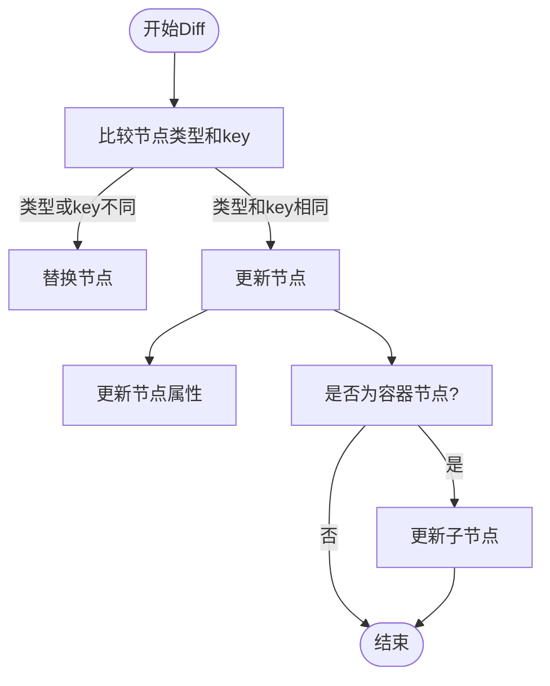
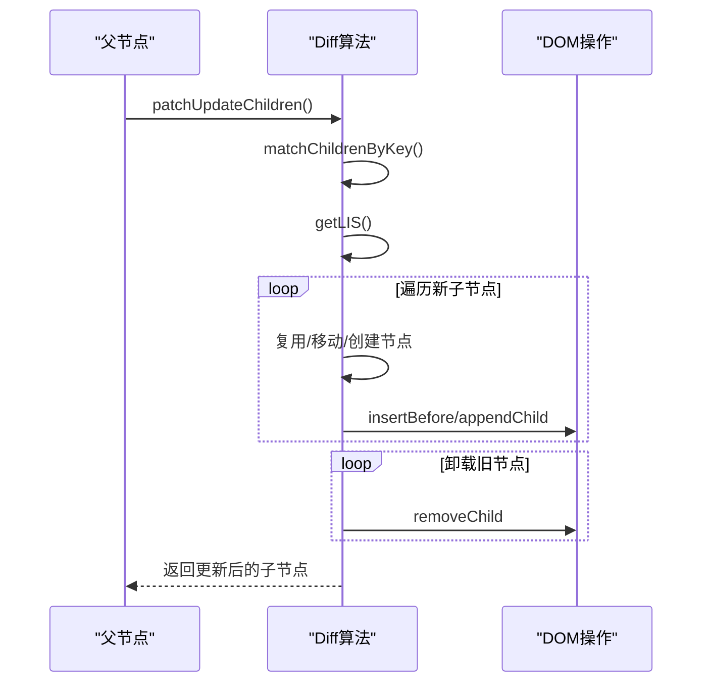
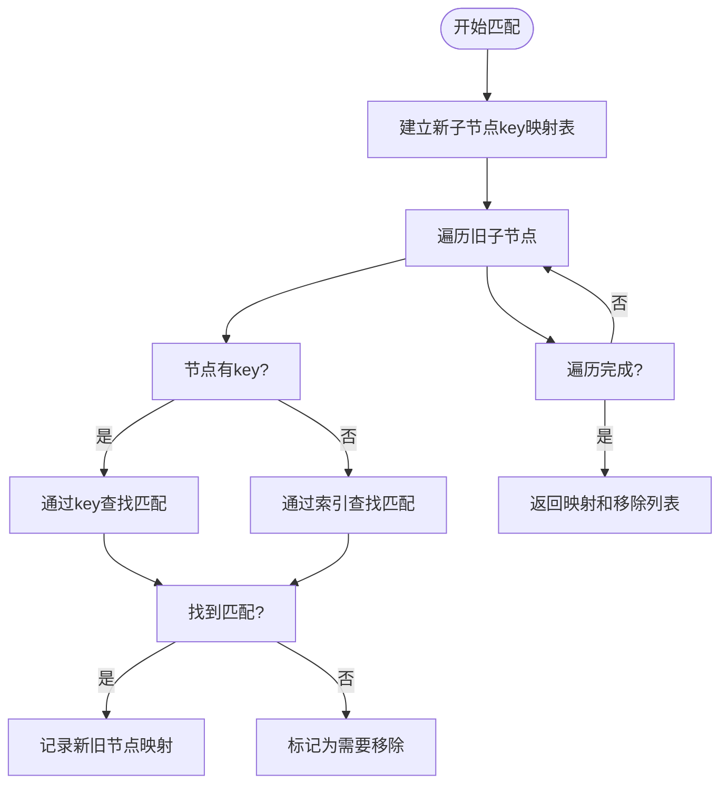
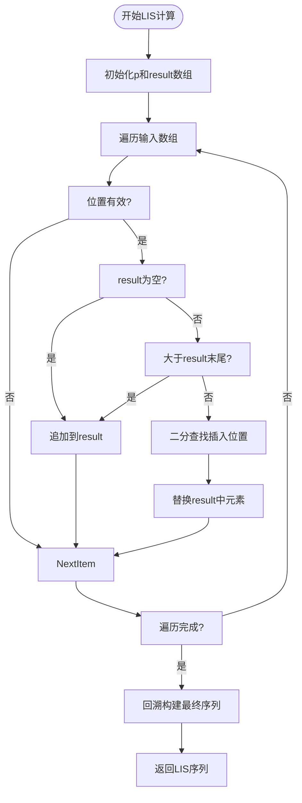
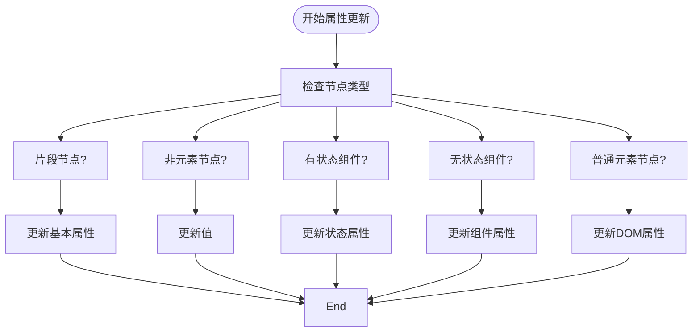
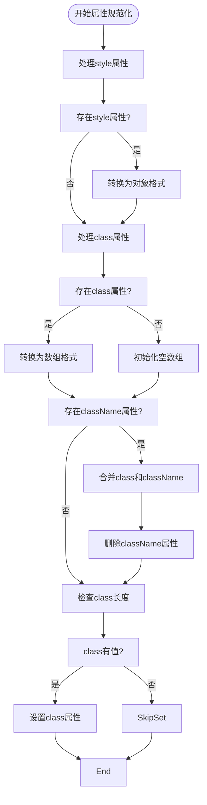
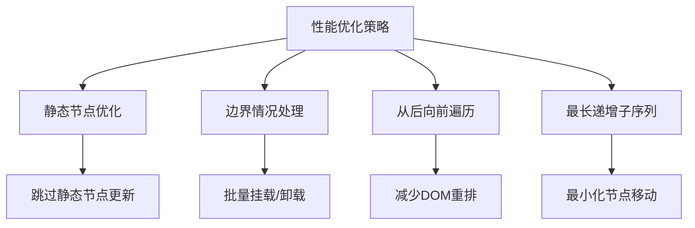
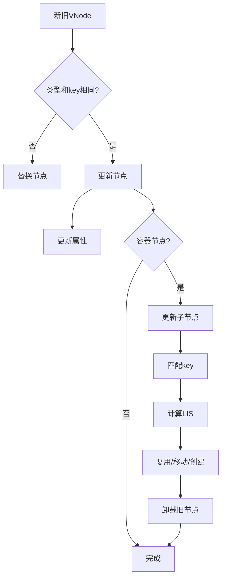

# Diff算法与更新机制

<cite>
**本文档引用的文件**  
- [update.ts](file://packages/runtime-core/src/vnode/core/update.ts)
- [props.ts](file://packages/runtime-core/src/vnode/normalizer/props.ts)
- [element.ts](file://packages/runtime-core/src/vnode/creator/element.ts)
- [ElementController.ts](file://packages/runtime-core/src/controllers/ElementController.ts)
- [vnode.ts](file://packages/runtime-core/src/types/vnode.ts)
- [driver.ts](file://packages/runtime-core/src/vnode/core/driver.ts)
- [ContainerController.ts](file://packages/runtime-core/src/controllers/ContainerController.ts)
</cite>

## 目录
1. [简介](#简介)
2. [核心Diff算法](#核心diff算法)
3. [子节点更新机制](#子节点更新机制)
4. [属性更新与规范化](#属性更新与规范化)
5. [性能优化策略](#性能优化策略)
6. [架构流程图](#架构流程图)

## 简介
vitarx框架采用高效的Diff算法和虚拟节点更新机制来最小化DOM操作，提升渲染性能。本架构文档详细解析了`patch`和`patchUpdateChildren`方法的实现原理，重点阐述子节点更新算法、属性更新的规范化处理流程以及性能优化策略。

## 核心Diff算法

vitarx框架的Diff算法通过`PatchUpdate`类实现，核心方法是`patch`和`patchUpdateNode`。该算法首先比较新旧虚拟节点的类型和key，决定是更新还是替换节点。

当节点类型和key相同时，执行节点更新；否则进行节点替换。对于容器节点，会递归更新其子节点。

**Diagram sources**
- [update.ts](file://packages/runtime-core/src/vnode/core/update.ts#L53-L63)

**Section sources**
- [update.ts](file://packages/runtime-core/src/vnode/core/update.ts#L42-L64)

## 子节点更新机制

### patchUpdateChildren方法

`patchUpdateChildren`方法实现了高效的子节点更新算法，通过key匹配和最长递增子序列（LIS）优化，最小化DOM操作。

处理流程包括：
1. 处理边界情况：旧子节点为空或新子节点为空
2. 通过key匹配新旧子节点
3. 计算最长递增子序列，确定需要移动的节点
4. 从后向前遍历新子节点，复用、移动或创建节点
5. 卸载不再需要的旧节点

**Diagram sources**
- [update.ts](file://packages/runtime-core/src/vnode/core/update.ts#L170-L248)

**Section sources**
- [update.ts](file://packages/runtime-core/src/vnode/core/update.ts#L170-L248)

### key匹配算法

`matchChildrenByKey`方法通过建立新子节点的key映射表，遍历旧子节点尝试在新子节点中找到匹配。

匹配策略：
1. 首先建立新子节点的key映射表
2. 遍历旧子节点，尝试在新子节点中找到匹配
3. 对于有key的节点，通过key匹配
4. 对于没有key的节点，通过索引匹配
5. 未匹配的旧节点将被标记为需要移除

**Diagram sources**
- [update.ts](file://packages/runtime-core/src/vnode/core/update.ts#L267-L314)

**Section sources**
- [update.ts](file://packages/runtime-core/src/vnode/core/update.ts#L267-L314)

### 最长递增子序列(LIS)算法

`getLIS`方法使用优化的O(n log n)算法计算数组的最长递增子序列，用于确定哪些节点不需要移动。

算法步骤：
1. 遍历数组，构建递增序列
2. 使用二分查找确定插入位置
3. 记录前驱节点关系
4. 回溯构建最终序列

**Diagram sources**
- [update.ts](file://packages/runtime-core/src/vnode/core/update.ts#L332-L376)

**Section sources**
- [update.ts](file://packages/runtime-core/src/vnode/core/update.ts#L332-L376)

## 属性更新与规范化

### 属性更新流程

属性更新通过`patchUpdateProps`方法实现，根据节点类型的不同采用不同的更新策略：

**Diagram sources**
- [update.ts](file://packages/runtime-core/src/vnode/core/update.ts#L118-L120)

**Section sources**
- [update.ts](file://packages/runtime-core/src/vnode/core/update.ts#L118-L120)

### 属性规范化处理

属性规范化通过`normalizerStyleAndClassProp`方法实现，主要功能包括：

1. **样式属性标准化**：将各种形式的样式值（字符串、对象、数组）转换为标准对象格式
2. **类名属性合并**：合并class和className属性，统一使用class
3. **特殊属性处理**：对style和class等特殊属性进行智能合并而不是简单覆盖

**Diagram sources**
- [props.ts](file://packages/runtime-core/src/vnode/normalizer/props.ts#L97-L123)

**Section sources**
- [props.ts](file://packages/runtime-core/src/vnode/normalizer/props.ts#L97-L123)

## 性能优化策略

vitarx框架通过多种策略优化Diff算法的性能：

### 静态节点优化
静态节点在更新时会直接跳过，避免不必要的比较和更新操作。

### 边界情况处理
对于旧子节点为空或新子节点为空的边界情况，直接进行批量挂载或卸载，避免复杂的Diff计算。

### 从后向前遍历
从后向前遍历新子节点，可以更高效地处理节点移动操作，减少DOM重排。

### 最长递增子序列优化
通过计算最长递增子序列，确定哪些节点不需要移动，从而最小化DOM操作。

**Diagram sources**
- [update.ts](file://packages/runtime-core/src/vnode/core/update.ts#L84-L85)
- [update.ts](file://packages/runtime-core/src/vnode/core/update.ts#L186-L201)

**Section sources**
- [update.ts](file://packages/runtime-core/src/vnode/core/update.ts#L84-L201)

## 架构流程图

**Diagram sources**
- [update.ts](file://packages/runtime-core/src/vnode/core/update.ts#L53-L63)
- [update.ts](file://packages/runtime-core/src/vnode/core/update.ts#L170-L248)