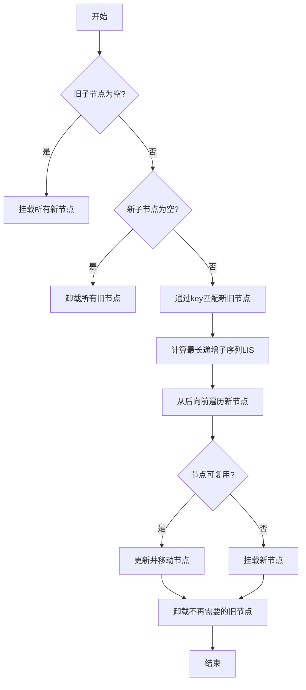
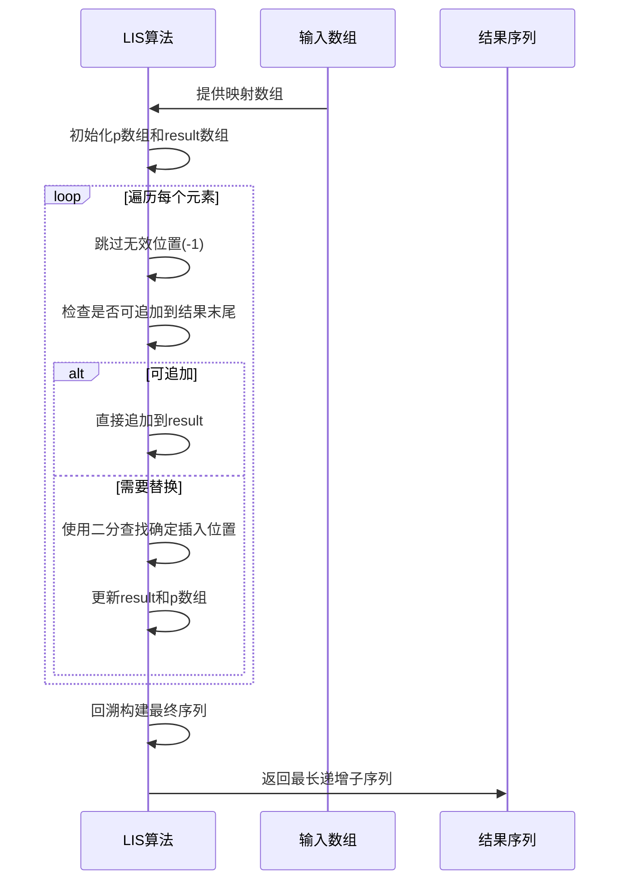

# 子节点Diff算法

<cite>
**本文档引用文件**  
- [update.ts](file://packages/runtime-core/src/vnode/core/update.ts)
- [children.ts](file://packages/runtime-core/src/vnode/normalizer/children.ts)
- [driver.ts](file://packages/runtime-core/src/vnode/core/driver.ts)
- [DomRenderer.ts](file://packages/runtime-dom/src/client/DomRenderer.ts)
</cite>

## 目录
1. [简介](#简介)
2. [核心处理流程](#核心处理流程)
3. [基于Key的节点匹配机制](#基于key的节点匹配机制)
4. [最长递增子序列(LIS)算法](#最长递增子序列lis算法)
5. [节点更新与移动策略](#节点更新与移动策略)
6. [边界情况处理](#边界情况处理)
7. [性能优化建议](#性能优化建议)
8. [总结](#总结)

## 简介
vitarx框架的子节点Diff算法是其核心更新机制的重要组成部分，主要用于高效地对比和更新容器节点的子节点列表。该算法通过智能的节点匹配、复用和移动策略，最大限度地减少DOM操作，提升渲染性能。算法的核心实现位于`patchUpdateChildren`函数中，采用了一套完整的处理流程来应对各种更新场景。

**Section sources**
- [update.ts](file://packages/runtime-core/src/vnode/core/update.ts#L170-L248)

## 核心处理流程
子节点Diff算法的处理流程遵循一个清晰的步骤序列，确保在各种情况下都能正确高效地更新节点。整个流程从边界情况处理开始，逐步深入到复杂的节点匹配和移动优化。



**Diagram sources**
- [update.ts](file://packages/runtime-core/src/vnode/core/update.ts#L186-L247)

## 基于Key的节点匹配机制
算法首先通过`matchChildrenByKey`函数建立新旧子节点之间的映射关系，这是实现节点高效复用的关键步骤。匹配机制根据节点是否具有key属性采用不同的策略。

### 有Key节点匹配
对于带有key属性的节点，算法通过哈希表进行快速匹配。首先遍历新子节点数组，建立以key为键的映射表，然后遍历旧子节点，在映射表中查找对应的匹配项。只有当key相同且节点类型相同时，才会被认为是匹配的节点。

### 无Key节点匹配
对于没有key属性的节点，算法采用索引匹配策略。在相同索引位置上，如果新旧节点类型相同且都没有key属性，则认为是匹配的节点。这种策略简单直接，但在列表发生插入或删除时可能导致不必要的节点重建。

```mermaid
classDiagram
class PatchUpdate {
+patchUpdateChildren(currentNode, nextVNode, hooks)
-matchChildrenByKey(oldChildren, newChildren)
-getLIS(arr)
}
class NodeMatcher {
+newKeyedMap : Map<any, {vnode : VNode, index : number}>
+newIndexToOldIndexMap : number[]
+removedNodesSet : VNode[]
+match(oldChildren, newChildren)
}
PatchUpdate --> NodeMatcher : "使用"
```

**Diagram sources**
- [update.ts](file://packages/runtime-core/src/vnode/core/update.ts#L267-L314)

**Section sources**
- [update.ts](file://packages/runtime-core/src/vnode/core/update.ts#L267-L314)

## 最长递增子序列(LIS)算法
最长递增子序列算法是vitarx框架优化节点移动的核心技术，用于确定哪些节点不需要移动，从而最小化DOM重排操作。该算法实现了O(n log n)的时间复杂度，具有很高的效率。

### 算法原理
LIS算法通过动态规划和二分查找的结合，找出新旧节点映射关系中最长的递增子序列。这个子序列代表了不需要移动的节点，因为它们在新旧列表中的相对顺序保持不变。

### 实现细节
算法使用两个辅助数组：`p`数组记录每个位置的前驱节点索引，`result`数组记录当前递增序列的末尾索引。通过遍历映射数组，利用二分查找确定插入位置，并记录前驱关系，最后回溯构建最终的最长递增子序列。



**Diagram sources**
- [update.ts](file://packages/runtime-core/src/vnode/core/update.ts#L332-L377)

**Section sources**
- [update.ts](file://packages/runtime-core/src/vnode/core/update.ts#L332-L377)

## 节点更新与移动策略
在完成节点匹配和LIS计算后，算法从后向前遍历新子节点数组，执行具体的更新操作。这种从后向前的遍历顺序确保了插入操作的正确性。

### 节点复用
当找到匹配的旧节点时，算法会复用该节点并更新其属性。通过`patchUpdateNode`函数执行具体的节点更新逻辑，保持节点的状态和事件监听器。

### 节点移动
对于需要移动的节点，算法通过检查其索引是否在LIS中来决定是否需要移动。如果不在LIS中，则使用`insertBefore`或`appendChild`将其移动到正确位置。这种策略确保只有真正需要移动的节点才会执行DOM操作。

### 新节点挂载
对于没有找到匹配的旧节点，算法会将其作为新节点挂载到DOM中。挂载位置由下一个节点的元素决定，如果存在则插入到其前面，否则追加到父容器末尾。

**Section sources**
- [update.ts](file://packages/runtime-core/src/vnode/core/update.ts#L210-L245)
- [driver.ts](file://packages/runtime-core/src/vnode/core/driver.ts#L57-L64)
- [DomRenderer.ts](file://packages/runtime-dom/src/client/DomRenderer.ts#L164-L175)

## 边界情况处理
算法对各种边界情况进行了专门的处理，确保在极端情况下也能正确工作。

### 空子节点处理
当旧子节点数组为空时，算法直接挂载所有新子节点；当新子节点数组为空时，算法直接卸载所有旧子节点。这两种情况避免了不必要的匹配和计算过程。

### 单节点优化
对于只有一个子节点的情况，算法可以跳过复杂的匹配过程，直接进行简单的比较和更新，进一步提升性能。

**Section sources**
- [update.ts](file://packages/runtime-core/src/vnode/core/update.ts#L186-L201)

## 性能优化建议
为了充分发挥vitarx框架子节点Diff算法的性能优势，开发者应遵循以下最佳实践。

### 合理使用Key属性
在列表渲染时，为每个节点提供稳定的、唯一的key属性。这能显著提高节点匹配的准确性，减少不必要的节点重建和移动操作。

### 避免频繁的列表重排
尽量减少对列表的插入、删除和重新排序操作。如果必须进行这些操作，考虑使用批量更新或虚拟滚动等技术来降低性能影响。

### 保持节点类型稳定
在更新过程中保持节点类型的一致性。类型变化会触发节点替换而非更新，导致更高的性能开销。

## 总结
vitarx框架的子节点Diff算法通过精心设计的匹配策略和移动优化，实现了高效的节点更新。算法结合了基于key的精确匹配、最长递增子序列的移动优化以及从后向前的更新顺序，确保在各种场景下都能以最小的DOM操作完成更新任务。理解这一算法的实现机制，有助于开发者编写更高效的代码，充分发挥框架的性能优势。