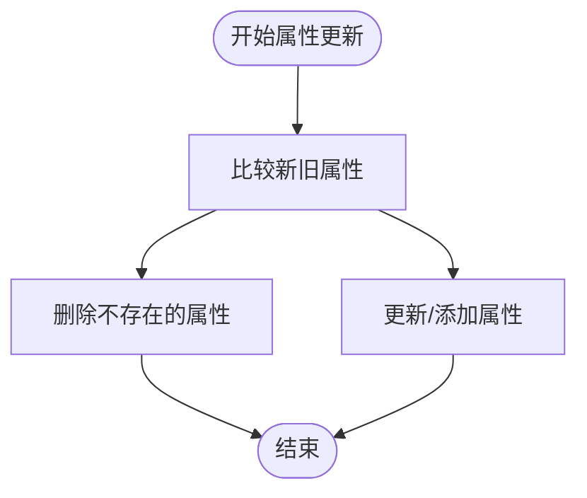
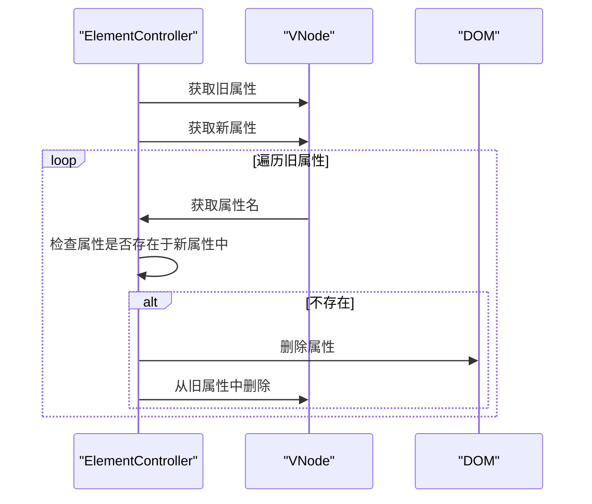
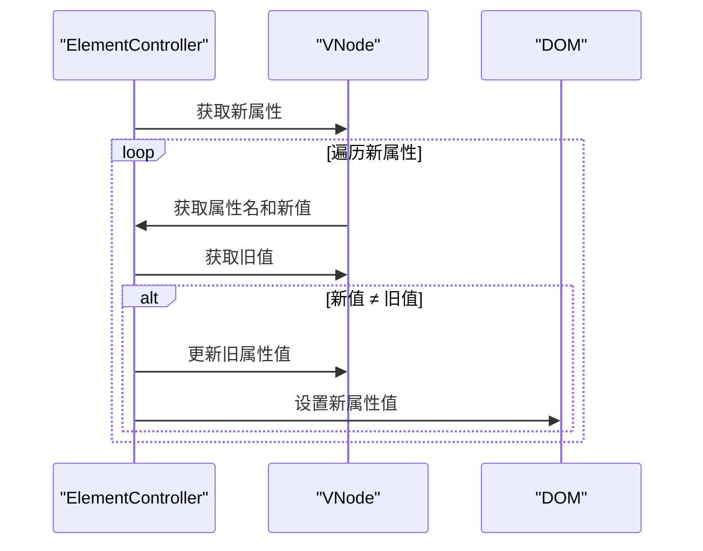
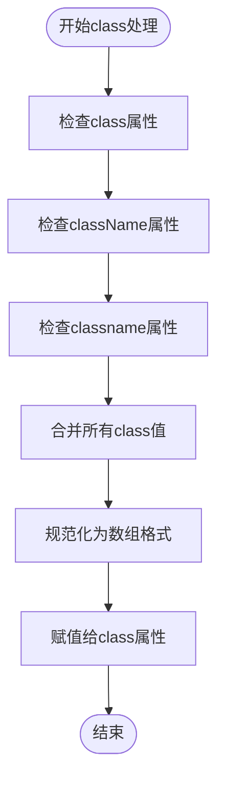
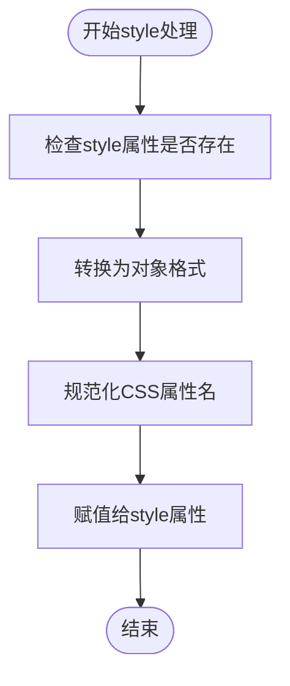
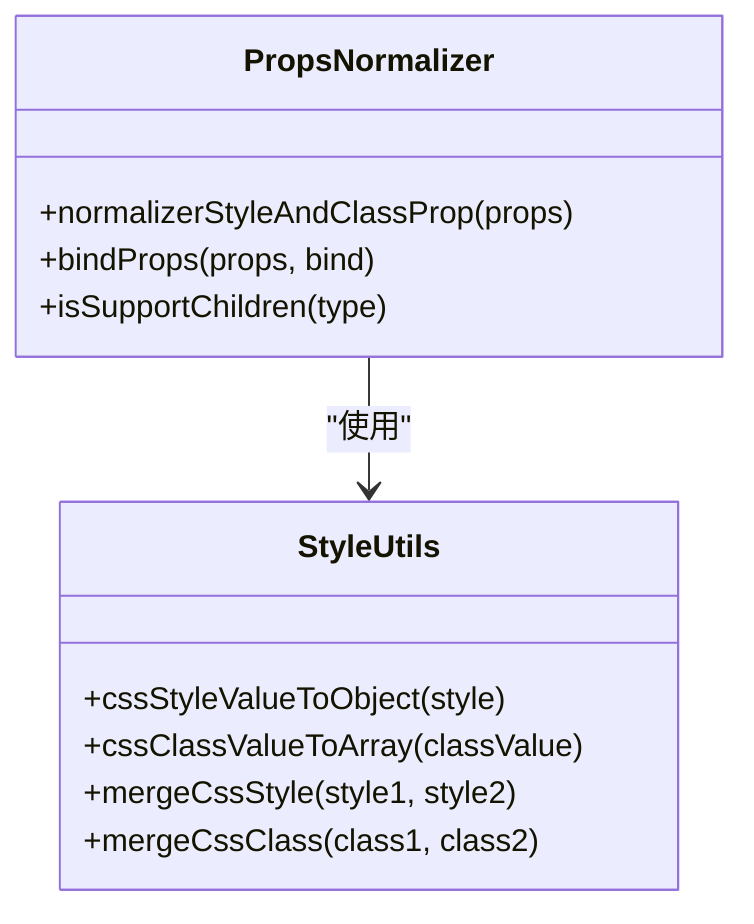
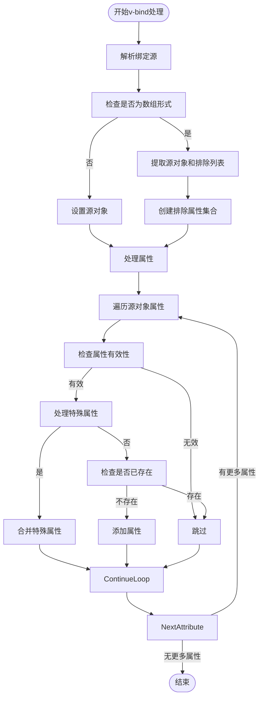
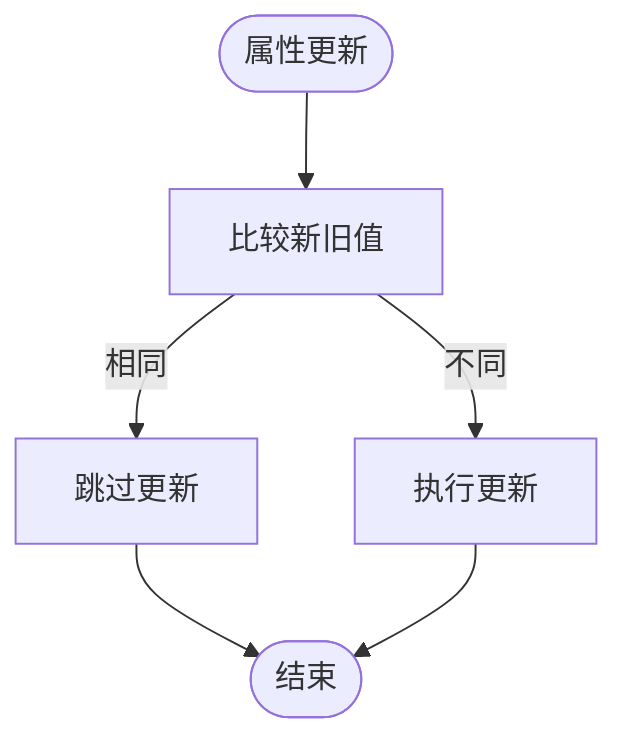
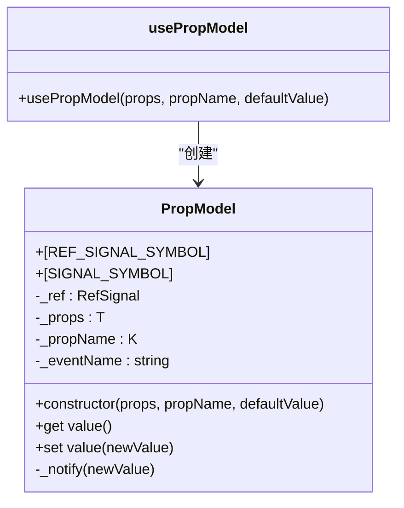

# 属性更新与规范化

<cite>
**本文档引用的文件**
- [props.ts](file://packages/runtime-core/src/utils/props.ts)
- [props.test.ts](file://packages/runtime-core/__tests__/vnode/normalizer/props.test.ts)
- [props.ts](file://packages/runtime-core/src/vnode/normalizer/props.ts)
- [ElementController.ts](file://packages/runtime-core/src/controllers/ElementController.ts)
- [BaseNode.ts](file://packages/runtime-core/src/types/nodes/BaseNode.ts)
- [test-widget.ts](file://packages/runtime-core/__tests__/helpers/test-widget.ts)
</cite>

## 目录
1. [属性更新与规范化](#属性更新与规范化)
2. [属性更新流程](#属性更新流程)
3. [属性变更分类处理](#属性变更分类处理)
4. [特殊属性规范化](#特殊属性规范化)
5. [Props规范化器](#props规范化器)
6. [最佳实践](#最佳实践)

## 属性更新流程

vitarx框架的属性更新机制始于虚拟节点（VNode）的创建和更新。当组件的属性发生变化时，框架会触发更新流程，通过比较新旧属性来决定如何更新DOM。

属性更新的核心流程如下：
1. 当组件属性发生变化时，调用`updateProps`函数
2. 框架会获取当前虚拟节点的旧属性和新属性
3. 遍历旧属性，删除在新属性中不存在的属性
4. 遍历新属性，更新或添加属性到DOM元素



**Diagram sources**
- [ElementController.ts](file://packages/runtime-core/src/controllers/ElementController.ts#L50-L70)

**Section sources**
- [ElementController.ts](file://packages/runtime-core/src/controllers/ElementController.ts#L50-L70)
- [test-widget.ts](file://packages/runtime-core/__tests__/helpers/test-widget.ts#L125-L129)

## 属性变更分类处理

vitarx框架将属性变更分为三类：新增、修改和删除。每种变更类型都有相应的处理策略。

### 删除属性
当属性从旧属性对象中存在但在新属性对象中不存在时，框架会删除该属性。这通过遍历旧属性并检查其是否存在于新属性中来实现。



**Diagram sources**
- [ElementController.ts](file://packages/runtime-core/src/controllers/ElementController.ts#L55-L60)

### 更新和新增属性
对于存在于新属性中的属性，框架会检查其值是否发生变化。如果值发生变化，则更新DOM元素的属性。



**Diagram sources**
- [ElementController.ts](file://packages/runtime-core/src/controllers/ElementController.ts#L63-L69)

**Section sources**
- [ElementController.ts](file://packages/runtime-core/src/controllers/ElementController.ts#L50-L70)

## 特殊属性规范化

vitarx框架对特殊属性（如class、style等）进行了特殊的规范化处理，以确保这些属性能够正确地应用到DOM元素上。

### Class属性处理
框架支持多种class属性的表示形式，包括`class`、`className`和`classname`。这些属性会被合并并统一为`class`属性。



**Diagram sources**
- [props.ts](file://packages/runtime-core/src/vnode/normalizer/props.ts#L107-L121)

### Style属性处理
style属性可以以字符串、对象或数组的形式提供。框架会将这些不同形式的style值转换为统一的对象格式。



**Diagram sources**
- [props.ts](file://packages/runtime-core/src/vnode/normalizer/props.ts#L98-L104)

**Section sources**
- [props.ts](file://packages/runtime-core/src/vnode/normalizer/props.ts#L86-L122)

## Props规范化器

vitarx框架提供了一个强大的Props规范化器，用于处理属性的标准化和特殊属性转换。

### 核心功能
Props规范化器的主要功能包括：
1. 解包所有属性中的ref/reactive值
2. 将style属性标准化为对象格式
3. 合并class和className属性，统一使用class



**Diagram sources**
- [props.ts](file://packages/runtime-core/src/vnode/normalizer/props.ts)
- [props.test.ts](file://packages/runtime-core/__tests__/vnode/normalizer/props.test.ts)

### v-bind属性绑定
框架支持v-bind属性绑定，允许将一个对象的属性批量绑定到元素上。



**Diagram sources**
- [props.ts](file://packages/runtime-core/src/vnode/normalizer/props.ts#L37-L83)

**Section sources**
- [props.ts](file://packages/runtime-core/src/vnode/normalizer/props.ts#L37-L83)
- [props.test.ts](file://packages/runtime-core/__tests__/vnode/normalizer/props.test.ts)

## 最佳实践

为了确保属性更新的性能和正确性，建议遵循以下最佳实践：

### 避免不必要的属性更新
只有在属性值真正发生变化时才进行更新，避免不必要的DOM操作。



### 使用ref进行双向绑定
对于需要双向绑定的属性，使用`usePropModel`或`useModel`函数创建响应式引用。



**Diagram sources**
- [props.ts](file://packages/runtime-core/src/utils/props.ts#L76-L190)

### 合理使用v-bind
当需要批量绑定属性时，使用v-bind可以提高代码的可读性和维护性。

```typescript
// 推荐的做法
const commonProps = { class: 'button', disabled: false }
return <button v-bind="commonProps" onClick={handleClick}>Click me</button>

// 避免的做法
return <button class="button" disabled={false} onClick={handleClick}>Click me</button>
```

**Section sources**
- [props.ts](file://packages/runtime-core/src/vnode/normalizer/props.ts#L37-L83)
- [props.ts](file://packages/runtime-core/src/utils/props.ts#L76-L190)