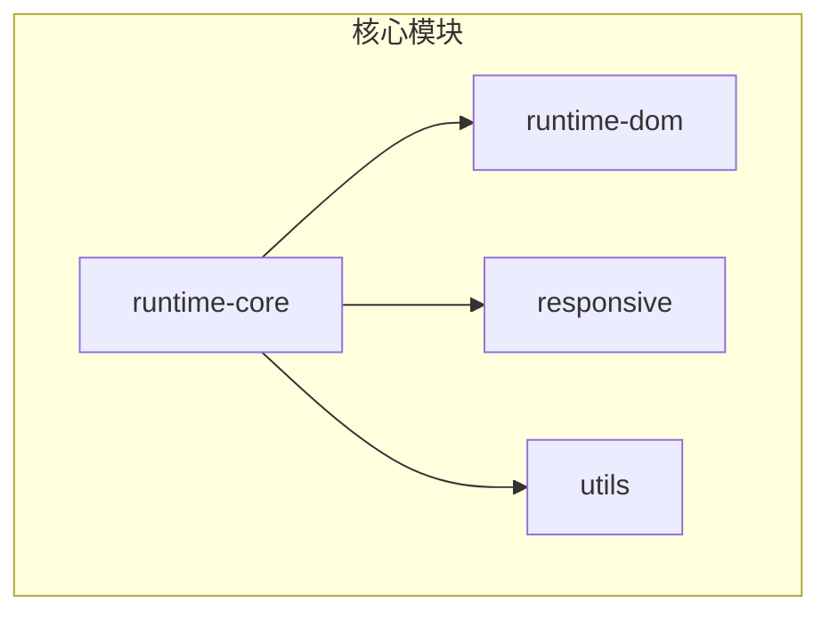
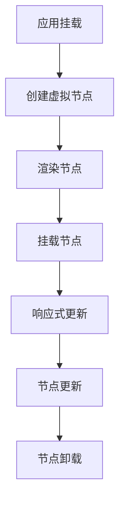
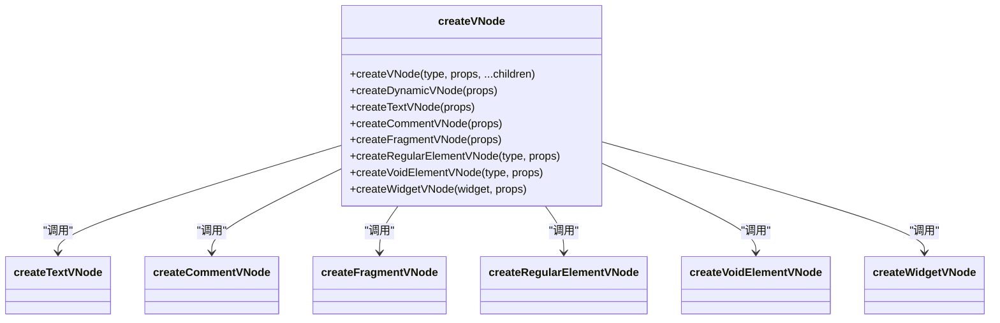
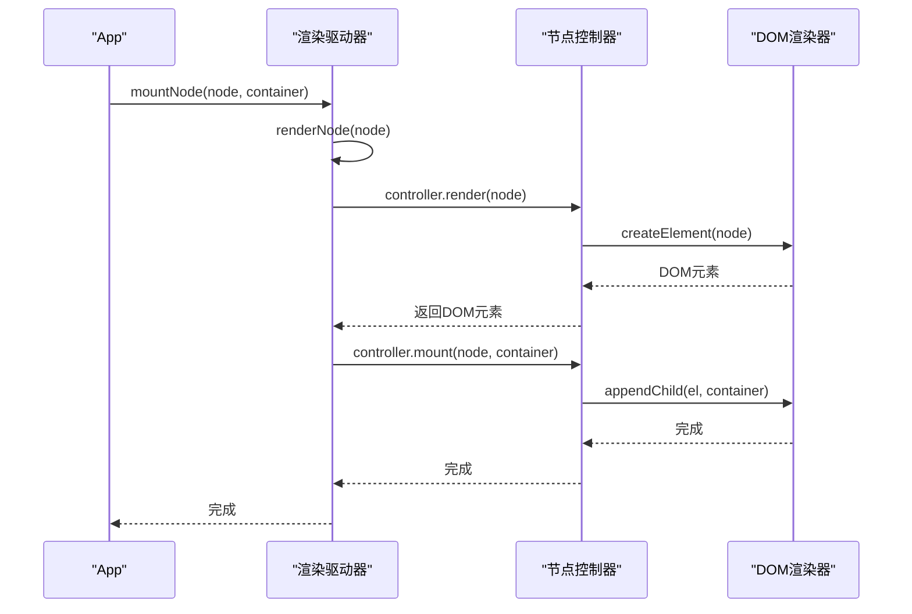
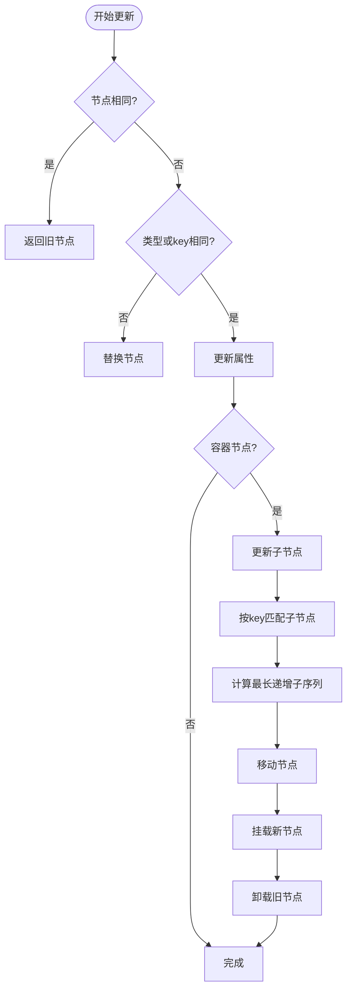
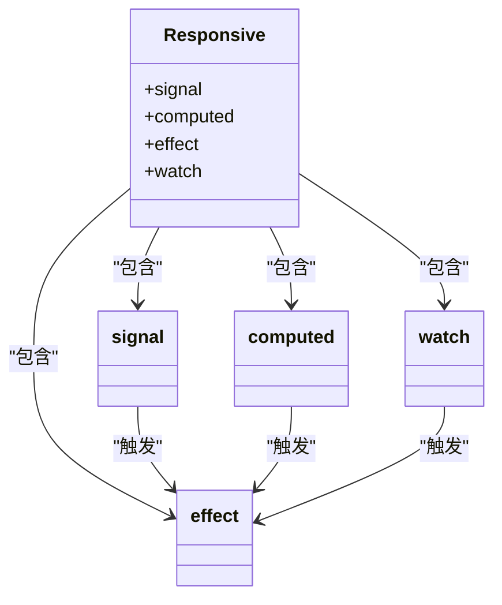
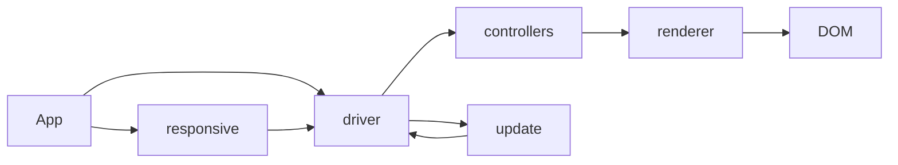

# 完整渲染流程

<cite>
**本文档引用的文件**  
- [create.ts](file://packages/runtime-core/src/vnode/core/create.ts)
- [driver.ts](file://packages/runtime-core/src/vnode/core/driver.ts)
- [update.ts](file://packages/runtime-core/src/vnode/core/update.ts)
- [App.ts](file://packages/runtime-core/src/app/App.ts)
- [DomRenderer.ts](file://packages/runtime-dom/src/client/DomRenderer.ts)
- [createVNode.ts](file://packages/runtime-core/src/vnode/creator/base.ts)
- [ElementController.ts](file://packages/runtime-core/src/controllers/ElementController.ts)
- [RegularElementController.ts](file://packages/runtime-core/src/controllers/RegularElementController.ts)
- [widget.ts](file://packages/runtime-core/src/vnode/creator/widget.ts)
- [nodeKind.ts](file://packages/runtime-core/src/constants/nodeKind.ts)
- [responsive/index.ts](file://packages/responsive/src/index.ts)
</cite>

## 目录
1. [项目结构](#项目结构)
2. [核心组件](#核心组件)
3. [架构概述](#架构概述)
4. [详细组件分析](#详细组件分析)
5. [依赖分析](#依赖分析)
6. [性能考虑](#性能考虑)
7. [故障排除指南](#故障排除指南)
8. [结论](#结论)

## 项目结构

vitarx框架采用模块化设计，主要分为以下几个核心包：

- **runtime-core**: 核心运行时，包含虚拟DOM、渲染器、组件系统等核心功能
- **runtime-dom**: DOM平台适配层，实现浏览器环境下的DOM操作
- **responsive**: 响应式系统，提供信号、计算属性、副作用等响应式能力
- **utils**: 工具函数库，提供各种实用工具

这种分层架构使得框架具有良好的可扩展性和可维护性，同时保持了核心功能的轻量化。

**图表来源**  
- [package.json](file://packages/runtime-core/package.json)
- [package.json](file://packages/runtime-dom/package.json)
- [package.json](file://packages/responsive/package.json)

## 核心组件

vitarx框架的渲染流程由多个核心组件协同工作完成。主要组件包括：

- **虚拟节点创建系统**：负责创建虚拟DOM节点
- **渲染驱动器**：管理节点的渲染、挂载、更新和卸载
- **节点控制器**：处理不同类型节点的具体操作
- **响应式系统**：提供数据响应能力，触发重新渲染

这些组件通过清晰的接口和职责划分，共同实现了高效的DOM更新机制。

**章节来源**  
- [create.ts](file://packages/runtime-core/src/vnode/core/create.ts)
- [driver.ts](file://packages/runtime-core/src/vnode/core/driver.ts)
- [ElementController.ts](file://packages/runtime-core/src/controllers/ElementController.ts)

## 架构概述

vitarx框架的渲染架构采用分层设计，从虚拟DOM到真实DOM的转换过程清晰明确。整个流程可以分为以下几个阶段：

1. **虚拟节点创建**：通过`createVNode`函数创建虚拟节点
2. **节点渲染**：将虚拟节点转换为DOM元素
3. **节点挂载**：将渲染后的DOM元素插入到文档中
4. **节点更新**：当数据变化时，对比新旧虚拟节点并更新DOM
5. **节点卸载**：从DOM中移除节点并清理资源

**图表来源**  
- [App.ts](file://packages/runtime-core/src/app/App.ts)
- [driver.ts](file://packages/runtime-core/src/vnode/core/driver.ts)
- [update.ts](file://packages/runtime-core/src/vnode/core/update.ts)

## 详细组件分析

### 虚拟节点创建分析

虚拟节点创建是渲染流程的第一步，通过`createVNode`函数实现。该函数根据节点类型创建相应的虚拟节点实例。

**图表来源**  
- [create.ts](file://packages/runtime-core/src/vnode/core/create.ts)
- [widget.ts](file://packages/runtime-core/src/vnode/creator/widget.ts)

**章节来源**  
- [create.ts](file://packages/runtime-core/src/vnode/core/create.ts)
- [widget.ts](file://packages/runtime-core/src/vnode/creator/widget.ts)

### 节点渲染与挂载分析

节点渲染和挂载由渲染驱动器管理，通过`renderNode`和`mountNode`函数实现。不同类型的节点由相应的控制器处理。

**图表来源**  
- [driver.ts](file://packages/runtime-core/src/vnode/core/driver.ts)
- [ElementController.ts](file://packages/runtime-core/src/controllers/ElementController.ts)
- [DomRenderer.ts](file://packages/runtime-dom/src/client/DomRenderer.ts)

**章节来源**  
- [driver.ts](file://packages/runtime-core/src/vnode/core/driver.ts)
- [ElementController.ts](file://packages/runtime-core/src/controllers/ElementController.ts)

### 节点更新分析

节点更新是vitarx框架的核心功能之一，通过`patchUpdate`函数实现。更新过程采用高效的diff算法，最小化DOM操作。

**图表来源**  
- [update.ts](file://packages/runtime-core/src/vnode/core/update.ts)
- [driver.ts](file://packages/runtime-core/src/vnode/core/driver.ts)

**章节来源**  
- [update.ts](file://packages/runtime-core/src/vnode/core/update.ts)

### 响应式系统分析

响应式系统是vitarx框架的基石，负责在数据变化时触发重新渲染。系统通过信号、副作用和依赖追踪实现响应式更新。

**图表来源**  
- [responsive/index.ts](file://packages/responsive/src/index.ts)
- [update.ts](file://packages/runtime-core/src/vnode/core/update.ts)

**章节来源**  
- [responsive/index.ts](file://packages/responsive/src/index.ts)

## 依赖分析

vitarx框架的组件之间存在清晰的依赖关系。核心依赖关系如下：

**图表来源**  
- [App.ts](file://packages/runtime-core/src/app/App.ts)
- [driver.ts](file://packages/runtime-core/src/vnode/core/driver.ts)
- [DomRenderer.ts](file://packages/runtime-dom/src/client/DomRenderer.ts)

**章节来源**  
- [App.ts](file://packages/runtime-core/src/app/App.ts)
- [driver.ts](file://packages/runtime-core/src/vnode/core/driver.ts)

## 性能考虑

vitarx框架在设计时充分考虑了性能优化，主要体现在以下几个方面：

1. **高效的diff算法**：采用最长递增子序列(LIS)优化，最小化节点移动操作
2. **静态节点优化**：标记静态节点，跳过不必要的更新检查
3. **批量更新**：合并多个状态更新，减少渲染次数
4. **懒加载**：支持组件的懒加载，减少初始加载时间

这些优化策略共同确保了框架在处理复杂UI时仍能保持流畅的性能表现。

## 故障排除指南

在使用vitarx框架时，可能会遇到一些常见问题。以下是常见问题及其解决方案：

1. **节点未正确更新**：检查响应式数据是否正确创建，确保使用signal或ref包装可变数据
2. **性能问题**：检查是否存在不必要的重新渲染，使用静态节点标记优化
3. **事件绑定问题**：确保事件处理器函数在组件生命周期内保持稳定引用
4. **内存泄漏**：确保在组件卸载时清理副作用和事件监听器

**章节来源**  
- [update.ts](file://packages/runtime-core/src/vnode/core/update.ts)
- [driver.ts](file://packages/runtime-core/src/vnode/core/driver.ts)

## 结论

vitarx框架通过精心设计的架构和高效的算法，实现了从虚拟DOM到真实DOM的完整渲染流程。框架的核心优势在于：

- **清晰的架构分层**：各组件职责明确，易于理解和维护
- **高效的更新机制**：采用先进的diff算法，确保最小化的DOM操作
- **强大的响应式系统**：无缝集成响应式数据流，自动触发UI更新
- **灵活的扩展性**：模块化设计支持自定义渲染器和插件系统

这些特性使得vitarx成为一个高性能、易用且可扩展的前端框架，适用于各种规模的应用开发。