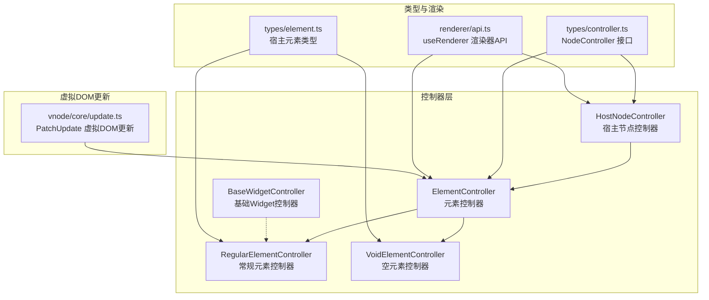
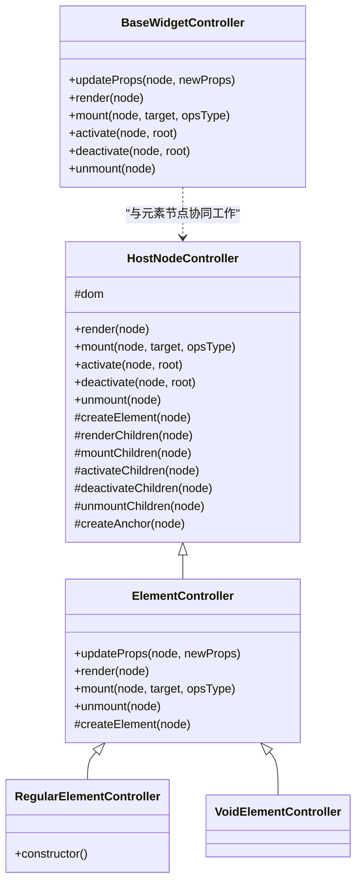
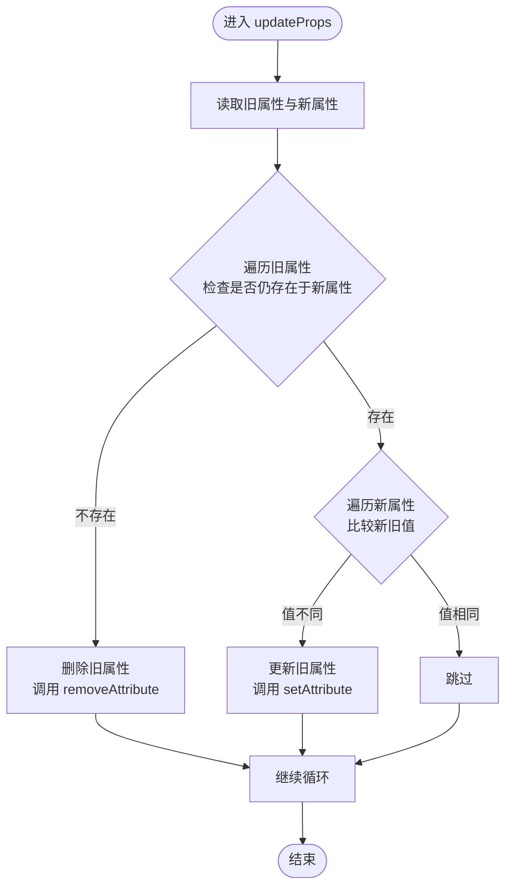
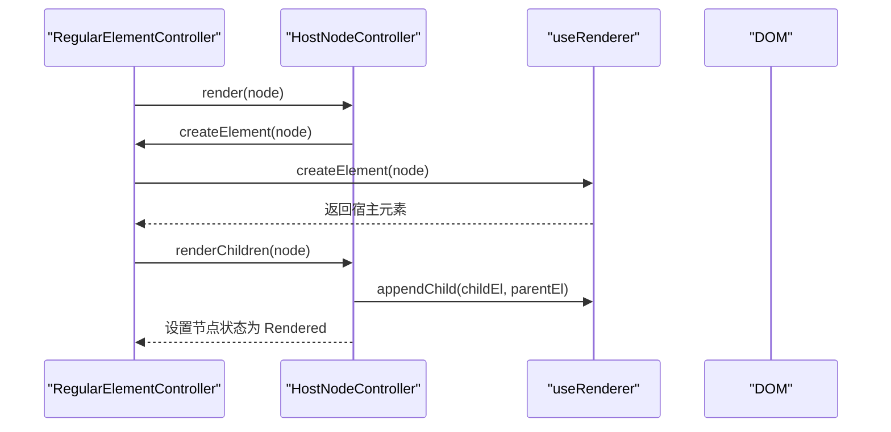
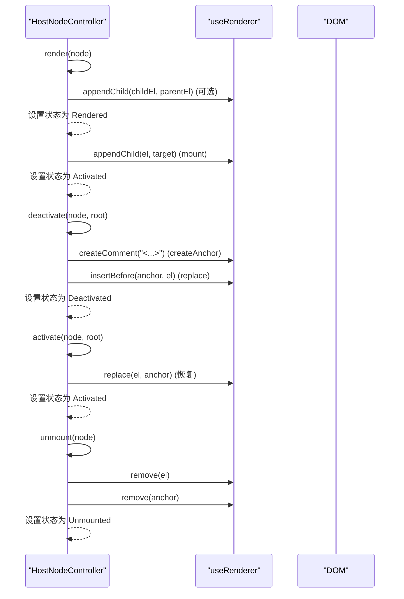
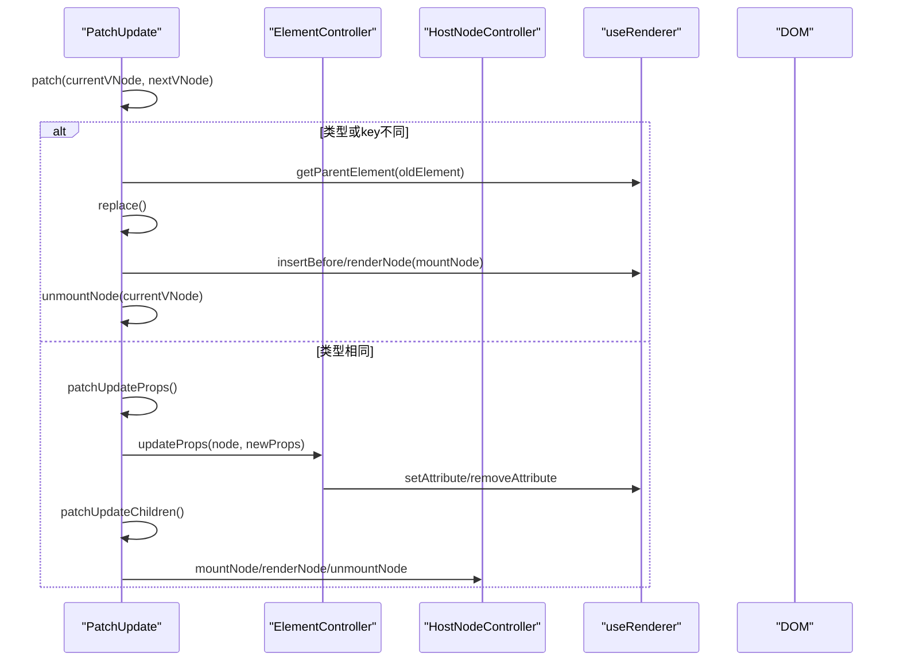
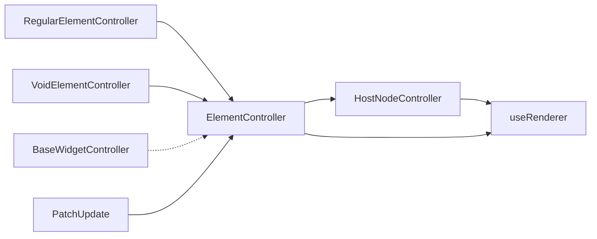

# 元素控制器

<cite>
**本文引用的文件**
- [ElementController.ts](file://packages/runtime-core/src/controllers/ElementController.ts)
- [RegularElementController.ts](file://packages/runtime-core/src/controllers/RegularElementController.ts)
- [VoidElementController.ts](file://packages/runtime-core/src/controllers/VoidElementController.ts)
- [HostNodeController.ts](file://packages/runtime-core/src/controllers/HostNodeController.ts)
- [BaseWidgetController.ts](file://packages/runtime-core/src/controllers/BaseWidgetController.ts)
- [ContainerController.ts](file://packages/runtime-core/src/controllers/ContainerController.ts)
- [controller.ts](file://packages/runtime-core/src/types/controller.ts)
- [element.ts](file://packages/runtime-core/src/types/element.ts)
- [api.ts](file://packages/runtime-core/src/renderer/api.ts)
- [update.ts](file://packages/runtime-core/src/vnode/core/update.ts)
- [element.test.ts](file://packages/runtime-core/__tests__/controllers/element.test.ts)
</cite>

## 目录
1. [简介](#简介)
2. [项目结构](#项目结构)
3. [核心组件](#核心组件)
4. [架构总览](#架构总览)
5. [详细组件分析](#详细组件分析)
6. [依赖分析](#依赖分析)
7. [性能考量](#性能考量)
8. [故障排查指南](#故障排查指南)
9. [结论](#结论)

## 简介
本文件系统性阐述 vitarx 框架中“元素控制器（ElementController）”的设计与实现，重点覆盖以下方面：
- ElementController 作为管理 DOM 元素节点的核心控制器，如何封装元素的创建、属性更新、事件绑定与销毁逻辑；
- RegularElementController 与 VoidElementController 的差异及适用场景；
- 继承自 HostNodeController 的设计模式，以及通过渲染器 API（useRenderer）与平台解耦；
- 元素属性标准化、事件处理机制与性能优化策略；
- 结合虚拟 DOM 更新流程，说明元素控制器在渲染管线中的关键作用。

## 项目结构
围绕元素控制器的相关源码主要位于 runtime-core 包的 controllers 与 vnode 目录中，类型定义位于 types 目录，渲染器 API 位于 renderer 目录，测试用例位于 __tests__ 目录。

图表来源
- [HostNodeController.ts](file://packages/runtime-core/src/controllers/HostNodeController.ts#L1-L127)
- [ElementController.ts](file://packages/runtime-core/src/controllers/ElementController.ts#L1-L104)
- [RegularElementController.ts](file://packages/runtime-core/src/controllers/RegularElementController.ts#L1-L33)
- [VoidElementController.ts](file://packages/runtime-core/src/controllers/VoidElementController.ts#L1-L31)
- [BaseWidgetController.ts](file://packages/runtime-core/src/controllers/BaseWidgetController.ts#L1-L116)
- [controller.ts](file://packages/runtime-core/src/types/controller.ts#L1-L51)
- [element.ts](file://packages/runtime-core/src/types/element.ts#L1-L143)
- [api.ts](file://packages/runtime-core/src/renderer/api.ts#L1-L28)
- [update.ts](file://packages/runtime-core/src/vnode/core/update.ts#L1-L390)

章节来源
- [HostNodeController.ts](file://packages/runtime-core/src/controllers/HostNodeController.ts#L1-L127)
- [ElementController.ts](file://packages/runtime-core/src/controllers/ElementController.ts#L1-L104)
- [RegularElementController.ts](file://packages/runtime-core/src/controllers/RegularElementController.ts#L1-L33)
- [VoidElementController.ts](file://packages/runtime-core/src/controllers/VoidElementController.ts#L1-L31)
- [BaseWidgetController.ts](file://packages/runtime-core/src/controllers/BaseWidgetController.ts#L1-L116)
- [controller.ts](file://packages/runtime-core/src/types/controller.ts#L1-L51)
- [element.ts](file://packages/runtime-core/src/types/element.ts#L1-L143)
- [api.ts](file://packages/runtime-core/src/renderer/api.ts#L1-L28)
- [update.ts](file://packages/runtime-core/src/vnode/core/update.ts#L1-L390)

## 核心组件
- ElementController：抽象基类，封装元素节点的属性更新、生命周期钩子调用与 DOM 创建逻辑，继承自 HostNodeController。
- RegularElementController：常规元素控制器，负责创建 HTML/SVG 元素，混入容器子节点处理能力。
- VoidElementController：空元素控制器，负责创建 img、br、input 等自闭合元素，不包含子节点。
- HostNodeController：宿主节点控制器抽象基类，统一管理渲染、挂载、激活、停用、卸载与锚点创建等通用生命周期。
- BaseWidgetController：基础 Widget 控制器，用于 Widget 节点的生命周期管理，与 ElementController 的职责互补。
- 渲染器 API（useRenderer）：通过全局渲染器适配器屏蔽平台差异，统一 DOM 操作接口。

章节来源
- [ElementController.ts](file://packages/runtime-core/src/controllers/ElementController.ts#L1-L104)
- [RegularElementController.ts](file://packages/runtime-core/src/controllers/RegularElementController.ts#L1-L33)
- [VoidElementController.ts](file://packages/runtime-core/src/controllers/VoidElementController.ts#L1-L31)
- [HostNodeController.ts](file://packages/runtime-core/src/controllers/HostNodeController.ts#L1-L127)
- [BaseWidgetController.ts](file://packages/runtime-core/src/controllers/BaseWidgetController.ts#L1-L116)
- [api.ts](file://packages/runtime-core/src/renderer/api.ts#L1-L28)

## 架构总览
ElementController 将“元素节点生命周期”与“属性更新”两大职责与“平台无关的 DOM 操作”解耦，通过 useRenderer 抽象渲染器，使控制器可在不同宿主平台（浏览器 DOM、SSR 等）复用。

图表来源
- [HostNodeController.ts](file://packages/runtime-core/src/controllers/HostNodeController.ts#L1-L127)
- [ElementController.ts](file://packages/runtime-core/src/controllers/ElementController.ts#L1-L104)
- [RegularElementController.ts](file://packages/runtime-core/src/controllers/RegularElementController.ts#L1-L33)
- [VoidElementController.ts](file://packages/runtime-core/src/controllers/VoidElementController.ts#L1-L31)
- [BaseWidgetController.ts](file://packages/runtime-core/src/controllers/BaseWidgetController.ts#L1-L116)

## 详细组件分析

### ElementController：元素控制器抽象基类
- 职责
  - 属性更新：对新旧属性进行对比，按需删除、新增或更新 DOM 属性。
  - 生命周期钩子：在渲染、挂载、卸载前后调用指令钩子，保证与指令系统的集成。
  - DOM 创建：委托给子类实现 createElement，统一由 HostNodeController 的 dom 渲染器完成实际创建。
- 关键实现要点
  - updateProps：遍历新旧属性，区分删除、新增与更新三类操作，避免不必要的 DOM 修改。
  - 生命周期：重写 render/mount/unmount，分别在合适时机调用指令钩子 created/beforeMount/mounted/beforeUnmount/unmounted。
  - createElement：由子类实现，统一通过 dom.createElement 创建宿主元素。

图表来源
- [ElementController.ts](file://packages/runtime-core/src/controllers/ElementController.ts#L50-L71)

章节来源
- [ElementController.ts](file://packages/runtime-core/src/controllers/ElementController.ts#L1-L104)

### RegularElementController：常规元素控制器
- 职责
  - 创建常规 HTML/SVG 元素（由 isSVGElement 标志决定）。
  - 通过 mixinContainerController 混入容器子节点处理能力，支持渲染、挂载、激活、停用、卸载子节点。
- 设计要点
  - 构造函数中混入容器控制器，使常规元素具备子节点管理能力。
  - 继承 ElementController，复用属性更新与生命周期钩子逻辑。

图表来源
- [RegularElementController.ts](file://packages/runtime-core/src/controllers/RegularElementController.ts#L1-L33)
- [HostNodeController.ts](file://packages/runtime-core/src/controllers/HostNodeController.ts#L36-L43)
- [ContainerController.ts](file://packages/runtime-core/src/controllers/ContainerController.ts#L1-L59)
- [api.ts](file://packages/runtime-core/src/renderer/api.ts#L1-L28)

章节来源
- [RegularElementController.ts](file://packages/runtime-core/src/controllers/RegularElementController.ts#L1-L33)
- [ContainerController.ts](file://packages/runtime-core/src/controllers/ContainerController.ts#L1-L59)

### VoidElementController：空元素控制器
- 职责
  - 创建 img、br、hr、input 等自闭合元素。
  - 不包含子节点，属性更新与常规元素一致。
- 设计要点
  - 直接继承 ElementController，无需混入容器控制器。
  - 适用于 HostVoidElementVNodeType 的元素类型。

章节来源
- [VoidElementController.ts](file://packages/runtime-core/src/controllers/VoidElementController.ts#L1-L31)
- [element.ts](file://packages/runtime-core/src/types/element.ts#L78-L143)

### HostNodeController：宿主节点控制器
- 职责
  - 统一管理节点渲染、挂载、激活、停用、卸载与锚点创建。
  - 通过 useRenderer 抽象平台 DOM 操作，提供 appendChild、insertBefore、replace、remove 等操作。
- 关键实现要点
  - render：若节点未创建元素则创建并设置 ref，随后渲染子节点，最后设置状态为 Rendered。
  - mount：将元素挂载到目标容器，设置状态为 Activated。
  - activate/deactivate：激活/停用时处理锚点注释，停用时创建锚点，激活时替换回原元素。
  - unmount：卸载子节点、清理 ref 与 el、移除锚点，设置状态为 Unmounted。
  - createAnchor：为停用节点创建注释锚点，便于后续恢复。

图表来源
- [HostNodeController.ts](file://packages/runtime-core/src/controllers/HostNodeController.ts#L36-L126)
- [api.ts](file://packages/runtime-core/src/renderer/api.ts#L1-L28)

章节来源
- [HostNodeController.ts](file://packages/runtime-core/src/controllers/HostNodeController.ts#L1-L127)

### BaseWidgetController：基础 Widget 控制器
- 职责
  - 管理 Widget 节点的渲染、挂载、激活、停用与卸载，与元素节点生命周期协同工作。
  - 通过 diffProps 对比属性差异，触发组件更新。
- 与 ElementController 的关系
  - ElementController 专注于元素节点，BaseWidgetController 专注于 Widget 节点，二者在虚拟 DOM 更新流程中分别被调用。

章节来源
- [BaseWidgetController.ts](file://packages/runtime-core/src/controllers/BaseWidgetController.ts#L1-L116)

### 渲染器 API（useRenderer）与平台解耦
- 作用
  - 通过全局渲染器适配器，屏蔽平台差异，统一 DOM 操作接口（如 appendChild、insertBefore、replace、remove、createComment、createTextNode 等）。
- 使用方式
  - HostNodeController 与 ElementController 通过 useRenderer 获取渲染器实例，避免直接依赖浏览器 DOM API。
- 错误处理
  - 若未注册渲染器，getRenderer 会抛出错误，提示“渲染器未注册”。

章节来源
- [api.ts](file://packages/runtime-core/src/renderer/api.ts#L1-L28)
- [HostNodeController.ts](file://packages/runtime-core/src/controllers/HostNodeController.ts#L21-L25)
- [ElementController.ts](file://packages/runtime-core/src/controllers/ElementController.ts#L100-L103)

### 虚拟 DOM 更新流程中的元素控制器
- PatchUpdate 负责比较新旧节点并执行更新：
  - 若类型或 key 不同，执行替换（replace），必要时创建锚点并插入新节点，再卸载旧节点。
  - 若类型相同，执行属性更新（patchUpdateProps），并递归更新容器子节点（patchUpdateChildren）。
- 元素控制器在流程中的角色
  - ElementController.updateProps 负责元素属性的增量更新，减少不必要的 DOM 操作。
  - HostNodeController.render/mount/unmount 负责元素的创建、挂载与卸载，配合指令钩子完成生命周期管理。

图表来源
- [update.ts](file://packages/runtime-core/src/vnode/core/update.ts#L53-L151)
- [update.ts](file://packages/runtime-core/src/vnode/core/update.ts#L118-L120)
- [update.ts](file://packages/runtime-core/src/vnode/core/update.ts#L170-L248)
- [ElementController.ts](file://packages/runtime-core/src/controllers/ElementController.ts#L50-L71)
- [HostNodeController.ts](file://packages/runtime-core/src/controllers/HostNodeController.ts#L47-L93)

章节来源
- [update.ts](file://packages/runtime-core/src/vnode/core/update.ts#L1-L390)
- [ElementController.ts](file://packages/runtime-core/src/controllers/ElementController.ts#L1-L104)
- [HostNodeController.ts](file://packages/runtime-core/src/controllers/HostNodeController.ts#L1-L127)

## 依赖分析
- 组件耦合
  - ElementController 依赖 HostNodeController 提供的通用生命周期与 DOM 操作抽象。
  - RegularElementController 通过 mixinContainerController 获得容器子节点处理能力，增强常规元素的子树管理。
  - VoidElementController 直接继承 ElementController，不引入额外子节点处理。
  - BaseWidgetController 与 ElementController 分别服务于 Widget 与元素节点，职责清晰分离。
- 外部依赖
  - useRenderer 提供平台无关的 DOM 操作接口，降低平台耦合度。
  - 测试用例验证了控制器在渲染、挂载、属性更新、卸载、激活/停用等场景的行为一致性。

图表来源
- [ElementController.ts](file://packages/runtime-core/src/controllers/ElementController.ts#L1-L104)
- [HostNodeController.ts](file://packages/runtime-core/src/controllers/HostNodeController.ts#L1-L127)
- [RegularElementController.ts](file://packages/runtime-core/src/controllers/RegularElementController.ts#L1-L33)
- [VoidElementController.ts](file://packages/runtime-core/src/controllers/VoidElementController.ts#L1-L31)
- [BaseWidgetController.ts](file://packages/runtime-core/src/controllers/BaseWidgetController.ts#L1-L116)
- [api.ts](file://packages/runtime-core/src/renderer/api.ts#L1-L28)
- [update.ts](file://packages/runtime-core/src/vnode/core/update.ts#L1-L390)

章节来源
- [controller.ts](file://packages/runtime-core/src/types/controller.ts#L1-L51)
- [element.ts](file://packages/runtime-core/src/types/element.ts#L1-L143)

## 性能考量
- 属性更新的最小化操作
  - ElementController.updateProps 仅在新旧值不同时更新属性，避免重复 DOM 操作。
- 子节点批量处理
  - RegularElementController 通过 mixinContainerController 将子节点渲染、挂载、激活、停用、卸载集中处理，减少多次 DOM 操作。
- 虚拟 DOM 更新优化
  - PatchUpdate.patchUpdateChildren 使用 key 匹配与最长递增子序列（LIS）算法，尽量减少节点移动与插入操作，显著降低 DOM 操作次数。
- 锚点复用
  - HostNodeController.deactivate/createAnchor 通过注释锚点实现元素停用与恢复，避免重建 DOM，提升切换性能。

章节来源
- [ElementController.ts](file://packages/runtime-core/src/controllers/ElementController.ts#L50-L71)
- [ContainerController.ts](file://packages/runtime-core/src/controllers/ContainerController.ts#L1-L59)
- [update.ts](file://packages/runtime-core/src/vnode/core/update.ts#L170-L248)
- [HostNodeController.ts](file://packages/runtime-core/src/controllers/HostNodeController.ts#L112-L126)

## 故障排查指南
- 渲染器未注册
  - 现象：调用 useRenderer 时抛出“渲染器未注册”的错误。
  - 处理：确保在应用启动时通过 setRenderer 注册平台渲染器适配器。
- 元素属性未生效
  - 现象：属性更新后 DOM 未变化。
  - 排查：确认 ElementController.updateProps 是否正确执行，检查新旧值比较逻辑与渲染器 setAttribute/removeAttribute 的调用路径。
- 子节点未挂载
  - 现象：容器元素渲染后子节点未出现在 DOM 中。
  - 排查：确认 RegularElementController 是否成功混入容器控制器，HostNodeController.renderChildren 是否被调用。
- 卸载后残留引用
  - 现象：unmount 后 vnode.el 或 ref 未清空。
  - 排查：核对 HostNodeController.unmount 的清理逻辑，确保 el 与 ref 被正确置空。

章节来源
- [api.ts](file://packages/runtime-core/src/renderer/api.ts#L1-L28)
- [ElementController.ts](file://packages/runtime-core/src/controllers/ElementController.ts#L50-L71)
- [HostNodeController.ts](file://packages/runtime-core/src/controllers/HostNodeController.ts#L79-L93)
- [element.test.ts](file://packages/runtime-core/__tests__/controllers/element.test.ts#L1-L439)

## 结论
ElementController 通过与 HostNodeController 的继承关系与 useRenderer 的平台解耦，将元素节点的生命周期管理与属性更新抽象为可复用的控制器层。RegularElementController 与 VoidElementController 分别覆盖常规与自闭合元素场景，配合 PatchUpdate 的高效子节点更新算法，形成完整的虚拟 DOM 更新与渲染管线。在实际工程中，应遵循属性更新最小化、子节点批处理与锚点复用等策略，以获得更优的性能表现。