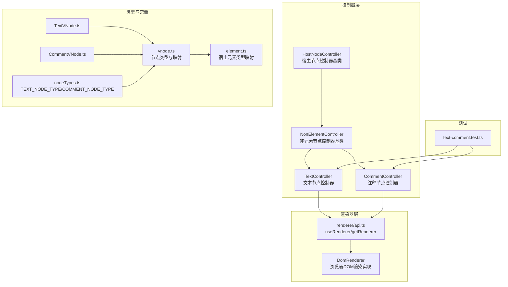
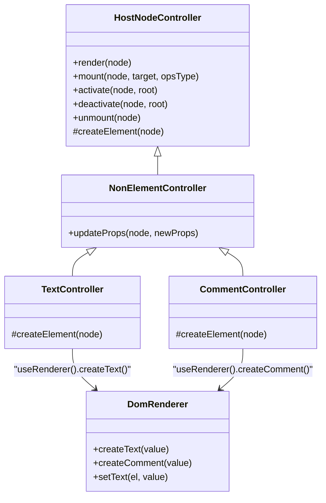
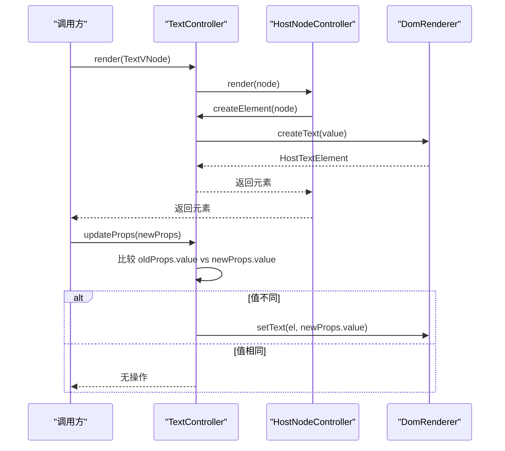
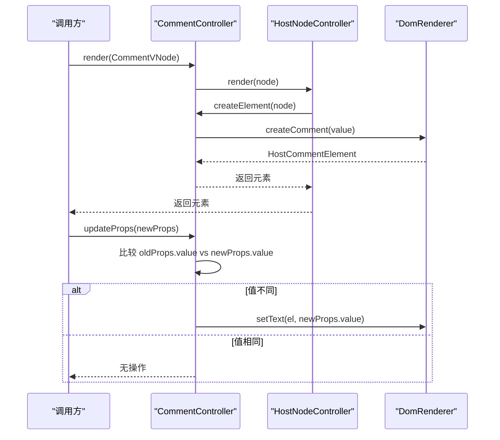
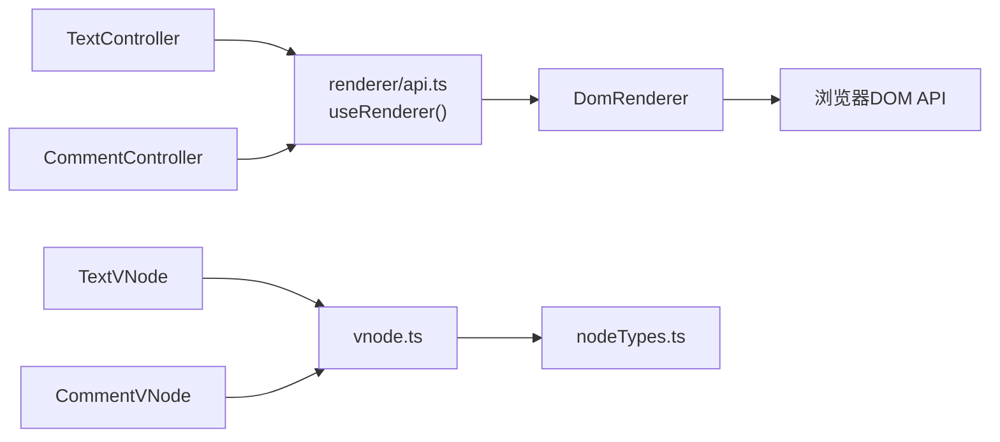

# 文本与注释控制器

<cite>
**本文引用的文件列表**
- [packages/runtime-core/src/controllers/TextController.ts](file://packages/runtime-core/src/controllers/TextController.ts)
- [packages/runtime-core/src/controllers/CommentController.ts](file://packages/runtime-core/src/controllers/CommentController.ts)
- [packages/runtime-core/src/controllers/NonElementController.ts](file://packages/runtime-core/src/controllers/NonElementController.ts)
- [packages/runtime-core/src/controllers/HostNodeController.ts](file://packages/runtime-core/src/controllers/HostNodeController.ts)
- [packages/runtime-core/src/renderer/api.ts](file://packages/runtime-core/src/renderer/api.ts)
- [packages/runtime-dom/src/client/DomRenderer.ts](file://packages/runtime-dom/src/client/DomRenderer.ts)
- [packages/runtime-core/src/types/nodes/TextVNode.ts](file://packages/runtime-core/src/types/nodes/TextVNode.ts)
- [packages/runtime-core/src/types/nodes/CommentVNode.ts](file://packages/runtime-core/src/types/nodes/CommentVNode.ts)
- [packages/runtime-core/src/types/vnode.ts](file://packages/runtime-core/src/types/vnode.ts)
- [packages/runtime-core/src/types/element.ts](file://packages/runtime-core/src/types/element.ts)
- [packages/runtime-core/src/constants/nodeTypes.ts](file://packages/runtime-core/src/constants/nodeTypes.ts)
- [packages/runtime-core/__tests__/controllers/text-comment.test.ts](file://packages/runtime-core/__tests__/controllers/text-comment.test.ts)
</cite>

## 目录
1. [引言](#引言)
2. [项目结构](#项目结构)
3. [核心组件](#核心组件)
4. [架构总览](#架构总览)
5. [详细组件分析](#详细组件分析)
6. [依赖关系分析](#依赖关系分析)
7. [性能考量](#性能考量)
8. [故障排查指南](#故障排查指南)
9. [结论](#结论)
10. [附录](#附录)

## 引言
本文围绕 vitarx 框架中的文本节点控制器（TextController）与注释节点控制器（CommentController），系统阐述它们在虚拟 DOM 树中的职责、工作流程与优化策略。重点包括：
- TextController 如何通过渲染器 API 生成宿主文本元素并响应文本值变化；
- CommentController 如何将虚拟注释节点转换为 DOM 注释元素，并强调其继承 NonElementController 的轻量特性；
- 对比两者在节点类型、更新机制与内存管理上的异同；
- 解析两者作为虚拟 DOM 叶节点的优化策略，以及在调试与条件渲染中的实际应用场景。

## 项目结构
与文本与注释控制器相关的核心文件分布如下：
- 控制器层：TextController、CommentController、NonElementController、HostNodeController
- 渲染器层：renderer API 与 DomRenderer 实现
- 类型与常量：TextVNode/CommentVNode、节点类型常量、宿主元素类型映射
- 测试：覆盖渲染、挂载、更新、卸载与状态流转

图表来源
- [packages/runtime-core/src/controllers/HostNodeController.ts](file://packages/runtime-core/src/controllers/HostNodeController.ts#L1-L127)
- [packages/runtime-core/src/controllers/NonElementController.ts](file://packages/runtime-core/src/controllers/NonElementController.ts#L1-L39)
- [packages/runtime-core/src/controllers/TextController.ts](file://packages/runtime-core/src/controllers/TextController.ts#L1-L31)
- [packages/runtime-core/src/controllers/CommentController.ts](file://packages/runtime-core/src/controllers/CommentController.ts#L1-L21)
- [packages/runtime-core/src/renderer/api.ts](file://packages/runtime-core/src/renderer/api.ts#L1-L28)
- [packages/runtime-dom/src/client/DomRenderer.ts](file://packages/runtime-dom/src/client/DomRenderer.ts#L97-L105)
- [packages/runtime-core/src/types/nodes/TextVNode.ts](file://packages/runtime-core/src/types/nodes/TextVNode.ts#L1-L17)
- [packages/runtime-core/src/types/nodes/CommentVNode.ts](file://packages/runtime-core/src/types/nodes/CommentVNode.ts#L1-L15)
- [packages/runtime-core/src/types/vnode.ts](file://packages/runtime-core/src/types/vnode.ts#L62-L73)
- [packages/runtime-core/src/types/element.ts](file://packages/runtime-core/src/types/element.ts#L100-L117)
- [packages/runtime-core/src/constants/nodeTypes.ts](file://packages/runtime-core/src/constants/nodeTypes.ts#L56-L63)
- [packages/runtime-core/__tests__/controllers/text-comment.test.ts](file://packages/runtime-core/__tests__/controllers/text-comment.test.ts#L1-L270)

章节来源
- [packages/runtime-core/src/controllers/TextController.ts](file://packages/runtime-core/src/controllers/TextController.ts#L1-L31)
- [packages/runtime-core/src/controllers/CommentController.ts](file://packages/runtime-core/src/controllers/CommentController.ts#L1-L21)
- [packages/runtime-core/src/controllers/NonElementController.ts](file://packages/runtime-core/src/controllers/NonElementController.ts#L1-L39)
- [packages/runtime-core/src/controllers/HostNodeController.ts](file://packages/runtime-core/src/controllers/HostNodeController.ts#L1-L127)
- [packages/runtime-core/src/renderer/api.ts](file://packages/runtime-core/src/renderer/api.ts#L1-L28)
- [packages/runtime-dom/src/client/DomRenderer.ts](file://packages/runtime-dom/src/client/DomRenderer.ts#L97-L105)
- [packages/runtime-core/src/types/nodes/TextVNode.ts](file://packages/runtime-core/src/types/nodes/TextVNode.ts#L1-L17)
- [packages/runtime-core/src/types/nodes/CommentVNode.ts](file://packages/runtime-core/src/types/nodes/CommentVNode.ts#L1-L15)
- [packages/runtime-core/src/types/vnode.ts](file://packages/runtime-core/src/types/vnode.ts#L62-L73)
- [packages/runtime-core/src/types/element.ts](file://packages/runtime-core/src/types/element.ts#L100-L117)
- [packages/runtime-core/src/constants/nodeTypes.ts](file://packages/runtime-core/src/constants/nodeTypes.ts#L56-L63)
- [packages/runtime-core/__tests__/controllers/text-comment.test.ts](file://packages/runtime-core/__tests__/controllers/text-comment.test.ts#L1-L270)

## 核心组件
- TextController：继承 NonElementController，负责将 TextVNode 渲染为宿主文本元素，并通过渲染器 API 创建文本节点；更新时直接修改 DOM 文本内容。
- CommentController：继承 NonElementController，负责将 CommentVNode 渲染为宿主注释元素；同样通过渲染器 API 创建注释节点；更新时直接修改 DOM 注释内容。
- NonElementController：非元素节点控制器基类，统一处理文本/注释等叶节点的属性更新（setText），并复用 HostNodeController 的生命周期能力。
- HostNodeController：宿主节点控制器基类，提供 render/mount/activate/deactivate/unmount 生命周期与 createElement 抽象，以及锚点创建能力。

章节来源
- [packages/runtime-core/src/controllers/TextController.ts](file://packages/runtime-core/src/controllers/TextController.ts#L1-L31)
- [packages/runtime-core/src/controllers/CommentController.ts](file://packages/runtime-core/src/controllers/CommentController.ts#L1-L21)
- [packages/runtime-core/src/controllers/NonElementController.ts](file://packages/runtime-core/src/controllers/NonElementController.ts#L1-L39)
- [packages/runtime-core/src/controllers/HostNodeController.ts](file://packages/runtime-core/src/controllers/HostNodeController.ts#L1-L127)

## 架构总览
TextController 与 CommentController 的协作关系如下：

图表来源
- [packages/runtime-core/src/controllers/HostNodeController.ts](file://packages/runtime-core/src/controllers/HostNodeController.ts#L1-L127)
- [packages/runtime-core/src/controllers/NonElementController.ts](file://packages/runtime-core/src/controllers/NonElementController.ts#L1-L39)
- [packages/runtime-core/src/controllers/TextController.ts](file://packages/runtime-core/src/controllers/TextController.ts#L1-L31)
- [packages/runtime-core/src/controllers/CommentController.ts](file://packages/runtime-core/src/controllers/CommentController.ts#L1-L21)
- [packages/runtime-core/src/renderer/api.ts](file://packages/runtime-core/src/renderer/api.ts#L1-L28)
- [packages/runtime-dom/src/client/DomRenderer.ts](file://packages/runtime-dom/src/client/DomRenderer.ts#L97-L105)

## 详细组件分析

### TextController 分析
- 职责与行为
  - 渲染：通过渲染器 API 创建宿主文本元素，将 TextVNode 的 props.value 映射为文本内容。
  - 更新：继承 NonElementController 的 updateProps，当 props.value 发生变化时，直接调用渲染器 setText 修改 DOM 文本。
  - 生命周期：复用 HostNodeController 的 render/mount/activate/deactivate/unmount 流程。
- 关键实现要点
  - createElement 仅依赖渲染器的 createText，简单高效。
  - updateProps 仅在值变更时更新 DOM，避免不必要的重绘。
- 调用序列（渲染与更新）

图表来源
- [packages/runtime-core/src/controllers/TextController.ts](file://packages/runtime-core/src/controllers/TextController.ts#L1-L31)
- [packages/runtime-core/src/controllers/NonElementController.ts](file://packages/runtime-core/src/controllers/NonElementController.ts#L1-L39)
- [packages/runtime-core/src/controllers/HostNodeController.ts](file://packages/runtime-core/src/controllers/HostNodeController.ts#L1-L127)
- [packages/runtime-core/src/renderer/api.ts](file://packages/runtime-core/src/renderer/api.ts#L1-L28)
- [packages/runtime-dom/src/client/DomRenderer.ts](file://packages/runtime-dom/src/client/DomRenderer.ts#L97-L105)

章节来源
- [packages/runtime-core/src/controllers/TextController.ts](file://packages/runtime-core/src/controllers/TextController.ts#L1-L31)
- [packages/runtime-core/src/controllers/NonElementController.ts](file://packages/runtime-core/src/controllers/NonElementController.ts#L1-L39)
- [packages/runtime-core/src/controllers/HostNodeController.ts](file://packages/runtime-core/src/controllers/HostNodeController.ts#L1-L127)
- [packages/runtime-dom/src/client/DomRenderer.ts](file://packages/runtime-dom/src/client/DomRenderer.ts#L97-L105)

### CommentController 分析
- 职责与行为
  - 渲染：通过渲染器 API 创建宿主注释元素，将 CommentVNode 的 props.value 映射为注释内容。
  - 更新：继承 NonElementController 的 updateProps，当 props.value 发生变化时，直接调用渲染器 setText 修改 DOM 注释。
  - 轻量特性：CommentController 仅覆盖 createElement，其余生命周期由基类统一处理，保持最小实现。
- 关键实现要点
  - createElement 仅依赖渲染器的 createComment，与 TextController 一致。
  - updateProps 与 TextController 一致，按值变更更新 DOM。
- 调用序列（渲染与更新）

图表来源
- [packages/runtime-core/src/controllers/CommentController.ts](file://packages/runtime-core/src/controllers/CommentController.ts#L1-L21)
- [packages/runtime-core/src/controllers/NonElementController.ts](file://packages/runtime-core/src/controllers/NonElementController.ts#L1-L39)
- [packages/runtime-core/src/controllers/HostNodeController.ts](file://packages/runtime-core/src/controllers/HostNodeController.ts#L1-L127)
- [packages/runtime-core/src/renderer/api.ts](file://packages/runtime-core/src/renderer/api.ts#L1-L28)
- [packages/runtime-dom/src/client/DomRenderer.ts](file://packages/runtime-dom/src/client/DomRenderer.ts#L102-L105)

章节来源
- [packages/runtime-core/src/controllers/CommentController.ts](file://packages/runtime-core/src/controllers/CommentController.ts#L1-L21)
- [packages/runtime-core/src/controllers/NonElementController.ts](file://packages/runtime-core/src/controllers/NonElementController.ts#L1-L39)
- [packages/runtime-core/src/controllers/HostNodeController.ts](file://packages/runtime-core/src/controllers/HostNodeController.ts#L1-L127)
- [packages/runtime-dom/src/client/DomRenderer.ts](file://packages/runtime-dom/src/client/DomRenderer.ts#L102-L105)

### 非元素节点与宿主节点控制器
- NonElementController
  - 统一处理文本/注释等叶节点的属性更新：当 props.value 变更时，调用渲染器 setText 更新 DOM。
  - 依赖 HostNodeController 提供的生命周期与 createElement 抽象。
- HostNodeController
  - 提供 render/mount/activate/deactivate/unmount 的完整生命周期；
  - 提供 createElement 抽象，子类只需实现具体创建逻辑；
  - 提供 createAnchor 锚点能力，用于 Teleport/Deactivate 等场景。

章节来源
- [packages/runtime-core/src/controllers/NonElementController.ts](file://packages/runtime-core/src/controllers/NonElementController.ts#L1-L39)
- [packages/runtime-core/src/controllers/HostNodeController.ts](file://packages/runtime-core/src/controllers/HostNodeController.ts#L1-L127)

### 节点类型与宿主元素映射
- TextVNode/CommentVNode
  - 文本节点与注释节点均为非元素节点，继承 NonElementVNode，不可包含子节点，是虚拟 DOM 的叶节点。
- 节点类型常量
  - TEXT_NODE_TYPE 与 COMMENT_NODE_TYPE 用于区分虚拟节点类型。
- 宿主元素类型映射
  - HostTextElement 与 HostCommentElement 分别对应浏览器文本节点与注释节点。

章节来源
- [packages/runtime-core/src/types/nodes/TextVNode.ts](file://packages/runtime-core/src/types/nodes/TextVNode.ts#L1-L17)
- [packages/runtime-core/src/types/nodes/CommentVNode.ts](file://packages/runtime-core/src/types/nodes/CommentVNode.ts#L1-L15)
- [packages/runtime-core/src/types/vnode.ts](file://packages/runtime-core/src/types/vnode.ts#L62-L73)
- [packages/runtime-core/src/types/element.ts](file://packages/runtime-core/src/types/element.ts#L100-L117)
- [packages/runtime-core/src/constants/nodeTypes.ts](file://packages/runtime-core/src/constants/nodeTypes.ts#L56-L63)

## 依赖关系分析
- 控制器到渲染器
  - TextController 与 CommentController 通过 useRenderer() 获取渲染器实例，分别调用 createText/createComment 与 setText。
- 渲染器到 DOM
  - DomRenderer 提供 createText/createComment 与 setText 的浏览器实现。
- 类型与常量
  - TextVNode/CommentVNode 与节点类型常量共同定义了虚拟节点的语义与映射关系。

图表来源
- [packages/runtime-core/src/controllers/TextController.ts](file://packages/runtime-core/src/controllers/TextController.ts#L1-L31)
- [packages/runtime-core/src/controllers/CommentController.ts](file://packages/runtime-core/src/controllers/CommentController.ts#L1-L21)
- [packages/runtime-core/src/renderer/api.ts](file://packages/runtime-core/src/renderer/api.ts#L1-L28)
- [packages/runtime-dom/src/client/DomRenderer.ts](file://packages/runtime-dom/src/client/DomRenderer.ts#L97-L105)
- [packages/runtime-core/src/types/nodes/TextVNode.ts](file://packages/runtime-core/src/types/nodes/TextVNode.ts#L1-L17)
- [packages/runtime-core/src/types/nodes/CommentVNode.ts](file://packages/runtime-core/src/types/nodes/CommentVNode.ts#L1-L15)
- [packages/runtime-core/src/types/vnode.ts](file://packages/runtime-core/src/types/vnode.ts#L62-L73)
- [packages/runtime-core/src/constants/nodeTypes.ts](file://packages/runtime-core/src/constants/nodeTypes.ts#L56-L63)

章节来源
- [packages/runtime-core/src/controllers/TextController.ts](file://packages/runtime-core/src/controllers/TextController.ts#L1-L31)
- [packages/runtime-core/src/controllers/CommentController.ts](file://packages/runtime-core/src/controllers/CommentController.ts#L1-L21)
- [packages/runtime-core/src/renderer/api.ts](file://packages/runtime-core/src/renderer/api.ts#L1-L28)
- [packages/runtime-dom/src/client/DomRenderer.ts](file://packages/runtime-dom/src/client/DomRenderer.ts#L97-L105)
- [packages/runtime-core/src/types/nodes/TextVNode.ts](file://packages/runtime-core/src/types/nodes/TextVNode.ts#L1-L17)
- [packages/runtime-core/src/types/nodes/CommentVNode.ts](file://packages/runtime-core/src/types/nodes/CommentVNode.ts#L1-L15)
- [packages/runtime-core/src/types/vnode.ts](file://packages/runtime-core/src/types/vnode.ts#L62-L73)
- [packages/runtime-core/src/constants/nodeTypes.ts](file://packages/runtime-core/src/constants/nodeTypes.ts#L56-L63)

## 性能考量
- 叶节点优化
  - 文本与注释均为叶节点，不包含子节点，渲染与更新路径短、开销低。
- 更新策略
  - NonElementController 的 updateProps 仅在值变更时更新 DOM，避免不必要的重绘。
- 渲染器 API
  - DomRenderer 的 setText 为直接赋值，时间复杂度 O(1)，适合频繁更新场景。
- 条件渲染与调试
  - 注释节点在开发模式下可作为调试锚点，帮助定位条件渲染分支与组件边界；生产环境不显示，不影响性能。

章节来源
- [packages/runtime-core/src/controllers/NonElementController.ts](file://packages/runtime-core/src/controllers/NonElementController.ts#L1-L39)
- [packages/runtime-dom/src/client/DomRenderer.ts](file://packages/runtime-dom/src/client/DomRenderer.ts#L352-L355)
- [packages/runtime-core/src/types/element.ts](file://packages/runtime-core/src/types/element.ts#L100-L117)

## 故障排查指南
- 渲染器未注册
  - 若未调用 setRenderer 注册渲染器，useRenderer 会抛出错误。请确保在应用启动时完成渲染器注册。
- 文本/注释内容未更新
  - 检查 props.value 是否发生变更；若值未变，updateProps 不会触发 DOM 更新。
- 卸载后仍持有引用
  - unmount 会清理 vnode.el 与 anchor 引用，请确认未手动保留外部引用导致内存泄漏。
- 测试参考
  - 可参考测试用例验证渲染、挂载、更新、卸载与状态流转的行为。

章节来源
- [packages/runtime-core/src/renderer/api.ts](file://packages/runtime-core/src/renderer/api.ts#L1-L28)
- [packages/runtime-core/src/controllers/HostNodeController.ts](file://packages/runtime-core/src/controllers/HostNodeController.ts#L79-L93)
- [packages/runtime-core/__tests__/controllers/text-comment.test.ts](file://packages/runtime-core/__tests__/controllers/text-comment.test.ts#L1-L270)

## 结论
- TextController 与 CommentController 通过继承 NonElementController，共享统一的属性更新策略与生命周期管理，分别面向文本与注释两类叶节点。
- 两者均通过渲染器 API 生成宿主元素并直接更新 DOM 文本内容，具备简洁高效的实现路径。
- 在虚拟 DOM 树中，作为叶节点的文本与注释节点在内存占用与更新成本上具有天然优势；注释节点在调试与条件渲染中具有实用价值。
- 通过 HostNodeController 的生命周期与锚点机制，两者在挂载、激活、停用与卸载方面保持一致的可控性与可维护性。

## 附录
- 实际应用场景
  - 文本节点：展示纯文本、动态文案、国际化文本等。
  - 注释节点：开发调试中的占位注释、条件渲染分支标记、组件边界提示等。
- 相关测试用例
  - 文本节点渲染、挂载、更新、卸载与状态验证。
  - 注释节点渲染、挂载、更新、卸载与状态验证。

章节来源
- [packages/runtime-core/__tests__/controllers/text-comment.test.ts](file://packages/runtime-core/__tests__/controllers/text-comment.test.ts#L1-L270)