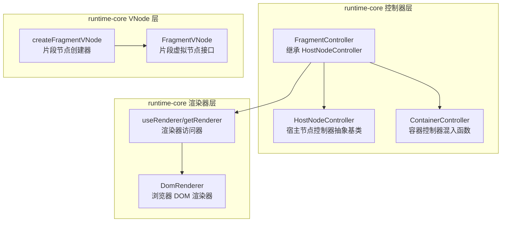
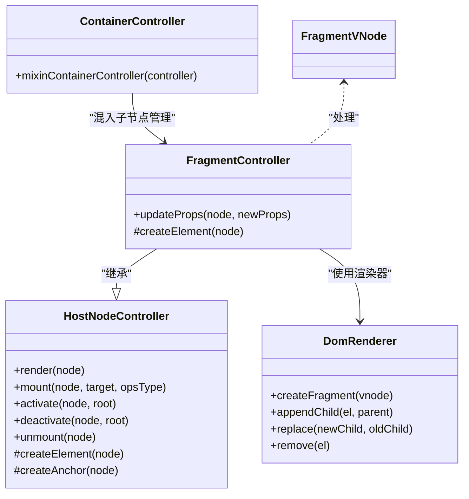
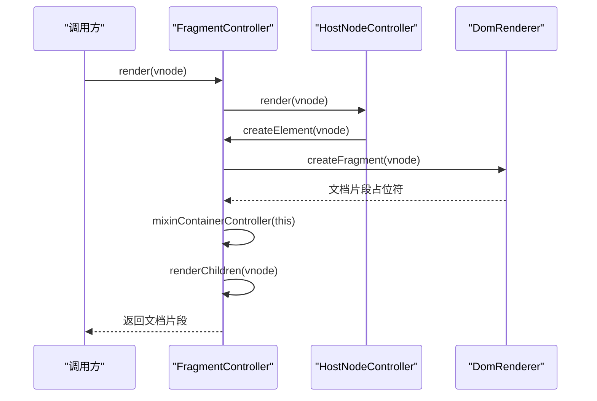
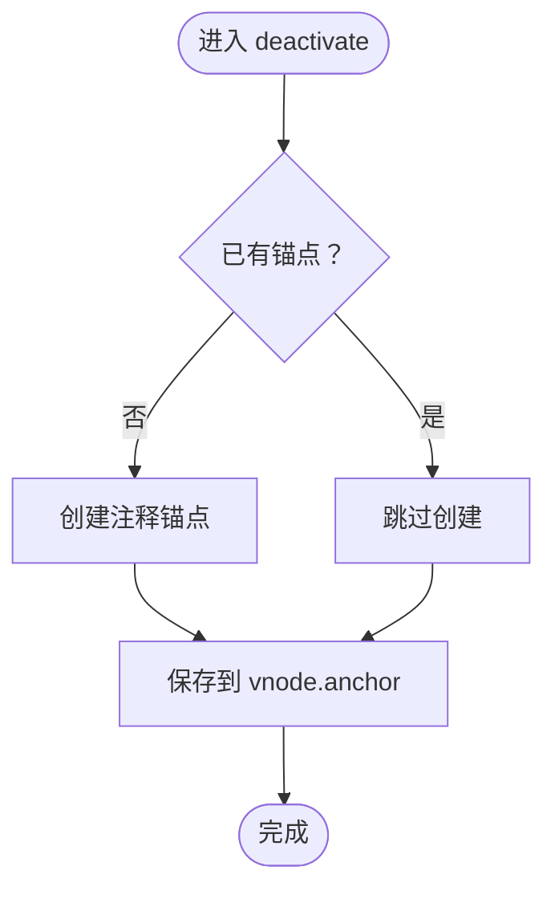
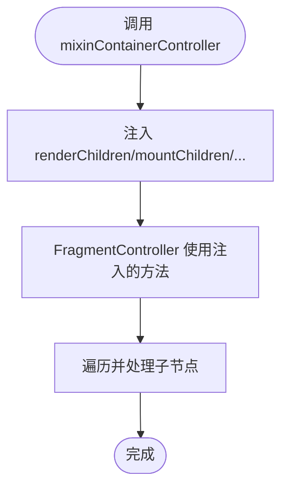
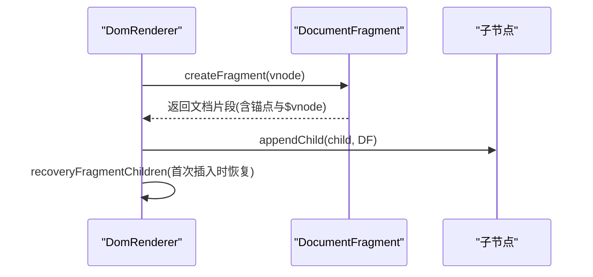
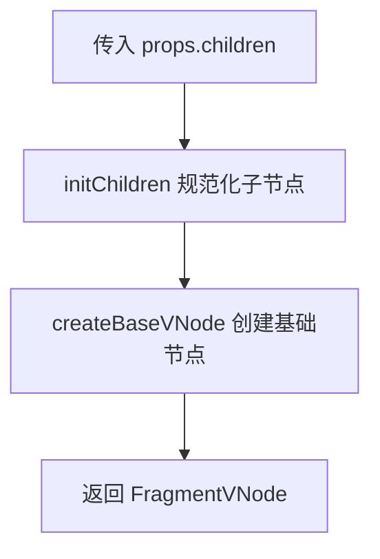
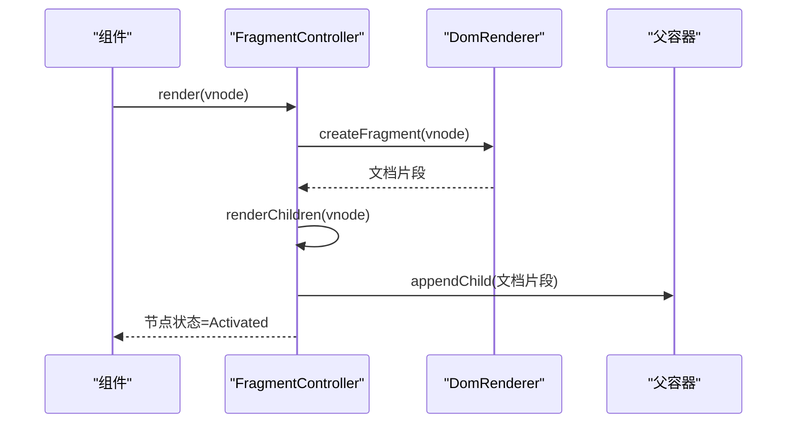
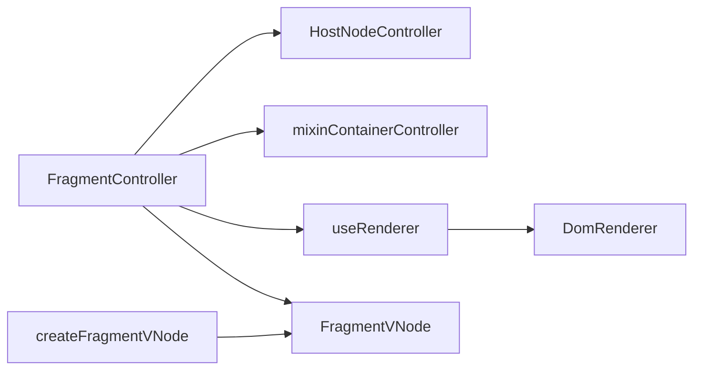

# 片段控制器

<cite>
**本文引用的文件**
- [FragmentController.ts](file://packages/runtime-core/src/controllers/FragmentController.ts)
- [HostNodeController.ts](file://packages/runtime-core/src/controllers/HostNodeController.ts)
- [ContainerController.ts](file://packages/runtime-core/src/controllers/ContainerController.ts)
- [DomRenderer.ts](file://packages/runtime-dom/src/client/DomRenderer.ts)
- [api.ts](file://packages/runtime-core/src/renderer/api.ts)
- [fragment.ts](file://packages/runtime-core/src/vnode/creator/fragment.ts)
- [FragmentVNode.ts](file://packages/runtime-core/src/types/nodes/FragmentVNode.ts)
- [fragment.test.ts](file://packages/runtime-core/__tests__/controllers/fragment.test.ts)
</cite>

## 目录
1. [简介](#简介)
2. [项目结构](#项目结构)
3. [核心组件](#核心组件)
4. [架构总览](#架构总览)
5. [详细组件分析](#详细组件分析)
6. [依赖关系分析](#依赖关系分析)
7. [性能考量](#性能考量)
8. [故障排查指南](#故障排查指南)
9. [结论](#结论)

## 简介
本文件系统性阐述 vitarx 框架中的片段控制器（FragmentController），重点说明其在虚拟 DOM 中对 Fragment 节点的处理方式、作为容器控制器的特殊性（不渲染实际 DOM 元素，仅作为子节点的逻辑分组）、继承 HostNodeController 并混入 ContainerController 功能的设计，以及 createElement 与 updateProps 的实现细节。同时结合渲染流程，解释 Fragment 在组件多根节点场景下的应用与性能优势。

## 项目结构
FragmentController 所在的核心模块位于 runtime-core，配合 runtime-dom 的 DomRenderer 实现浏览器端 DOM 操作；FragmentVNode 由 vnode 创建器生成，FragmentVNode 类型定义明确其容器特性。

图表来源
- [FragmentController.ts](file://packages/runtime-core/src/controllers/FragmentController.ts#L1-L41)
- [HostNodeController.ts](file://packages/runtime-core/src/controllers/HostNodeController.ts#L1-L127)
- [ContainerController.ts](file://packages/runtime-core/src/controllers/ContainerController.ts#L1-L59)
- [api.ts](file://packages/runtime-core/src/renderer/api.ts#L1-L28)
- [DomRenderer.ts](file://packages/runtime-dom/src/client/DomRenderer.ts#L88-L95)
- [fragment.ts](file://packages/runtime-core/src/vnode/creator/fragment.ts#L1-L24)
- [FragmentVNode.ts](file://packages/runtime-core/src/types/nodes/FragmentVNode.ts#L1-L17)

章节来源
- [FragmentController.ts](file://packages/runtime-core/src/controllers/FragmentController.ts#L1-L41)
- [HostNodeController.ts](file://packages/runtime-core/src/controllers/HostNodeController.ts#L1-L127)
- [ContainerController.ts](file://packages/runtime-core/src/controllers/ContainerController.ts#L1-L59)
- [api.ts](file://packages/runtime-core/src/renderer/api.ts#L1-L28)
- [DomRenderer.ts](file://packages/runtime-dom/src/client/DomRenderer.ts#L88-L95)
- [fragment.ts](file://packages/runtime-core/src/vnode/creator/fragment.ts#L1-L24)
- [FragmentVNode.ts](file://packages/runtime-core/src/types/nodes/FragmentVNode.ts#L1-L17)

## 核心组件
- FragmentController：负责 Fragment 节点的渲染、挂载、激活、停用、卸载与属性更新。其核心特点是不渲染实际 DOM 元素，而是通过渲染器创建文档片段（DocumentFragment）作为占位，并借助 ContainerController 的混入实现子节点的批量渲染与生命周期管理。
- HostNodeController：宿主节点控制器抽象基类，提供通用的渲染生命周期（render/mount/activate/deactivate/unmount）与锚点注释节点创建能力。
- ContainerController：通过 mixinContainerController 将容器节点的子节点渲染/挂载/激活/停用/卸载方法注入到控制器实例，使 FragmentController 获得统一的子节点管理能力。
- DomRenderer：浏览器端渲染器，提供 createFragment、appendChild、replace、remove 等 DOM 操作，确保 Fragment 的子节点正确插入父容器。
- FragmentVNode：片段虚拟节点接口，继承自容器节点，表示可包含多个子节点但自身不渲染为 DOM 元素的容器。

章节来源
- [FragmentController.ts](file://packages/runtime-core/src/controllers/FragmentController.ts#L1-L41)
- [HostNodeController.ts](file://packages/runtime-core/src/controllers/HostNodeController.ts#L1-L127)
- [ContainerController.ts](file://packages/runtime-core/src/controllers/ContainerController.ts#L1-L59)
- [DomRenderer.ts](file://packages/runtime-dom/src/client/DomRenderer.ts#L88-L95)
- [FragmentVNode.ts](file://packages/runtime-core/src/types/nodes/FragmentVNode.ts#L1-L17)

## 架构总览
FragmentController 的设计遵循“继承 + 混入”的组合模式：
- 继承 HostNodeController：获得统一的生命周期与锚点注释节点能力。
- 混入 ContainerController：获得子节点批量管理能力（renderChildren/mountChildren/…）。
- 通过 useRenderer 访问渲染器，调用 createFragment 创建文档片段占位符。
- FragmentVNode 由 createFragmentVNode 生成，作为 FragmentController 的输入。

图表来源
- [HostNodeController.ts](file://packages/runtime-core/src/controllers/HostNodeController.ts#L1-L127)
- [ContainerController.ts](file://packages/runtime-core/src/controllers/ContainerController.ts#L1-L59)
- [FragmentController.ts](file://packages/runtime-core/src/controllers/FragmentController.ts#L1-L41)
- [DomRenderer.ts](file://packages/runtime-dom/src/client/DomRenderer.ts#L88-L95)
- [FragmentVNode.ts](file://packages/runtime-core/src/types/nodes/FragmentVNode.ts#L1-L17)

## 详细组件分析

### FragmentController 设计与职责
- 继承 HostNodeController：复用统一生命周期与锚点注释节点能力，保证 Fragment 的激活/停用/卸载行为一致。
- 混入 ContainerController：通过 mixinContainerController 注入 renderChildren/mountChildren/activateChildren/deactivateChildren/unmountChildren，使 Fragment 能够批量管理子节点。
- createElement：调用 useRenderer().createFragment 创建文档片段作为 Fragment 的宿主元素，避免引入额外的包装元素。
- updateProps：覆盖 HostNodeController 的抽象方法，但为空实现，因为 Fragment 不具备可更新的属性（其属性仅用于承载 children）。

图表来源
- [FragmentController.ts](file://packages/runtime-core/src/controllers/FragmentController.ts#L1-L41)
- [HostNodeController.ts](file://packages/runtime-core/src/controllers/HostNodeController.ts#L36-L43)
- [DomRenderer.ts](file://packages/runtime-dom/src/client/DomRenderer.ts#L88-L95)
- [ContainerController.ts](file://packages/runtime-core/src/controllers/ContainerController.ts#L15-L21)

章节来源
- [FragmentController.ts](file://packages/runtime-core/src/controllers/FragmentController.ts#L1-L41)
- [HostNodeController.ts](file://packages/runtime-core/src/controllers/HostNodeController.ts#L36-L43)
- [ContainerController.ts](file://packages/runtime-core/src/controllers/ContainerController.ts#L15-L21)

### HostNodeController 生命周期与锚点注释
- render：若节点未有宿主元素，先 createElement 创建，再渲染子节点，最后标记为 Rendered。
- mount：将元素挂载到目标容器，随后挂载子节点，标记为 Activated。
- activate/deactivate：激活时替换锚点以恢复内容；停用时创建锚点注释，便于后续恢复。
- unmount：卸载子节点，清理 ref 与 el/anchor，标记为 Unmounted。
- createAnchor：为停用/替换场景创建注释锚点，标识 Fragment 的边界。

图表来源
- [HostNodeController.ts](file://packages/runtime-core/src/controllers/HostNodeController.ts#L116-L125)

章节来源
- [HostNodeController.ts](file://packages/runtime-core/src/controllers/HostNodeController.ts#L47-L93)
- [HostNodeController.ts](file://packages/runtime-core/src/controllers/HostNodeController.ts#L116-L125)

### ContainerController 子节点管理
- mixinContainerController 将以下方法注入控制器实例：
  - renderChildren：遍历子节点，逐个渲染并追加到父元素。
  - mountChildren/activateChildren/deactivateChildren/unmountChildren：对子节点执行对应生命周期。
- FragmentController 通过 mixinContainerController 获得这些能力，从而在 render/mount/activate/deactivate/unmount 时自动处理子节点。

图表来源
- [ContainerController.ts](file://packages/runtime-core/src/controllers/ContainerController.ts#L10-L59)

章节来源
- [ContainerController.ts](file://packages/runtime-core/src/controllers/ContainerController.ts#L10-L59)

### DomRenderer 对 Fragment 的支持
- createFragment：创建文档片段并附加 $startAnchor/$endAnchor 注释节点，以及 $vnode 引用，用于范围定位与恢复。
- appendChild/replace/remove：针对 Fragment 的特殊处理，确保插入/替换/删除时能正确处理锚点与子节点。
- recoveryFragmentChildren：在首次插入或恢复时，将 $vnode 中的子节点映射回文档片段的子树，保证 Fragment 内容的一致性。

图表来源
- [DomRenderer.ts](file://packages/runtime-dom/src/client/DomRenderer.ts#L88-L95)
- [DomRenderer.ts](file://packages/runtime-dom/src/client/DomRenderer.ts#L170-L182)
- [DomRenderer.ts](file://packages/runtime-dom/src/client/DomRenderer.ts#L392-L416)

章节来源
- [DomRenderer.ts](file://packages/runtime-dom/src/client/DomRenderer.ts#L88-L95)
- [DomRenderer.ts](file://packages/runtime-dom/src/client/DomRenderer.ts#L170-L182)
- [DomRenderer.ts](file://packages/runtime-dom/src/client/DomRenderer.ts#L392-L416)

### FragmentVNode 与创建器
- FragmentVNode：继承容器节点，表示可包含多个子节点但自身不渲染为 DOM 元素。
- createFragmentVNode：初始化 children 并创建基础片段节点，用于 FragmentController 的输入。

图表来源
- [fragment.ts](file://packages/runtime-core/src/vnode/creator/fragment.ts#L1-L24)
- [FragmentVNode.ts](file://packages/runtime-core/src/types/nodes/FragmentVNode.ts#L1-L17)

章节来源
- [fragment.ts](file://packages/runtime-core/src/vnode/creator/fragment.ts#L1-L24)
- [FragmentVNode.ts](file://packages/runtime-core/src/types/nodes/FragmentVNode.ts#L1-L17)

### 渲染流程与多根节点场景
- 渲染阶段：FragmentController.render 调用 HostNodeController.render，先 createElement 创建文档片段，再调用 mixinContainerController 注入的 renderChildren，将所有子节点渲染并追加到文档片段。
- 挂载阶段：FragmentController.mount 将文档片段追加到目标容器，随后挂载子节点，最终节点状态变为 Activated。
- 多根节点：Fragment 允许组件返回多个根节点，无需额外包装元素，减少 DOM 嵌套，提升渲染效率与布局灵活性。
- 停用/激活：Fragment.deactivate 通过锚点注释替换内容，Fragment.activate 时恢复内容，保证切换过程的可逆性与一致性。

图表来源
- [FragmentController.ts](file://packages/runtime-core/src/controllers/FragmentController.ts#L1-L41)
- [HostNodeController.ts](file://packages/runtime-core/src/controllers/HostNodeController.ts#L36-L51)
- [DomRenderer.ts](file://packages/runtime-dom/src/client/DomRenderer.ts#L170-L182)

章节来源
- [FragmentController.ts](file://packages/runtime-core/src/controllers/FragmentController.ts#L1-L41)
- [HostNodeController.ts](file://packages/runtime-core/src/controllers/HostNodeController.ts#L36-L51)
- [DomRenderer.ts](file://packages/runtime-dom/src/client/DomRenderer.ts#L170-L182)

## 依赖关系分析
- FragmentController 依赖 HostNodeController 的生命周期与锚点注释能力。
- 通过 mixinContainerController 获得子节点管理方法。
- 通过 useRenderer 访问 DomRenderer，调用 createFragment 创建文档片段。
- FragmentVNode 由 createFragmentVNode 生成，作为 FragmentController 的输入。

图表来源
- [FragmentController.ts](file://packages/runtime-core/src/controllers/FragmentController.ts#L1-L41)
- [HostNodeController.ts](file://packages/runtime-core/src/controllers/HostNodeController.ts#L1-L127)
- [ContainerController.ts](file://packages/runtime-core/src/controllers/ContainerController.ts#L10-L59)
- [api.ts](file://packages/runtime-core/src/renderer/api.ts#L1-L28)
- [DomRenderer.ts](file://packages/runtime-dom/src/client/DomRenderer.ts#L88-L95)
- [fragment.ts](file://packages/runtime-core/src/vnode/creator/fragment.ts#L1-L24)

章节来源
- [FragmentController.ts](file://packages/runtime-core/src/controllers/FragmentController.ts#L1-L41)
- [HostNodeController.ts](file://packages/runtime-core/src/controllers/HostNodeController.ts#L1-L127)
- [ContainerController.ts](file://packages/runtime-core/src/controllers/ContainerController.ts#L10-L59)
- [api.ts](file://packages/runtime-core/src/renderer/api.ts#L1-L28)
- [DomRenderer.ts](file://packages/runtime-dom/src/client/DomRenderer.ts#L88-L95)
- [fragment.ts](file://packages/runtime-core/src/vnode/creator/fragment.ts#L1-L24)

## 性能考量
- 减少 DOM 嵌套：Fragment 不渲染实际 DOM 元素，仅作为逻辑分组，避免不必要的包装元素，降低 DOM 树深度与内存占用。
- 批量子节点管理：通过 mixinContainerController 的子节点方法，一次性渲染/挂载/激活/停用/卸载子节点，减少多次 DOM 操作带来的开销。
- 锚点注释与范围定位：DomRenderer 通过 $startAnchor/$endAnchor 与 $vnode 引用，确保 Fragment 内容的快速定位与恢复，提高停用/激活切换的性能。
- 浏览器兼容：DomRenderer 对 Fragment 的插入/替换/删除做了特殊处理，避免跨浏览器差异导致的性能问题。

[本节为通用性能讨论，不直接分析具体文件]

## 故障排查指南
- Fragment.updateProps 不生效：Fragment 不具备可更新的属性，updateProps 为空实现，属预期行为。若业务需要动态属性，请考虑将属性下沉到子节点或使用其他容器策略。
- Fragment 子节点未渲染：检查 FragmentVNode 的 children 是否正确初始化，确认 mixinContainerController 已注入 renderChildren 并在 render 阶段被调用。
- 停用/激活后内容丢失：确认 HostNodeController 的 createAnchor 与 DomRenderer 的 replace/insertBefore/appendChild 逻辑正常工作，确保锚点注释存在且父容器正确。
- 卸载后仍有残留：确认 unmount 流程中已卸载子节点并清理 el/anchor，必要时检查 DomRenderer 的 remove 对 Fragment 的处理。

章节来源
- [fragment.test.ts](file://packages/runtime-core/__tests__/controllers/fragment.test.ts#L132-L150)
- [HostNodeController.ts](file://packages/runtime-core/src/controllers/HostNodeController.ts#L67-L93)
- [DomRenderer.ts](file://packages/runtime-dom/src/client/DomRenderer.ts#L122-L131)
- [DomRenderer.ts](file://packages/runtime-dom/src/client/DomRenderer.ts#L132-L168)

## 结论
FragmentController 通过继承 HostNodeController 并混入 ContainerController，实现了对 Fragment 节点的高效管理：不渲染实际 DOM 元素，仅作为子节点的逻辑分组；通过渲染器创建文档片段占位符，并利用子节点批量管理能力，显著优化多根节点场景下的渲染与生命周期管理。updateProps 的空实现体现了 Fragment 的语义特性（无属性可更新），并在性能与可维护性之间取得平衡。