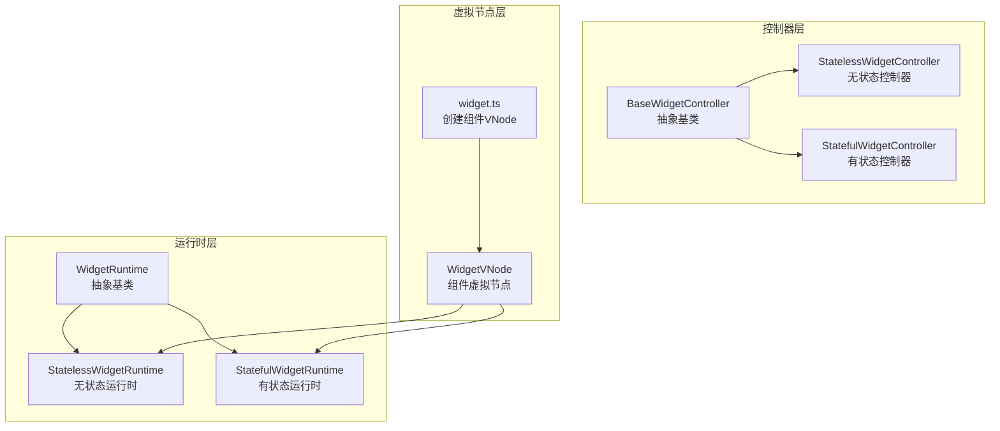
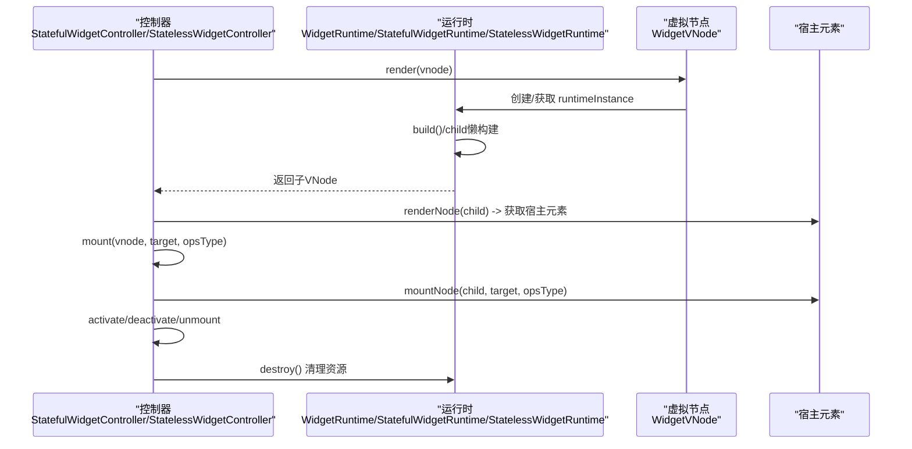
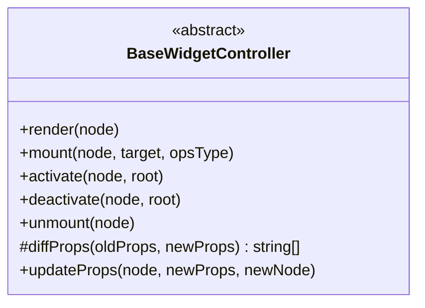
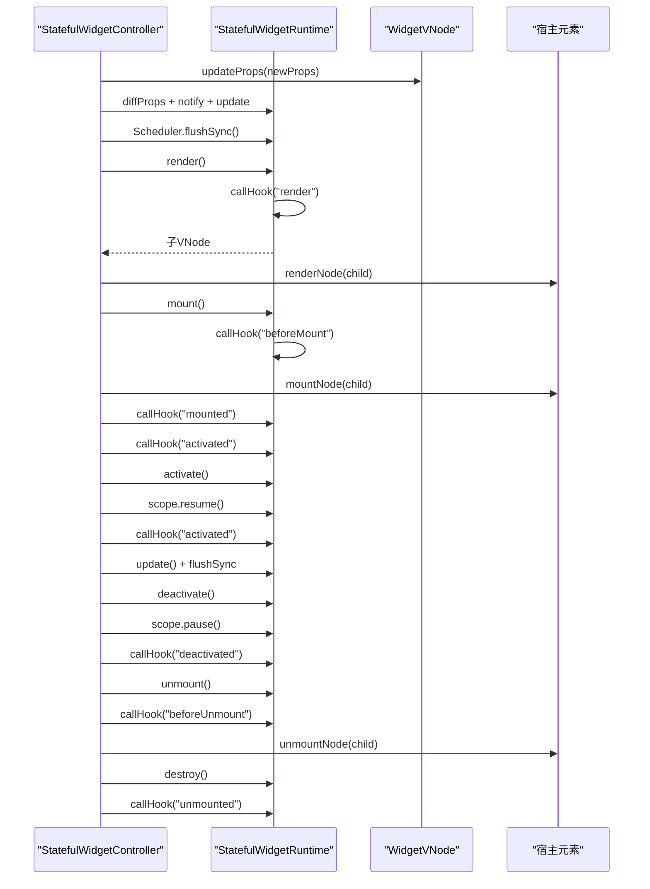
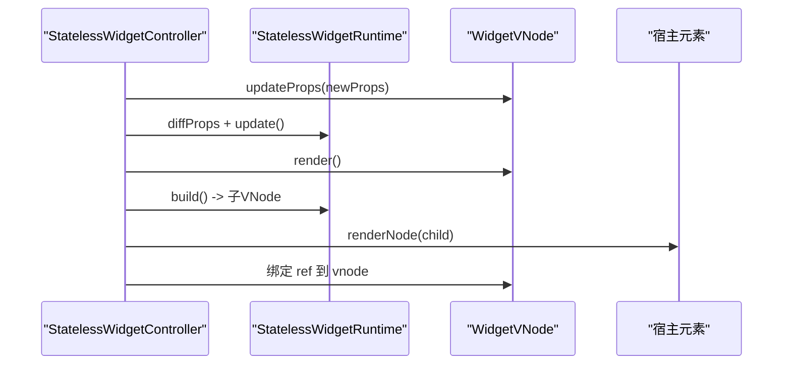
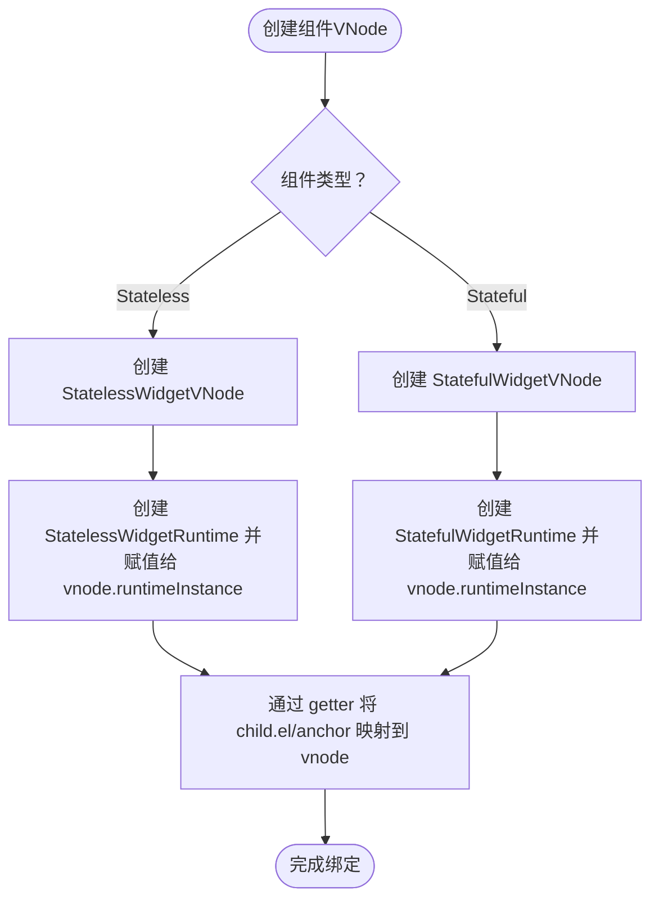
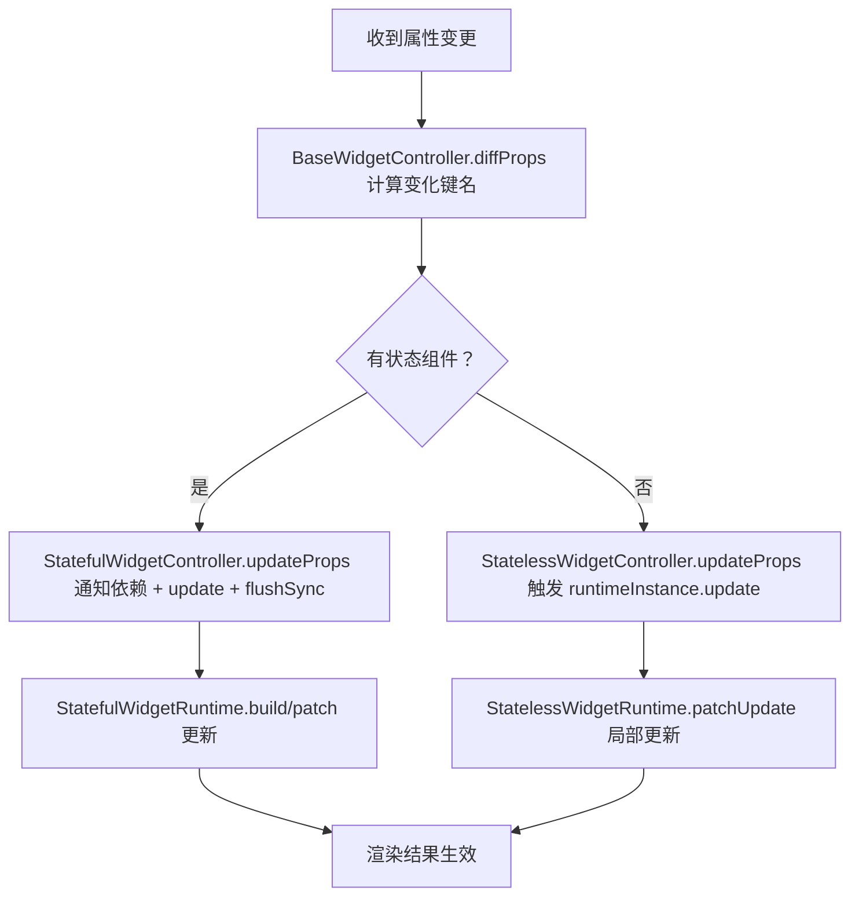
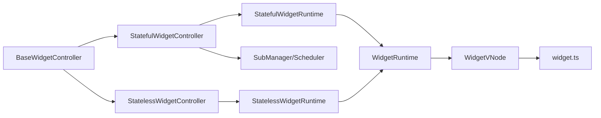

# 组件控制器

<cite>
**本文引用的文件**
- [BaseWidgetController.ts](file://packages/runtime-core/src/controllers/BaseWidgetController.ts)
- [StatefulWidgetController.ts](file://packages/runtime-core/src/controllers/StatefulWidgetController.ts)
- [StatelessWidgetController.ts](file://packages/runtime-core/src/controllers/StatelessWidgetController.ts)
- [controller.ts](file://packages/runtime-core/src/types/controller.ts)
- [WidgetRuntime.ts](file://packages/runtime-core/src/widget/runtime/WidgetRuntime.ts)
- [Stateful.ts](file://packages/runtime-core/src/widget/runtime/Stateful.ts)
- [Stateless.ts](file://packages/runtime-core/src/widget/runtime/Stateless.ts)
- [widget.ts](file://packages/runtime-core/src/vnode/creator/widget.ts)
- [nodeState.ts](file://packages/runtime-core/src/constants/nodeState.ts)
- [index.ts](file://packages/runtime-core/src/controllers/index.ts)
- [widget.test.ts](file://packages/runtime-core/__tests__/controllers/widget.test.ts)
</cite>

## 目录
1. [简介](#简介)
2. [项目结构](#项目结构)
3. [核心组件](#核心组件)
4. [架构总览](#架构总览)
5. [详细组件分析](#详细组件分析)
6. [依赖分析](#依赖分析)
7. [性能考量](#性能考量)
8. [故障排查指南](#故障排查指南)
9. [结论](#结论)

## 简介
本文件围绕 vitarx 框架中的组件控制器（WidgetController）展开，重点阐述 StatefulWidgetController 与 StatelessWidgetController 如何分别管理有状态与无状态组件的生命周期与渲染逻辑，说明它们如何继承自 BaseWidgetController，通过 setup、render、update 等方法协调组件实例的创建、更新与销毁。同时解释状态组件如何结合响应式系统实现自动重渲染，无状态组件如何通过纯函数式渲染提升性能，并描述其与虚拟节点（WidgetVNode）的绑定机制，以及在 diff 算法中如何复用控制器实例以优化更新性能。

## 项目结构
- 控制器层位于 runtime-core 包的 controllers 目录，包含抽象基类 BaseWidgetController 与两类具体控制器 StatefulWidgetController、StatelessWidgetController。
- 运行时层位于 widget/runtime 目录，包含 WidgetRuntime 基类及 StatefulWidgetRuntime、StatelessWidgetRuntime，负责组件实例的构建、更新与生命周期钩子调用。
- 虚拟节点创建位于 vnode/creator/widget.ts，负责为组件创建 VNode 并关联运行时实例。
- 节点状态常量位于 constants/nodeState.ts，统一管理节点生命周期状态。

图表来源
- [BaseWidgetController.ts](file://packages/runtime-core/src/controllers/BaseWidgetController.ts#L47-L116)
- [StatelessWidgetController.ts](file://packages/runtime-core/src/controllers/StatelessWidgetController.ts#L31-L49)
- [StatefulWidgetController.ts](file://packages/runtime-core/src/controllers/StatefulWidgetController.ts#L39-L116)
- [WidgetRuntime.ts](file://packages/runtime-core/src/widget/runtime/WidgetRuntime.ts#L35-L123)
- [Stateless.ts](file://packages/runtime-core/src/widget/runtime/Stateless.ts#L24-L66)
- [Stateful.ts](file://packages/runtime-core/src/widget/runtime/Stateful.ts#L61-L120)
- [widget.ts](file://packages/runtime-core/src/vnode/creator/widget.ts#L154-L174)

章节来源
- [index.ts](file://packages/runtime-core/src/controllers/index.ts#L1-L18)

## 核心组件
- BaseWidgetController：抽象基类，定义 NodeController 接口的通用生命周期方法（render、mount、activate、deactivate、unmount），并提供 diffProps 差异计算能力，统一管理节点状态转换与指令钩子调用。
- StatefulWidgetController：继承自 BaseWidgetController，面向有状态组件，负责属性更新通知、渲染错误处理、生命周期钩子顺序控制（beforeMount/mounted/activated/deactivated/beforeUnmount/unmounted）、激活/停用时的副作用恢复与暂停。
- StatelessWidgetController：继承自 BaseWidgetController，面向无状态组件，负责属性更新触发运行时重建与 patch 更新，渲染时绑定 ref 到 vnode。
- WidgetRuntime：组件运行时基类，持有 vnode、props、cachedChildVNode，提供 build/update 抽象方法与 runInContext 上下文执行能力。
- StatefulWidgetRuntime：有状态组件运行时，封装响应式作用域、依赖订阅、调度更新、错误上报与生命周期钩子调用。
- StatelessWidgetRuntime：无状态组件运行时，基于函数式构建，支持 patch 更新与类型校验。
- widget.ts：组件 VNode 创建工厂，根据组件类型创建 StatefulWidgetVNode 或 StatelessWidgetVNode，并注入运行时实例与应用上下文。
- nodeState.ts：节点生命周期状态枚举，统一状态流转。

章节来源
- [BaseWidgetController.ts](file://packages/runtime-core/src/controllers/BaseWidgetController.ts#L47-L116)
- [StatefulWidgetController.ts](file://packages/runtime-core/src/controllers/StatefulWidgetController.ts#L39-L116)
- [StatelessWidgetController.ts](file://packages/runtime-core/src/controllers/StatelessWidgetController.ts#L31-L49)
- [WidgetRuntime.ts](file://packages/runtime-core/src/widget/runtime/WidgetRuntime.ts#L35-L123)
- [Stateful.ts](file://packages/runtime-core/src/widget/runtime/Stateful.ts#L61-L120)
- [Stateless.ts](file://packages/runtime-core/src/widget/runtime/Stateless.ts#L24-L66)
- [widget.ts](file://packages/runtime-core/src/vnode/creator/widget.ts#L154-L174)
- [nodeState.ts](file://packages/runtime-core/src/constants/nodeState.ts#L1-L19)

## 架构总览
组件控制器与运行时、虚拟节点之间的协作关系如下：

图表来源
- [StatefulWidgetController.ts](file://packages/runtime-core/src/controllers/StatefulWidgetController.ts#L53-L116)
- [StatelessWidgetController.ts](file://packages/runtime-core/src/controllers/StatelessWidgetController.ts#L31-L49)
- [WidgetRuntime.ts](file://packages/runtime-core/src/widget/runtime/WidgetRuntime.ts#L66-L123)
- [Stateful.ts](file://packages/runtime-core/src/widget/runtime/Stateful.ts#L249-L326)
- [Stateless.ts](file://packages/runtime-core/src/widget/runtime/Stateless.ts#L24-L66)
- [widget.ts](file://packages/runtime-core/src/vnode/creator/widget.ts#L154-L174)

## 详细组件分析

### BaseWidgetController 抽象基类
- 职责
  - 实现 NodeController 接口的生命周期方法：render、mount、activate、deactivate、unmount。
  - 提供 diffProps 差异计算，用于属性变更检测与最小化更新。
  - 统一管理节点状态转换（Created/Rendered/Activated/Deactivated/Unmounted）。
  - 在元素节点渲染/挂载/卸载阶段调用指令钩子（created/mounted/beforeUnmount/unmounted）。
- 关键点
  - render：创建组件运行时实例，渲染子节点，标记节点为 Rendered，并在元素节点时调用 created 钩子。
  - mount：在 beforeMount 钩子后挂载子节点，标记为 Activated，并在元素节点时调用 mounted 钩子。
  - activate/deactivate：切换节点状态并调用对应钩子。
  - unmount：在 beforeUnmount 钩子后卸载子节点，销毁运行时实例，清空 ref，标记为 Unmounted，并在元素节点时调用 unmounted 钩子。

图表来源
- [BaseWidgetController.ts](file://packages/runtime-core/src/controllers/BaseWidgetController.ts#L47-L116)
- [controller.ts](file://packages/runtime-core/src/types/controller.ts#L6-L51)

章节来源
- [BaseWidgetController.ts](file://packages/runtime-core/src/controllers/BaseWidgetController.ts#L47-L116)
- [controller.ts](file://packages/runtime-core/src/types/controller.ts#L6-L51)

### StatefulWidgetController 有状态组件控制器
- 职责
  - 面向有状态组件，负责属性更新时触发 SubManager 通知与 Scheduler.flushSync 同步刷新。
  - 渲染阶段调用 render 生命周期钩子，错误时创建错误节点并回退渲染。
  - 生命周期钩子顺序：beforeMount → mount → activated；deactivate 时先调用 deactivated，再 pause 作用域；unmount 时先 deactivated（若未停用），再 beforeUnmount，最后 unmounted。
  - 激活时若脏标记为真，触发 update 并同步刷新。
  - 渲染时绑定 ref 到组件实例。
- 关键点
  - updateProps：diffProps 后通知依赖变化，触发 runtimeInstance.update，并同步刷新。
  - render：调用 runtime.callHook('render')，捕获异常时创建错误节点并回退渲染。
  - activate/deactivate/unmount：按顺序调用生命周期钩子，管理作用域与脏标记。

图表来源
- [StatefulWidgetController.ts](file://packages/runtime-core/src/controllers/StatefulWidgetController.ts#L41-L116)
- [Stateful.ts](file://packages/runtime-core/src/widget/runtime/Stateful.ts#L163-L185)
- [Stateful.ts](file://packages/runtime-core/src/widget/runtime/Stateful.ts#L194-L226)
- [Stateful.ts](file://packages/runtime-core/src/widget/runtime/Stateful.ts#L228-L241)
- [Stateful.ts](file://packages/runtime-core/src/widget/runtime/Stateful.ts#L249-L326)

章节来源
- [StatefulWidgetController.ts](file://packages/runtime-core/src/controllers/StatefulWidgetController.ts#L39-L116)
- [Stateful.ts](file://packages/runtime-core/src/widget/runtime/Stateful.ts#L61-L120)
- [Stateful.ts](file://packages/runtime-core/src/widget/runtime/Stateful.ts#L163-L185)
- [Stateful.ts](file://packages/runtime-core/src/widget/runtime/Stateful.ts#L194-L226)
- [Stateful.ts](file://packages/runtime-core/src/widget/runtime/Stateful.ts#L228-L241)
- [Stateful.ts](file://packages/runtime-core/src/widget/runtime/Stateful.ts#L249-L326)

### StatelessWidgetController 无状态组件控制器
- 职责
  - 面向无状态组件，负责属性更新触发 runtimeInstance.update。
  - 渲染阶段绑定 ref 到 vnode，便于外部引用。
- 关键点
  - render：调用父类 render 获取宿主元素，随后将 ref 绑定到 vnode。
  - updateProps：diffProps 后触发 runtimeInstance.update，实现属性变化驱动的重新渲染。

图表来源
- [StatelessWidgetController.ts](file://packages/runtime-core/src/controllers/StatelessWidgetController.ts#L31-L49)
- [Stateless.ts](file://packages/runtime-core/src/widget/runtime/Stateless.ts#L24-L66)

章节来源
- [StatelessWidgetController.ts](file://packages/runtime-core/src/controllers/StatelessWidgetController.ts#L31-L49)
- [Stateless.ts](file://packages/runtime-core/src/widget/runtime/Stateless.ts#L24-L66)

### 与虚拟节点（WidgetVNode）的绑定机制
- VNode 创建
  - widget.ts 根据组件类型判断 Stateless/Stateful，创建对应 VNode，并注入 appContext 与运行时实例 runtimeInstance。
- 运行时实例
  - WidgetRuntime 在构造时将自身赋给 vnode.runtimeInstance，并通过 getter 将 child.el/anchor 映射到子节点。
- 生命周期状态
  - BaseWidgetController 在各生命周期阶段更新 vnode.state，nodeState.ts 定义了 Created/Rendered/Activated/Deactivated/Unmounted。

图表来源
- [widget.ts](file://packages/runtime-core/src/vnode/creator/widget.ts#L154-L174)
- [WidgetRuntime.ts](file://packages/runtime-core/src/widget/runtime/WidgetRuntime.ts#L45-L91)
- [nodeState.ts](file://packages/runtime-core/src/constants/nodeState.ts#L1-L19)

章节来源
- [widget.ts](file://packages/runtime-core/src/vnode/creator/widget.ts#L154-L174)
- [WidgetRuntime.ts](file://packages/runtime-core/src/widget/runtime/WidgetRuntime.ts#L45-L91)
- [nodeState.ts](file://packages/runtime-core/src/constants/nodeState.ts#L1-L19)

### 在 diff 算法中复用控制器实例以优化更新性能
- 属性差异计算
  - BaseWidgetController.diffProps 对比新旧属性，返回变化键名数组，用于最小化更新。
- 有状态组件
  - StatefulWidgetController.updateProps 通过 SubManager 通知变化键名，触发 runtimeInstance.update，并通过 Scheduler.flushSync 同步刷新，避免中间态。
- 无状态组件
  - StatelessWidgetController.updateProps 通过 diffProps 检测变化后直接触发 runtimeInstance.update，实现快速重建与 patch 更新。
- 运行时更新
  - StatelessWidgetRuntime.update 使用 patchUpdate 对比新旧子 VNode，仅局部更新。
  - StatefulWidgetRuntime.update 通过 depSubscribe 建立依赖追踪，自动触发更新；patch() 优先使用 $patchUpdate，否则使用默认补丁算法。

图表来源
- [BaseWidgetController.ts](file://packages/runtime-core/src/controllers/BaseWidgetController.ts#L56-L75)
- [StatefulWidgetController.ts](file://packages/runtime-core/src/controllers/StatefulWidgetController.ts#L41-L51)
- [StatelessWidgetController.ts](file://packages/runtime-core/src/controllers/StatelessWidgetController.ts#L42-L48)
- [Stateless.ts](file://packages/runtime-core/src/widget/runtime/Stateless.ts#L24-L66)
- [Stateful.ts](file://packages/runtime-core/src/widget/runtime/Stateful.ts#L194-L226)
- [Stateful.ts](file://packages/runtime-core/src/widget/runtime/Stateful.ts#L307-L326)

章节来源
- [BaseWidgetController.ts](file://packages/runtime-core/src/controllers/BaseWidgetController.ts#L56-L75)
- [StatefulWidgetController.ts](file://packages/runtime-core/src/controllers/StatefulWidgetController.ts#L41-L51)
- [StatelessWidgetController.ts](file://packages/runtime-core/src/controllers/StatelessWidgetController.ts#L42-L48)
- [Stateless.ts](file://packages/runtime-core/src/widget/runtime/Stateless.ts#L24-L66)
- [Stateful.ts](file://packages/runtime-core/src/widget/runtime/Stateful.ts#L194-L226)
- [Stateful.ts](file://packages/runtime-core/src/widget/runtime/Stateful.ts#L307-L326)

## 依赖分析
- 控制器与运行时
  - StatefulWidgetController/StatelessWidgetController 依赖各自运行时类（StatefulWidgetRuntime/StatelessWidgetRuntime）完成构建与更新。
- 控制器与虚拟节点
  - 控制器通过 VNode 的 runtimeInstance 与 el/anchor 进行交互，状态通过 nodeState.ts 统一管理。
- 控制器与响应式系统
  - 有状态组件通过 SubManager 与 Scheduler 实现依赖通知与同步刷新，避免重复渲染与中间态。
- 控制器与指令钩子
  - BaseWidgetController 在元素节点渲染/挂载/卸载阶段调用指令钩子，保证生命周期一致性。

图表来源
- [BaseWidgetController.ts](file://packages/runtime-core/src/controllers/BaseWidgetController.ts#L47-L116)
- [StatefulWidgetController.ts](file://packages/runtime-core/src/controllers/StatefulWidgetController.ts#L39-L116)
- [StatelessWidgetController.ts](file://packages/runtime-core/src/controllers/StatelessWidgetController.ts#L31-L49)
- [WidgetRuntime.ts](file://packages/runtime-core/src/widget/runtime/WidgetRuntime.ts#L35-L123)
- [Stateful.ts](file://packages/runtime-core/src/widget/runtime/Stateful.ts#L61-L120)
- [Stateless.ts](file://packages/runtime-core/src/widget/runtime/Stateless.ts#L24-L66)
- [widget.ts](file://packages/runtime-core/src/vnode/creator/widget.ts#L154-L174)

章节来源
- [BaseWidgetController.ts](file://packages/runtime-core/src/controllers/BaseWidgetController.ts#L47-L116)
- [StatefulWidgetController.ts](file://packages/runtime-core/src/controllers/StatefulWidgetController.ts#L39-L116)
- [StatelessWidgetController.ts](file://packages/runtime-core/src/controllers/StatelessWidgetController.ts#L31-L49)
- [WidgetRuntime.ts](file://packages/runtime-core/src/widget/runtime/WidgetRuntime.ts#L35-L123)
- [Stateful.ts](file://packages/runtime-core/src/widget/runtime/Stateful.ts#L61-L120)
- [Stateless.ts](file://packages/runtime-core/src/widget/runtime/Stateless.ts#L24-L66)
- [widget.ts](file://packages/runtime-core/src/vnode/creator/widget.ts#L154-L174)

## 性能考量
- 有状态组件
  - 通过 depSubscribe 建立依赖追踪，配合 Scheduler.queueJob 合并更新任务，避免重复渲染。
  - flushSync 在关键路径（如属性更新）确保同步刷新，减少中间态。
- 无状态组件
  - 通过 diffProps 精准识别变化键名，仅触发必要的 update。
  - StatelessWidgetRuntime.patchUpdate 仅对新旧子 VNode 差异部分进行更新，降低 DOM 操作成本。
- 资源回收
  - BaseWidgetController.unmount 与 WidgetRuntime.destroy 清理 cachedChildVNode、el/anchor 与 runtimeInstance，防止内存泄漏。

[本节为通用性能讨论，无需列出具体文件来源]

## 故障排查指南
- 渲染错误处理
  - StatefulWidgetController.render 捕获异常后，调用 runtime.reportError 并回退到注释节点，确保 UI 稳定。
- 生命周期顺序
  - 有状态组件生命周期顺序严格：beforeMount → mounted → activated；deactivated 与 beforeUnmount 顺序明确，避免资源泄漏。
- 调试建议
  - 使用 __DEV__ 模式下 validateProps 与错误链路（组件 onError → 父组件 onError → 应用 errorHandler）定位问题。
  - 检查 vnode.state 与 ref 绑定是否正确，参考测试用例断言。

章节来源
- [StatefulWidgetController.ts](file://packages/runtime-core/src/controllers/StatefulWidgetController.ts#L53-L71)
- [Stateful.ts](file://packages/runtime-core/src/widget/runtime/Stateful.ts#L109-L153)
- [widget.test.ts](file://packages/runtime-core/__tests__/controllers/widget.test.ts#L1-L231)

## 结论
vitarx 的组件控制器体系通过 BaseWidgetController 抽象统一生命周期管理，StatefulWidgetController 与 StatelessWidgetController 分别面向有状态与无状态组件，结合 WidgetRuntime 的构建与更新机制，实现了高效的渲染与更新流程。有状态组件通过响应式系统实现自动重渲染，无状态组件通过纯函数式渲染与局部 patch 更新提升性能。虚拟节点与运行时实例的绑定确保了生命周期钩子与 ref 的一致性，diff 算法通过差异计算与实例复用进一步优化更新性能。