# 节点控制器模式

<cite>
**本文档引用的文件**
- [BaseWidgetController.ts](file://packages/runtime-core/src/controllers/BaseWidgetController.ts)
- [HostNodeController.ts](file://packages/runtime-core/src/controllers/HostNodeController.ts)
- [ElementController.ts](file://packages/runtime-core/src/controllers/ElementController.ts)
- [RegularElementController.ts](file://packages/runtime-core/src/controllers/RegularElementController.ts)
- [VoidElementController.ts](file://packages/runtime-core/src/controllers/VoidElementController.ts)
- [FragmentController.ts](file://packages/runtime-core/src/controllers/FragmentController.ts)
- [TextController.ts](file://packages/runtime-core/src/controllers/TextController.ts)
- [StatefulWidgetController.ts](file://packages/runtime-core/src/controllers/StatefulWidgetController.ts)
- [StatelessWidgetController.ts](file://packages/runtime-core/src/controllers/StatelessWidgetController.ts)
- [NonElementController.ts](file://packages/runtime-core/src/controllers/NonElementController.ts)
- [ContainerController.ts](file://packages/runtime-core/src/controllers/ContainerController.ts)
- [controller.ts](file://packages/runtime-core/src/types/controller.ts)
</cite>

## 目录
1. [简介](#简介)
2. [控制器架构设计](#控制器架构设计)
3. [核心控制器类型](#核心控制器类型)
4. [ElementController 详解](#elementcontroller-详解)
5. [控制器与虚拟节点的关系](#控制器与虚拟节点的关系)
6. [渲染流程中的控制器作用](#渲染流程中的控制器作用)
7. [自定义控制器扩展](#自定义控制器扩展)

## 简介
节点控制器模式是vitarx框架的核心设计模式之一，用于封装和解耦不同类型的虚拟节点（如元素、片段、文本、组件等）的渲染、挂载、更新和卸载逻辑。该模式通过抽象控制器类来管理虚拟节点的生命周期，为框架提供了统一的节点操作接口。

**Section sources**
- [BaseWidgetController.ts](file://packages/runtime-core/src/controllers/BaseWidgetController.ts#L1-L116)
- [HostNodeController.ts](file://packages/runtime-core/src/controllers/HostNodeController.ts#L1-L127)

## 控制器架构设计
vitarx框架的节点控制器采用分层继承架构，通过抽象基类定义通用接口，具体控制器实现特定类型的节点管理。控制器模式的核心是`NodeController`接口，定义了所有控制器必须实现的生命周期方法。

控制器的继承关系如下：
- `HostNodeController`：宿主节点控制器基类，管理DOM节点的生命周期
- `ElementController`：元素控制器，继承自`HostNodeController`，处理元素节点的属性更新
- `BaseWidgetController`：组件控制器基类，管理组件节点的生命周期

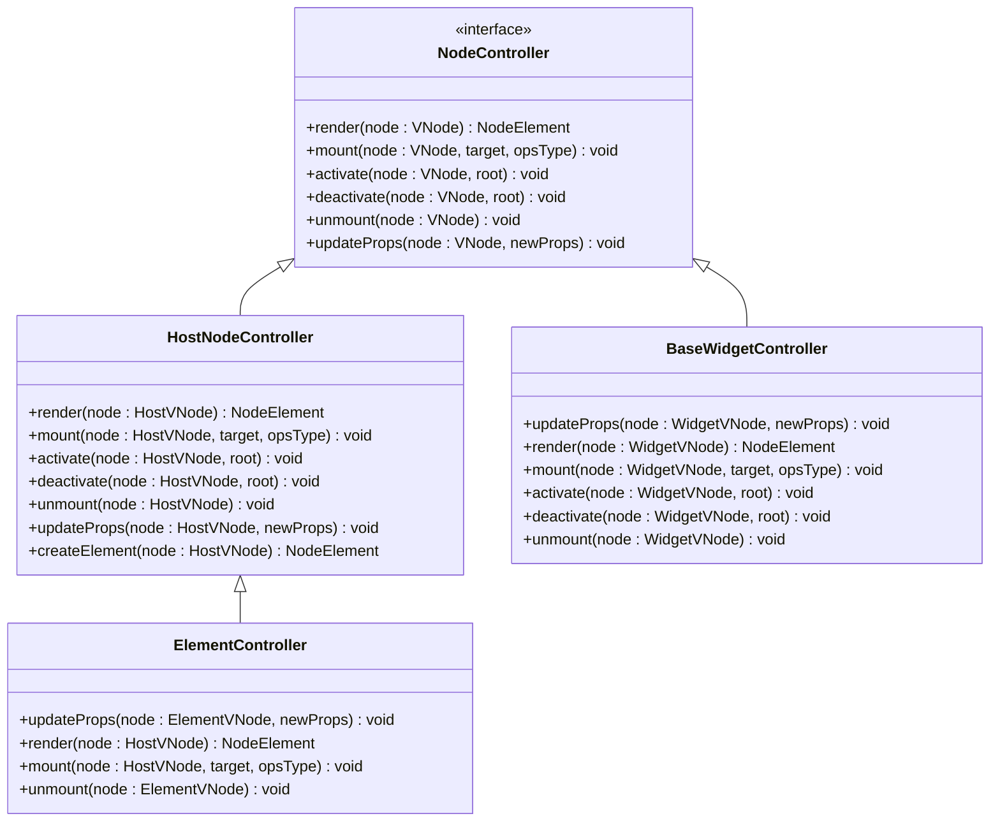

**Diagram sources**
- [controller.ts](file://packages/runtime-core/src/types/controller.ts#L7-L51)
- [HostNodeController.ts](file://packages/runtime-core/src/controllers/HostNodeController.ts#L21-L127)
- [ElementController.ts](file://packages/runtime-core/src/controllers/ElementController.ts#L46-L104)
- [BaseWidgetController.ts](file://packages/runtime-core/src/controllers/BaseWidgetController.ts#L47-L116)

**Section sources**
- [HostNodeController.ts](file://packages/runtime-core/src/controllers/HostNodeController.ts#L21-L127)
- [ElementController.ts](file://packages/runtime-core/src/controllers/ElementController.ts#L46-L104)
- [BaseWidgetController.ts](file://packages/runtime-core/src/controllers/BaseWidgetController.ts#L47-L116)

## 核心控制器类型
vitarx框架定义了多种控制器类型来处理不同类型的虚拟节点，每种控制器负责特定节点类型的生命周期管理。

### 元素控制器
元素控制器负责管理DOM元素节点的创建、属性设置和事件绑定。

#### RegularElementController
`RegularElementController`用于管理常规HTML元素，通过混入`ContainerController`功能来处理子节点。

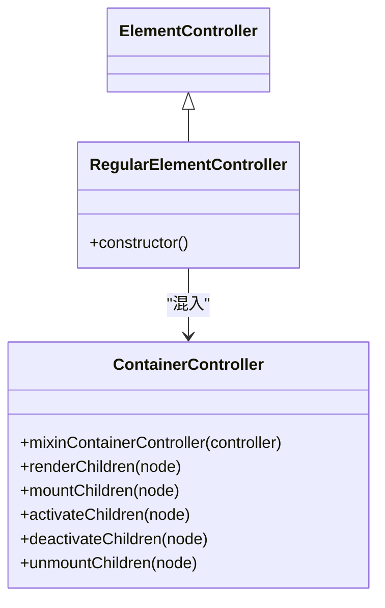

**Diagram sources**
- [RegularElementController.ts](file://packages/runtime-core/src/controllers/RegularElementController.ts#L27-L33)
- [ContainerController.ts](file://packages/runtime-core/src/controllers/ContainerController.ts#L10-L59)

#### VoidElementController
`VoidElementController`专门处理自闭合标签元素（如img、br、input等），这些元素不需要子节点。

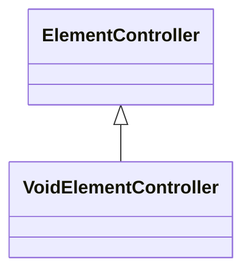

**Diagram sources**
- [VoidElementController.ts](file://packages/runtime-core/src/controllers/VoidElementController.ts#L30-L31)

### 片段与文本控制器
#### FragmentController
`FragmentController`用于管理虚拟节点片段，不处理属性更新，主要负责子节点的容器功能。

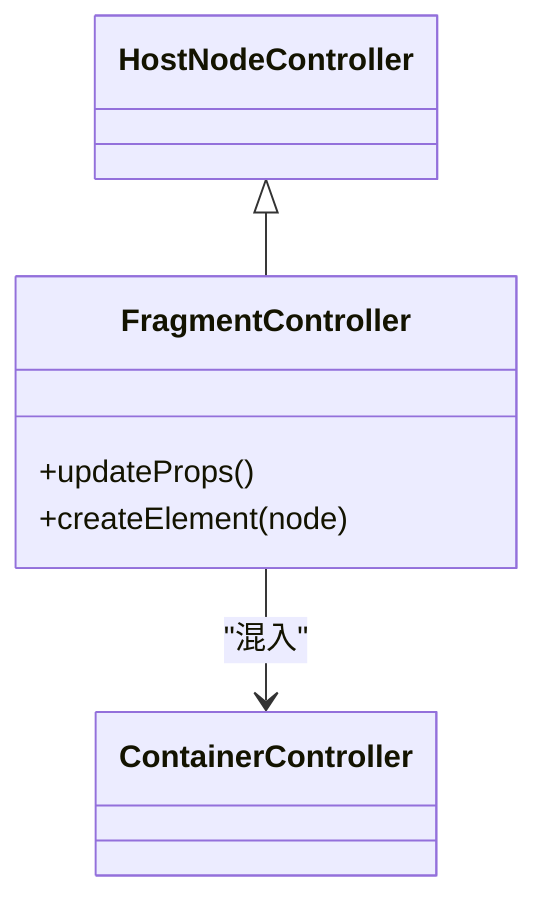

**Diagram sources**
- [FragmentController.ts](file://packages/runtime-core/src/controllers/FragmentController.ts#L28-L42)
- [ContainerController.ts](file://packages/runtime-core/src/controllers/ContainerController.ts#L10-L59)

#### TextController
`TextController`用于管理文本节点，继承自`NonElementController`，专门处理文本内容的更新。

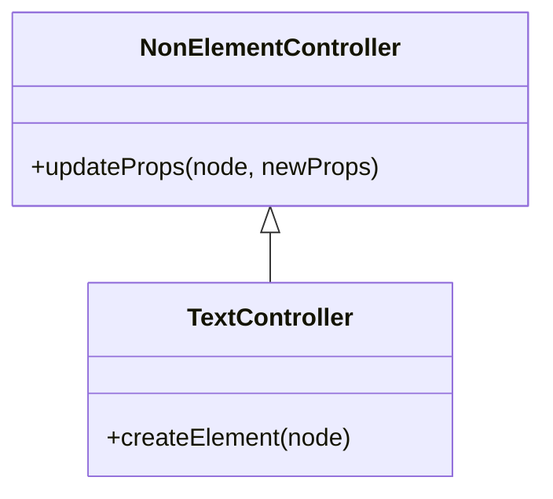

**Diagram sources**
- [TextController.ts](file://packages/runtime-core/src/controllers/TextController.ts#L26-L31)
- [NonElementController.ts](file://packages/runtime-core/src/controllers/NonElementController.ts#L28-L39)

### 组件控制器
#### StatefulWidgetController
`StatefulWidgetController`管理有状态组件的生命周期，处理属性更新、状态管理和生命周期钩子。

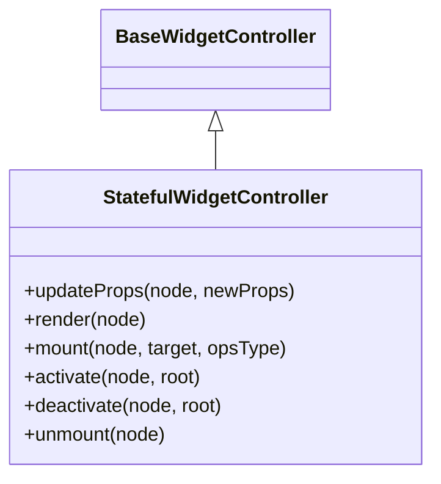

**Diagram sources**
- [StatefulWidgetController.ts](file://packages/runtime-core/src/controllers/StatefulWidgetController.ts#L39-L116)

#### StatelessWidgetController
`StatelessWidgetController`管理无状态组件，仅处理属性更新和重新渲染。

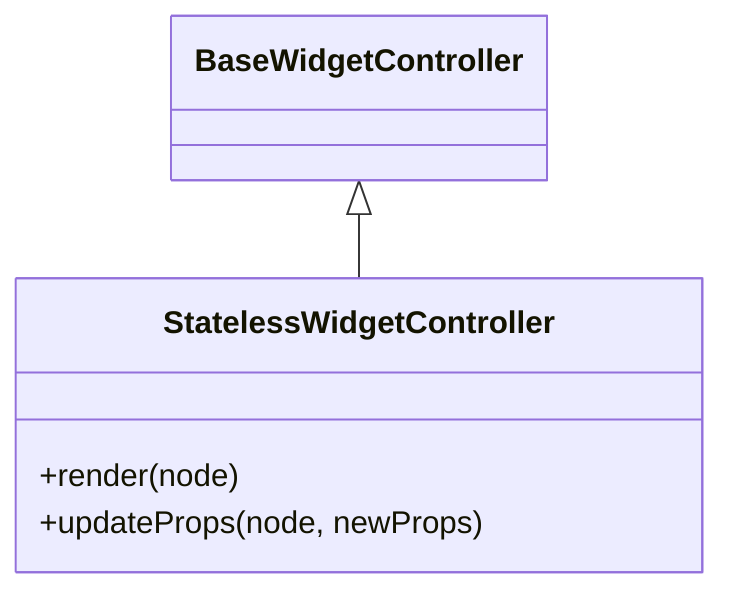

**Diagram sources**
- [StatelessWidgetController.ts](file://packages/runtime-core/src/controllers/StatelessWidgetController.ts#L31-L49)

**Section sources**
- [RegularElementController.ts](file://packages/runtime-core/src/controllers/RegularElementController.ts#L27-L33)
- [VoidElementController.ts](file://packages/runtime-core/src/controllers/VoidElementController.ts#L30-L31)
- [FragmentController.ts](file://packages/runtime-core/src/controllers/FragmentController.ts#L28-L42)
- [TextController.ts](file://packages/runtime-core/src/controllers/TextController.ts#L26-L31)
- [StatefulWidgetController.ts](file://packages/runtime-core/src/controllers/StatefulWidgetController.ts#L39-L116)
- [StatelessWidgetController.ts](file://packages/runtime-core/src/controllers/StatelessWidgetController.ts#L31-L49)

## ElementController 详解
`ElementController`是管理DOM元素的核心控制器，继承自`HostNodeController`并实现了元素特有的属性更新逻辑。

### 属性更新机制
`ElementController`通过`updateProps`方法处理元素属性的增删改操作，自动比较新旧属性值并应用变化。

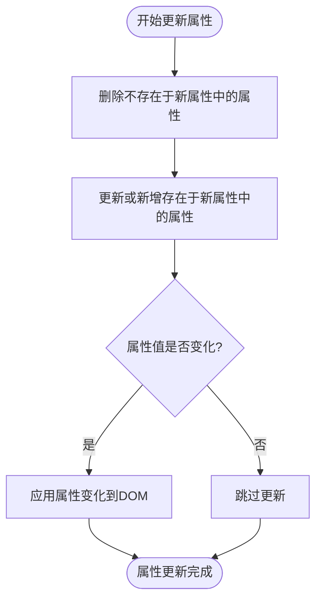

**Diagram sources**
- [ElementController.ts](file://packages/runtime-core/src/controllers/ElementController.ts#L50-L71)

### 生命周期管理
`ElementController`在关键生命周期节点调用指令钩子，确保指令系统能够正确响应节点状态变化。

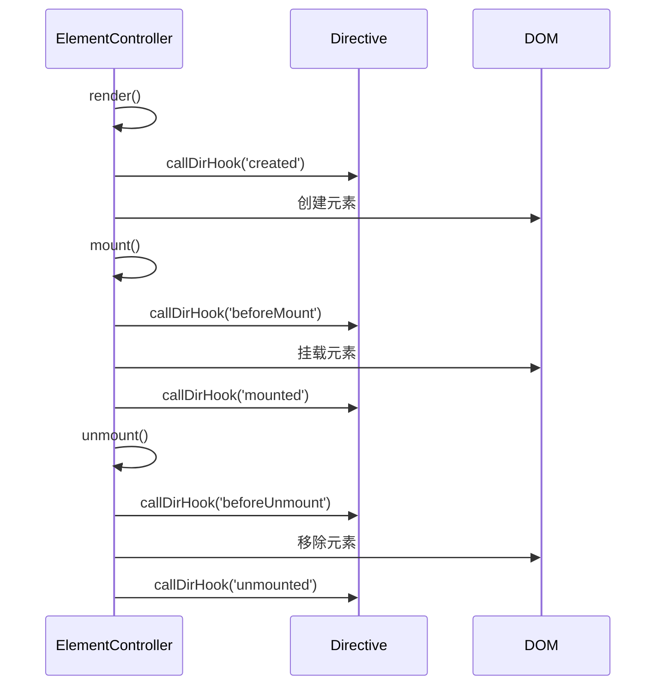

**Diagram sources**
- [ElementController.ts](file://packages/runtime-core/src/controllers/ElementController.ts#L75-L96)

**Section sources**
- [ElementController.ts](file://packages/runtime-core/src/controllers/ElementController.ts#L46-L104)

## 控制器与虚拟节点的关系
控制器与虚拟节点之间存在一对一的对应关系，每个虚拟节点都由特定类型的控制器管理其生命周期。

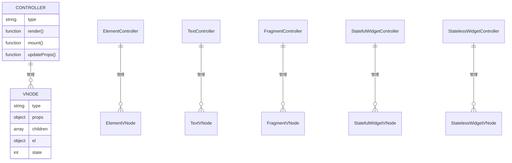

**Diagram sources**
- [types/index.ts](file://packages/runtime-core/src/types/index.ts)
- [controllers/index.ts](file://packages/runtime-core/src/controllers/index.ts)

**Section sources**
- [BaseWidgetController.ts](file://packages/runtime-core/src/controllers/BaseWidgetController.ts#L47-L116)
- [HostNodeController.ts](file://packages/runtime-core/src/controllers/HostNodeController.ts#L21-L127)

## 渲染流程中的控制器作用
在vitarx框架的渲染流程中，控制器扮演着关键角色，负责将虚拟节点转换为实际的DOM元素并管理其生命周期。

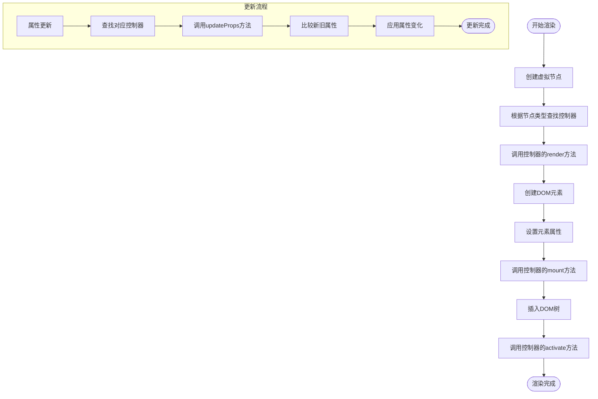

**Diagram sources**
- [vnode/core/create.ts](file://packages/runtime-core/src/vnode/core/create.ts)
- [renderer/api.ts](file://packages/runtime-core/src/renderer/api.ts)

**Section sources**
- [ElementController.ts](file://packages/runtime-core/src/controllers/ElementController.ts#L75-L104)
- [BaseWidgetController.ts](file://packages/runtime-core/src/controllers/BaseWidgetController.ts#L77-L116)

## 自定义控制器扩展
开发者可以通过继承现有的控制器基类来创建自定义控制器，以支持特殊类型的节点或自定义渲染逻辑。

### 扩展步骤
1. 继承合适的基控制器类
2. 实现必要的抽象方法
3. 重写需要定制的生命周期方法

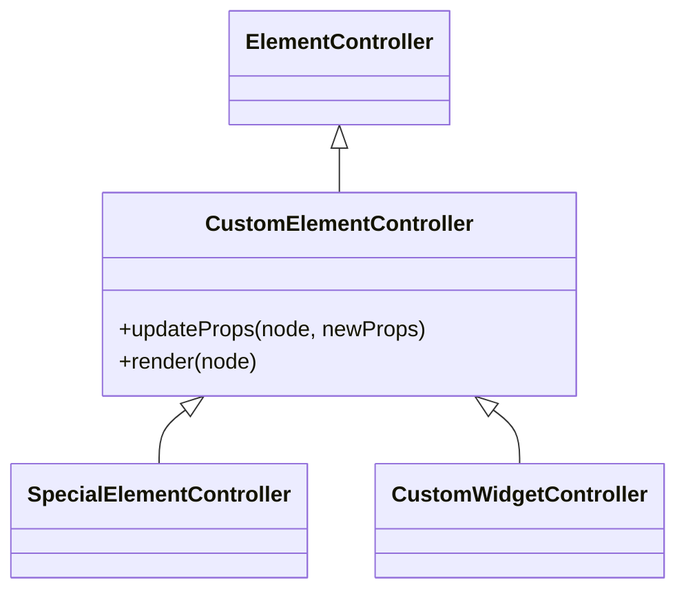

**Diagram sources**
- [ElementController.ts](file://packages/runtime-core/src/controllers/ElementController.ts#L46-L104)
- [BaseWidgetController.ts](file://packages/runtime-core/src/controllers/BaseWidgetController.ts#L47-L116)

**Section sources**
- [BaseWidgetController.ts](file://packages/runtime-core/src/controllers/BaseWidgetController.ts#L47-L116)
- [ElementController.ts](file://packages/runtime-core/src/controllers/ElementController.ts#L46-L104)