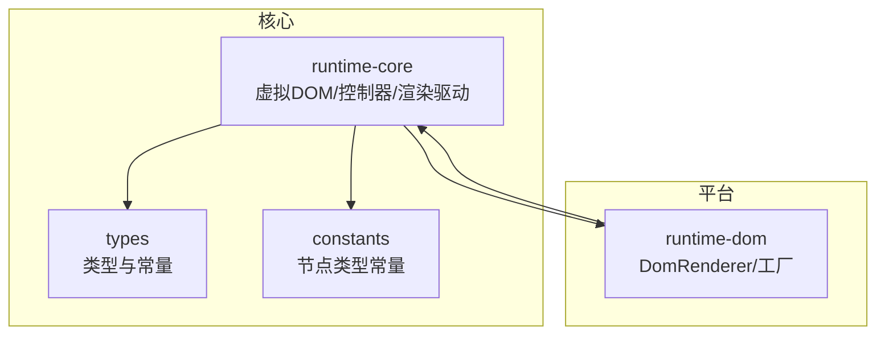
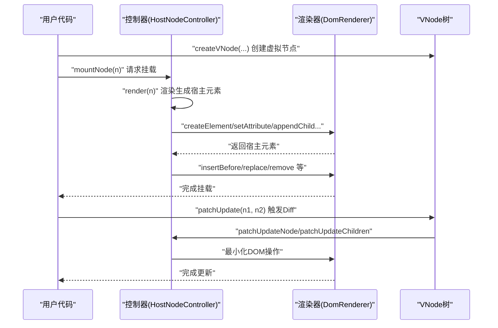
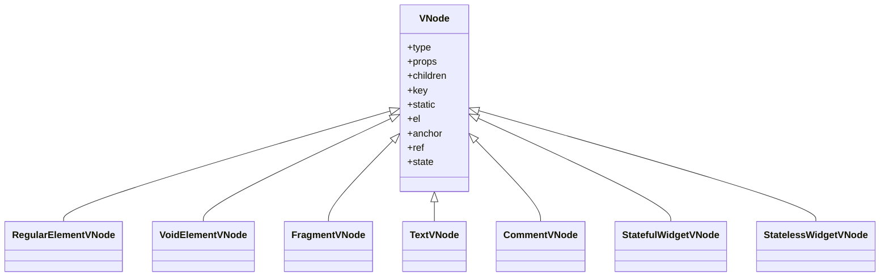
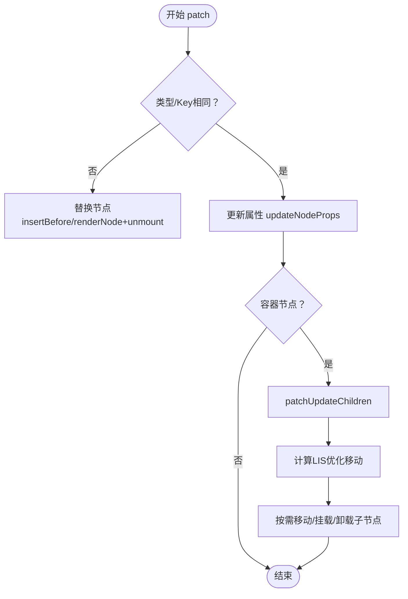
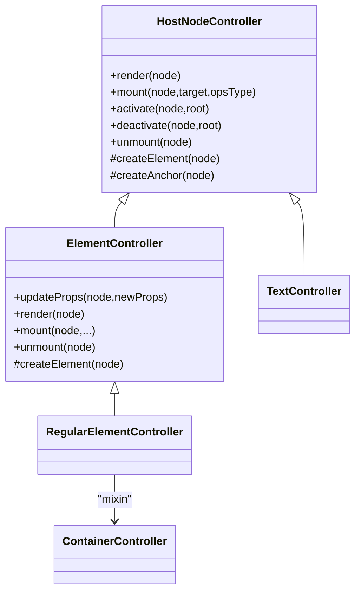
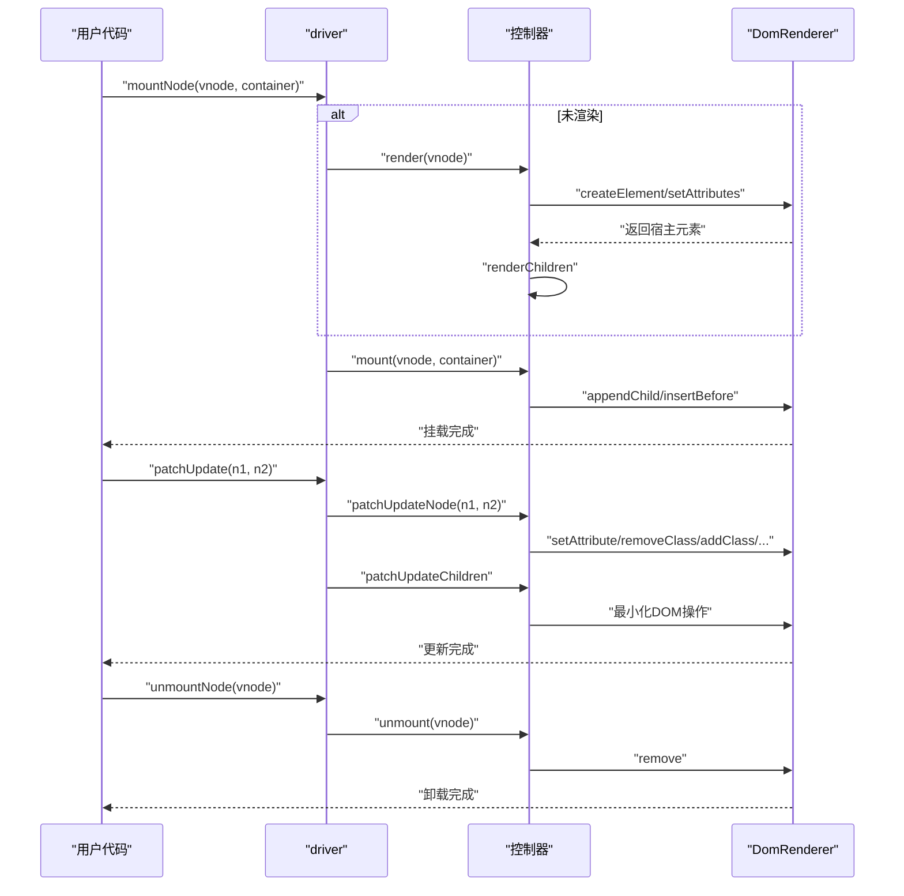
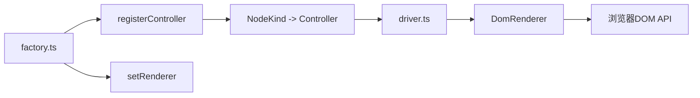

# 虚拟DOM与渲染

<cite>
**本文引用的文件**
- [packages/runtime-core/src/vnode/index.ts](file://packages/runtime-core/src/vnode/index.ts)
- [packages/runtime-core/src/vnode/core/create.ts](file://packages/runtime-core/src/vnode/core/create.ts)
- [packages/runtime-core/src/vnode/core/update.ts](file://packages/runtime-core/src/vnode/core/update.ts)
- [packages/runtime-core/src/vnode/core/driver.ts](file://packages/runtime-core/src/vnode/core/driver.ts)
- [packages/runtime-core/src/vnode/creator/element.ts](file://packages/runtime-core/src/vnode/creator/element.ts)
- [packages/runtime-core/src/types/vnode.ts](file://packages/runtime-core/src/types/vnode.ts)
- [packages/runtime-core/src/types/nodes/index.ts](file://packages/runtime-core/src/types/nodes/index.ts)
- [packages/runtime-core/src/constants/nodeTypes.ts](file://packages/runtime-core/src/constants/nodeTypes.ts)
- [packages/runtime-core/src/controllers/HostNodeController.ts](file://packages/runtime-core/src/controllers/HostNodeController.ts)
- [packages/runtime-core/src/controllers/ElementController.ts](file://packages/runtime-core/src/controllers/ElementController.ts)
- [packages/runtime-core/src/controllers/RegularElementController.ts](file://packages/runtime-core/src/controllers/RegularElementController.ts)
- [packages/runtime-core/src/controllers/ContainerController.ts](file://packages/runtime-core/src/controllers/ContainerController.ts)
- [packages/runtime-core/src/controllers/TextController.ts](file://packages/runtime-core/src/controllers/TextController.ts)
- [packages/runtime-core/src/controllers/index.ts](file://packages/runtime-core/src/controllers/index.ts)
- [packages/runtime-core/src/renderer/api.ts](file://packages/runtime-core/src/renderer/api.ts)
- [packages/runtime-dom/src/client/DomRenderer.ts](file://packages/runtime-dom/src/client/DomRenderer.ts)
- [packages/runtime-dom/src/client/factory.ts](file://packages/runtime-dom/src/client/factory.ts)
</cite>

## 目录
1. [简介](#简介)
2. [项目结构](#项目结构)
3. [核心组件](#核心组件)
4. [架构总览](#架构总览)
5. [详细组件分析](#详细组件分析)
6. [依赖分析](#依赖分析)
7. [性能考量](#性能考量)
8. [故障排查指南](#故障排查指南)
9. [结论](#结论)

## 简介
本架构文档聚焦于 vitarx 的虚拟DOM与渲染机制，系统性阐述 VNode 数据结构设计、Diff 算法实现、节点控制器（Controller）模式、从 VNode 到真实 DOM 的完整渲染流程，以及 runtime-dom 包如何作为平台特定渲染器实现 DOM 操作。目标是帮助读者在不深入源码细节的前提下，理解框架如何通过“虚拟节点 + 控制器 + 平台渲染器”的分层设计，高效地最小化真实 DOM 操作，实现高性能的 UI 更新。

## 项目结构
vitarx 采用多包协作的组织方式：
- runtime-core：核心虚拟DOM、控制器、渲染驱动、类型与常量定义
- runtime-dom：浏览器平台的 DOM 渲染器与工厂
- responsive：响应式能力（信号、计算属性、调度等）
- utils：通用工具库
- vitarx：顶层入口与 JSX 运行时

下面的图展示了与本文主题最相关的模块关系。

图表来源
- [packages/runtime-core/src/vnode/index.ts](file://packages/runtime-core/src/vnode/index.ts#L1-L8)
- [packages/runtime-core/src/types/vnode.ts](file://packages/runtime-core/src/types/vnode.ts#L1-L177)
- [packages/runtime-core/src/constants/nodeTypes.ts](file://packages/runtime-core/src/constants/nodeTypes.ts#L1-L99)
- [packages/runtime-dom/src/client/DomRenderer.ts](file://packages/runtime-dom/src/client/DomRenderer.ts#L1-L573)
- [packages/runtime-dom/src/client/factory.ts](file://packages/runtime-dom/src/client/factory.ts#L1-L39)

章节来源
- [packages/runtime-core/src/vnode/index.ts](file://packages/runtime-core/src/vnode/index.ts#L1-L8)
- [packages/runtime-core/src/types/vnode.ts](file://packages/runtime-core/src/types/vnode.ts#L1-L177)
- [packages/runtime-core/src/constants/nodeTypes.ts](file://packages/runtime-core/src/constants/nodeTypes.ts#L1-L99)
- [packages/runtime-dom/src/client/DomRenderer.ts](file://packages/runtime-dom/src/client/DomRenderer.ts#L1-L573)
- [packages/runtime-dom/src/client/factory.ts](file://packages/runtime-dom/src/client/factory.ts#L1-L39)

## 核心组件
- 虚拟节点（VNode）：统一承载节点类型、属性、子节点、状态与宿主元素引用，是渲染与 Diff 的最小单元。
- 控制器（Controller）：按节点类型分派具体渲染、挂载、更新、卸载逻辑，实现“面向类型”的职责分离。
- 平台渲染器（DomRenderer）：封装浏览器 DOM 操作，提供属性、样式、事件、插入/替换/移除等统一接口。
- 渲染驱动（driver）：对外暴露 mountNode/renderNode/unmountNode 等高层 API，协调控制器与渲染器。

章节来源
- [packages/runtime-core/src/vnode/core/create.ts](file://packages/runtime-core/src/vnode/core/create.ts#L90-L150)
- [packages/runtime-core/src/vnode/core/driver.ts](file://packages/runtime-core/src/vnode/core/driver.ts#L41-L124)
- [packages/runtime-core/src/controllers/HostNodeController.ts](file://packages/runtime-core/src/controllers/HostNodeController.ts#L1-L127)
- [packages/runtime-dom/src/client/DomRenderer.ts](file://packages/runtime-dom/src/client/DomRenderer.ts#L62-L120)

## 架构总览
vitarx 的渲染路径由“创建 VNode → 渲染/挂载 → 更新（Diff）→ 卸载”构成。核心流程如下：

图表来源
- [packages/runtime-core/src/vnode/core/driver.ts](file://packages/runtime-core/src/vnode/core/driver.ts#L57-L124)
- [packages/runtime-core/src/controllers/HostNodeController.ts](file://packages/runtime-core/src/controllers/HostNodeController.ts#L36-L93)
- [packages/runtime-dom/src/client/DomRenderer.ts](file://packages/runtime-dom/src/client/DomRenderer.ts#L62-L120)
- [packages/runtime-core/src/vnode/core/update.ts](file://packages/runtime-core/src/vnode/core/update.ts#L53-L151)

## 详细组件分析

### VNode 数据结构设计
- 节点类型与种类
  - 通过常量与类型映射定义多种节点类型（元素、片段、文本、注释、有状态/无状态组件），并以 kind 字段区分。
  - 有效节点类型与实例类型推导，保证 createVNode 的类型安全与 JSX 友好。
- 虚拟节点属性
  - props、children、key、static、el、anchor、ref 等字段贯穿生命周期。
  - 开发模式下可携带调试信息，辅助定位问题。
- 节点创建
  - createVNode 根据 type 分支：动态渲染、文本/注释/片段、常规/空元素、组件等，分别委托到对应创建器。
  - 子节点规范化与 SVG 命名空间传播在创建阶段完成。

图表来源
- [packages/runtime-core/src/types/nodes/index.ts](file://packages/runtime-core/src/types/nodes/index.ts#L1-L9)
- [packages/runtime-core/src/types/vnode.ts](file://packages/runtime-core/src/types/vnode.ts#L86-L177)
- [packages/runtime-core/src/vnode/creator/element.ts](file://packages/runtime-core/src/vnode/creator/element.ts#L1-L69)

章节来源
- [packages/runtime-core/src/constants/nodeTypes.ts](file://packages/runtime-core/src/constants/nodeTypes.ts#L1-L99)
- [packages/runtime-core/src/types/vnode.ts](file://packages/runtime-core/src/types/vnode.ts#L1-L177)
- [packages/runtime-core/src/vnode/creator/element.ts](file://packages/runtime-core/src/vnode/creator/element.ts#L1-L69)
- [packages/runtime-core/src/vnode/core/create.ts](file://packages/runtime-core/src/vnode/core/create.ts#L90-L150)

### Diff 算法与 PatchUpdate
- 整体策略
  - 若节点类型或 key 不同，直接替换；否则进入属性与子节点更新。
  - 静态节点跳过更新，减少开销。
- 属性更新
  - 通过 updateNodeProps 调用对应控制器的 updateProps，实现细粒度属性变更（如元素属性、文本值等）。
- 子节点更新（patchUpdateChildren）
  - 关键优化：基于 key 的匹配 + 最长递增子序列（LIS）确定最少移动。
  - 边界处理：新旧子节点为空的快速路径。
  - DOM 操作最小化：仅在必要时 insertBefore/appendChild，避免无谓重排。
- 替换策略（replace）
  - 依据旧节点是否已挂载，选择 insertBefore 或 renderNode+unmount 的策略，保证 DOM 位置不变。

图表来源
- [packages/runtime-core/src/vnode/core/update.ts](file://packages/runtime-core/src/vnode/core/update.ts#L53-L151)
- [packages/runtime-core/src/vnode/core/update.ts](file://packages/runtime-core/src/vnode/core/update.ts#L170-L248)
- [packages/runtime-core/src/vnode/core/update.ts](file://packages/runtime-core/src/vnode/core/update.ts#L250-L378)

章节来源
- [packages/runtime-core/src/vnode/core/update.ts](file://packages/runtime-core/src/vnode/core/update.ts#L42-L390)

### 节点控制器（Controller）模式
- HostNodeController 抽象基类
  - 统一生命周期：render/mount/activate/deactivate/unmount。
  - 统一 DOM 操作：通过 useRenderer 获取平台渲染器，执行插入、替换、移除等。
  - 锚点机制：通过 createAnchor 为停用节点创建注释锚点，便于后续替换。
- ElementController
  - 专用于元素节点的属性更新：对比新旧属性，删除不存在的、新增/更新存在的，调用渲染器 setAttribute/removeAttribute。
  - 生命周期钩子：在 render/mount/unmount 前后调用指令钩子，便于扩展。
- RegularElementController
  - 继承 ElementController，并通过 mixinContainerController 混入容器子节点处理（渲染/挂载/激活/停用/卸载）。
- TextController
  - 专用于文本节点，创建文本元素并处理值更新。
- 控制器注册
  - runtime-dom 的 factory 在启动时注册各类控制器与渲染器，形成“类型→控制器”的映射。

图表来源
- [packages/runtime-core/src/controllers/HostNodeController.ts](file://packages/runtime-core/src/controllers/HostNodeController.ts#L1-L127)
- [packages/runtime-core/src/controllers/ElementController.ts](file://packages/runtime-core/src/controllers/ElementController.ts#L46-L104)
- [packages/runtime-core/src/controllers/RegularElementController.ts](file://packages/runtime-core/src/controllers/RegularElementController.ts#L1-L33)
- [packages/runtime-core/src/controllers/TextController.ts](file://packages/runtime-core/src/controllers/TextController.ts#L1-L31)
- [packages/runtime-core/src/controllers/ContainerController.ts](file://packages/runtime-core/src/controllers/ContainerController.ts#L1-L59)
- [packages/runtime-dom/src/client/factory.ts](file://packages/runtime-dom/src/client/factory.ts#L1-L39)

章节来源
- [packages/runtime-core/src/controllers/HostNodeController.ts](file://packages/runtime-core/src/controllers/HostNodeController.ts#L1-L127)
- [packages/runtime-core/src/controllers/ElementController.ts](file://packages/runtime-core/src/controllers/ElementController.ts#L46-L104)
- [packages/runtime-core/src/controllers/RegularElementController.ts](file://packages/runtime-core/src/controllers/RegularElementController.ts#L1-L33)
- [packages/runtime-core/src/controllers/TextController.ts](file://packages/runtime-core/src/controllers/TextController.ts#L1-L31)
- [packages/runtime-core/src/controllers/ContainerController.ts](file://packages/runtime-core/src/controllers/ContainerController.ts#L1-L59)
- [packages/runtime-core/src/controllers/index.ts](file://packages/runtime-core/src/controllers/index.ts#L1-L18)
- [packages/runtime-dom/src/client/factory.ts](file://packages/runtime-dom/src/client/factory.ts#L1-L39)

### 从 VNode 到真实 DOM 的渲染流程
- 挂载（mountNode）
  - 若节点未渲染，先 renderNode（调用对应控制器 render，创建宿主元素并渲染子节点）。
  - 再由控制器 mount，将元素插入目标容器，激活子节点。
- 更新（patch）
  - PatchUpdate.patch 比较类型与 key，不同则 replace；相同则 patchUpdateNode。
  - patchUpdateNode 更新属性与子节点，容器节点走 patchUpdateChildren。
- 卸载（unmountNode）
  - 逐层卸载子节点，清理 ref 与 el/anchor，设置 Unmounted 状态。

图表来源
- [packages/runtime-core/src/vnode/core/driver.ts](file://packages/runtime-core/src/vnode/core/driver.ts#L57-L124)
- [packages/runtime-core/src/vnode/core/update.ts](file://packages/runtime-core/src/vnode/core/update.ts#L53-L151)
- [packages/runtime-core/src/controllers/HostNodeController.ts](file://packages/runtime-core/src/controllers/HostNodeController.ts#L36-L93)
- [packages/runtime-dom/src/client/DomRenderer.ts](file://packages/runtime-dom/src/client/DomRenderer.ts#L62-L120)

章节来源
- [packages/runtime-core/src/vnode/core/driver.ts](file://packages/runtime-core/src/vnode/core/driver.ts#L41-L124)
- [packages/runtime-core/src/vnode/core/update.ts](file://packages/runtime-core/src/vnode/core/update.ts#L42-L151)
- [packages/runtime-core/src/controllers/HostNodeController.ts](file://packages/runtime-core/src/controllers/HostNodeController.ts#L36-L93)

### runtime-dom 作为平台渲染器
- DomRenderer
  - 统一封装浏览器 DOM 操作：创建元素/文本/注释/片段、插入/替换/移除、属性/样式/类名/事件、查询等。
  - 特殊处理：void 元素、SVG 命名空间、事件选项（capture/once/passive）、动画/过渡时长计算。
  - 片段节点：通过 start/end 注释锚点维护子树，兼容首次插入与恢复。
- 工厂与注册
  - factory 中 setRenderer(new DomRenderer()) 注册渲染器，并注册各类 NodeKind→Controller 映射，形成完整的渲染管线。

章节来源
- [packages/runtime-dom/src/client/DomRenderer.ts](file://packages/runtime-dom/src/client/DomRenderer.ts#L1-L573)
- [packages/runtime-dom/src/client/factory.ts](file://packages/runtime-dom/src/client/factory.ts#L1-L39)
- [packages/runtime-core/src/renderer/api.ts](file://packages/runtime-core/src/renderer/api.ts#L1-L28)

## 依赖分析
- 控制器与渲染器
  - 控制器通过 useRenderer 获取渲染器实例，所有 DOM 操作集中在渲染器中，降低控制器耦合。
- 节点类型与控制器映射
  - 通过 registerController 将 NodeKind 与控制器实例绑定，驱动层按 kind 分发。
- 平台特定实现
  - runtime-dom 仅在浏览器环境下工作，提供 DOM API 的适配层；若需其他平台，只需实现 HostRenderer 接口并注册。

图表来源
- [packages/runtime-dom/src/client/factory.ts](file://packages/runtime-dom/src/client/factory.ts#L1-L39)
- [packages/runtime-core/src/vnode/core/driver.ts](file://packages/runtime-core/src/vnode/core/driver.ts#L22-L33)
- [packages/runtime-core/src/renderer/api.ts](file://packages/runtime-core/src/renderer/api.ts#L1-L28)
- [packages/runtime-dom/src/client/DomRenderer.ts](file://packages/runtime-dom/src/client/DomRenderer.ts#L62-L120)

章节来源
- [packages/runtime-dom/src/client/factory.ts](file://packages/runtime-dom/src/client/factory.ts#L1-L39)
- [packages/runtime-core/src/vnode/core/driver.ts](file://packages/runtime-core/src/vnode/core/driver.ts#L17-L33)
- [packages/runtime-core/src/renderer/api.ts](file://packages/runtime-core/src/renderer/api.ts#L1-L28)

## 性能考量
- 最小化 DOM 操作
  - 通过 key 匹配与 LIS 优化，减少节点移动次数。
  - 静态节点跳过更新，避免不必要的属性与子树处理。
- 属性更新的细粒度
  - 元素属性更新仅对变化项生效，避免重复设置。
- 片段与锚点
  - 片段节点通过注释锚点维护，避免重建整个子树。
- 事件与样式
  - 事件绑定/解绑按需进行，样式批量设置与移除，减少重排/重绘。

[本节为通用性能建议，无需列出章节来源]

## 故障排查指南
- 未注册渲染器
  - 现象：调用渲染器相关方法时报错。
  - 处理：确保在应用启动时调用 setRenderer 并注册控制器。
- 节点替换失败
  - 现象：replace 抛出“旧节点未挂载且无法替换”错误。
  - 处理：确认旧节点已挂载到 DOM，或改为 renderNode+unmount 的组合策略。
- 子节点更新异常
  - 现象：列表顺序错乱或重复节点闪烁。
  - 处理：为可复用子节点提供稳定 key，避免使用索引作为 key。
- 事件绑定问题
  - 现象：事件未触发或重复绑定。
  - 处理：检查事件属性命名与选项（capture/once/passive），确保同一事件处理器不被重复绑定。

章节来源
- [packages/runtime-core/src/renderer/api.ts](file://packages/runtime-core/src/renderer/api.ts#L1-L28)
- [packages/runtime-core/src/vnode/core/update.ts](file://packages/runtime-core/src/vnode/core/update.ts#L133-L151)
- [packages/runtime-dom/src/client/DomRenderer.ts](file://packages/runtime-dom/src/client/DomRenderer.ts#L258-L350)

## 结论
vitarx 通过清晰的分层设计实现了高性能的虚拟DOM渲染：VNode 作为统一载体，控制器按类型分发职责，runtime-dom 提供平台化的 DOM 操作，driver 将生命周期与 Diff 流程串联起来。Diff 算法在子节点层面采用 key 匹配与 LIS 优化，结合属性更新的细粒度控制，显著降低了真实 DOM 操作次数，提升了渲染效率。借助控制器与渲染器的解耦，框架具备良好的可扩展性与跨平台潜力。