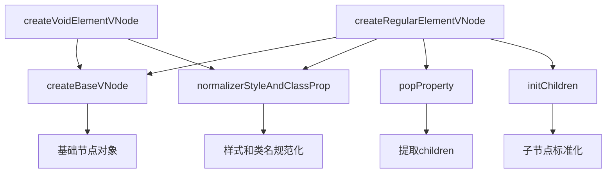
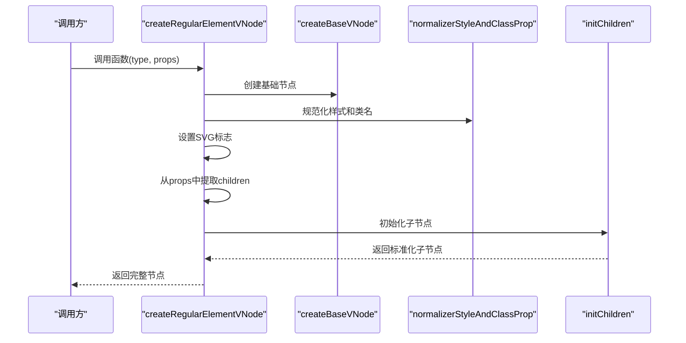
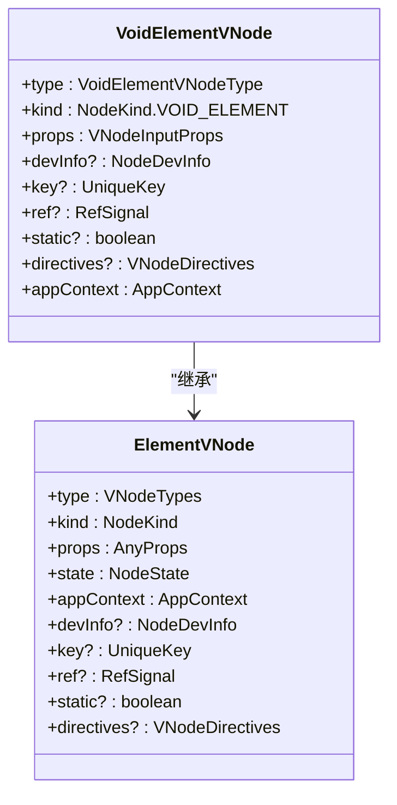
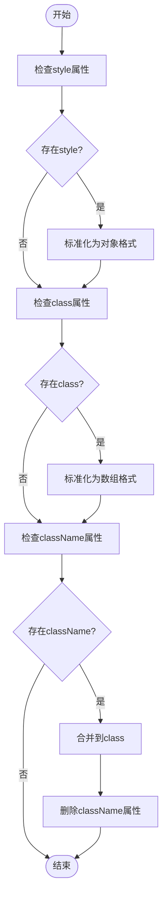
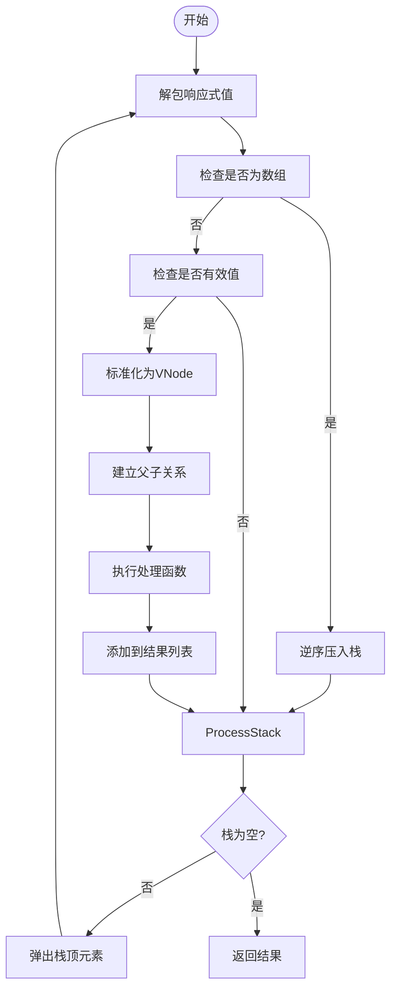
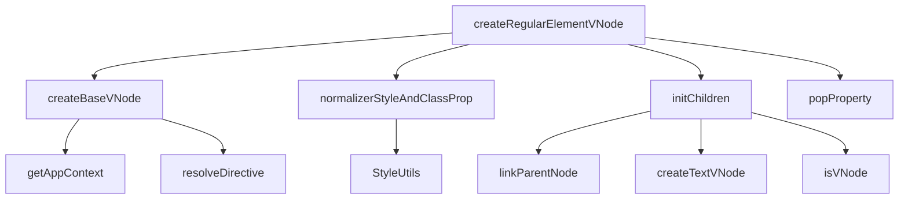

# 元素节点创建

<cite>
**本文档引用文件**  
- [element.ts](file://packages/runtime-core/src/vnode/creator/element.ts)
- [RegularElementVNode.ts](file://packages/runtime-core/src/types/nodes/RegularElementVNode.ts)
- [VoidElementVNode.ts](file://packages/runtime-core/src/types/nodes/VoidElementVNode.ts)
- [nodeKind.ts](file://packages/runtime-core/src/constants/nodeKind.ts)
- [props.ts](file://packages/runtime-core/src/vnode/normalizer/props.ts)
- [children.ts](file://packages/runtime-core/src/vnode/normalizer/children.ts)
- [base.ts](file://packages/runtime-core/src/vnode/creator/base.ts)
- [element.test.ts](file://packages/runtime-core/__tests__/vnode/creator/element.test.ts)
</cite>

## 目录
1. [简介](#简介)
2. [核心组件](#核心组件)
3. [架构概述](#架构概述)
4. [详细组件分析](#详细组件分析)
5. [依赖分析](#依赖分析)
6. [性能考虑](#性能考虑)
7. [故障排除指南](#故障排除指南)
8. [结论](#结论)

## 简介
本文档深入解析vitarx框架中元素节点的创建机制，重点分析`createRegularElementVNode`和`createVoidElementVNode`两个核心函数的实现原理。文档将阐述普通元素节点与自闭合元素节点在虚拟DOM中的区别处理方式，包括属性规范化、子节点支持、节点类型判断等关键逻辑。通过代码示例展示如何创建div、span等常规元素和img、br等自闭合元素，并说明其在渲染过程中的处理差异。

## 核心组件
本节分析vitarx框架中元素节点创建的核心组件，重点关注`createRegularElementVNode`和`createVoidElementVNode`函数的实现机制。这两个函数分别负责创建可包含子节点的常规元素和不能有子节点的自闭合元素，是虚拟DOM构建的基础。

**节段来源**
- [element.ts](file://packages/runtime-core/src/vnode/creator/element.ts#L26-L68)

## 架构概述
vitarx框架的元素节点创建遵循分层架构设计，通过不同层级的函数协作完成节点的完整构建。基础节点创建、属性处理和子节点初始化被分离到不同的模块中，实现了关注点分离和代码复用。

**图示来源**
- [element.ts](file://packages/runtime-core/src/vnode/creator/element.ts#L26-L68)
- [base.ts](file://packages/runtime-core/src/vnode/creator/base.ts#L22-L117)
- [props.ts](file://packages/runtime-core/src/vnode/normalizer/props.ts#L97-L122)
- [children.ts](file://packages/runtime-core/src/vnode/normalizer/children.ts#L105-L147)

## 详细组件分析
本节对元素节点创建的关键组件进行深入分析，包括普通元素节点和自闭合元素节点的创建过程、属性处理机制以及子节点支持。

### 普通元素节点分析
`createRegularElementVNode`函数用于创建可以包含子节点的HTML元素，如div、span、p等。该函数不仅创建基础节点，还负责处理子节点的提取和初始化。

**图示来源**
- [element.ts](file://packages/runtime-core/src/vnode/creator/element.ts#L47-L67)
- [children.ts](file://packages/runtime-core/src/vnode/normalizer/children.ts#L105-L147)

**节段来源**
- [element.ts](file://packages/runtime-core/src/vnode/creator/element.ts#L47-L67)
- [RegularElementVNode.ts](file://packages/runtime-core/src/types/nodes/RegularElementVNode.ts#L16-L18)

### 自闭合元素节点分析
`createVoidElementVNode`函数专门用于创建自闭合的HTML元素，如img、input、br、hr等。这些元素在HTML中不能有子节点，也没有结束标签。

**图示来源**
- [element.ts](file://packages/runtime-core/src/vnode/creator/element.ts#L26-L33)
- [VoidElementVNode.ts](file://packages/runtime-core/src/types/nodes/VoidElementVNode.ts#L16-L17)

**节段来源**
- [element.ts](file://packages/runtime-core/src/vnode/creator/element.ts#L26-L33)
- [VoidElementVNode.ts](file://packages/runtime-core/src/types/nodes/VoidElementVNode.ts#L16-L17)

### 属性处理机制
vitarx框架对元素属性进行规范化处理，确保样式和类名属性以统一的格式存储，便于后续的DOM操作。

**图示来源**
- [props.ts](file://packages/runtime-core/src/vnode/normalizer/props.ts#L97-L122)

**节段来源**
- [props.ts](file://packages/runtime-core/src/vnode/normalizer/props.ts#L97-L122)

### 子节点处理机制
对于可包含子节点的元素，vitarx框架提供了一套完整的子节点处理机制，支持多种类型的子节点输入并进行标准化。

**图示来源**
- [children.ts](file://packages/runtime-core/src/vnode/normalizer/children.ts#L105-L147)

**节段来源**
- [children.ts](file://packages/runtime-core/src/vnode/normalizer/children.ts#L105-L147)

## 依赖分析
元素节点创建功能依赖于多个核心模块，这些模块共同协作完成节点的完整构建。

**图示来源**
- [element.ts](file://packages/runtime-core/src/vnode/creator/element.ts#L26-L68)
- [base.ts](file://packages/runtime-core/src/vnode/creator/base.ts#L22-L117)
- [props.ts](file://packages/runtime-core/src/vnode/normalizer/props.ts#L97-L122)
- [children.ts](file://packages/runtime-core/src/vnode/normalizer/children.ts#L105-L147)

**节段来源**
- [element.ts](file://packages/runtime-core/src/vnode/creator/element.ts#L1-L68)
- [base.ts](file://packages/runtime-core/src/vnode/creator/base.ts#L1-L117)

## 性能考虑
vitarx框架在元素节点创建过程中考虑了多项性能优化：

1. **迭代而非递归**：子节点处理使用迭代方式而非递归，避免深度嵌套时的栈溢出问题
2. **属性合并优化**：特殊属性（如style、class）使用专门的合并函数，避免简单覆盖
3. **响应式值解包**：在节点创建初期就解包响应式值，减少后续操作的开销
4. **集合查找优化**：使用Set数据结构进行重复key检查，提高查找效率

## 故障排除指南
在使用元素节点创建功能时可能遇到的常见问题及解决方案：

**节段来源**
- [element.test.ts](file://packages/runtime-core/__tests__/vnode/creator/element.test.ts#L1-L234)
- [props.ts](file://packages/runtime-core/src/vnode/normalizer/props.ts#L45-L56)

## 结论
vitarx框架通过`createRegularElementVNode`和`createVoidElementVNode`两个函数实现了对HTML元素节点的精确建模。框架清晰地区分了可包含子节点的常规元素和自闭合的空元素，在虚拟DOM层面准确反映了HTML标准的语义。通过分层架构设计，将基础节点创建、属性处理和子节点初始化分离到不同模块，实现了代码的高内聚低耦合。属性规范化和子节点标准化机制确保了数据的一致性和可预测性，为高效的DOM更新奠定了基础。