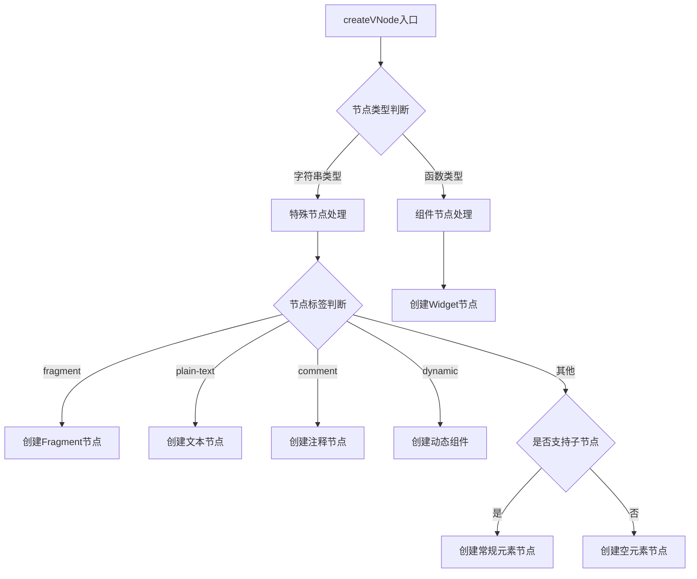
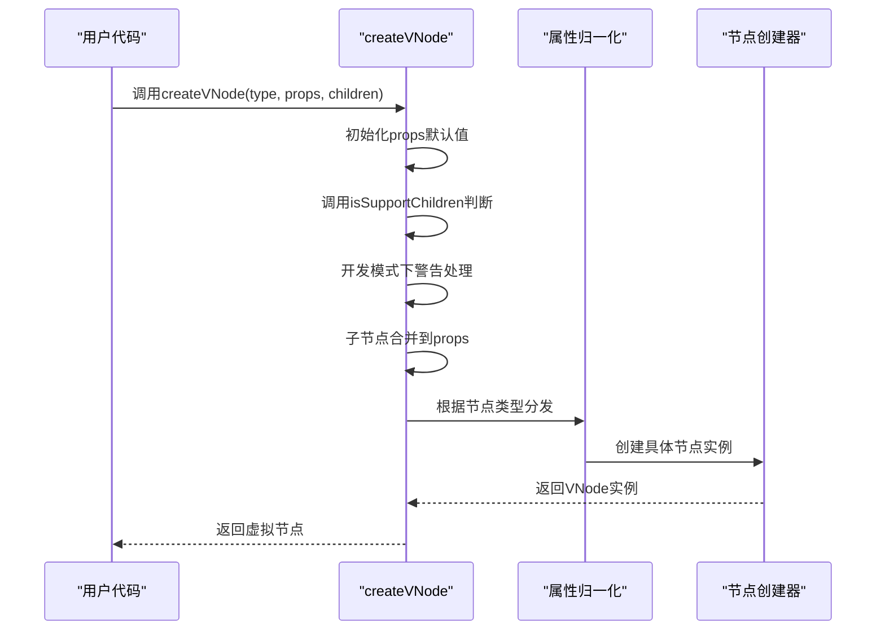
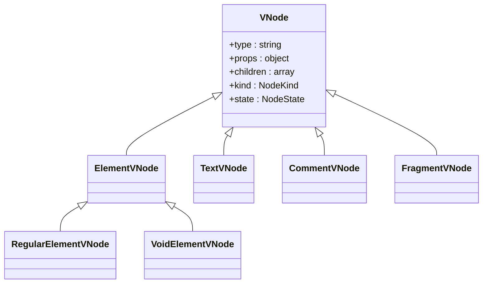
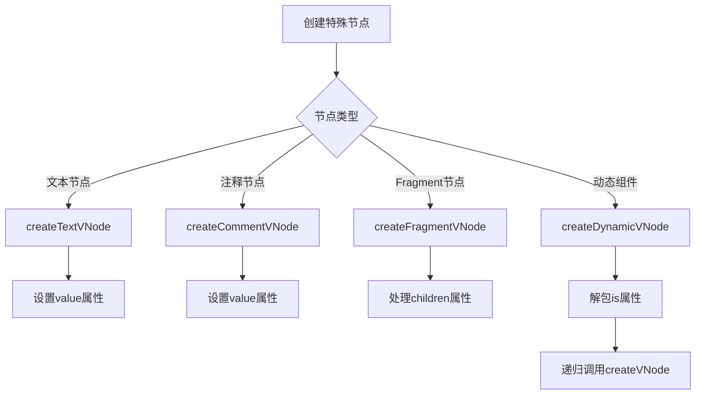
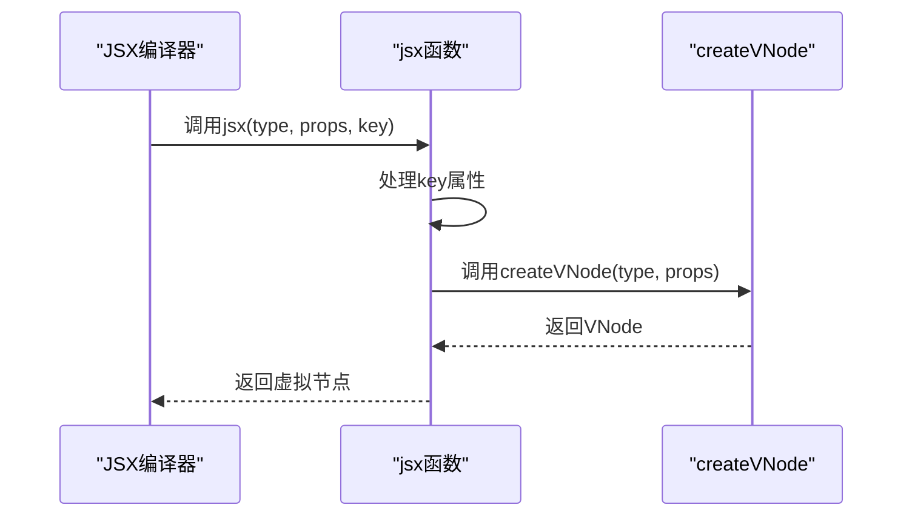
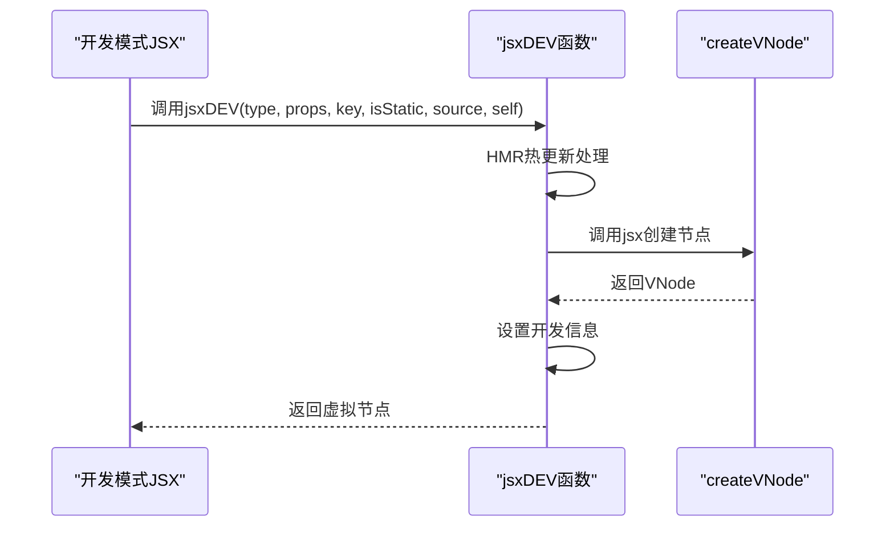

# 基础虚拟节点创建

<cite>
**本文档引用的文件**   
- [create.ts](file://packages/runtime-core/src/vnode/core/create.ts#L90-L149)
- [props.ts](file://packages/runtime-core/src/vnode/normalizer/props.ts#L131-L145)
- [jsx-runtime.ts](file://packages/vitarx/src/jsx-runtime.ts#L15-L30)
- [jsx-dev-runtime.ts](file://packages/vitarx/src/jsx-dev-runtime.ts#L24-L44)
- [nodeTypes.ts](file://packages/runtime-core/src/constants/nodeTypes.ts#L9-L98)
- [base.ts](file://packages/runtime-core/src/vnode/creator/base.ts#L22-L117)
- [element.ts](file://packages/runtime-core/src/vnode/creator/element.ts#L26-L68)
- [special.ts](file://packages/runtime-core/src/vnode/creator/special.ts#L1-L30)
- [widget.ts](file://packages/runtime-core/src/vnode/creator/widget.ts#L1-L20)
</cite>

## 目录
1. [核心虚拟节点创建机制](#核心虚拟节点创建机制)
2. [createVNode函数详解](#createvnode函数详解)
3. [参数处理流程](#参数处理流程)
4. [isSupportChildren函数解析](#issupportchildren函数解析)
5. [节点创建示例](#节点创建示例)
6. [JSX中的应用](#jsx中的应用)

## 核心虚拟节点创建机制

vitarx框架中的虚拟节点创建机制是整个框架的核心基础，通过`createVNode`函数实现虚拟DOM的构建。该机制负责将不同类型的节点（HTML元素、组件、文本、注释等）转换为统一的虚拟节点对象，为后续的渲染和更新提供基础数据结构。



**Diagram sources**
- [create.ts](file://packages/runtime-core/src/vnode/core/create.ts#L90-L149)

**Section sources**
- [create.ts](file://packages/runtime-core/src/vnode/core/create.ts#L90-L149)

## createVNode函数详解

`createVNode`函数是vitarx框架中创建虚拟节点的核心入口函数，定义在`packages/runtime-core/src/vnode/core/create.ts`文件中。该函数作为虚拟DOM创建的统一接口，负责处理各种类型的节点创建逻辑。



**Diagram sources**
- [create.ts](file://packages/runtime-core/src/vnode/core/create.ts#L90-L149)

**Section sources**
- [create.ts](file://packages/runtime-core/src/vnode/core/create.ts#L90-L149)

## 参数处理流程

`createVNode`函数接收三个主要参数：`type`、`props`和`children`，每个参数都有特定的处理流程。

### type参数处理

`type`参数决定了虚拟节点的类型，可以是字符串（表示HTML元素或特殊节点）或函数（表示组件）。根据`type`的不同值，`createVNode`会调用不同的创建函数：

- 当`type`为`'fragment'`时，创建Fragment节点
- 当`type`为`'plain-text'`时，创建文本节点
- 当`type`为`'comment'`时，创建注释节点
- 当`type`为`'dynamic'`时，创建动态组件
- 当`type`为其他字符串时，根据是否支持子节点创建常规元素或空元素节点
- 当`type`为函数时，创建Widget节点

### props参数处理

`props`参数的处理流程包括：

1. **默认值初始化**：如果`props`为`null`或`undefined`，则初始化为空对象
2. **子节点支持检查**：调用`isSupportChildren`函数判断节点类型是否支持子节点
3. **开发模式警告**：在开发模式下，如果节点不支持子节点但`props`中包含`children`属性，则发出警告并删除该属性
4. **子节点合并**：如果节点支持子节点且有传入的`children`参数，则将`children`合并到`props.children`中

```mermaid
flowchart TD
A[开始] --> B[props ??= {}]
B --> C[调用isSupportChildren(type)]
C --> D{支持子节点?}
D --> |否| E{开发模式?}
E --> |是| F[检查props.children]
F --> G{存在children?}
G --> |是| H[发出警告并删除]
G --> |否| I[继续]
F --> I
E --> I
D --> |是| J{children.length > 0?}
J --> |是| K[合并children到props]
J --> |否| I
K --> I
I --> L[根据type创建节点]
```

**Diagram sources**
- [create.ts](file://packages/runtime-core/src/vnode/core/create.ts#L95-L110)

**Section sources**
- [create.ts](file://packages/runtime-core/src/vnode/core/create.ts#L95-L110)

## isSupportChildren函数解析

`isSupportChildren`函数用于判断特定类型的节点是否支持子节点，定义在`packages/runtime-core/src/vnode/normalizer/props.ts`文件中。

```mermaid
flowchart TD
A[isSupportChildren函数] --> B{type是否为字符串?}
B --> |否| C[返回true]
B --> |是| D{type值判断}
D --> |'comment'| E[返回false]
D --> |'plain-text'| F[返回false]
D --> |'fragment'| G[返回true]
D --> |'dynamic'| H[返回true]
D --> |其他| I[调用useRenderer().isVoidElement]
I --> J{是否为void元素?}
J --> |是| K[返回false]
J --> |否| L[返回true]
```

该函数的逻辑如下：
- 对于字符串类型的节点：
  - `comment`和`plain-text`节点不支持子节点
  - `fragment`和`dynamic`节点支持子节点
  - 其他节点根据`useRenderer().isVoidElement`的返回值判断
- 对于非字符串类型的节点（如组件），默认支持子节点

**Diagram sources**
- [props.ts](file://packages/runtime-core/src/vnode/normalizer/props.ts#L131-L145)

**Section sources**
- [props.ts](file://packages/runtime-core/src/vnode/normalizer/props.ts#L131-L145)

## 节点创建示例

以下是使用`createVNode`创建不同类型节点的代码示例：

### 创建HTML元素节点



**Diagram sources**
- [base.ts](file://packages/runtime-core/src/vnode/creator/base.ts#L22-L117)
- [element.ts](file://packages/runtime-core/src/vnode/creator/element.ts#L26-L68)

**Section sources**
- [create.ts](file://packages/runtime-core/src/vnode/core/create.ts#L112-L137)

### 创建特殊节点



**Diagram sources**
- [special.ts](file://packages/runtime-core/src/vnode/creator/special.ts#L1-L30)
- [create.ts](file://packages/runtime-core/src/vnode/core/create.ts#L116-L125)

**Section sources**
- [create.ts](file://packages/runtime-core/src/vnode/core/create.ts#L116-L125)

## JSX中的应用

`createVNode`函数通过`h`函数别名在JSX中使用，定义在`packages/vitarx/src/jsx-runtime.ts`文件中。



在开发模式下，`jsxDEV`函数提供了额外的调试信息：



**Diagram sources**
- [jsx-runtime.ts](file://packages/vitarx/src/jsx-runtime.ts#L15-L30)
- [jsx-dev-runtime.ts](file://packages/vitarx/src/jsx-dev-runtime.ts#L24-L44)

**Section sources**
- [jsx-runtime.ts](file://packages/vitarx/src/jsx-runtime.ts#L15-L30)
- [jsx-dev-runtime.ts](file://packages/vitarx/src/jsx-dev-runtime.ts#L24-L44)