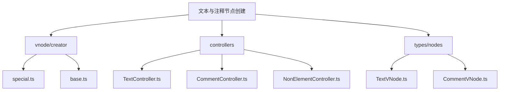
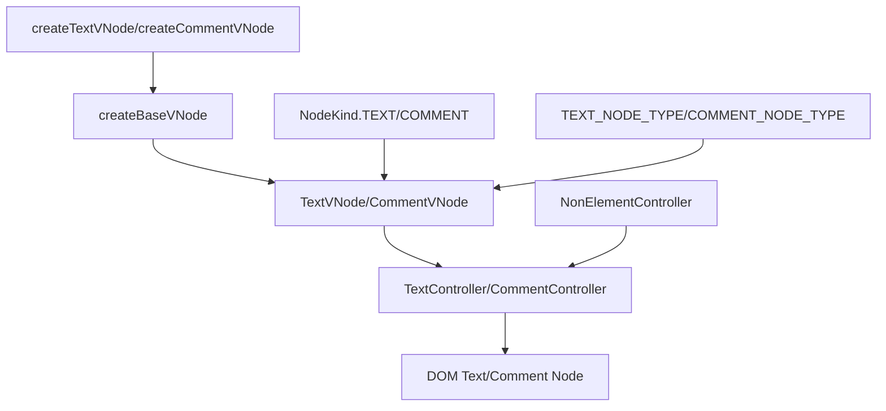
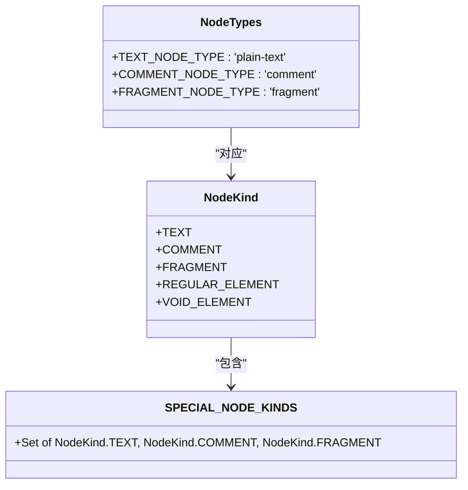
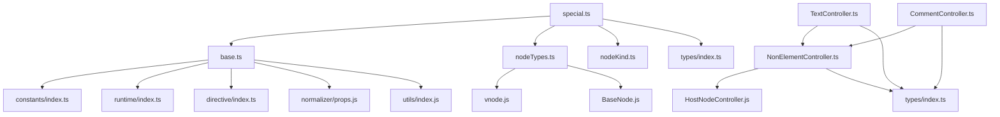

# 文本与注释节点创建

<cite>
**本文档引用的文件**   
- [special.ts](file://packages/runtime-core/src/vnode/creator/special.ts)
- [TextVNode.ts](file://packages/runtime-core/src/types/nodes/TextVNode.ts)
- [CommentVNode.ts](file://packages/runtime-core/src/types/nodes/CommentVNode.ts)
- [TextController.ts](file://packages/runtime-core/src/controllers/TextController.ts)
- [CommentController.ts](file://packages/runtime-core/src/controllers/CommentController.ts)
- [base.ts](file://packages/runtime-core/src/vnode/creator/base.ts)
- [nodeTypes.ts](file://packages/runtime-core/src/constants/nodeTypes.ts)
- [nodeKind.ts](file://packages/runtime-core/src/constants/nodeKind.ts)
- [NonElementController.ts](file://packages/runtime-core/src/controllers/NonElementController.ts)
- [special.test.ts](file://packages/runtime-core/__tests__/vnode/creator/special.test.ts)
- [text-comment.test.ts](file://packages/runtime-core/__tests__/controllers/text-comment.test.ts)
</cite>

## 目录
1. [项目结构](#项目结构)
2. [核心组件](#核心组件)
3. [架构概述](#架构概述)
4. [详细组件分析](#详细组件分析)
5. [依赖分析](#依赖分析)
6. [性能考虑](#性能考虑)
7. [故障排除指南](#故障排除指南)
8. [结论](#结论)

## 项目结构

vitarx框架中关于文本节点和注释节点的创建主要位于`runtime-core`包中，特别是`vnode/creator`和`controllers`目录下。文本节点和注释节点作为虚拟DOM中的特殊节点类型，其创建和管理机制与其他节点类型有所不同。



**图示来源**
- [special.ts](file://packages/runtime-core/src/vnode/creator/special.ts)
- [TextController.ts](file://packages/runtime-core/src/controllers/TextController.ts)
- [CommentController.ts](file://packages/runtime-core/src/controllers/CommentController.ts)

**本节来源**
- [special.ts](file://packages/runtime-core/src/vnode/creator/special.ts)
- [TextController.ts](file://packages/runtime-core/src/controllers/TextController.ts)
- [CommentController.ts](file://packages/runtime-core/src/controllers/CommentController.ts)

## 核心组件

文本节点和注释节点的创建主要通过`createTextVNode`和`createCommentVNode`两个函数实现，这两个函数位于`packages/runtime-core/src/vnode/creator/special.ts`文件中。它们都依赖于`createBaseVNode`函数来创建基础的虚拟节点。

文本节点和注释节点在虚拟DOM中被归类为特殊节点（Special Nodes），它们继承自`NonElementVNode`，表示它们不是DOM元素节点，而是特殊的文本内容节点。这些节点在渲染时会被转换为实际的DOM文本节点或注释节点。

**本节来源**
- [special.ts](file://packages/runtime-core/src/vnode/creator/special.ts)
- [base.ts](file://packages/runtime-core/src/vnode/creator/base.ts)

## 架构概述

vitarx框架中文本节点和注释节点的创建与管理遵循一个清晰的架构模式。创建过程从高层API开始，经过基础节点创建，最终由特定的控制器处理渲染。这种分层架构确保了代码的可维护性和扩展性。



**图示来源**
- [special.ts](file://packages/runtime-core/src/vnode/creator/special.ts)
- [base.ts](file://packages/runtime-core/src/vnode/creator/base.ts)
- [TextController.ts](file://packages/runtime-core/src/controllers/TextController.ts)
- [CommentController.ts](file://packages/runtime-core/src/controllers/CommentController.ts)

## 详细组件分析

### 文本节点创建分析

文本节点的创建过程涉及多个组件的协作。`createTextVNode`函数是创建文本节点的主要入口点，它调用`createBaseVNode`来创建基础虚拟节点，并设置适当的类型和种类。

```mermaid
classDiagram
class createTextVNode {
+createTextVNode(props : VNodeInputProps) : TextVNode
}
class createBaseVNode {
+createBaseVNode(type : VNodeTypes, kind : NodeKind, props : AnyProps) : VNode
}
class TextVNode {
+type : 'plain-text'
+kind : NodeKind.TEXT
+props : {value : any}
}
class TextController {
+render(node : TextVNode) : HostTextElement
+updateProps(node : HostVNode, newProps : AnyProps) : void
}
class NonElementController {
+updateProps(node : HostVNode, newProps : AnyProps) : void
}
createTextVNode --> createBaseVNode : "调用"
createBaseVNode --> TextVNode : "创建"
TextVNode --> TextController : "由...处理"
TextController --> NonElementController : "继承"
```

**图示来源**
- [special.ts](file://packages/runtime-core/src/vnode/creator/special.ts#L19-L21)
- [base.ts](file://packages/runtime-core/src/vnode/creator/base.ts#L22-L117)
- [TextVNode.ts](file://packages/runtime-core/src/types/nodes/TextVNode.ts#L1-L16)
- [TextController.ts](file://packages/runtime-core/src/controllers/TextController.ts#L1-L30)

**本节来源**
- [special.ts](file://packages/runtime-core/src/vnode/creator/special.ts)
- [TextVNode.ts](file://packages/runtime-core/src/types/nodes/TextVNode.ts)
- [TextController.ts](file://packages/runtime-core/src/controllers/TextController.ts)

### 注释节点创建分析

注释节点的创建机制与文本节点类似，但具有不同的类型标识和用途。注释节点主要用于调试和开发工具，不会在页面上显示给用户。

```mermaid
classDiagram
class createCommentVNode {
+createCommentVNode(props : VNodeInputProps) : CommentVNode
}
class createBaseVNode {
+createBaseVNode(type : VNodeTypes, kind : NodeKind, props : AnyProps) : VNode
}
class CommentVNode {
+type : 'comment'
+kind : NodeKind.COMMENT
+props : {value : any}
}
class CommentController {
+render(node : CommentVNode) : HostCommentElement
+updateProps(node : HostVNode, newProps : AnyProps) : void
}
class NonElementController {
+updateProps(node : HostVNode, newProps : AnyProps) : void
}
createCommentVNode --> createBaseVNode : "调用"
createBaseVNode --> CommentVNode : "创建"
CommentVNode --> CommentController : "由...处理"
CommentController --> NonElementController : "继承"
```

**图示来源**
- [special.ts](file://packages/runtime-core/src/vnode/creator/special.ts#L33-L35)
- [base.ts](file://packages/runtime-core/src/vnode/creator/base.ts#L22-L117)
- [CommentVNode.ts](file://packages/runtime-core/src/types/nodes/CommentVNode.ts#L1-L14)
- [CommentController.ts](file://packages/runtime-core/src/controllers/CommentController.ts#L1-L20)

**本节来源**
- [special.ts](file://packages/runtime-core/src/vnode/creator/special.ts)
- [CommentVNode.ts](file://packages/runtime-core/src/types/nodes/CommentVNode.ts)
- [CommentController.ts](file://packages/runtime-core/src/controllers/CommentController.ts)

### 节点类型与常量分析

文本节点和注释节点的类型和种类由常量定义，这些常量在框架中被统一管理，确保类型安全和代码一致性。



**图示来源**
- [nodeTypes.ts](file://packages/runtime-core/src/constants/nodeTypes.ts#L56-L63)
- [nodeKind.ts](file://packages/runtime-core/src/constants/nodeKind.ts#L4-L19)
- [nodeKind.ts](file://packages/runtime-core/src/constants/nodeKind.ts#L21)

**本节来源**
- [nodeTypes.ts](file://packages/runtime-core/src/constants/nodeTypes.ts)
- [nodeKind.ts](file://packages/runtime-core/src/constants/nodeKind.ts)

## 依赖分析

文本节点和注释节点的创建与管理涉及多个组件之间的依赖关系。这些依赖关系确保了节点创建、渲染和更新过程的正确执行。



**图示来源**
- [special.ts](file://packages/runtime-core/src/vnode/creator/special.ts)
- [base.ts](file://packages/runtime-core/src/vnode/creator/base.ts)
- [TextController.ts](file://packages/runtime-core/src/controllers/TextController.ts)
- [CommentController.ts](file://packages/runtime-core/src/controllers/CommentController.ts)
- [NonElementController.ts](file://packages/runtime-core/src/controllers/NonElementController.ts)

**本节来源**
- [special.ts](file://packages/runtime-core/src/vnode/creator/special.ts)
- [base.ts](file://packages/runtime-core/src/vnode/creator/base.ts)
- [TextController.ts](file://packages/runtime-core/src/controllers/TextController.ts)
- [CommentController.ts](file://packages/runtime-core/src/controllers/CommentController.ts)

## 性能考虑

文本节点和注释节点的创建与更新在性能方面有特定的考虑。由于这些节点是DOM树中的叶子节点，它们的更新通常只涉及文本内容的修改，而不需要重新构建整个子树。

在vitarx框架中，文本节点和注释节点的更新通过`NonElementController`的`updateProps`方法实现。该方法会检查新旧属性值是否发生变化，只有在值发生变化时才会更新DOM，这有助于减少不必要的DOM操作，提高渲染性能。

此外，特殊节点（包括文本节点和注释节点）在创建时会进行属性解包，这确保了响应式数据能够正确地反映在节点属性中。

**本节来源**
- [base.ts](file://packages/runtime-core/src/vnode/creator/base.ts#L65-L69)
- [NonElementController.ts](file://packages/runtime-core/src/controllers/NonElementController.ts#L31-L38)

## 故障排除指南

在使用文本节点和注释节点时，可能会遇到一些常见问题。以下是一些故障排除建议：

1. **ref属性不支持**：文本节点和注释节点不支持`ref`属性。如果在创建这些节点时指定了`ref`属性，框架会发出警告并忽略该属性。
2. **key属性支持**：虽然不常见，但文本节点和注释节点支持`key`属性，可用于优化列表渲染。
3. **空值处理**：文本节点和注释节点可以处理`null`、`undefined`等空值，这些值会被直接存储在`props.value`中。
4. **类型检查**：确保传递给`createTextVNode`和`createCommentVNode`的属性对象符合`VNodeInputProps`类型定义。

**本节来源**
- [special.test.ts](file://packages/runtime-core/__tests__/vnode/creator/special.test.ts)
- [text-comment.test.ts](file://packages/runtime-core/__tests__/controllers/text-comment.test.ts)

## 结论

vitarx框架中的文本节点和注释节点创建机制设计精巧，通过分层架构实现了高内聚低耦合。`createTextVNode`和`createCommentVNode`函数作为高层API，简化了节点创建过程，而底层的`createBaseVNode`函数和控制器类则负责具体的实现细节。

文本节点和注释节点作为虚拟DOM中的特殊节点类型，具有明确的职责和行为特征。它们继承自`NonElementVNode`，表示它们不是DOM元素节点，而是特殊的文本内容节点。这种设计使得框架能够高效地处理文本内容的渲染和更新。

通过分析测试文件，我们可以看到框架对各种边界情况（如空字符串、特殊字符、多行文本等）都有良好的支持，确保了节点创建的健壮性和可靠性。