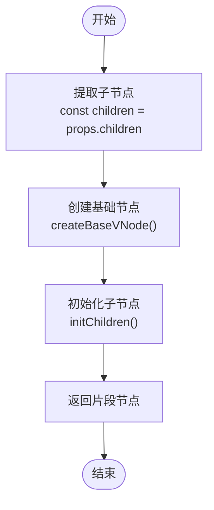
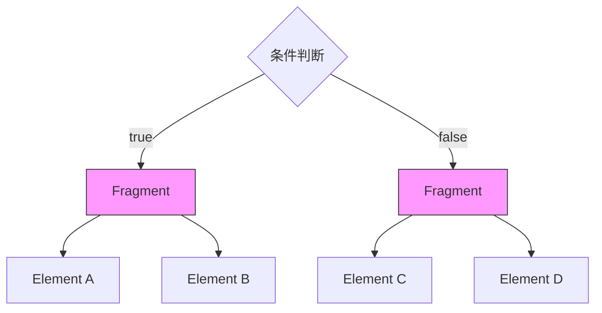
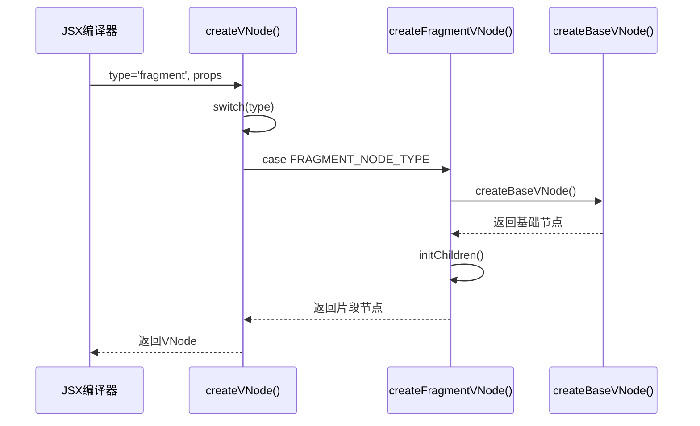
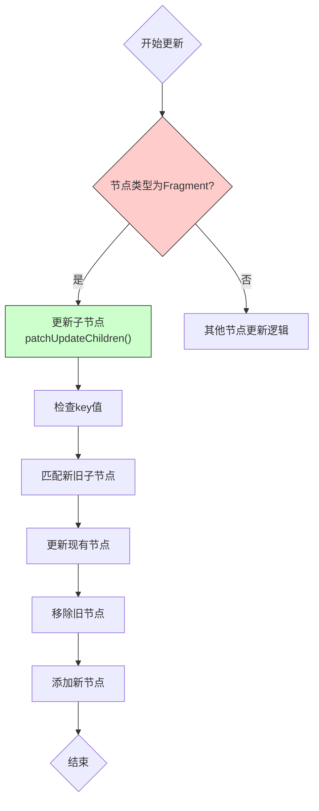

# 片段节点创建

<cite>
**本文档引用文件**   
- [fragment.ts](file://packages/runtime-core/src/vnode/creator/fragment.ts)
- [FragmentVNode.ts](file://packages/runtime-core/src/types/nodes/FragmentVNode.ts)
- [FragmentController.ts](file://packages/runtime-core/src/controllers/FragmentController.ts)
- [nodeTypes.ts](file://packages/runtime-core/src/constants/nodeTypes.ts)
- [nodeKind.ts](file://packages/runtime-core/src/constants/nodeKind.ts)
- [create.ts](file://packages/runtime-core/src/vnode/core/create.ts)
- [children.ts](file://packages/runtime-core/src/vnode/normalizer/children.ts)
- [jsx-runtime.ts](file://packages/vitarx/src/jsx-runtime.ts)
- [update.ts](file://packages/runtime-core/src/vnode/core/update.ts)
- [ContainerController.ts](file://packages/runtime-core/src/controllers/ContainerController.ts)
</cite>

## 目录
1. [简介](#简介)
2. [核心实现机制](#核心实现机制)
3. [片段节点特性](#片段节点特性)
4. [JSX中的使用场景](#jsx中的使用场景)
5. [虚拟DOM树构建与diff算法处理](#虚拟dom树构建与diff算法处理)
6. [代码示例](#代码示例)
7. [结论](#结论)

## 简介
片段节点（Fragment）是vitarx框架中一种特殊的虚拟节点类型，它允许组件返回多个根节点而无需创建额外的DOM包装元素。这种设计模式在现代前端框架中被广泛采用，以解决传统单根节点限制带来的布局和语义问题。

片段节点的核心价值在于其"透明性"——它在虚拟DOM树中作为一个逻辑容器存在，但在实际渲染时不会产生任何对应的DOM元素。这使得开发者能够更灵活地组织UI结构，避免不必要的div包装，保持HTML语义的纯净性。

**Section sources**
- [fragment.ts](file://packages/runtime-core/src/vnode/creator/fragment.ts)
- [FragmentVNode.ts](file://packages/runtime-core/src/types/nodes/FragmentVNode.ts)

## 核心实现机制

### createFragmentVNode函数解析
`createFragmentVNode`函数是创建片段节点的核心实现，位于`packages/runtime-core/src/vnode/creator/fragment.ts`文件中。该函数接收包含子节点的属性对象作为参数，并返回一个片段虚拟节点。

函数的实现流程如下：
1. 从props中提取子节点数组
2. 调用`createBaseVNode`创建基础的片段节点
3. 使用`initChildren`函数初始化子节点，处理可能的嵌套结构和响应式值



**Diagram sources**
- [fragment.ts](file://packages/runtime-core/src/vnode/creator/fragment.ts)

**Section sources**
- [fragment.ts](file://packages/runtime-core/src/vnode/creator/fragment.ts)

## 片段节点特性

### 无实际DOM元素
片段节点最显著的特性是其不渲染为任何实际的DOM元素。在浏览器中，它对应的是`DocumentFragment`，这是一种轻量级的文档对象，不会出现在DOM树中。

### 不占用层级
由于片段节点不产生实际的DOM元素，因此不会增加DOM树的层级深度。这对于性能优化和CSS选择器的编写都有积极影响。

### 逻辑分组容器
片段节点作为多个子节点的逻辑分组容器，继承自`ContainerVNode`接口，能够包含和管理多个子节点。这种设计使得它既能保持结构的完整性，又不会影响最终的DOM输出。

```mermaid
classDiagram
class ContainerVNode {
+children : VNode[]
+appContext : AppContext
+state : NodeState
+type : VNodeTypes
+kind : NodeKind
}
class FragmentVNode {
<<interface>>
}
ContainerVNode <|-- FragmentVNode : "extends"
note right of FragmentVNode
片段节点继承自ContainerVNode，
作为多个子节点的逻辑容器，
但自身不渲染为任何DOM元素
end note
```

**Diagram sources**
- [FragmentVNode.ts](file://packages/runtime-core/src/types/nodes/FragmentVNode.ts)
- [fragment.ts](file://packages/runtime-core/src/vnode/creator/fragment.ts)

**Section sources**
- [FragmentVNode.ts](file://packages/runtime-core/src/types/nodes/FragmentVNode.ts)
- [FragmentController.ts](file://packages/runtime-core/src/controllers/FragmentController.ts)

## JSX中的使用场景

### 避免额外包装div
在传统的JSX开发中，组件必须返回单个根节点，这常常导致需要添加不必要的div包装器。片段节点解决了这个问题：

```mermaid
graph TD
subgraph 传统方式
A[Component] --> B[div]
B --> C[Child1]
B --> D[Child2]
end
subgraph 使用片段
E[Component] --> F[Fragment]
F --> G[Child1]
F --> H[Child2]
end
style F fill:#f9f,stroke:#333
note right of F
片段节点不会产生
实际的DOM元素
end note
```

**Diagram sources**
- [nodeTypes.ts](file://packages/runtime-core/src/constants/nodeTypes.ts)
- [jsx-runtime.ts](file://packages/vitarx/src/jsx-runtime.ts)

### 条件渲染多个元素
当需要根据条件渲染多个元素时，片段节点提供了优雅的解决方案：



**Diagram sources**
- [create.ts](file://packages/runtime-core/src/vnode/core/create.ts)
- [jsx-runtime.ts](file://packages/vitarx/src/jsx-runtime.ts)

**Section sources**
- [nodeTypes.ts](file://packages/runtime-core/src/constants/nodeTypes.ts)
- [jsx-runtime.ts](file://packages/vitarx/src/jsx-runtime.ts)

## 虚拟DOM树构建与diff算法处理

### 虚拟DOM树构建
在虚拟DOM树的构建过程中，片段节点通过`createVNode`函数进行创建。当检测到节点类型为`FRAGMENT_NODE_TYPE`时，会调用`createFragmentVNode`函数：



**Diagram sources**
- [create.ts](file://packages/runtime-core/src/vnode/core/create.ts)
- [fragment.ts](file://packages/runtime-core/src/vnode/creator/fragment.ts)

### diff算法处理
在diff算法中，片段节点的处理与其他容器节点类似，但由于其特殊的渲染特性，具有一些独特的处理逻辑：



**Diagram sources**
- [update.ts](file://packages/runtime-core/src/vnode/core/update.ts)
- [ContainerController.ts](file://packages/runtime-core/src/controllers/ContainerController.ts)

**Section sources**
- [update.ts](file://packages/runtime-core/src/vnode/core/update.ts)
- [children.ts](file://packages/runtime-core/src/vnode/normalizer/children.ts)

## 代码示例

### 基本使用
```tsx
// 使用Fragment组件
return (
  <Fragment>
    <Child1 />
    <Child2 />
  </Fragment>
);

// 使用空标签简写
return (
  <>
    <Child1 />
    <Child2 />
  </>
);
```

### 条件渲染
```tsx
return (
  <>
    {isLoggedIn ? (
      <>
        <UserProfile />
        <Navigation />
      </>
    ) : (
      <LoginButton />
    )}
  </>
);
```

### 列表渲染
```tsx
return (
  <ul>
    {items.map(item => (
      <Fragment key={item.id}>
        <li>{item.name}</li>
        <span>{item.description}</span>
      </Fragment>
    ))}
  </ul>
);
```

**Section sources**
- [jsx-runtime.ts](file://packages/vitarx/src/jsx-runtime.ts)
- [create.ts](file://packages/runtime-core/src/vnode/core/create.ts)

## 结论
片段节点是vitarx框架中一个重要的设计模式，它通过提供一种无DOM开销的逻辑容器，解决了组件多根节点的难题。其核心实现简洁高效，通过`createFragmentVNode`函数创建，利用`DocumentFragment`的特性实现透明渲染。

在实际应用中，片段节点不仅能够避免不必要的DOM嵌套，提高性能，还能保持HTML语义的清晰性。结合JSX的语法糖，开发者可以以非常直观的方式使用这一特性，极大地提升了开发体验和代码可读性。

对于框架本身而言，片段节点的引入需要在虚拟DOM构建、diff算法、渲染等多个环节进行特殊处理，但vitarx框架通过清晰的架构设计和模块化实现，很好地解决了这些挑战，为开发者提供了一个强大而易用的工具。