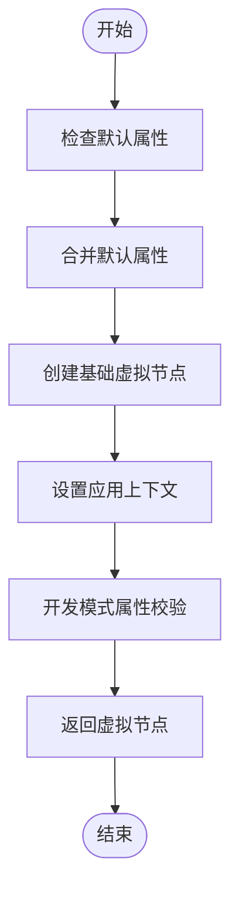
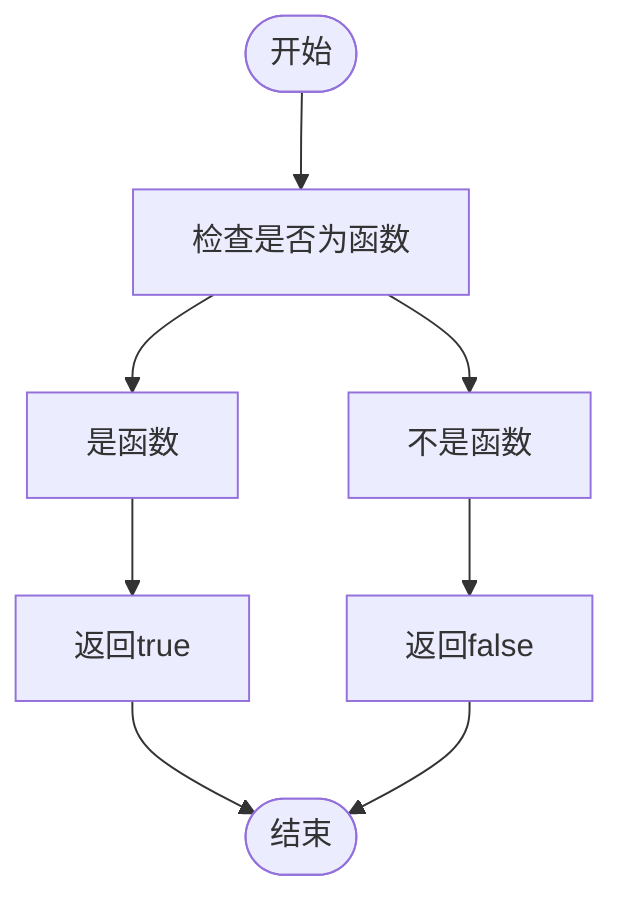
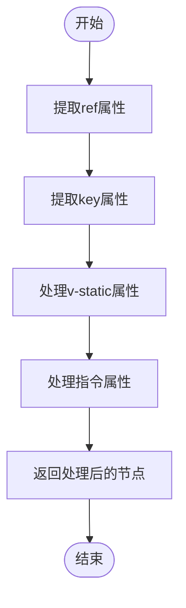
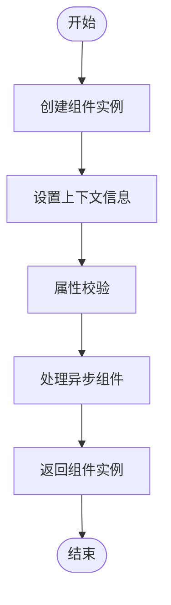
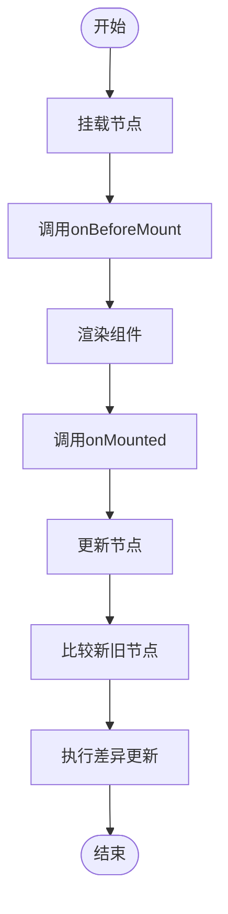

# 组件节点创建

<cite>
**本文档引用的文件**   
- [widget.ts](file://packages/runtime-core/src/vnode/creator/widget.ts)
- [symbol.ts](file://packages/runtime-core/src/constants/symbol.ts)
- [widget.ts](file://packages/runtime-core/src/utils/widget.ts)
- [base.ts](file://packages/runtime-core/src/vnode/creator/base.ts)
- [widget.ts](file://packages/runtime-core/src/types/widget.ts)
- [vnode.ts](file://packages/runtime-core/src/types/vnode.ts)
- [FnWidget.ts](file://packages/runtime-core/src/widget/base/FnWidget.ts)
- [Widget.ts](file://packages/runtime-core/src/widget/base/Widget.ts)
- [nodeKind.ts](file://packages/runtime-core/src/constants/nodeKind.ts)
</cite>

## 目录
1. [引言](#引言)
2. [核心组件](#核心组件)
3. [createWidgetVNode函数实现机制](#createwidgetvnode函数实现机制)
4. [isWidget函数判断逻辑](#iswidget函数判断逻辑)
5. [组件节点特殊属性处理](#组件节点特殊属性处理)
6. [组件实例化过程](#组件实例化过程)
7. [代码示例](#代码示例)
8. [组件挂载与更新](#组件挂载与更新)
9. [结论](#结论)

## 引言
vitarx框架中的组件节点创建是虚拟DOM系统的核心机制之一。该机制通过`createWidgetVNode`函数实现组件虚拟节点的创建，支持函数式组件和类组件两种形式。组件节点的创建过程涉及类型判断、属性处理、上下文设置等多个环节，确保组件能够正确渲染和更新。本文档将深入解析这一机制，帮助开发者理解vitarx框架的内部工作原理。

## 核心组件
vitarx框架的组件节点创建机制涉及多个核心文件和组件。`createWidgetVNode`函数位于`packages/runtime-core/src/vnode/creator/widget.ts`文件中，是组件节点创建的主要入口。该函数依赖于`isStatelessWidget`等工具函数来判断组件类型，并通过`createBaseVNode`函数创建基础虚拟节点。组件类型定义在`packages/runtime-core/src/types/widget.ts`文件中，包括`StatelessWidget`和`StatefulWidget`等类型。这些组件共同构成了vitarx框架的组件系统基础。

**Section sources**
- [widget.ts](file://packages/runtime-core/src/vnode/creator/widget.ts#L1-L174)
- [widget.ts](file://packages/runtime-core/src/types/widget.ts#L1-L263)

## createWidgetVNode函数实现机制
`createWidgetVNode`函数是vitarx框架中创建组件虚拟节点的核心函数。该函数通过函数重载的方式支持不同类型组件的创建，包括无状态组件和有状态组件。函数首先检查组件是否有默认属性，如果有则将其与传入的属性进行合并。然后根据组件类型调用`createBaseVNode`函数创建基础虚拟节点，并设置相应的节点类型。在开发模式下，函数还会执行属性校验，确保组件属性符合预期。



**Diagram sources**
- [widget.ts](file://packages/runtime-core/src/vnode/creator/widget.ts#L154-L173)

**Section sources**
- [widget.ts](file://packages/runtime-core/src/vnode/creator/widget.ts#L154-L173)

## isWidget函数判断逻辑
`isWidget`函数用于判断一个值是否为组件类型。该函数的实现非常简单，只需要检查传入的值是否为函数类型。由于JavaScript语言的特性，目前没有更精确的判断方式，因此只要是函数或构造函数都会被判断为组件类型。对于更具体的组件类型判断，框架提供了`isStatelessWidget`和`isClassWidget`等专门的函数。

`isStatelessWidget`函数通过检查函数对象是否具有`STATELESS_FUNCTION_WIDGET_SYMBOL`属性来判断是否为无状态组件。这个符号属性是在使用`defineStatelessWidget`函数定义无状态组件时添加的。类似地，`isClassWidget`函数通过检查对象是否具有`CLASS_WIDGET_BASE_SYMBOL`属性来判断是否为类组件。这种基于符号属性的判断方式既高效又可靠，避免了类型判断的歧义。



**Diagram sources**
- [widget.ts](file://packages/runtime-core/src/utils/widget.ts#L83-L85)

**Section sources**
- [widget.ts](file://packages/runtime-core/src/utils/widget.ts#L83-L85)
- [symbol.ts](file://packages/runtime-core/src/constants/symbol.ts#L15-L19)

## 组件节点特殊属性处理
组件节点的特殊属性处理是`createWidgetVNode`函数的重要功能之一。当创建组件虚拟节点时，函数会处理一些特殊的属性，如`ref`、`key`和`v-static`。`ref`属性用于获取组件实例的引用，但在特殊节点类型上不支持。`key`属性用于标识节点的唯一性，帮助框架进行高效的节点更新。`v-static`属性用于标记静态节点，这些节点在更新时可以跳过比较。

在处理这些特殊属性时，函数会将它们从props对象中提取出来，并设置到虚拟节点的相应属性上。例如，`ref`属性会被提取到节点的`ref`属性上，`key`属性会被提取到节点的`key`属性上。对于普通节点，函数还会处理指令属性，如`v-model`等。这些指令会被解析并存储在节点的`directives`属性中，供后续的渲染过程使用。



**Diagram sources**
- [base.ts](file://packages/runtime-core/src/vnode/creator/base.ts#L42-L114)

**Section sources**
- [base.ts](file://packages/runtime-core/src/vnode/creator/base.ts#L42-L114)

## 组件实例化过程
组件实例化过程是vitarx框架中组件生命周期的重要环节。当创建组件虚拟节点时，框架会根据组件类型进行相应的实例化处理。对于类组件，框架会调用组件的构造函数创建实例，并将props作为参数传递。对于函数组件，框架会直接使用函数本身作为组件定义。

在实例化过程中，框架会设置组件的上下文信息，包括应用上下文和虚拟节点引用。这些信息对于组件的正常运行至关重要。例如，组件可以通过`$vnode`属性访问其关联的虚拟节点，通过`appContext`属性访问应用上下文。此外，框架还会在开发模式下执行属性校验，确保组件的props符合预期。

对于异步组件，框架提供了特殊的处理机制。当组件的构建函数返回Promise时，框架会等待Promise完成后再进行渲染。在此期间，可以显示加载状态的节点，提供更好的用户体验。这种机制使得vitarx框架能够很好地支持代码分割和懒加载等高级功能。



**Diagram sources**
- [Widget.ts](file://packages/runtime-core/src/widget/base/Widget.ts#L70-L76)
- [FnWidget.ts](file://packages/runtime-core/src/widget/base/FnWidget.ts#L264-L280)

**Section sources**
- [Widget.ts](file://packages/runtime-core/src/widget/base/Widget.ts#L70-L76)
- [FnWidget.ts](file://packages/runtime-core/src/widget/base/FnWidget.ts#L264-L280)

## 代码示例
以下代码示例展示了如何在vitarx框架中创建函数式组件和类组件的虚拟节点：

```typescript
// 创建无状态组件
const MyStatelessWidget = defineStatelessWidget(({text}:{text:string}) => {
  return <div> {text} </div>;
});

// 创建有状态组件
class MyStatefulWidget extends Widget {
  build() {
    return h('div', { children: this.props.text });
  }
}

// 创建组件虚拟节点
const statelessNode = createWidgetVNode(MyStatelessWidget, { text: 'Hello' });
const statefulNode = createWidgetVNode(MyStatefulWidget, { text: 'Hello' });
```

这些示例展示了vitarx框架中组件创建的基本用法。通过`defineStatelessWidget`函数可以定义无状态组件，通过继承`Widget`类可以定义有状态组件。然后使用`createWidgetVNode`函数创建相应的虚拟节点，这些节点可以在渲染过程中使用。

**Section sources**
- [widget.ts](file://packages/runtime-core/src/vnode/creator/widget.ts#L133-L152)
- [widget.ts](file://packages/runtime-core/src/utils/widget.ts#L38-L47)

## 组件挂载与更新
组件挂载与更新是vitarx框架中虚拟DOM系统的核心功能。当组件虚拟节点被创建后，框架会将其挂载到DOM树中。在挂载过程中，框架会调用组件的生命周期钩子，如`onBeforeMount`和`onMounted`，允许组件执行初始化操作。

组件更新过程涉及节点的比较和差异更新。当组件的props发生变化时，框架会创建新的虚拟节点，并与旧的虚拟节点进行比较。通过`$patchUpdate`方法，框架可以选择性地复用、更新或替换节点，以最小化DOM操作。这种机制确保了组件更新的高效性。

对于有状态组件，框架会维护组件实例的状态，并在更新过程中保持状态的连续性。对于无状态组件，由于没有实例状态，每次更新都是重新创建。这种设计使得vitarx框架能够灵活地处理不同类型的组件，提供一致的用户体验。



**Diagram sources**
- [Widget.ts](file://packages/runtime-core/src/widget/base/Widget.ts#L344-L359)

**Section sources**
- [Widget.ts](file://packages/runtime-core/src/widget/base/Widget.ts#L120-L359)

## 结论
vitarx框架的组件节点创建机制是一个精心设计的系统，它通过`createWidgetVNode`函数实现了组件虚拟节点的创建。该机制支持函数式组件和类组件两种形式，通过符号属性进行类型判断，确保了类型安全和运行时识别的一致性。组件节点的特殊属性处理、props传递和实例化过程都经过精心设计，保证了组件的正确渲染和更新。

通过深入理解这一机制，开发者可以更好地利用vitarx框架的功能，创建高效、可维护的Web应用。框架的虚拟DOM系统和组件生命周期管理为开发者提供了强大的工具，使得复杂的应用开发变得更加简单和直观。