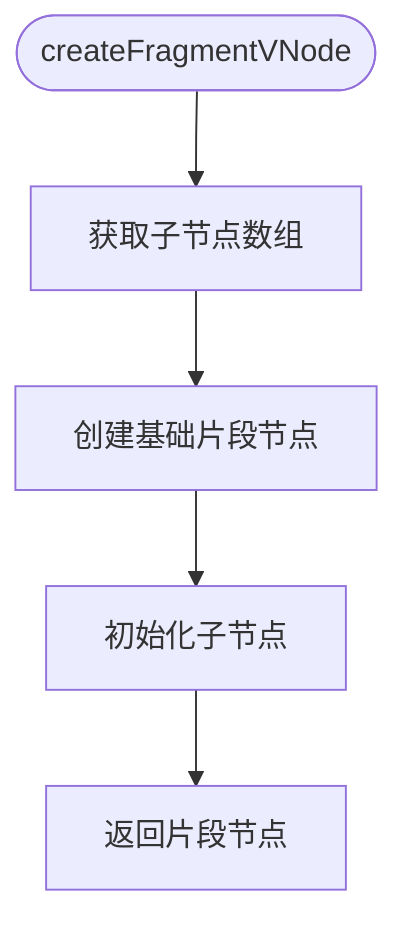

# 虚拟节点创建

<cite>
**本文档引用的文件**
- [base.ts](file://packages/runtime-core/src/vnode/creator/base.ts)
- [element.ts](file://packages/runtime-core/src/vnode/creator/element.ts)
- [fragment.ts](file://packages/runtime-core/src/vnode/creator/fragment.ts)
- [special.ts](file://packages/runtime-core/src/vnode/creator/special.ts)
- [widget.ts](file://packages/runtime-core/src/vnode/creator/widget.ts)
- [create.ts](file://packages/runtime-core/src/vnode/core/create.ts)
- [vnode.ts](file://packages/runtime-core/src/types/vnode.ts)
- [nodeTypes.ts](file://packages/runtime-core/src/constants/nodeTypes.ts)
- [nodeKind.ts](file://packages/runtime-core/src/constants/nodeKind.ts)
- [jsx-runtime.ts](file://packages/vitarx/src/jsx-runtime.ts)
- [jsx-dev-runtime.ts](file://packages/vitarx/src/jsx-dev-runtime.ts)
</cite>

## 目录
1. [简介](#简介)
2. [核心创建机制](#核心创建机制)
3. [基础虚拟节点创建](#基础虚拟节点创建)
4. [元素节点创建](#元素节点创建)
5. [片段节点创建](#片段节点创建)
6. [特殊节点创建](#特殊节点创建)
7. [组件节点创建](#组件节点创建)
8. [JSX编译过程中的虚拟节点创建](#jsx编译过程中的虚拟节点创建)
9. [总结](#总结)

## 简介
虚拟节点（VNode）是Vitarx框架中用于描述UI结构的核心数据结构。本文档深入解析`createVNode`函数的实现机制，详细说明框架如何根据不同的节点类型创建相应的虚拟节点实例。我们将探讨普通元素节点、自闭合元素节点、片段节点和组件节点的创建过程，以及节点属性和子节点的处理方式。

**Section sources**
- [create.ts](file://packages/runtime-core/src/vnode/core/create.ts#L90-L147)

## 核心创建机制
`createVNode`函数是虚拟节点创建的核心入口，它根据传入的节点类型决定创建何种虚拟节点。该函数首先处理子节点的合并，然后根据节点类型进行分支处理。


**Diagram sources**
- [create.ts](file://packages/runtime-core/src/vnode/core/create.ts#L90-L147)

**Section sources**
- [create.ts](file://packages/runtime-core/src/vnode/core/create.ts#L90-L147)

## 基础虚拟节点创建
`createBaseVNode`函数负责创建所有类型虚拟节点的基础结构。它为虚拟节点设置必要的元数据，如节点类型、状态和应用上下文，并处理通用的属性。

```mermaid
flowchart TD
Start([createBaseVNode]) --> InitNode["初始化节点基础结构"]
InitNode --> HandleDev{"开发模式检查"}
HandleDev --> |开发模式| ExtractDevInfo["提取开发信息"]
HandleDev --> |生产模式| SkipDev["跳过开发信息"]
ExtractDevInfo --> SkipDev
SkipDev --> CheckProps{"属性存在检查"}
CheckProps --> |无属性| Return["返回节点"]
CheckProps --> |有属性| HandleRef{"ref属性处理"}
HandleRef --> HandleKey{"key属性处理"}
HandleKey --> HandleStatic{"v-static属性处理"}
HandleStatic --> CheckSpecial{"特殊节点检查"]
CheckSpecial --> |特殊节点| UnpackAll["解包所有属性"]
CheckSpecial --> |普通节点| HandleBind["处理v-bind合并"]
HandleBind --> HandleDirectives["处理指令"]
HandleDirectives --> Return
```

**Diagram sources**
- [base.ts](file://packages/runtime-core/src/vnode/creator/base.ts#L22-L117)

**Section sources**
- [base.ts](file://packages/runtime-core/src/vnode/creator/base.ts#L22-L117)

## 元素节点创建
元素节点分为常规元素节点和自闭合元素节点。常规元素节点可以包含子节点，而自闭合元素节点不能有子节点。

### 常规元素节点
`createRegularElementVNode`函数创建可以包含子节点的HTML元素，如div、span等。


**Diagram sources**
- [element.ts](file://packages/runtime-core/src/vnode/creator/element.ts#L47-L68)

**Section sources**
- [element.ts](file://packages/runtime-core/src/vnode/creator/element.ts#L47-L68)

### 自闭合元素节点
`createVoidElementVNode`函数创建不能有子节点的HTML元素，如img、input、br等。


**Diagram sources**
- [element.ts](file://packages/runtime-core/src/vnode/creator/element.ts#L26-L34)

**Section sources**
- [element.ts](file://packages/runtime-core/src/vnode/creator/element.ts#L26-L34)

## 片段节点创建
`createFragmentVNode`函数创建片段节点，这是一种特殊的虚拟节点，本身不渲染为任何DOM元素，而是将其子节点直接渲染到父节点中。



**Diagram sources**
- [fragment.ts](file://packages/runtime-core/src/vnode/creator/fragment.ts#L15-L23)

**Section sources**
- [fragment.ts](file://packages/runtime-core/src/vnode/creator/fragment.ts#L15-L23)

## 特殊节点创建
特殊节点包括文本节点和注释节点，它们是虚拟DOM中最基础的节点类型。

### 文本节点
`createTextVNode`函数创建用于表示文本内容的节点。


**Diagram sources**
- [special.ts](file://packages/runtime-core/src/vnode/creator/special.ts#L19-L21)

**Section sources**
- [special.ts](file://packages/runtime-core/src/vnode/creator/special.ts#L19-L21)

### 注释节点
`createCommentVNode`函数创建用于表示HTML注释的节点。


**Diagram sources**
- [special.ts](file://packages/runtime-core/src/vnode/creator/special.ts#L33-L35)

**Section sources**
- [special.ts](file://packages/runtime-core/src/vnode/creator/special.ts#L33-L35)

## 组件节点创建
`createWidgetVNode`函数负责创建组件类型的虚拟节点，支持有状态组件和无状态组件。


**Diagram sources**
- [widget.ts](file://packages/runtime-core/src/vnode/creator/widget.ts#L154-L173)

**Section sources**
- [widget.ts](file://packages/runtime-core/src/vnode/creator/widget.ts#L154-L173)

## JSX编译过程中的虚拟节点创建
在JSX编译过程中，JSX语法会被转换为`jsx`函数调用，最终调用`createVNode`创建虚拟节点。

### 生产模式
`jsx`函数在生产模式下创建虚拟节点，处理key属性的传递。


**Diagram sources**
- [jsx-runtime.ts](file://packages/vitarx/src/jsx-runtime.ts#L15-L28)

**Section sources**
- [jsx-runtime.ts](file://packages/vitarx/src/jsx-runtime.ts#L15-L28)

### 开发模式
`jsxDEV`函数在开发模式下创建虚拟节点，除了处理key属性外，还添加了开发调试信息。


**Diagram sources**
- [jsx-dev-runtime.ts](file://packages/vitarx/src/jsx-dev-runtime.ts#L24-L44)

**Section sources**
- [jsx-dev-runtime.ts](file://packages/vitarx/src/jsx-dev-runtime.ts#L24-L44)

## 总结
Vitarx框架的虚拟节点创建机制通过分层设计实现了高度的灵活性和可扩展性。从`createVNode`核心函数到各种具体节点创建函数，再到JSX编译过程的集成，整个系统形成了一个完整的虚拟DOM创建链路。通过这种设计，框架能够高效地处理各种节点类型，为UI渲染提供了坚实的基础。