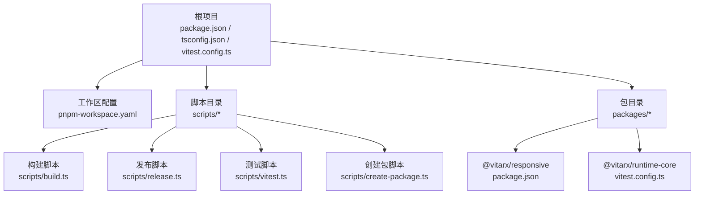
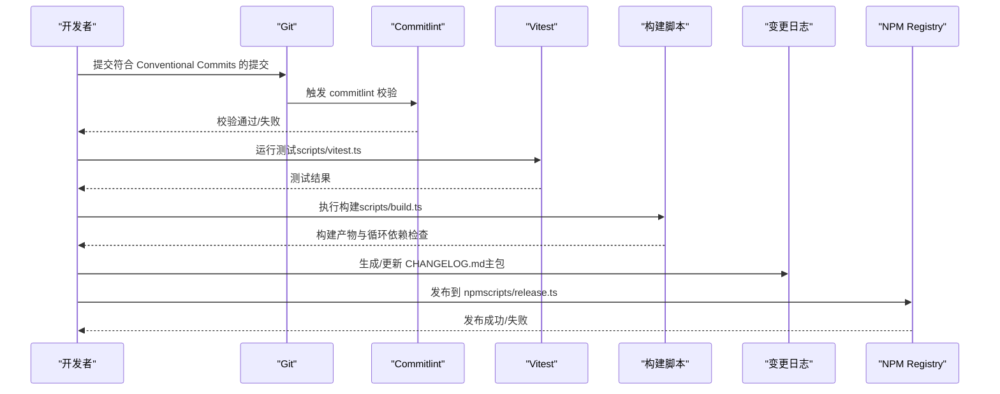
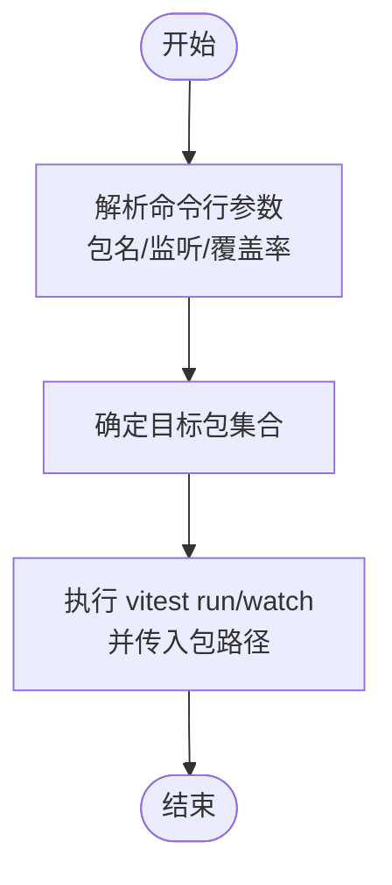
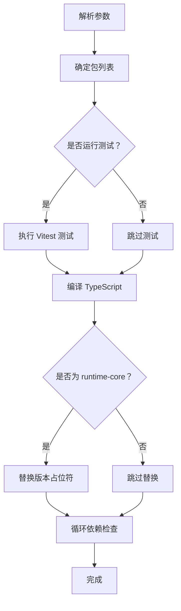
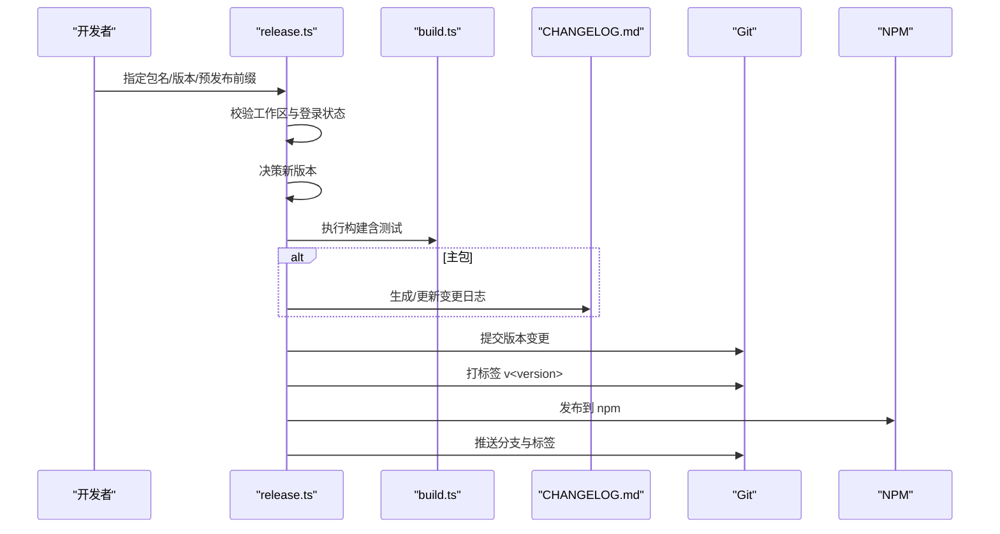
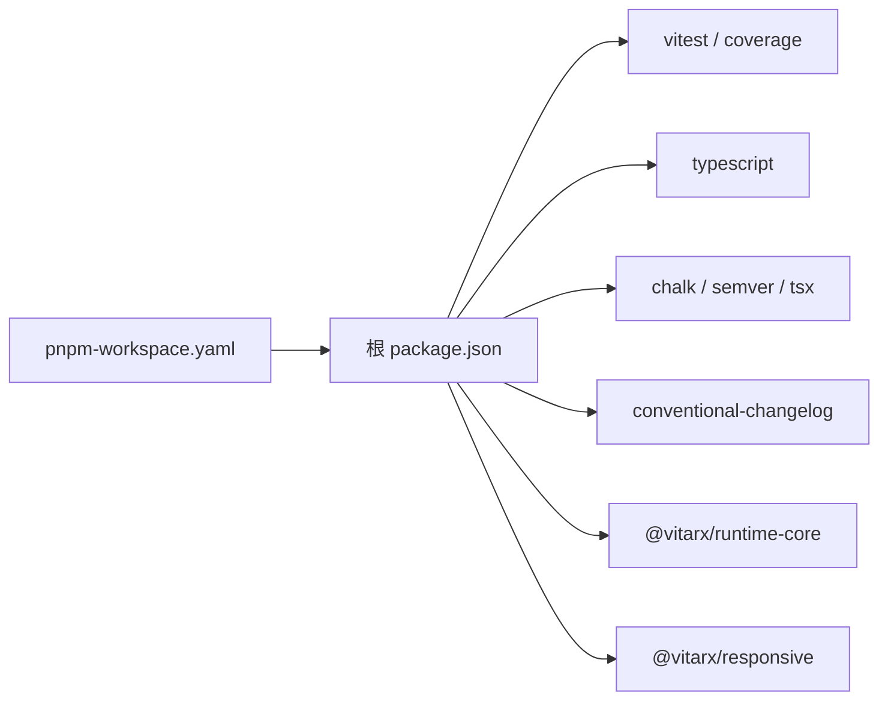

# 贡献指南

<cite>
**本文引用的文件**
- [package.json](file://package.json)
- [pnpm-workspace.yaml](file://pnpm-workspace.yaml)
- [commitlint.config.ts](file://commitlint.config.ts)
- [vitest.config.ts](file://vitest.config.ts)
- [scripts/build.ts](file://scripts/build.ts)
- [scripts/release.ts](file://scripts/release.ts)
- [scripts/vitest.ts](file://scripts/vitest.ts)
- [scripts/create-package.ts](file://scripts/create-package.ts)
- [tsconfig.json](file://tsconfig.json)
- [CHANGELOG.md](file://CHANGELOG.md)
- [packages/responsive/package.json](file://packages/responsive/package.json)
- [packages/runtime-core/vitest.config.ts](file://packages/runtime-core/vitest.config.ts)
</cite>

## 目录
1. [简介](#简介)
2. [项目结构](#项目结构)
3. [核心组件](#核心组件)
4. [架构总览](#架构总览)
5. [详细组件分析](#详细组件分析)
6. [依赖关系分析](#依赖关系分析)
7. [性能考量](#性能考量)
8. [故障排查指南](#故障排查指南)
9. [结论](#结论)
10. [附录](#附录)

## 简介
本指南面向希望为 vitarx 项目贡献代码的开发者，涵盖开发环境搭建、代码提交规范、分支管理策略、测试编写与运行、构建与发布流程、代码风格与注释规范，以及 Pull Request 审查标准。目标是帮助贡献者高效、高质量地参与项目迭代。

## 项目结构
vitarx 采用 monorepo 结构，根目录通过工作区配置管理多个包。核心目录与职责如下：
- packages：各功能包的源码与测试，如 responsive、runtime-core、runtime-dom、utils、vitarx 等
- scripts：构建、发布、测试等自动化脚本
- 根配置：TypeScript、Vitest、Commitlint、pnpm 工作区等

图表来源
- [package.json](file://package.json#L1-L40)
- [pnpm-workspace.yaml](file://pnpm-workspace.yaml#L1-L5)
- [scripts/build.ts](file://scripts/build.ts#L1-L328)
- [scripts/release.ts](file://scripts/release.ts#L1-L231)
- [scripts/vitest.ts](file://scripts/vitest.ts#L1-L154)
- [scripts/create-package.ts](file://scripts/create-package.ts#L1-L71)
- [packages/responsive/package.json](file://packages/responsive/package.json#L1-L36)
- [packages/runtime-core/vitest.config.ts](file://packages/runtime-core/vitest.config.ts#L1-L17)

章节来源
- [package.json](file://package.json#L1-L40)
- [pnpm-workspace.yaml](file://pnpm-workspace.yaml#L1-L5)

## 核心组件
- 提交规范与校验：通过 commitlint 配置 Conventional Commits 规则，保证提交信息可读与自动化变更日志生成
- 测试体系：统一使用 Vitest，根配置提供别名与环境，各包可按需扩展
- 构建流程：通过脚本对包逐一执行测试、类型检查、打包与循环依赖检测
- 发布流程：版本决策、构建、生成变更日志、打标签、推送与发布

章节来源
- [commitlint.config.ts](file://commitlint.config.ts#L1-L16)
- [vitest.config.ts](file://vitest.config.ts#L1-L40)
- [scripts/build.ts](file://scripts/build.ts#L1-L328)
- [scripts/release.ts](file://scripts/release.ts#L1-L231)

## 架构总览
下图展示从本地开发到发布的端到端流程，包括提交规范、测试、构建与发布的关键步骤。

图表来源
- [commitlint.config.ts](file://commitlint.config.ts#L1-L16)
- [scripts/vitest.ts](file://scripts/vitest.ts#L1-L154)
- [scripts/build.ts](file://scripts/build.ts#L1-L328)
- [CHANGELOG.md](file://CHANGELOG.md#L1-L200)
- [scripts/release.ts](file://scripts/release.ts#L1-L231)

## 详细组件分析

### 开发环境搭建
- 使用 pnpm 作为包管理器，根目录提供工作区配置，确保 monorepo 正常解析
- 安装依赖后即可使用脚本命令进行开发与发布
- TypeScript 严格模式与类型声明配置已在根 tsconfig 中统一

章节来源
- [pnpm-workspace.yaml](file://pnpm-workspace.yaml#L1-L5)
- [package.json](file://package.json#L1-L40)
- [tsconfig.json](file://tsconfig.json#L1-L55)

### 代码提交规范（Conventional Commits）
- 提交类型限定为：feat、fix、docs、style、refactor、test、chore、build、ci
- subject 必须非空；body 最大行长限制；scope 可选
- 通过 commitlint 校验，确保变更日志与版本发布自动化流程稳定

章节来源
- [commitlint.config.ts](file://commitlint.config.ts#L1-L16)

### 分支管理策略
- 建议采用基于功能分支的开发流程：feature/*、fix/*、docs/*
- 发布前在主分支合并，主包发布时自动生成变更日志并打标签
- 预发布版本可通过发布脚本参数指定 preid 与版本类型

章节来源
- [scripts/release.ts](file://scripts/release.ts#L1-L231)
- [CHANGELOG.md](file://CHANGELOG.md#L1-L200)

### 测试编写与运行
- 统一使用 Vitest，根配置启用 jsdom 环境、覆盖率与测试超时
- 各包可按需扩展自己的 Vitest 配置（如 runtime-core 的 setup 文件）
- 提供两类测试入口：
  - 一键测试：scripts/vitest.ts，支持指定包、监听模式与覆盖率
  - 包内测试：各包的 vitest.config.ts 可单独配置

图表来源
- [scripts/vitest.ts](file://scripts/vitest.ts#L1-L154)
- [packages/runtime-core/vitest.config.ts](file://packages/runtime-core/vitest.config.ts#L1-L17)

章节来源
- [vitest.config.ts](file://vitest.config.ts#L1-L40)
- [scripts/vitest.ts](file://scripts/vitest.ts#L1-L154)
- [packages/runtime-core/vitest.config.ts](file://packages/runtime-core/vitest.config.ts#L1-L17)

### 构建流程（scripts/build.ts）
- 自动化流程包括：测试（可选）、类型检查（可选）、TypeScript 编译、版本号替换（runtime-core）、循环依赖检查
- 支持按包构建，或一次性构建所有包
- 通过临时 tsconfig.json 管理编译输出目录与排除项

图表来源
- [scripts/build.ts](file://scripts/build.ts#L1-L328)

章节来源
- [scripts/build.ts](file://scripts/build.ts#L1-L328)

### 发布流程（scripts/release.ts）
- 校验工作区状态与 npm 登录
- 版本决策：支持 major/minor/patch/prerelease 等语义化版本类型，或自定义版本号
- 构建：调用构建脚本对目标包进行测试与打包
- 变更日志：主包自动生成 CHANGELOG.md
- 提交与打标签：提交版本变更并打 v<version> 标签（主包）
- 发布：在包目录执行发布命令
- 推送：推送分支与标签

图表来源
- [scripts/release.ts](file://scripts/release.ts#L1-L231)
- [scripts/build.ts](file://scripts/build.ts#L1-L328)
- [CHANGELOG.md](file://CHANGELOG.md#L1-L200)

章节来源
- [scripts/release.ts](file://scripts/release.ts#L1-L231)

### 代码风格与注释规范
- TypeScript 严格模式：开启严格类型检查、类字段使用 define、禁止未使用局部变量等
- 类型声明：生成 d.ts 并在包的 package.json 中导出 types 字段
- 文档与注释：遵循 Conventional Commits 的 subject 与 body 规范，配合变更日志生成
- 包导出：统一通过 package.json 的 exports 字段导出类型与默认入口

章节来源
- [tsconfig.json](file://tsconfig.json#L1-L55)
- [packages/responsive/package.json](file://packages/responsive/package.json#L1-L36)

### Pull Request 审查标准
- 提交信息：必须符合 Conventional Commits，subject 清晰描述变更意图
- 测试：新增/修改功能需配套测试；确保所有包测试通过
- 构建：确保构建脚本能顺利通过，无循环依赖
- 变更日志：主包变更需更新 CHANGELOG.md
- 性能与兼容：避免引入性能退化，注意跨包依赖与版本约束

章节来源
- [commitlint.config.ts](file://commitlint.config.ts#L1-L16)
- [scripts/build.ts](file://scripts/build.ts#L1-L328)
- [CHANGELOG.md](file://CHANGELOG.md#L1-L200)

## 依赖关系分析
- 工作区依赖：pnpm 工作区统一管理包间依赖与构建顺序
- 根配置依赖：Vitest、TypeScript、chalk、semver、conventional-changelog 等
- 包级依赖：各包通过 workspace 依赖共享 utils 等公共模块

图表来源
- [pnpm-workspace.yaml](file://pnpm-workspace.yaml#L1-L5)
- [package.json](file://package.json#L1-L40)

章节来源
- [pnpm-workspace.yaml](file://pnpm-workspace.yaml#L1-L5)
- [package.json](file://package.json#L1-L40)

## 性能考量
- 循环依赖检查：构建阶段使用 madge 检测循环依赖，避免运行时性能问题
- 测试超时：根配置设置单测超时，避免长时间卡顿
- 覆盖率：启用 v8 覆盖率收集，便于定位薄弱环节
- 构建优化：按包构建，避免全量重建带来的资源浪费

章节来源
- [scripts/build.ts](file://scripts/build.ts#L1-L328)
- [vitest.config.ts](file://vitest.config.ts#L1-L40)

## 故障排查指南
- 提交被拒绝：检查提交信息是否符合 Conventional Commits 规范
- 测试失败：使用 scripts/vitest.ts 指定包名与监听模式定位问题
- 构建失败：确认包内 tsconfig 与依赖版本；查看构建日志中的错误信息
- 发布失败：检查 npm 登录状态、网络与权限；必要时回滚版本并重试

章节来源
- [commitlint.config.ts](file://commitlint.config.ts#L1-L16)
- [scripts/vitest.ts](file://scripts/vitest.ts#L1-L154)
- [scripts/build.ts](file://scripts/build.ts#L1-L328)
- [scripts/release.ts](file://scripts/release.ts#L1-L231)

## 结论
通过统一的提交规范、测试与构建发布流程，vitarx 项目能够保持高质量与高一致性。建议贡献者在提交前先运行测试与构建脚本，确保变更满足审查标准，并在主包发布时同步更新变更日志。

## 附录
- 创建新包：使用脚本快速生成包目录、package.json、src/index.ts 与 README.md
- 包导出：遵循包内 package.json 的 exports 字段，确保类型与默认入口正确

章节来源
- [scripts/create-package.ts](file://scripts/create-package.ts#L1-L71)
- [packages/responsive/package.json](file://packages/responsive/package.json#L1-L36)