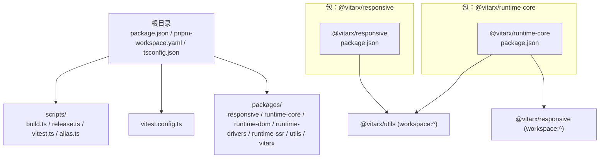
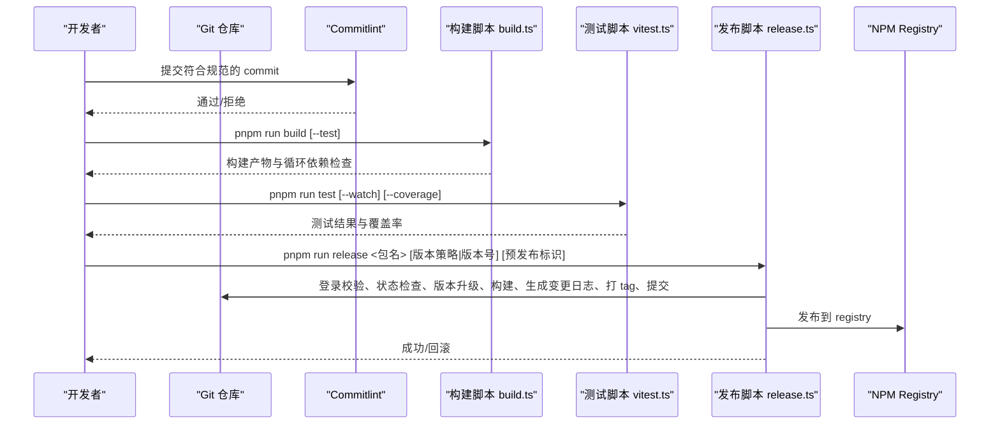
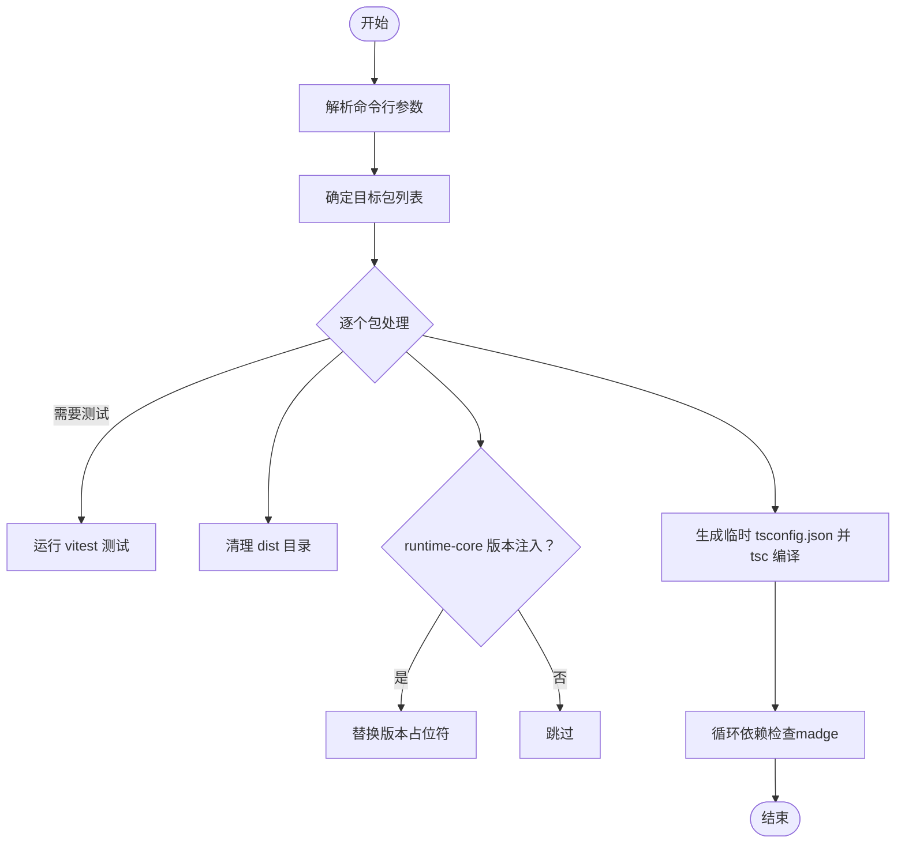
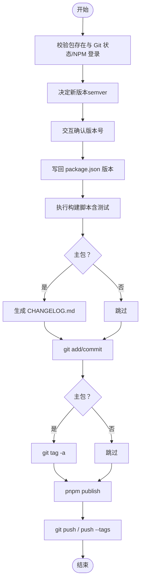

# 贡献指南

<cite>
**本文引用的文件**
- [package.json](file://package.json)
- [pnpm-workspace.yaml](file://pnpm-workspace.yaml)
- [commitlint.config.ts](file://commitlint.config.ts)
- [scripts/build.ts](file://scripts/build.ts)
- [scripts/release.ts](file://scripts/release.ts)
- [scripts/vitest.ts](file://scripts/vitest.ts)
- [vitest.config.ts](file://vitest.config.ts)
- [tsconfig.json](file://tsconfig.json)
- [scripts/alias.ts](file://scripts/alias.ts)
- [packages/responsive/package.json](file://packages/responsive/package.json)
- [packages/runtime-core/package.json](file://packages/runtime-core/package.json)
- [packages/runtime-core/vitest.config.ts](file://packages/runtime-core/vitest.config.ts)
- [README.md](file://README.md)
- [CHANGELOG.md](file://CHANGELOG.md)
</cite>

## 目录
1. [简介](#简介)
2. [项目结构](#项目结构)
3. [核心组件](#核心组件)
4. [架构总览](#架构总览)
5. [详细组件分析](#详细组件分析)
6. [依赖关系分析](#依赖关系分析)
7. [性能与质量特性](#性能与质量特性)
8. [故障排查指南](#故障排查指南)
9. [结论](#结论)
10. [附录](#附录)

## 简介
本指南面向希望参与 Vitarx 项目的开发者，帮助你快速理解仓库结构、pnpm workspace 多包管理机制、代码提交规范、分支管理策略、构建与发布流程、测试与覆盖率要求，以及 PR 提交流程。同时提供开发环境搭建步骤、调试技巧与文档更新规范，降低贡献门槛，确保代码质量与项目稳定性。

## 项目结构
Vitarx 采用 monorepo 结构，使用 pnpm workspace 管理多个包。根目录提供统一的构建、测试、发布脚本与配置，各子包位于 packages 目录下，按功能拆分为响应式系统、运行时内核、DOM 渲染、SSR、驱动层、工具库与顶层入口等。

图表来源
- [pnpm-workspace.yaml](file://pnpm-workspace.yaml#L1-L5)
- [packages/responsive/package.json](file://packages/responsive/package.json#L1-L36)
- [packages/runtime-core/package.json](file://packages/runtime-core/package.json#L1-L39)

章节来源
- [pnpm-workspace.yaml](file://pnpm-workspace.yaml#L1-L5)
- [package.json](file://package.json#L1-L40)

## 核心组件
- 多包管理：通过 pnpm workspace 管理 packages/* 下的所有包，支持 workspace 依赖解析与跨包引用。
- 提交规范：基于 commitlint 的 conventional 规范，限定 type 与 subject 等规则，保证变更描述一致性。
- 构建脚本：scripts/build.ts 支持按包构建、类型检查、循环依赖检测与版本号注入。
- 发布脚本：scripts/release.ts 自动版本决策、构建、生成变更日志、打 tag、提交与发布。
- 测试体系：根级 vitest.config.ts 与各包 vitest.config.ts 组合，支持覆盖率、监听与别名解析。
- 类型配置：统一 tsconfig.json，约束模块解析、严格模式与输出声明文件。

章节来源
- [package.json](file://package.json#L1-L40)
- [commitlint.config.ts](file://commitlint.config.ts#L1-L16)
- [scripts/build.ts](file://scripts/build.ts#L1-L328)
- [scripts/release.ts](file://scripts/release.ts#L1-L231)
- [vitest.config.ts](file://vitest.config.ts#L1-L40)
- [tsconfig.json](file://tsconfig.json#L1-L55)

## 架构总览
下图展示贡献流程的关键环节：提交规范 -> 构建与测试 -> 发布与版本管理。

图表来源
- [commitlint.config.ts](file://commitlint.config.ts#L1-L16)
- [scripts/build.ts](file://scripts/build.ts#L1-L328)
- [scripts/vitest.ts](file://scripts/vitest.ts#L1-L155)
- [scripts/release.ts](file://scripts/release.ts#L1-L231)

## 详细组件分析

### 提交规范与分支策略
- 提交类型：限定为 feat、fix、docs、style、refactor、test、chore、build、ci 等，确保变更分类清晰。
- 主题不能为空，正文最大行长度限制，便于自动化工具解析与生成变更日志。
- 分支建议：采用 feature/xxx、fix/xxx、docs/xxx 等前缀，主分支仅接受通过 CI 的 PR 合并。

章节来源
- [commitlint.config.ts](file://commitlint.config.ts#L1-L16)

### 构建脚本（build.ts）
- 功能概览
  - 支持按包构建，可选运行测试（vitest run）。
  - 自动清理 dist 目录，生成临时 tsconfig.json 并执行 tsc 编译。
  - 对 runtime-core 注入版本号常量。
  - 构建完成后执行循环依赖检查（madge），失败即终止。
  - 支持命令行参数：--test、包名列表。
- 关键流程（简化）

图表来源
- [scripts/build.ts](file://scripts/build.ts#L1-L328)

章节来源
- [scripts/build.ts](file://scripts/build.ts#L1-L328)

### 发布流程（release.ts）
- 功能概览
  - 校验包存在、Git 状态与 npm 登录。
  - 自动推断版本：若当前为预发布则自增 prerelease，否则自增 patch；也可传入 major/minor/patch/prerelease 或自定义版本号。
  - 交互确认版本号，升级对应包版本并写回 package.json。
  - 调用构建脚本进行构建与测试。
  - 主包（vitarx）自动生成变更日志（conventional-changelog）。
  - 提交变更并打 tag（主包），发布到 NPM，推送分支与 tag。
  - 失败时自动回滚版本、git reset 与删除 tag。
- 关键流程（简化）

图表来源
- [scripts/release.ts](file://scripts/release.ts#L1-L231)
- [CHANGELOG.md](file://CHANGELOG.md#L1-L200)

章节来源
- [scripts/release.ts](file://scripts/release.ts#L1-L231)
- [CHANGELOG.md](file://CHANGELOG.md#L1-L200)

### 测试与覆盖率（vitest）
- 根配置
  - 环境：jsdom，支持 globals。
  - 包含 __tests__/**/*.{test,spec}.{js,mjs,cjs,ts,mts,cts,jsx,tsx}。
  - 排除 node_modules 与 dist。
  - 覆盖率：provider 为 v8，输出 text/json/html，排除 node_modules、dist 与 __tests__。
  - 单测超时：10 秒。
- 别名解析
  - scripts/alias.ts 动态解析 packages 下各包的入口与 exports 子路径，供 vitest 与打包共享。
- 各包配置
  - packages/runtime-core/vitest.config.ts 继承根配置并添加 setupFiles。

章节来源
- [vitest.config.ts](file://vitest.config.ts#L1-L40)
- [scripts/alias.ts](file://scripts/alias.ts#L1-L89)
- [packages/runtime-core/vitest.config.ts](file://packages/runtime-core/vitest.config.ts#L1-L17)

### 类型与构建配置（tsconfig.json）
- 统一编译选项：ES2020/ESNext，严格模式，模块解析 bundler，esModuleInterop，skipLibCheck，resolveJsonModule，noImplicitOverride，useDefineForClassFields。
- 包含 src、tests、__tests__ 与 ./scripts。
- 排除 node_modules 与 dist。

章节来源
- [tsconfig.json](file://tsconfig.json#L1-L55)

### 包依赖与导出（示例）
- @vitarx/responsive 依赖 @vitarx/utils（workspace:^）。
- @vitarx/runtime-core 依赖 @vitarx/responsive、@vitarx/utils 与 csstype，导出多种入口（含 unpkg/jsdelivr）。

章节来源
- [packages/responsive/package.json](file://packages/responsive/package.json#L1-L36)
- [packages/runtime-core/package.json](file://packages/runtime-core/package.json#L1-L39)

## 依赖关系分析
- workspace 依赖：packages/*/package.json 中的依赖使用 workspace:^，由 pnpm 解析到本地包。
- 别名共享：scripts/alias.ts 从各包 package.json 的 exports 字段生成别名，保证测试与打包的一致性。
- 运行时依赖：runtime-core 依赖 responsive 与 utils，形成清晰的分层。

图表来源
- [packages/responsive/package.json](file://packages/responsive/package.json#L1-L36)
- [packages/runtime-core/package.json](file://packages/runtime-core/package.json#L1-L39)

章节来源
- [pnpm-workspace.yaml](file://pnpm-workspace.yaml#L1-L5)
- [scripts/alias.ts](file://scripts/alias.ts#L1-L89)

## 性能与质量特性
- 循环依赖检测：构建阶段使用 madge 检测循环依赖，失败即终止，保障模块结构健康。
- 版本注入：对 runtime-core 的版本常量进行替换，避免硬编码。
- 覆盖率：根配置启用 v8 覆盖率，输出多格式报告，便于持续改进测试覆盖面。
- 类型安全：统一 tsconfig 严格模式与模块解析策略，减少运行时隐患。

章节来源
- [scripts/build.ts](file://scripts/build.ts#L1-L328)
- [vitest.config.ts](file://vitest.config.ts#L1-L40)
- [tsconfig.json](file://tsconfig.json#L1-L55)

## 故障排查指南
- 构建失败
  - 检查是否存在循环依赖（madge 报错），定位并解耦模块。
  - 确认包内 tsconfig.json 是否存在，必要时让构建脚本自动生成临时配置。
  - 确认 tsc 编译是否报错，修正类型问题。
- 发布失败
  - 确认已登录 npm（pnpm whoami），Git 工作区干净无未提交更改。
  - 若 tag 已存在或推送失败，脚本会自动回滚版本与 tag，按提示重试。
- 测试失败
  - 使用 --watch 与 --coverage 参数定位问题，关注覆盖率报告与测试超时。
  - 确认别名解析是否正确，必要时检查 scripts/alias.ts 与各包 vitest.config.ts。

章节来源
- [scripts/build.ts](file://scripts/build.ts#L1-L328)
- [scripts/release.ts](file://scripts/release.ts#L1-L231)
- [scripts/vitest.ts](file://scripts/vitest.ts#L1-L155)
- [vitest.config.ts](file://vitest.config.ts#L1-L40)

## 结论
通过明确的提交规范、完善的构建与发布流程、严格的测试与覆盖率策略，以及清晰的 monorepo 结构，Vitarx 为贡献者提供了高效稳定的协作体验。遵循本文档的流程与最佳实践，可显著提升贡献效率与代码质量。

## 附录

### 开发环境搭建步骤
- 安装 pnpm（推荐使用 pnpm 9+）。
- 在根目录执行安装依赖（pnpm install）。
- 如需使用 husky，请确保安装 @vitarx/init-husky 并初始化 Git hooks。
- 安装 madge 以启用循环依赖检测（构建脚本会调用）。

章节来源
- [package.json](file://package.json#L1-L40)
- [pnpm-workspace.yaml](file://pnpm-workspace.yaml#L1-L5)

### 调试技巧
- 使用 pnpm run test --watch 启动监听模式，快速迭代。
- 使用 pnpm run test --coverage 生成覆盖率报告，结合 IDE 的覆盖率插件定位薄弱点。
- 在 packages/runtime-core/vitest.config.ts 中添加 setupFiles，集中初始化测试环境。
- 使用 scripts/alias.ts 生成的别名，确保测试与打包路径一致。

章节来源
- [scripts/vitest.ts](file://scripts/vitest.ts#L1-L155)
- [packages/runtime-core/vitest.config.ts](file://packages/runtime-core/vitest.config.ts#L1-L17)
- [scripts/alias.ts](file://scripts/alias.ts#L1-L89)

### 文档更新规范
- 变更日志：主包发布时自动生成 CHANGELOG.md，遵循 conventional-changelog 规范。
- README：保持简洁明了，示例代码应可运行，避免过时信息。
- 包级 README：补充包的功能说明、导出示例与依赖关系。

章节来源
- [scripts/release.ts](file://scripts/release.ts#L1-L231)
- [CHANGELOG.md](file://CHANGELOG.md#L1-L200)
- [README.md](file://README.md#L1-L85)