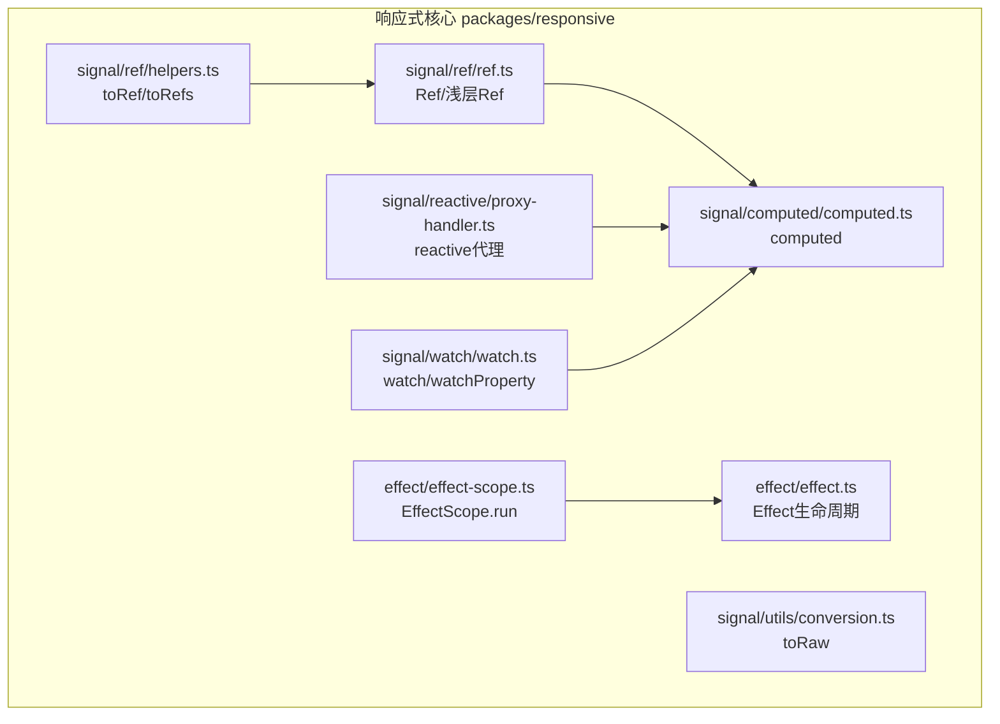
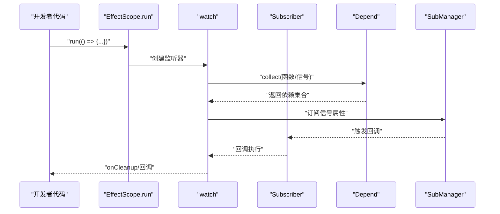
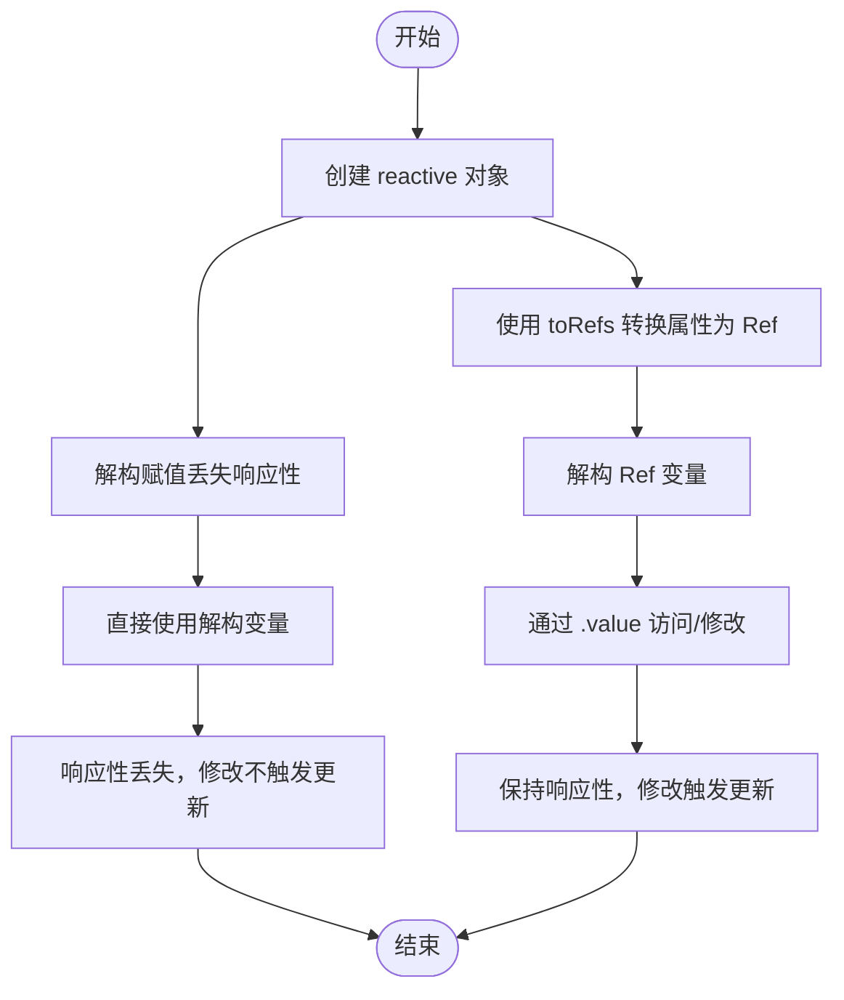
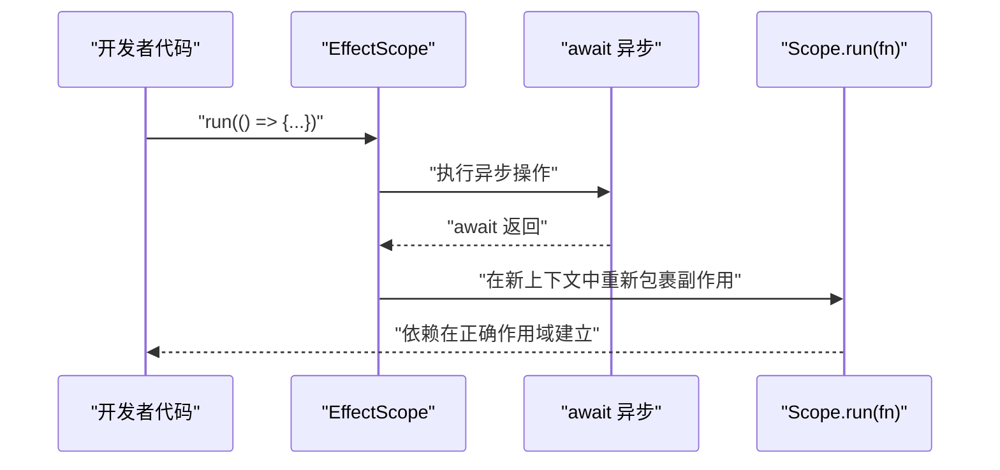
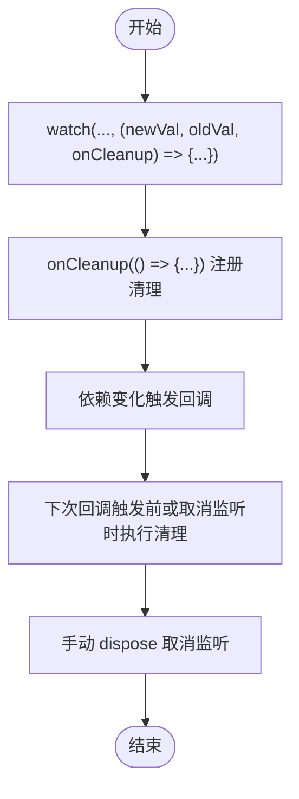
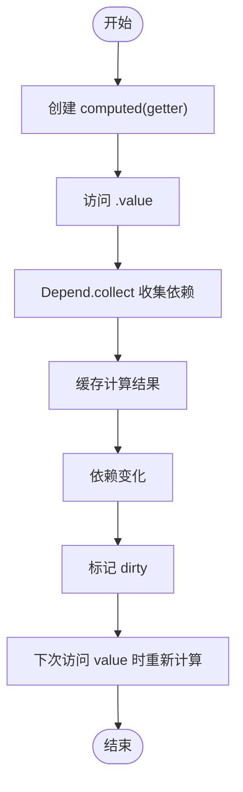
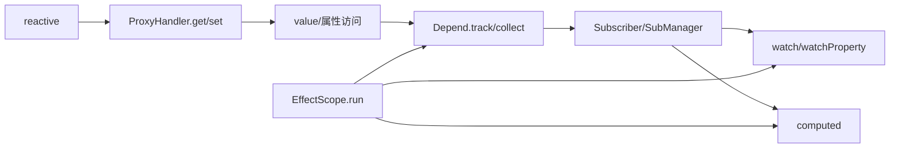

# 常见陷阱与解决方案

<cite>
**本文引用的文件**
- [packages/responsive/src/signal/ref/ref.ts](file://packages/responsive/src/signal/ref/ref.ts)
- [packages/responsive/src/signal/ref/helpers.ts](file://packages/responsive/src/signal/ref/helpers.ts)
- [packages/responsive/src/signal/reactive/proxy-handler.ts](file://packages/responsive/src/signal/reactive/proxy-handler.ts)
- [packages/responsive/src/signal/computed/computed.ts](file://packages/responsive/src/signal/computed/computed.ts)
- [packages/responsive/src/signal/watch/watch.ts](file://packages/responsive/src/signal/watch/watch.ts)
- [packages/responsive/src/effect/effect-scope.ts](file://packages/responsive/src/effect/effect-scope.ts)
- [packages/responsive/src/effect/effect.ts](file://packages/responsive/src/effect/effect.ts)
- [packages/responsive/src/signal/utils/conversion.ts](file://packages/responsive/src/signal/utils/conversion.ts)
- [packages/responsive/__tests__/signal/reactive.test.ts](file://packages/responsive/__tests__/signal/reactive.test.ts)
- [packages/responsive/__tests__/signal/watch.test.ts](file://packages/responsive/__tests__/signal/watch.test.ts)
- [packages/responsive/__tests__/effect/effect-scope.test.ts](file://packages/responsive/__tests__/effect/effect-scope.test.ts)
- [packages/responsive/README.md](file://packages/responsive/README.md)
</cite>

## 目录
1. [引言](#引言)
2. [项目结构](#项目结构)
3. [核心组件](#核心组件)
4. [架构总览](#架构总览)
5. [详细组件分析](#详细组件分析)
6. [依赖关系分析](#依赖关系分析)
7. [性能考量](#性能考量)
8. [故障排查指南](#故障排查指南)
9. [结论](#结论)

## 引言
本指南聚焦响应式开发中的常见陷阱，结合仓库实现，系统讲解以下问题及解决方案：
- 解构 reactive 对象导致响应性丢失（使用 toRefs 保持响应性）
- 异步操作中 await 导致副作用作用域中断（使用 EffectScope.run 重新进入）
- watch 监听器未正确清理导致内存泄漏（使用 onCleanup 或手动 dispose）
- computed 属性未访问 .value 导致依赖未正确收集（确保访问 value）

每个问题均提供“错误示例”“问题根源分析”“正确解决方案”“调试技巧”，帮助快速定位并修复。

## 项目结构
本仓库采用分包组织，响应式核心位于 packages/responsive，包含 signal（ref、reactive、computed、watch）、effect（作用域与副作用）、observer（订阅与调度）等模块。测试覆盖了上述关键能力，便于对照验证。

图表来源
- [packages/responsive/src/signal/ref/ref.ts](file://packages/responsive/src/signal/ref/ref.ts#L1-L120)
- [packages/responsive/src/signal/ref/helpers.ts](file://packages/responsive/src/signal/ref/helpers.ts#L120-L200)
- [packages/responsive/src/signal/reactive/proxy-handler.ts](file://packages/responsive/src/signal/reactive/proxy-handler.ts#L1-L120)
- [packages/responsive/src/signal/computed/computed.ts](file://packages/responsive/src/signal/computed/computed.ts#L1-L120)
- [packages/responsive/src/signal/watch/watch.ts](file://packages/responsive/src/signal/watch/watch.ts#L1-L120)
- [packages/responsive/src/effect/effect-scope.ts](file://packages/responsive/src/effect/effect-scope.ts#L112-L154)
- [packages/responsive/src/effect/effect.ts](file://packages/responsive/src/effect/effect.ts#L90-L140)
- [packages/responsive/src/signal/utils/conversion.ts](file://packages/responsive/src/signal/utils/conversion.ts#L1-L49)

章节来源
- [packages/responsive/src/signal/ref/ref.ts](file://packages/responsive/src/signal/ref/ref.ts#L1-L120)
- [packages/responsive/src/signal/ref/helpers.ts](file://packages/responsive/src/signal/ref/helpers.ts#L120-L200)
- [packages/responsive/src/signal/reactive/proxy-handler.ts](file://packages/responsive/src/signal/reactive/proxy-handler.ts#L1-L120)
- [packages/responsive/src/signal/computed/computed.ts](file://packages/responsive/src/signal/computed/computed.ts#L1-L120)
- [packages/responsive/src/signal/watch/watch.ts](file://packages/responsive/src/signal/watch/watch.ts#L1-L120)
- [packages/responsive/src/effect/effect-scope.ts](file://packages/responsive/src/effect/effect-scope.ts#L112-L154)
- [packages/responsive/src/effect/effect.ts](file://packages/responsive/src/effect/effect.ts#L90-L140)
- [packages/responsive/src/signal/utils/conversion.ts](file://packages/responsive/src/signal/utils/conversion.ts#L1-L49)

## 核心组件
- Ref/浅层Ref：提供响应式引用，支持深浅代理与强制更新。
- reactive：创建响应式代理，惰性深度代理，自动解包嵌套 Ref。
- toRef/toRefs：将对象属性转换为与属性双向绑定的 Ref，或解构 reactive 保持响应性。
- computed：懒计算的计算属性，自动收集依赖并在依赖变化时更新。
- watch/watchProperty：监听信号或函数返回值变化，支持清理函数与立即执行。
- EffectScope：作用域容器，run 方法在作用域上下文中运行，避免 await 后上下文丢失。
- Effect：副作用生命周期管理（active/paused/deprecated）与回调注册。

章节来源
- [packages/responsive/src/signal/ref/ref.ts](file://packages/responsive/src/signal/ref/ref.ts#L120-L220)
- [packages/responsive/src/signal/ref/helpers.ts](file://packages/responsive/src/signal/ref/helpers.ts#L120-L200)
- [packages/responsive/src/signal/reactive/proxy-handler.ts](file://packages/responsive/src/signal/reactive/proxy-handler.ts#L140-L220)
- [packages/responsive/src/signal/computed/computed.ts](file://packages/responsive/src/signal/computed/computed.ts#L180-L260)
- [packages/responsive/src/signal/watch/watch.ts](file://packages/responsive/src/signal/watch/watch.ts#L120-L220)
- [packages/responsive/src/effect/effect-scope.ts](file://packages/responsive/src/effect/effect-scope.ts#L112-L154)
- [packages/responsive/src/effect/effect.ts](file://packages/responsive/src/effect/effect.ts#L90-L140)

## 架构总览
响应式系统围绕“信号（Ref/ProxySignal）—依赖（Depend）—订阅（Subscriber/SubManager）—调度（Scheduler）—作用域（EffectScope）”构建。watch/computed 等高层 API 通过依赖收集与订阅管理实现自动更新。

图表来源
- [packages/responsive/src/effect/effect-scope.ts](file://packages/responsive/src/effect/effect-scope.ts#L112-L154)
- [packages/responsive/src/signal/watch/watch.ts](file://packages/responsive/src/signal/watch/watch.ts#L192-L260)
- [packages/responsive/src/signal/computed/computed.ts](file://packages/responsive/src/signal/computed/computed.ts#L303-L366)

## 详细组件分析

### 解构 reactive 导致响应性丢失（toRefs）
- 问题现象：对 reactive 对象进行解构赋值后，得到的局部变量不再是响应式，修改不会触发依赖更新。
- 根本原因：解构得到的是原始值而非 Ref/ProxySignal，失去依赖追踪。
- 解决方案：使用 toRefs 将 reactive 对象的每个属性转换为与属性双向绑定的 Ref，再进行解构。
- 调试技巧：对比解构前后属性是否仍为 Ref/ProxySignal；使用 watchProperty 监听属性变化确认依赖是否建立。

图表来源
- [packages/responsive/src/signal/ref/helpers.ts](file://packages/responsive/src/signal/ref/helpers.ts#L166-L200)
- [packages/responsive/src/signal/reactive/proxy-handler.ts](file://packages/responsive/src/signal/reactive/proxy-handler.ts#L171-L214)
- [packages/responsive/__tests__/signal/reactive.test.ts](file://packages/responsive/__tests__/signal/reactive.test.ts#L125-L145)

章节来源
- [packages/responsive/src/signal/ref/helpers.ts](file://packages/responsive/src/signal/ref/helpers.ts#L166-L200)
- [packages/responsive/src/signal/reactive/proxy-handler.ts](file://packages/responsive/src/signal/reactive/proxy-handler.ts#L171-L214)
- [packages/responsive/__tests__/signal/reactive.test.ts](file://packages/responsive/__tests__/signal/reactive.test.ts#L125-L145)
- [packages/responsive/README.md](file://packages/responsive/README.md#L295-L306)

### 异步操作 await 导致副作用作用域中断（EffectScope.run）
- 问题现象：在异步函数中 await 后，依赖收集上下文丢失，后续 watch/computed 等无法正确建立依赖。
- 根本原因：异步上下文切换导致当前作用域不可用。
- 解决方案：使用 EffectScope.run 包裹 await 后的副作用创建逻辑，确保依赖在正确的上下文中建立。
- 调试技巧：在 run 中打印当前作用域，确认 await 前后作用域一致；必要时在 await 后再次调用 run。

图表来源
- [packages/responsive/src/effect/effect-scope.ts](file://packages/responsive/src/effect/effect-scope.ts#L112-L154)
- [packages/responsive/README.md](file://packages/responsive/README.md#L1394-L1410)

章节来源
- [packages/responsive/src/effect/effect-scope.ts](file://packages/responsive/src/effect/effect-scope.ts#L112-L154)
- [packages/responsive/README.md](file://packages/responsive/README.md#L1394-L1410)

### watch 监听器未正确清理导致内存泄漏（onCleanup/dispose）
- 问题现象：监听器未清理定时器/事件监听器等外部资源，组件卸载后仍占用内存。
- 根本原因：未在回调中注册清理函数，或未在组件销毁时调用订阅者的 dispose。
- 解决方案：在 watch 回调中使用 onCleanup 注册清理函数；在组件/模块销毁时调用订阅者 dispose。
- 调试技巧：在 onCleanup 中打点日志，确认回调触发次数与清理调用次数一致；使用测试断言验证清理行为。

图表来源
- [packages/responsive/src/signal/watch/watch.ts](file://packages/responsive/src/signal/watch/watch.ts#L192-L260)
- [packages/responsive/__tests__/signal/watch.test.ts](file://packages/responsive/__tests__/signal/watch.test.ts#L158-L177)

章节来源
- [packages/responsive/src/signal/watch/watch.ts](file://packages/responsive/src/signal/watch/watch.ts#L192-L260)
- [packages/responsive/__tests__/signal/watch.test.ts](file://packages/responsive/__tests__/signal/watch.test.ts#L158-L177)

### computed 属性未访问 .value 导致依赖未收集（懒计算）
- 问题现象：未访问 computed 的 .value，导致 getter 内部依赖未被收集，值不会随依赖变化而更新。
- 根本原因：computed 采用懒计算策略，只有在访问 value 时才收集依赖并缓存结果。
- 解决方案：确保在模板/渲染中访问 computed.value；或在需要时显式读取以触发依赖收集。
- 调试技巧：在 getter 内部增加日志，确认访问 value 时是否触发；使用 watchProperty 监听 computed 的 value 变化。

图表来源
- [packages/responsive/src/signal/computed/computed.ts](file://packages/responsive/src/signal/computed/computed.ts#L192-L260)
- [packages/responsive/src/signal/computed/computed.ts](file://packages/responsive/src/signal/computed/computed.ts#L303-L366)

章节来源
- [packages/responsive/src/signal/computed/computed.ts](file://packages/responsive/src/signal/computed/computed.ts#L192-L260)
- [packages/responsive/src/signal/computed/computed.ts](file://packages/responsive/src/signal/computed/computed.ts#L303-L366)

## 依赖关系分析
- reactive 通过惰性深度代理与 Ref 自动解包，保证对象属性访问时的响应性。
- toRef/toRefs 将属性转换为 Ref，确保解构后仍可双向绑定。
- watch/watchProperty 基于 Depend/SubManager 建立订阅，支持清理函数与立即执行。
- computed 基于 Depend.collect 收集依赖，懒计算并缓存结果。
- EffectScope.run 维护作用域上下文，避免异步 await 后依赖收集丢失。

图表来源
- [packages/responsive/src/signal/reactive/proxy-handler.ts](file://packages/responsive/src/signal/reactive/proxy-handler.ts#L171-L214)
- [packages/responsive/src/signal/watch/watch.ts](file://packages/responsive/src/signal/watch/watch.ts#L192-L260)
- [packages/responsive/src/signal/computed/computed.ts](file://packages/responsive/src/signal/computed/computed.ts#L303-L366)
- [packages/responsive/src/effect/effect-scope.ts](file://packages/responsive/src/effect/effect-scope.ts#L112-L154)

章节来源
- [packages/responsive/src/signal/reactive/proxy-handler.ts](file://packages/responsive/src/signal/reactive/proxy-handler.ts#L171-L214)
- [packages/responsive/src/signal/watch/watch.ts](file://packages/responsive/src/signal/watch/watch.ts#L192-L260)
- [packages/responsive/src/signal/computed/computed.ts](file://packages/responsive/src/signal/computed/computed.ts#L303-L366)
- [packages/responsive/src/effect/effect-scope.ts](file://packages/responsive/src/effect/effect-scope.ts#L112-L154)

## 性能考量
- 深度代理与惰性代理：reactive 默认深度代理，但可通过 shallowReactive/shallowRef 控制，减少不必要的代理成本。
- computed 懒计算：避免频繁重复计算，仅在访问 value 时重新计算。
- watch clone 选项：深度克隆新旧值带来额外开销，仅在确需区分对象差异时开启。
- EffectScope 生命周期：及时销毁作用域与订阅，防止资源泄漏。

章节来源
- [packages/responsive/src/signal/reactive/proxy-handler.ts](file://packages/responsive/src/signal/reactive/proxy-handler.ts#L1-L120)
- [packages/responsive/src/signal/computed/computed.ts](file://packages/responsive/src/signal/computed/computed.ts#L1-L120)
- [packages/responsive/src/signal/watch/watch.ts](file://packages/responsive/src/signal/watch/watch.ts#L48-L90)

## 故障排查指南

### 1) 解构 reactive 导致响应性丢失
- 错误示例路径
  - [packages/responsive/__tests__/signal/reactive.test.ts](file://packages/responsive/__tests__/signal/reactive.test.ts#L125-L145)
- 问题根源
  - 解构得到原始值，失去 Ref/ProxySignal 标识，无法参与依赖追踪。
- 正确做法
  - 使用 toRefs 将属性转换为 Ref，再进行解构。
  - 参考实现路径：[packages/responsive/src/signal/ref/helpers.ts](file://packages/responsive/src/signal/ref/helpers.ts#L166-L200)
- 调试技巧
  - 使用 watchProperty 监听属性变化，确认依赖是否建立。
  - 对比解构前后属性类型是否仍为 Ref/ProxySignal。

章节来源
- [packages/responsive/__tests__/signal/reactive.test.ts](file://packages/responsive/__tests__/signal/reactive.test.ts#L125-L145)
- [packages/responsive/src/signal/ref/helpers.ts](file://packages/responsive/src/signal/ref/helpers.ts#L166-L200)

### 2) 异步 await 导致副作用作用域中断
- 错误示例路径
  - [packages/responsive/README.md](file://packages/responsive/README.md#L1394-L1410)
- 问题根源
  - 异步上下文切换导致当前作用域不可用，依赖收集失败。
- 正确做法
  - 使用 EffectScope.run 包裹 await 后的副作用创建逻辑。
  - 参考实现路径：[packages/responsive/src/effect/effect-scope.ts](file://packages/responsive/src/effect/effect-scope.ts#L112-L154)
- 调试技巧
  - 在 run 中打印当前作用域，确认 await 前后作用域一致；必要时在 await 后再次调用 run。

章节来源
- [packages/responsive/README.md](file://packages/responsive/README.md#L1394-L1410)
- [packages/responsive/src/effect/effect-scope.ts](file://packages/responsive/src/effect/effect-scope.ts#L112-L154)

### 3) watch 监听器未清理导致内存泄漏
- 错误示例路径
  - [packages/responsive/__tests__/signal/watch.test.ts](file://packages/responsive/__tests__/signal/watch.test.ts#L158-L177)
- 问题根源
  - 未注册 onCleanup 或未在组件销毁时调用 dispose。
- 正确做法
  - 在回调中注册 onCleanup，释放定时器/事件监听器等资源。
  - 在组件/模块销毁时调用订阅者的 dispose。
  - 参考实现路径：[packages/responsive/src/signal/watch/watch.ts](file://packages/responsive/src/signal/watch/watch.ts#L192-L260)
- 调试技巧
  - 断言清理函数调用次数与回调触发次数一致；使用测试验证。

章节来源
- [packages/responsive/__tests__/signal/watch.test.ts](file://packages/responsive/__tests__/signal/watch.test.ts#L158-L177)
- [packages/responsive/src/signal/watch/watch.ts](file://packages/responsive/src/signal/watch/watch.ts#L192-L260)

### 4) computed 未访问 .value 导致依赖未收集
- 错误示例路径
  - [packages/responsive/src/signal/computed/computed.ts](file://packages/responsive/src/signal/computed/computed.ts#L192-L260)
- 问题根源
  - computed 采用懒计算，未访问 value 不会收集依赖。
- 正确做法
  - 在模板/渲染中访问 computed.value；或在需要时显式读取以触发依赖收集。
  - 参考实现路径：[packages/responsive/src/signal/computed/computed.ts](file://packages/responsive/src/signal/computed/computed.ts#L303-L366)
- 调试技巧
  - 在 getter 内部增加日志，确认访问 value 时是否触发；使用 watchProperty 监听 value 变化。

章节来源
- [packages/responsive/src/signal/computed/computed.ts](file://packages/responsive/src/signal/computed/computed.ts#L192-L260)
- [packages/responsive/src/signal/computed/computed.ts](file://packages/responsive/src/signal/computed/computed.ts#L303-L366)

## 结论
- 解构 reactive 应使用 toRefs 保持响应性；
- 异步 await 后需用 EffectScope.run 重新进入作用域；
- watch 必须注册 onCleanup 并在合适时机 dispose；
- computed 必须访问 .value 才能正确收集依赖。

以上实践可显著降低响应式开发中的常见陷阱，提升稳定性与可维护性。