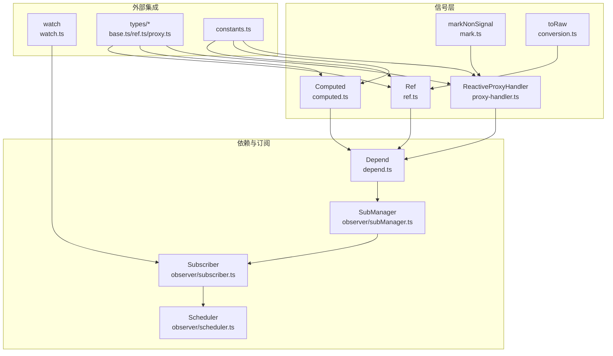
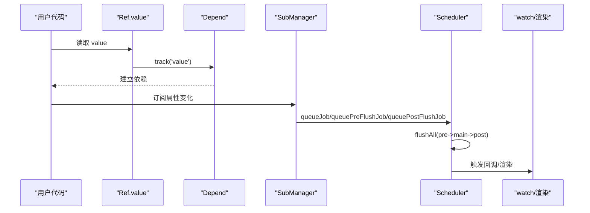
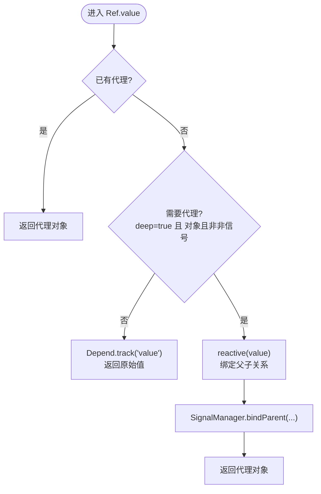
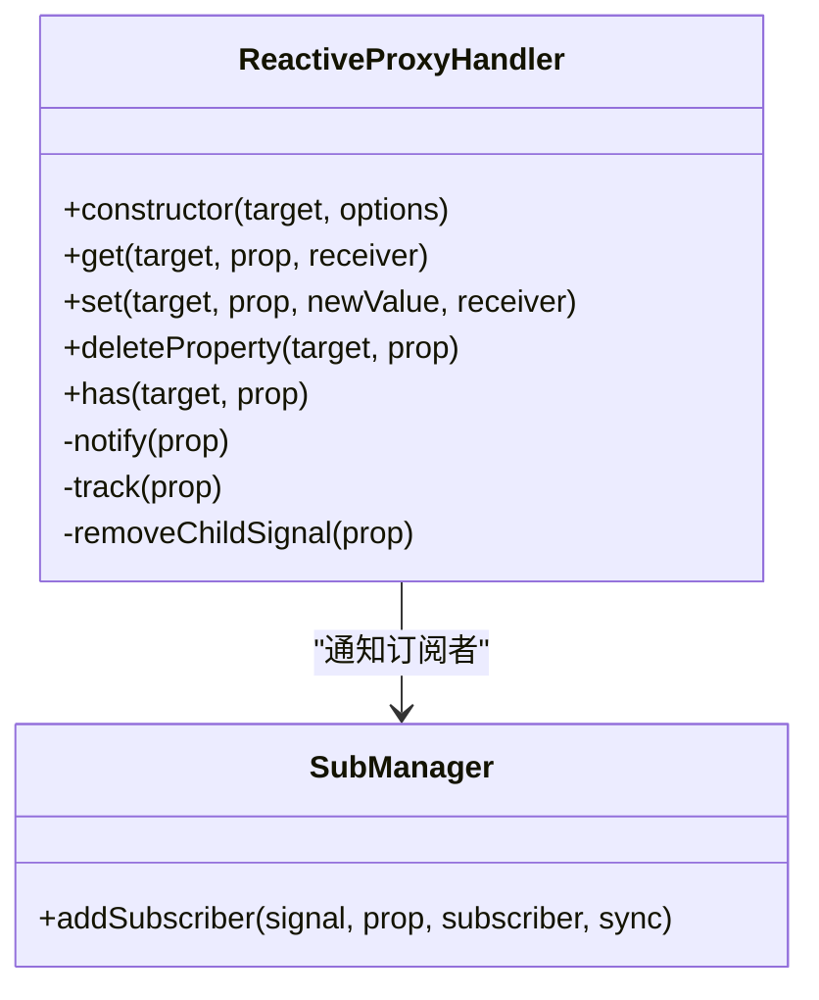
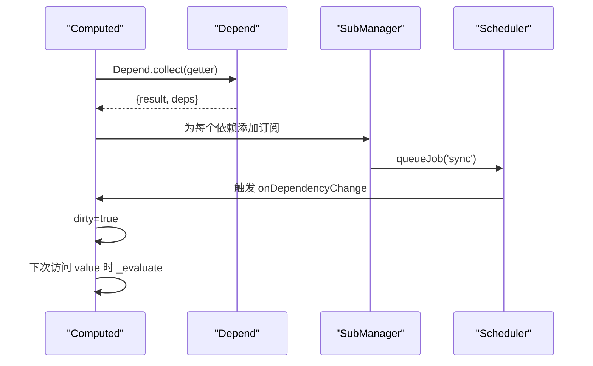
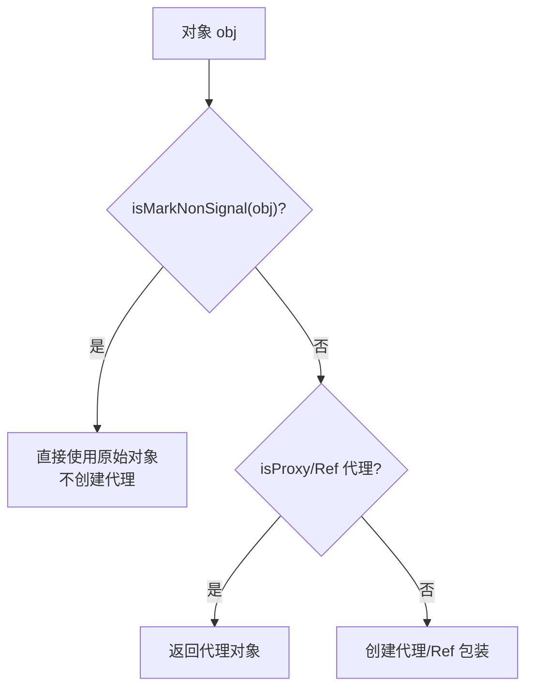
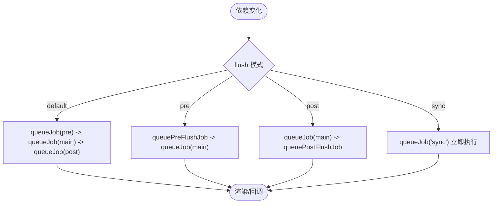
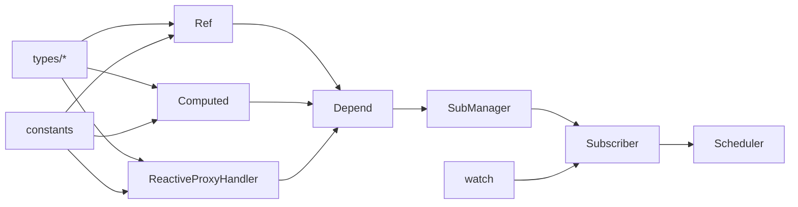

# 性能优化

<cite>
**本文引用的文件**
- [packages/responsive/src/signal/ref/ref.ts](file://packages/responsive/src/signal/ref/ref.ts)
- [packages/responsive/src/signal/computed/computed.ts](file://packages/responsive/src/signal/computed/computed.ts)
- [packages/responsive/src/signal/reactive/proxy-handler.ts](file://packages/responsive/src/signal/reactive/proxy-handler.ts)
- [packages/responsive/src/signal/utils/mark.ts](file://packages/responsive/src/signal/utils/mark.ts)
- [packages/responsive/src/signal/utils/conversion.ts](file://packages/responsive/src/signal/utils/conversion.ts)
- [packages/responsive/src/observer/scheduler.ts](file://packages/responsive/src/observer/scheduler.ts)
- [packages/responsive/src/signal/watch/watch.ts](file://packages/responsive/src/signal/watch/watch.ts)
- [packages/responsive/src/depend/depend.ts](file://packages/responsive/src/depend/depend.ts)
- [packages/responsive/src/signal/constants.ts](file://packages/responsive/src/signal/constants.ts)
- [packages/responsive/src/signal/types/base.ts](file://packages/responsive/src/signal/types/base.ts)
- [packages/responsive/src/signal/types/ref.ts](file://packages/responsive/src/signal/types/ref.ts)
- [packages/responsive/src/signal/types/proxy.ts](file://packages/responsive/src/signal/types/proxy.ts)
- [packages/responsive/__tests__/performance/computed.ts](file://packages/responsive/__tests__/performance/computed.ts)
- [packages/responsive/__tests__/performance/ref.ts](file://packages/responsive/__tests__/performance/ref.ts)
</cite>

## 目录
1. [引言](#引言)
2. [项目结构](#项目结构)
3. [核心组件](#核心组件)
4. [架构总览](#架构总览)
5. [详细组件分析](#详细组件分析)
6. [依赖关系分析](#依赖关系分析)
7. [性能考量](#性能考量)
8. [故障排查指南](#故障排查指南)
9. [结论](#结论)
10. [附录](#附录)

## 引言
本指南聚焦于响应式系统中的关键性能优化策略，围绕以下主题展开：
- 使用 shallowRef 与 shallowReactive 避免对大型或深层对象进行不必要的代理开销
- 使用 markNonSignal 标记静态数据以跳过响应式转换
- 优化 computed 计算属性的依赖收集，减少重复计算
- 结合 sync、pre、post 等不同 flush 调度模式对更新性能的影响
- 在虚拟 DOM 更新频率与内存占用方面给出实践建议与对比思路

## 项目结构
响应式系统位于 packages/responsive，核心模块包括：
- 信号与类型：ref、computed、reactive、watch、types、utils
- 依赖与订阅：depend、observer（subManager、subscriber）、scheduler
- 常量与工具：constants、conversion、mark

图表来源
- [packages/responsive/src/signal/ref/ref.ts](file://packages/responsive/src/signal/ref/ref.ts#L1-L473)
- [packages/responsive/src/signal/computed/computed.ts](file://packages/responsive/src/signal/computed/computed.ts#L1-L367)
- [packages/responsive/src/signal/reactive/proxy-handler.ts](file://packages/responsive/src/signal/reactive/proxy-handler.ts#L1-L398)
- [packages/responsive/src/signal/watch/watch.ts](file://packages/responsive/src/signal/watch/watch.ts#L1-L432)
- [packages/responsive/src/depend/depend.ts](file://packages/responsive/src/depend/depend.ts#L1-L152)
- [packages/responsive/src/observer/scheduler.ts](file://packages/responsive/src/observer/scheduler.ts#L1-L326)
- [packages/responsive/src/signal/constants.ts](file://packages/responsive/src/signal/constants.ts#L1-L25)
- [packages/responsive/src/signal/types/base.ts](file://packages/responsive/src/signal/types/base.ts#L1-L89)
- [packages/responsive/src/signal/types/ref.ts](file://packages/responsive/src/signal/types/ref.ts#L1-L23)
- [packages/responsive/src/signal/types/proxy.ts](file://packages/responsive/src/signal/types/proxy.ts#L1-L19)

章节来源
- [packages/responsive/src/signal/ref/ref.ts](file://packages/responsive/src/signal/ref/ref.ts#L1-L473)
- [packages/responsive/src/signal/computed/computed.ts](file://packages/responsive/src/signal/computed/computed.ts#L1-L367)
- [packages/responsive/src/signal/reactive/proxy-handler.ts](file://packages/responsive/src/signal/reactive/proxy-handler.ts#L1-L398)
- [packages/responsive/src/signal/watch/watch.ts](file://packages/responsive/src/signal/watch/watch.ts#L1-L432)
- [packages/responsive/src/depend/depend.ts](file://packages/responsive/src/depend/depend.ts#L1-L152)
- [packages/responsive/src/observer/scheduler.ts](file://packages/responsive/src/observer/scheduler.ts#L1-L326)
- [packages/responsive/src/signal/constants.ts](file://packages/responsive/src/signal/constants.ts#L1-L25)
- [packages/responsive/src/signal/types/base.ts](file://packages/responsive/src/signal/types/base.ts#L1-L89)
- [packages/responsive/src/signal/types/ref.ts](file://packages/responsive/src/signal/types/ref.ts#L1-L23)
- [packages/responsive/src/signal/types/proxy.ts](file://packages/responsive/src/signal/types/proxy.ts#L1-L19)

## 核心组件
- Ref 与 shallowRef：提供浅层与深层两种响应式引用能力，支持 compare 与 deep 选项，value 访问时惰性代理，避免对静态或大型对象的无谓开销。
- Computed：Vue 风格懒计算，依赖收集后缓存结果，dirty 标记控制重算时机，flush 默认 sync。
- ReactiveProxyHandler：惰性深度代理，按需创建子代理，避免一次性递归代理带来的内存与遍历成本。
- markNonSignal：标记对象为非响应式，跳过代理，适合静态数据、原型方法或大对象。
- Scheduler：三阶段队列（pre/main/post）、参数合并、flushSync 同步刷新，影响更新节奏与吞吐。
- watch：统一监听入口，支持 flush='default'|'pre'|'post'|'sync'，clone 控制新旧值深拷贝成本。

章节来源
- [packages/responsive/src/signal/ref/ref.ts](file://packages/responsive/src/signal/ref/ref.ts#L1-L473)
- [packages/responsive/src/signal/computed/computed.ts](file://packages/responsive/src/signal/computed/computed.ts#L1-L367)
- [packages/responsive/src/signal/reactive/proxy-handler.ts](file://packages/responsive/src/signal/reactive/proxy-handler.ts#L1-L398)
- [packages/responsive/src/signal/utils/mark.ts](file://packages/responsive/src/signal/utils/mark.ts#L1-L60)
- [packages/responsive/src/observer/scheduler.ts](file://packages/responsive/src/observer/scheduler.ts#L1-L326)
- [packages/responsive/src/signal/watch/watch.ts](file://packages/responsive/src/signal/watch/watch.ts#L1-L432)

## 架构总览
响应式更新路径：读取 Ref/Proxy -> 依赖收集 -> 订阅者注册 -> Scheduler 队列 -> 触发回调 -> 通知父级/子级 -> 渲染层更新。

图表来源
- [packages/responsive/src/signal/ref/ref.ts](file://packages/responsive/src/signal/ref/ref.ts#L136-L182)
- [packages/responsive/src/depend/depend.ts](file://packages/responsive/src/depend/depend.ts#L59-L151)
- [packages/responsive/src/observer/scheduler.ts](file://packages/responsive/src/observer/scheduler.ts#L243-L325)
- [packages/responsive/src/signal/watch/watch.ts](file://packages/responsive/src/signal/watch/watch.ts#L147-L191)

## 详细组件分析

### Ref 与 shallowRef：避免不必要的代理开销
- 惰性代理策略：Ref.value 首次访问时根据 deep、isObject、isMarkNonSignal 判断是否创建代理；后续直接返回代理或原始值。
- shallowRef：显式关闭 deep，避免深层对象的代理与遍历，适合大型对象或深层嵌套但不需要逐层响应的场景。
- forceUpdate：在浅引用对象深层属性变更后手动触发，避免遗漏更新。
- compare：自定义比较函数，减少不必要更新。

图表来源
- [packages/responsive/src/signal/ref/ref.ts](file://packages/responsive/src/signal/ref/ref.ts#L136-L182)
- [packages/responsive/src/signal/ref/ref.ts](file://packages/responsive/src/signal/ref/ref.ts#L231-L247)

章节来源
- [packages/responsive/src/signal/ref/ref.ts](file://packages/responsive/src/signal/ref/ref.ts#L136-L182)
- [packages/responsive/src/signal/ref/ref.ts](file://packages/responsive/src/signal/ref/ref.ts#L231-L247)

### ReactiveProxyHandler：惰性深度代理
- 惰性创建子代理：仅在访问到嵌套对象且未被标记为非信号时，按需创建子代理并缓存映射，避免一次性递归代理。
- 数组特殊处理：拦截 length 与集合方法，减少不必要通知。
- 深度标识：DEEP_SIGNAL_SYMBOL 为 true，支持深层解包 RefSignal 值。

图表来源
- [packages/responsive/src/signal/reactive/proxy-handler.ts](file://packages/responsive/src/signal/reactive/proxy-handler.ts#L147-L300)
- [packages/responsive/src/signal/reactive/proxy-handler.ts](file://packages/responsive/src/signal/reactive/proxy-handler.ts#L300-L398)

章节来源
- [packages/responsive/src/signal/reactive/proxy-handler.ts](file://packages/responsive/src/signal/reactive/proxy-handler.ts#L147-L300)
- [packages/responsive/src/signal/reactive/proxy-handler.ts](file://packages/responsive/src/signal/reactive/proxy-handler.ts#L300-L398)

### computed：懒计算与依赖收集
- 懒计算：首次访问 value 时 setupEffect，收集 getter 内部依赖，缓存结果，dirty=false。
- 依赖变更：当依赖变化时 dirty=true，下次访问触发 _evaluate 重新计算。
- flush：默认 'sync'，依赖变化立即触发回调，适合高频依赖场景；可通过 watch 的 flush 控制。

图表来源
- [packages/responsive/src/signal/computed/computed.ts](file://packages/responsive/src/signal/computed/computed.ts#L192-L217)
- [packages/responsive/src/signal/computed/computed.ts](file://packages/responsive/src/signal/computed/computed.ts#L303-L366)
- [packages/responsive/src/depend/depend.ts](file://packages/responsive/src/depend/depend.ts#L129-L151)
- [packages/responsive/src/observer/scheduler.ts](file://packages/responsive/src/observer/scheduler.ts#L243-L325)

章节来源
- [packages/responsive/src/signal/computed/computed.ts](file://packages/responsive/src/signal/computed/computed.ts#L192-L217)
- [packages/responsive/src/signal/computed/computed.ts](file://packages/responsive/src/signal/computed/computed.ts#L303-L366)
- [packages/responsive/src/depend/depend.ts](file://packages/responsive/src/depend/depend.ts#L129-L151)

### markNonSignal：跳过响应式转换
- 标记静态对象：对包含原型方法、不可变数据的大对象使用 markNonSignal，避免被 reactive/Ref 代理。
- 标识符：NON_SIGNAL_SYMBOL，配合 isMarkNonSignal 判断。

图表来源
- [packages/responsive/src/signal/utils/mark.ts](file://packages/responsive/src/signal/utils/mark.ts#L1-L60)
- [packages/responsive/src/signal/reactive/proxy-handler.ts](file://packages/responsive/src/signal/reactive/proxy-handler.ts#L187-L209)
- [packages/responsive/src/signal/ref/ref.ts](file://packages/responsive/src/signal/ref/ref.ts#L231-L247)

章节来源
- [packages/responsive/src/signal/utils/mark.ts](file://packages/responsive/src/signal/utils/mark.ts#L1-L60)
- [packages/responsive/src/signal/reactive/proxy-handler.ts](file://packages/responsive/src/signal/reactive/proxy-handler.ts#L187-L209)
- [packages/responsive/src/signal/ref/ref.ts](file://packages/responsive/src/signal/ref/ref.ts#L231-L247)

### flush 调度模式对更新性能的影响
- default：按 pre->main->post 顺序刷新，适合大多数场景，避免重复渲染。
- pre：在组件更新前执行，适合需要提前准备数据的场景。
- post：在组件更新后执行，适合清理或后置处理。
- sync：每次依赖变化立即触发，适合高频依赖且需要即时反馈的场景；但可能导致多次渲染与调度开销。

图表来源
- [packages/responsive/src/observer/scheduler.ts](file://packages/responsive/src/observer/scheduler.ts#L44-L127)
- [packages/responsive/src/observer/scheduler.ts](file://packages/responsive/src/observer/scheduler.ts#L243-L325)
- [packages/responsive/src/signal/watch/watch.ts](file://packages/responsive/src/signal/watch/watch.ts#L147-L191)

章节来源
- [packages/responsive/src/observer/scheduler.ts](file://packages/responsive/src/observer/scheduler.ts#L44-L127)
- [packages/responsive/src/observer/scheduler.ts](file://packages/responsive/src/observer/scheduler.ts#L243-L325)
- [packages/responsive/src/signal/watch/watch.ts](file://packages/responsive/src/signal/watch/watch.ts#L147-L191)

### toRaw：访问原始值
- 通过 SIGNAL_RAW_VALUE_SYMBOL 获取 Ref/Proxy/Computed 的原始值，避免依赖收集与代理开销，适合需要直接操作原始数据的场景。

章节来源
- [packages/responsive/src/signal/utils/conversion.ts](file://packages/responsive/src/signal/utils/conversion.ts#L1-L49)
- [packages/responsive/src/signal/constants.ts](file://packages/responsive/src/signal/constants.ts#L1-L25)

## 依赖关系分析
- Ref/Computed/Reactive 依赖 Depend 进行依赖收集，SubManager 建立订阅关系，Scheduler 统一调度。
- watch 提供统一监听入口，支持多种 flush 模式与 clone 选项。
- types/base.ts 定义 SignalOptions、BaseSignal、NonSignal 等基础类型，约束 deep、compare、标识符等行为。

图表来源
- [packages/responsive/src/signal/ref/ref.ts](file://packages/responsive/src/signal/ref/ref.ts#L1-L473)
- [packages/responsive/src/signal/computed/computed.ts](file://packages/responsive/src/signal/computed/computed.ts#L1-L367)
- [packages/responsive/src/signal/reactive/proxy-handler.ts](file://packages/responsive/src/signal/reactive/proxy-handler.ts#L1-L398)
- [packages/responsive/src/depend/depend.ts](file://packages/responsive/src/depend/depend.ts#L1-L152)
- [packages/responsive/src/observer/scheduler.ts](file://packages/responsive/src/observer/scheduler.ts#L1-L326)
- [packages/responsive/src/signal/watch/watch.ts](file://packages/responsive/src/signal/watch/watch.ts#L1-L432)
- [packages/responsive/src/signal/types/base.ts](file://packages/responsive/src/signal/types/base.ts#L1-L89)
- [packages/responsive/src/signal/types/ref.ts](file://packages/responsive/src/signal/types/ref.ts#L1-L23)
- [packages/responsive/src/signal/types/proxy.ts](file://packages/responsive/src/signal/types/proxy.ts#L1-L19)
- [packages/responsive/src/signal/constants.ts](file://packages/responsive/src/signal/constants.ts#L1-L25)

章节来源
- [packages/responsive/src/signal/types/base.ts](file://packages/responsive/src/signal/types/base.ts#L1-L89)
- [packages/responsive/src/signal/types/ref.ts](file://packages/responsive/src/signal/types/ref.ts#L1-L23)
- [packages/responsive/src/signal/types/proxy.ts](file://packages/responsive/src/signal/types/proxy.ts#L1-L19)

## 性能考量
- 避免深层代理的通用策略
  - 对大型对象或深层嵌套但不需要逐层响应的数据，使用 shallowRef 或 markNonSignal，减少代理与遍历成本。
  - 对静态数据（如原型方法、不可变对象）使用 markNonSignal，避免不必要的响应式转换。
- computed 依赖收集与缓存
  - 保持 getter 无副作用，避免不必要的依赖；利用懒计算与 dirty 标记减少重复计算。
  - 若依赖频繁变化，考虑使用 watch 并设置合适的 flush 模式（如 default/pre/post）平衡实时性与吞吐。
- flush 模式选择
  - default：三阶段刷新，适合大多数场景，避免重复渲染。
  - pre/post：在渲染前后执行，适合需要前置准备或后置清理的场景。
  - sync：立即触发，适合高频依赖且需要即时反馈，但可能增加调度与渲染压力。
- 内存与更新频率
  - 惰性代理与浅层引用显著降低内存占用与遍历成本。
  - 合理使用 clone 选项（watch 中）控制深拷贝开销，避免对大对象进行深拷贝。

[本节为通用性能指导，不直接分析具体文件]

## 故障排查指南
- 依赖未触发更新
  - 检查是否使用 shallowRef 后未调用 forceUpdate；确认依赖访问路径是否正确。
  - 确认 computed getter 是否访问了正确的响应式属性。
- flush 模式导致频繁更新
  - 将 watch 的 flush 从 'sync' 调整为 'default'/'pre'/'post'，观察更新频率与性能变化。
- 内存增长
  - 使用 markNonSignal 标记静态对象；避免对大型对象进行深度代理；减少不必要的订阅数量。
- 性能测试参考
  - 可参考仓库中的性能测试文件，对比不同策略下的执行时间与内存增量。

章节来源
- [packages/responsive/__tests__/performance/computed.ts](file://packages/responsive/__tests__/performance/computed.ts#L1-L27)
- [packages/responsive/__tests__/performance/ref.ts](file://packages/responsive/__tests__/performance/ref.ts#L1-L18)

## 结论
通过合理运用 shallowRef/shallowReactive、markNonSignal、computed 的懒计算与依赖收集、以及 flush 调度模式，可以在保证响应式能力的同时显著降低代理开销、内存占用与更新频率，从而构建高性能应用。建议在大型对象与静态数据场景优先采用浅层策略与静态标记，在高频依赖场景谨慎使用 sync 模式，并结合性能测试持续优化。

[本节为总结性内容，不直接分析具体文件]

## 附录
- 关键 API 与选项
  - ref/shallowRef：deep、compare
  - reactive：deep、compare
  - computed：immediate、scope、setter
  - watch：flush、clone、immediate、limit、scope
  - markNonSignal/isMarkNonSignal：静态对象标记
  - toRaw：获取原始值

章节来源
- [packages/responsive/src/signal/ref/ref.ts](file://packages/responsive/src/signal/ref/ref.ts#L355-L472)
- [packages/responsive/src/signal/computed/computed.ts](file://packages/responsive/src/signal/computed/computed.ts#L30-L118)
- [packages/responsive/src/signal/watch/watch.ts](file://packages/responsive/src/signal/watch/watch.ts#L147-L191)
- [packages/responsive/src/signal/utils/mark.ts](file://packages/responsive/src/signal/utils/mark.ts#L1-L60)
- [packages/responsive/src/signal/utils/conversion.ts](file://packages/responsive/src/signal/utils/conversion.ts#L1-L49)
- [packages/responsive/src/signal/types/base.ts](file://packages/responsive/src/signal/types/base.ts#L14-L47)