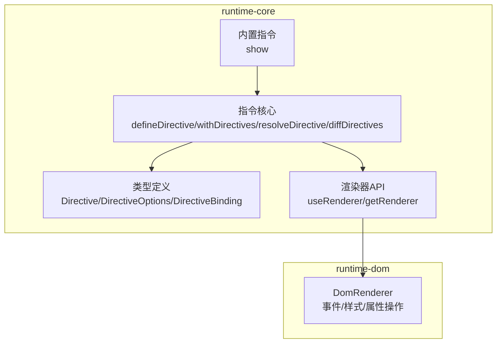
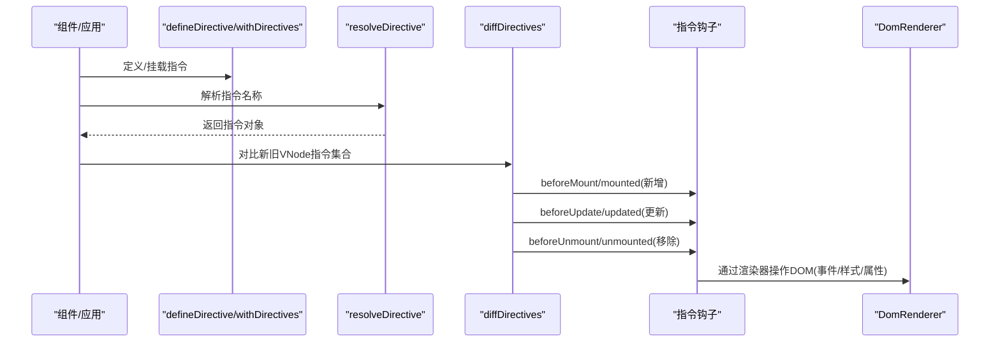
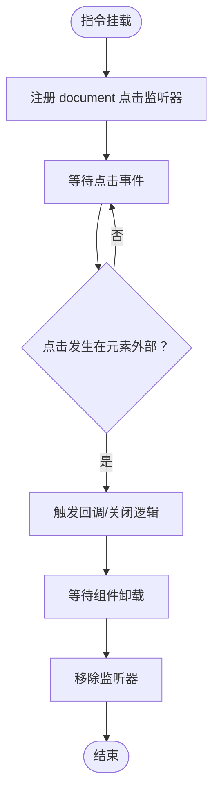
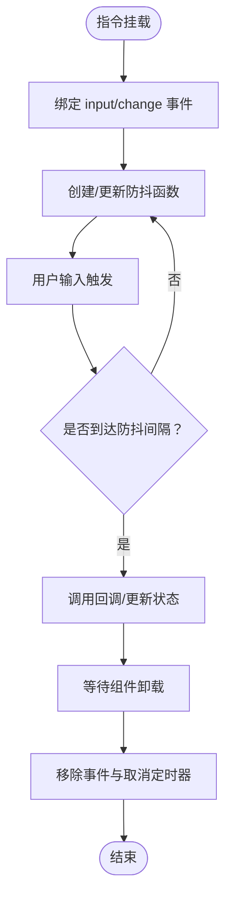
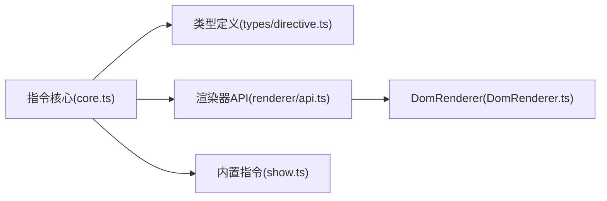

# 自定义指令开发

<cite>
**本文引用的文件**
- [packages/runtime-core/src/directive/core.ts](file://packages/runtime-core/src/directive/core.ts)
- [packages/runtime-core/src/types/directive.ts](file://packages/runtime-core/src/types/directive.ts)
- [packages/runtime-core/src/directive/index.ts](file://packages/runtime-core/src/directive/index.ts)
- [packages/runtime-core/src/directive/show.ts](file://packages/runtime-core/src/directive/show.ts)
- [packages/runtime-core/src/renderer/api.ts](file://packages/runtime-core/src/renderer/api.ts)
- [packages/runtime-dom/src/client/DomRenderer.ts](file://packages/runtime-dom/src/client/DomRenderer.ts)
- [packages/runtime-core/src/constants/hook.ts](file://packages/runtime-core/src/constants/hook.ts)
- [packages/runtime-core/__tests__/directive/core.test.ts](file://packages/runtime-core/__tests__/directive/core.test.ts)
- [packages/runtime-core/__tests__/directive/show.test.ts](file://packages/runtime-core/__tests__/directive/show.test.ts)
</cite>

## 目录
1. [简介](#简介)
2. [项目结构](#项目结构)
3. [核心组件](#核心组件)
4. [架构总览](#架构总览)
5. [详细组件分析](#详细组件分析)
6. [依赖关系分析](#依赖关系分析)
7. [性能考量](#性能考量)
8. [故障排查指南](#故障排查指南)
9. [结论](#结论)
10. [附录](#附录)

## 简介
本指南面向希望在 Vitarx 框架中开发自定义指令的工程师，系统讲解指令的定义、注册、生命周期钩子、DOM 操作、事件绑定与状态管理，以及与组件逻辑的交互方式。文档还提供两个实战案例的完整实现路径：v-click-outside（点击外部关闭）与 v-debounce（输入防抖），涵盖类型定义、参数解析、副作用管理与资源清理。最后总结性能与响应式注意事项，帮助你在复杂场景下写出高质量、可维护的指令。

## 项目结构
围绕自定义指令的关键模块主要位于 runtime-core 与 runtime-dom 两个包中：
- runtime-core：指令核心 API（定义、解析、差异更新）、类型定义、内置指令注册、渲染器抽象。
- runtime-dom：浏览器端 DOM 渲染器实现，提供 addEventListener/removeEventListener、样式与属性操作等能力。
- 测试用例：验证指令生命周期、参数与值传递、解析优先级、边界情况等。

图表来源
- [packages/runtime-core/src/directive/core.ts](file://packages/runtime-core/src/directive/core.ts#L1-L329)
- [packages/runtime-core/src/types/directive.ts](file://packages/runtime-core/src/types/directive.ts#L1-L89)
- [packages/runtime-core/src/directive/show.ts](file://packages/runtime-core/src/directive/show.ts#L1-L35)
- [packages/runtime-core/src/renderer/api.ts](file://packages/runtime-core/src/renderer/api.ts#L1-L28)
- [packages/runtime-dom/src/client/DomRenderer.ts](file://packages/runtime-dom/src/client/DomRenderer.ts#L1-L573)

章节来源
- [packages/runtime-core/src/directive/core.ts](file://packages/runtime-core/src/directive/core.ts#L1-L329)
- [packages/runtime-core/src/types/directive.ts](file://packages/runtime-core/src/types/directive.ts#L1-L89)
- [packages/runtime-core/src/directive/index.ts](file://packages/runtime-core/src/directive/index.ts#L1-L8)
- [packages/runtime-core/src/directive/show.ts](file://packages/runtime-core/src/directive/show.ts#L1-L35)
- [packages/runtime-core/src/renderer/api.ts](file://packages/runtime-core/src/renderer/api.ts#L1-L28)
- [packages/runtime-dom/src/client/DomRenderer.ts](file://packages/runtime-dom/src/client/DomRenderer.ts#L1-L573)

## 核心组件
- 指令定义与注册
  - defineDirective：将指令注册到组件局部或全局缓存，支持函数或对象形式。
  - normalizeDirective：标准化指令对象，统一 name 字段。
- 指令挂载与解析
  - withDirectives：为 VNode 添加指令，支持 [指令, 值, 参数] 形式。
  - resolveDirective：按“组件局部 > 应用级 > 全局”的优先级解析指令。
- 指令差异更新
  - diffDirectives：对比新旧 VNode 指令集合，调用 beforeMount/mounted/beforeUpdate/updated/beforeUnmount/unmounted 生命周期钩子。
- 类型与渲染器
  - Directive/DirectiveOptions/DirectiveBinding：指令生命周期钩子与绑定信息。
  - useRenderer/getRenderer：获取渲染器实例，统一 DOM 操作入口。
  - DomRenderer：浏览器端 DOM 渲染器，提供事件、样式、属性等操作。

章节来源
- [packages/runtime-core/src/directive/core.ts](file://packages/runtime-core/src/directive/core.ts#L1-L329)
- [packages/runtime-core/src/types/directive.ts](file://packages/runtime-core/src/types/directive.ts#L1-L89)
- [packages/runtime-core/src/renderer/api.ts](file://packages/runtime-core/src/renderer/api.ts#L1-L28)
- [packages/runtime-dom/src/client/DomRenderer.ts](file://packages/runtime-dom/src/client/DomRenderer.ts#L1-L573)

## 架构总览
下面的序列图展示了指令从定义到生效的完整流程，包括解析、差异更新与生命周期钩子的调用时机。

图表来源
- [packages/runtime-core/src/directive/core.ts](file://packages/runtime-core/src/directive/core.ts#L156-L329)
- [packages/runtime-core/src/renderer/api.ts](file://packages/runtime-core/src/renderer/api.ts#L1-L28)
- [packages/runtime-dom/src/client/DomRenderer.ts](file://packages/runtime-dom/src/client/DomRenderer.ts#L1-L573)

## 详细组件分析

### 指令生命周期与执行时机
- 生命周期钩子（DirectiveOptions）：
  - created：节点元素创建完成但尚未挂载到 DOM 时调用。
  - beforeMount：即将挂载到 DOM 前调用。
  - mounted：真实挂载到 DOM 后调用。
  - beforeUpdate：即将更新前调用。
  - updated：更新后调用；更新钩子通过调度器在微任务队列末尾执行，保证 DOM 已稳定。
  - beforeUnmount：即将卸载前调用。
  - unmounted：卸载后调用。
- 执行时机要点：
  - 新增：beforeMount → mounted。
  - 更新：beforeUpdate → updated（由调度器延迟执行）。
  - 移除：beforeUnmount → unmounted。
- 生命周期钩子的调用由 diffDirectives 统一驱动，确保与 VNode 更新流程一致。

章节来源
- [packages/runtime-core/src/types/directive.ts](file://packages/runtime-core/src/types/directive.ts#L1-L89)
- [packages/runtime-core/src/directive/core.ts](file://packages/runtime-core/src/directive/core.ts#L232-L329)

### 指令定义与注册
- defineDirective
  - 校验指令名，规范化为标准指令对象。
  - 若处于有状态组件上下文，指令存储在组件的指令缓存；否则存储在全局缓存。
- normalizeDirective
  - 函数形式的指令会被包装为包含 mounted/updated 的对象。
  - 对象形式的指令会补全 name 字段。
- 内置指令注册
  - 通过 defineDirective('show', show) 注册内置指令。

章节来源
- [packages/runtime-core/src/directive/core.ts](file://packages/runtime-core/src/directive/core.ts#L28-L87)
- [packages/runtime-core/src/directive/index.ts](file://packages/runtime-core/src/directive/index.ts#L1-L8)
- [packages/runtime-core/src/directive/show.ts](file://packages/runtime-core/src/directive/show.ts#L1-L35)

### 指令挂载与参数解析
- withDirectives
  - 支持两种形式：
    - 指令对象数组：每个元素为 Directive。
    - 元组数组：[Directive, value?, arg?]。
  - 将指令存入 VNode.directives Map，键为指令名，值为 [Directive, value, arg]。
- 参数解析
  - value：传给指令的值，支持任意类型。
  - arg：指令参数，字符串或 undefined。
  - 测试覆盖了字符串、数字、对象、数组、undefined 等值类型与参数缺失的边界情况。

章节来源
- [packages/runtime-core/src/directive/core.ts](file://packages/runtime-core/src/directive/core.ts#L96-L154)
- [packages/runtime-core/__tests__/directive/core.test.ts](file://packages/runtime-core/__tests__/directive/core.test.ts#L51-L236)

### 指令解析优先级
- resolveDirective
  - 优先级：组件局部指令 > 应用级指令 > 全局指令。
  - 未找到时记录警告并返回 undefined。
- 测试验证了全局指令解析与警告行为。

章节来源
- [packages/runtime-core/src/directive/core.ts](file://packages/runtime-core/src/directive/core.ts#L156-L191)
- [packages/runtime-core/__tests__/directive/core.test.ts](file://packages/runtime-core/__tests__/directive/core.test.ts#L123-L151)

### 指令差异更新与调度
- diffDirectives
  - 对比新旧 VNode 的指令集合，分别处理新增、更新与移除。
  - 更新时构造 binding（value/oldValue/arg），beforeUpdate 先触发，updated 通过调度器延迟执行。
  - 移除时先 beforeUnmount，再 unmounted。
- 调度器
  - updated 钩子通过调度器队列在微任务末尾执行，确保 DOM 已稳定。

章节来源
- [packages/runtime-core/src/directive/core.ts](file://packages/runtime-core/src/directive/core.ts#L232-L301)

### DOM 操作与事件绑定
- 渲染器抽象
  - useRenderer/getRenderer 提供统一的 HostRenderer 实例访问。
- DomRenderer
  - 提供 addEventListener/removeEventListener、addStyle/removeStyle/setAttribute 等常用 DOM 操作。
  - 事件绑定支持 capture/once/passive 等选项解析。
- 指令中建议通过渲染器操作 DOM，避免直接依赖平台细节。

章节来源
- [packages/runtime-core/src/renderer/api.ts](file://packages/runtime-core/src/renderer/api.ts#L1-L28)
- [packages/runtime-dom/src/client/DomRenderer.ts](file://packages/runtime-dom/src/client/DomRenderer.ts#L1-L573)

### 实战案例：v-click-outside（点击外部关闭）
以下为实现思路与步骤，便于你对照源码路径完成实现。请勿直接粘贴代码，具体实现请参考相应文件路径。

- 类型与绑定
  - 使用 DirectiveBinding 的 value/oldValue/arg 字段接收传入值与参数。
  - 参考类型定义路径：[packages/runtime-core/src/types/directive.ts](file://packages/runtime-core/src/types/directive.ts#L1-L89)
- 生命周期钩子
  - mounted：注册 document 的点击事件监听器，保存处理器以便后续清理。
  - updated：当 value 变化时，动态启用/禁用监听器。
  - beforeUnmount/unmounted：移除事件监听器，清理副作用。
  - 参考钩子定义路径：[packages/runtime-core/src/types/directive.ts](file://packages/runtime-core/src/types/directive.ts#L1-L89)
- DOM 事件绑定
  - 使用渲染器的 addEventListener/removeEventListener 统一处理事件。
  - 参考渲染器路径：[packages/runtime-dom/src/client/DomRenderer.ts](file://packages/runtime-dom/src/client/DomRenderer.ts#L477-L501)
- 参数解析
  - arg 可用于传递额外配置（如是否启用、目标选择器等）。
  - 参考参数传递路径：[packages/runtime-core/src/directive/core.ts](file://packages/runtime-core/src/directive/core.ts#L96-L154)
- 资源清理
  - 在 beforeUnmount/unmounted 中移除事件监听器，避免内存泄漏。
  - 参考差异更新路径：[packages/runtime-core/src/directive/core.ts](file://packages/runtime-core/src/directive/core.ts#L286-L301)

图表来源
- [packages/runtime-core/src/directive/core.ts](file://packages/runtime-core/src/directive/core.ts#L232-L301)
- [packages/runtime-dom/src/client/DomRenderer.ts](file://packages/runtime-dom/src/client/DomRenderer.ts#L477-L501)

### 实战案例：v-debounce（输入防抖）
以下为实现思路与步骤，便于你对照源码路径完成实现。

- 类型与绑定
  - 使用 DirectiveBinding 的 value/oldValue/arg 接收防抖时间与回调。
  - 参考类型定义路径：[packages/runtime-core/src/types/directive.ts](file://packages/runtime-core/src/types/directive.ts#L1-L89)
- 生命周期钩子
  - mounted：为输入元素绑定 input/change 等事件，创建防抖函数并缓存。
  - updated：当 value 或 arg 变化时，重建防抖函数或调整参数。
  - beforeUnmount/unmounted：移除事件监听器与取消待执行的防抖任务。
  - 参考钩子定义路径：[packages/runtime-core/src/types/directive.ts](file://packages/runtime-core/src/types/directive.ts#L1-L89)
- DOM 事件绑定
  - 使用渲染器的 addEventListener/removeEventListener 统一处理事件。
  - 参考渲染器路径：[packages/runtime-dom/src/client/DomRenderer.ts](file://packages/runtime-dom/src/client/DomRenderer.ts#L477-L501)
- 参数解析
  - arg 可用于传递防抖间隔（毫秒）。
  - 参考参数传递路径：[packages/runtime-core/src/directive/core.ts](file://packages/runtime-core/src/directive/core.ts#L96-L154)
- 资源清理
  - 在 beforeUnmount/unmounted 中移除事件监听器与取消定时器。
  - 参考差异更新路径：[packages/runtime-core/src/directive/core.ts](file://packages/runtime-core/src/directive/core.ts#L286-L301)

图表来源
- [packages/runtime-core/src/directive/core.ts](file://packages/runtime-core/src/directive/core.ts#L232-L301)
- [packages/runtime-dom/src/client/DomRenderer.ts](file://packages/runtime-dom/src/client/DomRenderer.ts#L477-L501)

### 内置指令示例：v-show
- 功能：通过 display 控制元素显示/隐藏，保留原有样式并在卸载时清理。
- 生命周期钩子：
  - created：根据 value 设置 display:none 或保持原样。
  - updated：根据 value 切换 display，并恢复/移除原样式。
  - unmounted：清理 display 样式，恢复原有 display。
- 参考实现路径：[packages/runtime-core/src/directive/show.ts](file://packages/runtime-core/src/directive/show.ts#L1-L35)
- 测试覆盖：值类型、切换行为、边界情况与与 v-show 语义一致性。
- 参考测试路径：[packages/runtime-core/__tests__/directive/show.test.ts](file://packages/runtime-core/__tests__/directive/show.test.ts#L1-L238)

章节来源
- [packages/runtime-core/src/directive/show.ts](file://packages/runtime-core/src/directive/show.ts#L1-L35)
- [packages/runtime-core/__tests__/directive/show.test.ts](file://packages/runtime-core/__tests__/directive/show.test.ts#L1-L238)

## 依赖关系分析
- 指令核心依赖渲染器抽象，通过 useRenderer/getRenderer 获取 HostRenderer 实例，从而统一 DOM 操作。
- DomRenderer 提供事件与样式操作的具体实现，指令在生命周期钩子中通过渲染器调用。
- 指令解析与差异更新贯穿 VNode 生命周期，确保与框架更新流程一致。

图表来源
- [packages/runtime-core/src/directive/core.ts](file://packages/runtime-core/src/directive/core.ts#L1-L329)
- [packages/runtime-core/src/types/directive.ts](file://packages/runtime-core/src/types/directive.ts#L1-L89)
- [packages/runtime-core/src/renderer/api.ts](file://packages/runtime-core/src/renderer/api.ts#L1-L28)
- [packages/runtime-dom/src/client/DomRenderer.ts](file://packages/runtime-dom/src/client/DomRenderer.ts#L1-L573)
- [packages/runtime-core/src/directive/show.ts](file://packages/runtime-core/src/directive/show.ts#L1-L35)

章节来源
- [packages/runtime-core/src/directive/core.ts](file://packages/runtime-core/src/directive/core.ts#L1-L329)
- [packages/runtime-core/src/renderer/api.ts](file://packages/runtime-core/src/renderer/api.ts#L1-L28)
- [packages/runtime-dom/src/client/DomRenderer.ts](file://packages/runtime-dom/src/client/DomRenderer.ts#L1-L573)

## 性能考量
- 更新调度
  - updated 钩子通过调度器在微任务末尾执行，避免与同步 DOM 变更冲突，减少重排/重绘抖动。
- 事件绑定与清理
  - 使用渲染器统一事件绑定与移除，确保在 beforeUnmount/unmounted 中及时清理，避免内存泄漏。
- 响应式与副作用
  - 指令内部若涉及响应式数据，建议使用作用域管理与 onCleanup 清理，避免长生命周期副作用。
  - 参考响应式系统最佳实践与清理建议：[packages/responsive/README.md](file://packages/responsive/README.md#L1355-L1529)
- 防抖与节流
  - 输入类指令建议使用防抖/节流，降低高频事件带来的性能压力。
- 样式与属性
  - 通过渲染器统一设置样式与属性，避免直接操作 DOM 导致的性能问题。

[本节为通用指导，不直接分析具体文件]

## 故障排查指南
- 指令未生效
  - 检查 resolveDirective 是否能解析到指令（组件局部 > 应用级 > 全局）。
  - 确认 withDirectives 是否正确挂载到 VNode。
  - 参考解析与挂载路径：[packages/runtime-core/src/directive/core.ts](file://packages/runtime-core/src/directive/core.ts#L156-L191), [packages/runtime-core/src/directive/core.ts](file://packages/runtime-core/src/directive/core.ts#L96-L154)
- 生命周期未触发
  - 确认指令是否在新增/更新/移除场景下被正确调用。
  - 参考差异更新路径：[packages/runtime-core/src/directive/core.ts](file://packages/runtime-core/src/directive/core.ts#L232-L301)
- 事件未清理导致内存泄漏
  - 在 beforeUnmount/unmounted 中移除事件监听器。
  - 参考渲染器事件处理路径：[packages/runtime-dom/src/client/DomRenderer.ts](file://packages/runtime-dom/src/client/DomRenderer.ts#L477-L501)
- 样式残留
  - 卸载时恢复/移除 display 等样式，避免影响后续渲染。
  - 参考内置指令 show 的清理逻辑：[packages/runtime-core/src/directive/show.ts](file://packages/runtime-core/src/directive/show.ts#L1-L35)

章节来源
- [packages/runtime-core/src/directive/core.ts](file://packages/runtime-core/src/directive/core.ts#L156-L301)
- [packages/runtime-dom/src/client/DomRenderer.ts](file://packages/runtime-dom/src/client/DomRenderer.ts#L477-L501)
- [packages/runtime-core/src/directive/show.ts](file://packages/runtime-core/src/directive/show.ts#L1-L35)

## 结论
通过本指南，你可以基于 Vitarx 的指令体系，安全地定义、注册与使用自定义指令。遵循生命周期钩子的执行时机、通过渲染器统一操作 DOM、在卸载时清理副作用，是编写高质量指令的关键。内置指令 show 提供了良好的实践范式，而 v-click-outside 与 v-debounce 则展示了常见业务场景的实现路径。结合响应式系统的最佳实践，你可以在复杂场景中构建高性能、可维护的指令生态。

[本节为总结性内容，不直接分析具体文件]

## 附录
- 指令生命周期钩子枚举（组件层面）
  - 参考路径：[packages/runtime-core/src/constants/hook.ts](file://packages/runtime-core/src/constants/hook.ts#L1-L15)
- 指令类型定义
  - 参考路径：[packages/runtime-core/src/types/directive.ts](file://packages/runtime-core/src/types/directive.ts#L1-L89)
- 指令核心 API
  - 参考路径：[packages/runtime-core/src/directive/core.ts](file://packages/runtime-core/src/directive/core.ts#L1-L329)
- 渲染器 API
  - 参考路径：[packages/runtime-core/src/renderer/api.ts](file://packages/runtime-core/src/renderer/api.ts#L1-L28)
- DomRenderer 实现
  - 参考路径：[packages/runtime-dom/src/client/DomRenderer.ts](file://packages/runtime-dom/src/client/DomRenderer.ts#L1-L573)
- 测试用例
  - 指令核心测试：[packages/runtime-core/__tests__/directive/core.test.ts](file://packages/runtime-core/__tests__/directive/core.test.ts#L1-L236)
  - 内置指令 show 测试：[packages/runtime-core/__tests__/directive/show.test.ts](file://packages/runtime-core/__tests__/directive/show.test.ts#L1-L238)