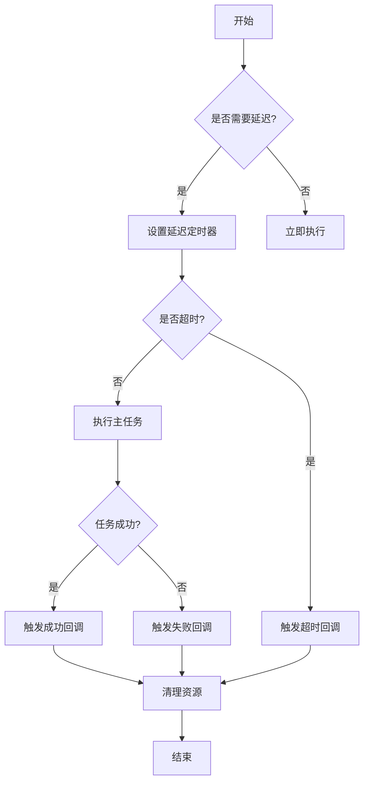

# 进阶指南

<cite>
**本文档中引用的文件**  
- [ref.ts](file://packages/responsive/src/signal/ref/ref.ts)
- [computed.ts](file://packages/responsive/src/signal/computed/computed.ts)
- [effect-scope.ts](file://packages/responsive/src/effect/effect-scope.ts)
- [mark.ts](file://packages/responsive/src/signal/utils/mark.ts)
- [conversion.ts](file://packages/responsive/src/signal/utils/conversion.ts)
- [clone.ts](file://packages/utils/src/clone.ts)
- [delay.ts](file://packages/utils/src/delay.ts)
- [watch.ts](file://packages/responsive/src/signal/watch/watch.ts)
- [depend.ts](file://packages/responsive/src/depend/depend.ts)
</cite>

## 目录
1. [性能优化策略](#性能优化策略)
2. [常见陷阱与解决方案](#常见陷阱与解决方案)
3. [自定义指令开发](#自定义指令开发)
4. [内置工具函数应用](#内置工具函数应用)
5. [内存泄漏与性能瓶颈规避](#内存泄漏与性能瓶颈规避)

## 性能优化策略

在Vitarx框架中，响应式系统是核心机制，但不当使用可能导致性能问题。通过合理使用`shallowRef`、`shallowReactive`和`markNonSignal`等API，可以有效避免不必要的代理开销。

`shallowRef`创建的引用对象仅对其`value`属性进行响应式处理，而不会递归代理其内部对象。这对于包含大量嵌套数据但仅需顶层响应的场景非常有用。当需要更新嵌套属性时，应使用`forceUpdate`方法手动触发更新通知。

`markNonSignal`函数用于标记一个对象为非响应式，确保它不会被转换为响应式代理。这在处理包含方法或不希望被响应式化的复杂对象时特别有用。该函数通过在对象上设置特殊符号属性来实现标记，已被标记的对象会直接返回，避免重复操作。

`computed`计算属性采用懒计算策略，仅在依赖变化且被访问时才重新计算。通过合理设计计算属性的依赖关系，可以避免不必要的重复计算。对于需要立即执行的场景，可设置`immediate`选项。

**Section sources**
- [ref.ts](file://packages/responsive/src/signal/ref/ref.ts#L413-L472)
- [computed.ts](file://packages/responsive/src/signal/computed/computed.ts#L156-L173)
- [mark.ts](file://packages/responsive/src/signal/utils/mark.ts#L23-L37)

## 常见陷阱与解决方案

解构赋值是JavaScript中常见的模式，但在响应式系统中可能导致响应性丢失。当从响应式对象中解构属性时，得到的是普通值而非响应式引用。为保持响应性，应使用`toRaw`函数获取原始对象，或直接访问响应式对象的属性。

异步操作中的作用域管理是另一个常见问题。在异步回调中，可能无法正确捕获当前的响应式上下文。`EffectScope`类提供了作用域管理机制，通过`run`方法在指定作用域内执行函数，确保副作用能被正确收集和清理。作用域可以嵌套，子作用域会自动附加到父作用域，形成清晰的生命周期管理层次。

在处理异步操作时，应使用`withDelayAndTimeout`工具函数来管理延迟和超时逻辑。该函数返回一个带有取消功能的Promise，允许在特定条件下手动取消异步任务，避免不必要的资源消耗。

**Section sources**
- [conversion.ts](file://packages/responsive/src/signal/utils/conversion.ts#L43-L48)
- [effect-scope.ts](file://packages/responsive/src/effect/effect-scope.ts#L123-L125)
- [delay.ts](file://packages/utils/src/delay.ts#L72-L144)

## 自定义指令开发

Vitarx框架提供了强大的指令系统，允许开发者创建自定义指令来扩展功能。指令通过`BaseWidgetController`基类实现，该类定义了Widget节点的生命周期管理和基本操作方法。

自定义指令需要实现`updateProps`方法来处理属性更新逻辑。在`render`、`mount`、`activate`、`deactivate`和`unmount`等生命周期方法中，可以调用`callDirHook`来触发相应的指令钩子。这种设计模式确保了指令能在正确的时机执行，并与组件生命周期保持同步。

指令的更新通过`diffProps`方法实现，该方法比较新旧属性对象的差异，并返回发生变化的属性键名数组。这种细粒度的更新机制避免了不必要的全量更新，提高了性能。

**Section sources**
- [BaseWidgetController.ts](file://packages/runtime-core/src/controllers/BaseWidgetController.ts#L47-L115)

## 内置工具函数应用

Vitarx提供了多个内置工具函数来支持复杂状态管理。`clone`函数实现了深度克隆，能够处理循环引用和各种内置对象类型。该函数使用广度优先遍历和`WeakMap`来跟踪已克隆的对象，确保循环引用能被正确处理。

`delay`相关的`withDelayAndTimeout`函数为异步任务提供了延迟显示和超时控制功能。通过配置`delay`和`timeout`选项，可以在长时间运行的任务中提供更好的用户体验。`signal`函数允许检查任务是否仍然有效，为异步操作提供了额外的控制能力。

在状态管理中，`watch`函数提供了灵活的监听机制。通过`clone`选项可以深度克隆新旧值，解决对象引用无法辨别差异的问题。`immediate`选项允许立即执行一次回调，而`onCleanup`参数提供了清理资源的机制，确保不会发生内存泄漏。

**Diagram sources**
- [delay.ts](file://packages/utils/src/delay.ts#L72-L144)

**Section sources**
- [clone.ts](file://packages/utils/src/clone.ts#L77-L123)
- [delay.ts](file://packages/utils/src/delay.ts#L72-L144)
- [watch.ts](file://packages/responsive/src/signal/watch/watch.ts#L192-L295)

## 内存泄漏与性能瓶颈规避

内存泄漏是响应式系统中的常见问题，主要源于未正确清理的订阅和副作用。`EffectScope`类通过`dispose`方法提供了完整的清理机制，会触发所有副作用的`dispose`方法并清空内部存储。建议在组件销毁时调用作用域的`dispose`方法，确保所有资源被正确释放。

性能瓶颈通常出现在过度使用响应式系统或不当的依赖追踪中。通过使用`shallowRef`和`markNonSignal`可以减少不必要的代理开销。对于计算属性，应避免在getter函数中执行昂贵的操作，或将这些操作缓存起来。

在大规模数据更新场景中，应考虑使用批量更新策略。`Depend`类的`collect`方法可以收集函数执行过程中的所有依赖，结合`SubManager`的批量订阅机制，可以显著提高更新效率。性能测试文件显示，合理使用这些优化策略可以有效控制内存增量。

**Section sources**
- [effect-scope.ts](file://packages/responsive/src/effect/effect-scope.ts#L166-L178)
- [ref.ts](file://packages/responsive/src/signal/ref/ref.ts#L109-L182)
- [depend.ts](file://packages/responsive/src/depend/depend.ts#L75-L79)
- [ref.ts](file://packages/responsive/__tests__/performance/ref.ts#L1-L18)
- [computed.ts](file://packages/responsive/__tests__/performance/computed.ts#L1-L27)