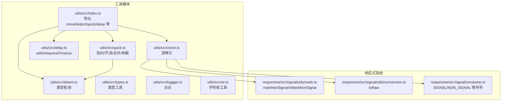
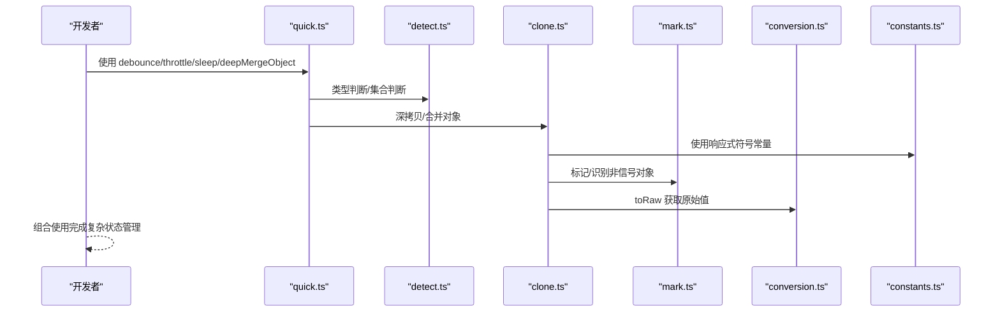
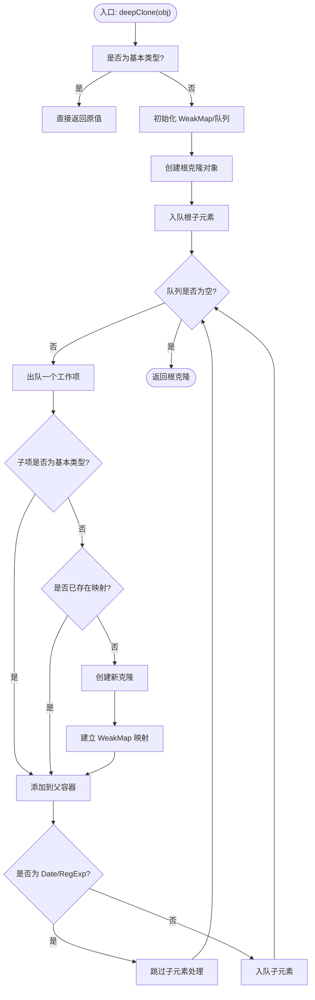
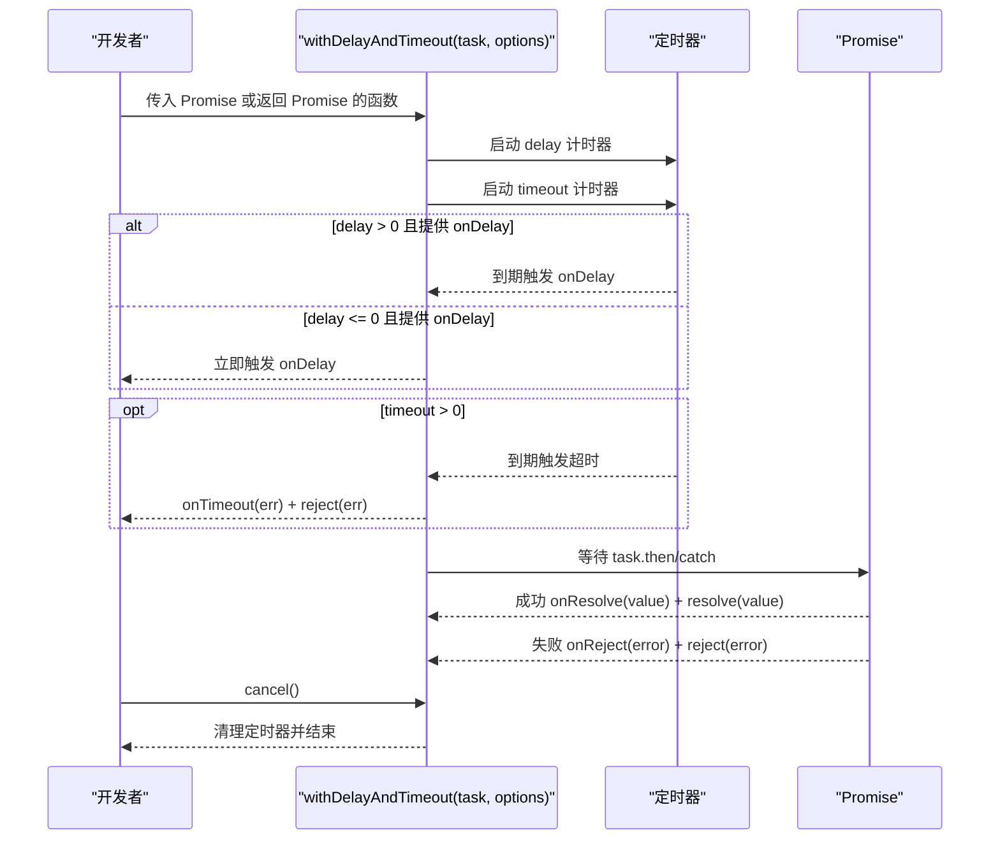
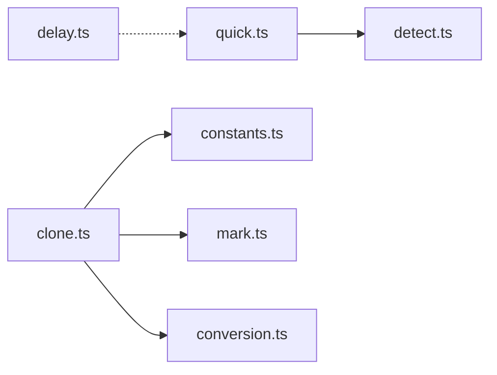

# 高级工具函数使用

<cite>
**本文引用的文件列表**
- [packages/utils/src/clone.ts](file://packages/utils/src/clone.ts)
- [packages/utils/src/delay.ts](file://packages/utils/src/delay.ts)
- [packages/utils/src/detect.ts](file://packages/utils/src/detect.ts)
- [packages/utils/src/quick.ts](file://packages/utils/src/quick.ts)
- [packages/utils/src/index.ts](file://packages/utils/src/index.ts)
- [packages/utils/src/types.ts](file://packages/utils/src/types.ts)
- [packages/utils/src/loggger.ts](file://packages/utils/src/loggger.ts)
- [packages/utils/src/str.ts](file://packages/utils/src/str.ts)
- [packages/responsive/src/signal/utils/mark.ts](file://packages/responsive/src/signal/utils/mark.ts)
- [packages/responsive/src/signal/utils/conversion.ts](file://packages/responsive/src/signal/utils/conversion.ts)
- [packages/responsive/src/signal/constants.ts](file://packages/responsive/src/signal/constants.ts)
- [packages/utils/__tests__/clone.test.ts](file://packages/utils/__tests__/clone.test.ts)
- [packages/utils/__tests__/detect.test.ts](file://packages/utils/__tests__/detect.test.ts)
- [packages/utils/__tests__/quick.test.ts](file://packages/utils/__tests__/quick.test.ts)
</cite>

## 目录
1. [简介](#简介)
2. [项目结构](#项目结构)
3. [核心组件](#核心组件)
4. [架构总览](#架构总览)
5. [详细组件分析](#详细组件分析)
6. [依赖分析](#依赖分析)
7. [性能考量](#性能考量)
8. [故障排查指南](#故障排查指南)
9. [结论](#结论)
10. [附录](#附录)

## 简介
本文件面向 Vitarx 框架的使用者，系统性介绍高级工具函数在复杂状态管理中的应用。重点涵盖：
- clone 深拷贝：如何在保留特定响应式标记的前提下实现深拷贝
- delay 异步延迟：封装 Promise 的 withDelayAndTimeout，实现延迟、超时与取消控制
- detect 类型检测：全面的类型判断与环境判定工具
- quick 高性能工具：防抖、节流、对象合并、休眠等高频实用方法

并通过典型场景（表单状态重置、动画序列控制、数据预加载）演示这些工具的组合使用，帮助开发者提升代码质量与开发效率。

## 项目结构
工具模块位于 packages/utils，提供通用能力；响应式系统位于 packages/responsive，提供与工具函数协同的响应式标记与转换能力。

图表来源
- [packages/utils/src/index.ts](file://packages/utils/src/index.ts#L1-L8)
- [packages/utils/src/clone.ts](file://packages/utils/src/clone.ts#L1-L124)
- [packages/utils/src/delay.ts](file://packages/utils/src/delay.ts#L1-L145)
- [packages/utils/src/detect.ts](file://packages/utils/src/detect.ts#L1-L540)
- [packages/utils/src/quick.ts](file://packages/utils/src/quick.ts#L1-L175)
- [packages/utils/src/types.ts](file://packages/utils/src/types.ts#L1-L336)
- [packages/utils/src/loggger.ts](file://packages/utils/src/loggger.ts#L1-L230)
- [packages/utils/src/str.ts](file://packages/utils/src/str.ts#L1-L45)
- [packages/responsive/src/signal/utils/mark.ts](file://packages/responsive/src/signal/utils/mark.ts#L1-L60)
- [packages/responsive/src/signal/utils/conversion.ts](file://packages/responsive/src/signal/utils/conversion.ts#L1-L49)
- [packages/responsive/src/signal/constants.ts](file://packages/responsive/src/signal/constants.ts#L1-L25)

章节来源
- [packages/utils/src/index.ts](file://packages/utils/src/index.ts#L1-L8)

## 核心组件
- 深拷贝 deepClone：支持循环引用、内置对象（Date/RegExp/Set/Map）、Symbol 键、原型链，同时与响应式标记协作，避免破坏响应式结构
- 异步延迟 withDelayAndTimeout：统一处理延迟显示、超时中断、Promise 成功/失败回调与手动取消
- 类型检测 detect：提供 isObject/isRecordObject/isArray/isString/isNumber/isBool/isFunction/isPromise 等，以及 isDeepEqual、isEmpty、isCollection 等复合判断
- 高性能 quick：提供 popProperty、sleep、deepMergeObject、debounce、throttle 等，兼顾易用与性能

章节来源
- [packages/utils/src/clone.ts](file://packages/utils/src/clone.ts#L1-L124)
- [packages/utils/src/delay.ts](file://packages/utils/src/delay.ts#L1-L145)
- [packages/utils/src/detect.ts](file://packages/utils/src/detect.ts#L1-L540)
- [packages/utils/src/quick.ts](file://packages/utils/src/quick.ts#L1-L175)

## 架构总览
工具函数与响应式系统的交互路径如下：
- clone 在深拷贝过程中，借助响应式常量与标记工具，确保对响应式对象的处理不破坏其内部结构
- detect 为工具函数提供类型安全的前置判断，提高健壮性
- quick 的防抖/节流与 sleep 在复杂状态管理中用于优化事件频率与异步流程控制

图表来源
- [packages/utils/src/quick.ts](file://packages/utils/src/quick.ts#L1-L175)
- [packages/utils/src/detect.ts](file://packages/utils/src/detect.ts#L1-L540)
- [packages/utils/src/clone.ts](file://packages/utils/src/clone.ts#L1-L124)
- [packages/responsive/src/signal/utils/mark.ts](file://packages/responsive/src/signal/utils/mark.ts#L1-L60)
- [packages/responsive/src/signal/utils/conversion.ts](file://packages/responsive/src/signal/utils/conversion.ts#L1-L49)
- [packages/responsive/src/signal/constants.ts](file://packages/responsive/src/signal/constants.ts#L1-L25)

## 详细组件分析

### 深拷贝 deepClone（clone.ts）
- 设计要点
  - 支持基本类型、数组、对象、Set、Map、Date、RegExp、Symbol 键、原型链
  - 使用队列实现广度优先遍历，配合 WeakMap 处理循环引用
  - 针对 Date/RegExp 等内置对象采用构造器复制策略
  - 通过响应式常量与标记工具，避免破坏响应式结构
- 关键流程

图表来源
- [packages/utils/src/clone.ts](file://packages/utils/src/clone.ts#L1-L124)

- 与响应式标记的协作
  - 通过响应式常量与标记工具，确保对响应式对象的处理不破坏其内部结构
  - 与 toRaw 协作，必要时获取原始值再进行深拷贝

章节来源
- [packages/utils/src/clone.ts](file://packages/utils/src/clone.ts#L1-L124)
- [packages/responsive/src/signal/utils/mark.ts](file://packages/responsive/src/signal/utils/mark.ts#L1-L60)
- [packages/responsive/src/signal/utils/conversion.ts](file://packages/responsive/src/signal/utils/conversion.ts#L1-L49)
- [packages/responsive/src/signal/constants.ts](file://packages/responsive/src/signal/constants.ts#L1-L25)
- [packages/utils/__tests__/clone.test.ts](file://packages/utils/__tests__/clone.test.ts#L1-L98)

### 异步延迟 withDelayAndTimeout（delay.ts）
- 功能特性
  - 延迟触发回调（如 loading 显示）
  - 超时控制（可配置超时时间并返回错误）
  - Promise 成功/失败回调 onResolve/onReject
  - 手动取消 cancel
  - 任务有效性检查 signal
- 调用序列

图表来源
- [packages/utils/src/delay.ts](file://packages/utils/src/delay.ts#L1-L145)

- 实战建议
  - 在网络请求中结合 delay 显示 loading，timeout 控制等待上限
  - 使用 signal 在组件卸载或状态变更时主动取消无效任务
  - 与防抖/节流配合，避免频繁触发异步任务

章节来源
- [packages/utils/src/delay.ts](file://packages/utils/src/delay.ts#L1-L145)

### 类型检测 detect（detect.ts）
- 能力概览
  - 基础类型：isObject/isRecordObject/isArray/isString/isNumber/isBool
  - 函数类型：isFunction/isAsyncFunction/isPureFunction/isConstructor/isSimpleGetterFunction
  - 集合类型：isMap/isSet/isWeakMap/isWeakSet/isCollection
  - 其他：isEmpty/isPromise/isDeepEqual/isNumString
- 设计要点
  - 使用严格类型判断，避免误判
  - isDeepEqual 支持指定比较深度，兼顾性能与准确性
  - isCollection 统一 Map/Set/WeakMap/WeakSet 判定

章节来源
- [packages/utils/src/detect.ts](file://packages/utils/src/detect.ts#L1-L540)
- [packages/utils/src/types.ts](file://packages/utils/src/types.ts#L1-L336)
- [packages/utils/__tests__/detect.test.ts](file://packages/utils/__tests__/detect.test.ts#L1-L152)

### 高性能工具 quick（quick.ts）
- 方法清单
  - popProperty：弹出对象属性并返回值
  - sleep：基于 Promise 的休眠
  - deepMergeObject：深度合并对象，支持数组合并与 undefined 合并策略
  - debounce：基于 setTimeout 的防抖
  - throttle：基于定时器的状态锁节流
- 性能与易用性
  - 防抖/节流均使用 setTimeout，避免高频事件导致的重复执行
  - deepMergeObject 通过 Set 合并键集，减少重复遍历
  - sleep 作为轻量级异步等待工具，便于流程编排

章节来源
- [packages/utils/src/quick.ts](file://packages/utils/src/quick.ts#L1-L175)
- [packages/utils/__tests__/quick.test.ts](file://packages/utils/__tests__/quick.test.ts#L1-L45)

## 依赖分析
- 模块内聚与耦合
  - quick 依赖 detect 提供类型判断
  - clone 依赖响应式常量与标记工具，保证深拷贝不破坏响应式结构
  - delay 与 quick 的 sleep 可组合用于异步流程控制
- 外部依赖
  - 无第三方依赖，纯工具函数实现

图表来源
- [packages/utils/src/quick.ts](file://packages/utils/src/quick.ts#L1-L175)
- [packages/utils/src/detect.ts](file://packages/utils/src/detect.ts#L1-L540)
- [packages/utils/src/clone.ts](file://packages/utils/src/clone.ts#L1-L124)
- [packages/responsive/src/signal/utils/mark.ts](file://packages/responsive/src/signal/utils/mark.ts#L1-L60)
- [packages/responsive/src/signal/utils/conversion.ts](file://packages/responsive/src/signal/utils/conversion.ts#L1-L49)
- [packages/responsive/src/signal/constants.ts](file://packages/responsive/src/signal/constants.ts#L1-L25)
- [packages/utils/src/delay.ts](file://packages/utils/src/delay.ts#L1-L145)

## 性能考量
- deepClone
  - 时间复杂度：O(N)，N 为节点总数；空间复杂度：O(N)
  - 使用 WeakMap 避免重复克隆，队列 BFS 降低递归开销
  - 对 Date/RegExp 等内置对象采用构造器复制，避免深层遍历
- withDelayAndTimeout
  - 定时器清理及时，避免内存泄漏
  - 支持 signal 主动取消，防止无效任务继续占用资源
- quick.debounce/throttle
  - 防抖：最后一次触发后延迟执行，适合搜索框输入
  - 节流：固定时间间隔内只执行一次，适合滚动/窗口 resize
- deepMergeObject
  - 通过键集合并减少重复遍历，数组合并可按需开启

[本节为通用性能讨论，无需列出具体文件来源]

## 故障排查指南
- 深拷贝异常
  - 症状：循环引用导致栈溢出或结果不正确
  - 排查：确认对象是否包含循环引用；使用 WeakMap 映射是否正常建立
  - 参考测试：循环引用与原型链保留
- 异步延迟未触发
  - 症状：onDelay 未执行、超时未触发、取消无效
  - 排查：delay/timeout 参数是否正确；signal 是否提前返回 true；cancel 是否被调用
- 类型检测误判
  - 症状：集合类型被误判为对象
  - 排查：使用 isCollection/isRecordObject 等统一判定
- 防抖/节流无效
  - 症状：事件仍频繁触发
  - 排查：确认是否正确包裹函数；delay 是否过大；是否多次绑定导致定时器未清理

章节来源
- [packages/utils/__tests__/clone.test.ts](file://packages/utils/__tests__/clone.test.ts#L1-L98)
- [packages/utils/__tests__/detect.test.ts](file://packages/utils/__tests__/detect.test.ts#L1-L152)
- [packages/utils/__tests__/quick.test.ts](file://packages/utils/__tests__/quick.test.ts#L1-L45)

## 结论
- clone、delay、detect、quick 构成 Vitarx 高效开发的核心工具链
- 在复杂状态管理中，建议将 deepClone 与响应式标记工具配合使用，确保深拷贝不破坏响应式结构
- withDelayAndTimeout 提供统一的异步控制能力，结合 signal 与取消机制，提升用户体验与稳定性
- detect 保障类型安全，quick 提升开发效率与性能表现
- 通过组合使用这些工具，可优雅地实现表单重置、动画序列控制、数据预加载等常见场景

[本节为总结性内容，无需列出具体文件来源]

## 附录

### 场景化示例（概念性说明）
- 表单状态重置
  - 使用 deepMergeObject 合并默认值与当前表单，再用 deepClone 生成不可变快照，结合 detect.isEmpty 判断是否为空
  - 参考：[packages/utils/src/quick.ts](file://packages/utils/src/quick.ts#L66-L127)、[packages/utils/src/detect.ts](file://packages/utils/src/detect.ts#L148-L161)
- 动画序列控制
  - 使用 quick.throttle 控制滚动/拖拽事件频率，sleep 实现帧间延时，delay 显示加载态
  - 参考：[packages/utils/src/quick.ts](file://packages/utils/src/quick.ts#L160-L175)、[packages/utils/src/quick.ts](file://packages/utils/src/quick.ts#L30-L32)、[packages/utils/src/delay.ts](file://packages/utils/src/delay.ts#L1-L145)
- 数据预加载
  - 使用 withDelayAndTimeout 包装请求，delay 显示 loading，timeout 中断并提示，signal 在组件卸载时取消
  - 参考：[packages/utils/src/delay.ts](file://packages/utils/src/delay.ts#L72-L144)

[本节为概念性说明，无需列出具体文件来源]