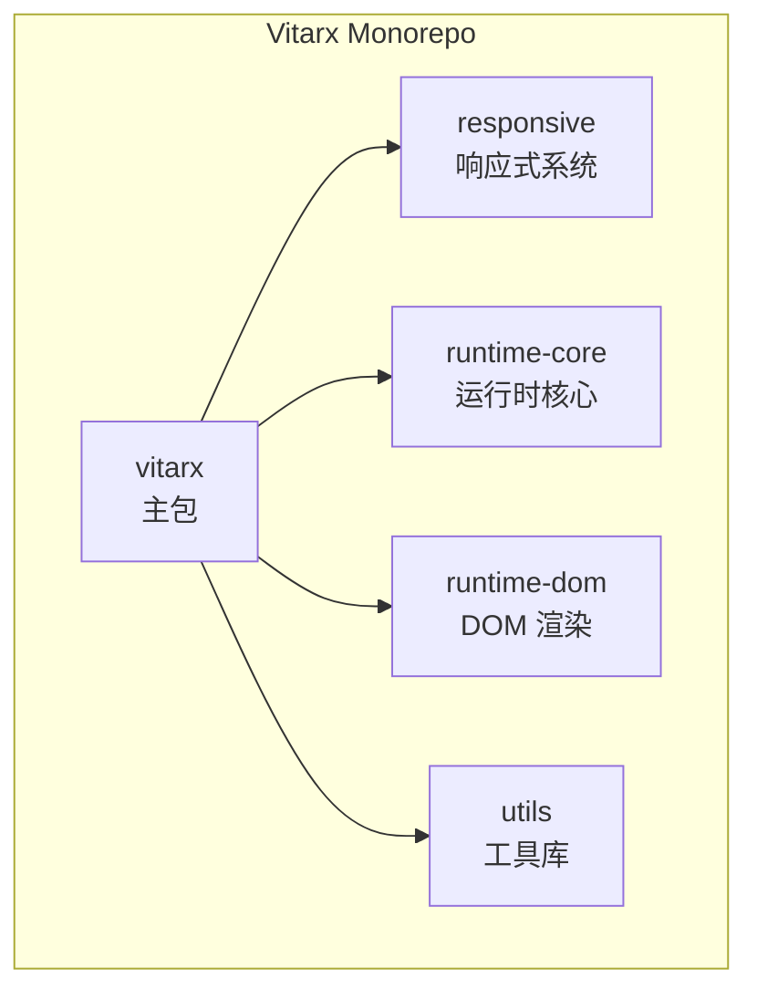
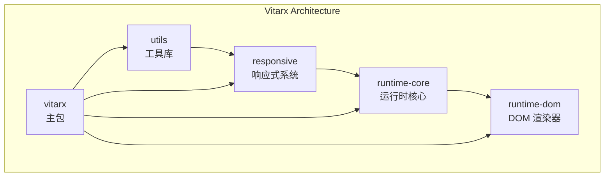
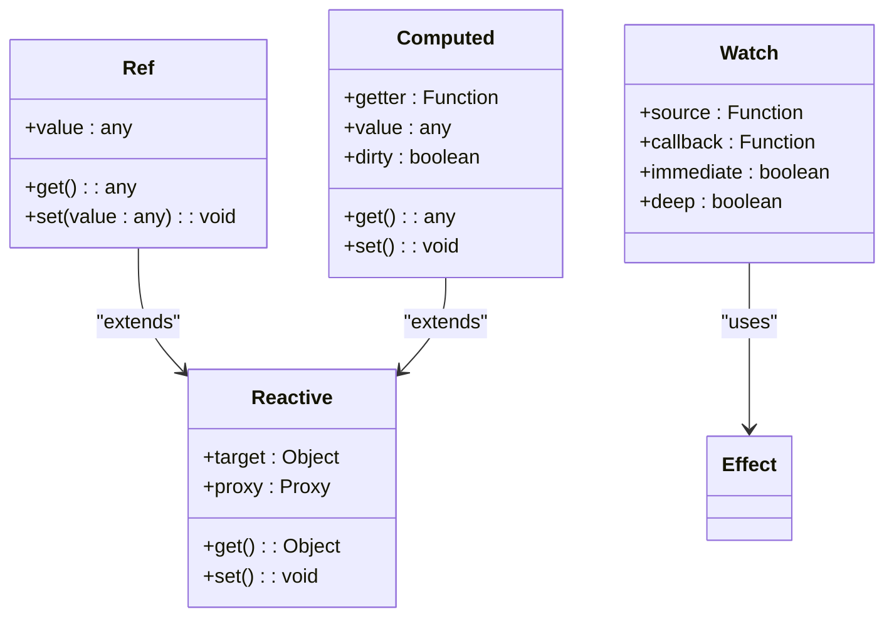
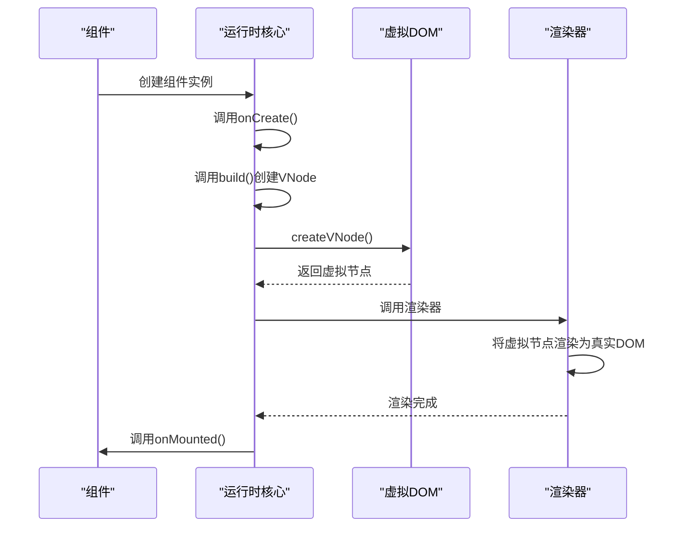
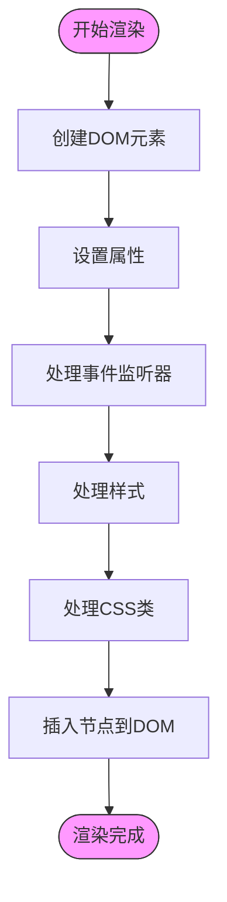
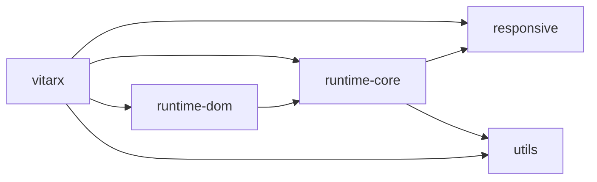

# 项目概述

<cite>
**本文档引用的文件**
- [README.md](file://README.md)
- [packages/responsive/src/index.ts](file://packages/responsive/src/index.ts)
- [packages/runtime-core/src/index.ts](file://packages/runtime-core/src/index.ts)
- [packages/runtime-dom/src/index.ts](file://packages/runtime-dom/src/index.ts)
- [packages/utils/src/index.ts](file://packages/utils/src/index.ts)
- [packages/vitarx/src/index.ts](file://packages/vitarx/src/index.ts)
- [packages/responsive/src/signal/index.ts](file://packages/responsive/src/signal/index.ts)
- [packages/responsive/src/effect/index.ts](file://packages/responsive/src/effect/index.ts)
- [packages/runtime-core/src/widget/base/Widget.ts](file://packages/runtime-core/src/widget/base/Widget.ts)
- [packages/runtime-core/src/vnode/core/create.ts](file://packages/runtime-core/src/vnode/core/create.ts)
- [packages/runtime-dom/src/client/DomRenderer.ts](file://packages/runtime-dom/src/client/DomRenderer.ts)
- [packages/responsive/src/signal/ref/index.ts](file://packages/responsive/src/signal/ref/index.ts)
- [packages/responsive/src/signal/computed/index.ts](file://packages/responsive/src/signal/computed/index.ts)
- [packages/responsive/src/effect/effect.ts](file://packages/responsive/src/effect/effect.ts)
- [packages/responsive/src/observer/scheduler.ts](file://packages/responsive/src/observer/scheduler.ts)
- [packages/runtime-core/src/renderer/api.ts](file://packages/runtime-core/src/renderer/api.ts)
</cite>

## 目录
1. [简介](#简介)
2. [项目结构](#项目结构)
3. [核心组件](#核心组件)
4. [架构概述](#架构概述)
5. [详细组件分析](#详细组件分析)
6. [依赖分析](#依赖分析)
7. [性能考虑](#性能考虑)
8. [故障排除指南](#故障排除指南)
9. [结论](#结论)

## 简介

Vitarx 是一个现代化的前端框架，它融合了 React 的 JSX 语法和 Vue 的响应式系统，同时在 API 命名和功能上与 Vue 保持高度一致，使开发者能够快速上手。该框架支持 JSX 语法，允许开发者编写更简洁、更易理解的代码。Vitarx 采用组件化架构，所有 UI 元素都被视为小部件（Widget），支持函数式小部件和类小部件。其核心特性包括基于 Proxy 的响应式数据系统、虚拟 DOM 与高效的 Diff 算法、完整的组件生命周期钩子以及对 TypeScript 的深度支持。

**Section sources**
- [README.md](file://README.md#L8-L85)

## 项目结构

Vitarx 采用 monorepo 架构，将整个项目划分为多个独立但协同工作的核心包。这种架构设计使得各个功能模块职责清晰，便于维护和扩展。项目根目录下的 `packages` 文件夹包含了所有核心包，每个包都有明确的职责划分。

**Diagram sources**
- [packages/responsive/src/index.ts](file://packages/responsive/src/index.ts#L1-L6)
- [packages/runtime-core/src/index.ts](file://packages/runtime-core/src/index.ts#L1-L11)
- [packages/runtime-dom/src/index.ts](file://packages/runtime-dom/src/index.ts#L1-L3)
- [packages/utils/src/index.ts](file://packages/utils/src/index.ts#L1-L8)
- [packages/vitarx/src/index.ts](file://packages/vitarx/src/index.ts#L1-L7)

**Section sources**
- [packages/responsive/src/index.ts](file://packages/responsive/src/index.ts#L1-L6)
- [packages/runtime-core/src/index.ts](file://packages/runtime-core/src/index.ts#L1-L11)
- [packages/runtime-dom/src/index.ts](file://packages/runtime-dom/src/index.ts#L1-L3)
- [packages/utils/src/index.ts](file://packages/utils/src/index.ts#L1-L8)
- [packages/vitarx/src/index.ts](file://packages/vitarx/src/index.ts#L1-L7)

## 核心组件

Vitarx 框架的核心组件包括响应式系统（responsive）、运行时核心（runtime-core）、DOM 渲染器（runtime-dom）、工具库（utils）和主包（vitarx）。这些组件协同工作，构成了框架的完整功能体系。响应式系统负责数据的响应式处理，运行时核心管理组件的生命周期和虚拟 DOM，DOM 渲染器负责将虚拟 DOM 渲染到实际的 DOM 节点，工具库提供通用的工具函数，主包则作为入口，整合所有功能并暴露给开发者使用。

**Section sources**
- [packages/responsive/src/index.ts](file://packages/responsive/src/index.ts#L1-L6)
- [packages/runtime-core/src/index.ts](file://packages/runtime-core/src/index.ts#L1-L11)
- [packages/runtime-dom/src/index.ts](file://packages/runtime-dom/src/index.ts#L1-L3)
- [packages/utils/src/index.ts](file://packages/utils/src/index.ts#L1-L8)
- [packages/vitarx/src/index.ts](file://packages/vitarx/src/index.ts#L1-L7)

## 架构概述

Vitarx 的架构设计遵循分层原则，各层之间职责分明，通过清晰的接口进行通信。最底层是工具库（utils），提供基础的工具函数；其上是响应式系统（responsive），基于 Proxy 实现数据的响应式；再上层是运行时核心（runtime-core），负责组件管理、虚拟 DOM 和生命周期；最上层是 DOM 渲染器（runtime-dom），负责将虚拟 DOM 渲染到浏览器环境。主包（vitarx）作为入口，整合所有模块并提供统一的 API。

**Diagram sources**
- [packages/responsive/src/index.ts](file://packages/responsive/src/index.ts#L1-L6)
- [packages/runtime-core/src/index.ts](file://packages/runtime-core/src/index.ts#L1-L11)
- [packages/runtime-dom/src/index.ts](file://packages/runtime-dom/src/index.ts#L1-L3)
- [packages/utils/src/index.ts](file://packages/utils/src/index.ts#L1-L8)
- [packages/vitarx/src/index.ts](file://packages/vitarx/src/index.ts#L1-L7)

## 详细组件分析

### 响应式系统分析

Vitarx 的响应式系统是框架的核心，它基于 Proxy 实现了数据的自动追踪和更新。当响应式数据发生变化时，框架能够自动检测到变化并更新视图。该系统提供了 `ref`、`reactive`、`computed` 和 `watch` 等 API，与 Vue 的 API 高度一致，降低了学习成本。

**Diagram sources**
- [packages/responsive/src/signal/ref/index.ts](file://packages/responsive/src/signal/ref/index.ts#L1-L5)
- [packages/responsive/src/signal/computed/index.ts](file://packages/responsive/src/signal/computed/index.ts#L1-L3)
- [packages/responsive/src/effect/effect.ts](file://packages/responsive/src/effect/effect.ts#L1-L261)

**Section sources**
- [packages/responsive/src/signal/index.ts](file://packages/responsive/src/signal/index.ts#L1-L10)
- [packages/responsive/src/effect/index.ts](file://packages/responsive/src/effect/index.ts#L1-L5)

### 运行时核心分析

运行时核心是 Vitarx 的中枢，负责管理组件的生命周期、虚拟 DOM 和渲染流程。它定义了组件基类 `Widget`，提供了完整的生命周期钩子，如 `onCreate`、`onMounted`、`onUpdated` 和 `onUnmounted`。虚拟 DOM 系统通过 `createVNode` 函数创建虚拟节点，并使用高效的 Diff 算法进行差异化更新。

**Diagram sources**
- [packages/runtime-core/src/widget/base/Widget.ts](file://packages/runtime-core/src/widget/base/Widget.ts#L1-L371)
- [packages/runtime-core/src/vnode/core/create.ts](file://packages/runtime-core/src/vnode/core/create.ts#L1-L150)

**Section sources**
- [packages/runtime-core/src/widget/base/Widget.ts](file://packages/runtime-core/src/widget/base/Widget.ts#L1-L371)
- [packages/runtime-core/src/vnode/core/create.ts](file://packages/runtime-core/src/vnode/core/create.ts#L1-L150)

### DOM渲染器分析

DOM 渲染器负责将虚拟 DOM 渲染到浏览器环境，它实现了 `HostRenderer` 接口，提供了创建元素、文本、注释和片段节点的方法。渲染器还处理 DOM 节点的插入、删除、替换和属性操作，以及 CSS 类和样式的管理。

**Diagram sources**
- [packages/runtime-dom/src/client/DomRenderer.ts](file://packages/runtime-dom/src/client/DomRenderer.ts#L1-L573)

**Section sources**
- [packages/runtime-dom/src/client/DomRenderer.ts](file://packages/runtime-dom/src/client/DomRenderer.ts#L1-L573)

## 依赖分析

Vitarx 的各个核心包之间存在明确的依赖关系。主包 `vitarx` 依赖于 `responsive`、`runtime-core`、`runtime-dom` 和 `utils` 四个核心包。`runtime-core` 依赖于 `responsive` 和 `utils`，因为它需要使用响应式系统来管理组件状态，并使用工具库中的通用函数。`runtime-dom` 依赖于 `runtime-core`，因为它需要使用运行时核心中定义的类型和接口。

**Diagram sources**
- [packages/vitarx/src/index.ts](file://packages/vitarx/src/index.ts#L1-L7)
- [packages/runtime-core/src/index.ts](file://packages/runtime-core/src/index.ts#L1-L11)
- [packages/runtime-dom/src/index.ts](file://packages/runtime-dom/src/index.ts#L1-L3)

**Section sources**
- [packages/vitarx/src/index.ts](file://packages/vitarx/src/index.ts#L1-L7)
- [packages/runtime-core/src/index.ts](file://packages/runtime-core/src/index.ts#L1-L11)
- [packages/runtime-dom/src/index.ts](file://packages/runtime-dom/src/index.ts#L1-L3)

## 性能考虑

Vitarx 在性能方面进行了多项优化。首先，通过基于 Proxy 的响应式系统，实现了细粒度的数据追踪，避免了不必要的视图更新。其次，虚拟 DOM 和 Diff 算法的使用，确保了只有发生变化的部分才会被重新渲染，大大降低了 DOM 操作的性能开销。此外，任务调度器（Scheduler）采用微任务队列，将多个状态更新合并为一次视图更新，进一步提升了性能。

**Section sources**
- [packages/responsive/src/observer/scheduler.ts](file://packages/responsive/src/observer/scheduler.ts#L1-L326)

## 故障排除指南

在使用 Vitarx 时，可能会遇到一些常见问题。例如，如果组件没有正确渲染，应检查是否正确导入了 `jsx` 和 `jsxs` 函数。如果响应式数据没有触发视图更新，应检查是否正确使用了 `ref` 或 `reactive` API。在开发模式下，框架会提供详细的错误信息和警告，帮助开发者快速定位问题。

**Section sources**
- [packages/runtime-core/src/renderer/api.ts](file://packages/runtime-core/src/renderer/api.ts#L1-L28)

## 结论

Vitarx 是一个功能强大且设计精良的现代前端框架，它成功融合了 React 和 Vue 的优点，提供了简洁的 JSX 语法和强大的响应式系统。通过 monorepo 架构，框架实现了良好的模块化和可维护性。其基于 Proxy 的响应式系统、虚拟 DOM 和 Diff 算法，确保了高性能的视图更新。对于初学者，Vitarx 提供了与 Vue 高度一致的 API，降低了学习曲线；对于高级用户，其清晰的架构和可扩展的设计提供了深入定制的可能性。