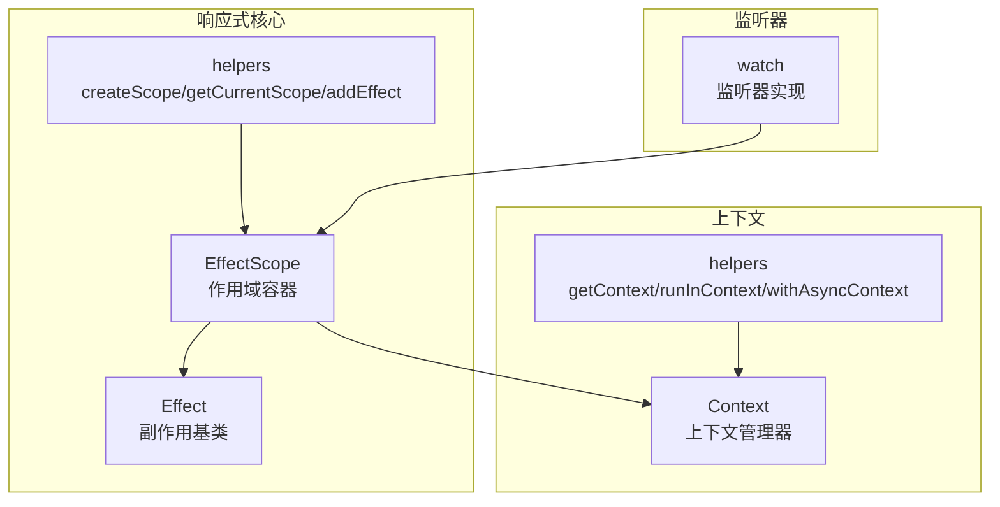
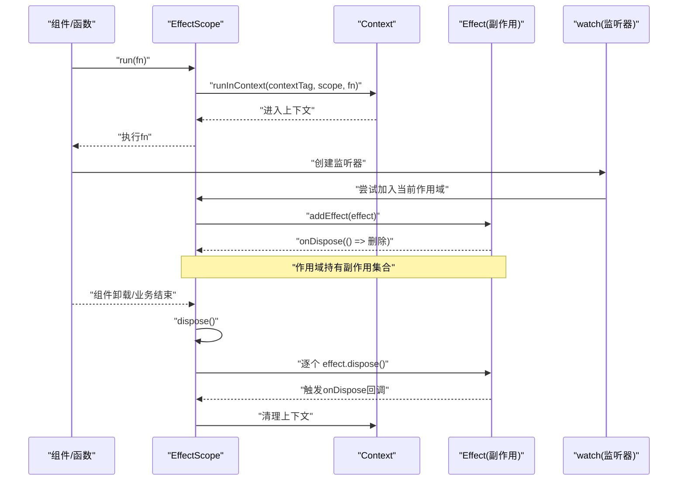
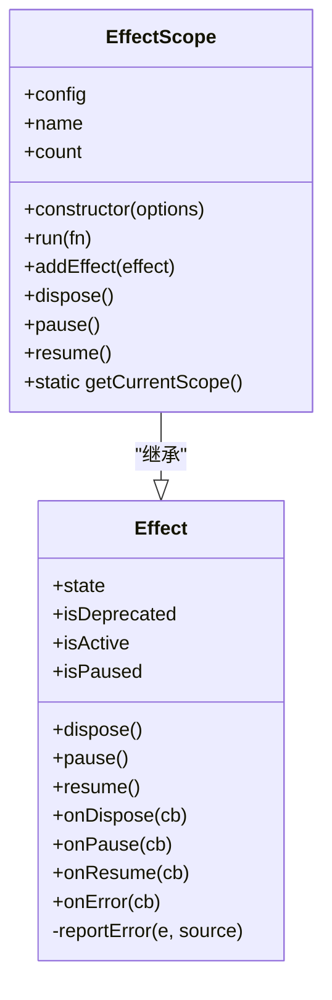
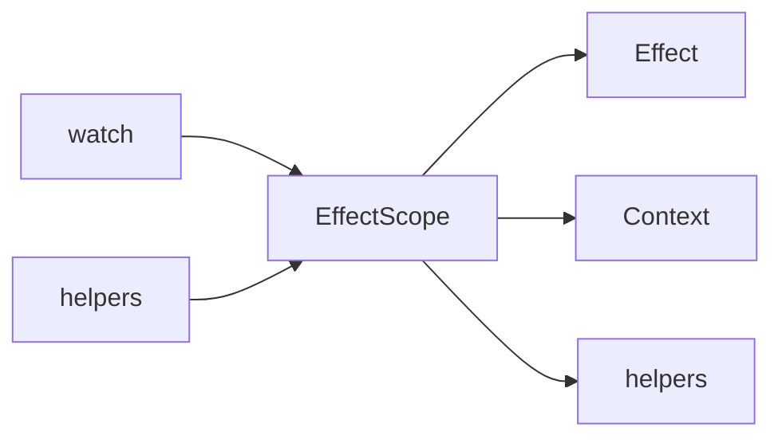

# 副作用作用域管理

<cite>
**本文引用的文件**
- [effect-scope.ts](file://packages/responsive/src/effect/effect-scope.ts)
- [effect.ts](file://packages/responsive/src/effect/effect.ts)
- [helpers.ts](file://packages/responsive/src/effect/helpers.ts)
- [index.ts](file://packages/responsive/src/effect/index.ts)
- [context.ts](file://packages/responsive/src/context/context.ts)
- [helpers.ts](file://packages/responsive/src/context/helpers.ts)
- [README.md](file://packages/responsive/README.md)
- [effect-scope.test.ts](file://packages/responsive/__tests__/effect/effect-scope.test.ts)
- [watch.ts](file://packages/responsive/src/signal/watch/watch.ts)
</cite>

## 目录
1. [简介](#简介)
2. [项目结构](#项目结构)
3. [核心组件](#核心组件)
4. [架构总览](#架构总览)
5. [组件详解](#组件详解)
6. [依赖关系分析](#依赖关系分析)
7. [性能考量](#性能考量)
8. [故障排查指南](#故障排查指南)
9. [结论](#结论)
10. [附录](#附录)

## 简介
本文件围绕 EffectScope 类的设计与应用展开，系统阐述其如何通过树形结构管理副作用的生命周期；详细解释 attachToCurrentScope 配置项的作用机制；说明在组件卸载时如何自动清理所有相关 effect；给出在 Composition API 中使用 EffectScope 进行资源管理的实践模式（如在路由切换时批量清理监听器）；展示如何利用 errorHandler 统一处理响应式副作用中的异常；并结合性能优化建议，说明合理使用作用域对内存占用与 GC 压力的优化效果。

## 项目结构
本主题涉及的核心代码位于 responsive 包的 effect 与 context 子模块，以及 watch 监听器的集成点。整体组织采用“按功能域分层”的方式：effect 提供副作用生命周期抽象与作用域容器；context 提供上下文隔离与异步上下文维护；watch 提供基于响应式的副作用监听能力，并可与作用域联动。

图表来源
- [effect-scope.ts](file://packages/responsive/src/effect/effect-scope.ts#L1-L212)
- [effect.ts](file://packages/responsive/src/effect/effect.ts#L1-L261)
- [helpers.ts](file://packages/responsive/src/effect/helpers.ts#L1-L57)
- [context.ts](file://packages/responsive/src/context/context.ts#L1-L138)
- [helpers.ts](file://packages/responsive/src/context/helpers.ts#L1-L74)
- [watch.ts](file://packages/responsive/src/signal/watch/watch.ts#L1-L200)

章节来源
- [index.ts](file://packages/responsive/src/effect/index.ts#L1-L5)

## 核心组件
- Effect：提供副作用的通用生命周期管理（active/paused/deprecated），以及 dispose、pause、resume、onDispose、onPause、onResume、onError 等钩子与错误上报机制。
- EffectScope：在 Effect 基础上扩展为“作用域容器”，负责收集、统一管理、批量暂停/恢复/销毁副作用，并通过上下文标签在运行期维护作用域链。
- helpers：对外暴露 createScope、getCurrentScope、addEffect 等便捷工具，简化作用域创建与使用。
- Context/Helpers：提供跨函数调用的上下文隔离与异步上下文维护，保证作用域在异步流程中仍可被定位与恢复。

章节来源
- [effect.ts](file://packages/responsive/src/effect/effect.ts#L1-L261)
- [effect-scope.ts](file://packages/responsive/src/effect/effect-scope.ts#L1-L212)
- [helpers.ts](file://packages/responsive/src/effect/helpers.ts#L1-L57)
- [context.ts](file://packages/responsive/src/context/context.ts#L1-L138)
- [helpers.ts](file://packages/responsive/src/context/helpers.ts#L1-L74)

## 架构总览
EffectScope 通过“上下文标签 + 运行期容器”的组合，构建了可嵌套、可批量管理的副作用树形结构。运行时通过 runInContext 将当前作用域注入到上下文中，使 getCurrentScope 能够在任意层级的函数调用中获取当前作用域。当作用域被销毁时，会遍历并逐一调用内部副作用的 dispose，从而实现组件卸载时的“一键清理”。

图表来源
- [effect-scope.ts](file://packages/responsive/src/effect/effect-scope.ts#L112-L180)
- [context.ts](file://packages/responsive/src/context/context.ts#L106-L133)
- [watch.ts](file://packages/responsive/src/signal/watch/watch.ts#L192-L200)

## 组件详解

### EffectScope 设计要点
- 配置项 attachToCurrentScope：当为 true 时，构造函数会自动将当前作用域附加到“当前上下文中的作用域”中，形成父子作用域链，便于在嵌套函数中自动继承父作用域。
- 配置项 errorHandler：为作用域内的副作用提供统一的错误处理入口；当副作用在 dispose/pause/resume 等生命周期钩子中抛错时，由作用域统一上报。
- 生命周期管理：支持 pause/resume/dispose；在 dispose 中会遍历内部副作用并逐一调用其 dispose，同时清理自身持有的集合与错误处理器。
- 上下文绑定：通过静态 contextTag 与 runInContext 将作用域注入上下文，使 getCurrentScope 能在任意层级获取当前作用域。

图表来源
- [effect.ts](file://packages/responsive/src/effect/effect.ts#L1-L261)
- [effect-scope.ts](file://packages/responsive/src/effect/effect-scope.ts#L1-L212)

章节来源
- [effect-scope.ts](file://packages/responsive/src/effect/effect-scope.ts#L1-L212)

### attachToCurrentScope 作用机制
- 行为：在 EffectScope 构造函数中，若配置 attachToCurrentScope 为 true，则会尝试将当前作用域自动添加到“当前上下文中的作用域”中。
- 场景：在组件渲染或函数调用中，先创建父作用域，再在其 run 上下文中创建子作用域并开启 attachToCurrentScope，即可形成父子作用域树，子作用域随父作用域一起被统一管理与清理。

章节来源
- [effect-scope.ts](file://packages/responsive/src/effect/effect-scope.ts#L71-L81)
- [effect-scope.test.ts](file://packages/responsive/__tests__/effect/effect-scope.test.ts#L126-L133)

### 组件卸载时自动清理所有相关 effect 的实现原理
- 作用域销毁：EffectScope.dispose() 会将自身置为弃用状态，并遍历内部副作用集合，逐一调用其 dispose，从而触发各副作用的 onDispose 回调，完成资源释放。
- 集合维护：addEffect 会将副作用加入内部集合，并为其注册 onDispose 回调，以便副作用在被清理时从集合中移除，避免悬挂引用。
- 上下文清理：在 dispose 结束后，作用域会将 errorHandler 置空，防止后续误用。

章节来源
- [effect-scope.ts](file://packages/responsive/src/effect/effect-scope.ts#L160-L180)
- [effect.ts](file://packages/responsive/src/effect/effect.ts#L96-L133)

### Composition API 实践模式：路由切换时批量清理监听器
- 模式：在路由切换前，创建一个独立的 EffectScope；在新页面组件的 setup 中，将所有监听器（watch）与资源（定时器、事件监听等）加入该作用域；当离开页面时，调用 scope.dispose() 即可一次性清理。
- 关键点：watch 默认会尝试将自身加入当前作用域（可通过选项控制），因此无需手动 addEffect；但若在异步 await 后继续创建副作用，需使用 scope.run() 重新进入作用域上下文，避免上下文丢失导致无法加入作用域。

章节来源
- [README.md](file://packages/responsive/README.md#L1390-L1410)
- [README.md](file://packages/responsive/README.md#L1521-L1528)
- [watch.ts](file://packages/responsive/src/signal/watch/watch.ts#L192-L200)

### 使用 errorHandler 统一处理响应式副作用中的异常
- 作用域级错误处理：在 EffectScope 构造时传入 errorHandler，作用域会为后续 addEffect 的副作用自动绑定 onError，使其在 dispose/pause/resume 等生命周期钩子中抛错时，由作用域统一上报。
- 副作用级错误处理：副作用本身也支持 onError，用于处理其回调中的异常；若未配置作用域 errorHandler，副作用的 onError 会直接记录日志。
- 测试验证：单元测试覆盖了作用域 errorHandler 对副作用 dispose 钩子异常的捕获与转发。

章节来源
- [effect-scope.ts](file://packages/responsive/src/effect/effect-scope.ts#L135-L157)
- [effect.ts](file://packages/responsive/src/effect/effect.ts#L155-L197)
- [effect-scope.test.ts](file://packages/responsive/__tests__/effect/effect-scope.test.ts#L97-L111)

### 上下文与异步上下文维护
- runInContext：将作用域注入到上下文中，使 getCurrentScope 能在函数执行期间获取当前作用域。
- withAsyncContext：在异步任务前后备份/恢复上下文，避免 await 后上下文丢失导致作用域无法加入副作用。
- 重要提示：在非 Node 环境中，withAsyncContext 会备份当前上下文并在任务结束后恢复，确保异步链路中的上下文一致性。

章节来源
- [effect-scope.ts](file://packages/responsive/src/effect/effect-scope.ts#L123-L125)
- [context.ts](file://packages/responsive/src/context/context.ts#L106-L133)
- [helpers.ts](file://packages/responsive/src/context/helpers.ts#L41-L74)

### 工具函数与 API 使用
- createScope：创建作用域实例，支持 name、attachToCurrentScope、errorHandler 等配置。
- getCurrentScope/useCurrentScope：获取当前上下文中的作用域，用于在任意层级获取作用域上下文。
- addEffect：将实现了 EffectInterface 的副作用对象加入当前作用域，若当前无作用域则返回 false。

章节来源
- [helpers.ts](file://packages/responsive/src/effect/helpers.ts#L1-L57)

## 依赖关系分析
- EffectScope 依赖 Effect 的生命周期与错误上报能力；依赖 Context/Helpers 提供的上下文注入与异步上下文维护。
- watch 在创建时可选择是否加入当前作用域，默认行为受选项控制；watch 的清理函数 onCleanup 可与作用域协同，避免遗漏资源。
- helpers 将 EffectScope 的能力以易用 API 暴露给上层使用者，降低使用门槛。

图表来源
- [effect-scope.ts](file://packages/responsive/src/effect/effect-scope.ts#L1-L212)
- [effect.ts](file://packages/responsive/src/effect/effect.ts#L1-L261)
- [context.ts](file://packages/responsive/src/context/context.ts#L1-L138)
- [helpers.ts](file://packages/responsive/src/context/helpers.ts#L1-L74)
- [watch.ts](file://packages/responsive/src/signal/watch/watch.ts#L192-L200)
- [helpers.ts](file://packages/responsive/src/effect/helpers.ts#L1-L57)

## 性能考量
- 内存与 GC 压力优化：通过作用域集中管理副作用，组件卸载时一次性 dispose，避免零散资源泄露；同时副作用在 onDispose 中从作用域集合中移除，减少悬挂引用，降低 GC 压力。
- 异步上下文维护成本：withAsyncContext 在非 Node 环境会备份/恢复上下文，带来少量开销；但在复杂异步链路中，这是保证作用域正确性的必要成本。
- 监听器粒度控制：watch 的 limit、flush、clone 等选项可减少无效触发与深拷贝开销；结合作用域批量清理，进一步降低资源占用。
- 建议：
  - 在高频变更场景中，优先使用合适的 flush 策略与 limit；
  - 对大对象监听谨慎开启 clone；
  - 在路由切换等场景中，使用独立作用域承载页面级副作用，避免跨页面干扰。

章节来源
- [README.md](file://packages/responsive/README.md#L1412-L1454)
- [watch.ts](file://packages/responsive/src/signal/watch/watch.ts#L192-L200)

## 故障排查指南
- 作用域 errorHandler 必须为函数类型：若传入非函数，构造时会抛出类型错误，需检查传参。
- 添加非 Effect 对象：addEffect 会对对象进行类型校验，非 EffectInterface 实例会抛出 TypeError。
- 销毁后不可再添加副作用：作用域被弃用后再次添加会抛出错误，需在合适时机创建新作用域。
- 上下文丢失：在异步 await 后若继续创建副作用，需使用 scope.run() 重新进入作用域上下文，否则无法加入作用域。
- 错误未被捕获：若副作用在 dispose/pause/resume 中抛错，需确保作用域配置了 errorHandler，或在副作用上单独绑定 onError。

章节来源
- [effect-scope.ts](file://packages/responsive/src/effect/effect-scope.ts#L71-L81)
- [effect-scope.ts](file://packages/responsive/src/effect/effect-scope.ts#L135-L157)
- [effect.ts](file://packages/responsive/src/effect/effect.ts#L96-L133)
- [README.md](file://packages/responsive/README.md#L1390-L1410)
- [effect-scope.test.ts](file://packages/responsive/__tests__/effect/effect-scope.test.ts#L1-L48)

## 结论
EffectScope 通过“上下文标签 + 生命周期容器”的设计，为响应式副作用提供了可嵌套、可批量管理的树形结构。attachToCurrentScope 让父子作用域自然衔接，适合在组件/页面级资源管理中形成清晰的生命周期边界。配合 errorHandler，可统一处理副作用异常；结合 watch 的作用域集成与异步上下文维护，可在路由切换等场景中实现“一键清理”。在性能方面，集中管理与批量清理有助于降低内存占用与 GC 压力。建议在复杂异步与高频更新场景中，合理使用 flush、limit、clone 等选项，进一步优化性能。

## 附录
- API 速查
  - createScope(options)：创建作用域实例
  - getCurrentScope()/useCurrentScope()：获取当前作用域
  - addEffect(effect)：将副作用加入当前作用域
  - EffectScope.run(fn)：在作用域上下文中执行函数
  - EffectScope.dispose()/pause()/resume()：作用域生命周期管理
  - watch(source, callback, options)：监听器，支持 scope 选项与清理函数

章节来源
- [helpers.ts](file://packages/responsive/src/effect/helpers.ts#L1-L57)
- [watch.ts](file://packages/responsive/src/signal/watch/watch.ts#L192-L200)