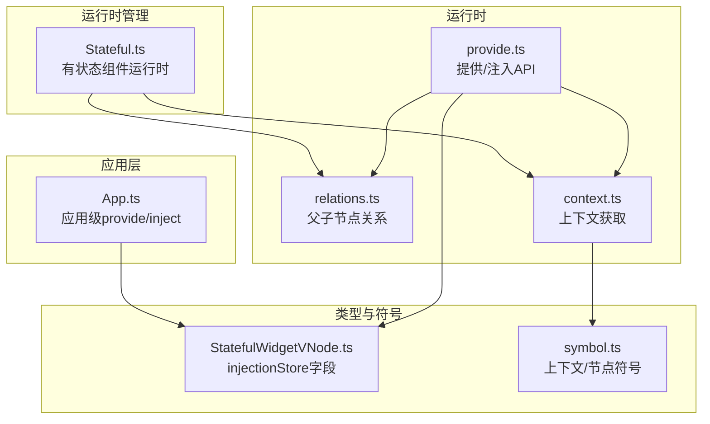
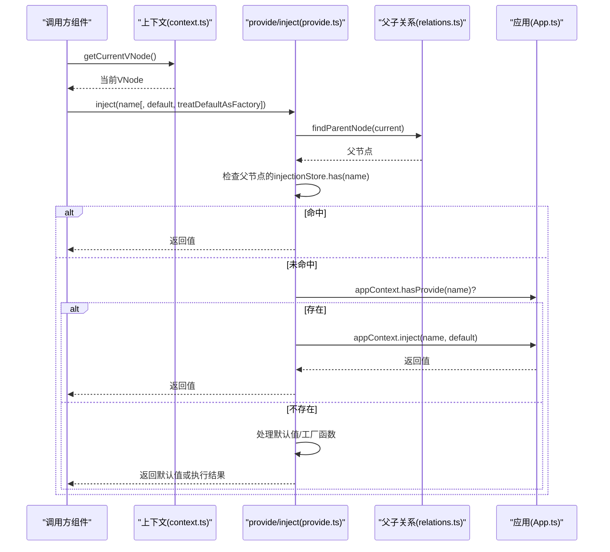
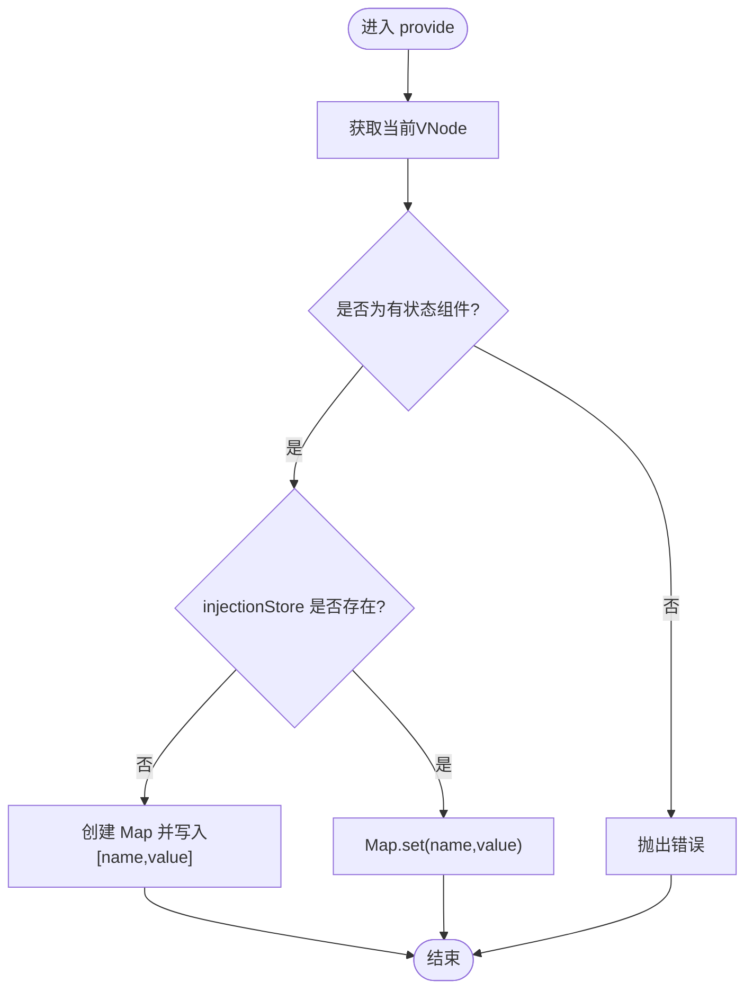
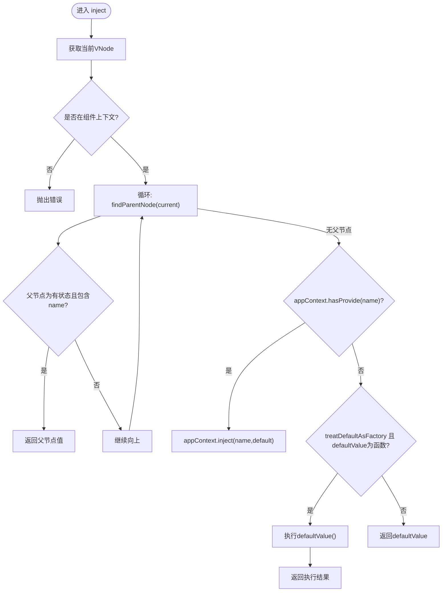
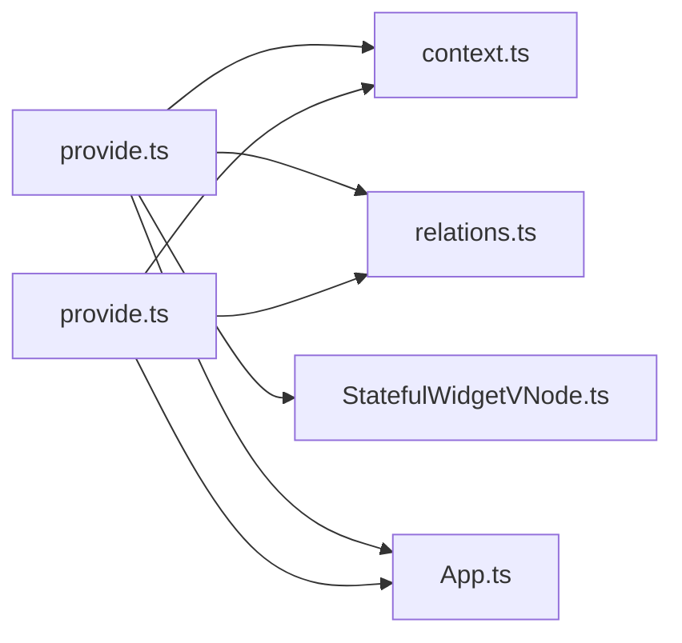

# 依赖注入优化

<cite>
**本文引用的文件列表**
- [provide.ts](file://packages/runtime-core/src/runtime/provide.ts)
- [relations.ts](file://packages/runtime-core/src/runtime/relations.ts)
- [context.ts](file://packages/runtime-core/src/runtime/context.ts)
- [App.ts](file://packages/runtime-core/src/app/App.ts)
- [StatefulWidgetVNode.ts](file://packages/runtime-core/src/types/nodes/StatefulWidgetVNode.ts)
- [Stateful.ts](file://packages/runtime-core/src/widget/runtime/Stateful.ts)
- [symbol.ts](file://packages/runtime-core/src/constants/symbol.ts)
- [provide.test.ts](file://packages/runtime-core/__tests__/runtime/provide.test.ts)
</cite>

## 目录
1. [引言](#引言)
2. [项目结构](#项目结构)
3. [核心组件](#核心组件)
4. [架构总览](#架构总览)
5. [详细组件分析](#详细组件分析)
6. [依赖关系分析](#依赖关系分析)
7. [性能考量](#性能考量)
8. [故障排查指南](#故障排查指南)
9. [结论](#结论)
10. [附录](#附录)

## 引言
本文件聚焦于框架中的依赖注入机制，围绕 provide/inject 的实现与性能优化展开，重点解释：
- 在有状态组件的 vnode 上如何设置 injectionStore
- inject 如何通过 findParentNode 向上遍历查找依赖
- 使用 Symbol 作为 key 的优势与命名冲突规避
- 在深层组件树中减少依赖查找开销的最佳实践
- inject 默认值与工厂函数的用法，降低不必要的计算开销

## 项目结构
与依赖注入相关的关键模块分布如下：
- 运行时注入 API：provide/inject 实现
- 父子节点关系：findParentNode 与 linkParentNode
- 组件上下文：getCurrentVNode 与 runInNodeContext
- 应用级注入：App.provide/hasProvide/inject
- VNode 类型：StatefulWidgetVNode 的 injectionStore 字段
- 符号常量：用于标识上下文与节点的 Symbol

图表来源
- [provide.ts](file://packages/runtime-core/src/runtime/provide.ts#L1-L130)
- [relations.ts](file://packages/runtime-core/src/runtime/relations.ts#L1-L37)
- [context.ts](file://packages/runtime-core/src/runtime/context.ts#L1-L52)
- [App.ts](file://packages/runtime-core/src/app/App.ts#L307-L336)
- [StatefulWidgetVNode.ts](file://packages/runtime-core/src/types/nodes/StatefulWidgetVNode.ts#L17-L33)
- [Stateful.ts](file://packages/runtime-core/src/widget/runtime/Stateful.ts#L1-L368)
- [symbol.ts](file://packages/runtime-core/src/constants/symbol.ts#L1-L39)

章节来源
- [provide.ts](file://packages/runtime-core/src/runtime/provide.ts#L1-L130)
- [relations.ts](file://packages/runtime-core/src/runtime/relations.ts#L1-L37)
- [context.ts](file://packages/runtime-core/src/runtime/context.ts#L1-L52)
- [App.ts](file://packages/runtime-core/src/app/App.ts#L307-L336)
- [StatefulWidgetVNode.ts](file://packages/runtime-core/src/types/nodes/StatefulWidgetVNode.ts#L17-L33)
- [Stateful.ts](file://packages/runtime-core/src/widget/runtime/Stateful.ts#L1-L368)
- [symbol.ts](file://packages/runtime-core/src/constants/symbol.ts#L1-L39)

## 核心组件
- provide(name, value)
  - 仅允许在有状态组件上下文中调用
  - 将 name/value 写入当前 vnode 的 injectionStore（首次创建 Map）
- inject(name[, defaultValue][, treatDefaultAsFactory])
  - 仅允许在组件上下文中调用
  - 从当前节点向上遍历父节点，查找祖先组件的 injectionStore
  - 若未找到且 appContext 提供 hasProvide(name)，则委托 appContext.inject
  - 若仍无结果，按策略返回默认值或执行工厂函数

章节来源
- [provide.ts](file://packages/runtime-core/src/runtime/provide.ts#L31-L41)
- [provide.ts](file://packages/runtime-core/src/runtime/provide.ts#L102-L130)
- [StatefulWidgetVNode.ts](file://packages/runtime-core/src/types/nodes/StatefulWidgetVNode.ts#L17-L33)
- [provide.test.ts](file://packages/runtime-core/__tests__/runtime/provide.test.ts#L1-L102)

## 架构总览
依赖注入的调用链路分为两条路径：
- 组件树内查找：从当前 vnode 开始，逐级向上通过 findParentNode 查找祖先组件的 injectionStore
- 应用级兜底：若组件树内未命中，则回退到 appContext 的 provide/inject

图表来源
- [context.ts](file://packages/runtime-core/src/runtime/context.ts#L48-L51)
- [provide.ts](file://packages/runtime-core/src/runtime/provide.ts#L102-L130)
- [relations.ts](file://packages/runtime-core/src/runtime/relations.ts#L16-L24)
- [App.ts](file://packages/runtime-core/src/app/App.ts#L313-L336)

## 详细组件分析

### provide 函数：在 vnode 上设置 injectionStore
- 限制：必须在有状态组件上下文中调用；否则抛错
- 行为：
  - 若当前 vnode 不存在 injectionStore，则创建 Map 并写入 [name, value]
  - 否则直接 set(name, value)
- 性能要点：
  - Map 的 set/get 为 O(1) 平均复杂度
  - 仅在组件初始化阶段写入，避免运行期重复写入

图表来源
- [provide.ts](file://packages/runtime-core/src/runtime/provide.ts#L31-L41)
- [StatefulWidgetVNode.ts](file://packages/runtime-core/src/types/nodes/StatefulWidgetVNode.ts#L17-L33)

章节来源
- [provide.ts](file://packages/runtime-core/src/runtime/provide.ts#L31-L41)
- [StatefulWidgetVNode.ts](file://packages/runtime-core/src/types/nodes/StatefulWidgetVNode.ts#L17-L33)

### inject 函数：向上遍历查找依赖
- 限制：必须在组件上下文中调用；否则抛错
- 查找顺序：
  1) 从当前节点开始，通过 findParentNode 逐级向上
  2) 遇到有状态组件节点时，检查其 injectionStore 是否包含 name
  3) 若命中，立即返回
  4) 若未命中，检查 appContext.hasProvide(name)
  5) 若存在，委托 appContext.inject(name, defaultValue)
  6) 否则根据 treatDefaultAsFactory 决定是否执行 defaultValue（函数）并返回
- 性能要点：
  - 每次查找为 O(1) Map 操作
  - 遍历深度取决于组件树层级；深层树会增加遍历次数
  - 通过 appContext 兜底可避免深层遍历

图表来源
- [provide.ts](file://packages/runtime-core/src/runtime/provide.ts#L102-L130)
- [relations.ts](file://packages/runtime-core/src/runtime/relations.ts#L16-L24)
- [App.ts](file://packages/runtime-core/src/app/App.ts#L313-L336)

章节来源
- [provide.ts](file://packages/runtime-core/src/runtime/provide.ts#L102-L130)
- [relations.ts](file://packages/runtime-core/src/runtime/relations.ts#L16-L24)
- [App.ts](file://packages/runtime-core/src/app/App.ts#L313-L336)

### 父子节点关系与上下文
- findParentNode(child) 通过 WeakMap 快速获取父节点
- linkParentNode(child, parent) 建立父子映射并同步 appContext
- getCurrentVNode() 从上下文获取当前组件的 VNode

章节来源
- [relations.ts](file://packages/runtime-core/src/runtime/relations.ts#L1-L37)
- [context.ts](file://packages/runtime-core/src/runtime/context.ts#L1-L52)
- [Stateful.ts](file://packages/runtime-core/src/widget/runtime/Stateful.ts#L307-L313)

### 应用级注入（appContext）
- App.provide(name, value)：写入应用级 Map
- App.hasProvide(name)：O(1) 检查
- App.inject(name, defaultValue)：O(1) 获取或返回默认值
- 优点：避免深层遍历，适合稳定数据与全局配置

章节来源
- [App.ts](file://packages/runtime-core/src/app/App.ts#L307-L336)

### VNode 类型与 injectionStore
- StatefulWidgetVNode 定义 injectionStore 字段，用于缓存本组件提供的依赖
- 有状态组件运行时在构建子节点时会建立父子关系，确保查找路径正确

章节来源
- [StatefulWidgetVNode.ts](file://packages/runtime-core/src/types/nodes/StatefulWidgetVNode.ts#L17-L33)
- [Stateful.ts](file://packages/runtime-core/src/widget/runtime/Stateful.ts#L307-L313)

## 依赖关系分析
- provide/inject 依赖：
  - context.ts 提供 getCurrentVNode
  - relations.ts 提供 findParentNode/linkParentNode
  - App.ts 提供应用级 provide/inject
  - StatefulWidgetVNode.ts 定义 injectionStore 字段
- 耦合与内聚：
  - provide/inject 逻辑集中在 runtime/provide.ts，职责清晰
  - 与 VNode 类型耦合在 injectionStore 字段，便于快速查找
  - 与 appContext 解耦，通过 hasProvide/inject 委托实现

图表来源
- [provide.ts](file://packages/runtime-core/src/runtime/provide.ts#L1-L130)
- [context.ts](file://packages/runtime-core/src/runtime/context.ts#L1-L52)
- [relations.ts](file://packages/runtime-core/src/runtime/relations.ts#L1-L37)
- [StatefulWidgetVNode.ts](file://packages/runtime-core/src/types/nodes/StatefulWidgetVNode.ts#L17-L33)
- [App.ts](file://packages/runtime-core/src/app/App.ts#L307-L336)

## 性能考量
- 时间复杂度
  - 单次注入：O(1)
  - 单次注入查找：O(k)（k 为祖先层级数），最坏等于树深
  - 应用级注入：O(1)
- 空间复杂度
  - injectionStore 为 Map，按需存储，空间与提供数量线性相关
- 深层树的开销
  - 深层组件树会放大查找成本，建议：
    - 将稳定数据提升至更高层级或 appContext
    - 使用 Symbol 作为 key，避免字符串冲突带来的误判
    - 对昂贵的默认值使用工厂函数并开启 treatDefaultAsFactory，仅在真正缺失时计算
- 优化建议
  - 避免在组件树中频繁调用 provide（尤其在高频渲染场景）
  - 将跨多层共享的稳定数据放入 appContext，减少遍历
  - 使用 Symbol 作为 key，提升查找稳定性与性能

章节来源
- [provide.ts](file://packages/runtime-core/src/runtime/provide.ts#L31-L41)
- [provide.ts](file://packages/runtime-core/src/runtime/provide.ts#L102-L130)
- [App.ts](file://packages/runtime-core/src/app/App.ts#L307-L336)
- [symbol.ts](file://packages/runtime-core/src/constants/symbol.ts#L1-L39)

## 故障排查指南
- 常见错误
  - 在无上下文环境中调用 provide/inject：抛出错误
  - 传入 undefined/null 作为 value 或 defaultValue：抛出错误（测试覆盖）
- 排查步骤
  - 确认调用时机：仅在组件初始化阶段调用 provide/inject
  - 确认调用环境：确保在组件上下文中（如 onCreate/build）
  - 确认 key 类型：优先使用 Symbol，避免字符串冲突
  - 确认 appContext：对于稳定数据，优先通过 App.provide 注入
- 测试参考
  - provide/inject 的 API 签名与边界情况均有测试覆盖

章节来源
- [provide.test.ts](file://packages/runtime-core/__tests__/runtime/provide.test.ts#L1-L102)
- [provide.ts](file://packages/runtime-core/src/runtime/provide.ts#L31-L41)
- [provide.ts](file://packages/runtime-core/src/runtime/provide.ts#L102-L130)

## 结论
- provide/inject 在有状态组件的 vnode 上以 Map 形式缓存依赖，查找通过 findParentNode 逐层向上，最终可回退到 appContext
- 使用 Symbol 作为 key 可显著降低冲突风险并提升查找稳定性
- 在深层组件树中，应尽量将稳定数据提升到更高层级或 appContext，减少遍历成本
- inject 的默认值与工厂函数配合，可有效避免不必要的计算开销

## 附录
- 关键实现路径
  - provide：[packages/runtime-core/src/runtime/provide.ts](file://packages/runtime-core/src/runtime/provide.ts#L31-L41)
  - inject：[packages/runtime-core/src/runtime/provide.ts](file://packages/runtime-core/src/runtime/provide.ts#L102-L130)
  - 父子关系：[packages/runtime-core/src/runtime/relations.ts](file://packages/runtime-core/src/runtime/relations.ts#L16-L24)
  - 上下文：[packages/runtime-core/src/runtime/context.ts](file://packages/runtime-core/src/runtime/context.ts#L48-L51)
  - 应用级注入：[packages/runtime-core/src/app/App.ts](file://packages/runtime-core/src/app/App.ts#L307-L336)
  - VNode 类型：[packages/runtime-core/src/types/nodes/StatefulWidgetVNode.ts](file://packages/runtime-core/src/types/nodes/StatefulWidgetVNode.ts#L17-L33)
  - 符号常量：[packages/runtime-core/src/constants/symbol.ts](file://packages/runtime-core/src/constants/symbol.ts#L1-L39)