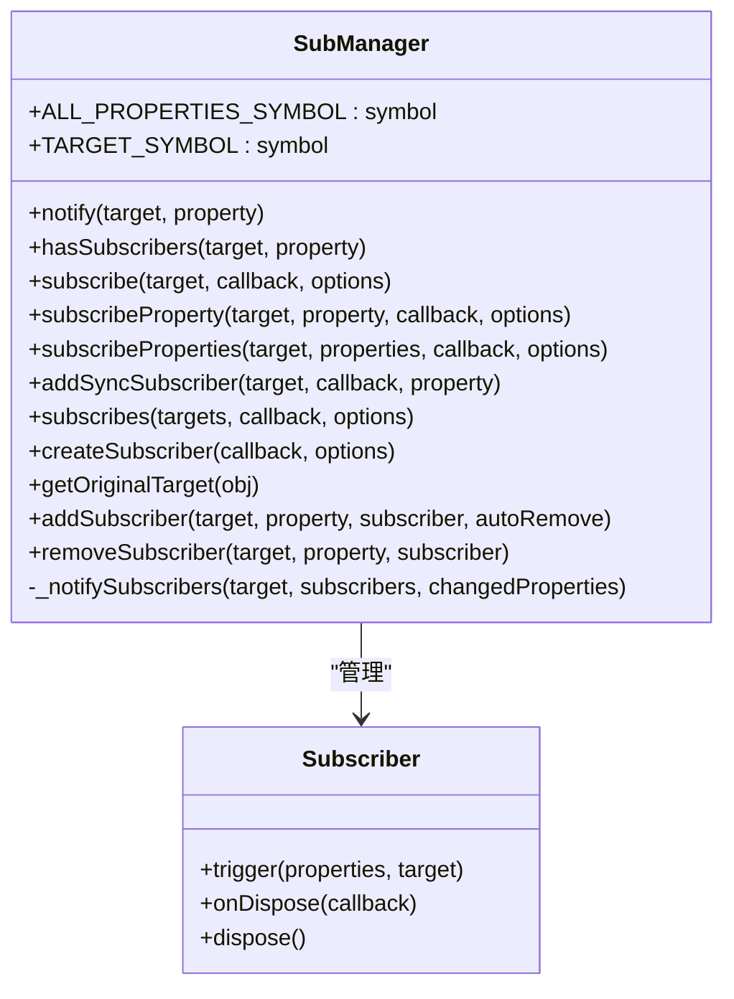
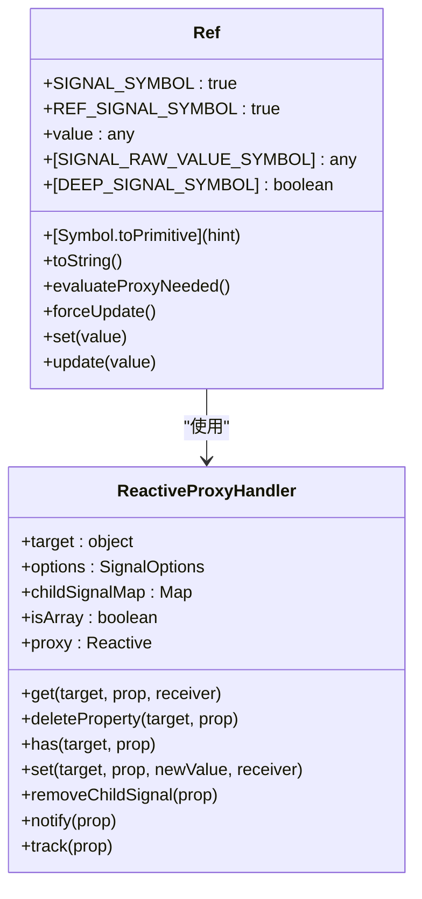
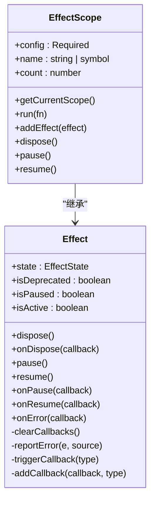

# 响应式优化

<cite>
**本文档引用文件**  
- [subManager.ts](file://packages/responsive/src/observer/subManager.ts)
- [ref.ts](file://packages/responsive/src/signal/ref/ref.ts)
- [proxy-handler.ts](file://packages/responsive/src/signal/reactive/proxy-handler.ts)
- [depend.ts](file://packages/responsive/src/depend/depend.ts)
- [effect.ts](file://packages/responsive/src/effect/effect.ts)
- [effect-scope.ts](file://packages/responsive/src/effect/effect-scope.ts)
- [conversion.ts](file://packages/responsive/src/signal/utils/conversion.ts)
- [mark.ts](file://packages/responsive/src/signal/utils/mark.ts)
- [manager.ts](file://packages/responsive/src/signal/manager.ts)
- [ref-performance.test.ts](file://packages/responsive/__tests__/performance/ref.ts)
</cite>

## 目录
1. [引言](#引言)
2. [依赖收集机制与性能影响](#依赖收集机制与性能影响)
3. [SubManager 订阅管理机制](#submanager-订阅管理机制)
4. [ref 与 reactive 的性能开销分析](#ref-与-reactive-的性能开销分析)
5. [unreactive 工具函数与响应式排除](#unreactive-工具函数与响应式排除)
6. [避免响应式数据过度嵌套的实践建议](#避免响应式数据过度嵌套的实践建议)
7. [副作用函数调度机制与性能影响](#副作用函数调度机制与性能影响)
8. [effectScope 与副作用生命周期管理](#effectscope-与副作用生命周期管理)
9. [性能测试与内存占用分析](#性能测试与内存占用分析)
10. [结论](#结论)

## 引言
本文档旨在深入分析响应式系统的性能优化策略，重点探讨依赖收集机制、SubManager 订阅管理、ref 与 reactive 的性能开销、unreactive 工具函数的使用、响应式数据嵌套问题、副作用函数调度机制以及 effectScope 的生命周期管理。通过详细分析代码实现和性能测试，为开发者提供优化响应式系统性能的实践指导。

## 依赖收集机制与性能影响
响应式系统的核心是依赖收集机制，它通过追踪响应式对象的属性访问来建立依赖关系。当属性值发生变化时，系统会通知所有依赖于该属性的订阅者进行更新。这种机制虽然实现了自动化的数据绑定，但也带来了性能开销。

依赖收集主要通过 `Depend` 类实现，它利用 `WeakMap` 存储响应式对象与属性的映射关系。当访问响应式对象的属性时，`Depend.track` 方法会被调用，记录当前的依赖关系。这种基于 `WeakMap` 的存储方式可以有效避免内存泄漏，因为当响应式对象被垃圾回收时，对应的依赖记录也会被自动清除。

然而，频繁的依赖收集操作会增加 CPU 开销，尤其是在处理大量响应式对象时。此外，依赖收集的粒度也会影响性能。细粒度的依赖收集可以提高更新的精确性，但会增加依赖记录的数量；而粗粒度的依赖收集虽然减少了记录数量，但可能导致不必要的更新。

**Section sources**
- [depend.ts](file://packages/responsive/src/depend/depend.ts#L1-L152)

## SubManager 订阅管理机制
`SubManager` 类负责管理订阅者集合，是响应式系统中连接数据变化与响应逻辑的核心组件。它通过 `WeakMap` 存储目标对象与订阅者之间的映射关系，确保订阅关系的高效管理和内存安全。

`SubManager` 提供了多种订阅方法，包括 `subscribe`、`subscribeProperty` 和 `subscribeProperties`，允许开发者根据需要订阅对象的整体变化或特定属性的变化。这些方法返回 `Subscriber` 实例，可用于管理订阅的生命周期。

当数据发生变化时，`SubManager.notify` 方法会被调用，将变更通知添加到队列中，并通过微任务异步处理，以提高性能。对于需要立即响应的场景，可以使用 `addSyncSubscriber` 方法添加即时回调函数。

`SubManager` 还实现了自动清理机制，当订阅者被销毁或目标对象的属性不再有订阅者时，相关的订阅记录会被自动移除，释放内存。

**Diagram sources**
- [subManager.ts](file://packages/responsive/src/observer/subManager.ts#L46-L424)

**Section sources**
- [subManager.ts](file://packages/responsive/src/observer/subManager.ts#L46-L424)

## ref 与 reactive 的性能开销分析
`ref` 和 `reactive` 是创建响应式对象的两种主要方式，它们在性能开销上有所不同。

`ref` 用于包装基本类型或对象，使其成为响应式变量。它通过 `Ref` 类实现，内部存储原始值，并在访问 `value` 属性时进行依赖收集。当 `ref` 的值是对象时，`ref` 会根据配置决定是否将其深度代理为响应式对象。这种惰性代理机制可以减少不必要的代理开销。

`reactive` 则直接创建一个响应式代理对象，对目标对象的所有属性进行代理。它通过 `ReactiveProxyHandler` 类实现，利用 `Proxy` 拦截对象的属性访问和修改操作。`reactive` 支持深度代理，会递归地将嵌套对象的所有属性都转换为响应式。

从性能角度来看，`ref` 的开销相对较小，因为它只代理一个 `value` 属性。而 `reactive` 的开销较大，因为它需要代理整个对象及其所有嵌套属性。在处理大型对象或深度嵌套对象时，`reactive` 的代理开销会显著增加。

此外，`ref` 和 `reactive` 在内存占用上也有所不同。`ref` 需要额外的内存来存储 `Ref` 实例，而 `reactive` 需要内存来存储 `Proxy` 对象和相关的代理处理器。

**Diagram sources**
- [ref.ts](file://packages/responsive/src/signal/ref/ref.ts#L70-L287)
- [proxy-handler.ts](file://packages/responsive/src/signal/reactive/proxy-handler.ts#L83-L398)

**Section sources**
- [ref.ts](file://packages/responsive/src/signal/ref/ref.ts#L70-L287)
- [proxy-handler.ts](file://packages/responsive/src/signal/reactive/proxy-handler.ts#L83-L398)

## unreactive 工具函数与响应式排除
`unreactive` 工具函数用于将响应式对象转换为其原始值，从而排除特定对象的响应式追踪。这在某些场景下非常有用，比如当需要访问原始数据结构或避免不必要的依赖收集时。

`unreactive` 函数通过检查对象是否具有响应式标识符来判断其是否为响应式对象。如果是响应式对象，则返回其原始值；否则原样返回。这种机制可以有效避免对不需要响应式的对象进行代理，从而减少性能开销。

`unreactive` 的实现依赖于 `isReactive` 函数，该函数通过检查对象的 `SIGNAL_SYMBOL` 和 `PROXY_SIGNAL_SYMBOL` 标识符来判断其是否为响应式代理对象。如果对象是响应式代理，则通过 `SIGNAL_RAW_VALUE_SYMBOL` 获取其原始值。

使用 `unreactive` 可以在处理大型数据结构时避免不必要的响应式代理，提高性能。例如，在进行数据序列化或传递给第三方库时，可以使用 `unreactive` 获取原始数据，避免响应式系统对这些操作的干扰。

**Section sources**
- [helpers.ts](file://packages/responsive/src/signal/reactive/helpers.ts#L109-L111)
- [utils/verify.ts](file://packages/responsive/src/signal/utils/verify.ts#L61-L63)

## 避免响应式数据过度嵌套的实践建议
响应式数据的过度嵌套会导致性能问题，因为每个嵌套层级都需要进行代理和依赖收集。为了避免这种情况，建议采取以下实践：

1. **使用浅层响应式**：对于不需要深度响应式的对象，可以使用 `shallowRef` 或 `shallowReactive` 创建浅层响应式对象。这样可以避免对嵌套对象进行代理，减少性能开销。

2. **合理使用 unreactive**：在处理大型数据结构时，可以使用 `unreactive` 获取原始数据，避免不必要的响应式追踪。

3. **避免深层嵌套**：尽量将数据结构扁平化，减少嵌套层级。可以使用唯一标识符来引用相关数据，而不是直接嵌套。

4. **按需代理**：对于大型对象，可以只对需要响应式的部分进行代理，而不是整个对象。

5. **使用计算属性**：将复杂的计算逻辑封装在计算属性中，避免在模板中进行复杂的表达式计算。

通过这些实践，可以有效减少响应式系统的性能开销，提高应用的整体性能。

## 副作用函数调度机制与性能影响
副作用函数（effect）是响应式系统中的重要组成部分，用于执行依赖于响应式数据的操作。`Effect` 类提供了副作用的生命周期管理，支持 `active`、`paused` 和 `deprecated` 三种状态。

副作用函数的调度机制对性能有重要影响。默认情况下，副作用函数会在微任务队列中异步执行，以避免阻塞主线程。这种异步调度可以提高应用的响应性，但也可能导致更新延迟。

`Effect` 类提供了 `pause` 和 `resume` 方法，可以暂停和恢复副作用的执行。这在某些场景下非常有用，比如在批量更新数据时，可以先暂停副作用，待数据更新完成后再恢复，从而避免不必要的重复执行。

此外，`Effect` 类还支持错误处理，可以通过 `onError` 方法监听副作用执行过程中的错误。这有助于及时发现和处理问题，提高应用的稳定性。

**Diagram sources**
- [effect.ts](file://packages/responsive/src/effect/effect.ts#L34-L261)
- [effect-scope.ts](file://packages/responsive/src/effect/effect-scope.ts#L40-L212)

**Section sources**
- [effect.ts](file://packages/responsive/src/effect/effect.ts#L34-L261)
- [effect-scope.ts](file://packages/responsive/src/effect/effect-scope.ts#L40-L212)

## effectScope 与副作用生命周期管理
`effectScope` 是管理副作用生命周期的重要工具，它允许开发者将多个副作用组织在一起，统一进行管理。`EffectScope` 类继承自 `Effect`，提供了 `addEffect` 方法用于添加副作用，并在销毁时自动清理所有副作用。

使用 `effectScope` 可以有效防止内存泄漏，因为当作用域被销毁时，所有相关的副作用都会被自动清理。这在组件销毁或路由切换等场景下非常有用。

`EffectScope` 还支持嵌套作用域，可以通过 `attachToCurrentScope` 选项将当前作用域附加到父级作用域中。这使得副作用的管理更加灵活，可以根据应用的结构组织作用域。

`run` 方法允许在作用域上下文中执行函数，并捕获其产生的副作用。这确保了在函数执行期间创建的所有副作用都会被正确地添加到当前作用域中，便于后续管理。

合理使用 `effectScope` 可以提高代码的可维护性，减少内存泄漏的风险，是响应式系统性能优化的重要手段。

**Section sources**
- [effect-scope.ts](file://packages/responsive/src/effect/effect-scope.ts#L40-L212)

## 性能测试与内存占用分析
为了评估响应式系统的性能，我们进行了性能测试，重点关注大量创建 `ref` 时的内存占用情况。测试代码创建了 1000 个 `ref` 对象，并测量了内存使用情况。

测试结果表明，创建大量 `ref` 对象会导致显著的内存增量。这是因为每个 `ref` 对象都需要额外的内存来存储 `Ref` 实例和相关的代理信息。在实际应用中，应避免不必要的 `ref` 创建，尤其是在循环或频繁更新的场景中。

通过优化 `ref` 的使用，如复用 `ref` 实例或使用浅层响应式，可以有效减少内存占用。此外，及时清理不再使用的 `ref` 对象也是降低内存消耗的重要手段。

**Section sources**
- [ref-performance.test.ts](file://packages/responsive/__tests__/performance/ref.ts#L1-L17)

## 结论
响应式系统的性能优化是一个复杂但重要的课题。通过深入理解依赖收集机制、合理使用 `SubManager`、选择合适的响应式创建方式、避免过度嵌套、优化副作用调度以及有效管理副作用生命周期，可以显著提高应用的性能和稳定性。开发者应根据具体场景选择合适的优化策略，平衡响应式功能与性能开销，为用户提供流畅的体验。