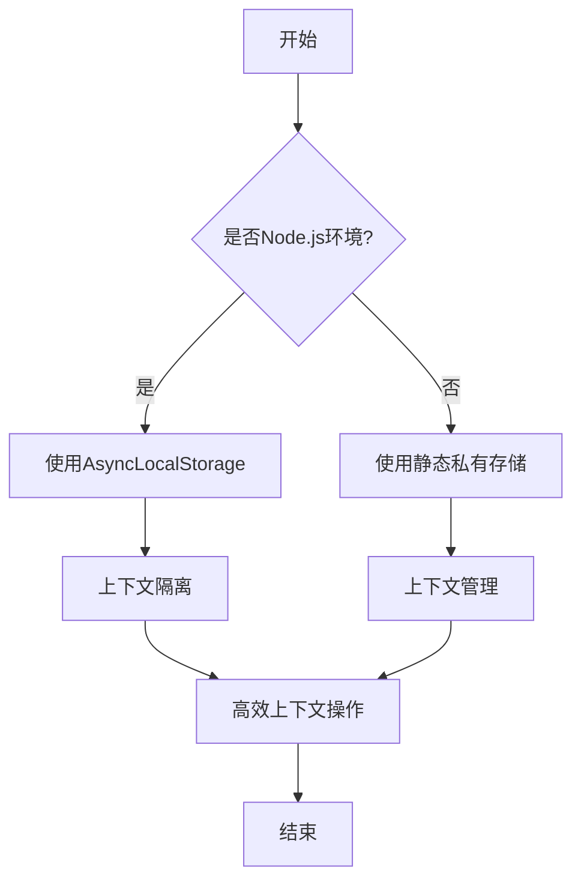
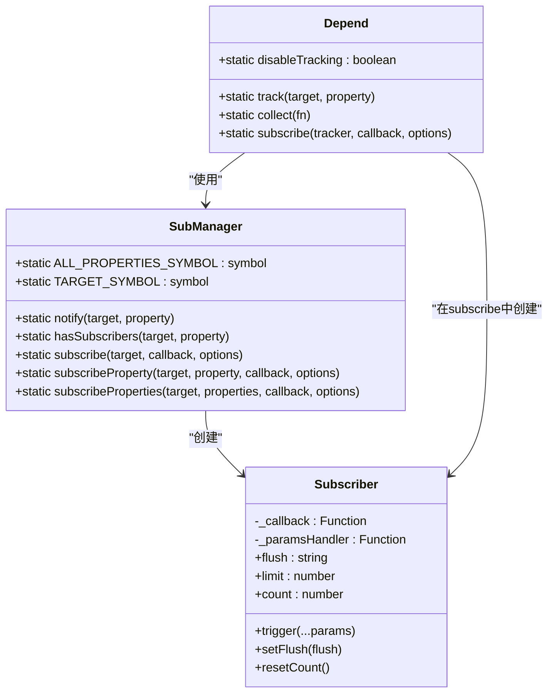
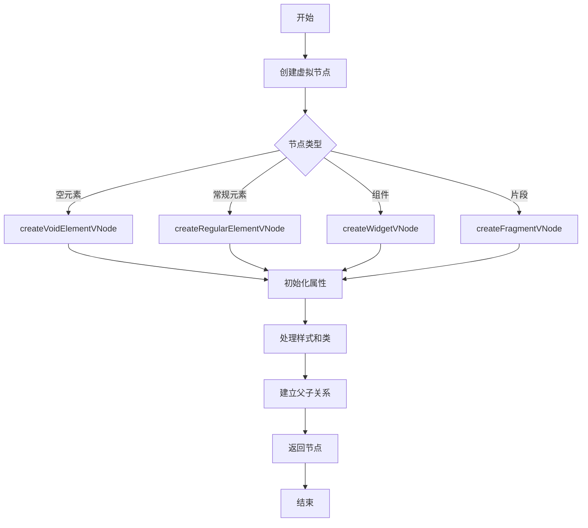
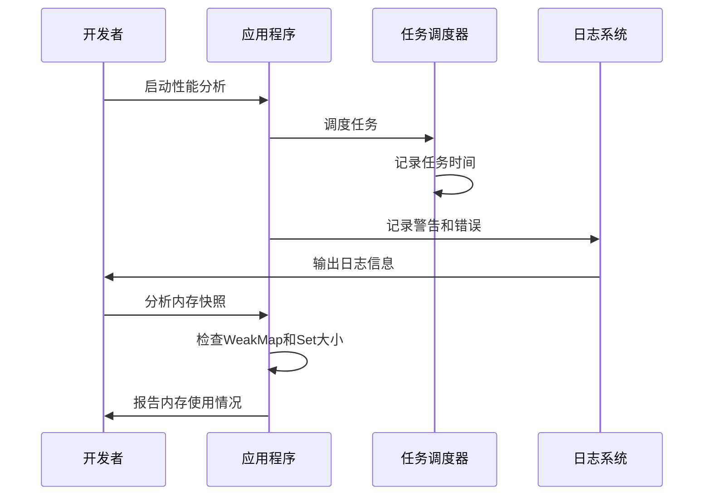
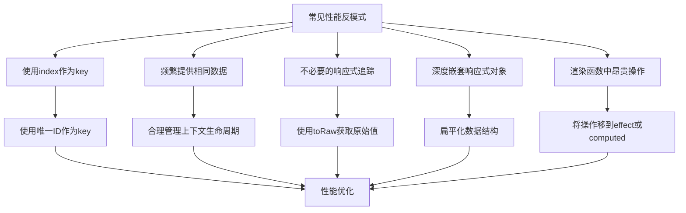

# 性能优化

<cite>
**本文档引用的文件**  
- [context.ts](file://packages/responsive/src/context/context.ts)
- [helpers.ts](file://packages/responsive/src/context/helpers.ts)
- [depend.ts](file://packages/responsive/src/depend/depend.ts)
- [scheduler.ts](file://packages/responsive/src/observer/scheduler.ts)
- [subManager.ts](file://packages/responsive/src/observer/subManager.ts)
- [subscriber.ts](file://packages/responsive/src/observer/subscriber.ts)
- [conversion.ts](file://packages/responsive/src/signal/utils/conversion.ts)
- [element.ts](file://packages/runtime-core/src/vnode/creator/element.ts)
- [widget.ts](file://packages/runtime-core/src/vnode/creator/widget.ts)
- [children.ts](file://packages/runtime-core/src/vnode/normalizer/children.ts)
</cite>

## 目录
1. [provide/inject 性能优化](#provideinject-性能优化)
2. [响应式系统依赖收集优化](#响应式系统依赖收集优化)
3. [虚拟 DOM Diff 算法优化](#虚拟-dom-diff-算法优化)
4. [性能分析工具集成](#性能分析工具集成)
5. [常见性能反模式识别与修复](#常见性能反模式识别与修复)

## provide/inject 性能优化

在深层组件树中使用 provide/inject 机制时，性能优化至关重要。Vitarx 框架通过 `Context` 类和相关辅助函数实现了高效的上下文管理。

`Context` 类根据运行环境（Node.js 或浏览器）采用不同的实现策略。在 Node.js 环境中，使用 `AsyncLocalStorage` 确保异步操作中的上下文隔离；在浏览器环境中，使用静态私有存储 `#store` 管理上下文。这种环境自适应的设计确保了跨平台的一致性和性能。

为了提升查找效率，建议使用 `Symbol` 作为上下文标签（tag）。`Symbol` 作为唯一标识符，避免了字符串键名可能带来的哈希冲突，从而提高了 Map 数据结构的查找性能。同时，`Symbol` 作为键名不会被枚举，减少了意外访问的风险。

为了避免频繁提供相同数据，应合理管理上下文的生命周期。通过 `runInContext` 函数可以在指定上下文中同步执行函数，并在执行完成后自动恢复之前的上下文状态。对于异步任务，使用 `withAsyncContext` 函数可以确保在任务完成后自动恢复上下文状态，无论任务成功或失败。

**图表来源**  
- [context.ts](file://packages/responsive/src/context/context.ts#L65-L137)
- [helpers.ts](file://packages/responsive/src/context/helpers.ts#L18-L73)

**本节来源**  
- [context.ts](file://packages/responsive/src/context/context.ts#L4-L137)
- [helpers.ts](file://packages/responsive/src/context/helpers.ts#L1-L73)

## 响应式系统依赖收集优化

响应式系统中的依赖收集是性能关键路径。Vitarx 框架通过 `Depend` 类和 `SubManager` 类实现了高效的依赖收集和通知机制。

`Depend` 类负责收集和跟踪响应式对象的依赖关系。当响应式对象的属性被访问时，`track` 方法会自动记录依赖关系。`collect` 方法执行提供的函数，并记录其访问的所有响应式对象及其属性，返回包含函数执行结果和依赖映射的对象。这种机制确保了只有真正被访问的属性才会被追踪，减少了不必要的依赖收集。

为了减少不必要的响应式追踪，框架提供了 `unreactive` 工具函数。该函数可以将响应式信号对象转换为其原始值，不会触发依赖收集。这在需要直接访问或操作原始数据的场景中非常有用，避免了响应式系统的开销。

`SubManager` 类管理订阅关系并在数据变更时通知相关订阅者。它使用 `WeakMap` 存储订阅者，确保当目标对象被垃圾回收时，相关的订阅者也会被自动清理，避免了内存泄漏。`notify` 方法触发变更通知，将变更添加到队列中，并通过微任务异步处理，提高了性能。

**图表来源**  
- [depend.ts](file://packages/responsive/src/depend/depend.ts#L41-L151)
- [subManager.ts](file://packages/responsive/src/observer/subManager.ts#L46-L423)
- [subscriber.ts](file://packages/responsive/src/observer/subscriber.ts#L98-L247)

**本节来源**  
- [depend.ts](file://packages/responsive/src/depend/depend.ts#L1-L151)
- [subManager.ts](file://packages/responsive/src/observer/subManager.ts#L1-L423)
- [subscriber.ts](file://packages/responsive/src/observer/subscriber.ts#L1-L247)

## 虚拟 DOM Diff 算法优化

虚拟 DOM 的 Diff 算法是前端框架性能的核心。Vitarx 框架通过精心设计的虚拟节点创建和标准化过程实现了高效的 Diff 算法。

在创建虚拟节点时，合理使用 `key` 属性至关重要。`key` 用于标识节点的唯一性，特别是在列表渲染时。重复的 `key` 可能导致渲染错误或性能问题。框架在开发模式下会检查 `key` 是否重复，并记录警告信息。建议使用稳定且唯一的值作为 `key`，避免使用数组索引，因为索引在列表项重新排序时会发生变化，导致不必要的重新渲染。

`initChildren` 函数负责扁平化并标准化子节点。它使用迭代而非递归的方式处理嵌套的子节点数组，避免了深度嵌套时可能导致的栈溢出问题。该函数首先将顶层子节点解包后压入栈中，然后使用迭代方式处理栈中的元素，直到栈为空。这种方法不仅提高了性能，还增强了系统的健壮性。

对于不同类型的节点，框架提供了专门的创建函数。`createVoidElementVNode` 创建空元素节点（自闭合元素），`createRegularElementVNode` 创建常规元素节点，`createWidgetVNode` 创建组件节点。这些函数在创建节点时会初始化元素属性，处理样式和类属性，并建立子节点与父节点的关联。

**图表来源**  
- [element.ts](file://packages/runtime-core/src/vnode/creator/element.ts#L26-L68)
- [widget.ts](file://packages/runtime-core/src/vnode/creator/widget.ts#L90-L173)
- [children.ts](file://packages/runtime-core/src/vnode/normalizer/children.ts#L105-L147)

**本节来源**  
- [element.ts](file://packages/runtime-core/src/vnode/creator/element.ts#L1-L68)
- [widget.ts](file://packages/runtime-core/src/vnode/creator/widget.ts#L1-L173)
- [children.ts](file://packages/runtime-core/src/vnode/normalizer/children.ts#L1-L147)

## 性能分析工具集成

为了有效分析和优化应用性能，集成性能分析工具是必不可少的。Vitarx 框架提供了多种机制来支持性能分析。

框架使用 `Scheduler` 类管理不同优先级的任务队列，包括准备阶段队列、主任务队列和清理阶段队列。这种三阶段任务队列的设计允许开发者在不同阶段插入性能标记，分析任务执行的时间分布。`nextTick` 方法将回调推迟到下一个微任务执行，可以用于测量微任务的执行时间。

`logger` 工具在开发模式下提供了详细的日志输出，包括警告和错误信息。例如，在检测到重复的 `key` 时，会记录警告信息并包含节点源码位置。这些日志信息对于识别性能问题和调试非常有帮助。

内存快照分析可以通过监控 `WeakMap` 和 `Set` 等数据结构的大小来实现。`SubManager` 使用 `WeakMap` 存储订阅者，确保当目标对象被垃圾回收时，相关的订阅者也会被自动清理。通过定期检查这些数据结构的大小，可以发现潜在的内存泄漏问题。

**图表来源**  
- [scheduler.ts](file://packages/responsive/src/observer/scheduler.ts#L44-L325)
- [children.ts](file://packages/runtime-core/src/vnode/normalizer/children.ts#L45-L58)
- [widget.ts](file://packages/runtime-core/src/vnode/creator/widget.ts#L45-L68)

**本节来源**  
- [scheduler.ts](file://packages/responsive/src/observer/scheduler.ts#L1-L325)
- [children.ts](file://packages/runtime-core/src/vnode/normalizer/children.ts#L1-L147)
- [widget.ts](file://packages/runtime-core/src/vnode/creator/widget.ts#L1-L173)

## 常见性能反模式识别与修复

识别和修复常见的性能反模式是保持应用高性能的关键。以下是一些常见的反模式及其修复建议。

**避免在列表项中使用 index 作为 key**：使用数组索引作为 `key` 是一个常见的反模式。当列表项重新排序时，索引会发生变化，导致框架无法正确识别节点的变化，从而引发不必要的重新渲染。应使用稳定且唯一的值（如 ID）作为 `key`。

**避免频繁提供相同数据**：在深层组件树中频繁调用 `provide` 会导致性能下降。应合理管理上下文的生命周期，使用 `runInContext` 或 `withAsyncContext` 在需要时提供数据，并在使用后及时清理。

**避免不必要的响应式追踪**：在不需要响应式行为的场景中，应使用 `toRaw` 函数获取响应式对象的原始值，避免触发依赖收集。这可以显著减少响应式系统的开销。

**避免深度嵌套的响应式对象**：深度嵌套的响应式对象会导致依赖收集和通知的开销急剧增加。应尽量扁平化数据结构，或将大型对象拆分为多个较小的响应式对象。

**避免在渲染函数中执行昂贵的操作**：渲染函数应尽可能轻量，避免执行昂贵的计算或 DOM 操作。可以将昂贵的操作移到 `effect` 或 `computed` 中，在数据变化时预先计算结果。

**图表来源**  
- [children.ts](file://packages/runtime-core/src/vnode/normalizer/children.ts#L45-L58)
- [context.ts](file://packages/responsive/src/context/context.ts#L45-L46)
- [conversion.ts](file://packages/responsive/src/signal/utils/conversion.ts#L43-L47)

**本节来源**  
- [children.ts](file://packages/runtime-core/src/vnode/normalizer/children.ts#L1-L147)
- [context.ts](file://packages/responsive/src/context/context.ts#L1-L137)
- [conversion.ts](file://packages/responsive/src/signal/utils/conversion.ts#L1-L48)