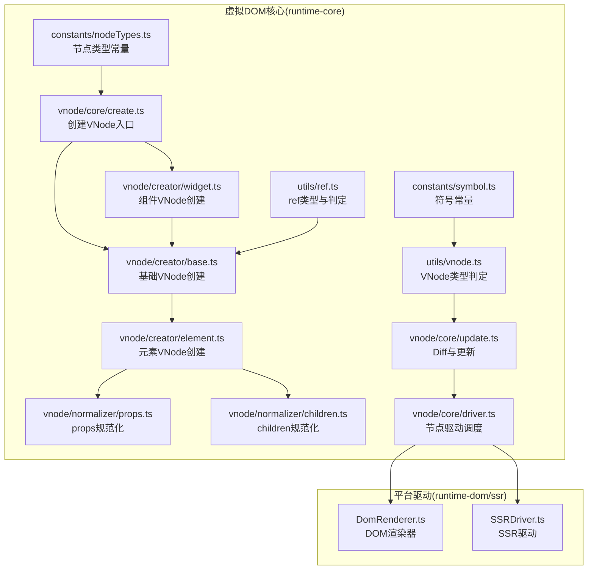
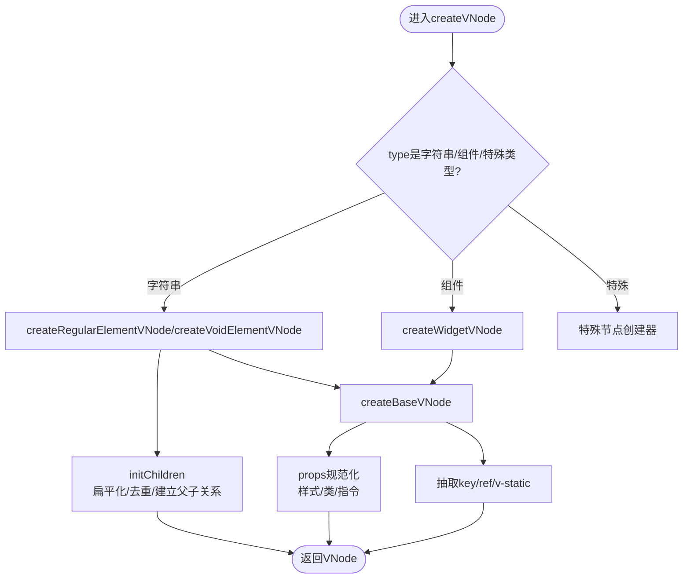
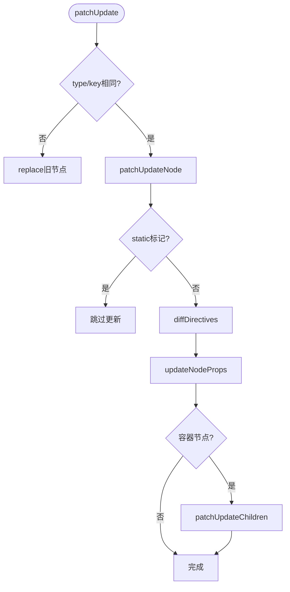
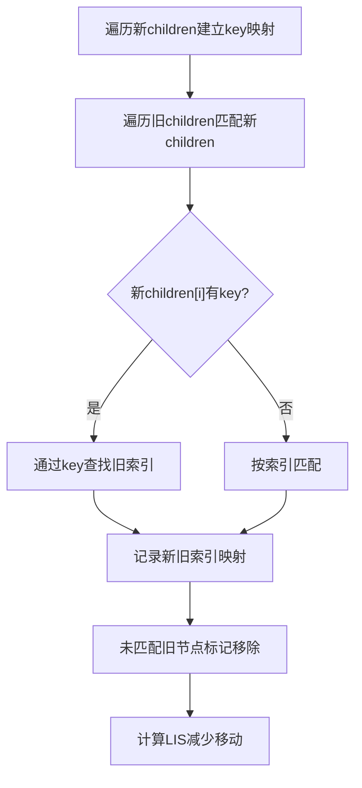
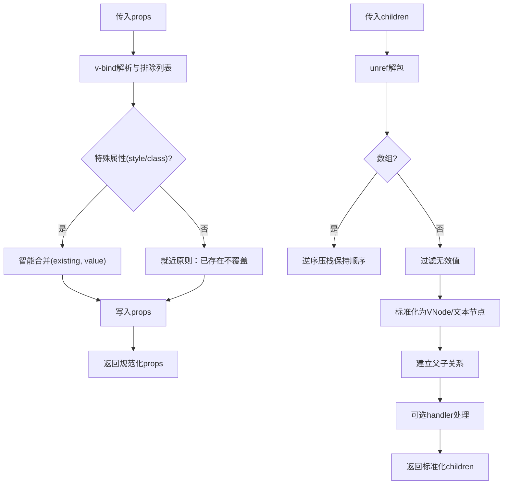
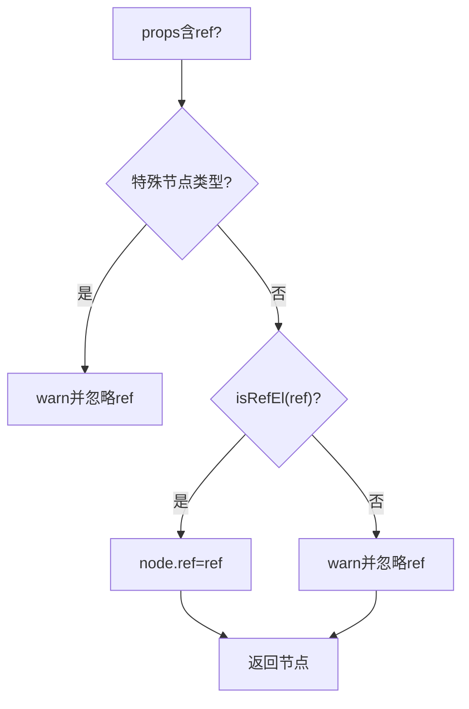
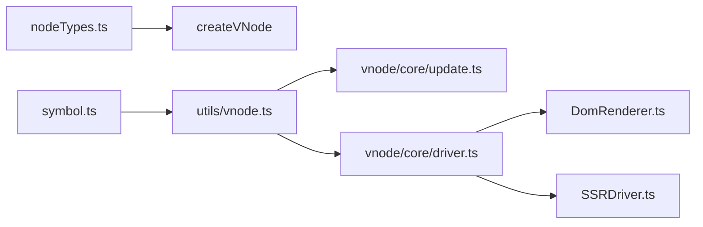

# 渲染优化

<cite>
**本文引用的文件**
- [packages/runtime-core/src/vnode/core/create.ts](file://packages/runtime-core/src/vnode/core/create.ts)
- [packages/runtime-core/src/vnode/creator/base.ts](file://packages/runtime-core/src/vnode/creator/base.ts)
- [packages/runtime-core/src/vnode/creator/element.ts](file://packages/runtime-core/src/vnode/creator/element.ts)
- [packages/runtime-core/src/vnode/creator/widget.ts](file://packages/runtime-core/src/vnode/creator/widget.ts)
- [packages/runtime-core/src/vnode/normalizer/children.ts](file://packages/runtime-core/src/vnode/normalizer/children.ts)
- [packages/runtime-core/src/vnode/normalizer/props.ts](file://packages/runtime-core/src/vnode/normalizer/props.ts)
- [packages/runtime-core/src/vnode/core/update.ts](file://packages/runtime-core/src/vnode/core/update.ts)
- [packages/runtime-core/src/vnode/core/driver.ts](file://packages/runtime-core/src/vnode/core/driver.ts)
- [packages/runtime-core/src/utils/vnode.ts](file://packages/runtime-core/src/utils/vnode.ts)
- [packages/runtime-core/src/utils/ref.ts](file://packages/runtime-core/src/utils/ref.ts)
- [packages/runtime-core/src/constants/nodeTypes.ts](file://packages/runtime-core/src/constants/nodeTypes.ts)
- [packages/runtime-core/src/constants/symbol.ts](file://packages/runtime-core/src/constants/symbol.ts)
- [packages/runtime-dom/src/DomRenderer.ts](file://packages/runtime-dom/src/DomRenderer.ts)
- [packages/runtime-ssr/src/SSRDriver.ts](file://packages/runtime-ssr/src/SSRDriver.ts)
</cite>

## 目录
1. [简介](#简介)
2. [项目结构](#项目结构)
3. [核心组件](#核心组件)
4. [架构总览](#架构总览)
5. [详细组件分析](#详细组件分析)
6. [依赖分析](#依赖分析)
7. [性能考量](#性能考量)
8. [故障排查指南](#故障排查指南)
9. [结论](#结论)
10. [附录](#附录)

## 简介
本文件聚焦于虚拟DOM渲染性能优化，围绕 VNode 创建与 Diff 算法的关键路径进行深入剖析。重点涵盖：
- 如何通过合理使用 key（尤其是 Symbol 类型 key）提升列表渲染效率，避免使用 index 作为 key 导致的性能问题
- vnode 创建过程中 props 与 children 的规范化处理开销，以及如何通过静态提升与缓存策略优化
- 结合 createBaseVNode 等核心函数，解释 ref 属性的处理机制及其在特殊节点类型上的限制
- 提供 key 使用的最佳实践示例，展示不同 key 策略对渲染性能的影响

## 项目结构
本项目采用多包分层组织，与虚拟DOM渲染相关的核心模块集中在 runtime-core，平台驱动位于 runtime-dom 与 runtime-ssr，工具与常量分布在 utils 与 constants。



图表来源
- [packages/runtime-core/src/vnode/core/create.ts](file://packages/runtime-core/src/vnode/core/create.ts#L87-L159)
- [packages/runtime-core/src/vnode/creator/base.ts](file://packages/runtime-core/src/vnode/creator/base.ts#L22-L118)
- [packages/runtime-core/src/vnode/creator/element.ts](file://packages/runtime-core/src/vnode/creator/element.ts#L1-L69)
- [packages/runtime-core/src/vnode/creator/widget.ts](file://packages/runtime-core/src/vnode/creator/widget.ts#L1-L174)
- [packages/runtime-core/src/vnode/normalizer/props.ts](file://packages/runtime-core/src/vnode/normalizer/props.ts#L1-L146)
- [packages/runtime-core/src/vnode/normalizer/children.ts](file://packages/runtime-core/src/vnode/normalizer/children.ts#L1-L149)
- [packages/runtime-core/src/vnode/core/update.ts](file://packages/runtime-core/src/vnode/core/update.ts#L55-L390)
- [packages/runtime-core/src/vnode/core/driver.ts](file://packages/runtime-core/src/vnode/core/driver.ts#L1-L143)
- [packages/runtime-core/src/utils/vnode.ts](file://packages/runtime-core/src/utils/vnode.ts#L1-L142)
- [packages/runtime-core/src/utils/ref.ts](file://packages/runtime-core/src/utils/ref.ts#L1-L59)
- [packages/runtime-core/src/constants/nodeTypes.ts](file://packages/runtime-core/src/constants/nodeTypes.ts#L1-L32)
- [packages/runtime-core/src/constants/symbol.ts](file://packages/runtime-core/src/constants/symbol.ts#L1-L39)
- [packages/runtime-dom/src/DomRenderer.ts](file://packages/runtime-dom/src/DomRenderer.ts)
- [packages/runtime-ssr/src/SSRDriver.ts](file://packages/runtime-ssr/src/SSRDriver.ts)

章节来源
- [packages/runtime-core/src/vnode/core/create.ts](file://packages/runtime-core/src/vnode/core/create.ts#L87-L159)
- [packages/runtime-core/src/vnode/creator/base.ts](file://packages/runtime-core/src/vnode/creator/base.ts#L22-L118)
- [packages/runtime-core/src/vnode/creator/element.ts](file://packages/runtime-core/src/vnode/creator/element.ts#L1-L69)
- [packages/runtime-core/src/vnode/creator/widget.ts](file://packages/runtime-core/src/vnode/creator/widget.ts#L1-L174)
- [packages/runtime-core/src/vnode/normalizer/props.ts](file://packages/runtime-core/src/vnode/normalizer/props.ts#L1-L146)
- [packages/runtime-core/src/vnode/normalizer/children.ts](file://packages/runtime-core/src/vnode/normalizer/children.ts#L1-L149)
- [packages/runtime-core/src/vnode/core/update.ts](file://packages/runtime-core/src/vnode/core/update.ts#L55-L390)
- [packages/runtime-core/src/vnode/core/driver.ts](file://packages/runtime-core/src/vnode/core/driver.ts#L1-L143)
- [packages/runtime-core/src/utils/vnode.ts](file://packages/runtime-core/src/utils/vnode.ts#L1-L142)
- [packages/runtime-core/src/utils/ref.ts](file://packages/runtime-core/src/utils/ref.ts#L1-L59)
- [packages/runtime-core/src/constants/nodeTypes.ts](file://packages/runtime-core/src/constants/nodeTypes.ts#L1-L32)
- [packages/runtime-core/src/constants/symbol.ts](file://packages/runtime-core/src/constants/symbol.ts#L1-L39)

## 核心组件
- VNode 创建链路
  - createVNode/h：统一入口，按类型分派到元素/组件/特殊节点创建器
  - createBaseVNode：抽取 key/ref/v-static 等通用属性，完成基础节点构造
  - createRegularElementVNode/createVoidElementVNode：规范化 props 与 children，建立父子关系
  - createWidgetVNode：组件节点创建，合并默认 props，开发模式下属性校验
- Diff 与更新
  - patchUpdate：对比新旧节点，决定替换或更新
  - patchUpdateNode：更新属性与子节点，静态节点短路
  - matchChildrenByKey + getLIS：基于 key 的高效子节点匹配与移动优化
- 驱动与渲染
  - getNodeDriver/renderNode/mountNode：按节点类型路由到平台驱动，执行渲染/挂载/更新

章节来源
- [packages/runtime-core/src/vnode/core/create.ts](file://packages/runtime-core/src/vnode/core/create.ts#L87-L159)
- [packages/runtime-core/src/vnode/creator/base.ts](file://packages/runtime-core/src/vnode/creator/base.ts#L22-L118)
- [packages/runtime-core/src/vnode/creator/element.ts](file://packages/runtime-core/src/vnode/creator/element.ts#L1-L69)
- [packages/runtime-core/src/vnode/creator/widget.ts](file://packages/runtime-core/src/vnode/creator/widget.ts#L1-L174)
- [packages/runtime-core/src/vnode/core/update.ts](file://packages/runtime-core/src/vnode/core/update.ts#L55-L390)
- [packages/runtime-core/src/vnode/core/driver.ts](file://packages/runtime-core/src/vnode/core/driver.ts#L1-L143)

## 架构总览
下面的序列图展示了从创建 VNode 到 Diff 更新的关键调用链，体现 props/children 规范化、key/ref 处理与驱动调度的协作。

```mermaid
sequenceDiagram
participant Caller as "调用方"
participant Create as "createVNode/h"
participant Elem as "createRegularElementVNode"
participant Base as "createBaseVNode"
participant NormC as "initChildren"
participant NormP as "bindProps/normalizerStyleAndClassProp"
participant Diff as "patchUpdate"
participant Upd as "patchUpdateNode"
participant Drv as "getNodeDriver.render/mount"
Caller->>Create : "传入type/props/children"
Create->>Elem : "分派到元素创建器"
Elem->>Base : "创建基础VNode并抽取key/ref/v-static"
Base->>NormP : "规范化props(样式/类/指令等)"
Elem->>NormC : "扁平化并标准化children"
NormC-->>Elem : "返回标准化children"
Elem-->>Create : "返回元素VNode"
Create-->>Caller : "返回VNode"
Caller->>Diff : "新旧VNode对比"
Diff->>Upd : "patchUpdateNode"
Upd->>Drv : "按节点类型驱动渲染/更新"
Drv-->>Upd : "完成渲染/更新"
Upd-->>Diff : "返回更新后的节点"
```

图表来源
- [packages/runtime-core/src/vnode/core/create.ts](file://packages/runtime-core/src/vnode/core/create.ts#L87-L159)
- [packages/runtime-core/src/vnode/creator/element.ts](file://packages/runtime-core/src/vnode/creator/element.ts#L1-L69)
- [packages/runtime-core/src/vnode/creator/base.ts](file://packages/runtime-core/src/vnode/creator/base.ts#L22-L118)
- [packages/runtime-core/src/vnode/normalizer/children.ts](file://packages/runtime-core/src/vnode/normalizer/children.ts#L105-L149)
- [packages/runtime-core/src/vnode/normalizer/props.ts](file://packages/runtime-core/src/vnode/normalizer/props.ts#L1-L146)
- [packages/runtime-core/src/vnode/core/update.ts](file://packages/runtime-core/src/vnode/core/update.ts#L55-L121)
- [packages/runtime-core/src/vnode/core/driver.ts](file://packages/runtime-core/src/vnode/core/driver.ts#L60-L143)

## 详细组件分析

### VNode 创建与规范化
- createVNode/h
  - 统一入口，支持字符串元素、组件、特殊节点与动态渲染
  - h 通过将子节点打包到 props.children，简化调用
- createBaseVNode
  - 浅拷贝 props，抽取 key/ref/v-static
  - 对特殊节点类型进行 unref 解包，对普通节点进行 v-bind 合并与指令解析
  - 对 ref 的限制：特殊节点类型不支持 ref，会发出警告
- createRegularElementVNode/createVoidElementVNode
  - 规范化样式与类名，处理 children，建立父子关系
- createWidgetVNode
  - 合并默认 props，开发模式下执行属性校验



图表来源
- [packages/runtime-core/src/vnode/core/create.ts](file://packages/runtime-core/src/vnode/core/create.ts#L87-L159)
- [packages/runtime-core/src/vnode/creator/element.ts](file://packages/runtime-core/src/vnode/creator/element.ts#L1-L69)
- [packages/runtime-core/src/vnode/creator/widget.ts](file://packages/runtime-core/src/vnode/creator/widget.ts#L1-L174)
- [packages/runtime-core/src/vnode/creator/base.ts](file://packages/runtime-core/src/vnode/creator/base.ts#L22-L118)
- [packages/runtime-core/src/vnode/normalizer/children.ts](file://packages/runtime-core/src/vnode/normalizer/children.ts#L105-L149)
- [packages/runtime-core/src/vnode/normalizer/props.ts](file://packages/runtime-core/src/vnode/normalizer/props.ts#L1-L146)

章节来源
- [packages/runtime-core/src/vnode/core/create.ts](file://packages/runtime-core/src/vnode/core/create.ts#L87-L159)
- [packages/runtime-core/src/vnode/creator/base.ts](file://packages/runtime-core/src/vnode/creator/base.ts#L22-L118)
- [packages/runtime-core/src/vnode/creator/element.ts](file://packages/runtime-core/src/vnode/creator/element.ts#L1-L69)
- [packages/runtime-core/src/vnode/creator/widget.ts](file://packages/runtime-core/src/vnode/creator/widget.ts#L1-L174)
- [packages/runtime-core/src/vnode/normalizer/props.ts](file://packages/runtime-core/src/vnode/normalizer/props.ts#L1-L146)
- [packages/runtime-core/src/vnode/normalizer/children.ts](file://packages/runtime-core/src/vnode/normalizer/children.ts#L1-L149)

### Diff 算法与性能瓶颈
- patchUpdate：快速分支判断，若类型或 key 不同直接替换，否则走 patchUpdateNode
- patchUpdateNode：静态节点短路；对元素/组件节点分别应用 diffDirectives；更新 props；容器节点递归更新 children
- matchChildrenByKey：建立新子节点 key 映射，遍历旧子节点匹配，未命中标记移除
- getLIS：O(n log n) 计算最长递增子序列，减少 DOM 移动操作



图表来源
- [packages/runtime-core/src/vnode/core/update.ts](file://packages/runtime-core/src/vnode/core/update.ts#L55-L121)
- [packages/runtime-core/src/vnode/core/update.ts](file://packages/runtime-core/src/vnode/core/update.ts#L248-L390)

章节来源
- [packages/runtime-core/src/vnode/core/update.ts](file://packages/runtime-core/src/vnode/core/update.ts#L55-L121)
- [packages/runtime-core/src/vnode/core/update.ts](file://packages/runtime-core/src/vnode/core/update.ts#L248-L390)

### key 使用策略与性能影响
- 子节点 key 去重检测
  - initChildren 在迭代处理时维护 keySet，遇到重复 key 发出警告，避免渲染错误与性能问题
- 子节点匹配与移动优化
  - matchChildrenByKey 优先通过 key 匹配，未命中新旧索引映射数组填充 -1
  - getLIS 基于映射数组求最长递增子序列，回溯得到最少移动方案
- 建议
  - 使用稳定、唯一的标识作为 key，优先使用 Symbol 类型 key，避免使用 index
  - 对频繁插入/删除的列表，确保 key 能够稳定标识节点，减少重建



图表来源
- [packages/runtime-core/src/vnode/normalizer/children.ts](file://packages/runtime-core/src/vnode/normalizer/children.ts#L36-L60)
- [packages/runtime-core/src/vnode/normalizer/children.ts](file://packages/runtime-core/src/vnode/normalizer/children.ts#L105-L149)
- [packages/runtime-core/src/vnode/core/update.ts](file://packages/runtime-core/src/vnode/core/update.ts#L268-L316)
- [packages/runtime-core/src/vnode/core/update.ts](file://packages/runtime-core/src/vnode/core/update.ts#L317-L378)

章节来源
- [packages/runtime-core/src/vnode/normalizer/children.ts](file://packages/runtime-core/src/vnode/normalizer/children.ts#L36-L60)
- [packages/runtime-core/src/vnode/normalizer/children.ts](file://packages/runtime-core/src/vnode/normalizer/children.ts#L105-L149)
- [packages/runtime-core/src/vnode/core/update.ts](file://packages/runtime-core/src/vnode/core/update.ts#L268-L316)
- [packages/runtime-core/src/vnode/core/update.ts](file://packages/runtime-core/src/vnode/core/update.ts#L317-L378)

### props 规范化与 children 规范化开销
- props 规范化
  - bindProps：支持 v-bind 对象与数组形式（源对象+排除列表），避免覆盖框架固有属性，特殊属性（style/class）智能合并
  - normalizerStyleAndClassProp：统一样式对象格式，合并 class/className，保证一致性
- children 规范化
  - initChildren：迭代扁平化嵌套数组，解包响应式值，过滤无效值，建立父子关系，开发模式下检测重复 key
  - propagateSVGNamespace：递归设置 SVG 命名空间，确保 SVG 子树正确渲染



图表来源
- [packages/runtime-core/src/vnode/normalizer/props.ts](file://packages/runtime-core/src/vnode/normalizer/props.ts#L1-L146)
- [packages/runtime-core/src/vnode/normalizer/children.ts](file://packages/runtime-core/src/vnode/normalizer/children.ts#L105-L149)

章节来源
- [packages/runtime-core/src/vnode/normalizer/props.ts](file://packages/runtime-core/src/vnode/normalizer/props.ts#L1-L146)
- [packages/runtime-core/src/vnode/normalizer/children.ts](file://packages/runtime-core/src/vnode/normalizer/children.ts#L1-L149)

### ref 属性处理机制与限制
- createBaseVNode 中对 ref 的处理
  - 若 props 含 ref 且节点类型为特殊节点（如文本/注释/片段），发出警告并忽略
  - 对 refEl 类型进行校验，非 refEl 会发出警告
- utils/ref.ts
  - refEl 与 isRefEl：统一 ref 元素类型判定，兼容 shallowRef/refEl
- 组件与元素节点
  - createWidgetVNode：组件节点创建时同样遵循 ref 类型校验
  - createRegularElementVNode：元素节点支持 ref，ref 会被提取到节点上



图表来源
- [packages/runtime-core/src/vnode/creator/base.ts](file://packages/runtime-core/src/vnode/creator/base.ts#L41-L61)
- [packages/runtime-core/src/utils/ref.ts](file://packages/runtime-core/src/utils/ref.ts#L1-L59)
- [packages/runtime-core/src/vnode/creator/widget.ts](file://packages/runtime-core/src/vnode/creator/widget.ts#L154-L174)
- [packages/runtime-core/src/vnode/creator/element.ts](file://packages/runtime-core/src/vnode/creator/element.ts#L1-L69)

章节来源
- [packages/runtime-core/src/vnode/creator/base.ts](file://packages/runtime-core/src/vnode/creator/base.ts#L41-L61)
- [packages/runtime-core/src/utils/ref.ts](file://packages/runtime-core/src/utils/ref.ts#L1-L59)
- [packages/runtime-core/src/vnode/creator/widget.ts](file://packages/runtime-core/src/vnode/creator/widget.ts#L154-L174)
- [packages/runtime-core/src/vnode/creator/element.ts](file://packages/runtime-core/src/vnode/creator/element.ts#L1-L69)

### 静态提升与缓存策略
- v-static 标记
  - createBaseVNode 抽取 v-static 属性，标记为静态节点
  - patchUpdateNode 对静态节点直接跳过更新，显著降低开销
- 缓存与去重
  - children 规范化阶段维护 keySet，开发模式下检测重复 key 并给出警告
  - props 规范化阶段对 style/class 进行合并，避免重复计算与多次写入

章节来源
- [packages/runtime-core/src/vnode/creator/base.ts](file://packages/runtime-core/src/vnode/creator/base.ts#L63-L64)
- [packages/runtime-core/src/vnode/core/update.ts](file://packages/runtime-core/src/vnode/core/update.ts#L83-L90)
- [packages/runtime-core/src/vnode/normalizer/children.ts](file://packages/runtime-core/src/vnode/normalizer/children.ts#L36-L60)
- [packages/runtime-core/src/vnode/normalizer/props.ts](file://packages/runtime-core/src/vnode/normalizer/props.ts#L1-L84)

## 依赖分析
- 节点类型与符号
  - constants/nodeTypes.ts 定义 fragment/text/comment/dynamic 等节点类型常量
  - constants/symbol.ts 定义 VIRTUAL_NODE_SYMBOL 等符号，用于识别 VNode 与上下文
- 类型判定工具
  - utils/vnode.ts 提供 isVNode/isElementNode/isWidgetNode/isContainerNode 等类型判定，为 Diff 与驱动选择提供依据
- 平台驱动
  - DomRenderer.ts 与 SSRDriver.ts 通过 getNodeDriver 注册不同节点类型的驱动，实现跨平台渲染



图表来源
- [packages/runtime-core/src/constants/nodeTypes.ts](file://packages/runtime-core/src/constants/nodeTypes.ts#L1-L32)
- [packages/runtime-core/src/constants/symbol.ts](file://packages/runtime-core/src/constants/symbol.ts#L1-L39)
- [packages/runtime-core/src/utils/vnode.ts](file://packages/runtime-core/src/utils/vnode.ts#L1-L142)
- [packages/runtime-core/src/vnode/core/driver.ts](file://packages/runtime-core/src/vnode/core/driver.ts#L1-L143)
- [packages/runtime-dom/src/DomRenderer.ts](file://packages/runtime-dom/src/DomRenderer.ts)
- [packages/runtime-ssr/src/SSRDriver.ts](file://packages/runtime-ssr/src/SSRDriver.ts)

章节来源
- [packages/runtime-core/src/constants/nodeTypes.ts](file://packages/runtime-core/src/constants/nodeTypes.ts#L1-L32)
- [packages/runtime-core/src/constants/symbol.ts](file://packages/runtime-core/src/constants/symbol.ts#L1-L39)
- [packages/runtime-core/src/utils/vnode.ts](file://packages/runtime-core/src/utils/vnode.ts#L1-L142)
- [packages/runtime-core/src/vnode/core/driver.ts](file://packages/runtime-core/src/vnode/core/driver.ts#L1-L143)

## 性能考量
- key 设计
  - 使用稳定、唯一的标识作为 key，优先使用 Symbol 类型 key，避免使用 index
  - 重复 key 会导致渲染错误与性能问题，children 规范化阶段会发出警告
- props 规范化
  - v-bind 合并与就近原则避免覆盖，减少无效写入
  - style/class 合并避免重复计算，降低后续渲染成本
- children 规范化
  - 迭代扁平化避免递归栈风险，解包响应式值减少深层访问开销
- Diff 优化
  - 基于 key 的匹配与 LIS 计算减少 DOM 移动
  - 静态节点短路更新，显著降低更新成本
- 平台驱动
  - 按节点类型路由到平台驱动，避免不必要的跨平台判断

[本节为通用性能指导，不直接分析具体文件]

## 故障排查指南
- ref 相关问题
  - 特殊节点类型不支持 ref，会发出警告；确认节点类型与 ref 类型（refEl）
  - 非 refEl 传入 ref 会发出警告，检查 ref 的创建方式
- key 相关问题
  - 重复 key 会发出警告，检查列表项的 key 设计
  - 使用 index 作为 key 会导致节点重建，建议改为稳定标识
- props 相关问题
  - v-bind 与显式属性冲突时，显式属性优先；确认属性覆盖行为
  - style/class 合并异常时，检查传入值的格式与类型

章节来源
- [packages/runtime-core/src/vnode/creator/base.ts](file://packages/runtime-core/src/vnode/creator/base.ts#L41-L61)
- [packages/runtime-core/src/vnode/normalizer/children.ts](file://packages/runtime-core/src/vnode/normalizer/children.ts#L36-L60)
- [packages/runtime-core/src/vnode/normalizer/props.ts](file://packages/runtime-core/src/vnode/normalizer/props.ts#L1-L84)
- [packages/runtime-core/src/utils/ref.ts](file://packages/runtime-core/src/utils/ref.ts#L1-L59)

## 结论
- 合理的 key 设计（优先使用稳定标识，避免 index）是提升列表渲染性能的关键
- props 与 children 的规范化处理在保证正确性的同时，也带来可观的性能收益
- 静态节点标记与 Diff 算法的 LIS 优化共同降低了更新成本
- ref 的处理遵循类型与节点类型的约束，确保引用的正确性与安全性

[本节为总结性内容，不直接分析具体文件]

## 附录
- 关键路径参考
  - VNode 创建：[packages/runtime-core/src/vnode/core/create.ts](file://packages/runtime-core/src/vnode/core/create.ts#L87-L159)
  - 基础节点创建与 ref/key 处理：[packages/runtime-core/src/vnode/creator/base.ts](file://packages/runtime-core/src/vnode/creator/base.ts#L22-L118)
  - 元素节点创建与 children 规范化：[packages/runtime-core/src/vnode/creator/element.ts](file://packages/runtime-core/src/vnode/creator/element.ts#L1-L69)
  - 组件节点创建与属性校验：[packages/runtime-core/src/vnode/creator/widget.ts](file://packages/runtime-core/src/vnode/creator/widget.ts#L1-L174)
  - props 规范化与 children 规范化：[packages/runtime-core/src/vnode/normalizer/props.ts](file://packages/runtime-core/src/vnode/normalizer/props.ts#L1-L146), [packages/runtime-core/src/vnode/normalizer/children.ts](file://packages/runtime-core/src/vnode/normalizer/children.ts#L1-L149)
  - Diff 与更新：[packages/runtime-core/src/vnode/core/update.ts](file://packages/runtime-core/src/vnode/core/update.ts#L55-L390)
  - 驱动调度：[packages/runtime-core/src/vnode/core/driver.ts](file://packages/runtime-core/src/vnode/core/driver.ts#L1-L143)
  - 类型判定与 ref 类型：[packages/runtime-core/src/utils/vnode.ts](file://packages/runtime-core/src/utils/vnode.ts#L1-L142), [packages/runtime-core/src/utils/ref.ts](file://packages/runtime-core/src/utils/ref.ts#L1-L59)
  - 节点类型常量与符号：[packages/runtime-core/src/constants/nodeTypes.ts](file://packages/runtime-core/src/constants/nodeTypes.ts#L1-L32), [packages/runtime-core/src/constants/symbol.ts](file://packages/runtime-core/src/constants/symbol.ts#L1-L39)