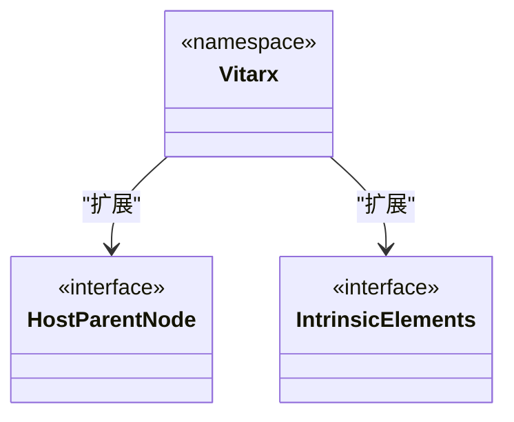
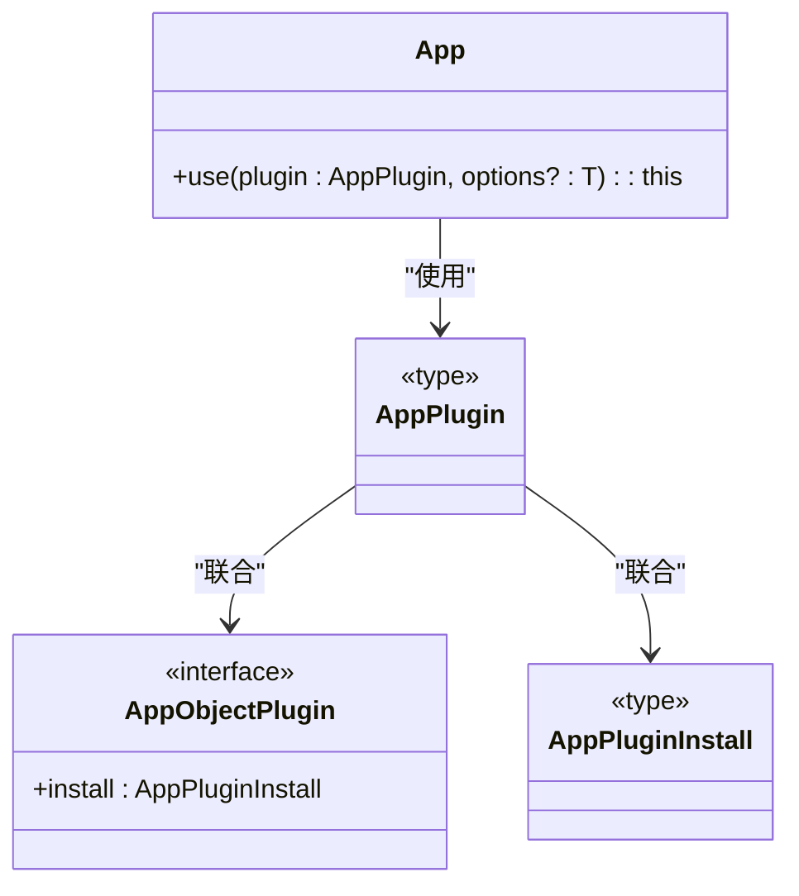

# TypeScript 类型支持

<cite>
**本文档引用的文件**  
- [App.ts](file://packages/runtime-core/src/app/App.ts)
- [global.ts](file://packages/runtime-core/src/types/global.ts)
- [directive.ts](file://packages/runtime-core/src/types/directive.ts)
- [widget.ts](file://packages/runtime-core/src/types/widget.ts)
- [element.ts](file://packages/runtime-core/src/types/element.ts)
- [core.ts](file://packages/runtime-core/src/directive/core.ts)
</cite>

## 目录
1. [插件类型定义](#插件类型定义)
2. [扩展 Vitarx 命名空间](#扩展-vitarx-命名空间)
3. [插件配置选项接口](#插件配置选项接口)
4. [声明全局方法和属性](#声明全局方法和属性)
5. [常见类型错误和模块增强](#常见类型错误和模块增强)

## 插件类型定义

在 Vitarx 框架中，插件系统通过 TypeScript 的泛型和联合类型提供了精确的类型推导和 IDE 支持。插件可以是函数或对象，必须提供一个 `install` 方法来安装插件。

插件类型定义的核心是 `AppPlugin<T>` 类型，它接受一个泛型参数 `T`，用于传递插件的配置选项。`AppPlugin<T>` 是 `AppObjectPlugin<T>` 和 `AppPluginInstall<T>` 的联合类型，允许插件以函数或对象的形式存在。

`AppPluginInstall<T>` 类型定义了插件安装函数的签名，它接受一个 `App` 实例和一个可选的配置对象 `T`。`AppObjectPlugin<T>` 接口定义了插件对象的结构，它必须有一个 `install` 方法，该方法的类型为 `AppPluginInstall<T>`。

通过这些类型定义，开发者可以编写具有完整类型推导的插件，确保在使用插件时获得最佳的开发体验。

**Section sources**
- [App.ts](file://packages/runtime-core/src/app/App.ts#L22-L59)

## 扩展 Vitarx 命名空间

Vitarx 框架使用 TypeScript 的声明合并（Declaration Merging）机制来扩展其全局命名空间 `Vitarx`。通过在 `declare global` 块中定义接口，可以向 `Vitarx` 命名空间添加新的类型和接口。

例如，`HostParentNode` 接口用于定义宿主平台父节点的类型，`IntrinsicElements` 接口用于定义允许渲染的元素类型。这些接口在基础包中定义，宿主平台特定包可以通过声明合并机制来扩展它们，以支持更多元素类型。



**Diagram sources **
- [global.ts](file://packages/runtime-core/src/types/global.ts#L13-L40)

**Section sources**
- [global.ts](file://packages/runtime-core/src/types/global.ts#L13-L40)

## 插件配置选项接口

插件的配置选项接口通过泛型传递到 `install` 函数中，确保配置对象的类型安全。插件开发者可以定义一个接口来描述配置选项的结构，然后在 `AppPlugin<T>` 类型中使用该接口作为泛型参数。

例如，一个插件可能需要一个 `apiUrl` 和 `timeout` 选项，可以定义如下接口：

```typescript
interface MyPluginOptions {
  apiUrl: string;
  timeout: number;
}
```

然后在插件类型定义中使用该接口：

```typescript
const myPlugin: AppPlugin<MyPluginOptions> = {
  install(app, options) {
    // 使用 options.apiUrl 和 options.timeout
  }
};
```

通过这种方式，插件的配置选项在使用时会得到完整的类型检查，避免了类型错误。

**Section sources**
- [App.ts](file://packages/runtime-core/src/app/App.ts#L22-L59)

## 声明全局方法和属性

在插件中声明新的全局方法或属性，并确保它们在 `App` 实例上正确推断，可以通过扩展 `App` 类的类型来实现。Vitarx 框架允许通过模块增强（Module Augmentation）来向 `App` 类添加新的方法和属性。

例如，要添加一个 `myMethod` 方法，可以在插件的类型定义文件中扩展 `App` 类：

```typescript
declare module '@vitarx/runtime-core' {
  interface App {
    myMethod(): void;
  }
}
```

然后在插件的 `install` 方法中实现该方法：

```typescript
const myPlugin: AppPlugin = {
  install(app) {
    app.myMethod = function() {
      // 实现方法逻辑
    };
  }
};
```

这样，`myMethod` 方法就会在 `App` 实例上正确推断，并在 IDE 中提供完整的类型支持。

**Section sources**
- [App.ts](file://packages/runtime-core/src/app/App.ts#L107-L393)

## 常见类型错误和模块增强

在使用 Vitarx 框架的插件系统时，可能会遇到一些常见的类型错误。例如，如果插件的 `install` 方法没有正确实现 `AppPluginInstall<T>` 类型的签名，TypeScript 编译器会报错。

模块增强是解决这些问题的关键。通过在 `declare global` 或 `declare module` 块中定义类型，可以向现有模块添加新的类型信息。这允许开发者扩展框架的类型定义，以支持自定义的插件和功能。

例如，如果需要向 `Vitarx` 命名空间添加一个新的指令，可以这样做：

```typescript
declare global {
  namespace Vitarx {
    interface DirectiveOptions {
      myDirective: {
        mounted(el: HTMLElement): void;
      };
    }
  }
}
```

然后在插件中注册该指令：

```typescript
app.directive('my-directive', {
  mounted(el) {
    // 实现指令逻辑
  }
});
```

通过这种方式，可以确保自定义指令在使用时得到完整的类型支持。



**Diagram sources **
- [App.ts](file://packages/runtime-core/src/app/App.ts#L22-L59)
- [directive.ts](file://packages/runtime-core/src/types/directive.ts#L4-L88)
- [core.ts](file://packages/runtime-core/src/directive/core.ts#L1-L329)

**Section sources**
- [App.ts](file://packages/runtime-core/src/app/App.ts#L22-L59)
- [global.ts](file://packages/runtime-core/src/types/global.ts#L13-L40)
- [directive.ts](file://packages/runtime-core/src/types/directive.ts#L4-L88)
- [core.ts](file://packages/runtime-core/src/directive/core.ts#L1-L329)