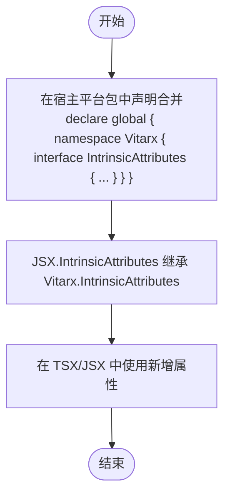

# 全局属性类型

<cite>
**本文引用的文件**
- [packages/runtime-core/src/types/global.ts](file://packages/runtime-core/src/types/global.ts)
- [packages/runtime-core/src/types/props.ts](file://packages/runtime-core/src/types/props.ts)
- [packages/runtime-core/src/constants/attributes.ts](file://packages/runtime-core/src/constants/attributes.ts)
- [packages/runtime-dom/src/types/attributes.ts](file://packages/runtime-dom/src/types/attributes.ts)
- [packages/runtime-dom/src/types/element.ts](file://packages/runtime-dom/src/types/element.ts)
- [packages/runtime-dom/src/types/global.ts](file://packages/runtime-dom/src/types/global.ts)
- [packages/runtime-core/src/app/App.ts](file://packages/runtime-core/src/app/App.ts)
- [packages/runtime-core/src/types/lifecycle.ts](file://packages/runtime-core/src/types/lifecycle.ts)
- [packages/vitarx/src/jsx-runtime.ts](file://packages/vitarx/src/jsx-runtime.ts)
- [packages/vitarx/src/jsx-dev-runtime.ts](file://packages/vitarx/src/jsx-dev-runtime.ts)
</cite>

## 目录
1. [引言](#引言)
2. [项目结构](#项目结构)
3. [核心组件](#核心组件)
4. [架构总览](#架构总览)
5. [详细组件分析](#详细组件分析)
6. [依赖关系分析](#依赖关系分析)
7. [性能考量](#性能考量)
8. [故障排查指南](#故障排查指南)
9. [结论](#结论)
10. [附录](#附录)

## 引言
本篇文档围绕 Vitarx 框架的“全局属性类型”能力展开，重点说明如何通过扩展 Vitarx.IntrinsicAttributes 为 JSX/TSX 提供全局属性的类型支持，如何定义插件所需的全局配置属性（如 errorHandler、idPrefix），以及如何在 App 实例上获得正确的类型推导。同时，结合源码中的类型定义与运行时实现，给出为插件注入的全局方法（如 $http、$router）编写类型定义的实践路径，并解释属性可选性、默认值处理及运行时与类型系统的协同工作方式。

## 项目结构
Vitarx 采用多包结构，其中与“全局属性类型”最相关的模块包括：
- runtime-core：定义 Vitarx.IntrinsicAttributes、JSX.IntrinsicAttributes、App 配置与生命周期错误处理类型
- runtime-dom：定义 HTML/SVG 元素属性类型、IntrinsicElements 映射、Host* 类型
- vitarx：JSX 运行时（jsx/jsxs）与开发模式运行时（jsxDEV）

图表来源
- [packages/runtime-core/src/types/global.ts](file://packages/runtime-core/src/types/global.ts#L151-L188)
- [packages/runtime-core/src/types/props.ts](file://packages/runtime-core/src/types/props.ts#L121-L188)
- [packages/runtime-core/src/constants/attributes.ts](file://packages/runtime-core/src/constants/attributes.ts#L16-L24)
- [packages/runtime-dom/src/types/attributes.ts](file://packages/runtime-dom/src/types/attributes.ts#L392-L651)
- [packages/runtime-dom/src/types/element.ts](file://packages/runtime-dom/src/types/element.ts#L1-L52)
- [packages/runtime-dom/src/types/global.ts](file://packages/runtime-dom/src/types/global.ts#L1-L21)
- [packages/runtime-core/src/app/App.ts](file://packages/runtime-core/src/app/App.ts#L216-L224)
- [packages/runtime-core/src/types/lifecycle.ts](file://packages/runtime-core/src/types/lifecycle.ts#L134-L139)
- [packages/vitarx/src/jsx-runtime.ts](file://packages/vitarx/src/jsx-runtime.ts#L1-L31)
- [packages/vitarx/src/jsx-dev-runtime.ts](file://packages/vitarx/src/jsx-dev-runtime.ts#L1-L45)

章节来源
- [packages/runtime-core/src/types/global.ts](file://packages/runtime-core/src/types/global.ts#L151-L188)
- [packages/runtime-core/src/types/props.ts](file://packages/runtime-core/src/types/props.ts#L121-L188)
- [packages/runtime-dom/src/types/element.ts](file://packages/runtime-dom/src/types/element.ts#L1-L52)
- [packages/runtime-dom/src/types/attributes.ts](file://packages/runtime-dom/src/types/attributes.ts#L392-L651)
- [packages/runtime-dom/src/types/global.ts](file://packages/runtime-dom/src/types/global.ts#L1-L21)
- [packages/runtime-core/src/app/App.ts](file://packages/runtime-core/src/app/App.ts#L216-L224)
- [packages/runtime-core/src/types/lifecycle.ts](file://packages/runtime-core/src/types/lifecycle.ts#L134-L139)
- [packages/vitarx/src/jsx-runtime.ts](file://packages/vitarx/src/jsx-runtime.ts#L1-L31)
- [packages/vitarx/src/jsx-dev-runtime.ts](file://packages/vitarx/src/jsx-dev-runtime.ts#L1-L45)

## 核心组件
- Vitarx.IntrinsicAttributes：框架内置的全局属性集合，包含 key、ref、v-show、v-bind、v-memo、v-static 等，且在 JSX.IntrinsicAttributes 中被扩展，确保 JSX 元素具备这些属性的类型支持。
- AppConfig：App 的全局配置接口，包含 errorHandler 与 idPrefix 两项可选配置，App 在初始化时提供默认值。
- HTMLIntrinsicElement 与 HTMLVoidElementMap：DOM 平台对 HTML/SVG 元素属性的类型映射，void 元素排除 children，普通元素包含 children。
- JSX 运行时：jsx/jsxs/jsxDEV 将 TSX/JSX 转换为 VNode，属性类型由 VNodeInputProps<T> & IntrinsicAttributes 推导。

章节来源
- [packages/runtime-core/src/types/props.ts](file://packages/runtime-core/src/types/props.ts#L121-L188)
- [packages/runtime-core/src/types/global.ts](file://packages/runtime-core/src/types/global.ts#L151-L188)
- [packages/runtime-dom/src/types/element.ts](file://packages/runtime-dom/src/types/element.ts#L1-L52)
- [packages/runtime-dom/src/types/attributes.ts](file://packages/runtime-dom/src/types/attributes.ts#L392-L651)
- [packages/vitarx/src/jsx-runtime.ts](file://packages/vitarx/src/jsx-runtime.ts#L1-L31)
- [packages/vitarx/src/jsx-dev-runtime.ts](file://packages/vitarx/src/jsx-dev-runtime.ts#L1-L45)

## 架构总览
下面的类图展示了 Vitarx.IntrinsicAttributes 与 JSX.IntrinsicAttributes 的关系，以及 App 配置与错误处理类型之间的协作。

图表来源
- [packages/runtime-core/src/types/props.ts](file://packages/runtime-core/src/types/props.ts#L121-L188)
- [packages/runtime-core/src/types/global.ts](file://packages/runtime-core/src/types/global.ts#L151-L188)
- [packages/runtime-core/src/app/App.ts](file://packages/runtime-core/src/app/App.ts#L216-L224)
- [packages/runtime-core/src/types/lifecycle.ts](file://packages/runtime-core/src/types/lifecycle.ts#L134-L139)

## 详细组件分析

### 1) 扩展 Vitarx.IntrinsicAttributes 以支持自定义指令或通用属性
- 框架内置的全局属性集合位于 runtime-core/types/props.ts 的 IntrinsicAttributes 接口，包含 key、ref、v-show、v-bind、v-memo、v-static 等。
- JSX.IntrinsicAttributes 通过 extends Vitarx.IntrinsicAttributes，确保 TSX/JSX 元素具备这些属性的类型支持。
- 若需要新增自定义指令或通用属性（例如 v-html、v-if 等），可在宿主平台包中对 Vitarx.IntrinsicAttributes 进行声明合并扩展，从而在 JSX 中获得类型提示与校验。

图表来源
- [packages/runtime-core/src/types/props.ts](file://packages/runtime-core/src/types/props.ts#L121-L188)
- [packages/runtime-core/src/types/global.ts](file://packages/runtime-core/src/types/global.ts#L211-L216)

章节来源
- [packages/runtime-core/src/types/props.ts](file://packages/runtime-core/src/types/props.ts#L121-L188)
- [packages/runtime-core/src/types/global.ts](file://packages/runtime-core/src/types/global.ts#L211-L216)

### 2) 定义插件所需的全局配置属性（AppConfig）
- AppConfig 定义了 errorHandler 与 idPrefix 两项可选配置，App 在初始化时提供默认值：
  - errorHandler 默认为日志记录器输出的错误处理函数
  - idPrefix 默认为 "v-"
- 插件可通过 app.use 安装，若插件需要全局配置项，可在插件安装函数中读取 app.config 并按需扩展。

图表来源
- [packages/runtime-core/src/app/App.ts](file://packages/runtime-core/src/app/App.ts#L216-L224)
- [packages/runtime-core/src/types/global.ts](file://packages/runtime-core/src/types/global.ts#L161-L178)

章节来源
- [packages/runtime-core/src/app/App.ts](file://packages/runtime-core/src/app/App.ts#L216-L224)
- [packages/runtime-core/src/types/global.ts](file://packages/runtime-core/src/types/global.ts#L161-L178)

### 3) 为插件注入的全局方法（如 $http、$router）编写类型定义
- 插件注入的全局方法通常通过 app.provide 与 app.inject 在组件上下文中使用。类型层面，可以在宿主平台包中对 Vitarx.RenderContext 或组件上下文类型进行扩展，以声明这些全局方法的类型签名。
- 由于 app.inject 支持默认值与工厂函数，类型定义可结合可选性与默认值处理，确保在组件中获得正确的类型推导。

图表来源
- [packages/runtime-core/src/app/App.ts](file://packages/runtime-core/src/app/App.ts#L307-L336)
- [packages/runtime-core/src/types/global.ts](file://packages/runtime-core/src/types/global.ts#L75-L78)

章节来源
- [packages/runtime-core/src/app/App.ts](file://packages/runtime-core/src/app/App.ts#L307-L336)
- [packages/runtime-core/src/types/global.ts](file://packages/runtime-core/src/types/global.ts#L75-L78)

### 4) 属性可选性、默认值处理与运行时协同
- 全局属性可选性：IntrinsicAttributes 中的 key、ref、v-show、v-bind、v-memo、v-static 均为可选，JSX 元素属性类型通过 VNodeInputProps<T> & IntrinsicAttributes 推导，保证属性可选。
- 默认值处理：App.initConfig 会将传入配置与默认值合并，未传入的字段使用默认值（如 errorHandler 默认日志记录器，idPrefix 默认 "v-"）。
- 运行时协同：JSX 运行时（jsx/jsxs/jsxDEV）将 TSX 转换为 VNode，属性类型由 VNodeInputProps<T> 推导，确保编译期类型安全与运行时一致。

图表来源
- [packages/vitarx/src/jsx-runtime.ts](file://packages/vitarx/src/jsx-runtime.ts#L1-L31)
- [packages/runtime-core/src/types/props.ts](file://packages/runtime-core/src/types/props.ts#L333-L335)
- [packages/runtime-core/src/app/App.ts](file://packages/runtime-core/src/app/App.ts#L216-L224)

章节来源
- [packages/vitarx/src/jsx-runtime.ts](file://packages/vitarx/src/jsx-runtime.ts#L1-L31)
- [packages/runtime-core/src/types/props.ts](file://packages/runtime-core/src/types/props.ts#L333-L335)
- [packages/runtime-core/src/app/App.ts](file://packages/runtime-core/src/app/App.ts#L216-L224)

### 5) HTML 元素属性类型与 void 元素处理
- HTMLIntrinsicElement 将 HTML/SVG 标签名映射到属性类型，void 元素（如 img、br、hr 等）排除 children 属性，普通元素包含 children。
- HTML 全局属性与事件属性由 HTMLElementProps 提供，CustomHTMLAttributes 支持任意自定义属性键。

图表来源
- [packages/runtime-dom/src/types/element.ts](file://packages/runtime-dom/src/types/element.ts#L1-L52)
- [packages/runtime-dom/src/types/attributes.ts](file://packages/runtime-dom/src/types/attributes.ts#L392-L651)

章节来源
- [packages/runtime-dom/src/types/element.ts](file://packages/runtime-dom/src/types/element.ts#L1-L52)
- [packages/runtime-dom/src/types/attributes.ts](file://packages/runtime-dom/src/types/attributes.ts#L392-L651)

## 依赖关系分析
- Vitarx.IntrinsicAttributes 与 JSX.IntrinsicAttributes：JSX.IntrinsicAttributes 通过 extends Vitarx.IntrinsicAttributes，确保 TSX/JSX 元素具备全局属性类型。
- INTRINSIC_ATTRIBUTES 常量：定义了框架内置的特殊属性集合，用于运行时处理与 diff 等场景。
- AppConfig 与 ErrorHandler：App.config 提供默认 errorHandler 与 idPrefix，ErrorHandler 类型定义了错误处理函数签名。

图表来源
- [packages/runtime-core/src/types/props.ts](file://packages/runtime-core/src/types/props.ts#L121-L188)
- [packages/runtime-core/src/types/global.ts](file://packages/runtime-core/src/types/global.ts#L151-L188)
- [packages/runtime-core/src/constants/attributes.ts](file://packages/runtime-core/src/constants/attributes.ts#L16-L24)
- [packages/runtime-core/src/app/App.ts](file://packages/runtime-core/src/app/App.ts#L216-L224)
- [packages/runtime-core/src/types/lifecycle.ts](file://packages/runtime-core/src/types/lifecycle.ts#L134-L139)

章节来源
- [packages/runtime-core/src/types/props.ts](file://packages/runtime-core/src/types/props.ts#L121-L188)
- [packages/runtime-core/src/types/global.ts](file://packages/runtime-core/src/types/global.ts#L151-L188)
- [packages/runtime-core/src/constants/attributes.ts](file://packages/runtime-core/src/constants/attributes.ts#L16-L24)
- [packages/runtime-core/src/app/App.ts](file://packages/runtime-core/src/app/App.ts#L216-L224)
- [packages/runtime-core/src/types/lifecycle.ts](file://packages/runtime-core/src/types/lifecycle.ts#L134-L139)

## 性能考量
- 全局属性类型推导基于 VNodeInputProps 与 IntrinsicAttributes 的联合类型，避免在运行时重复计算属性类型，提升编译期类型检查效率。
- 使用 v-memo 与 v-static 等内置指令可减少不必要的节点更新与渲染，配合类型系统确保指令使用正确。

## 故障排查指南
- 错误处理：若未提供 errorHandler，App 将使用默认的日志记录器输出未捕获异常。可在 App 配置中提供自定义 errorHandler，以满足业务需求。
- idPrefix：若 idPrefix 未提供，将使用默认 "v-"。插件或业务侧可通过 app.config.idPrefix 进行统一配置。
- 插件注入：若插件注入的全局方法在组件中无法获得类型推导，检查宿主平台包是否对 Vitarx.RenderContext 或组件上下文进行了类型扩展。

章节来源
- [packages/runtime-core/src/app/App.ts](file://packages/runtime-core/src/app/App.ts#L61-L68)
- [packages/runtime-core/src/app/App.ts](file://packages/runtime-core/src/app/App.ts#L216-L224)
- [packages/runtime-core/src/types/global.ts](file://packages/runtime-core/src/types/global.ts#L75-L78)

## 结论
通过在宿主平台包中对 Vitarx.IntrinsicAttributes 进行声明合并扩展，即可为 JSX/TSX 提供全局属性与自定义指令的类型支持。App 的 AppConfig 为插件提供了统一的全局配置入口，结合 errorHandler 与 idPrefix 的默认值与可选性设计，既保证了类型安全，也兼顾了灵活性。配合 JSX 运行时与 HTML 元素属性类型体系，开发者可以为插件注入的全局方法（如 $http、$router）编写完善的类型定义，并在组件中获得准确的类型推导与运行时协同。

## 附录
- 关键类型与常量参考路径
  - [Vitarx.IntrinsicAttributes](file://packages/runtime-core/src/types/props.ts#L121-L188)
  - [JSX.IntrinsicAttributes](file://packages/runtime-core/src/types/global.ts#L211-L216)
  - [AppConfig](file://packages/runtime-core/src/types/global.ts#L161-L178)
  - [App.initConfig](file://packages/runtime-core/src/app/App.ts#L216-L224)
  - [HTMLIntrinsicElement](file://packages/runtime-dom/src/types/element.ts#L1-L52)
  - [HTMLElementProps](file://packages/runtime-dom/src/types/attributes.ts#L392-L651)
  - [JSX 运行时](file://packages/vitarx/src/jsx-runtime.ts#L1-L31)
  - [JSX 开发运行时](file://packages/vitarx/src/jsx-dev-runtime.ts#L1-L45)