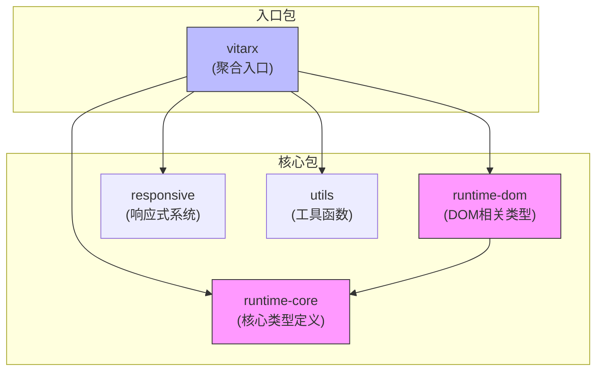
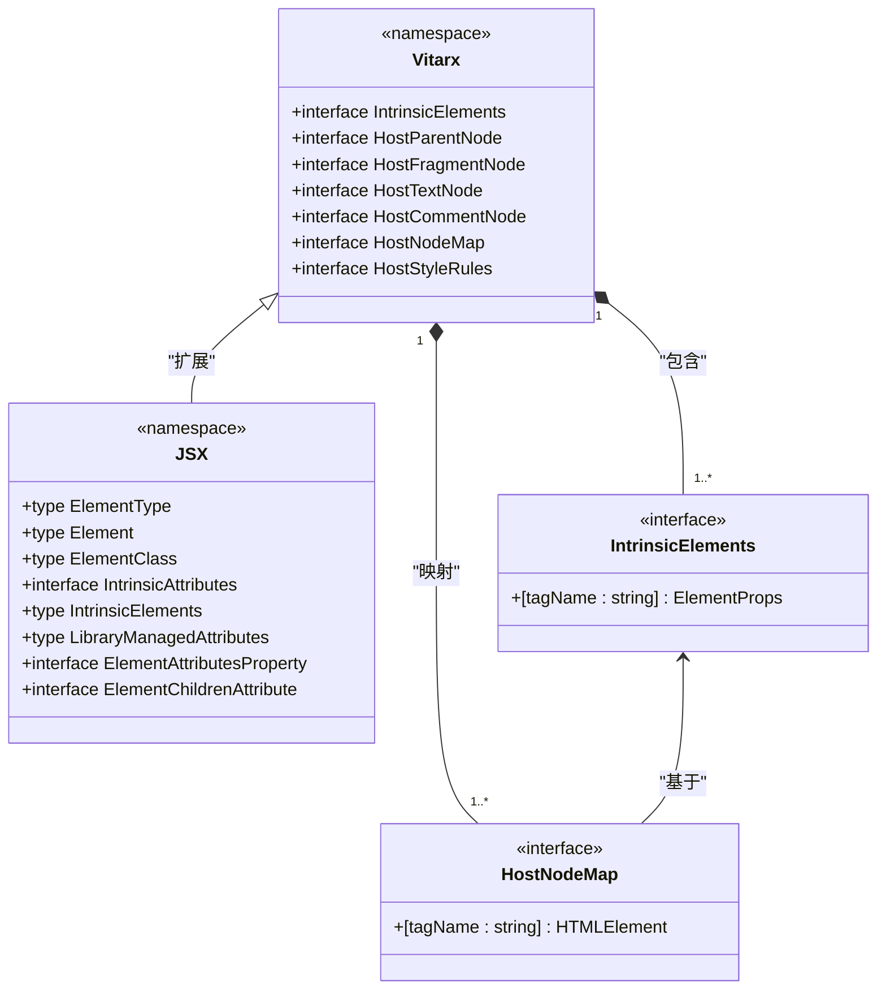
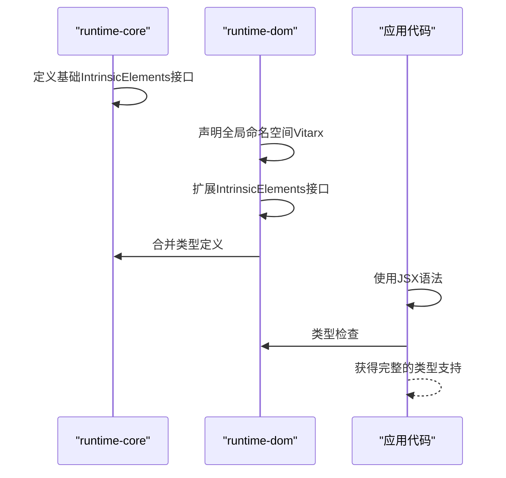
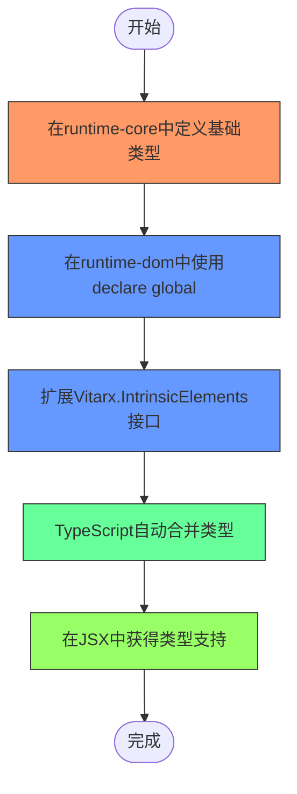
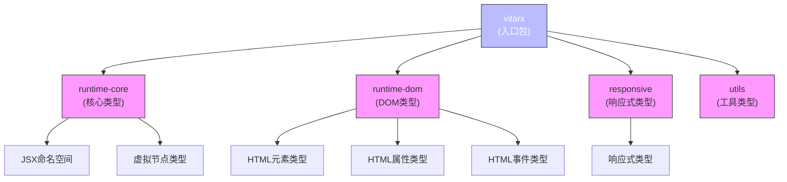

# 命名空间扩展

<cite>
**本文档引用的文件**   
- [global.ts](file://packages/runtime-dom/src/types/global.ts)
- [element.ts](file://packages/runtime-dom/src/types/element.ts)
- [attributes.ts](file://packages/runtime-dom/src/types/attributes.ts)
- [global.ts](file://packages/runtime-core/src/types/global.ts)
- [vnode.ts](file://packages/runtime-core/src/types/vnode.ts)
- [jsx-runtime.ts](file://packages/vitarx/src/jsx-runtime.ts)
- [index.ts](file://packages/vitarx/src/index.ts)
</cite>

## 目录
1. [介绍](#介绍)
2. [项目结构](#项目结构)
3. [核心组件](#核心组件)
4. [架构概述](#架构概述)
5. [详细组件分析](#详细组件分析)
6. [依赖分析](#依赖分析)
7. [性能考虑](#性能考虑)
8. [故障排除指南](#故障排除指南)
9. [结论](#结论)

## 介绍
本文档详细说明了如何通过 TypeScript 的模块增强和命名空间合并机制扩展 Vitarx 的全局类型定义。重点解释了 `declare global` 语法的使用场景和注意事项，展示了如何在插件中安全地扩展 `Vitarx.IntrinsicElements` 以支持自定义元素或组件。文档提供了实际代码示例，演示了如何为第三方组件库添加类型声明，并确保与 JSX 语法正确集成。同时，文档还解决了命名空间合并失败、类型重复定义等常见问题，并说明了如何在多包项目中正确组织类型扩展代码。

## 项目结构
Vitarx 项目采用多包架构，核心类型定义分布在多个包中。主要的类型定义位于 `runtime-core` 和 `runtime-dom` 包中，通过 TypeScript 的声明合并机制实现类型扩展。`vitarx` 包作为入口点，聚合了所有子包的导出。



**Diagram sources**
- [index.ts](file://packages/vitarx/src/index.ts)
- [package.json](file://packages/vitarx/package.json)

**Section sources**
- [index.ts](file://packages/vitarx/src/index.ts)
- [package.json](file://packages/vitarx/package.json)

## 核心组件
Vitarx 框架的核心类型系统基于 TypeScript 的声明合并机制，通过 `declare global` 语法扩展全局命名空间。框架在 `runtime-core` 包中定义了基础的全局类型，然后在 `runtime-dom` 包中通过声明合并添加 DOM 特定的类型。

**Section sources**
- [global.ts](file://packages/runtime-core/src/types/global.ts)
- [global.ts](file://packages/runtime-dom/src/types/global.ts)

## 架构概述
Vitarx 的类型系统架构采用分层设计，基础类型在 `runtime-core` 中定义，平台特定类型在相应的运行时包中通过声明合并扩展。这种设计允许框架支持多种渲染目标（如 DOM、SSR、Native 等），同时保持类型系统的灵活性和可扩展性。



**Diagram sources**
- [global.ts](file://packages/runtime-core/src/types/global.ts)
- [global.ts](file://packages/runtime-dom/src/types/global.ts)

## 详细组件分析
### 全局命名空间扩展分析
Vitarx 框架通过 TypeScript 的声明合并机制扩展全局命名空间，允许在不同包中安全地扩展类型定义。这种机制特别适用于 `Vitarx.IntrinsicElements` 接口，它定义了框架支持的固有元素类型。

#### 声明合并机制


**Diagram sources**
- [global.ts](file://packages/runtime-core/src/types/global.ts)
- [global.ts](file://packages/runtime-dom/src/types/global.ts)

#### 类型扩展实现


**Diagram sources**
- [global.ts](file://packages/runtime-dom/src/types/global.ts)
- [element.ts](file://packages/runtime-dom/src/types/element.ts)

**Section sources**
- [global.ts](file://packages/runtime-dom/src/types/global.ts)
- [element.ts](file://packages/runtime-dom/src/types/element.ts)

### JSX 类型集成分析
Vitarx 框架通过 JSX 命名空间集成，确保类型系统与 JSX 语法完美配合。框架利用 TypeScript 的 JSX 类型机制，为 JSX 元素提供完整的类型检查和智能提示。

#### JSX 类型映射
```mermaid
erDiagram
Vitarx ||--o{ IntrinsicElements : "包含"
IntrinsicElements }|--o HostNodeMap : "映射到"
IntrinsicElements }|--o HTMLIntrinsicElement : "继承"
HTMLIntrinsicElement }|--o HTMLElementProps : "使用"
HTMLElementProps }|--o HTMLStyleRules : "包含"
HTMLElementProps }|--o HTMLElementEvents : "包含"
class Vitarx {
namespace Vitarx
}
class IntrinsicElements {
interface IntrinsicElements
}
class HostNodeMap {
interface HostNodeMap
}
class HTMLIntrinsicElement {
type HTMLIntrinsicElement
}
class HTMLElementProps {
type HTMLElementProps
}
class HTMLStyleRules {
type HTMLStyleRules
}
class HTMLElementEvents {
type HTMLElementEvents
}
```

**Diagram sources**
- [global.ts](file://packages/runtime-core/src/types/global.ts)
- [element.ts](file://packages/runtime-dom/src/types/element.ts)
- [attributes.ts](file://packages/runtime-dom/src/types/attributes.ts)

**Section sources**
- [global.ts](file://packages/runtime-core/src/types/global.ts)
- [element.ts](file://packages/runtime-dom/src/types/element.ts)
- [attributes.ts](file://packages/runtime-dom/src/types/attributes.ts)

## 依赖分析
Vitarx 的类型系统依赖于多个包的协同工作，通过声明合并机制实现类型扩展。这种设计模式允许框架在保持核心简洁的同时，支持丰富的类型功能。



**Diagram sources**
- [index.ts](file://packages/vitarx/src/index.ts)
- [package.json](file://packages/vitarx/package.json)

**Section sources**
- [index.ts](file://packages/vitarx/src/index.ts)
- [package.json](file://packages/vitarx/package.json)

## 性能考虑
虽然类型系统本身不影响运行时性能，但合理的类型设计可以提高开发效率和代码质量。Vitarx 的类型系统通过以下方式优化开发体验：

1. **类型推断优化**：通过精确的类型定义，减少类型断言的需要
2. **智能提示**：为 JSX 元素提供完整的属性和事件提示
3. **错误预防**：在编译时捕获常见的类型错误
4. **文档集成**：类型定义中包含详细的 JSDoc 注释

这些优化措施虽然不直接影响运行时性能，但可以显著提高开发效率和代码可靠性。

## 故障排除指南
在使用 Vitarx 的类型扩展功能时，可能会遇到一些常见问题。以下是这些问题的解决方案：

**Section sources**
- [global.ts](file://packages/runtime-core/src/types/global.ts)
- [global.ts](file://packages/runtime-dom/src/types/global.ts)

### 命名空间合并失败
当命名空间合并失败时，通常是由于类型定义冲突或模块解析问题。解决方案包括：

1. 确保所有相关包都正确安装和导入
2. 检查 tsconfig.json 中的 paths 配置
3. 确保类型定义文件被正确包含在编译上下文中

### 类型重复定义
类型重复定义通常是由于多个包导出了相同的类型。解决方案包括：

1. 使用 declare global 而不是重新定义接口
2. 确保类型扩展是增量的，而不是覆盖式的
3. 使用 TypeScript 的模块解析规则来管理类型可见性

### JSX 类型不完整
当 JSX 类型不完整时，可能是由于类型扩展未正确合并。解决方案包括：

1. 检查全局命名空间声明的语法
2. 确保所有必要的类型文件都被包含
3. 验证类型扩展的继承关系

## 结论
Vitarx 框架通过 TypeScript 的声明合并机制，实现了灵活而强大的类型系统。这种设计模式允许框架在核心包中定义基础类型，然后在特定运行时包中安全地扩展这些类型。通过 `declare global` 语法，开发者可以为第三方组件库添加类型声明，并确保与 JSX 语法正确集成。这种架构不仅提高了类型系统的可扩展性，还为开发者提供了完整的类型安全和智能提示功能。