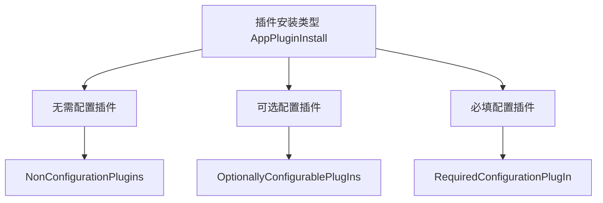
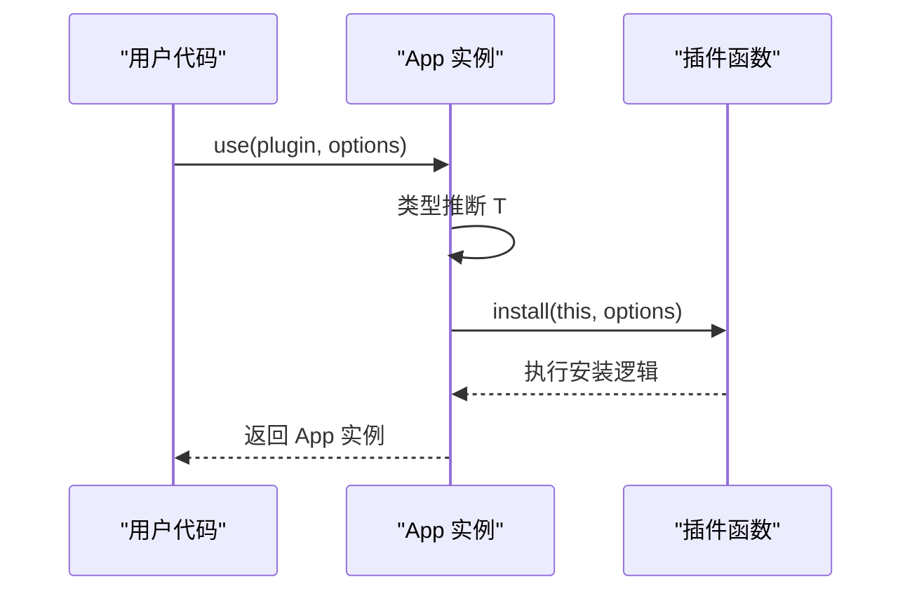
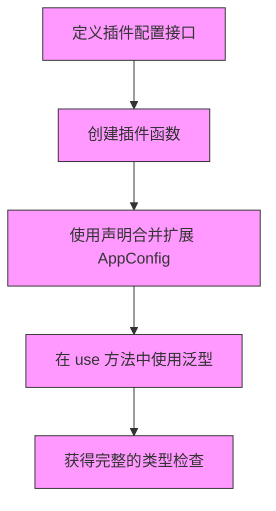

# 插件配置类型

<cite>
**本文档引用的文件**   
- [App.ts](file://packages/runtime-core/src/app/App.ts)
- [global.ts](file://packages/runtime-core/src/types/global.ts)
</cite>

## 目录
1. [引言](#引言)
2. [插件配置类型设计](#插件配置类型设计)
3. [泛型参数在插件系统中的应用](#泛型参数在插件系统中的应用)
4. [AppConfig 接口定义与扩展](#appconfig-接口定义与扩展)
5. [实际案例分析](#实际案例分析)
6. [最佳实践与开发建议](#最佳实践与开发建议)

## 引言

Vitarx 框架提供了一套完整的插件系统，允许开发者通过 `use` 方法安装插件并传递配置选项。该系统利用 TypeScript 的泛型和接口合并机制，实现了类型安全的配置接口设计。通过这种方式，插件作者可以定义严格的配置模式，防止用户传入无效或不安全的选项，并在开发过程中获得 IDE 的智能提示支持。

**Section sources**
- [App.ts](file://packages/runtime-core/src/app/App.ts#L1-L50)

## 插件配置类型设计

Vitarx 框架中的插件配置类型设计基于 TypeScript 的泛型和接口特性。核心类型包括 `AppPluginInstall`、`AppObjectPlugin` 和 `AppPlugin`，它们共同构成了插件系统的类型基础。

`AppPluginInstall<T>` 类型定义了插件安装函数的签名，支持三种配置模式：无需配置、可选配置和必填配置。这种设计使得插件可以灵活地适应不同的使用场景。



**Diagram sources **
- [App.ts](file://packages/runtime-core/src/app/App.ts#L22-L37)

**Section sources**
- [App.ts](file://packages/runtime-core/src/app/App.ts#L22-L50)

## 泛型参数在插件系统中的应用

Vitarx 框架通过泛型参数将插件配置类型传递给 `install` 函数，确保配置项在调用时获得完整的类型检查。`use` 方法的重载定义展示了如何利用泛型实现类型安全：



**Diagram sources **
- [App.ts](file://packages/runtime-core/src/app/App.ts#L343-L392)

**Section sources**
- [App.ts](file://packages/runtime-core/src/app/App.ts#L343-L392)

## AppConfig 接口定义与扩展

`AppConfig` 接口是 Vitarx 框架中应用配置的核心类型，通过命名空间合并机制允许插件扩展全局配置。接口定义位于 `global.ts` 文件中：

```typescript
interface AppConfig {
  errorHandler?: ErrorHandler
  idPrefix?: string
}
```

插件作者可以通过声明合并来扩展此接口，将插件的特定选项（如 API 地址、认证令牌）添加到全局配置中。这种设计模式使得插件配置能够无缝集成到应用的整体配置体系中。

```mermaid
classDiagram
class AppConfig {
+errorHandler? : ErrorHandler
+idPrefix? : string
}
class PluginConfig {
+apiUrl : string
+token : string
}
AppConfig <|-- ExtendedAppConfig
note right of AppConfig
通过声明合并扩展
end note
```

**Diagram sources **
- [global.ts](file://packages/runtime-core/src/types/global.ts#L161-L178)

**Section sources**
- [global.ts](file://packages/runtime-core/src/types/global.ts#L161-L178)

## 实际案例分析

以下是一个实际的插件配置案例，展示了如何定义类型安全的插件配置接口：



**Diagram sources **
- [App.ts](file://packages/runtime-core/src/app/App.ts)
- [global.ts](file://packages/runtime-core/src/types/global.ts)

**Section sources**
- [App.ts](file://packages/runtime-core/src/app/App.ts#L19-L50)
- [global.ts](file://packages/runtime-core/src/types/global.ts#L161-L178)

## 最佳实践与开发建议

在设计 Vitarx 插件时，应遵循以下最佳实践：

1. **使用严格的接口定义**：为插件配置定义明确的接口，避免使用 `any` 或宽松的类型。
2. **利用声明合并**：通过命名空间合并扩展 `AppConfig` 接口，使插件配置成为全局配置的一部分。
3. **提供默认值**：为可选配置项提供合理的默认值，简化用户使用。
4. **类型推断优化**：设计 API 时考虑 TypeScript 的类型推断能力，减少用户显式指定类型的需要。

这些实践确保了插件的类型安全性，同时提供了良好的开发者体验。

**Section sources**
- [App.ts](file://packages/runtime-core/src/app/App.ts)
- [global.ts](file://packages/runtime-core/src/types/global.ts)